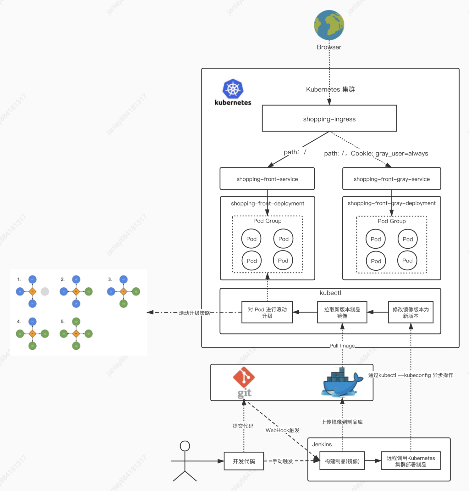

### 什么是CI/CD，为什么要学CI/CD

#### 什么是CI/CD

古老的构建部署流程，需要经历以下步骤：

1. 开发人员将源代码，经过编译、压缩等一系列流程打包为**制品**（打包后的成品）
2. 将制品上传到服务器
3. 在服务器将编译后的文件手动放入可用的容器服务内（如`Nginx`、`tomcat`，`apache`等）

这种流程不仅繁琐，而且容易出错，非常影响开发部署效率。

`CI`的意思是`持续构建`。负责拉取代码库中的代码后，执行用户预置定义好的操作脚本，通过一系列编译操作构建出一个`制品`，并将制品推送至制品库里面。常用工具有Gitlab CI，GitHub CI，Jenkins等。这个环节不参与部署，只负责构建代码，然后保存构建物。构建物被称为`制品`，保存制品的地方被称为“制品库”。

`CD`有2层含义：持续部署（Continuous Deployment）和持续交付（Continuous Delivery）。`持续交付`的概念是：将制品库的制品拿出后，部署在测试环境/交付给客户提前测试；`持续部署`则是将制品部署在生产环境。持续部署的工具也有很多：`Ansible`批量部署，`Docker`直接推拉镜像，也包括`Kubernates`集群部署。

#### 为什么要学CI/CD

对操作系统，对实际的构建部署，甚至对工程化有全新的认识，甚至可以提出建议，如何更好的优化这些流程。从更高的角度看整个项目的全貌，甚至突破思维天花板。

#### 小册整体架构设计

不包含单元测试和代码扫描环节，只关注构建和部署环节。

流程说明：

1. 你写完了代码，提交到了`git`代码库
2. 随后代码库配置的`WebHook`钩子或人工手动启动了`Jenkins`的构建流程
3. `Jenkins`启动构建流程，按照你之前配置好的构建脚本，将代码编译成功
4. 编译成功后，将编译后的文件打包为`docker`镜像，并将镜像上传到私有镜像库
5. 随后，使用`kubectl`指定远程的k8s集群，发送镜像版本更新指令
6. 远程的k8s集群接收到指令后，去镜像库拉取新镜像
7. 镜像拉取成功，按照升级策略（滚动升级）进行升级，此时不会停机
8. 升级完毕

#### 服务器搭配方案

本人练习使用全本地虚拟机Parallels Desktop

| 配置  | 技术栈               | 类型       | 标签              |
| ----- | -------------------- | ---------- | ----------------- |
| 2核4G | Jenkins+Nexus+Docker | 本地虚拟机 | 构建机            |
| 2核4G | Docker+Kubernetes    | 本地虚拟机 | Kubernetes Master |
| 1核1G | Docker+Kubernetes    | 本地虚拟机 | Kubernetes Node   |

系统使用CentOS 7

