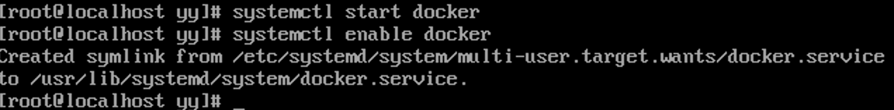
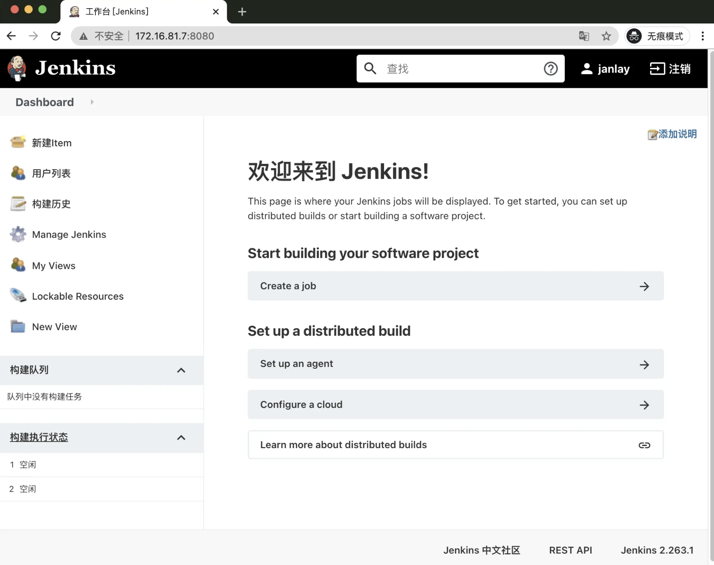

## 安装Docker和Jekins：持续构建环境起步

### Docker

#### 1. 什么是Docker

`Docker`是一个开源的应用容器引擎。

开发者可以将自己的应用打包在自己的镜像里面，然后迁移到其他平台的`Docker`中。镜像中可以存放你自己自定义的运行环境、文件、代码、设置等等内容，再也不同担心环境造成的运行问题。

镜像共享运行机器的系统内核。（封装的进程？数据+资源）

`Docker`支持跨平台，你的镜像也可以加载在`windows`和`linux`，实现快速运行和部署。

`Docker`的优势在于快速、轻量、灵活。开发者可以制作一个自己自定义的镜像，也可以使用官方或者其他开发者的镜像来启动一个服务。通过将镜像创建为容器，容器之间相互隔离资源和进程不冲突，但硬件资源又是共享的。创建的镜像可以通过文件快速分享，也可以上传到镜像库进行存取和管理。

同时`Docker`的镜像有`分层策略`，每次对镜像的更新操作，都会堆叠一个新层。当你拉取/推动新版本镜像时，只推送/拉取修改的部分，大大加快了镜像的传输效率。

#### 2. Docker在CI/CD中的作用

`Docker`贯穿`CI/CD`中整个流程，作为应用服务的载体有着非常重要的地位。

可以使用`Docker`将应用打包成一个镜像，交给`Kubernetes`去部署在目标服务集群。并且可以将镜像上传到自己的镜像仓库，做好版本分类处理。

#### 3. 安装Docker

在开始安装之前，需要安装`device-mapper-persistent-data`和`lvm2`两个依赖。

> `device-mapper-persistent-data`是`Linux`下的一个存储驱动，`Linux`上的高级存储技术。`lvm`的作用则是创建逻辑磁盘分区。

这里使用`CentOS`的`Yum`包管理器安装两个依赖：

`yum install -y yum-utils device-mapper-persistent-data lvm2`

依赖安装完毕后，将阿里云的`Docker`镜像源添加进去。可以加速`Docker`的安装：

`sudo yum-config-manager --add-repo http://mirrors.aliyun.com/docker-ce/linux/centos/docker-ce.repo`

`yum install docker-ce -y`


安装完毕，就可以使用`systemctl`命令来启动`Docker`了。`systemctl`是`Linux`的进程管理服务命令，可以帮助我们启动`docker`。

`systemctl start docker`

`systemctl enable docker`



接着执行一下`docker -v`，可以用来查看`Docker`安装的版本信息。也可以帮助我们查看`docker`的安装状态；如果正常展示版本信息，代表`Docker`已经安装成功。

**关于配置阿里云镜像源**

在`Docker`安装完毕后，之后我们去拉取`docker`镜像时，一般默认会去`docker`官方源拉取镜像。但是外网比较慢，所以更换为`阿里云镜像仓库`源进行镜像下载加速。

登录阿里云官网，打开[阿里云容器镜像服务](https://cr.console.aliyun.com)，点击左侧菜单最下面的`镜像加速器`，选择`CentOS`，按照官网的提示执行命令，即可更换`docker`镜像源地址。

```shell
mkdir -p /etc/docker
tee /etc/docker/daemon.json <<-'EOF'
{
	"registry-mirrors": ["https://***.mirror.aliyuncs.com"]
}
EOF
```


### Jenkins

安装完`Docker`后，我们只是拥有了一个可以承载服务的载体。想实现自动化构建，还需要安装一个构建工具`Jenkins`。

#### 1. 什么是Jenkins

`Jenkins`是一个基于`Java`语言开发的持续构建工具平台，主要用于持续、自动地构建/测试你的软件和项目。它可以执行你预先设定好的设置和构建脚本，也可以和Git代码库做集成，实现自动触发和定时触发构建。

#### 2. 安装OpenJDK

因为`Jenkins`是`Java`编写的持续构建平台，所以安装`Java`必不可少。

`openjdk`是`SunJDK`的一种开源实现。[openjdk和sunjdk的具体区别](https://www.zhihu.com/question/19646618)。直接使用`yum`包管理器安装`openjdk`即可。

`yum install -y java`

#### 3. 使用yum安装Jenkins

由于`yum`源不自带`Jenkins`的安装源，我们需要自己导入一份`Jenkins`安装源进行安装。导入后，使用`yum`命令安装即可。

```shell
wget -O /etc/yum.repos.d/jenkins.repo https://pkg.jenkins.io/redhat-stable/jenkins.repo
rpm --import https://pkg.jenkins.io/redhat-stable/jenkins.io.key
yum install jenkins
```

wget后面的参数是大写O

#### 4. 启动Jenkins

`Jenkins`安装后，会将启动命令注册到系统`Service`命令中。所以直接使用系统`service`命令启动`Jenkins`即可。有三个命令可以使用，分别对应启动/重启/停止。

```shell
service jenkins start # 启动Jenkins
# service jenkins restart # 重启Jenkins
# service jenkins stop    # 停止Jenkins
```


#### 5. 给Jenkins放行端口

在启动`Jenkins`后，`Jenkins`会开启它的默认端口8080。但由于防火墙限制，我们需要手动让防火墙放行8080端口才能对外访问到界面。

这里我们在`CentOS`下的`firewall-cmd`防火墙添加端口放行规则，添加完后重启防火墙。

```shell
firewall-cmd --zone=public --add-port=8080/tcp --permanent
firewall-cmd --zone=public --add-port=50000/tcp --permanent

systemctl reload firewalld
```


服务启动后，访问`IP:8080`。`Jenkins`第一次启动时间一般比较长（看服务器性能）


#### 6. 初始化Jenkins配置

##### 6.1 解锁Jenkins

在`Jenkins`启动完成后，会自动跳转至下面这个界面。这是`Jenkins`的解锁界面，你需要输入存放在服务器的初始解锁密码才能进行下一步操作。


`Jenkins`启动后，会生成一个初始密码。该密码在服务器的文件内存放，我们可以进入服务器查看密码内容，将密码填写在`Jenkins`的管理员密码输入框内：

`cat /var/lib/jenkins/secrets/initialAdminPassword`

点击`继续`按钮，解锁Jenkins。

##### 6.2 下载插件

解锁后就到了插件下载页面，这一步要下载一些`Jenkins`的功能插件。


因为`Jenkins`插件服务器在国外，所以速度不太理想。需要更换为清华大学的`Jenkins`插件源，再安装插件。

更换方法：进入服务器，将`/var/lib/jenkins/updates/default.json`内的插件源地址替换成清华大学的源地址，将google替换为baidu即可。

```shell
sed -i 's/http:\/\/updates.jenkins-ci.org\/download/https:\/\/mirrors.tuna.tsinghua.edu.cn\/jenkins/g' /var/lib/jenkins/updates/default.json && sed -i 's/http:\/\/www.google.com/https:\/\/www.baidu.com/g' /var/lib/jenkins/updates/default.json
```

接着点击`安装推荐的插件`即可。


#### 7. 完成安装

插件安装完毕后，接着是注册管理员账号。按照提示一路配置后，直到看到以下界面代表安装成功。



#### 8. 测试安装

到这里Jenkins算是启动成功了。但是还需要对`Jenkins`做一点简单的配置，才可以让它构建`docker`镜像。

点击`Jenkins`首页->左侧导航->新建任务->Freestyle project

新建完毕后，找到`构建`一项，选择`增加构建步骤`，选择`执行shell`，输入以下命令：

```shell
docker -v
docker pull node:latest
```

该命令会去拉取一个`nodejs`稳定版的镜像，我们可以来测试`Docker`的可用性

保存后，我们点击左侧菜单的**立即构建**，`Jenkins`就会开始构建。选择左侧历史记录第一项（最新），点击控制台输出，查看构建日志。


执行后，发现提示无访问权限。这里就涉及到`Linux`下的`Unix Socket`权限问题

#### 9. Unix Socket权限问题

`docker`的架构是`C/S`架构。使用`docker`命令时，其实是命令使用`socket`与`docker`的守护进程进行通信，才能正常执行`docker`命令。

而在`Linux`中，`Unix socket`属于`root`用户，因此需要`root`权限才能访问。官方的解释：

> Manage Docker as a non-root user The docker daemon binds to a Unix socket instead of a TCP port. By default that Unix socket is owned by the user root and other users can only access it using sudo. The docker daemon always runs as the root user. If you don’t want to use sudo when you use the docker command, create a Unix group called docker and add users to it. When the docker daemon starts, it makes the ownership of the Unix socket read/writable by the docker group.

在`docker`中，`docker`提供了一个`用户组`的概念。我们可以将执行`Shell`的用户添加到名称为`docker`的用户组，则可以正常执行`docker`命令。

在`Jenkins`中执行的终端用户为`jenkins`，所以我们只需要将`jenkins`加入到`docker`用户组即可：

```shell
groupadd docker            # 新增docker用户组
gpasswd -a jenkins docker  # 将当前用户添加至docker用户组
newgrp docker              # 更新docker用户组
```

加入后，重启`Jenkins`:

`service jenkins restart`

重启`Jenkins`后，再次执行脚本，此时执行成功。


jenkins账号密码：admin d48ff41b60834e91a87bf8788217863e

虚拟机账号密码：yy 123456