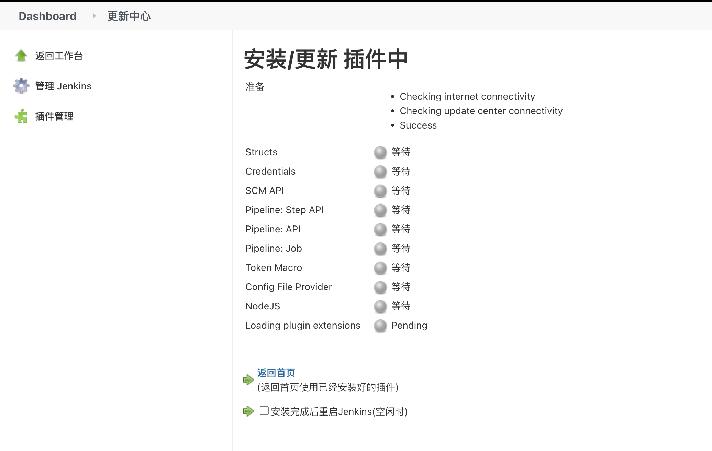
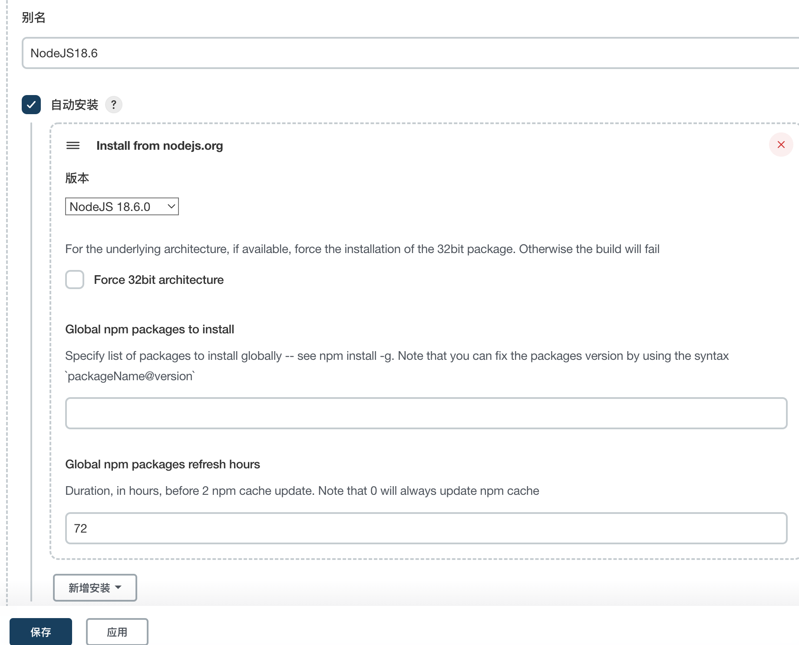
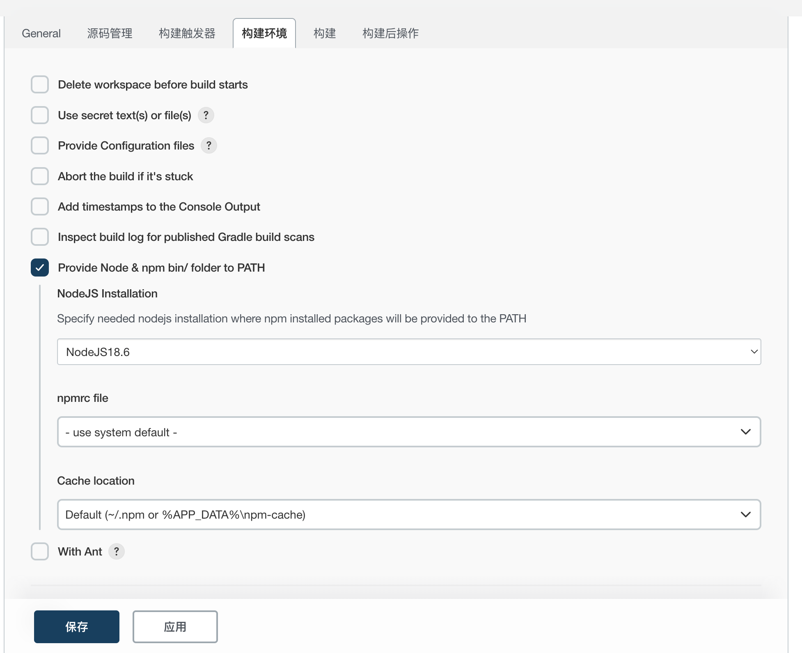
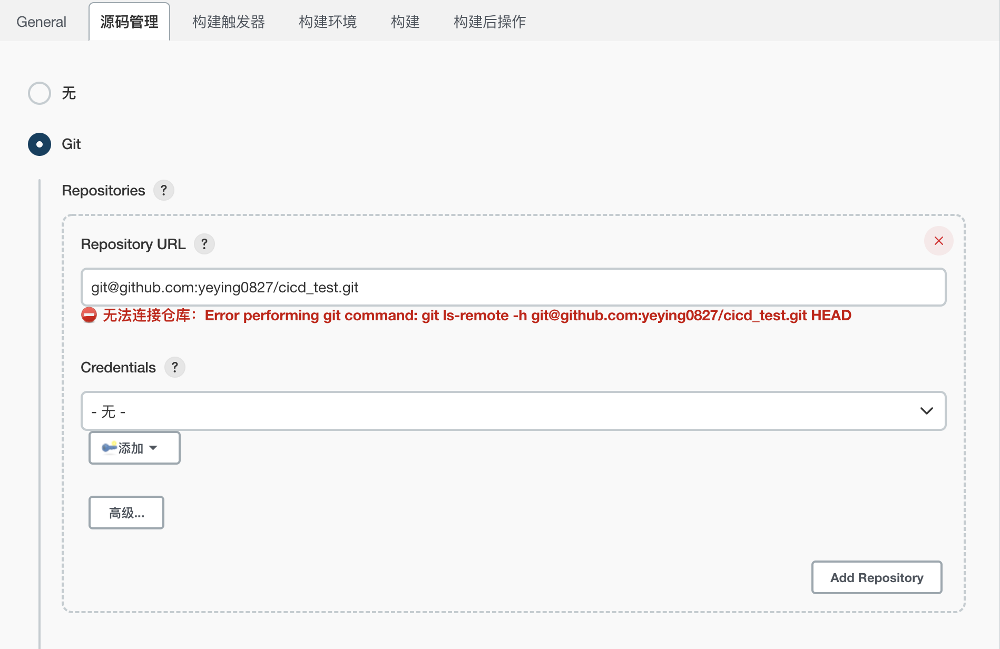
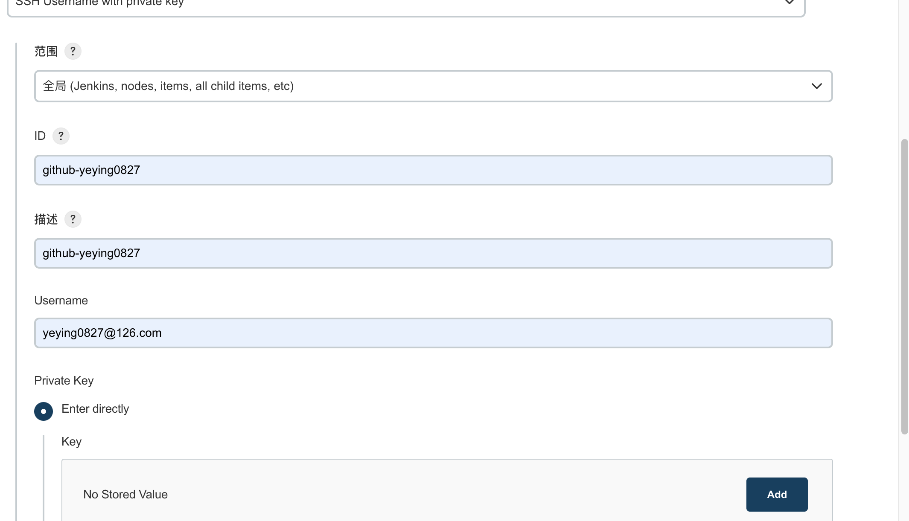
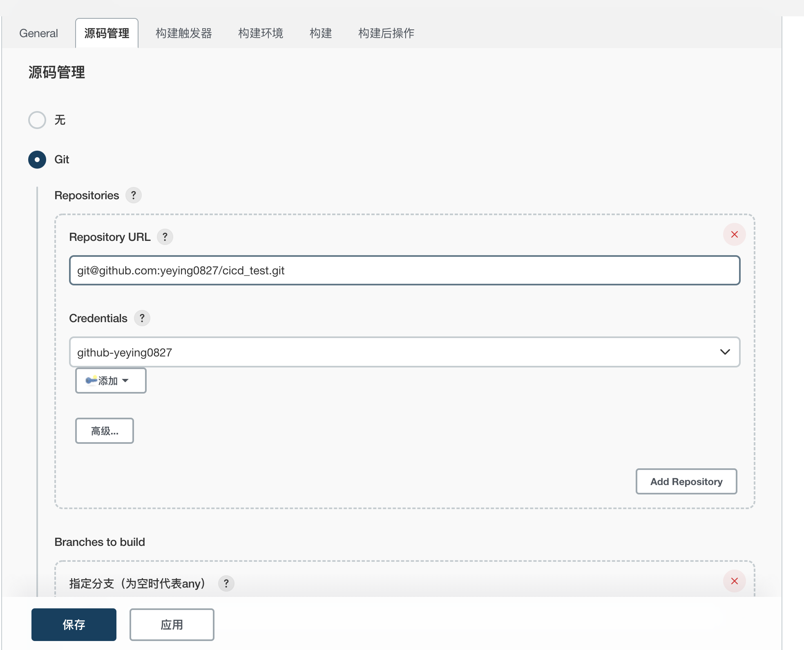
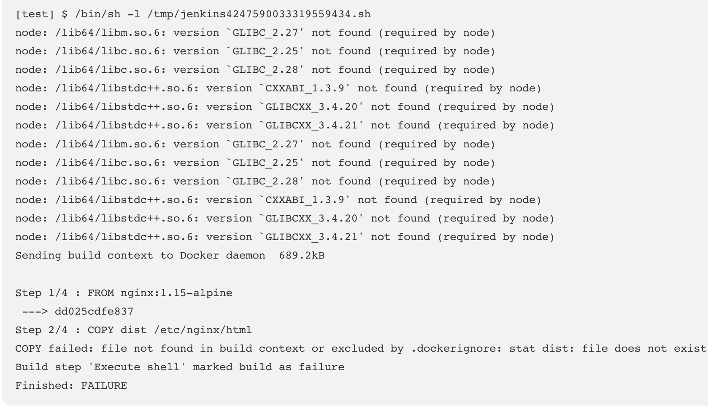
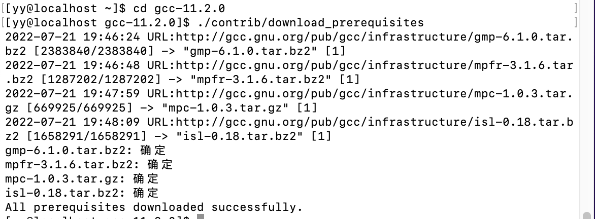
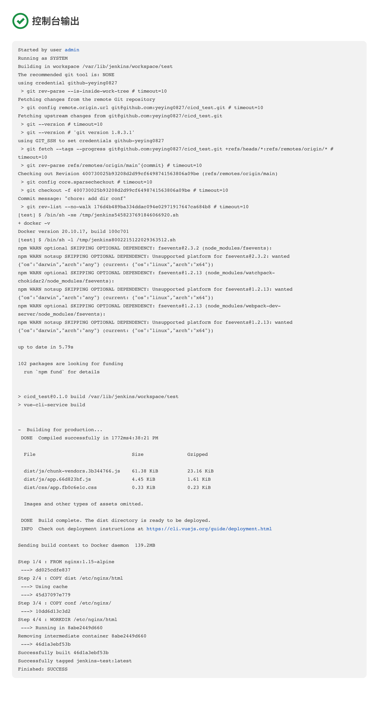

## 使用Jenkins构建镜像：将你的应用打包成镜像

使用`Jenkins`集成`Git`来构建`Docker`镜像，为后面的部署准备镜像资源。

### 1. 安装Nodejs环境

如果想要安装`Node`环境，有以下两个办法：

* 源码编译：这种是将`Node`源码拉下来后，在服务器端编译完成后才可以使用。时间比较长，流程也略复杂

* 使用`Jenkins Plugin`中`NodeJS`插件自动配置安装

  在`Jenkins`首页，左侧的系统管理=>插件管理=>可选插件，搜索`Node`；选中`NodeJS`后，点击左下角的`直接安装`开始安装插件。

  

  发现Jenkins版本太低装了Node插件不能用（😅），更新一下：

  安装参考：https://blog.51cto.com/u_15670038/5351840

  ```shell
  ## pkg.jenkins.io上的jenkins版本太低，改为使用https://mirrors.jenkins.io/redhat-stable/
  yum remove jenkins # 删除旧版本的jenkins
  wget https://mirrors.jenkins.io/redhat-stable/jenkins-2.346.2-1.1.noarch.rpm # 下载
  rpm -ivh jenkins-2.346.2-1.1.noarch.rpm # 安装
  service jenkins start # 启动服务
  ```

安装完毕，返回首页，找到系统管理=>Global Tool Configuration（全局工具配置）=>NodeJS=>新增NodeJS，点击新增NodeJS，选择相应的版本填写信息保存即可。



**如何在任务中使用？**

只需要在任务的**配置**中，找到**构建环境**，选中`Provide Node & npm bin/ folder to PATH`，选择刚才配置好的`NodeJS`即可。



第一次执行会下载对应的`Node`版本，后续不会下载。

### 2. 使用SSH协议集成Git仓库源

这一步，使用`Jenkins`集成外部Git仓库，实现对真实代码的拉取和构建。

创建一个vue3项目用于测试构建：

`npx vue create cicd_test`

选择vue3项目开始下载安装，然后推送至github仓库

#### 2.1 生成公钥私钥

这是`Jenkins`访问`Git`私有库的常用认证方式。可以使用`ssh-keygen`命令即可生成公钥私钥。在本地机器执行生成即可。（使用自己邮箱）

`ssh-keygen -t rsa -C "yeying0827@126.com"`

完成后需要在`Git`端配置公钥，在`Jenkins`端使用私钥与`Git`进行身份校验。

#### 2.2 在GitHub配置公钥

没法直接复制虚拟机里的内容，[配置下SSH远程登录到ParallelDesktop虚拟机](https://blog.csdn.net/weixin_42426841/article/details/124260735)：

1. 先在虚拟机上安装ssh服务和net-tools工具

   ```shell
   yum install openssh-server # 默认已装
   yum install net-tools
   ```

2. 在mac终端通过ssh命令登录：ssh 用户名@ip

   ```shell
   ssh yy@10.211.55.6
   # 登录后通过cat命令获取公钥
   cat /root/.ssh/id_rsa.pub
   ```

获取公钥后去github的settings里配置即可

#### 2.3 在Jenkins配置私钥

在`Jenkins`中，`私钥/密码`等认证信息都是以`凭证`的方式管理的，所以可以做到全局通用。

我们可以在配置任务时，来添加一个自己的凭证。点击项目的配置，依次找到 源码管理=>Git=>Repositories



点击Credentials下面的添加，填写完后点击添加按钮



无法连接仓库错误：`Error performing git command: git ls-remote -h git@github.com:yeying0827/cicd_test.git HEAD`

[需要在虚拟机上安装git客户端工具](https://blog.51cto.com/u_15249893/2852037)：`yum -y install git`



点击保存

### 3. 构建镜像

需要先准备`DockerFile`才可以构建镜像。

#### 3.1 编写DockerFile

什么是DockerFile？

`DockerFile`是一个`Docker`镜像的**基础描述文件**，里面描述了**生成一个镜像所需要的执行步骤**。我们也可以自定义一份`DockerFile`来创建一个自己的镜像。

* 在项目根目录创建`DockerFile`

```shell
vi Dockerfile
```

```dockerfile
FROM nginx:1.15-alpine
COPY dist /etc/nginx/html
COPY conf /etc/nginx/
WORKDIR /etc/nginx/html
```

描述内容为：

1. 基于nginx:1.15镜像做底座
2. 拷贝本地`dist`文件夹内的文件，到镜像内/etc/nginx/html文件夹内
3. 拷贝本地`conf`文件夹内的文件，到镜像内/etc/nginx/文件夹内
4. 指定工作目录

* 提交到代码库

```shell
git add ./Dockerfile
git commit -m "chore: add dockerfile"
git push
```

* 生成镜像：使用`docker build`命令就可以构建一个镜像

```dockerfile
docker build -t imagename:version .
```

-t 声明要打一个镜像的Tag标签，后面紧跟的就是标签。标签格式为 `镜像名:版本`

. 声明要寻找dockerfile文件的路径，.代表当前路径下寻找，默认文件名为Dockerfile

[更多DockerFile的语法](https://www.runoob.com/docker/docker-dockerfile.html)

#### 3.2 Jenkins端配置

在代码源和`DockerFile`准备就绪后，我们只需在`Jenkins`端配置下要执行的`shell`脚本即可。

找到项目的配置，依次找到 构建=>Execute shell，输入以下脚本：

```shell
#!/bin/sh -l

npm install --registry=https://registry.npm.taobao.org
npm run build
docker build -t jenkins-test .
```

脚本主要操作：安装依赖=>构建文件=>构建镜像。填写完毕后保存

### 4. 执行任务

在项目下点击`立即构建`触发执行任务，GLIBC等版本报错，无法执行node命令，报错



```shell
// 使用strings命令查看查看最高只有2.17
strings /lib64/libc.so.6 |grep GLIBC_
```

[下载GLIBC解压，安装](https://blog.csdn.net/hh3167253066/article/details/120535789)：

```shell
wget https://ftp.gnu.org/gnu/glibc/glibc-2.27.tar.gz
tar -xvf glibc-2.27.tar.gz

## 编译安装
# 进入glibc-2.27目录中
cd glibc-2.27
# 创建build目录
mkdir build
# 进入build目录
cd build
# 执行./configure
../configure --prefix=/usr --disable-profile --enable-add-ons --with-headers=/usr/include --with-binutils=/usr/bin
# 安装
make && make install

## 查看共享库
ls -l /lib64/libc.so.6

## 再次查看系统中可使用的glibc版本
strings /lib64/libc.so.6 |grep GLIBC_
```

`执行./confiure`报错：These critical programs are missing or too old: bison compiler

[安装`bison`](https://www.cnblogs.com/liujiaxin2018/p/13196207.html)：`yum install bison`

继续执行`./configure`还是报错：These critical programs are missing or too old: compiler

[gcc编译器版本过低](https://blog.csdn.net/qq_41054313/article/details/119453248)，[升级gcc](https://blog.csdn.net/qq_41054313/article/details/119453611)：

```shell
# 下载源码包并解压
wget http://ftp.gnu.org/gnu/gcc/gcc-11.2.0/gcc-11.2.0.tar.gz
# 腾讯软件源 https://mirrors.cloud.tencent.com/gnu/gcc/gcc-11.2.0/gcc-11.2.0.tar.gz
tar -zxvf gcc-11.2.0.tar.gz
```

```shell
## 下载依赖及配置文件
yum -y install bzip2

cd gcc-11.2.0
./contrib/download_prerequisites
```



[CentOS7 编译安装 gcc11.2](https://blog.csdn.net/weixin_45661908/article/details/123928463)

```shell
## 事先安装gcc的旧版本
sudo yum install -y gcc gcc-c++
```

```shell
## 配置
mkdir build
cd build/
../configure --prefix=/usr/local/gcc-11.2.0 --enable-checking=release --enable-languages=c,c++ --disable-multilib

## 编译
make # make -j 4 让make最多运行四个编译命令同时运行，加快编译速度

## 安装
sudo make install
```

```shell
## 设置环境变量
[yy@localhost build]$ sudo touch /etc/profile.d/gcc.sh
[yy@localhost build]$ sudo chmod 777 /etc/profile.d/gcc.sh
[yy@localhost build]$ echo -e '\nexport PATH=/usr/local/gcc-11.2.0/bin:$PATH\n' >> /etc/profile.d/gcc.sh
[yy@localhost build]$ source /etc/profile.d/gcc.sh

## 设置头文件
[yy@localhost build]$ sudo ln -sv /usr/local/gcc-11.2.0/include/c++/11.2.0 /usr/include/c++/11.2.0
"/usr/include/c++/11.2.0" -> "/usr/local/gcc-11.2.0/include/c++/11.2.0"

## 设置库文件
[yy@localhost build]$ sudo touch /etc/ld.so.conf.d/gcc.conf
[yy@localhost build]$ sudo chmod 777 /etc/ld.so.conf.d/gcc.conf
[yy@localhost build]$ echo -e "/usr/local/gcc-11.2.0/lib64" >> /etc/ld.so.conf.d/gcc.conf

## 加载动态链接库
[yy@localhost build]$ sudo ldconfig -v
[yy@localhost build]$ ldconfig -p |grep gcc
```

gcc11.2版本太高，无法编译glibc2.28（😓），重新安装gcc8.2

[安装glibc_2.28](./安装glibc_2.28.md)

reboot重启，启动jenkins。

**Node版本过高构建失败**，使用node14.17.0版本。

**没有conf文件夹构建失败**，新建conf文件夹提交到库。

构建成功。



至此，完成了使用`Jenkins`构建自己的前端镜像。

从控制台输出可以看出，是先根据配置的git仓库拉取了代码，而后执行了配置的shell，最后执行Dockfile里的操作