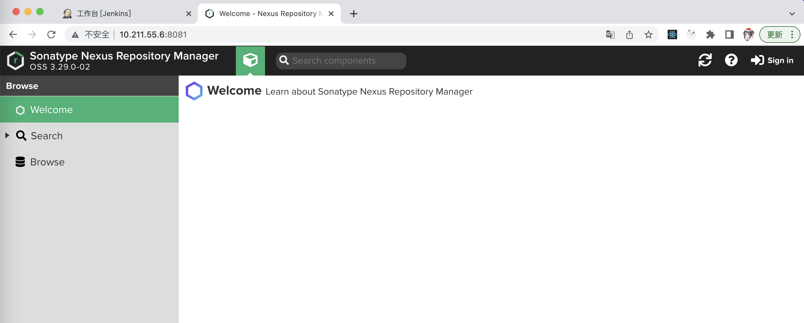
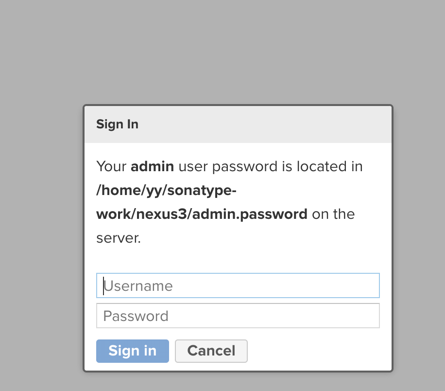
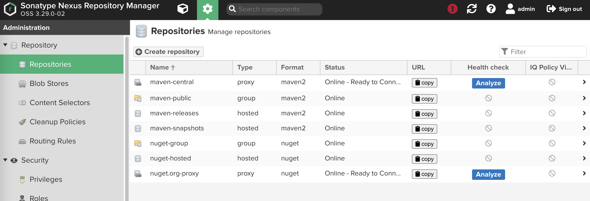
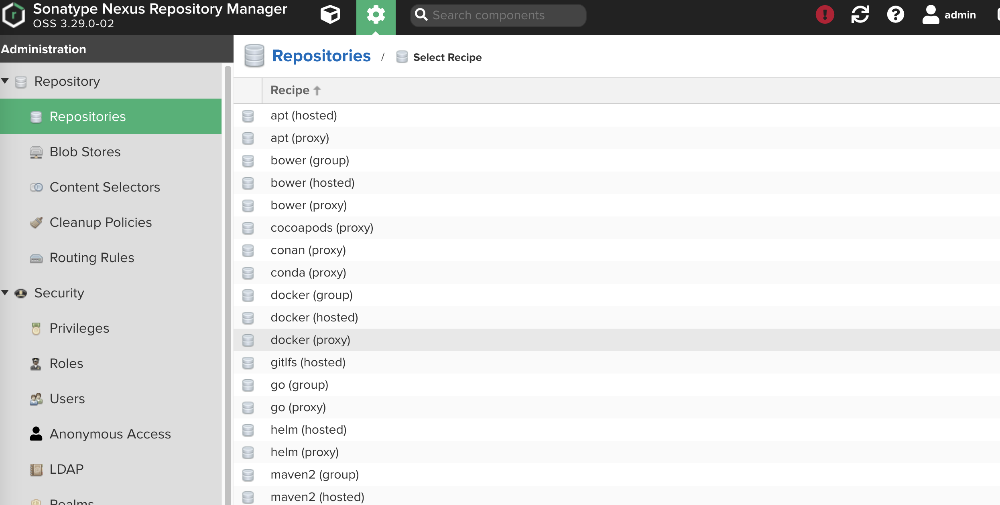
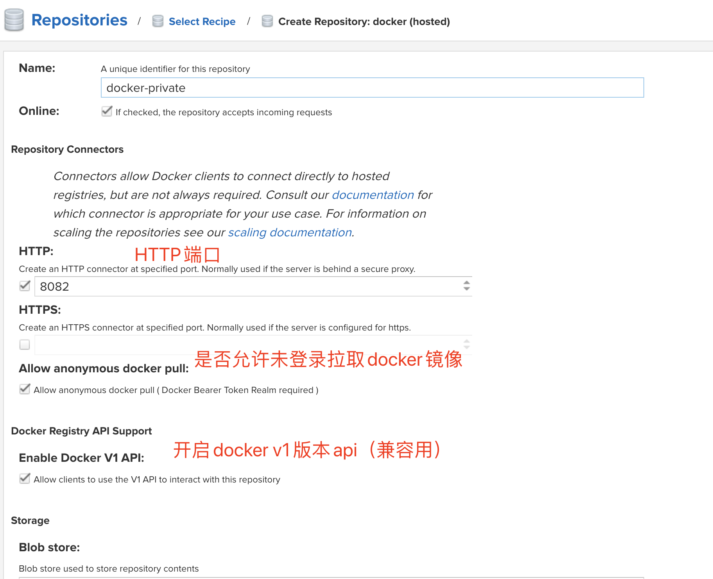
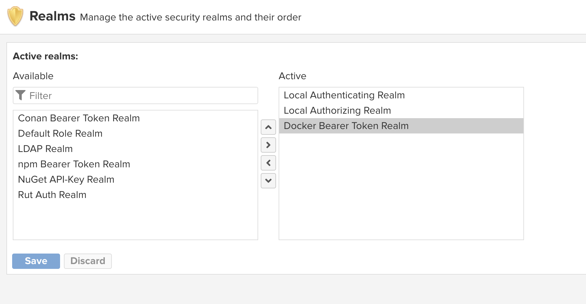
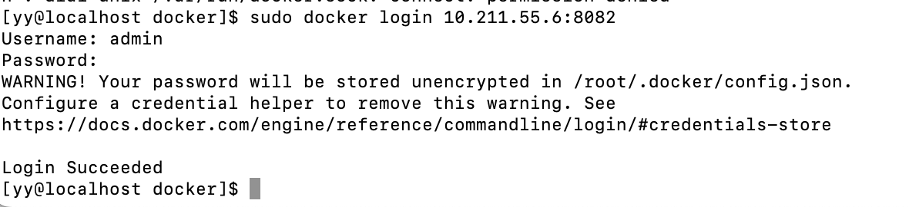
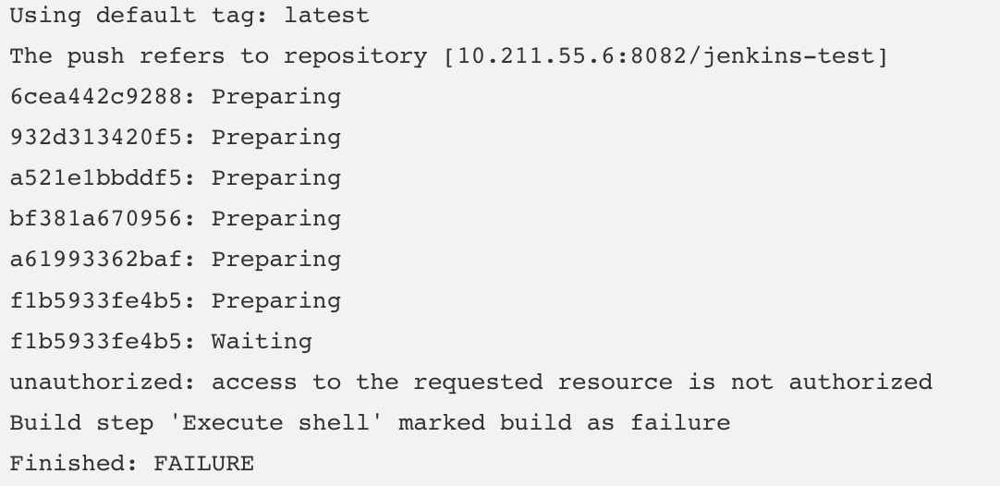
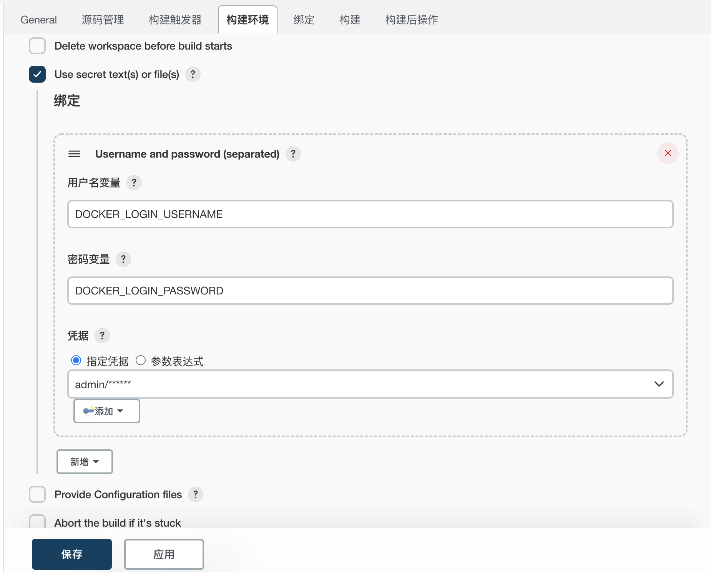
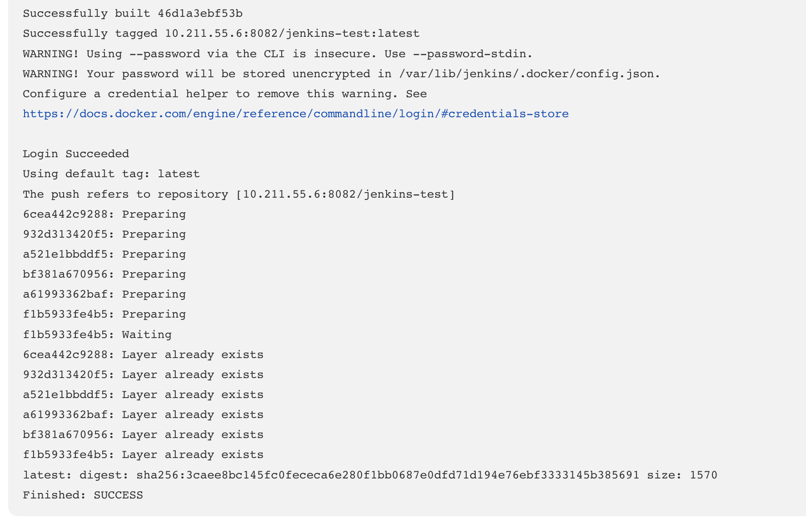

## 将镜像上传至私有镜像库：让镜像管理更私密

### 什么是镜像库

镜像库就是集中存放镜像的一个文件服务。镜像库在`CI/CD`中又称为`制品库`。构建后的产物称为`制品`，制品要放到`制品库`做`中转`和`版本管理`。常用平台有Nexus、Jfrog、Harbor或其他对象存储平台。

此处选用`Nexus3`作为镜像库。因为其稳定、性能好、免费、部署方便，且支持类型多，是许多制品库的首选选型。

### 部署Nexus服务

在部署之前，需要先下载`Nexus`的安装包：

```shell
# 下载
wget https://dependency-fe.oss-cn-beijing.aliyuncs.com/nexus-3.29.0-02-unix.tar.gz
# 解压
tar -zxvf ./nexus-3.29.0-02-unix.tar.gz
```

解压后可以看到2个文件夹，分别是`nexus-3.29.0-02`和`sonatype-work`。其中，`nexus-3.29-02`是nexus主程序文件夹，`sonatype-work`是数据文件。

### 启动Nexus

进入`nexus-3.29.0-02`下面的`bin`目录，即`nexus`的主命令目录。在bin目录下执行`./nexus start`命令即可启动`nexus`。

```shell
[yy@localhost bin]$ ./nexus start
```

> nexus也支持停止、重启等命令。可以在bin目录下执行`./nexus help`查看更多命令。

由于`nexus`默认服务端口是`8081`，稍后还需要给镜像库访问单独开放一个`8082`端口。这里将`8081`，`8082`端口添加到防火墙放行规则内：

```shell
sudo firewall-cmd --zone=public --add-port=8081/tcp --permanent
sudo firewall-cmd --zone=public --add-port=8082/tcp --permanent
```

访问`IP:8081`。nexus启动时间比较长，需要等待一段时间。

[nexus 默认没有配置java路径，需要手动配置](https://blog.csdn.net/u011590297/article/details/108590263)

```shell
# nexus 默认没有配置java路径，需要手动配置
cd  你的nexus安装路径/bin
vi nexus
# 为 INSTALL4J_JAVA_PREFIX  设置java 环境地址
# ...
INSTALL4J_JAVA_PREFIX="$JAVA_HOME" # 默认INSTALL4J_JAVA_PREFIX=""
# ...
```

[nexus启动报错： Error occurred while executing a write operation to database 'OSystem' due to limited free space on the disk (2378 MB). The databa se is now working in read-only mode. Please close the database (or stop OrientDB), make room on you r hard drive and then reopen the database. ](https://blog.csdn.net/java_998/article/details/124298006)

```shell
cd 你的nexus安装路径/bin
vi nexus.vmoptions
# 添加-Dstorage.diskCache.diskFreeSpaceLimit=1024
```

启动nexus成功但是无法访问，重启防火墙：

```shell
systemctl reload firewalld
```

在`Nexus`启动后，会进入下面这个欢迎页面。



### 配置Nexus

点击右上角的sign in，打开登录框。输入`默认管理员密码`进行初始化配置。



```shell
# 在这里可以找到密码，登录名是admin
[yy@localhost bin]$ cat /home/yy/sonatype-work/nexus3/admin.password
```

登录后进入配置：

1. 设置新密码 123456

2. 设置是否开启匿名访问。

   匿名访问可以在没有登录的情况下拉取（推送）制品到制品库，便捷但是个危险行为。

   如，这个制品库也支持`node`的`npm`私有库。那么在没有`npm login`登录这个制品库之前，就可以进行`npm install`、`npm publish`，其实是不太安全的。任何一个知道制品库地址的人，都可以任意进行推送和获取资源。

   这里为了测试，先开启匿名访问

### 创建一个Docker私服

配置完成后，点击顶部导航栏的`齿轮`图标进入配置页=>点击左侧菜单中的`Repositories`=>点击`Create repository`



点击后会进入一个列表，这是`Nexus`所支持的制品库类型。其中有`docker`，也有`npm`等等。



#### 1. 创建制品库

在`nexus`中，制品库一般分为以下三种类型：

* proxy

  此类型制品库原则上**只下载，不允许用户推送**。可以理解为**缓存外网制品的制品库**。

  例如：在拉取`nginx`镜像时，如果通过`proxy`类型的制品库，则它会去创建时配置好的外网`docker`镜像源拉取（类似`cnpm`）到自己的制品库，然后给你；第二次拉取，则不会从外网下载。起到`内网缓存`的作用。

* hosted

  此类型和`proxy`相反，原则上**只允许用户推送，不允许缓存**。这里只存放自己的私有镜像或制品。

* group

  此类型可以将以上两种类型的制品库组合起来。组合后只访问`group`类型制品库，就都可以访问。

在这里，我们不需要**缓存外网镜像**，选择`docker(hosted)`即可。

继续进行其他配置：将之前预留的`8082`端口填入`HTTP`输入框、暂时允许匿名拉取镜像、并做兼容配置。



最后点击下方的`Create repository`保存就创建成功了。

#### 2. 给镜像库添加访问权限

创建好镜像库后，还需要配置访问权限才可以用。

在配置页，选择左侧菜单中的`Realms`。在右边找到`Docker Bearer Token Realm`，将其添加到`Active`内，保存即可。



#### 3. 查看获取镜像库地址

在repositories列表中找到刚刚创建的制品库，点击上面的`copy`按钮，就可以看到镜像库地址。


### 登录制品库

私服建设完成后，如果私服对外访问地址为HTTP的话，还需要在服务器配置一下才可以使用（HTTPS不需要配置）。

找到`daemon.json`文件，该文件描述了当前`docker`配置的镜像加速地址，和配置过的私服地址。

```shell
sudo vi /etc/docker/daemon.json
```

找到`insecure-registries`字段，如果不存在就添加一个。值是数组类型，将你的制品库地址填写上去。

```json
{
  "registry-mirrors": ["https://8qw0m0z3.mirror.aliyuncs.com"],
  "insecure-registries": ["10.211.55.6:8082"]
}
```

保存并退出，重启Docker。

```shell
[yy@localhost docker]$ systemctl restart docker
```

接着使用`docker login`命令尝试登录：

`docker login 服务IP:端口`



### 推送镜像到制品库

完成镜像库配置后，就可以使用jenkins推送自己的镜像到镜像库了。

在Jenkins任务的设置Shell的编辑框，添加一条推送镜像的命令进去：

```shell
#!/bin/sh -l

# ...
docker build -t jenkins-test .
docker push jenkins-test
```

> 注：`docker`在推送一个镜像时，**镜像的Tag（名称:版本号）开头必须带着镜像库的地址，才可以推送到指定的镜像库**。如`jenkins-test`是不能推送到镜像库的，而`10.211.55.6:8082/jenkins-test`则可以推送到镜像库。

修改shell

```shell
#!/bin/sh -l

# ...
docker build -t 10.211.55.6:8082/jenkins-test .
docker push 10.211.55.6:8082/jenkins-test
```

将构建的镜像名称加了镜像库的前缀，推送镜像也是一样，这样才可以将镜像推送到指定镜像库，保存后重新构建一次。

构建后提示报错没有权限推送：



#### 利用凭据给Shell注入镜像库用户名

没有权限，可以使用`docker login`在`shell`脚本里面登录。直接在命令里写入用户名和密码：

```shell
docker login -u "admin" -p "123456" 10.211.55.6:8082
```

这样在命令中写死，无论安全还是友好性上，都不太合适；可以借助Jenkins的凭据功能，添加一条用户名密码凭据，然后利用Shell变量写入在终端内。

找到任务的设置界面=>构建环境=>勾选Use secret text(s) or file(s)=>点击下面的新增按钮，选择`Username and password(seperated)`。点击添加按钮来添加一条凭证。



接着在shell中添加`docker login`命令，将我们保存的用户名和密码变量填写进去：

`docker login -u $DOCKER_LOGIN_USERNAME -p $DOCKER_LOGIN_PASSWORD 10.211.55.6:8082`

保存后再次构建，构建成功并且推送成功




### 如何推送已有的镜像到仓库？

面对load/pull进来的镜像，要如何推送到自己的镜像库呢？

可以使用`docker tag`命令给已有的镜像打个标签。在打新tag时可以在tag头部加入镜像库地址。

🌰：

```shell
# docker tag <镜像ID>/<镜像名称> 新镜像名称[:版本]
docker tag 46d1a3ebf53b 10.211.55.6:8082/local/jenkins
```

> 查看服务器上的docker信息，可以使用`docker images`命令查看

这样就可以重新打一个全新的tag，实现`重命名`功能。

接着使用`docker push`命令就可以进行推送了。

```shell
docker push 10.211.55.6:8082/local/jenkins
```

**操作结果**

```shell
[yy@localhost ~]$ docker images
REPOSITORY                      TAG           IMAGE ID       CREATED       SIZE
10.211.55.6:8082/jenkins-test   latest        46d1a3ebf53b   3 days ago    16.8MB
jenkins-test                    latest        46d1a3ebf53b   3 days ago    16.8MB
node                            latest        7e9550136fca   11 days ago   998MB
nginx                           1.15-alpine   dd025cdfe837   3 years ago   16.1MB
[yy@localhost ~]$ docker tag 46d1a3ebf53b 10.211.55.6:8082/local/jenkins

[yy@localhost ~]$ sudo docker push 10.211.55.6:8082/local/jenkins
[sudo] password for yy: 
Using default tag: latest
The push refers to repository [10.211.55.6:8082/local/jenkins]
6cea442c9288: Layer already exists 
932d313420f5: Layer already exists 
a521e1bbddf5: Layer already exists 
bf381a670956: Layer already exists 
a61993362baf: Layer already exists 
f1b5933fe4b5: Layer already exists 
latest: digest: sha256:3caee8bc145fc0fececa6e280f1bb0687e0dfd71d194e76ebf3333145b385691 size: 1570
[yy@localhost ~]$ docker images
REPOSITORY                       TAG           IMAGE ID       CREATED       SIZE
10.211.55.6:8082/jenkins-test    latest        46d1a3ebf53b   3 days ago    16.8MB
10.211.55.6:8082/local/jenkins   latest        46d1a3ebf53b   3 days ago    16.8MB
jenkins-test                     latest        46d1a3ebf53b   3 days ago    16.8MB
node                             latest        7e9550136fca   11 days ago   998MB
nginx                            1.15-alpine   dd025cdfe837   3 years ago   16.1MB
```

