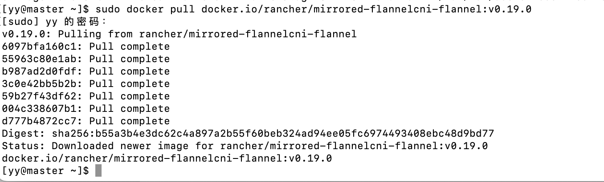

## 持续部署环境起步：什么是Kubernetes && 搭建Kubernetes集群

### 什么是Kubernetes？

百科：

> Kubernetes是Google开源的一个容器编排引擎，它支持自动化部署、大规模可伸缩、应用容器化管理。
>
> 在生产环境中部署一个应用程序时，通常要部署该应用的多个实例以便对应用请求进行负载均衡。

可以将`Kubernetes`看作是一个用来部署镜像的平台。可以用来操作多台机器调度部署镜像，大大降低运维成本。

### 基础安装和配置

**Master和Node节点都需要的安装**

#### 1. 使用yum安装必备组件

vi、wget、ntpdate。ntpdate可以用来同步时区

```shell
yum install vim wget ntpdate -y
```

#### 2. 关闭防火墙

因为**Kubernetes会创建防火墙规则，导致防火墙规则重复**。因此要将防火墙关闭：

```shell
systemctl stop firewalld
systemctl disable firewalld
```


#### 3. 关闭`Swap`分区

`Swap`是`Linux`的交换分区，在系统资源不足时，`Swap`分区会启用，这会拖慢我们的应用性能。

应该让新创建的服务自动调度到集群的其他`Node`节点中去，而不是使用`Swap`分区。所以这里将它关闭掉：

```shell
# 临时关闭
swapoff -a
# 永久关闭
vi /etc/fstab
```

注释掉下面这一行：

```
/dev/mapper/centos-swap swap ...
```


#### 4. 关闭`Selinux`

这是为了支持容器可以访问宿主机文件系统。

```shell
# 暂时关闭
setenforce 0
# 永久关闭
vi /etc/sysconfig/selinux
```

修改以下参数，设置为disabled

```
SELINUX=disabled
```


[关于为什么要关闭防火墙、swap、selinux](https://www.zhihu.com/question/374752553)

#### 5. 使用`ntpdate`来统一系统时间和时区

服务器时间与阿里云服务器对齐。

```shell
# 统一时区，为上海时区
ln -snf /usr/share/zoneinfo/Asia/Shanghai /etc/localtime
bash -c "echo 'Asia/Shanghai' > /etc/timezone"

# 统一使用阿里云服务器进行时间更新
ntpdate ntp1.aliyun.com
```


#### 6. 安装Docker

在`kubernetes`中的组件，服务都可以`Docker`镜像方式部署的。所以安装`Docker`必不可少。

与02的安装步骤基本一致，需要另外修改一下docker的`cgroupdriver`为`systemd`，这是为了避免后面与k8s的冲突。

```json
{
  "exec-opts": ["native.cgroupdriver=systemd"]
}
```

另外也需要配置一下私有镜像库的地址到`insecure-registries`字段中


然后可以重启docker

```shell
sudo systemctl daemon-reload
sudo systemctl restart docker.service
```

#### 7. 安装Kubernetes组件

首先将安装源更换为国内的阿里云源：

```shell
cat <<EOF > /etc/yum.repos.d/kubernetes.repo
[kubernetes]
name=Kubernetes
baseurl=http://mirrors.aliyun.com/kubernetes/yum/repos/kubernetes-el7-x86_64
enabled=1
gpgcheck=0
repo_gpgcheck=0
gpgkey=http://mirrors.aliyun.com/kubernetes/yum/doc/yum-key.gpg
       http://mirrors.aliyun.com/kubernetes/yum/doc/rpm-package-key.gpg
EOF
```

接着直接使用`yum`命令安装`kubelet`，`kubeadm`、`kubectl`即可，安装完毕后启用`kubelet`即可，使用指定版本安装。

```shell
yum install -y kubelet-1.23.6 kubeadm-1.23.6 kubectl-1.23.6
# 启动kubelet
systemctl enable kubelet && systemctl start kubelet
```


> `kubelet`是`Kubernetes`中的核心组件。它会运行在集群的所有节点上，并负责创建启动服务容器；
>
> `kubectl`则是Kubernetes的命令行工具。可以用来管理，删除，创建资源；
>
> `kubeadm`则是用来初始化集群，子节点加入的工具。


### Master节点安装

Master节点是集群内的调度和主要节点。以下部分仅限Master节点安装。

首先，使用`hostnamectl`来修改主机名称为`master`。

```shell
hostnamectl set-hostname master
```

接着使用`ip addr`命令，获取本机IP，将其添加到`/etc/hosts`内：

```shell
vim /etc/hosts
# xxx.xxx.xxx.xxx master
```


#### 1. 配置Kubernetes初始化文件

使用`kubeadm config print init-defaults`输出一份默认初始化配置文件，使用`>`操作符即可导出为一份文件，方便进行修改。

```shell
kubeadm config print init-defaults > init-kubeadm.conf
vim init-kubeadm.conf
```

主要修改配置文件中三个地方：

* 更换`Kubernetes`镜像仓库为阿里云镜像仓库，加速组件拉取
* 更换`ip`为自己主机`ip`
* 配置`pod`网络为`flannel`网段

```shell
# imageRepository: k8s.grc.io 更换k8s镜像仓库
imageRepository: registry.cn-hangzhou.aliyuncs.com/google_containers
# localAPIEndpoint, advertiseAddress为master-ip, port默认不修改
localAPIEndpoint:
  advertiseAddress: 10.211.55.9 # 此处为master的IP
  bindPort: 6443
# 配置子网络
networking:
  dnsDomain: cluster.local
  serviceSubnet: 10.96.0.0/12
  podSubnet: 10.244.0.0/16 # 添加这个
```

修改完配置文件后，需要使用`kubeadm`拉取我们的默认组件镜像。直接使用`kubeadm config images pull`命令即可。

```shell
kubeadm config images pull --config init-kubeadm.conf
```


#### 2. 初始化Kubernetes

镜像拉取后，就可以使用刚才编辑好的配置文件去初始化`Kubernetes`集群了。直接使用`kubeadm init`命令去初始化即可。

```shell
# kubeadm init --config init-kubeadm.conf
kubeadm init --config init-kubeadm.conf --ignore-preflight-errors=all
```


执行完毕得到一些提示：

红框为需要在`Master`节点执行的初始化命令，其作用是将默认的`Kubernetes`认证文件拷贝进`.kube`文件夹内，才能默认使用该配置文件。

蓝框为需要在`node`节点执行的命令，作用是可以快速将`Node`节点加入到`Master`集群内。

```shell
mkdir -p $HOME/.kube
sudo cp -i /etc/kubernetes/admin.conf $HOME/.kube/config
sudo chown $(id -u):$(id -g) $HOME/.kube/config
```

```shell
kubeadm join 10.211.55.9:6443 --token abcdef.0123456789abcdef \
	--discovery-token-ca-cert-hash sha256:6bdfeef932434b933314c45c752b091dd8581c5bcecafc8b184d563b8513bf59 
```

#### 3. 安装Flannel

在配置k8s初始化文件中，有添加了配置Pod子网络，`Flannel`的主要作用就是通过创建一个虚拟网络，让不同节点下的服务有着全局唯一的IP地址，且服务之间可以互相访问和连接。

`Flannel`作为`Kubernetes`的一个组件，则使用`Kubernetes`部署服务的方式进行安装。

首先下载配置文件：

```shell
# wget https://raw.githubusercontent.com/coreos/flannel/v0.18.1/Documentation/kube-flannel.yml
# 无响应，改用以下地址
wget https://github.com/flannel-io/flannel/blob/master/Documentation/kube-flannel.yml
```

获取flannel镜像地址:


拉取flannel镜像：

```shell
sudo docker pull docker.io/rancher/mirrored-flannelcni-flannel:v0.19.0
```



镜像拉取完毕后，可使用`kubectrl apply`命令加载服务：

```shell
kubectl apply -f kube-flannel.yml
```

```shell
## wget直接下载github上的kube-flannel.yml文件有问题，手动添加一个yml文件，并编辑内容
[yy@master ~]$ sudo vim kube-flannel.yml
[yy@master ~]$ kubectl apply -f kube-flannel.yml 
namespace/kube-flannel created
clusterrole.rbac.authorization.k8s.io/flannel created
clusterrolebinding.rbac.authorization.k8s.io/flannel created
serviceaccount/flannel created
configmap/kube-flannel-cfg created
daemonset.apps/kube-flannel-ds created
[yy@master ~]$ 
```

#### 4. 查看启动情况

大约等待1分钟，可以使用`kubectl get nodes`命令查看节点的运行状态。如果显示`STATUS 为 ready`，则代表启动成功。

```shell
[yy@master ~]$ kubectl get nodes
NAME   STATUS   ROLES                  AGE   VERSION
node   Ready    control-plane,master   91m   v1.23.6
[yy@master ~]$ 
```


### Node节点配置

`Node`节点的地位是负责运行服务容器，负责接收调度的。

首先第一步，需要设置一下`hostname`为`node1`。在`node`机器上执行：

`hostnamectl set-hostname node1`

#### 1. 拷贝Master节点配置文件

将`master`节点的`k8s`配置文件拷贝到`node`节点。回到`master`节点，使用`scp`命令通过`SSH`传送文件：

```shell
scp $HOME/.kube/config root@node的ip:~/
```


#### 2. 归档配置文件

在`node`节点执行以下命令：

```shell
mkdir -p $HOME/.kube
sudo mv $HOME/config $HOME/.kube/config
sudo chown $(id -u):$(id -g) $HOME/.kube/config
```


#### 3. 加入Master节点

让`Node`节点加入到`master`集群内，使用上面蓝框里的`kubeadm join`命令：

```shell
kubeadm join 10.211.55.9:6443 --token abcdef.0123456789abcdef \
	--discovery-token-ca-cert-hash sha256:6bdfeef932434b933314c45c752b091dd8581c5bcecafc8b184d563b8513bf59 
```

如果刚才的命令忘记了，可以在`master`机器上使用`kubeadm token create`命令重新生成一条命令：

```shell
kubeadm token create --print-join-command
```


在master上查看集群节点，显示node1 NotReady：


#### 4. 安装Flannel

```shell
[yy@node1 ~]$ sudo vim kube-flannel.yml
[yy@node1 ~]$ sudo docker pull docker.io/rancher/mirrored-flannelcni-flannel:v0.19.0
v0.19.0: Pulling from rancher/mirrored-flannelcni-flannel
Digest: sha256:b55a3b4e3dc62c4a897a2b55f60beb324ad94ee05fc6974493408ebc48d9bd77
Status: Image is up to date for rancher/mirrored-flannelcni-flannel:v0.19.0
docker.io/rancher/mirrored-flannelcni-flannel:v0.19.0
[yy@node1 ~]$ kubectl apply -f kube-flannel.yml
namespace/kube-flannel unchanged
clusterrole.rbac.authorization.k8s.io/flannel unchanged
clusterrolebinding.rbac.authorization.k8s.io/flannel unchanged
serviceaccount/flannel unchanged
configmap/kube-flannel-cfg unchanged
daemonset.apps/kube-flannel-ds unchanged
```

再次查看集群节点，都显示Ready了：


### 小结

至此，完成了从0到1部署了一套`Kubernetes`集群。