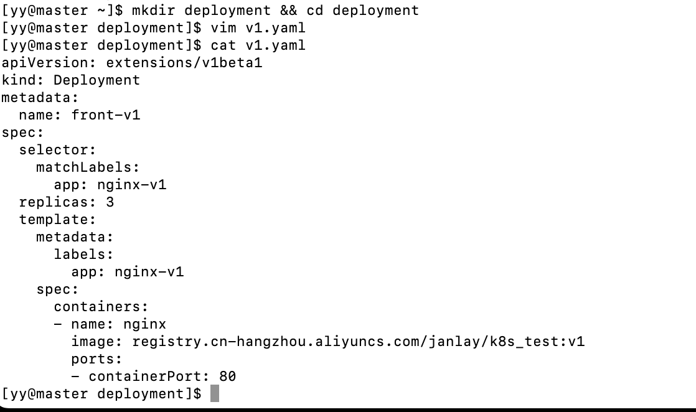
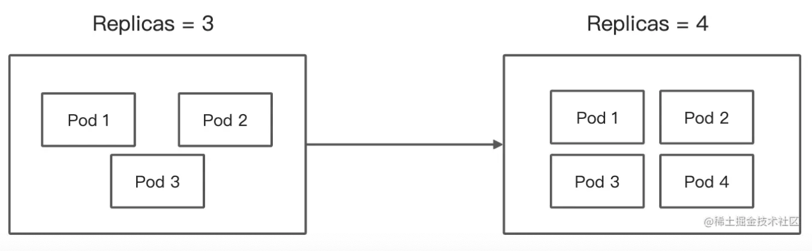
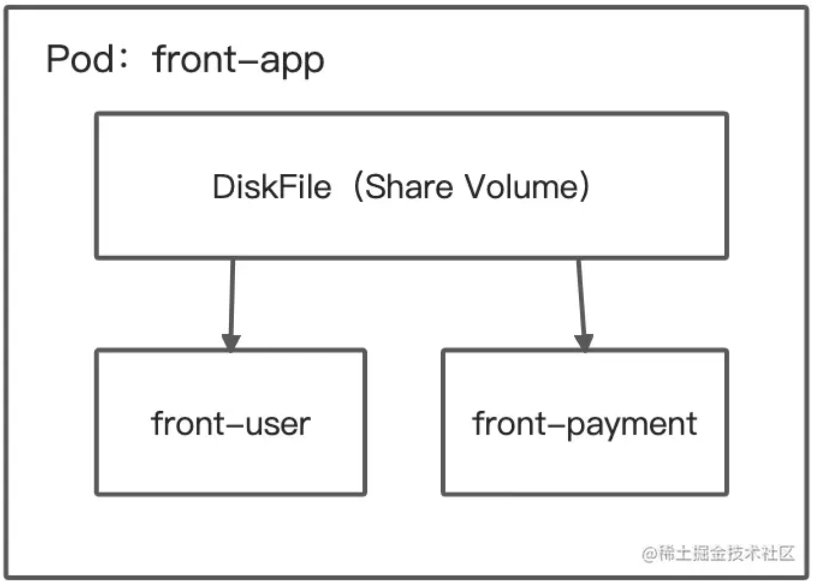
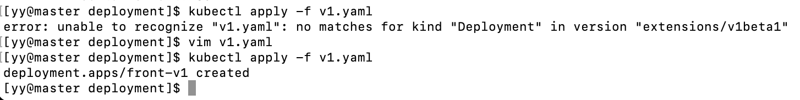
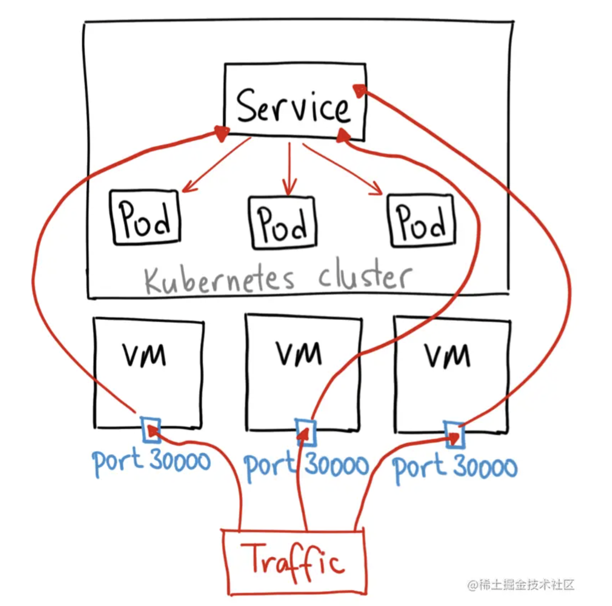
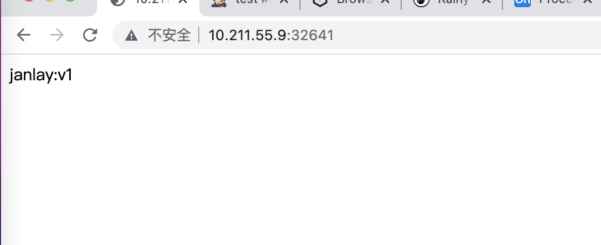
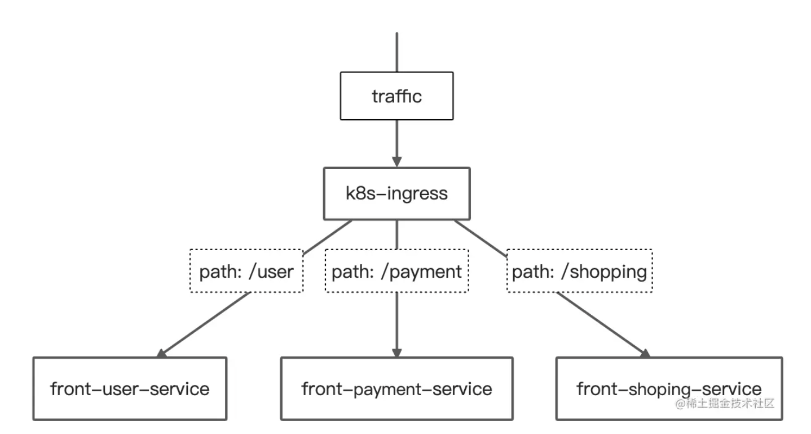
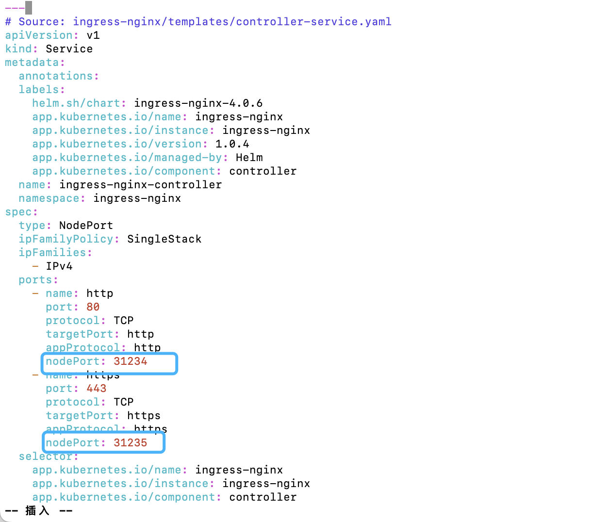
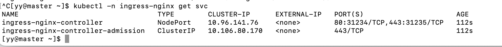
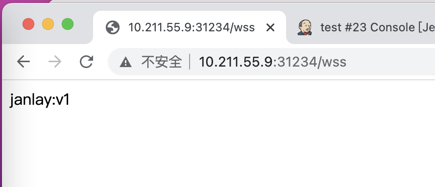

## 使用Kubernetes部署访问你的第一个应用

部署自己的第一个`Kubernetes`应用并实现访问。

### 1. 声明一份配置清单

在开始部署前，我们先要声明一份`配置清单`，清单的文件格式为`YAML`文件格式。

在Kubernetes中，应用部署完全可以通过`YAML`配置清单来进行部署。

* 新建一个文件夹，名称叫`deployment`，并在文件夹内创建一份`yaml`文件，名称未`v1`：

  ```shell
  mkdir deployment && cd deployment
  vim v1.yaml
  ```

* 接着在配置文件中，写入以下内容：

  ```yaml
  apiVersion: apps/v1
  kind: Deployment
  metadata:
    name: front-v1
  spec:
    selector:
      matchLabels:
        app: nginx-v1
    replicas: 3
    template:
      metadata:
        labels:
          app: nginx-v1
      spec:
        containers:
        - name: nginx
          image: registry.cn-hangzhou.aliyuncs.com/janlay/k8s_test:v1
          ports:
          - containerPort: 80
  ```

  YAML文件中的kind字段，是在声明Kubernetes的资源类型。



#### 1.1. 什么是Deployment

如果将`k8s`看作是一个大型机场，那么`deployment`就是机场内的停机坪。

根据飞机的种类进行划分停机坪，不同的停机坪都停着不同类型的飞机。不过`deployment`比停机坪还要灵活，随时可以根据剩余的空地大小（服务器剩余资源）和塔台的指令，增大/变小停机坪的空间。

这个“增大变小停机坪空间的动作”，在k8s中就是`deployment`对它下面所属容器数量的扩容/缩小的操作。



这就代表，`deployment`是**无状态的**，也就不会去负责停机坪中每架飞机之间的通信和组织关系。只需根据塔台的指令，维护好飞机的更新和进出指令即可。这个根据指令维护飞机更新和进出的行为，在k8s中就是`deployment`对他下面的容器版本更新升级，暂停和恢复更新升级的动作。

这里的容器，并不等于Docker中的容器，在k8s中被称为`Pod`。

#### 1.2. 什么是Pod

Pod是k8s中最小的可调度单元（可操作/可部署单元），它里面可以包含1个或多个Docker容器。

在Pod内的所有Docker容器，都会共享同一个网络、存储卷、端口映射规则。一个Pod拥有一个IP。

但是这个IP会随着Pod的重启、创建、删除等跟着改变，所以不固定且不完全可靠。这也就是Pod的IP漂移问题。这个问题可以使用后面的Service去自动映射。



Pod和Docker的关系就像是豌豆和豌豆荚，Pod是一个容器组，里面有很多容器，容器组内共享资源。

#### 1.3 分析配置文件构成

`kind`字段不止可以声明`deployment`，还可以声明其他的资源类型。

配置清单中的字段都代表啥：

* 声明当前资源配置的API版本、资源类型和资源名称：

  ```yaml
  apiVersion: apps/v1
  kind: Deployment
  metadata:
    name: front-v1
  ```

  API配置版本：`apps/v1`

  资源类型：`Deployment`

  资源名称：`front-v1`

  API配置版本会随着k8s版本迭代和资源类型不同有变化，可以查看链接：[该怎么选择apiVersion的值](https://matthewpalmer.net/kubernetes-app-developer/articles/kubernetes-apiversion-definition-guide.html)

* `deployment`根据规则匹配相应的`Pod`，进行控制和管理：

  ```yaml
  spec:
    selector:
      matchLabels:
        app: nginx-v1
  ```

  这里使用`matchLabels`字段匹配`Pod`的`label`值。

* 声明一个Pod组：

  ```yaml
    replicas: 3
    template:
      metadata:
        labels:
          app: nginx-v1
      spec:
        containers:
        - name: nginx
          image: registry.cn-hangzhou.aliyuncs.com/janlay/k8s_test:v1
          ports:
          - containerPort: 80
  ```

  * replicas：要创建的`Pod`最大容积，数字类型

  * labels.app：Pod组的名称

  * spec：组内创建的Pod信息

    * name：Pod名称
    * image：以什么镜像创建Pod，这里是Docker镜像地址
    * ports.containerPort：Pod内容器映射的端口

    这里的镜像，是原作者自己编译的一份nginx镜像作为演示，也可以换成自己的镜像。

### 2. 启动第一个应用

完成`deployment`的配置清单后，就可以使用该清单创建我们的第一个应用。

#### 2.1. 执行k8s配置

在k8s中，我们使用`kubectl apply`来执行一份k8s的配置：

```shell
kubectl apply -y ./v1.yaml
```

`kubectl apply`代表准备对资源进行配置。`-f`等于`--filname`，后面可以跟随多个配置文件。



#### 2.2. 查看Pod状态

想要查看部署完毕后的`Pod`运行状态，可以使用`kubectl get pod`命令来获取所有Pod的信息：

```shell
[yy@master deployment]$ kubectl get pod
NAME                       READY   STATUS    RESTARTS   AGE
front-v1-f6dcbbb88-7svg5   1/1     Running   0          2m42s
front-v1-f6dcbbb88-bjftm   1/1     Running   0          2m42s
front-v1-f6dcbbb88-fjmc9   1/1     Running   0          2m42s
[yy@master deployment]$ 
```

这是在k8s中部署的所有的Pod。

name是Pod的名称；READY为容器状态，格式为可用容器/所有容器数量；STATUS为Pod的运行状态；RESTARTS为重启数量；AGE为Pod运行时间。当状态都是`Running`时，代表Pod运行正常。

#### 2.3 令人费解的无状态

部署成功了，怎么去访问具体应用呢？

`deployment`是无状态的，也就意味着`deployment`不会对`pod`进行网络通信和分发。想访问服务，有以下两个办法：

1. 直接访问具体的`Pod`：可以，但是`Pod`太多了，达不到自动调度的效果；且`Pod`的`IP`在运行时还会经常进行漂移且不固定；
2. 使用`Service`组织统一的`Pod`访问入口。

这里选择另一种资源类型——`Service`来进行统一组织`Pod`服务访问

### 3. 访问第一个应用

#### 3.1 什么是Service

`Deployment`是停机坪，那么`Service`就是一块停机坪的统一通信入口。

它负责自动调度和组织Deployment中Pod的服务访问。由于自动映射Pod的IP，同时也解决了Pod的IP漂移问题。

下图印证了`Service`的作用：流量会首先进入VM（主机），随后进入Service中，接着Service再去将流量调度给匹配的Pod。



#### 3.2 Service的配置

创建一个`Service`也需要一份`YAML`配置清单。一份简单的`Service`的配置如下：

```yaml
apiVersion: v1
kind: Service
metadata:
  name: front-service-v1
spec:
  selector:
    app: nginx-v1
  ports:
  - protocol: TCP
    port: 80
    targetPort: 80
  type: NodePort
```

几个特有的字段：

* protocol：通信类型（TCP/UDP）
* targetPort：原本Pod开放的端口
* port：k8s容器之间互相访问的端口
* type：NodePort，Service的一种访问方式

这里Service的模式选择使用`NodePort`模式。其他模式可以参考：

#### 3.3 与Deployment配置文件合并

根据YAML语法，我们可以将`Service`和`Deployment`合并为同一个配置文件。当然新建一个文件也是可以的。

编辑原有的v1.yaml，在文件底部添加`---`继续拼接Service的配置：

编辑保存退出后，使用`kubectl apply`命令来更新配置：

```shell
kubectl apply -f ./v1.yaml
```

此时Service就部署完毕了。

```shell
[yy@master deployment]$ kubectl apply -f v1.yaml 
deployment.apps/front-v1 unchanged
service/front-service-v1 created
[yy@master deployment]$ 
```

#### 3.4 查看Service的访问端口

部署成功`Service`后，可以使用`kubectl get svc`来获取已经部署的`Service`列表：

可以查看具体打开的服务端口

```shell
[yy@master deployment]$ kubectl get svc
NAME               TYPE        CLUSTER-IP     EXTERNAL-IP   PORT(S)        AGE
front-service-v1   NodePort    10.108.54.76   <none>        80:32641/TCP   91s
kubernetes         ClusterIP   10.96.0.1      <none>        443/TCP        29h
```

其中：`PORT`字段代表`Service`的访问端口；`:`前为映射到Pod的端口，`32641`为访问端口。

访问`Master节点IP + 端口`，就可以访问到该服务。




### 4.路径分流

#### 4.1 ingress是什么

部署的`Deployment`和`Service`，实现了对服务的访问。但在实际使用中，我们还会根据请求路径前缀的匹配、权重，甚至根据`cookie/header`的值去访问不同的服务。为了达到这种**负载均衡**的效果，可以使用`k8s`的另一个组件——`ingress`。

在日常开发中，我们经常会遇到**路径分流**问题。例如：访问`/a`时，需要放回A服务的页面；访问`/b`时，需要返回B服务的页面。这时就可以使用`k8s`中的`ingress`去实现。



这里选择使用`ingress-nginx`。`ingress-nginx`是基于`nginx`的一个`ingress`实现。当然也可以实现正则匹配路径、流量转发，基于`cookie/header`切分流量（灰度发布）。

#### 4.2 部署ingress

首先进入`master`节点，下载`ingress`配置文件：

```shell
wget https://raw.githubusercontent.com/kubernetes/ingress-nginx/controller-v1.0.4/deploy/static/provider/baremetal/deploy.yaml
```

接着编辑部署文件，将`ingress`的`nodePort`改为`31234`，以便后面访问：

```shell
vim ./deploy.yaml
```

将NodePort的http增加nodePort值为`31234`，https增加nodePort值为`31235`。



接着执行命令使`ingress`生效：

```shell
kubectl apply -f deploy.yaml
```

```shell
[yy@master ~]$ kubectl apply -f deploy.yaml 
namespace/ingress-nginx created
serviceaccount/ingress-nginx created
configmap/ingress-nginx-controller created
clusterrole.rbac.authorization.k8s.io/ingress-nginx created
clusterrolebinding.rbac.authorization.k8s.io/ingress-nginx created
role.rbac.authorization.k8s.io/ingress-nginx created
rolebinding.rbac.authorization.k8s.io/ingress-nginx created
service/ingress-nginx-controller-admission created
service/ingress-nginx-controller created
deployment.apps/ingress-nginx-controller created
ingressclass.networking.k8s.io/nginx created
validatingwebhookconfiguration.admissionregistration.k8s.io/ingress-nginx-admission created
serviceaccount/ingress-nginx-admission created
clusterrole.rbac.authorization.k8s.io/ingress-nginx-admission created
clusterrolebinding.rbac.authorization.k8s.io/ingress-nginx-admission created
role.rbac.authorization.k8s.io/ingress-nginx-admission created
rolebinding.rbac.authorization.k8s.io/ingress-nginx-admission created
job.batch/ingress-nginx-admission-create created
job.batch/ingress-nginx-admission-patch created
[yy@master ~]$ 
```

执行完毕会自动**拉取`ingress`镜像，自动部署`ingress`**。可以使用`kubectl`命令查看部署状态：

```shell
kubectl get pods -n ingress-nginx -l app.kubernetes.io/name=ingress-nginx --watch
```

```shell
[yy@master ~]$ kubectl get pods -n ingress-nginx -l app.kubernetes.io/name=ingress-nginx --watch
NAME                                        READY   STATUS              RESTARTS   AGE
ingress-nginx-admission-create-b5n2j        0/1     ImagePullBackOff    0          2m2s
ingress-nginx-admission-patch-lhxzq         0/1     ImagePullBackOff    0          2m2s
ingress-nginx-controller-6d7947cf68-27g9v   0/1     ContainerCreating   0          2m2s

```

出现ErrImagePull，将deploy.yaml中镜像地址做替换：

```
image: k8s.gcr.io/ingress-nginx/controller:v1.0.4@xxx替换为 liangjw/ingress-nginx-controller:v1.0.4
image: k8s.gcr.io/ingress-nginx/kube-webhook-certgen:v1.1.1@xxx替换为 liangjw/kube-webhook-certgen:v1.1.1

然后
kubectl delete -f deploy.yaml
kubectl apply -f deploy.yaml
```

```shell
[yy@master ~]$ kubectl apply -f deploy.yaml 
namespace/ingress-nginx created
serviceaccount/ingress-nginx created
configmap/ingress-nginx-controller created
clusterrole.rbac.authorization.k8s.io/ingress-nginx unchanged
clusterrolebinding.rbac.authorization.k8s.io/ingress-nginx unchanged
role.rbac.authorization.k8s.io/ingress-nginx created
rolebinding.rbac.authorization.k8s.io/ingress-nginx created
service/ingress-nginx-controller-admission created
service/ingress-nginx-controller created
deployment.apps/ingress-nginx-controller created
ingressclass.networking.k8s.io/nginx unchanged
validatingwebhookconfiguration.admissionregistration.k8s.io/ingress-nginx-admission configured
serviceaccount/ingress-nginx-admission created
clusterrole.rbac.authorization.k8s.io/ingress-nginx-admission unchanged
clusterrolebinding.rbac.authorization.k8s.io/ingress-nginx-admission unchanged
role.rbac.authorization.k8s.io/ingress-nginx-admission created
rolebinding.rbac.authorization.k8s.io/ingress-nginx-admission created
job.batch/ingress-nginx-admission-create created
job.batch/ingress-nginx-admission-patch created

# 如果显示以下信息，则代表部署成功。
[yy@master ~]$ kubectl get pods -n ingress-nginx -l app.kubernetes.io/name=ingress-nginx --watch
NAME                                        READY   STATUS      RESTARTS   AGE
ingress-nginx-admission-create-hmrdd        0/1     Completed   0          4s
ingress-nginx-admission-patch-vp8kr         0/1     Completed   1          4s
ingress-nginx-controller-7f8bbb6644-7b4rt   0/1     Running     0          4s
```

输入以下命令，检查配置是否生效：

```shell
kubectl -n ingress-nginx get svc
```



以上截图代表生效。

#### 4.3 配置ingress

**初始配置文件**：

`ingress`服务的配置也是使用`yaml`文件进行管理。

1. 新建一个`ingress`文件夹，将`ingress`的配置放在里面：

   ```shell
   mkdir ingress && cd ingress && vim base.yaml
   ```

   写入以下内容：

   ```yaml
   apiVersion: networking.k8s.io/v1
   kind: Ingress
   metadata:
     name: nginx-demo
     annotations:
       nginx.ingress.kubernetes.io/rewrite-target: /
       kubernetes.io/ingress.class: nginx
   spec:
     rules:
     - http:
         paths:
         - path: /wss
           pathType: Prefix
           backend:
             service:
               name: front-service-v1
               port:
                 number: 80
   ```

   这是一份简单的`ingress`配置文件。主要分三部分：

   * annotations

     `annotations`是`ingress`的主要配置项目，可以用修改这些配置来修改`ingress`的行为。

     可以通过修改这些配置来实现灰度发布、跨域资源，甚至将`www.abc.com`重定向到`abc.com`。

     具体详细配置解释，可以翻阅[官方文档](https://kubernetes.github.io/ingress-nginx/user-guide/nginx-configuration/annotations/)

   * rules

     `rules`是`ingress`配置路径转发规则的地方。`path`可以是一个路径字符串，也可以是一个正则表达式。

     `backend`则是`k8s`的`service`服务，`service.name`是服务名称，`service.port`是服务端口。

     当我们去访问`/wss`时，`ingress`就会帮我们调度到`front-service-v1`这个`service`上面。

2. 执行命令，使配置项目生效：

   ```shell
   kubectl apply -f ./base.yaml
   ```

   ```shell
   [yy@master ingress]$ vim base.yaml 
   [yy@master ingress]$ kubectl apply -f base.yaml 
   ingress.networking.k8s.io/nginx-demo created
   [yy@master ingress]$ 
   
   ```

3. 访问页面`http://ip:31234`，如果能看到服务页面则代表成功：

   Not Found？

   `http://10.211.55.9:31234/wss`加`/wss`后缀可以成功访问

   

   

### 5. 小结

成功地部署了第一个Kubernetes应用并实现了访问。

在实际开发中，还需要零宕机发布、设置灰度环境等需求。如何使用`Kubernetes`配置灰度和滚动发布环境

