## Kubernetes灰度发布与滚动发布：零宕机发布的奥秘

实际应用中的一些特定场景：

A用户是VIP，怎么才能让VIP用户看到内测版本呢？不想停机，怎么发布新版本？如何让新版本服务只开放小流量访问呢？

### 1. 灰度发布

#### 1.1 什么是灰度发布

灰度发布是一种发布方式，也叫`金丝雀发布`。起源是：矿工在下井之前会先放一只金丝雀到井里，如果金丝雀不叫了，就代表瓦斯浓度高；原因是金丝雀对瓦斯气体很敏感。这就是金丝雀发布的由来，非常形象地描述了我们的发布行为。

**灰度发布的做法：**在现存旧应用的基础上，启动一个新版应用。但是新版应用并不会直接让用户访问，而是先让测试同学去进行测试，如果没有问题，则可以将真正的用户流量慢慢导入到新版上。在这中间，持续对新版本运行状态做观察，直到慢慢切换过去，这就是所谓的A/B测试。当然也可以招募一切灰度用户，给他们设置独有的灰度标识（Cookie、Header），让他们可以访问到新版应用。

如果中间切换出现问题，也应该将流量迅速地切换到老应用上。

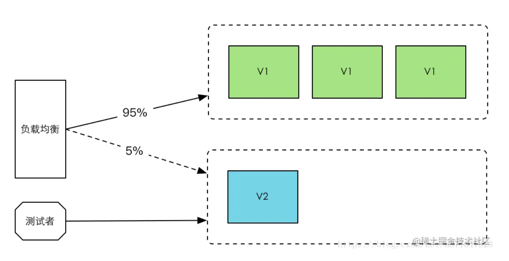

#### 1.2 实现方案

利用`ingress annotation`中的**`canary`**配置项来实现灰度发布逻辑。

**准备新版本的Service**

在开始准备灰度之前，需要准备一套新环境以备流量切分。

切换到`deployment`目录，新启动一套`v2`的环境配置，这里可以将原先`v1`的配置文件，拷贝一份为`v2`。

```shell
cd deployment && cp v1.yaml v2.yaml
```

修改v2.yaml，将Deployment Name，Service Name和匹配规则都替换为v2，并将镜像版本替换为v2。

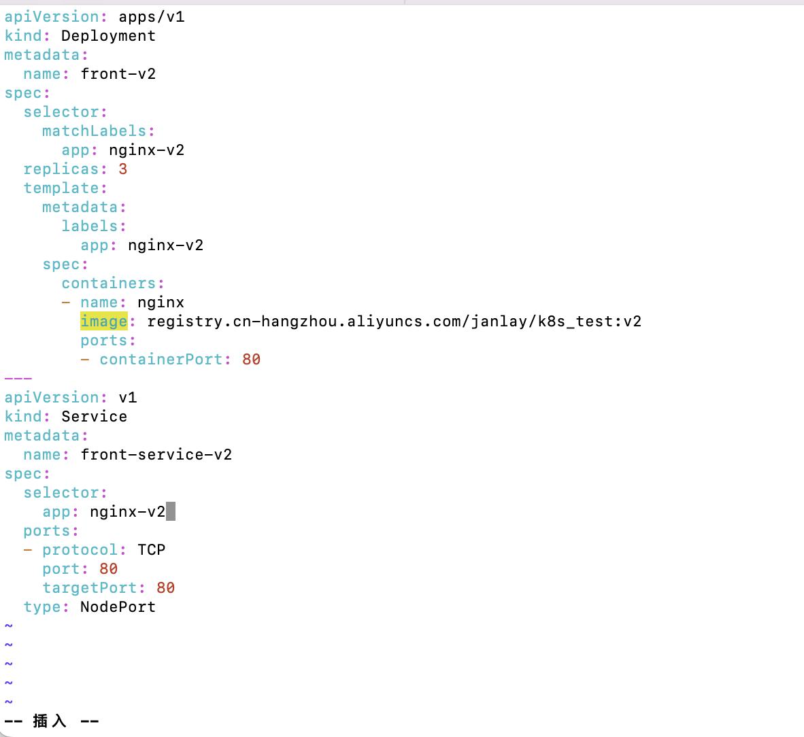

使用`kubectl apply`命令使其配置生效：

```shell
kubectl apply -f v2.yaml

[yy@master deployment]$ kubectl apply -f v2.yaml 
deployment.apps/front-v2 created
service/front-service-v2 created
```

**根据不同方案进行切分：**

##### 根据Cookie切分流量

基于`Cookie`切分流量。实现原理主要根据用户请求中的Cookie是否存在灰度标识Cookie去判断是否为灰度用户，再决定是否返回灰度版本服务。

新建一个全新的ingress配置文件，名称叫`gray`：

```shell
cd ./ingress && vim gray.yaml
```

输入以下配置：

```yaml
apiVersion: networking.k8s.io/v1
kind: Ingress
metadata:
  name: nginx-demo-canary
  annotations:
    kubernetes.io/ingress.class: nginx
    nginx.ingress.kubernetes.io/rewrite-target: /
    nginx.ingress.kubernetes.io/canary: "true"
    nginx.ingress.kubernetes.io/canary-by-cookie: "users_from_Beijing"
spec:
  rules:
  - http:
      paths:
      - path: /wss
        pathType: Prefix
        backend:
          service:
            name: front-service-v2
            port:
              number: 80
```

可以看到，在`annotations`这里，有两个关于灰度的配置项，分别是：

* nginx.ingress.kubernetes.io/canary：可选值为true/false，代表是否开启灰度功能
* nginx.ingress.kubernetes.io/canary-by-cookie：灰度发布`cookie`的`key`。当`key`对应的值等于`always`时，灰度触发生效；等于其他值时，则不会走灰度环境。

保存后使用`kubectl apply`生效配置文件：

```shell
kubectl apply -f gray.yaml

[yy@master ingress]$ kubectl apply -f gray.yaml 
ingress.networking.k8s.io/nginx-demo-canary created
```

执行成功后，可以使用`kubectl get svc`命令来获取`ingress`的外部端口：

```shell
kubectl -n ingress-nginx get svc
```

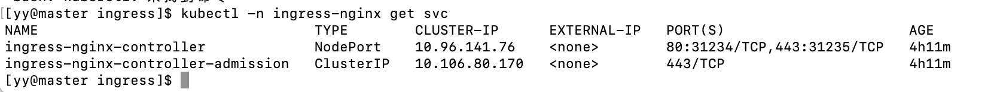

-n：根据资源名称进行模糊查询

其中PORT字段是我们可以访问的外部端口。`80`为`ingress`内部端口，`31234`为外部端口。

访问`http://IP:31234/wss`可以正常访问到页面


手动设置一个cookie，key为`users_from_Beijing`，值为`always`；再刷新页面

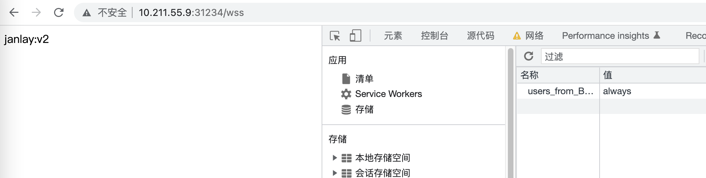

显示的是v2的页面，灰度发布环境搭建成功；设置值不是`always`，显示的还是v1的页面。

##### 基于Header切分流量

基于`Header`切分流量，实现原理主要根据用户请求中的header是否存在灰度标识header去判断是否为灰度用户，再决定是否返回灰度版本服务。

配置很简单，只需要修改`annotations`配置项即可：

* nginx.ingress.kubernetes.io/canary-by-header: 要灰度`header`的`key`值，如`"janlay"`
* nginx.ingress.kubernetes.io/canary-by-header-value: 要灰度`header`的`value`值，如`"isme"`

保存后，使用`kubectl apply`使配置文件生效：

```shell
kubectl apply -f gray.yaml

[yy@master ingress]$ kubectl apply -f gray.yaml 
ingress.networking.k8s.io/nginx-demo-canary configured
```

查看效果：使用curl命令来加header头去请求访问调用：

```shell
curl --header 'header的key:header的value' 127.0.0.1:端口值

[yy@master ingress]$ curl --header "janlay:isme" 127.0.0.1:31234/wss
janlay:v2
[yy@master ingress]$ curl --header "janlay:isme22" 127.0.0.1:31234/wss
janlay:v1
[yy@master ingress]$ curl 127.0.0.1:31234/wss
janlay:v1
```

通过对比发现，当`janlay`不是`isme`时，灰度失败，验证成功。

##### 基于权重切分流量

实现原理主要是根据用户请求，通过灰度百分比决定是否转发到灰度服务环境中。

简单修改`annotations`配置项：

* nginx.ingress.kubernetes.io/canary-weight：值是字符串，为`0-100`的数字，代表灰度环境命中概率。如果值为0，代表不会走灰度；值越大命中概率越大；当值为100，代表全走灰度。如`"30"`

保存后，使用`kubectl apply`命令是配置文件生效：

```shell
kubectl apply -f gray.yaml

[yy@master ingress]$ kubectl apply -f gray.yaml 
ingress.networking.k8s.io/nginx-demo-canary configured
```

使用shell脚本语言写个轮询，循环10次调用服务，看灰度命中概率：

```shell
for((i=1; i<=10; i++)); do curl 127.0.0.1:端口值; echo; done

[yy@master ingress]$ for((i=1; i<=10; i++)) do curl 127.0.0.1:31234/wss; echo; done
janlay:v1

janlay:v1

janlay:v1

janlay:v1

janlay:v2

janlay:v2

janlay:v1

janlay:v2

janlay:v1

janlay:v2

[yy@master ingress]$ 
```

这个命中概率是相对于单次请求而言。

##### 注意事项：优先级

如果同时配置三种方案，那么它们在`ingress`中的优先级是怎样的？在官方文档有一个`Note`提示：

> Canary rules are evaluated in order of precedence. Precedence is as follows: **canary-by-header -> canary-by-cookie -> canary-weight**

k8s会优先去匹配`header`，如果未匹配则去匹配`cookie`，最后是`weight`。

[ingress canary](https://kubernetes.github.io/ingress-nginx/user-guide/nginx-configuration/annotations/#canary)

**一些报错解决：**

[k8s no matches for kind “Ingress“ in version “extensions/v1](https://blog.csdn.net/qq_34202873/article/details/124796939)

[k8s no matches for kind “Ingress“ in version “extensions/v1](https://github.com/hashicorp/consul-helm/issues/785)

[ingress config](https://kubernetes.io/docs/concepts/services-networking/ingress/#the-ingress-resource)

[ingress-v1](https://kubernetes.io/docs/reference/kubernetes-api/service-resources/ingress-v1/)


### 2. 滚动发布

#### 2.1 什么是滚动发布

即一般所说的无宕机发布。一次取出一台/多台服务器（看策略配置）进行新版本更新。当取出的服务器新版确保无问题后，接着采用同等方式更新后面的服务器。

#### 2.2 发布流程和策略

##### 就绪状态

第一步，准备一组服务器。这组服务器当前服务的版本是v1；

接下来使用滚动策略，将其发布到v2版本。

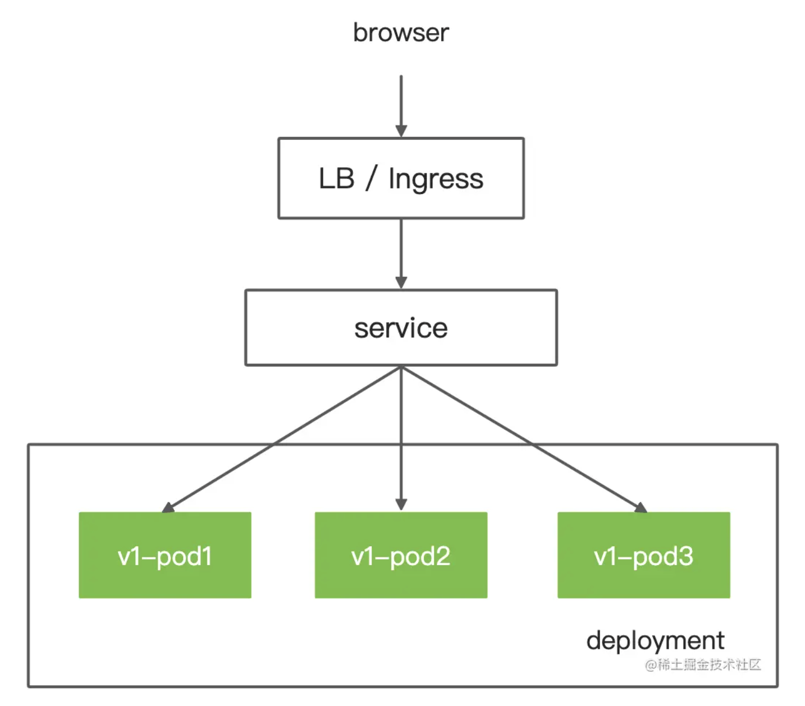

##### 升级第一个Pod

第二步，开始升级。

首先，增加一个v2版本的Pod1上来，将v1版本的Pod1下线但不移除。**此时，v1版本的Pod1将不会接受流量进来，而是进入一个平滑期等待状态（大约几十秒）后才会被杀掉。**

第一个Pod升级完毕

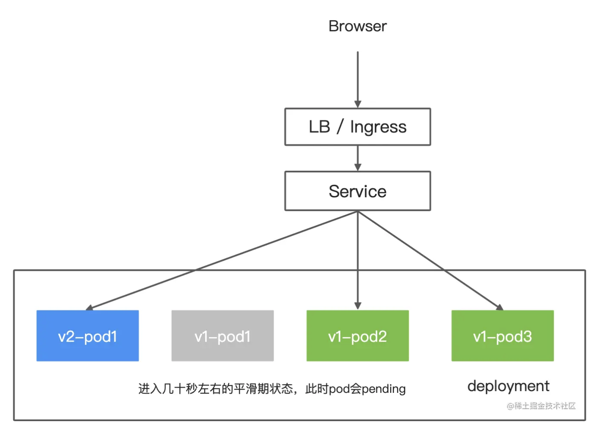

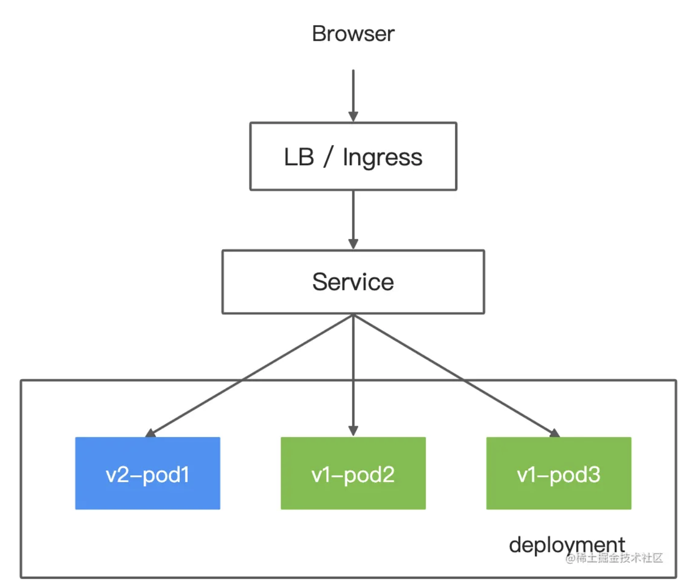

##### 升级剩下的Pod

与上同理，同样是新增新版本Pod后，将旧版本Pod下线进入平滑期但不删除，等平滑期度过后再删除Pod：

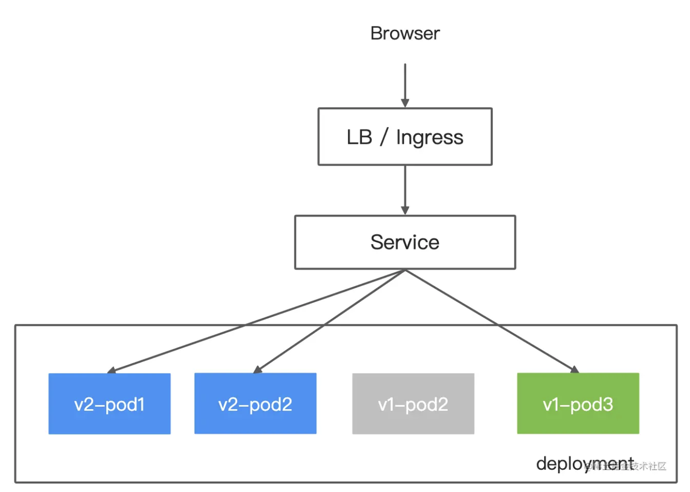

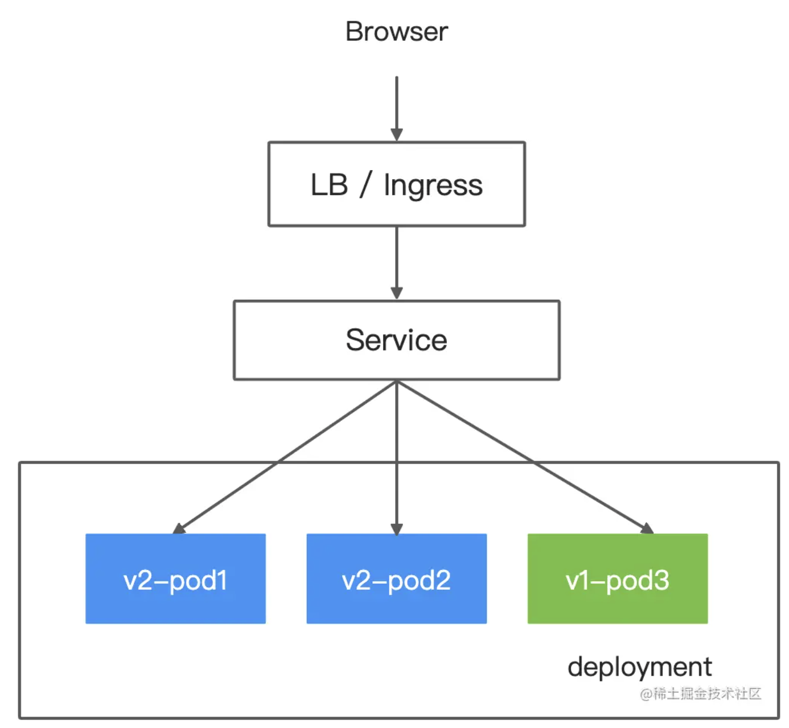

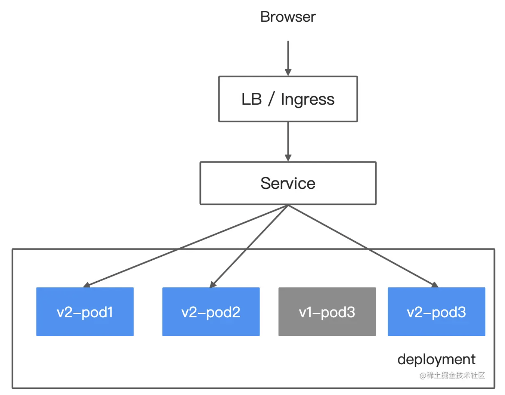

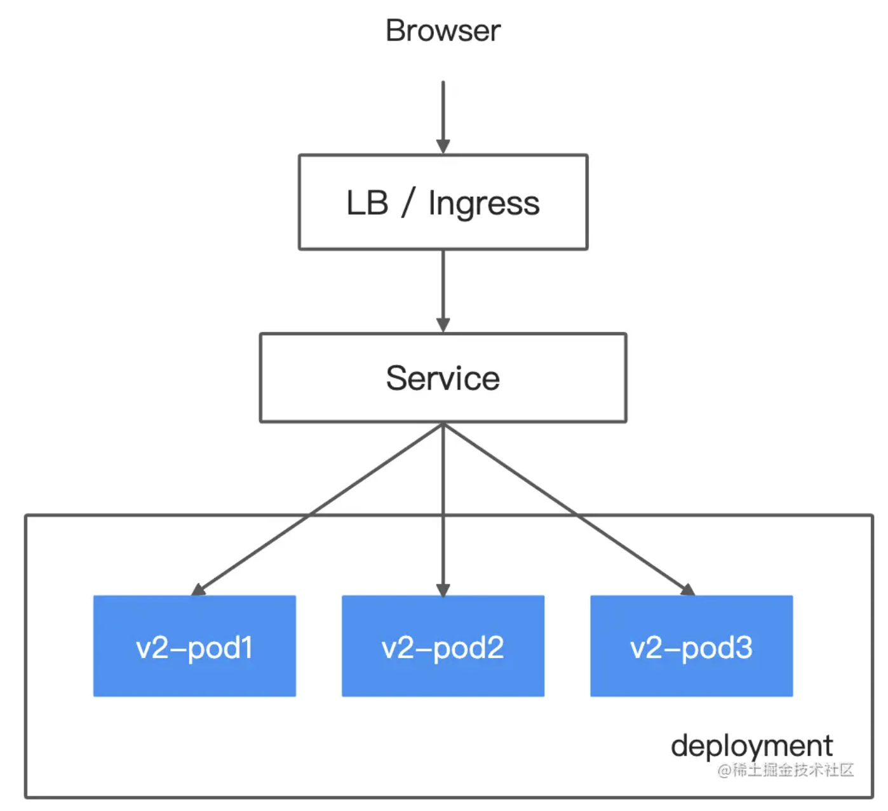

#### 2.3 优缺点

优点：

1. 不需要停机更新，无感知平滑更新；
2. 版本更新成本小，不需要新旧版本共存。

缺点：

1. 更新时间长：每次只更新一个/多个镜像，需要频繁连续等待服务启动缓冲
2. 旧版本环境无法得到备份：始终只有一个环境存在
3. 回滚版本异常痛苦：如果滚动发布到一半出了问题，回滚时需要使用同样的滚动策略回滚旧版本。

#### 2.4 Kubernetes中的滚动发布

在`Kubernetes`的`ReplicaSet`中，默认就是滚动发布镜像。我们只需要通过简单的配置即可调整滚动发布策略。

编辑`deployment`文件：

```shell
vim v2.yaml
```

```yaml
spec:
  minReadySeconds: 1
  strategy:
    # indicate which strategy we want for rolling update
    type: RollingUpdate
    rollingUpdate:
      maxSurge: 1
      maxUnavailable: 0
  # ...
```

| 字段                                  | 含义                                                         |
| ------------------------------------- | ------------------------------------------------------------ |
| minReadySeconds                       | 容器接收流量延缓时间，单位为秒，默认为0。如果没有设置的话，k8s会认为容器启动成功后就可以用了。设置该值可以延缓容器流量切分 |
| strategy.type = RollingUpdate         | ReplicaSet发布类型，声明为滚动发布，默认也为滚动发布         |
| strategy.rollingUpdate.maxSurge       | 最多Pod数量：数字类型/百分比。如maxSurge设置为1，replicas设置为10，则在发布过程中pod数量最多为10+1个（多出来的为旧版本pod，平滑期不可用状态）。maxUnavailable为0时，该值不能也设置为0 |
| strategy.rollingUpdate.maxUnavailable | 升级中最多不可用pod的数量：数字类型/百分比。当maxSurge为0时，该值不能也设置为0 |

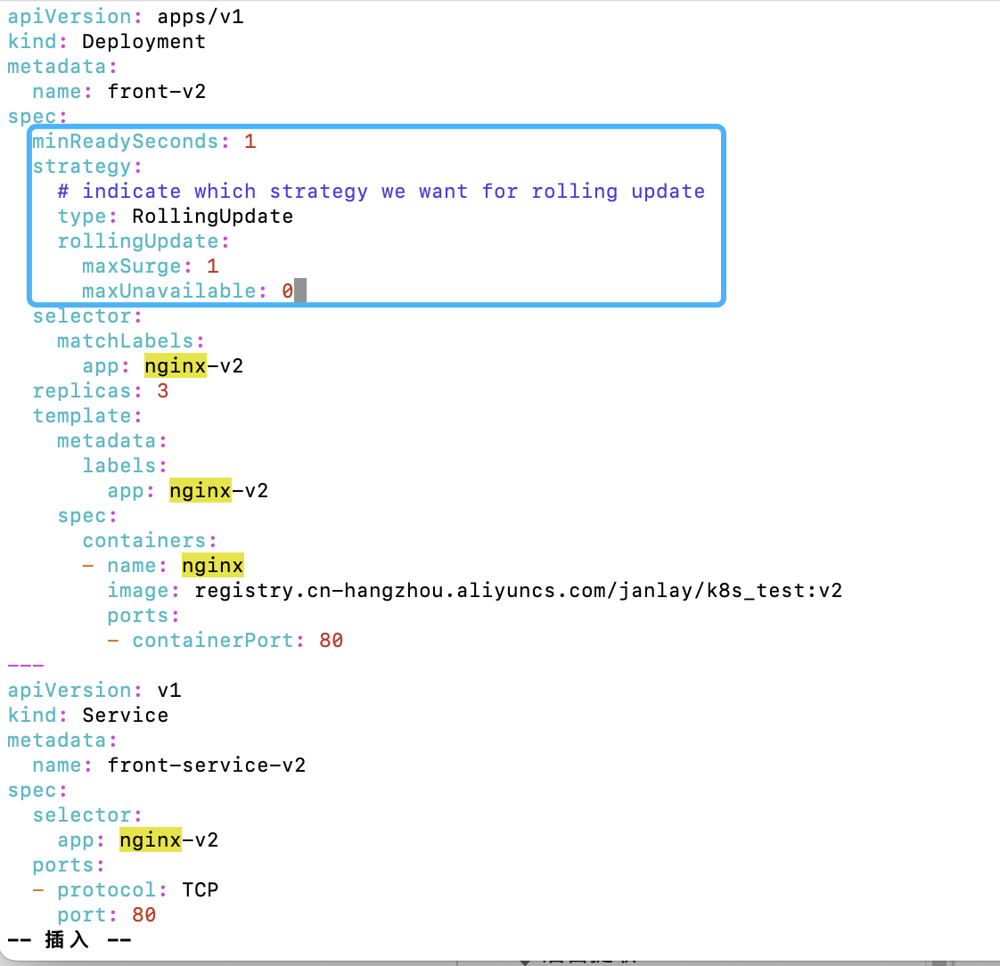

编辑结束后，保存文件，接着使`Kubernetes`生效配置。

```shell
kubectl apply -f v2.yaml

[yy@master deployment]$ kubectl apply -f v2.yaml 
deployment.apps/front-v2 configured
service/front-service-v2 unchanged
```

配置生效后立即继续发布动作，随后监听查看发布状态更改：

```shell
kubectl rollout status deployment/front-v2

[yy@master deployment]$ kubectl rollout status deployment/front-v2
Waiting for deployment "front-v2" rollout to finish: 3 of 10 updated replicas are available...
Waiting for deployment "front-v2" rollout to finish: 3 of 10 updated replicas are available...
Waiting for deployment "front-v2" rollout to finish: 3 of 10 updated replicas are available...
Waiting for deployment "front-v2" rollout to finish: 3 of 10 updated replicas are available...
Waiting for deployment "front-v2" rollout to finish: 3 of 10 updated replicas are available...
Waiting for deployment "front-v2" rollout to finish: 3 of 10 updated replicas are available...
Waiting for deployment "front-v2" rollout to finish: 8 of 10 updated replicas are available...
Waiting for deployment "front-v2" rollout to finish: 8 of 10 updated replicas are available...
deployment "front-v2" successfully rolled out
```

原replicas为3时更新的比较快，看不到过程waiting，把replicas改为10。通过日志可以看出更新逻辑为：逐个地去更新Pod，而不是一次性将旧的Pod全部杀死后，再启动新的Pod。

通过简单的配置，我们就可以在k8s中实现滚动发布。

#### 2.5 另一种发布模式

`k8s`的默认发布方式是滚动发布，还有一种发布方式为`Recreate`。这种发布方式比较暴力，它会直接把所有旧的`Pod`全部杀死，杀死后再批量创建新的`Pod`。

将`strategy.type`改为`Recreate`即可：

```shell
vim v2.yaml
# type: Recreate
```

接着更新`deployment`并查看发布状态：

```shell
kubectl apply -f v2.yaml && kubectl rollout status deployment/front-v2

[yy@master deployment]$ vim v2.yaml 
[yy@master deployment]$ kubectl apply -f v2.yaml && kubectl rollout status deployment/front-v2
service/front-service-v2 unchanged
The Deployment "front-v2" is invalid: spec.strategy.rollingUpdate: Forbidden: may not be specified when strategy `type` is 'Recreate'
[yy@master deployment]$ vim v2.yaml 
[yy@master deployment]$ kubectl apply -f v2.yaml && kubectl rollout status deployment/front-v2
deployment.apps/front-v2 configured
service/front-service-v2 unchanged
deployment "front-v2" successfully rolled out
```

比较快看不到过程（😒）

`k8s`会将所有旧的`Pod`杀死，随后再批量启动新的`Pod`。

这种发布方式相对滚动发布偏暴力；且在发布空窗期（杀死旧Pod，新Pod还没创建成功的情况下）服务会不可用。

#### 2.6 kubectl rollout命令

`kubectl rollout`命令可以用来管理`deployment`的资源，包括对版本的快速回退，暂停/恢复版本更新，根据更新历史回退版本等功能。

暂停一个`deployment`的发布：

```shell
kubectl rollout pause deployment/名称
```

继续一个`deployment`的发布：

```shell
kubectl rollout resume deployment/名称
```

查看一个`deployment`的发布状态：

```shell
kubectl rollout status deployment/名称
```

