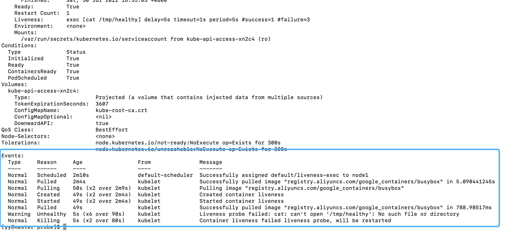
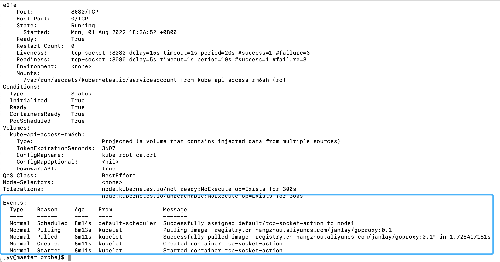
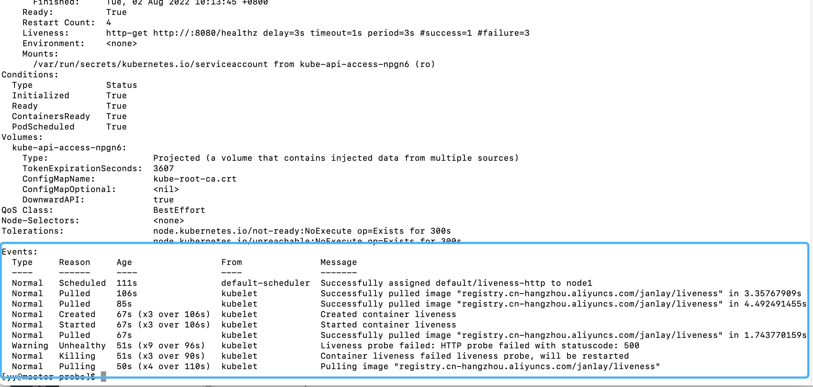

## 服务可用性探针：如何判断你的服务是否可用

`kubernetes`以什么依据，判断`Pod`启动成功？

### 1. 什么是健康度检查？

之前的部署中，当`Pod`的状态为`Running`时，该`Pod`就可以被分配流量（可以访问到）了。但是，这种检查方式对于一部分Pod来说是不靠谱的。

一般一个后端容器启动成功，不一定代表服务启动成功；在后端容器启动后，部分SQL、消息队列、配置文件等其他服务的连接还在初始化，但是容器的外部状态却是启动成功。在这种情况下，直接去访问Pod必然会有问题。

有什么办法可以自己控制流量分配的标准呢？


### 2. 什么是服务探针？

探针一词，和古代银针试毒的概念差不多。

在`kubernetes`中，探针用来检测`Pod`的可用情况。在`kubernetes`中，有三种探针可以使用：

#### 2.1 存活探针 livenessProbe

存活探针是对运行中的容器检测的；如果想检测你的服务在运行中有没有发生崩溃，服务有没有中途退出或无响应，可以使用这个探针。

如果探针探测到错误，`Kubernetes`就会杀掉这个`Pod`；否则就不会进行处理。如果没有配置这个探针，`Pod`不会被杀死。

#### 2.2 可用探针 readinessProbe

作用是用来检测Pod是否允许被访问到（是否准备好接收流量）；如果你的服务加载很多数据，或者有其他需求要求在特定情况下不被分配到流量，可以使用这个探针。

如果探针检测失败，流量就不会分配给该Pod。在没有配置该探针的情况下，会一直将流量分配给Pod。

#### 2.3 启动探针startupProbe

作用是用来检测Pod是否已经启动成功；如果你的服务启动需要一些加载时长（如初始化日志、等待其他调用的服务启动成功）才代表服务启动成功，则可以用这个探针。

如果探针检测失败，该Pod就会被杀死重启。在没有配置该探针的情况下，默认不会杀死`Pod`。

在启动探针运行时，其他所有的探针检测都会失效。

#### 2.4 对比三种类型探针

`Kubernetes`内置了三种健康度探针，可以分别在启动时和运行时为我们的Pod做检测。

对比表格：

| 探针名称 | 在哪个环节触发 | 作用                               | 检测失败对Pod的反应               |
| -------- | -------------- | ---------------------------------- | --------------------------------- |
| 存活探针 | Pod运行时      | 检测服务是否崩溃，是否需要重启服务 | 杀死Pod并重启                     |
| 可用探针 | Pod运行时      | 检测服务是不是允许被访问到         | 停止Pod的访问调度，不会被杀死重启 |
| 启动探针 | Pod运行时？    | 检测服务是否启动成功               | 杀死Pod并重启                     |

配置方式很简单，只需要在`containers.livenessProbe/readinessProbe/startupProbe`下配置即可


### 3. 三种探测方式

虽然探针类型不同，触发的阶段不同，但是探测方式都是一样的，检测的API也是一样的。

#### 3.1 ExecAction

这种方式是在Pod的容器内执行预定的shell脚本命令。如果执行的命令没有报错退出（返回值为0），代表容器状态健康；否则就是有问题的。

🌰：一个创建Pod的配置文件。里面配置了一个存活探针livenessProbe + ExecAction命令检测。其中，`livenessProbe.exec`代表去执行一段命令，`command`则是要执行的探针命令；`livenessProbe`代表声明一个存活探针。

```yaml
apiVersion: v1
kind: Pod
metadata:
  labels:
    test: liveness
  name: liveness-exec
spec:
  containers:
  - name: liveness
    image: registry.aliyuncs.com/google_containers/busybox
    args:
    - /bin/sh
    - -c
    - touch /tmp/healthy; sleep 30; rm -rf /tmp/healthy; sleep 600
    livenessProbe:
      exec:
        command:
        - cat
        - /tmp/healthy
      initialDelaySeconds: 5
      periodSeconds: 5
```

Pod启动成功时，会自动执行命令：新建一个`/tmp/healthy`文件 => 睡眠30秒 => 删除`/tmp/healthy` 文件=> 睡眠600秒

```shell
touch /tmp/healthy; sleep 30; rm -rf /tmp/healthy; sleep 600
```

我们的探针在第一次等待5秒后探测，会去尝试访问`/tmp/healthy`文件来判断检测结果。然而，只有在`Pod`运行的前30秒，这个文件才存在；第30秒之后文件被删除，探针就访问不到这个文件了，于是只好按照失败规则重启`Pod`。

* 新建配置文件，应用，然后查看效果：

```shell
[yy@master probe]$ vim liveness-exec.yaml
[yy@master probe]$ kubectl apply -f liveness-exec.yaml && date && kubectl get pods | grep liveness-exec
pod/liveness-exec created
2022年 07月 30日 星期六 16:33:43 CST
liveness-exec               0/1     ContainerCreating   0          0s
```

* 等待30秒后，通过`kubectl describe`命令查看Pod的运行全览状态：

```shell
kubectl describe pods liveness-exec
```

可以看到打印出的Events：



可以看到，在运行一段时间后，探针探测失败，Pod被迫重启，接着创建了新的Pod。

```shell
[yy@master probe]$ kubectl get pod liveness-exec
NAME            READY   STATUS    RESTARTS        AGE
liveness-exec   1/1     Running   367 (55s ago)   2d18h
```

一旦失败的容器恢复为运行状态，`RESTARTS` 计数器就会增加 1

#### 3.2 TCPSocketAction

这种方式是使用TCP套接字检测。Kubernetes会尝试在Pod内与指定的端口进行连接，如果能建立连接（Pod的端口打开了），就代表这个容器是健康的，如果不能，则代表这个Pod是有问题的。

🌰：新建一个Pod配置文件。定义一个可用探针 + 存活探针，检测方式为TCP检测。探针会在容器启动成功5秒后开始检测，每10秒检测一次，每次会尝试访问Pod的`8080`端口。

```yaml
apiVersion: v1
kind: Pod
metadata:
  name: tcp-socket-action
  labels:
    app: tcp-socket-action
spec:
  containers:
  - name: tcp-socket-action
    image: registry.cn-hangzhou.aliyuncs.com/janlay/goproxy:0.1
    ports:
    - containerPort: 8080
    readinessProbe:
      tcpSocket:
        port: 8080
      initialDelaySeconds: 5
      periodSeconds: 10
    livenessProbe:
      tcopSocket:
        port: 8080
      initialDelaySeconds: 15
      periodSeconds: 20
```

* 新建配置文件，应用，然后查看效果：

```shell
[yy@master probe]$ vim tcp-socket-action.yaml
[yy@master probe]$ kubectl apply -f tcp-socket-action.yaml && kubectl get Pods | grep tcp-socket-action
pod/tcp-socket-action created
tcp-socket-action           0/1     ContainerCreating   0                 0s
```

* 等待一段时间，通过`kubectl describe`命令查看Pod的运行全览状态：

```shell
kubectl describe pods tcp-socket-action
```



可以看到，探针检测成功

#### 3.3 HTTPGetAction

这种方式是使用HTTP GET请求检测。Kubernetes会尝试访问Pod内指定的API路径，如果返回200，代表容器就是健康的；如果不能，代表这个Pod是有问题的。

🌰：配置一个存活探针。探针将会在容器启动成功后3秒开始进行检测，每隔3秒检测一次，每次都会携带`httpHeaders`内填写的请求头，并尝试访问`8080`端口下的`/healthz`地址。

```yaml
apiVersion: v1
kind: Pod
metadata:
  labels:
    test: liveness
  name: liveness-http
spec:
  containers:
  - name: liveness
    image: registry.cn-hangzhou.aliyuncs.com/janlay/liveness
    args:
    - /server
    livenessProbe:
      httpGet:
        path: /healthz
        port:8080
        httpHeaders:
        - name: Custom-Header
          value: Awesome
      initialDelaySeconds: 3
      periodSeconds: 3
```

容器内`/healthz`地址的编写规则是：容器启动`10`秒钟内会返回`200`状态码；之后统一返回`500`状态码。

```go
http.HandleFunc("/healthz", func(w http.ResponseWriter, r *http.Request) {
  duration := time.Now().Sub(started)
  if duration.Seconds() > 10 {
    w.WriteHeader(500)
    w.Write([]byte(fmt.Sprintf("error: %v", duration.Seconds())))
  } else {
    w.WriteHeader(200)
    w.Write([]byte("ok"))
  }
})
```

接着保存配置文件，等待10-20秒后查看结果

```shell
vim liveness-http.yaml
kubectl apply -f liveness-http.yaml
kubectl describe prods liveness-http # 等10-20秒后再执行
```

可以看到，Pod启动一段时间后，探针检测到返回值500后，标记检测失败，并回收了Pod重新创建。

```shell
[yy@master probe]$ kubectl get pods | grep liveness-http
liveness-http               1/1     Running            2 (7s ago)        49s
[yy@master probe]$ kubectl get pods | grep liveness-http
liveness-http               0/1     CrashLoopBackOff   3 (7s ago)        85s
```



### 4. 控制探针检测的行为

有什么参数可以修改检测行为呢？

`Kubernetes`给我们准备了一些额外的参数帮助我们来定义检测行为：

* initialDelaySeconds：容器初始化等待多少秒后才会触发探针，默认为0
* periodSeconds：执行探测的时间间隔，默认10秒，最少1秒
* timeoutSeconds：探测超时时间，默认1秒，最少1秒
* successThreshold：探测失败后的最小连接成功数量，默认是1
* failureThreshold：探测失败后的重试次数，默认是3，最小是1

[参考资料](https://kubernetes.io/zh-cn/docs/tasks/configure-pod-container/configure-liveness-readiness-startup-probes/#define-a-TCP-liveness-probe)