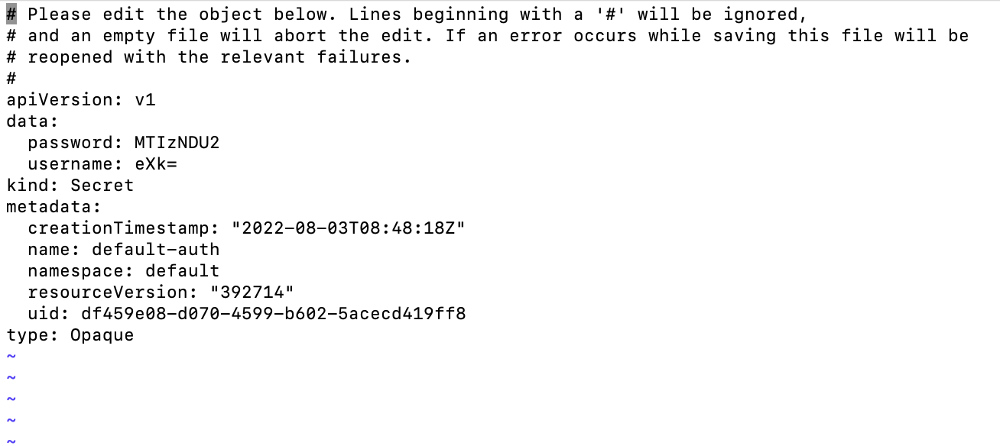
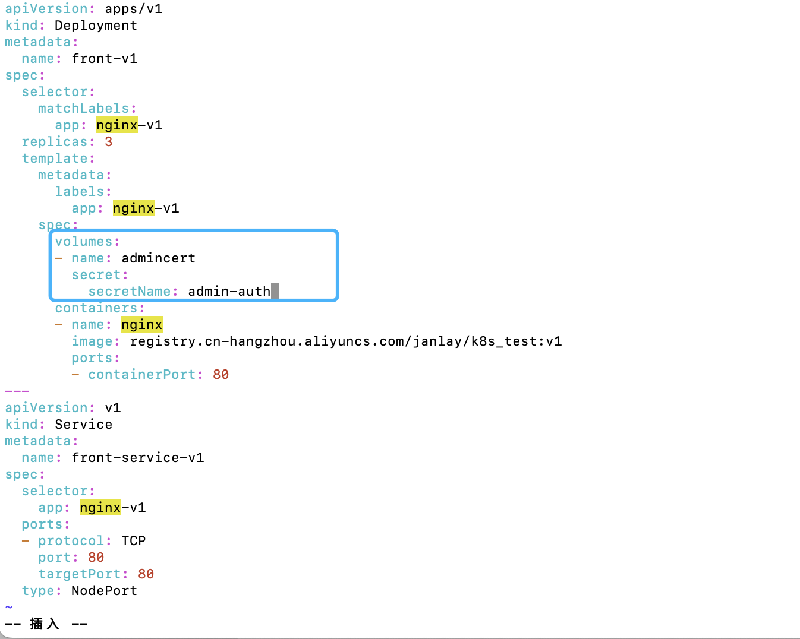
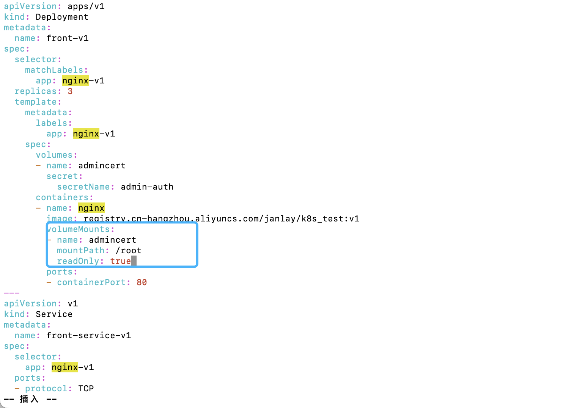
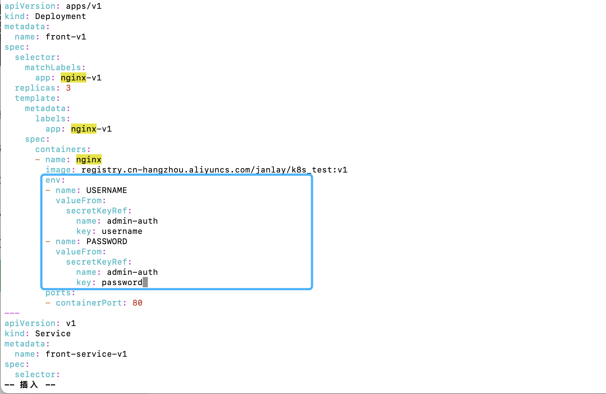
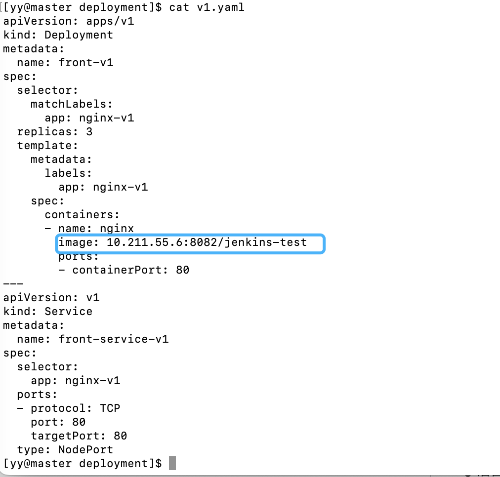
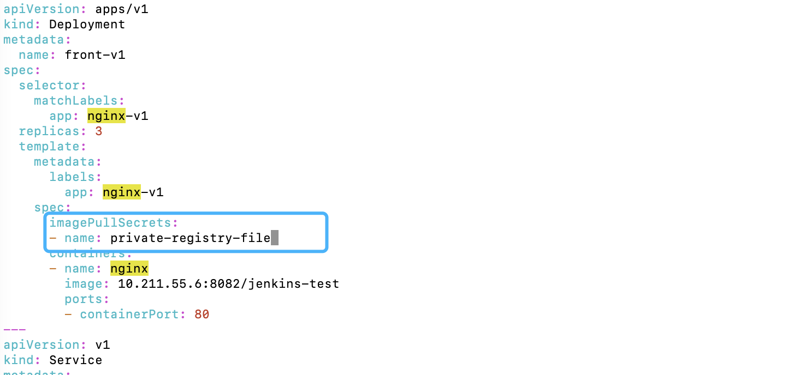

## Kubernetes Secret: 存储你的机密信息

在部署时，难免会遇到一些要存放**机密内容**的需求，例如数据库密码、用户名密码、公钥私钥、`token`等等机密内容，甚至还有`docker`私有库的密码。这些内容显然是不能写死在代码里，更不可能明文挂载进去。

有什么好的解决方案呢？`Kubernetes`中的一个概念——`Secret`

### 1. 什么是Secret

Secret是Kubernetes内的一种资源类型，可以用它来存放一些机密信息。信息被存入后，可以使用挂载卷的方式挂载进我们的Pod内；当然也可以存放docker私有镜像库的登录名和密码，用于拉取私有镜像。

### 2. Secret的几种类型

在k8s中，Secret有多种类型可以配置

#### 2.1 Opaque类型

这种类型比较常用，一般用来存放密码、密钥等信息，存储格式为`base64`。注：base64并不是加密格式，依然可以通过decode来解开它。

**可以使用命令创建。**

* 通过命令`kubectl create secret generic`创建：

```shell
kubectl create secret generic default-auth --from-literal=username=yy \
--from-literal=password=123456
```

```shell
[yy@master secret]$ kubectl create secret generic default-auth --from-literal=username=yy \
> --from-literal=password=123456
secret/default-auth created
```

`default-auth`为自定义的名称；`--from-literal`的后面跟随一组`key=value`。可以按照此格式继续向后拼接你要存储的信息

* 存储成功后，可以通过`kubectl get secret`命令来查看你存储的`Secret`。

```shell
kubectl get secret
```

`NAME`是`Secret`的名称；`TYPE`代表`Secret`的类型；`DATA`是`Secret`存储内容的数量；`AGE`是创建到现在的时间

```shell
[yy@master secret]$ kubectl get secret
NAME                  TYPE                                  DATA   AGE
default-auth          Opaque                                2      44s
default-token-qkb7k   kubernetes.io/service-account-token   3      7d5h
```

* 可以通过`kubectl edit secret`命令来编辑`default-auth`的内容，来看看里面到底存了什么内容：

```shell
kubectl edit secret default-auth
```

> 也可以用`kubectl get secret [secret-name] -o yaml`命令，将内容打印到终端上查看。
>
> `-o yaml`代表输出为yaml格式内容，当然也可以输出json等格式内容



可以看到，data字段存放了我们存储的信息转为`base64`的结果。我们可以通过解码base64来获取真实值：

```shell
echo [base64 data] | base64 -d
```

> `-d`代表`--decode`，就是解码的意思

```shell
[yy@master secret]$ echo MTIzNDU2 | base64 -d
123456
```

解码后，我们可以看到原始内容。

**除了通过命令创建，还可以通过配置文件创建。**

* 新建一个文件，名称叫`admin-auth.yaml`，输入以下配置：

```yaml
apiVersion: v1
kind: Secret
metadata:
  name: admin-auth
stringData:
  username: wss
  password: wss@1234
type: Opaque
```

`name`代表`Secret`的名称，即`admin-auth`；`type`代表它的类型，即`Opaque`；`stringData`代表存储的内容，格式为`key:value`。

* 保存后退出，使用`kubectl apply -f`命令使配置生效；接着使用`kubectl get secret admin-auth -o yaml`查看内容：

```shell
kubectl apply -f admin-auth.yaml
kubectl get secret admin-auth -o yaml
```

可以看到创建成功。

```shell
[yy@master secret]$ kubectl apply -f admin-auth.yaml 
secret/admin-auth created
[yy@master secret]$ kubectl get secret admin-auth -o yaml
apiVersion: v1
data:
  password: d3NzQDEyMzQ=
  username: d3Nz
kind: Secret
metadata:
  annotations:
    kubectl.kubernetes.io/last-applied-configuration: |
      {"apiVersion":"v1","kind":"Secret","metadata":{"annotations":{},"name":"admin-auth","namespace":"default"},"stringData":{"password":"wss@1234","username":"wss"},"type":"Opaque"}
  creationTimestamp: "2022-08-04T02:24:53Z"
  name: admin-auth
  namespace: default
  resourceVersion: "430808"
  uid: 7b0b6a39-7276-49ce-a230-989f2c22cd0d
type: Opaque

```

#### 2.2 私有镜像库认证

私有镜像库认证类型，也比较常用，一般在拉取私有库的镜像时使用。

* 可以通过命令行进行创建，类型是`docker-registry`：

```shell
kubectl create secret docker-registry private-registry \
--docker-username=[用户名] \
--docker-password=[密码] \
--docker-email=[邮箱] \
--docker-server=[私有镜像库地址]
```

* 创建成功后，可以使用`kubectl get secret`命令查看配置的私有库密钥组：

```shell
kubectl get secret private-registry -o yaml
```

```shell
[yy@master secret]$ kubectl create secret docker-registry private-registry \
> --docker-username=admin \
> --docker-password=123456 \
> --docker-email=yeying0827@126.com \
> --docker-server=http://10.211.55.6:8082
secret/private-registry created
[yy@master secret]$ kubectl get secret private-registry -o yaml
apiVersion: v1
data:
  .dockerconfigjson: eyJhdXRocyI6eyJodHRwOi8vMTAuMjExLjU1LjY6ODA4MiI6eyJ1c2VybmFtZSI6ImFkbWluIiwicGFzc3dvcmQiOiIxMjM0NTYiLCJlbWFpbCI6InlleWluZzA4MjdAMTI2LmNvbSIsImF1dGgiOiJZV1J0YVc0Nk1USXpORFUyIn19fQ==
kind: Secret
metadata:
  creationTimestamp: "2022-08-04T02:37:02Z"
  name: private-registry
  namespace: default
  resourceVersion: "431852"
  uid: 41b3912f-9cdb-444e-9589-2c020ee1f1ef
type: kubernetes.io/dockerconfigjson
```

可以看到，k8s自动帮我们填写了一个key，为`.dockerconfigjson`，value是一串base64值。可以使用`base64 -d`命令查看真实内容：

```shell
echo [base64 data] | base64 -d
```

```shell
[yy@master secret]$ echo eyJhdXRocyI6eyJodHRwOi8vMTAuMjExLjU1LjY6ODA4MiI6eyJ1c2VybmFtZSI6ImFkbWluIiwicGFzc3dvcmQiOiIxMjM0NTYiLCJlbWFpbCI6InlleWluZzA4MjdAMTI2LmNvbSIsImF1dGgiOiJZV1J0YVc0Nk1USXpORFUyIn19fQ== | base64 -d
{"auths":{"http://10.211.55.6:8082":{"username":"admin","password":"123456","email":"yeying0827@126.com","auth":"YWRtaW46MTIzNDU2"}}}
```

通过解码可以看到，是k8s自动创建的一串`dockerconfig`的`json`串。在k8s拉取镜像时，可以使用这个`json`串来进行身份认证。

私有镜像库密钥组也可以通过配置文件创建。

* 编辑文件`private-registry-file.yaml`文件，并输入以下内容：

```yaml
apiVersion: v1
kind: Secret
metadata:
  name: private-registry-file
data:
  .dockerconfigjson: xxxxxxx
type: kubernetes.io/dockerconfigjson  
```

声明的配置文件更像一份`dockerconfig`，而不只是单纯的镜像库身份认证。

`data`内的字段必须为`.dockerconfigjson`，值是一串`dockerconfigjson`的`base64`值，`type`则是`kubernetes.io/dockerconfigjson`，意思是声明一份`dockerconfig`的配置。

* 保存后退出，使用`kubectl apply -f`命令使配置生效。并使用`kubectl get secret`命令查看配置详情：

```shell
kubectl apply -f privte-registry-file.yaml
kubectl get secret private-registry-file -o yaml
```

```shell
[yy@master secret]$ vim private-registry-file.yaml
[yy@master secret]$ kubectl apply -f private-registry-file.yaml 
secret/private-registry-file created
[yy@master secret]$ kubectl get secret private-registry-file -o yaml
apiVersion: v1
data:
  .dockerconfigjson: eyJhdXRocyI6eyJodHRwOi8vMTAuMjExLjU1LjY6ODA4MiI6eyJ1c2VybmFtZSI6ImFkbWluIiwicGFzc3dvcmQiOiIxMjM0NTYiLCJlbWFpbCI6InlleWluZzA4MjdAMTI2LmNvbSIsImF1dGgiOiJZV1J0YVc0Nk1USXpORFUyIn19fQ==
kind: Secret
metadata:
  annotations:
    kubectl.kubernetes.io/last-applied-configuration: |
      {"apiVersion":"v1","data":{".dockerconfigjson":"eyJhdXRocyI6eyJodHRwOi8vMTAuMjExLjU1LjY6ODA4MiI6eyJ1c2VybmFtZSI6ImFkbWluIiwicGFzc3dvcmQiOiIxMjM0NTYiLCJlbWFpbCI6InlleWluZzA4MjdAMTI2LmNvbSIsImF1dGgiOiJZV1J0YVc0Nk1USXpORFUyIn19fQ=="},"kind":"Secret","metadata":{"annotations":{},"name":"private-registry-file","namespace":"default"},"type":"kubernetes.io/dockerconfigjson"}
  creationTimestamp: "2022-08-04T02:45:16Z"
  name: private-registry-file
  namespace: default
  resourceVersion: "432558"
  uid: 41ff39a1-e53f-4540-94ef-3ab769b393bb
type: kubernetes.io/dockerconfigjson
```

可以看到，配置内容和命令行创建的是一样的，创建成功

### 3. 使用方法

上述是声明一个`Secret`。在`k8s`中，可以有三种方式使用`Secret`。

#### 3.1 Volume挂载

通过存储卷的方式挂载进去。

🌰：编辑`front-v1`的`deployment`配置文件

1. 在Pod层面设置一个外部存储卷，存储卷类型为`secret`。

   在`template.spec`下配置volumes，声明一个外置存储卷，存储卷名称为`admincert`，类型为`secret`；`Secret`的名称为`admin-auth`:

   

2. 在容器配置存储卷。

   在`containers[].name`下增加字段`volumeMounts`，`name`值和`template.spec.volumes[].name`对应；`mountPath`是要挂载到容器内哪个目录；`readOnly`代表文件是不是只读：

   

3. 编辑完后，保存退出。使用`kubectl apply -f`命令使配置文件生效

   ```shell
   kubectl apply -f v1.yaml
   
   [yy@master deployment]$ vim v1.yaml 
   [yy@master deployment]$ kubectl apply -f v1.yaml
   deployment.apps/front-v1 configured
   service/front-service-v1 unchanged
   ```

   此时，`Pod`会被杀死重新创建。可以通过`kubectl get pods`命令查看现在运行的`Pod`：

   ```shell
   [yy@master deployment]$ kubectl get pods
   NAME                        READY   STATUS    RESTARTS        AGE
   front-v1-797bb8b68d-btblf   1/1     Running   0               31s
   front-v1-797bb8b68d-fxgrl   1/1     Running   0               33s
   front-v1-797bb8b68d-z7jgl   1/1     Running   0               35s
   front-v2-7d6cc557fb-45xpq   1/1     Running   0               5d1h
   front-v2-7d6cc557fb-88vpk   1/1     Running   0               5d1h
   ...
   ```

   可以看到，`Pod`状态为`Running`。

   在运行正常的情况下，我们可以使用`kubectl exec`命令在`Pod`容器内执行我们要执行的命令。在这里，我们查看`Pod`镜像内的`/root`文件夹里面都有啥文件：

   > kubectl exec 命令格式：kubectl exec [POD] -- [COMMAND]

```shell
kubectl exec -it [POD_NAME] -- ls /root
```

```shell
[yy@master deployment]$ kubectl exec -it front-v1-797bb8b68d-btblf -- ls /root
password  username
```

可以看到有2个文件，都是我们在`secret`内配置的`key`。接着使用`kubectl exec`命令查看文件内容：

```shell
kubectl exec -it [POD_NAME] -- cat /root/password
kubectl exec -it [POD_NAME] -- cat /root/username
```

```shell
[yy@master deployment]$ kubectl exec -it front-v1-797bb8b68d-btblf -- cat  /root/password
wss@1234[yy@master deployment]$ kubectl exec -it front-v1-797bb8b68d-btblf -- cat  /root/username
wss[yy@master deployment]$
```

此时代表挂载成功，可以使用

#### 3.2 环境变量注入

第二种是将`Secret`注入进容器的环境变量。同样需要配置`deployment`文件：找到`containers`，下面新加一个`env`字段。



其中：`env[].name`为环境变量的`key`，`valueFrom`代表值从哪里获取，`secretKeyRef`代表是一个`Secret`类型的`value`；`secretKeyRef.name`则是要引用的`secret`的名称，`key`是`secret`中配置的`key`值。

编辑完后，保存并退出。使用`kubectl apply -f`命令使配置文件生效。

```shell
kubectl apply -f v1.yaml

[yy@master deployment]$ kubectl apply -f v1.yaml 
deployment.apps/front-v1 configured
service/front-service-v1 unchanged

[yy@master deployment]$ kubectl get pods
NAME                        READY   STATUS    RESTARTS        AGE
front-v1-56b89f5ff7-t5md7   1/1     Running   0               29s
front-v1-56b89f5ff7-vsnhb   1/1     Running   0               24s
front-v1-56b89f5ff7-w56pg   1/1     Running   0               26s
front-v2-7d6cc557fb-45xpq   1/1     Running   0               5d1h
front-v2-7d6cc557fb-88vpk   1/1     Running   0               5d1h
...
```

生效后，在最新的Pod内使用`kubectl exec`命令来查看环境变量注入的结果：

```shell
kubectl exec -it [POD_NAME] -- env

[yy@master deployment]$ kubectl exec -it front-v1-56b89f5ff7-t5md7 -- env
PATH=/usr/local/sbin:/usr/local/bin:/usr/sbin:/usr/bin:/sbin:/bin
HOSTNAME=front-v1-56b89f5ff7-t5md7
TERM=xterm
USERNAME=wss
PASSWORD=wss@1234
...
```

可以看到，配置的2个环境变量均已被注入进去。

#### 3.3 Docker私有库认证

第三种是Docker私有库类型，这种方法只能使用私有镜像库认证。

首先，先尝试不加认证去拉取一个私有库镜像。编辑`front-v1`的`deployment`，把镜像换成私有库的镜像。保存后使用`kubectl apply`使配置生效：



```shell
kubectl apply -f v1.yaml
```

接着使用`kubectl get pods`查看目前pod的状态：

```shell
kubectl get pods
```

可以看到`front-v1`的`Pod`无法拉取镜像。使用`kubectl describe`命令查看该Pod的具体状态：

```shell
kubectl describe pods [POD_NAME]
```

找到`Events`可以看到有条`message`写着：**unauthorized: access to the requested resource is not authorized（要请求的资源没有认证）**。此时不登录，无法拉取私有镜像。（**可以拉取**？？😅😅）

这时需要配置下`deployment`文件。

找到`spec`，在下面添加一个`imagePullSecrets`字段，该字段代表了在拉取Pod所需的镜像时需要的认证信息。其中`name`字段为上面配置过的私有镜像库认证名。



编辑后保存，使用`kubectl apply -f`命令使配置文件生效；接着查看Pod的运行状态。

```shell
kubectl apply -f v1.yaml
kubectl get pod

[yy@master deployment]$ kubectl delete -f v1.yaml 
deployment.apps "front-v1" deleted
service "front-service-v1" deleted
[yy@master deployment]$ kubectl apply -f v1.yaml 
deployment.apps/front-v1 created
service/front-service-v1 created
[yy@master deployment]$ kubectl get pod
NAME                        READY   STATUS    RESTARTS        AGE
front-v1-87545985b-7jttg    1/1     Running   0               9s
front-v1-87545985b-c42hb    1/1     Running   0               9s
front-v1-87545985b-hn6pz    1/1     Running   0               9s
front-v2-7d6cc557fb-45xpq   1/1     Running   0               5d4h
```

此时Pod就可以成功拉取私有镜像了。