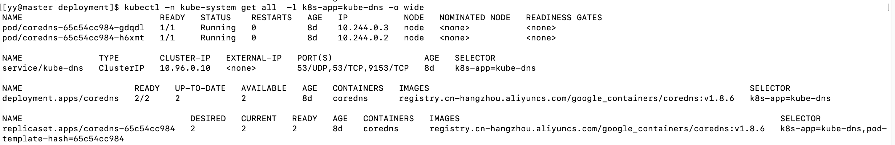

## Kubernetes DNS策略：将你的服务连接起来

项目中可能遇到的情况：

> 用Nginx做负载均衡，如何才能转发到别的服务上面？后端需要MySQL数据库，怎样才能连接到同级服务的数据库？

这些场景都有个共性问题：A服务依赖另一个B服务，而我们常常不知道B服务的端口和IP，且端口和IP也相对不固定有可能经常更改。

这时就需要**服务发现**

### 1. 什么是服务发现

> 服务发现是指使用一个注册中心来记录分布式系统中的全部服务的信息，以便其他服务能够快速地找到这些已注册的服务。

其实，我们日常上网，DNS服务器将域名映射为真实IP的过程，就是一个服务发现的过程。

在`Kubernetes`中如何做服务发现呢？

前面内容有讲，`Pod`的IP常常是漂移且不固定的，所以要使用`Service`来将它的访问入口固定住。

但是我们在部署`Service`时，也不知道部署后的ip和端口。那么在`Kubernetes`中，可以利用`DNS`的机制给每个`Service`加一个内部的域名，指向其真实的IP。

### 2. Kubernetes CoreDNS

在`Kubernetes`中，对`Service`的服务发现，是通过一种叫做`CoreDNS`的组件去实现的。

`CoreDNS`是使用`Go`语言实现的一个DNS服务器，它不止可以用在`Kubernetes`上，也可以用作日常`DNS`服务器使用。在`Kubernetes`1.11版本后，`CoreDNS`已经被默认安装进了`Kubernetes`中。

可以使用下面的命令验证`CoreDNS`是否已经安装成功：

```shell
kubectl -n kube-system get all -l k8s-app=kube-dns -o wide
```



### 3. 服务发现规则

开始验证服务发现的规则。

* 先使用`kubectl get pods`命令来查看当前运行的`Pod`:

```shell
[yy@master deployment]$ kubectl get pod
NAME                        READY   STATUS    RESTARTS        AGE
front-v1-87545985b-7jttg    1/1     Running   0               29m
front-v1-87545985b-c42hb    1/1     Running   0               29m
front-v1-87545985b-hn6pz    1/1     Running   0               29m
front-v2-7d6cc557fb-45xpq   1/1     Running   0               5d5h
front-v2-7d6cc557fb-88vpk   1/1     Running   0               5d5h
...
```

* 接着使用`kubectl get svc`查看运行的`Service`：

```shell
[yy@master deployment]$ kubectl get svc
NAME               TYPE        CLUSTER-IP       EXTERNAL-IP   PORT(S)        AGE
front-service-v1   NodePort    10.108.199.172   <none>        80:32557/TCP   29m
front-service-v2   NodePort    10.106.4.48      <none>        80:31467/TCP   6d1h
kubernetes         ClusterIP   10.96.0.1        <none>        443/TCP        8d
```

可以看到，我们自己创建的`Service`有2个：`front-service-v1`和`front-service-v2`。

* 选择其中一个`Pod`进入看下。在这里，可以使用`kubectl exec`命令进入`Pod`内的容器：

```shell
[yy@master deployment]$ kubectl exec -it front-v1-87545985b-7jttg -- /bin/sh
/etc/nginx/html # 
```

> kubectl exec的作用是可以直接在容器内执行Shell脚本。
>
> -i：即使没有连接，也要保持标准输入保持打开状态，一般与 -t连用
>
> -t：分配一个伪TTY（终端设备终端窗口），一般与 -i连用，可以分配给我们一个Shell终端

执行后就进入了容器内部环境。此时，我们可以验证下服务规则。

在`Kubernetes DNS`里，服务发现规则有2中：跨`namespace`和同`namespace`的规则。

> Kubernetes namespace（命名空间）是Kubernetes里比较重要的一个概念。在启动集群后，Kubernetes会分配一个默认命名空间，叫default。不同的命名空间可以实现资源隔离、服务隔离，甚至权限隔离。

因为我们之前创建的服务，都没有指定`namespace`，所以我们的服务都是在同一个`namespace`下（默认space下），适用于同`namespace`规则。

在同`namespace`下的规则：只需要直接访问`http://ServiceName:Port`就可以访问到相应的`Service`。这里使用`wget -q -O-`即可将访问内容输出到控制台上：

```shell
wget -q -O- http://front-service-v1

# 如果没有wget命令，使用curl命令替代它也可以
curl http://front-service-v1
```

```shell
/etc/nginx/html # wget -q -O- http://front-service-v1
<!DOCTYPE html>
<html>
<head>
<title>Welcome to nginx!</title>
<style>
    body {
        width: 35em;
        margin: 0 auto;
        font-family: Tahoma, Verdana, Arial, sans-serif;
    }
</style>
</head>
<body>
<h1>Welcome to nginx!</h1>
<p>If you see this page, the nginx web server is successfully installed and
working. Further configuration is required.</p>

<p>For online documentation and support please refer to
<a href="http://nginx.org/">nginx.org</a>.<br/>
Commercial support is available at
<a href="http://nginx.com/">nginx.com</a>.</p>

<p><em>Thank you for using nginx.</em></p>
</body>
</html>
/etc/nginx/html #
```

还有一种是跨`namespace`的发现规则。即使是同`namespace`，也可以使用跨`namespace`的发现规则。

在`Kubernetes DNS`中，跨`namespace`的规则略微复杂，格式如下：

```shell
[ServiceName].[NameSpace].svc.cluster.local
```

`ServiceName`就是创建的`Service`名称；`NameSpace`则是命名空间，如果没有命名空间，则这个值为`default`。

按照这个规则，再来尝试访问：

```shell
curl http://front-service-v1.default.svc.cluster.local
```

```shell
[yy@master ~]$ kubectl exec -it front-v1-87545985b-7jttg -- /bin/sh
/etc/nginx/html # wget -q -O- http://front-service-v1.default.svc.cluster.local
<!DOCTYPE html>
<html>
<head>
<title>Welcome to nginx!</title>
<style>
    body {
        width: 35em;
        margin: 0 auto;
        font-family: Tahoma, Verdana, Arial, sans-serif;
    }
</style>
</head>
<body>
<h1>Welcome to nginx!</h1>
<p>If you see this page, the nginx web server is successfully installed and
working. Further configuration is required.</p>

<p>For online documentation and support please refer to
<a href="http://nginx.org/">nginx.org</a>.<br/>
Commercial support is available at
<a href="http://nginx.com/">nginx.com</a>.</p>

<p><em>Thank you for using nginx.</em></p>
</body>
</html>
/etc/nginx/html # 

```

经过验证，可以访问。

（时而成功，时而连接超时，( Ĭ ^ Ĭ )😒）