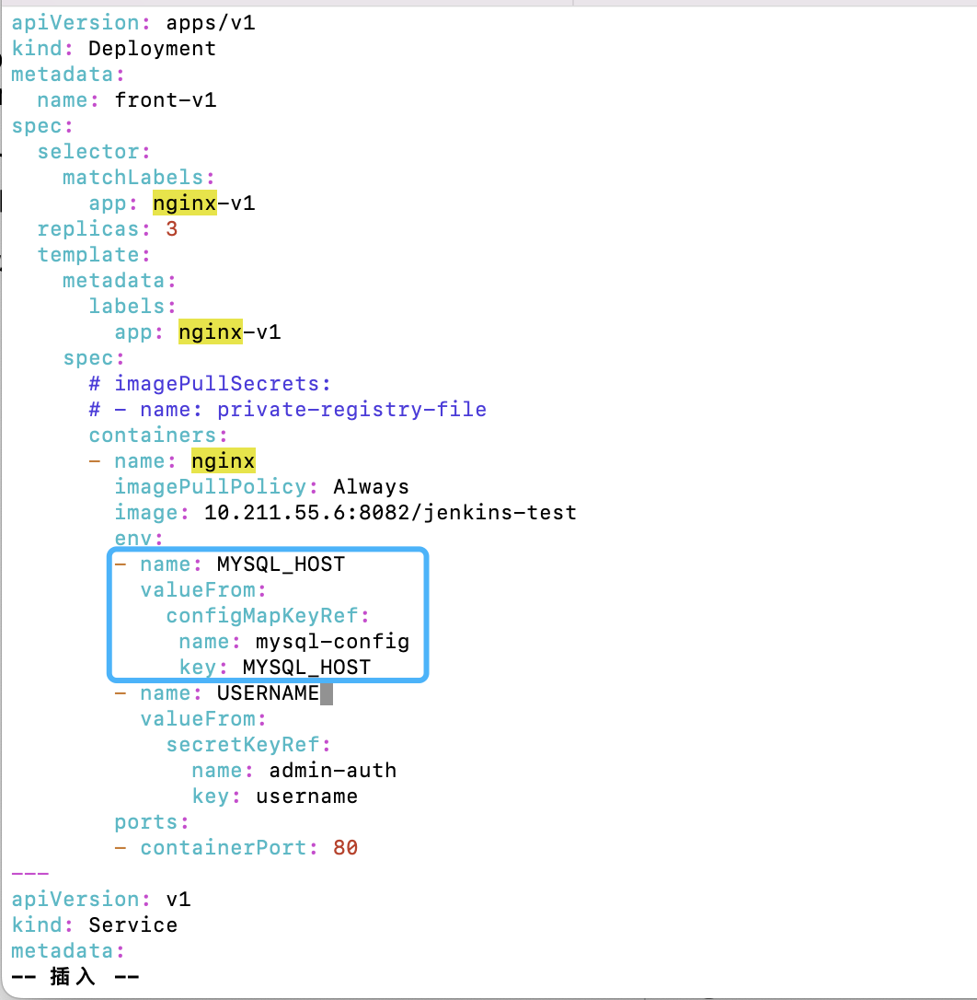
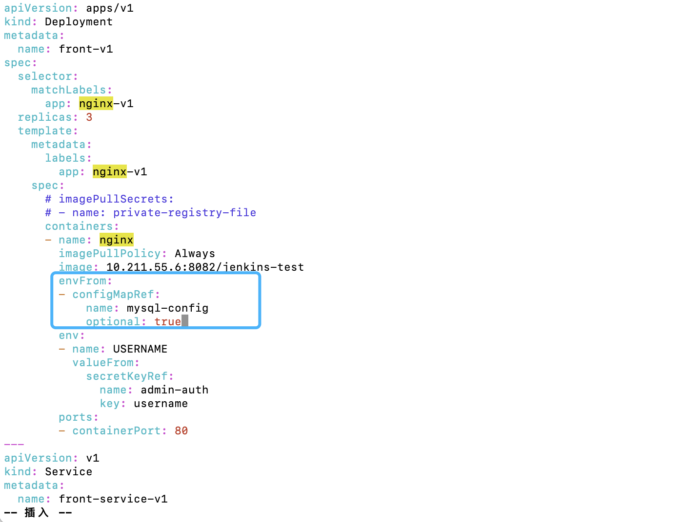
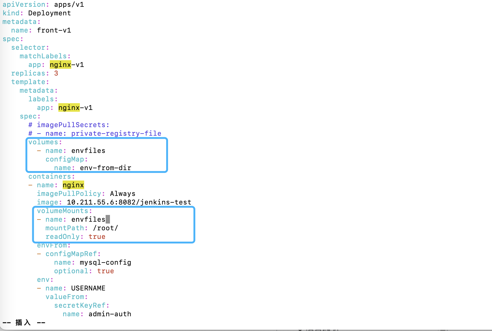
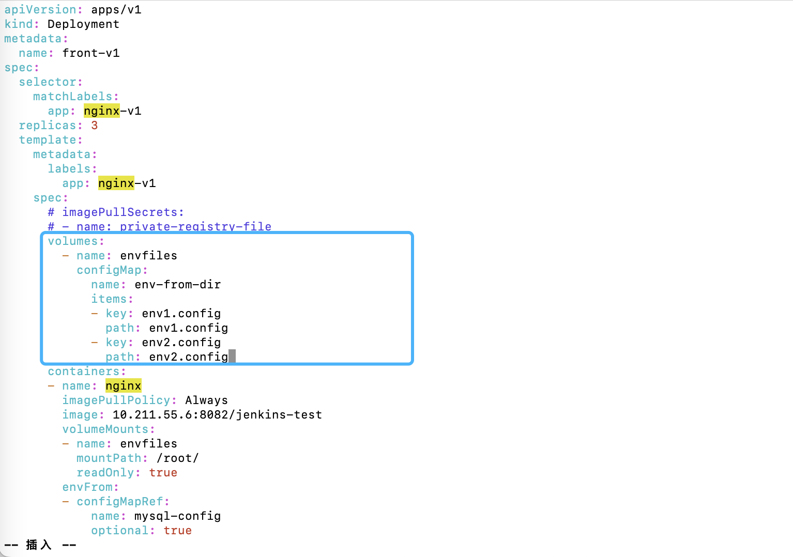

## Kubernetes ConfigMap: 统一管理服务环境变量

日常开发部署时，会遇到一些环境变量的配置：例如数据库地址、负载均衡要转发的服务地址等等信息；打包在镜像内耦合太严重，又没有很高的机密性，这可以借助`Kubernetes ConfigMap`来配置。

### 1. 什么是ConfigMap

`ConfigMap`是`Kubernetes`的一种资源类型，可以使用它存放一些环境变量和配置文件。信息存入后，可以使用挂载卷的方式挂载进我们的Pod 内，也可以通过环境变量注入。

和`Secret`类型最大的不同是，存在`ConfigMap`内的内容不会加密。

### 2. 创建方式

支持多种创建方式

#### 2.1 命令行直接创建

直接使用`kubectl create configmap [config_name]`命令创建即可。格式如下：

```shell
kubectl create configmap [config_name] --from-literal=[key]=[value]
```

`--from-literal`对应一条信息；如果想创建多个`key value`组合，向后重复`--from-literal=[key]=[value]`即可。

```shell
kubectl create configmap mysql-config \
--from-literal=MYSQL_HOST=192.168.1.72 \
--from-literal=MYSQL_PORT=3306

[yy@master config-map]$ kubectl create cm mysql-config \
> --from-literal=MYSQL_HOST=192.168.1.72 \
> --from-literal=MYSQL_PORT=3306
configmap/mysql-config created
```

注：configmap的名称必须全部小写，特殊符号只能包含'-'和'.'。可以使用下面的正则表达式校验是否符合规则：

```text
a-z0-9?(.a-z0-9?)*')
```

创建成功后，可以使用`kubectl get cm`查看：

```shell
kubectl get cm

[yy@master config-map]$ kubectl get cm
NAME               DATA   AGE
kube-root-ca.crt   1      9d
mysql-config       2      12s
```

可以看到刚创建的`ConfigMap`。里面的`DATA`为2，代表有2条数据存在。直接使用`kubectl describe cm mysql-config`即可查看这个`ConfigMap`的具体信息：

```shell
kubectl describe cm mysql-config

[yy@master config-map]$ kubectl describe cm mysql-config
Name:         mysql-config
Namespace:    default
Labels:       <none>
Annotations:  <none>

Data
====
MYSQL_HOST:
----
192.168.1.72
MYSQL_PORT:
----
3306

BinaryData
====

Events:  <none>
```

可以看到存放的数据，代表该`configmap`创建成功。

#### 2.2 配置清单创建

通过一个命令清单创建

新建一个文件，名称为`mysql-config-file.yaml`，填入一下内容：

```yaml
apiVersion: v1
kind: ConfigMap
metadata:
  name: mysql-config-file
data:
  MYSQL_HOST: '192.168.1.172'
  MYSQL_PORT: '3306'
```

kind值为`ConfigMap`，代表声明一个`ConfigMap`类型的资源；`metadata.name`是该`configmap`的名称；`data`是存放数据的地方，数据格式为`key: value`。

保存后使用`kubectl apply`命令使配置生效：

```shell
[yy@master config-map]$ vim mysql-config-file.yaml
[yy@master config-map]$ kubectl apply -f mysql-config-file.yaml 
configmap/mysql-config-file created
```

生效后，使用`kubectl describe cm`命令查看：

```shell
kubectl describe cm mysql-config-file

[yy@master config-map]$ kubectl describe cm mysql-config-file
Name:         mysql-config-file
Namespace:    default
Labels:       <none>
Annotations:  <none>

Data
====
MYSQL_HOST:
----
192.168.1.172
MYSQL_PORT:
----
3306

BinaryData
====

Events:  <none>
```

保存创建的内容成功存入。

#### 2.3 文件创建

这种是将文件加载进去，适合挂载配置文件（如Nginx配置文件等等）。直接使用`kubectl create configmao`命令行创建，格式如下：

```shell
kubectl create configmap [configname] --from-file=[key]=[file_path]
```

每一条`--from-file`都代表一个文件，`key`是文件在`configmap`内的key，`file_path`是文件的路径。

首先创建一个文件，然后将文件内容存入`configmap`中。创建一个名为`env.config`的文件，输入以下内容：

```
URL: 172.168.81.111
PATH: /root/abcd/efg
```

保存后使用`kubectl create configmap`命令将其保存至`configmap`内：

```shell
kubectl create configmap env-from-file --from-file=env=./env.config
```

```shell
[yy@master config-map]$ vim env.config
[yy@master config-map]$ kubectl create configmap env-from-file --from-file=env=./env.config
configmap/env-from-file created
```

接着使用`kubectl get cm`命令查看内容：

```shell
kubectl get cm env-from-file -o yaml
```

```shell
[yy@master config-map]$ kubectl get cm env-from-file -o yaml
apiVersion: v1
data:
  env: |
    URL: 172.168.81.111
    PATH: /root/abcd/efg
kind: ConfigMap
metadata:
  creationTimestamp: "2022-08-05T07:15:31Z"
  name: env-from-file
  namespace: default
  resourceVersion: "509741"
  uid: eb8b72d3-41f9-4a55-9ebf-126512f01607
[yy@master config-map]$ 
```

可以看到，`configmap`将整个文件内容都保存了进去。`env`则是这个文件的`key`值。

#### 2.4 目录创建

也可以直接将一个目录下的文件整个存入进去。

目录创建这里和文件创建的命令差不多，差别只是将`--from-file`的值从一个`key=value`变成了输入一整个文件夹。

```shell
kubectl create configmap [configname] --from-file=[dir_path]
```

创建一个文件夹，下面存放几个文件来测试下。这里创建三个文件，分别是`env1.config`、`env2.config`、`env3.config`，内容也和其文件名对应。

```shell
mkdir env && cd env
echo 'env1' > env1.config
echo 'env2' > env2.config
echo 'env3' > env3.config
```

使用创建命令，将内容批量存入到`configmap`内：

```shell
kubectl create configmap env-from-dir --from-file=./

[yy@master env]$ kubectl create configmap env-from-dir --from-file=./
configmap/env-from-dir created
```

创建完成后，使用`kubectl get cm`命令查看保存的内容：

```shell
[yy@master env]$ kubectl get cm env-from-dir -o yaml
apiVersion: v1
data:
  env1.config: |
    env1
  env2.config: |
    env2
  env3.config: |
    env3
kind: ConfigMap
metadata:
  creationTimestamp: "2022-08-05T07:57:15Z"
  name: env-from-dir
  namespace: default
  resourceVersion: "513318"
  uid: f87fe2f8-9230-4c6e-8446-5bbd89c006a8
[yy@master env]$
```

可以看到，文件夹下的文件内容被批量存放了进去。

### 3. 使用方式

#### 3.1 环境变量注入

注入到环境变量是一种比较常见的方式。编辑`front-v1`的`deployment`配置文件，来将`configmap`注入进环境变量内。

`configmap`的环境变量注入，与`Secret`的环境变量注入方式差别不大，只是字段换成了`configMapKeyRef`；`name`是要选择注入的`configmap`名称，`key`是configmap内的key。



编辑完后保存退出，使用`kubectl apply -f`使配置文件生效。

```shell
[yy@master deployment]$ vim v1.yaml 
[yy@master deployment]$ kubectl apply -f v1.yaml 
deployment.apps/front-v1 configured
service/front-service-v1 unchanged
```

生效后，在最新的`Pod`内使用`kubectl exec`命令来查看环境变量注入的结果：

```shell
kubectl exec -it [POD_NAME] -- env | grep MYSQL_HOST
```

```shell
[yy@master deployment]$ kubectl exec -it front-v1-875dcb6f6-59f9n -- env | grep MYSQL_HOST
MYSQL_HOST=192.168.1.72
```

可以看到，环境变量成功地注入了。

#### 3.2 一次性环境变量注入

一条一条注入环境配置太繁琐了。我们可以一次性将整个`ConfigMap`都注入进去。

可以借助`containers.envFrom`字段去一次性批量导入我们的`configmap`：



> 如果configmap中的key含有"-"，会自动转换为"_"

这里的`name`为已配置好的`configmap`的名称，`optional`代表如果没有该`configmap`，容器是否能够正常启动。

添加envFrom后，保存并生效该`deployment`，此时`Pod`会杀死重建。新Pod启动后，使用`kubectl exec`命令查看`Pod`内环境变量注入情况：

```shell
[yy@master deployment]$ vim v1.yaml 
[yy@master deployment]$ kubectl apply -f v1.yaml 
deployment.apps/front-v1 configured
service/front-service-v1 unchanged

[yy@master deployment]$ kubectl exec -it front-v1-7996b86c48-45v55 -- env | grep MYSQL
MYSQL_HOST=192.168.1.72
MYSQL_PORT=3306
```

可以看到，环境变量被批量注入了。

#### 3. 存储卷挂载

这种方式会将`configmap`里的每个`key`和`value`，以独立文件方式以外部挂载卷方式挂载进去（key是文件名，value是文件内容）

这部分用法和`Secret`类似。

编辑`front-v1`的`deployment`配置文件，修改配置：

第一步：在Pod层面声明一个外部存储卷。`name`为存储卷名称；`configMap`代表存储卷的文件来源为`configMap`；`configMap.name`为要加载的`configMap`名称。

第二步：在容器镜像层面配置存储卷volumeMounts。`name`为第一步配置的存储卷名称；`mountPath`为要挂载的目录；`readOnly`代表文件是不是只读。



编辑完后，保存并退出。使用`kubectl apply -f`命令使配置文件生效。

```shell
kubectl apply -f v1.yaml

[yy@master deployment]$ kubectl apply -f v1.yaml 
deployment.apps/front-v1 configured
service/front-service-v1 unchanged
```

完成后验证一下文件是否已经挂载进去。使用`kubectl exec`命令查看目录下是否有这个文件：

```shell
kubectl exec -it [POD_NAME] -- ls /root

[yy@master deployment]$ kubectl exec -it front-v1-f8ffd9df5-9ck4k -- ls /root
env1.config  env2.config  env3.config
[yy@master deployment]$ 
```

可以看到，三个文件都成功地挂载了。

这种方式每次挂载都会将整个文件夹挂载进去，如何一次只挂载单个文件呢？这里可以借助`volumes.configMap.items[]`字段配置`item`项来实现：

```yaml
volumes:
- name: envfiles
  configMap:
    name: env-from-dir
    items:
    - key: env1.config
      path: env1.config
    - key: env2.config
      path: env2.config
```

`items`是个数组，每一项都是一条`ConfigMap`里的独立字段。

其中`key`是`ConfigMap`中的字段名称；`path`则是要挂载的路径（相对于在容器镜像层面配置存储卷配置的`mountPath`）。



填写保存后使用命令使配置文件生效。

接着使用`kubectl exec`命令验证：

```shell
[yy@master deployment]$ kubectl exec -it front-v1-f9fcfdbb6-fdm8r -- ls /root
env1.config  env2.config
[yy@master deployment]$
```

可以看到只挂载进去配置的2个文件。


### 4. 小结

利用`ConfigMap`，我们可以将服务环境变量外置，与我们的业务代码解耦合。