## 实战训练：部署一个前后端分离项目

demo项目，前端技术栈为`React + craco`，后端技术栈为`MySQL + eggjs`。

`node2`的主要用途是用于部署`MySQL`使用。

### 1. 项目仓库

项目部署所用的仓库：https://gitee.com/organizations/juejin-cicd/projects，其中k8s-demo-frontend是前端项目，k8s-demo-backend是后端项目

### 2. 构建 & 部署前端应用

* 在`Jenkins`新建一个任务，名为`demo-frontend`。接着配置任务的Git代码源，让Jenkins可以拉取代码。因为是公开项目，所以不需要配置私有仓库认证。

  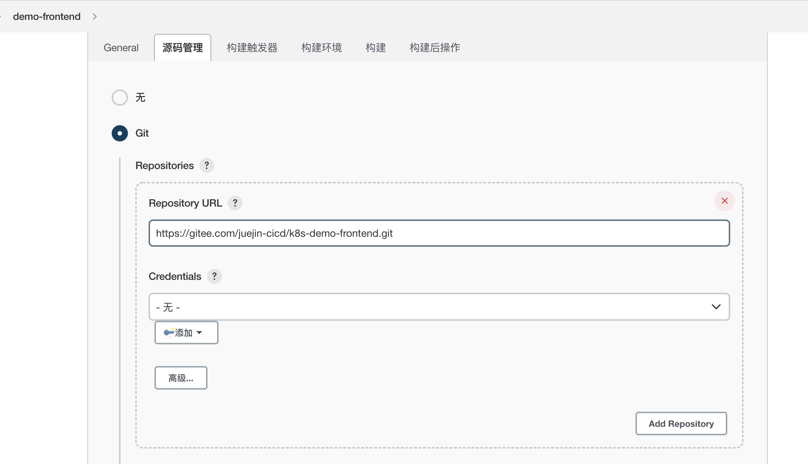

* 配置`构建环境`=>`Provide Node & npm bin/ folder to PATH`选项，给执行的任务增加`Nodejs`运行环境

  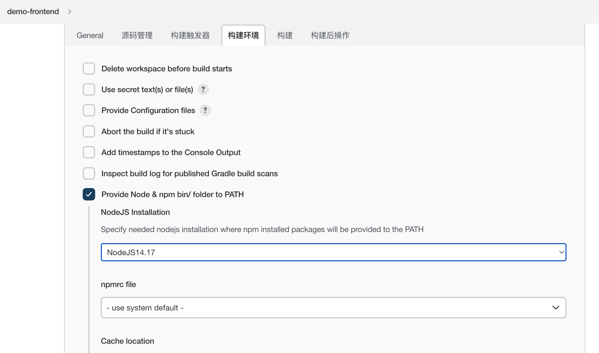

* 添加构建脚本，让`Jenkins`构建镜像。`构建`=>`添加构建步骤`=>`Execute Shell`，填写以下脚本：

  ```shell
  #!/bin/sh -l
  
  time=$(date "+%Y%m%d%H%M%S")
  npm install --registry=https://registry.npm.taobao.org
  npm run build
  docker build -t 10.211.55.6:8082/frontend-app:$time .
  docker login -u $DOCKER_LOGIN_USERNAME -p $DOCKER_LOGIN_PASSWORD 10.211.55.6:8082
  docker push 10.211.55.6:8082/frontend-app:$time
  ```

  首先使用`npm run build`对代码进行编译打包，随后使用`docker build`命令构建镜像，最后推送镜像到镜像库内。

  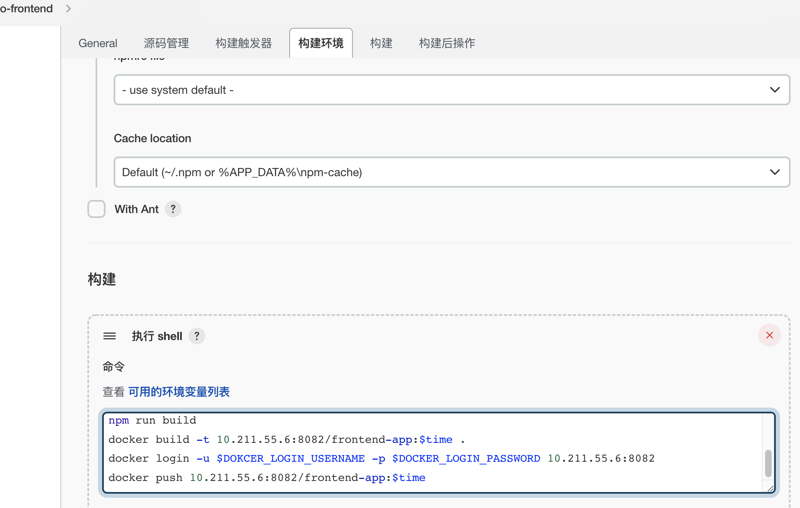

* 因为推送镜像需要`docker login`，要需要配置下`docker`登录信息。

  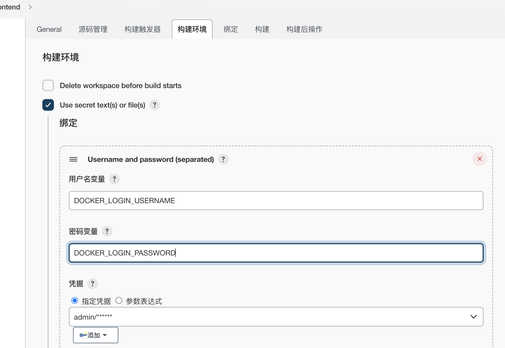

* 保存后执行，即可生成前端镜像。（npm build报错了....，镜像生成成功了）

* 镜像生成后，需要去k8s集群内部署这个镜像。

  前往集群节点，新建一个文件，名为`demo-frontend.yaml`，输入以下内容。镜像地址换成刚才Jenkins构建后的镜像地址。

  ```yaml
  apiVersion: apps/v1
  kind: Deployment
  metadata:
    name: demo-frontend
  spec:
    selector:
      matchLabels:
        app: demo-frontend
    replicas: 1
    template:
      metadata:
        labels:
          app: demo-frontend
      spec:
        imagePullSecrets:
        - name: private-registry
        containers:
        - name: frontend-app
          imagePullPolicy: Always
          image: 10.211.55.6:8082/frontend-app:20220809144404
          ports:
          - containerPort: 80
  ---
  apiVersion: v1
  kind: Service
  metadata:
    name: demo-frontend-service
  spec:
    selector:
      app: demo-frontend
    ports:
    - protocol: TCP
      port: 80
      targetPort: 80
    type: NodePort
  ```

* 保存后退出，使用`kubectl apply`命令部署前端服务。

  ```shell
  [yy@master deployment]$ kubectl apply -f demo-frontend.yaml 
  deployment.apps/demo-frontend created
  service/demo-frontend-service created
  ```

* 部署完毕后，使用`kubectl get svc`命令来获取服务的端口

  ```shell
  [yy@master deployment]$ kubectl get svc
  NAME                    TYPE        CLUSTER-IP       EXTERNAL-IP   PORT(S)        AGE
  demo-frontend-service   NodePort    10.106.235.196   <none>        80:31717/TCP   81s
  ...
  ```

  可以看到前端已经部署成功了，使用浏览器打开即可看到页面。

  访问不成功，检查了一遍是原项目添加了后端服务相关的Nginx配置，先暂时注释掉，因为后端还未部署请求不到；再操作一遍执行jenkins任务、部署deployment的流程，就访问成功了。

  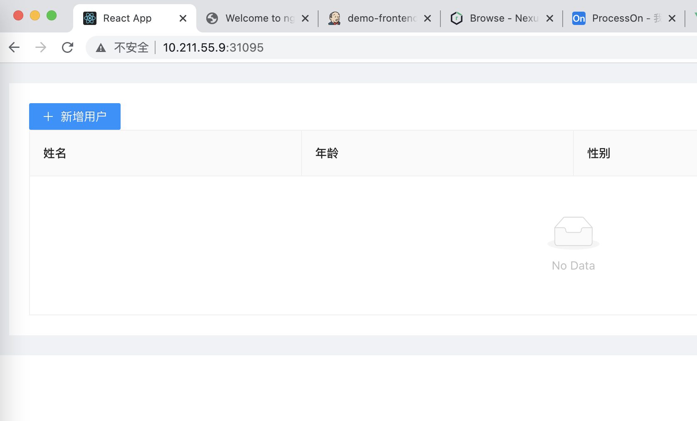

### 3. 部署 & 初始化MySQL

* 给`node2`节点添加污点，让除了特定的服务，其他服务都不可以部署上去。

```shell
kubectl taint nodes node2 mysql=true:NoSchedule

[yy@master deployment]$ kubectl taint nodes node2 mysql=true:NoSchedule
node/node2 tainted
```

* 在开始部署之前，需要去`node2`节点给`MySQL`的数据创建一个文件夹。我们会将本地的文件夹挂载进`MySQL`容器内，以便`MySQL`数据可以持久化。

```shell
mkdir /var/lib/mysql && mkdir /var/lib/mysql/data
```

* 还需要给`MySQL`容器添加挂载访问密码。这里我们将密码存入`secret`内保存。

  ```shell
  kubectl create secret genetic demo-mysql-auth \
  --from-literal=password=367734
  
  [yy@master deployment]$ kubectl create secret generic demo-mysql-auth \
  > --from-literal=password=123456
  secret/demo-mysql-auth created
  ```

* 开始部署MySQL。新建一个yaml文件，输入以下内容。这里给`MySQL`容器添加了污点对应的容忍度，密码也挂载了进去，设置了默认端口`3306`。

  ```yaml
  apiVersion: apps/v1
  kind: Deployment
  metadata:
    name: demo-mysql
  spec:
    replicas: 1
    selector:
      matchLabels:
        app: demo-mysql
    template:
      metadata:
        labels:
          app: demo-mysql
      spec:
        tolerations:
        - key: "mysql"
          operator: "Equal"
          value: "true"
          effect: "NoSchedule"
        containers:
        - name: demo-mysql
          image: mysql:5.6
          imagePullPolicy: IfNotPresent
          args:
          - "ignore-db-dir=lost+found"
          ports:
          - containerPort: 3306
          volumeMounts:
          - name: mysql-data
            mountPath: "/var/lib/mysql"
          env:
          - name: MYSQL_ROOT_PASSWORD
            valueFrom:
              secretKeyRef:
                name: demo-mysql-auth
                key: password
        volumes:
        - name: mysql-data
          hostPath:
            path: /var/lib/mysql
            type: Directory       
  ---
  apiVersion: v1
  kind: Service
  metadata:
    name: demo-mysql-service
  spec:
    type: NodePort
    ports:
    - port: 3306
      protocol: TCP
      targetPort: 3306
    selector:
      app: demo-mysql
  ```

  ```shell
  [yy@master deployment]$ vim demo-mysql.yaml
  [yy@master deployment]$ kubectl apply -f demo-mysql.yaml 
  deployment.apps/demo-mysql created
  service/demo-mysql-service created
  ```

* 部署成功后，就可以使用`Navicat`等工具访问数据库了。数据库的`host`是`service`的地址，用户是`root`，密码则是我们挂载进去的密码。

  需要提前配置MySQL可以通过外部连接：

  [mysql数据库连接报错:is not allowed to connect to this mysql server](https://blog.csdn.net/weixin_42599091/article/details/125224850)

  ```mysql
  # 进入到mysql数据库中：
  use mysql;
   
  select host from user where user='root';
  
  # 我们执行update语句把权限进行修改
  update user set host = '%' where user ='root';
  
  # 执行update语句把权限进行修改
  flush privileges;
  ```

  https://blog.csdn.net/m0_46108436/article/details/104721631

  授权root用户可以在10.10.1.35登录，授权方式有两种。
  1、授权root用户可以从10.10.1.35登录MySQL数据库，
  GRANT ALL PRIVILEGES ON *.* TO 'root'@'10.10.1.35' IDENTIFIED BY 'youpassword' WITH GRANT OPTION;
  2、授权root用户可以从任意电脑登录MySQL数据库。如下所示：
  GRANT ALL PRIVILEGES ON *.* TO 'root'@'%' IDENTIFIED BY 'youpassword' WITH GRANT OPTION;

  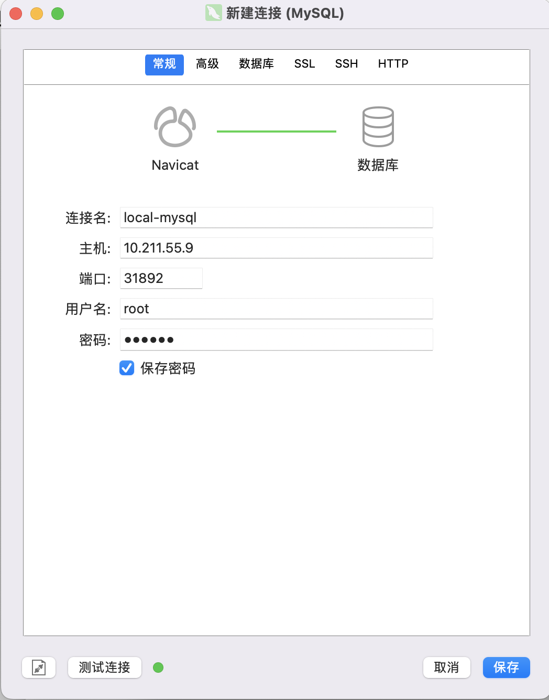

* 可以访问数据库后，使用初始化`sql`，初始化数据库和表结构

  ```sql
  # 这里的sql创建了一个名称为demo-backend的数据库，数据库内创建了users表，并加入了4个表字段
  
  SET NAMES utf8mb4;
  SET FOREIGN_KEY_CHECKS = 0;
  
  CREATE DATABASE IF NOT EXISTS `demo-backend` DEFAULT CHARSET utf8 COLLATE utf8_general_ci;
  USE `demo-backend`;
  
  DROP TABLE IF EXISTS `users`;
  CREATE TABLE `users` (
    `id` int(11) NOT NULL AUTO_INCREMENT COMMENT 'ID',
    `name` varchar(255) NOT NULL COMMENT '姓名',
    `age` int(11) NOT NULL COMMENT '年龄',
    `sex` varchar(255) NOT NULL COMMENT '性别：1男 2女',
    PRIMARY KEY(`id`)
  ) ENGINE=InnoDB AUTO_INCREMENT=9 DEFAULT CHARSET=utf8;
  
  SET FOREIGN_KEY_CHECKS = 1;
  ```

  `sql`执行成功后，代表数据库初始化成功。

  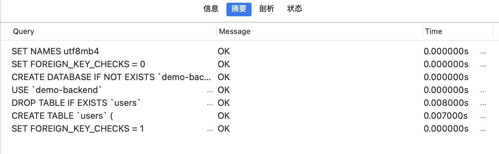

### 4. 构建 & 部署后端应用

* 第一步，也是在`jenkins`新建项目，具体流程和前端应用一样。构建脚本需要进行修改。

因为没有静态资源需要构建，所以直接将源码目录拷贝进容器即可：

```shell
#!/bin/sh -l

time=$(date "+%Y%m%d%H%M%S")
npm install --registry=https://registry.npm.taobao.org
docker build -t 10.211.55.6:8082/backend-app:$time .
docker push 10.211.55.6:8082/backend-app:$time

```

执行完毕，镜像`push`完成代表成功。

* 镜像准备好后，需要在k8s部署服务。在部署之前，先将数据库相关信息存入`configmap`，然后挂载进后端服务：

  ```yaml
  apiVersion: v1
  kind: ConfigMap
  metadata:
    name: mysql-config
  data:
    host: 'demo-mysql-service'
    port: '3306'
    username: 'root'
    database: 'demo-backend'
  ```

  ```shell
  [yy@master config-map]$ kubectl apply -f mysql-config.yaml 
  configmap/mysql-config configured
  ```

* 存入数据库信息后，就可以部署后端服务了，以下是配置内容。

  拉取了一个后端服务镜像，并将数据库账号和端口服务地址通过`configmap`传入了进去。

  ```yaml
  apiVersion: apps/v1
  kind: Deployment
  metadata:
    name: demo-backend
  spec:
    selector:
      matchLabels:
        app: demo-backend
    replicas: 1
    template:
      metadata:
        labels:
          app: demo-backend
      spec:
        imagePullSecrets:
        - name: private-registry
        containers:
        - name: backend-app
          imagePullPolicy: Always
          image: 10.211.55.6:8082/backend-app:20220809231213
          ports:
         	- containerPort: 7001
          env:
          - name: MYSQL_HOST
            valueFrom:
              configMapKeyRef:
                name: mysql-config
                key: host
          - name: MYSQL_PORT
            valueFrom:
              configMapKeyRef:
                name: mysql-config
                key: port
          - name: MYSQL_USER
            valueFrom:
              configMapKeyRef:
                name: mysql-config
                key: username
          - name: MYSQL_DATABASE
            valueFrom:
              configMapKeyRef:
                name: mysql-config
                key: database
  ---
  apiVersion: v1
  kind: Service
  metadata:
    name: demo-backend-service
  spec:
    selector:
      app: demo-backend
    ports:
    - protocol: TCP
      port: 7001
      targetPort: 7001
    type: NodePort
  ```

  保存后，使用`kubectl apply`使服务生效。

  ```shell
  [yy@master deployment]$ vim demo-backend.yaml
  [yy@master deployment]$ kubectl apply -f demo-backend.yaml 
  deployment.apps/demo-backend created
  service/demo-backend-service created
  ```

* 将前端去掉之前的注释重新部署一遍，再访问前端界面。

  https://blog.csdn.net/gwz_6903/article/details/112417849

  查看demo-backend的pod发现一直报错，通过`kubectl logs -f [pod_name]`命令打印log发现是数据库连接问题，后端demo项目中的数据库密码没有改成自己设置的，把后端项目中的数据库密码修改后重新部署前后端，可以访问成功。

  部署成功！

  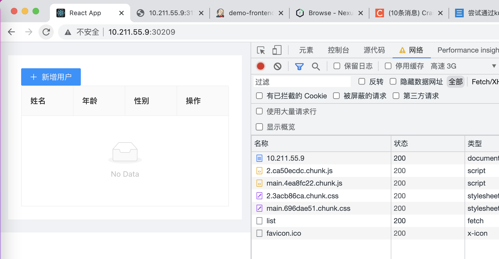

### 5. 集成Jenkins

前面的服务部署成功后，我们还需要使用`Jenkins`直接一键执行构建和部署。

前面部署镜像时，都是在集群内直接操作的。但一般情况下，Jenkins和k8s并不在一台机器上。如何远程操作集群呢？

这里可以使用`kubectl 的 --kubeconfig`命令，传入集群的配置文件即可远程操作，只要保证Jenkins和k8s集群网络互通即可。配置文件的路径也很好找，位于集群机器的`~/.kube/config`文件。

* 在`Jenkins`添加一个全局配置文件，方便任务使用。

  `Manage Jenkins => Managed files`，点击菜单中的的`Add a new config`，选择普通配置。

  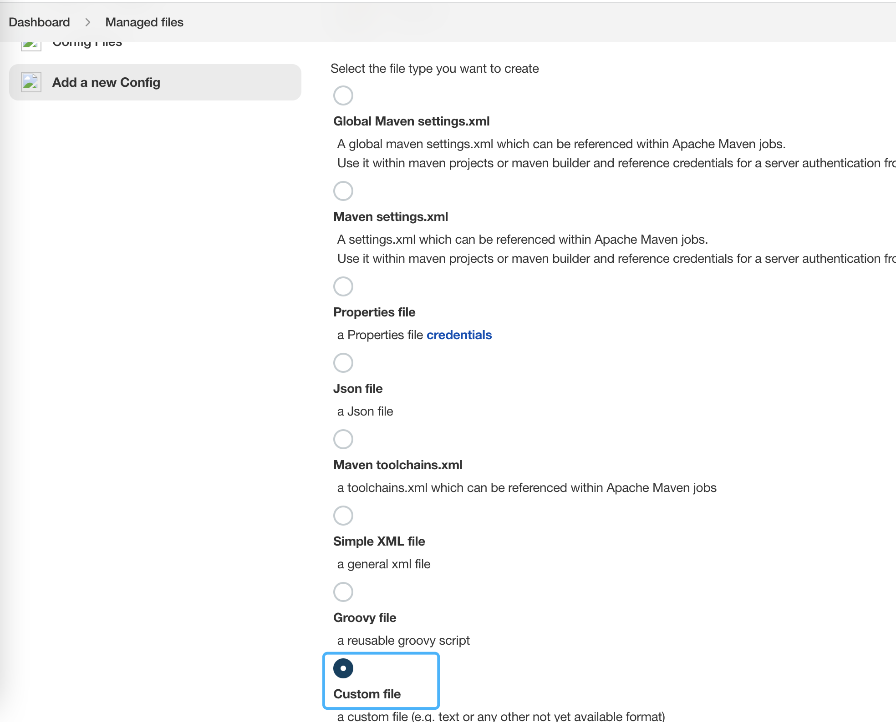

  点击提交，在下一步中填入配置文件名称，将`kubernetes`配置文件内容拷贝进`content`内，提交即可。

* 还需要在`Jenkins`机器上安装`kubectl`，只安装`kubectl`即可。

  ```shell
  cat <<EOF > /etc/yum.repos.d/kubernetes.repo
  [kubernetes]
  name=Kubernetes
  baseurl=http://mirrors.aliyun.com/kubernetes/yum/repos/kubernetes-el7-x86_64
  enabled=1
  gpgcheck=0
  repo_gpgcheck=0
  gpgkey=http://mirrors.aliyun.com/kubernetes/yum/doc/yum-key.gpg
          http://mirrors.aliyun.com/kubernetes/yum/doc/rpm-package-key.gpg
  EOF
  yum install -y kubectl
  ```

* 回到任务配置界面，找到`绑定`，选择刚刚配置的文件，添加`target`，让配置文件输出为文件。

  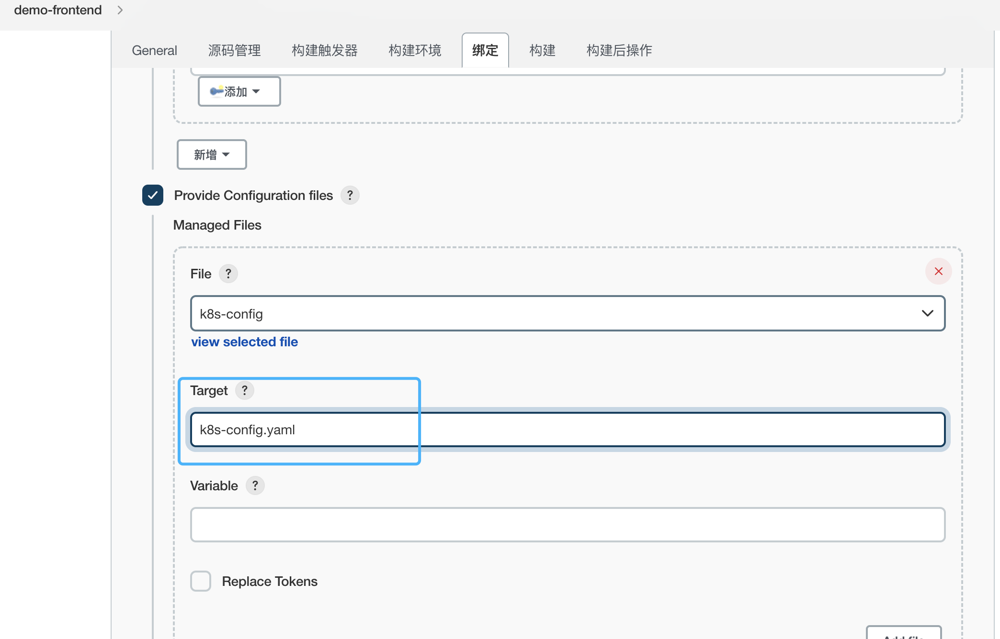

  再在命令界面，在`docker push`命令之后，加一条`kubectl`执行命令。在这里直接使用`kubectl --kubeconfig`指定配置文件，即可远程操作：

  ```shell
  kubectl --kubeconfig=k8s-config.yaml set image deployment/demo-frontend frontend-app=10.211.55.6:8082/frontend-app:$time
  ```

  > 可以使用`kubectl set image`命令快速设置镜像地址版本 格式为：
  >
  > `kubectl set image deployment/[deployment名称] [容器名称]=[镜像版本]`

保存后执行，提示`deployment.apps/[deployment名称] image updated`代表更新完毕。

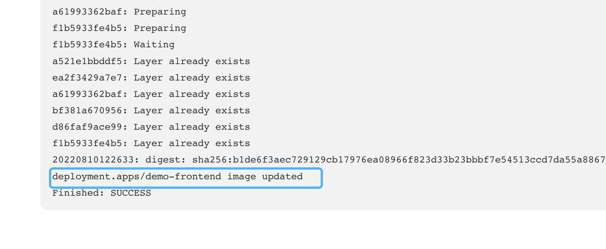

pod会被删除重建。

