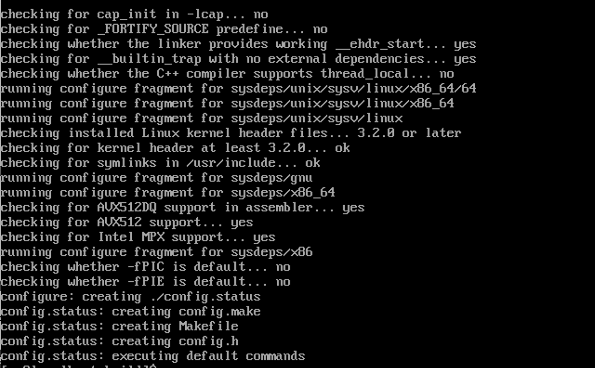
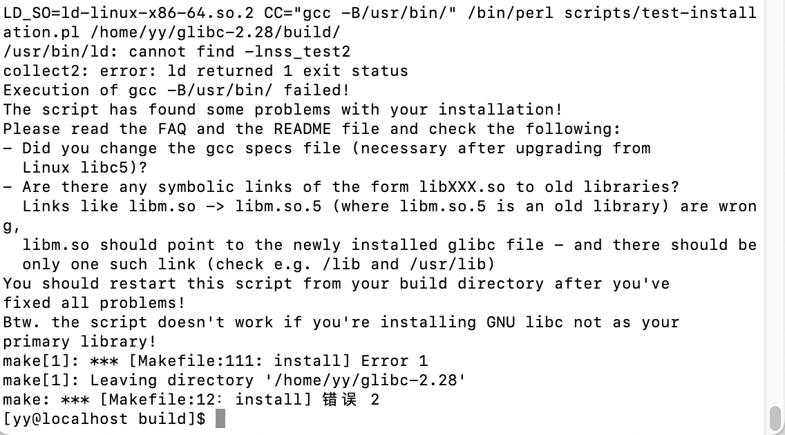

centos7默认的gcc版本是4.8.5，无法编译高版本的glibc 2.28，需要升级到gcc 8.2版本

注：gcc高版本和glibc 2.28不兼容

```shell
## 查看自带默认的glibc
strings /lib64/lib.so.6 | grep GLIBC

# 查看glibc 软件版本号
rpm -qa | grep glibc
```

[升级gcc](https://www.cnblogs.com/reblue520/p/14453633.html)

[升级glibc](https://blog.csdn.net/u012149637/article/details/112968173)

1. 安装gcc-8.2.0依赖环境

   ```shell
   yum install bison -y
   yum -y install wget bzip2 gcc gcc-c++ glib-headers
   ```

2. 升级GNU make到make 4.2

   ```shell
   wget http://ftp.gnu.org/gnu/make/make-4.2.1.tar.gz
   tar -zxvf make-4.2.1.tar.gz
   cd make-4.2.1
   mkdir build
   cd build
   ../configure --prefix=/usr/local/make && make && make install
   export PATH=/usr/local/make/bin:$PATH
   ln -s /usr/local/make/bin/make /usr/local/make/bin/gmake
   make -v
   
   # 昨天使用这段命令安装的
   wget http://ftp.gnu.org/gnu/make/make-4.2.tar.gz
   tar -xzvf make-4.2.tar.gz
   cd make-4.2
   sudo ./configure
   sudo make
   sudo make install
   sudo rm -rf /usr/bin/make
   sudo cp ./make /usr/bin/
   make -v
   ```

3. 安装Python3.8

   ```shell
   wget https://www.python.org/ftp/python/3.8.0/Python-3.8.0.tar.xz
   xz -d Python-3.8.0.tar.xz
   tar xf Python-3.8.0.tar
   cd Python-3.8.0
   ./configure --prefix=/usr/local/python3
   make -j 2 && make install
   ln -s /usr/local/python3/bin/python3 /usr/bin/python3
   ln -s /usr/local/python3/bin/pip3 /usr/bin/pip3
   ```

   * 安装python3 make时报错[Failed to build these modules: _ctypes](https://blog.csdn.net/Cookie_1030/article/details/121371515)

     [yum](https://so.csdn.net/so/search?q=yum&spm=1001.2101.3001.7020) install -y libffi-devel

   * 错误提示：Python requires an OpenSSL 1.0.2 or 1.1 compatible libssl with X509_VERIFY_P

     [安装libressl](https://blog.csdn.net/weixin_39703551/article/details/111795468)

     ```shell
     # 下载源码包
     wget https://ftp.openbsd.org/pub/OpenBSD/LibreSSL/libressl-3.0.2.tar.gz
     # 解压
     tar -zxvf libressl-3.0.2.tar.gz
     # 配置安装路径
     mkdir /usr/local/libressl
     cd libressl-3.0.2
     ./configure --prefix=/usr/local/libressl
     # 安装
     make 
     make install
     # 创建软连接代替openssl
     mv /usr/bin/openssl /usr/bin/openssl.bak
     mv /usr/include/openssl /usr/include/openssl.bak
     ln -s /usr/local/libressl/bin/openssl /usr/bin/openssl
     ln -s /usr/local/libressl/include/openssl /usr/include/openssl
     echo /usr/local/libressl/lib >> /etc/ld.so.conf.d/libressl-3.0.2.conf
     ldconfig -v
     # 验证是否安装完成
     openssl version
     ```

     * 错误提示：[echo权限不够](https://blog.csdn.net/weixin_39539807/article/details/116645251)

       ```shell
       # 要给echo整条命令加单引号
       sudo sh -c 'echo /usr/local/libressl/lib >> /etc/ld.so.conf.d/libressl-3.0.2.conf'
       ```

   * 错误提示：[zlib not available](https://www.cnblogs.com/Jimc/p/10218062.html)

     ```shell
     # 安装依赖
     sudo yum install zlib-devel bzip2 bzip2-devel readline-devel sqlite sqlite-devel openssl-devel xz xz-devel libffi-devel
     ```

4. 安装gcc8.2.0

   ```shell
   # 下载并解压
   wdget https://mirrors.tuna.tsinghua.edu.cn/gnu/gcc/gcc-8.2.0/gcc-8.2.0.tar.gz
   tar xf gcc-8.2.0.tar.gz
   cd gcc-8.2.0
   # 下载gmp mpfr mpc等供编译需求的依赖项
   ./contrib/download_prerequisites
   # 配置
   mkdir build
   cd build
   ../configure --prefix=/usr/local/gcc-8.2.0 --enable-bootstrap --enable-checking=release --enable-languages=c,c++ --disable-multilib
   # 编译安装
   make -j 2
   make install
   # 修改环境变量，使得gcc-8.2.0为默认的gcc
   vi /etc/profile.d/gcc.sh
   # 导出头文件
   [yy@localhost profile.d]$ sudo ln -sv /usr/local/gcc-8.2.0/include/ /usr/include/gcc
   "/usr/include/gcc/include" -> "/usr/local/gcc-8.2.0/include/"
   ```

5. 由于之前安装了gcc11.2需要做一下修改

   ```shell
   # 应用环境变量
   echo -e '\nexport PATH=/usr/local/gcc-8.2.0/bin:$PATH\n' >> /etc/profile.d/gcc.sh
   source /etc/profile.d/gcc.sh
   
   # 删除库文件
   sudo rm /etc/ld.so.conf.d/gcc.conf
   # 设置库文件
   touch /etc/ld.so.conf.d/gcc.conf
   chmod 777 /etc/ld.so.conf.d/gcc.conf 
   echo -e "/usr/local/gcc-8.2.0/lib64" >> /etc/ld.so.conf.d/gcc.conf
   # 加载动态连接库
   ldconfig -v
   # 查看gcc
   ldconfig -p |grep gcc
   
   # 重启服务器
   reboot
   ```

6. 配置glibc2.28还是报错compiler

   ```shell
   # 尝试昨天失败的命令
   sudo sh -c 'echo "source /opt/rh/devtoolset-8/enable" >>/etc/profile‘
   ```

   ../configure命令成功

   

7. 编译

   ```shell
   sudo make 
   sudo make install
   ```

   `make install`的报错

   

   可以不用管

8. 验证是否成功

   ```shell
   [yy@localhost build]$ strings /usr/local/gcc-8.2.0/lib64/libstdc++.so.6 | grep GLIBCXX_
   GLIBCXX_3.4
   GLIBCXX_3.4.1
   GLIBCXX_3.4.2
   GLIBCXX_3.4.3
   GLIBCXX_3.4.4
   GLIBCXX_3.4.5
   GLIBCXX_3.4.6
   GLIBCXX_3.4.7
   GLIBCXX_3.4.8
   GLIBCXX_3.4.9
   GLIBCXX_3.4.10
   GLIBCXX_3.4.11
   GLIBCXX_3.4.12
   GLIBCXX_3.4.13
   GLIBCXX_3.4.14
   GLIBCXX_3.4.15
   GLIBCXX_3.4.16
   GLIBCXX_3.4.17
   GLIBCXX_3.4.18
   GLIBCXX_3.4.19
   GLIBCXX_3.4.20
   GLIBCXX_3.4.21
   GLIBCXX_3.4.22
   GLIBCXX_3.4.23
   GLIBCXX_3.4.24
   GLIBCXX_3.4.25
   ...
   
   [yy@localhost build]$ strings /lib64/libc.so.6 | grep GLIBC
   GLIBC_2.2.5
   GLIBC_2.2.6
   GLIBC_2.3
   GLIBC_2.3.2
   GLIBC_2.3.3
   GLIBC_2.3.4
   GLIBC_2.4
   GLIBC_2.5
   GLIBC_2.6
   GLIBC_2.7
   GLIBC_2.8
   GLIBC_2.9
   GLIBC_2.10
   GLIBC_2.11
   GLIBC_2.12
   GLIBC_2.13
   GLIBC_2.14
   GLIBC_2.15
   GLIBC_2.16
   GLIBC_2.17
   GLIBC_2.18
   GLIBC_2.22
   GLIBC_2.23
   GLIBC_2.24
   GLIBC_2.25
   GLIBC_2.26
   GLIBC_2.27
   GLIBC_2.28
   GLIBC_PRIVATE
   ...
   
   [yy@localhost build]$ ldd --version
   ldd (GNU libc) 2.28
   Copyright (C) 2018 Free Software Foundation, Inc.
   This is free software; see the source for copying conditions.  There is NO
   warranty; not even for MERCHANTABILITY or FITNESS FOR A PARTICULAR PURPOSE.
   Written by Roland McGrath and Ulrich Drepper.
   ```

   

