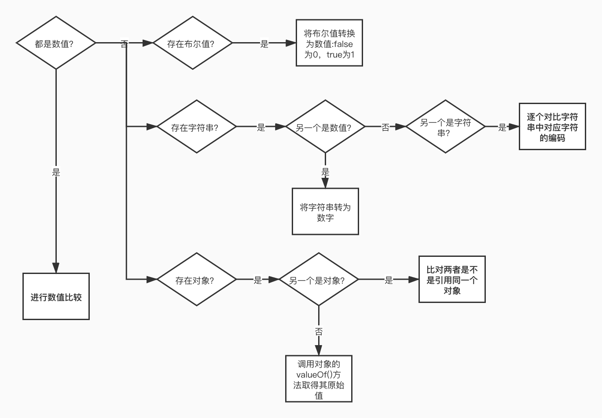

## c03-语言基础

主要基于ES6。

一切都区分大小写。无论变量、函数名还是操作符


### 标识符

变量名、函数名、属性名、参数名

可由一个或多个字符组成：

* 第一个必须是字母、_或者$；
* 其余的可以是字母、_、$或者数字。

其中字母可以是扩展ASCII中的字母，也可以是Unicode的字母字符，如À和Æ（但不推荐）

惯例使用小驼峰形式（与内置函数和对象的命名方式一致）


### 严格模式

ES5增加。

对**不安全的活动**抛出错误

开启方式：`"use strict";`

预处理指令


### 保留字、关键字

关键字：有特殊用途，不能用作标识符或属性名

保留字：保留给将来做关键字用（不能做标识符，但还可做属性名，一般最好不用，考虑兼容）


### 变量

1. var声明

   不初始化时默认值为undefined。作用域：函数作用域

   * 变量提升
   * 全局的声明会成为window对象的一个属性
   * 可以重复声明（在提升顶部后合并为一个声明）

2. let声明

   作用域：块作用域

   * 暂时性死区（在let声明之前不能引用）
   * 在全局中声明的变量不会成为window对象的属性（仍会在页面的生命周期内存续）
   * 同一个块作用域不允许出现冗余声明（JavaScript引擎会**记录**用于变量声明的标识符及其所在的块作用域）。在声明之前无法百分百确定之前没有声明过（假设没有声明过）；无法用try/catch来捕获或者if语句来判断，因为会限制住let声明的作用域（不能进行条件声明）

   for循环中的let声明：迭代变量的作用域仅限于for循环块内部。JavaScript引擎会在后台为每个迭代循环声明一个新的迭代变量

3. const声明

   行为与let基本相同，唯一区别在于声明变量时必须同时初始化且之后不能进行修改。

   仅限制它指向的变量的引用。若修改引用内部的属性，并不违反const的限制。

   **可以让静态代码分析工具提前发现不合法的赋值操作。**

   for..of / for..in 循环：每次迭代只是创建一个新变量

少用var，const优先，let次之


### 数据类型

6种简单数据类型（原始类型）：undefined、null、boolean、number、string、symbol。

1种复杂数据类型：object（无序键值对的集合）

判断基本类型——`typeof`：一个操作符，非函数

* "undefined"：值未定义、变量未声明
* "boolean"
* "string"
* "number"
* "object"：对象（非函数）或null（被认为是一个对空对象的引用）
* "function"：函数（在ES中被认为是对象，不代表一种数据类型，有自己的特殊属性）
* "symbol"

####     1. Undefined类型

一般不用于显式赋值，字面量undefined主要用于比较。

建议在声明变量的同时初始化，如果typeof得到undefined可以确定是因为变量未声明。

undefined是一个假值，检测时要明确：检测undefined字面量还是假值。

变量未声明时唯一可执行的操作：typeof

####        2.Null类型

表示一个空对象指针。只有一个值：null。

初始化一个将来要保存对象值得变量，建议使用null。可以保持null是空对象指针的语义。

undefined由null派生而来。因此ECMA-262将它们定义为表面上相等（==等于操作符）。

null是一个假值，检测时要明确：检测null字面量还是假值。

####     3.Boolean类型

有两个字面量true和false。

**所有其他ECMAScript类型的值都有相应布尔值的等价形式。**可使用Boolean()转型函数，将其他类型的值转换为布尔值。

**假值：**

* string：空字串
* number：0、NaN
* object：null
* undefined
* boolean： false

####     4.Number类型

使用IEEE 754格式表示整数和浮点数（双精度数）。

不同的数值类型（不同进制）有不同的数值字面量格式。

前缀：八进制0o，十六进制：0x

在所有**数学操作**中都被视为十进制数值

* 浮点值

  必须包含小数点，且小数点后必须至少有一个数字。

  因为存储浮点值使用的内存空间是存储整数值的两倍，所以ECMAScript总想方设法把值转换为整数。1）小数点后没有数字；2）小数点后面跟着0

  非常大或者非常小的数值，可以用科学计数法来表示（格式：一个数值+E/e+一个要乘的10的多少次冥）。默认情况下，ECMAScript会将小数点后至少包含6个0的浮点值转换为科学计数法。

  浮点值的精确度最高可达17位小数，但在算术计算中远不如整数精确。（如检测两数之和是否为0.3）

* 值的范围

  由于内存的限制，不支持表示世上的所有数值。

  Number.MIN_VALUE——多数浏览器为5e-324

  Number.MAX_VALUE——多数浏览器中为1.797 693 134 862 315 7e+308

  超出可表示的范围，会自动转换为一个特殊的无穷大值：Infinity（Numer.POSITIVE_INFINITY）和-Infinity（Numer.NEGATIVE_INFINITY）。不能再进一步用于任何计算。isFinite()函数可用于检测判断是否超出范围。

* NaN

  用于表示本要返回数值的操作失败了（而不是抛出错误）

  * 任何涉及NaN的操作始终返回NaN
  * NaN不等于包括NaN在内的任何值
  * isNaN()函数，会尝试把参数转换为数值

* 数值转换

  3个函数：Number()、parseInt()和parseFloat()。

  Number()是转型函数，可用于任何数据类型；后两者主要用于将字符串转换为数值。

  字符串转型规则：

  1. 包含数值字符
  2. 包含有效的浮点值格式
  3. 包含有效的十六进制格式
  4. 空字符串——0
  5. 包含上述情况之外的其他字符——NaN

  对象转型规则：

  1. 调用valueOf()方法
  2. 如果转换结果为NaN，继续调用toString()方法

  **一元加操作符与Number()函数遵循相同的转换规则。**

  转换字符串需要得到整数时，可优先使用parseInt()函数：从第一个非空格字符开始转换。空字符串——>NaN。可选第二个参数，用于指定底数（进制数）。

  parseFloat()函数：1）开头的零始终忽略；2）只解析十进制值

####     5.String类型

表示零或多个16位Unicode字符序列。

* 一些字符字面量：用于表示非打印字符或有其他用途的字符

  \xnn，以16进制编码nn表示的字符，如\x41等于"A"。

  \unnnn，以16进制编码nnnn表示的Unicode字符，如\u03a3等于希腊字符”Σ“。

  可以作为单个字符被解释。

  .length返回的是字符串中**16位字符**的个数。（如果包含双字节字符，那可能返回的值不是准确的字符数）

* 特点

  * 不可销毁：要修改某个变量中的字符串值，必先销毁原始的字符串，再将包含新值的另一个字符串保存到该变量。

* 转换为字符串

  * toString()方法：数值、布尔值、对象和字符串值。null和undefined没有。数值调用时可以接收一个参数指定底数。

  * String()转型函数

    可应用在null和undefined（当不确定时）。

    如果值有toString()方法，则调用该方法并返回。

    ```javascript
    String(null); // "null"
    String(undefined); // "undefined"
    String(Object.create(null));
    // TypeError: Cannot convert object to primitive value
    ```

    **用加号操作符一个值加上一个空字符串，也和String()函数效果一样。**

* 模板字面量，使用反引号

  会保留反引号内部的空格、换行符。一种特殊的JavaScript句法表达式。

  特性：

  * 支持字符串插值：任何插入的变量从它们最接近的作用域中取值（使用toString()强制转型）。在定义时立即求值并转换为字符串实例。

  * 支持定义标签函数（tag function）：会接收被插值记号分隔的字符串数组和对每个插值表达式的求值结果。例子：

    ```javascript
    let a = 6, b = 9;
    function simpleTag(strings, aValExp, bValExp, sumExp) {
      console.log( strings );
    }
    let untaggedResult = `${a} + ${b} = ${ a + b }`;
    console.log( untaggedResult ); // "6 + 9 = 15"
    let taggedResult = simpleTag`${a} + ${b} = ${ a + b }`;
    // ["", " + ", " = ", "", raw: Array(4)]
    ```

    因为表达式参数的数量是可变的，通常使用剩余操作符（rest operator）将它们收集到一个数组中：

    ```javascript
    function simpleTag(strings, ...expressions) {
      console.log( strings );
    }
    // 将strings和expressions的内容拼接起来可得到和untaggedResult一样的结果
    ```

  * 原始字符串

    ```javascript
    String.raw // 标签函数
    // 可直接获取原始的模板字面量内容（如换行符或Unicode字符），而不是被转换后的字符.
    // 但对实际的换行符来说不行
    ```

    标签函数的第一个参数，即字符串数组，有raw属性，可以取得每个字符串的原始内容。

####     6.Symbol类型

原始值。唯一的、不可变的。用途：确保对象属性使用唯一标识符，不会发生属性冲突的危险。

用来创建唯一记号，用作非字符串形式的对象属性。

没有字面量语法、不能用作构造函数（避免创建符号包装对象）

```javascript
String(Symbol()); // "Symbol()"
Object(Symbol()); // Symbol {Symbol()}
Object(Symbol()).toString(); // "Symbol()"
```

* 基本用法

  `Symbol()`或`Symbol('xx')`。参数与符号定义或标识完全无关，只是对符号的描述

* 使用全局符号注册表

  用途：不同部分需要共享和重用符号实例。

  做法：用一个字符串作为键，在全局符号注册表中创建并重用符号。

  `Symbol.for('xx');`对每个字符串键都执行幂等操作。必须使用字符串键（被转换为字符串）来创建。

  `Symbol.keyFor(s);`返回该全局符号对应的字符串键。非全局符号返回undefined；非符号抛出TypeError。

* 主要用途

  使用符号作为属性键

  ```javascript
  Object.getOwnPropertySymbols();
  Object.getOwnProperyDescriptors();
  Reflect.ownKeys();
  ```

  如果没有显式保存对符号键的引用，那必须遍历对象的所有符号键才能找到相应的属性键。

* 常用内置符号：全局函数Symbol的普通字符串属性

  用于暴露语言内部行为，开发者可以直接访问、重写或者模拟这些行为。。

  最重要用途之一：重新定义它们，从而改变原生结构的行为。

  名称：在规范中的名称，前缀为@@。如@@iterator，即Symbol.iterator

  * Symbol.asyncIterator       ES9

    一个方法，返回对象默认的AsyncIterator。表示实现异步迭代器API的函数

    函数生成的对象（迭代器？）应该通过其next()方法陆续返回Promise实例

    for-await-of中使用

  * Symbol.hasInstance

    一个方法，决定一个构造器对象是否认可一个对象是它的实例。定义在Function的原型上，默认在所有函数和类上都可以调用。可以在继承的类上通过静态方法重新定义这个函数。

    由instanceof操作符使用。

    `ClassA[Symbol.hasInstance](obj)`；等价于`obj instanceof ClassA`

  * Symbol.isConcatSpreadable

    一个布尔值，为true，则对象应该用Array.prototype.concat()打平其数组元素。

    数组对象：默认会被打平到已有的数组，false或假值会作为一个元素追加到数组末尾

    类数组对象：默认作为一个元素追加到数组末尾，true或真值会把这个类数组对象被打平到数组实例

    其他非类数组对象：默认作为一个元素追加到数组末尾，true或真值下将被忽略。

  * Symbol.iterator

    一个方法，返回对象默认的迭代器。表示实现迭代器API的函数

    for-of中使用

  * 字符串匹配用到的符号

    1. Symbol.match（接收一个参数：字符串实例）: 一个正则表达式方法，用正则表达式去匹配字符串。RegExp的原型上默认有这个函数的定义。由`String.prototype.match()`方法使用：传入非正则值会被转换为RegExp对象。

    2. Symbol.replace（接收两个参数：字符串实例和替换字符串）：一个正则表达式方法，替换一个字符串中匹配的子串。RegExp的原型上默认有这个函数的定义。由`String.prototype.replace()`方法使用：传入非正则值会被转换为RegExp对象。

    3. Symbol.search（接收一个参数：字符串实例）：一个正则表达式方法，返回字符串中匹配正则表达式的索引。RegExp的原型上默认有这个函数的定义。由`String.prototype.search()`方法使用：传入非正则值会被转换为RegExp对象，默认等于.match结果的index属性值（？）

    4. Symbol.split（接收一个参数：字符串实例）：一个正则表达式方法，在匹配正则表达式的索引位置拆分字符串。RegExp的原型上默认有这个函数的定义。由`String.prototype.split()`方法使用：传入非正则值会被转换为RegExp对象

  * Symbol.species

    一个函数值，该函数作为创建**派生对象**的构造函数。常用于内置类型的派生类型中，可以覆盖新创建实例的原型定义。（用于实例方法的返回值暴露实例化派生对象的方法）

    ```javascript
    class Baz extends Array {
      static get [Symbol.species] () {
        return Array;
      }
    }
    ```

  * Symbol.toPrimitive

    一个方法，将对象转换为相应的原始值。由ToPrimitive抽象操作使用。

    根据提供给这个函数的参数（string、number或default），可以控制返回的原始值。

  * Symbol.toStringTag

    一个字符串，该字符串用于创建对象的默认字符串描述。由内置方法`Object.prototype.toString()`使用。类似`[object XXX]`

  * Symbol.unscopables

    一个对象，该对象所有的以及继承的属性，都会从关联对象的with环境绑定中排除。设置这个符号并让其映射对应属性的键值为true，就可以组织该属性出现在with环境中。

    ```javascript
    let o = { foo: 'bar' };
    with(o) {
      console.log( foo ); // bar
    }
    o[Symbol.unscopables] = {
      foo: true
    };
    with(o) {
      console.log( foo ); // ReferenceError: foo is not defined
    }
    ```

####        7.Object类型

一组数据和功能的集合。

在ECMAScript中Object是派生其他对象的基类。


### 操作符

ECMA-262描述了一组可用于操作数据值的操作符。

在应用给对象时，操作符通常会调用valueOf()和/或toString()方法来取得可以计算的值。

* 一元操作符（unary operator）：只操作一个值

  * 递增/递减操作符（前缀，先计算再给表达式求值；后缀，先给表达式求值再计算）：其他类型值被转型为Number类型后再计算

  * 一元加

    在数值前头无影响，在非数值前头，会执行与Number()转型函数一样的效果

  * 一元减

    在数值前头变成负值，在非数值前头，会执行与Number()转型函数一样的效果，再取负值

* 位操作符：用于数值的底层操作，也就是操作内存中表示数据的比特（位）

  位操作符不直接应用到64位表示，而是先把值转换为32位整数，再进行位操作，之后再把结果转换为64位。

  有符号整数（默认）：第32位表示数值的符号（符号位，sign bit），它决定了数值其余部分的格式。正值以真正的二级制格式存储，负值以一种称为**二补数**的二级制编码存储（找到绝对值，按位非（一补数），再加一）。无法访问符号位。

  NaN和Infinity在位操作中都会被当成0处理。

  应用到非数值时，会先通过Number()函数转换为数值。

  * 按位非：用波浪号（~）表示，作用是返回数值的一补数。效果与对数值取反并减1一样。

    ~~n  等于n 对于整数

    ~~n 等于n的整数部分，对于非整数的数值

  * 按位与：&。只在两位上都是1的时候返回1。

  * 按位或：|。在两位上至少存在一位1就返回1。

  * 按位异或：^。只在一位上是1的时候返回1。得到的结果小于等于按位或的结果

    按位与+按位异或=按位或（？）

  * 左移：<<。右端以0填充，保留操作数值的符号。

  * 有符号右移：>>。左端以符号位的值来填充

  * 无符号右移：>>>。会给左侧空位补0，符号位会跟着一起移动。

* 布尔操作符：非布尔类型，会先将操作数转换为布尔值

  * 逻辑非：!

  * 逻辑与：&&

    一种短路操作符。如果第一个操作数决定了结果（false），那么永远不会对第二个操作数求值。

  * 逻辑或：||

    也是一种短路操作符。如果第一个操作数为（true），第二个操作数就不会再被求值。可以用于避免给变量赋值null或undefined（首选、备用）

* 乘性操作符

  在处理非数值时，也会包含一些自动的类型转换

  * 乘法操作符：*

    无限*0 => NaN

    无限*非0 => Infinity/-Infinity

    任意*NaN => NaN

  * 除法操作符：/

    任意操作数为NaN => NaN

    0/0 => NaN

    无限/无限 => NaN

    非0/0 =>  Infinity/-Infinity

    无限/任意 =>  Infinity/-Infinity

  * 取模操作符：% 取余数

    无限%任意值 => NaN

    有限%无限 => 自身

    有限%0 => NaN

* 指数操作符：**。相当于Math.pow()。

  也可以用**=

* 加性操作符

  * 加法

    1. 两个操作数都是数值
    2. 存在至少一个操作数是字符串（另一操作数转换为字符串），进行字符串拼接

  * 减法

    存在非数值，就转换为数值再进行计算

* 关系操作符，包括小于、大于、小于等于和大于等于

  1. 都是数值，执行数值比较
  2. 都是字符串，逐个比较字符串中对应字符的编码
  3. 任一操作数是数值，则将另一个转换为数值，在执行数值比较
  4. 任一操作数是对象，调用valueOf()根据结果进行比较，没有valueOf就调用toString()方法
  5. 任一操作数是布尔值，转换为数值再执行比较
  6. 在涉及比较NaN时都返回false

* 相等操作符

  * 相等与不相等

    在比较之前会执行类型转换。强制类型转换规则：

    1. 任一操作数是布尔值；则将其转为数值
    2. 一个字符串，一个数值；则尝试将字符串转为数值
    3. 存在一个对象，另一个不是；则调用对象的valueOf()方法取得其原始值

    比较规则：

    1. null与undefined相等，两者都不能转换为其他类型的值再进行比较
    2. 任一操作数为NaN，相等操作返回false，不相等操作返回true
    3. 都是对象，指向同一个对象相等操作返回true，否则返回false。

    

  * 全等与不全等

    在比较时不转换操作数。在不转换的前提下相等，全等操作才为true。

    推荐使用全等和不全等，有助于在代码中保持数据类型的完整性。

* 条件操作符：三目运算（?:）

* 赋值操作符：右值赋值给左变量。

  复合赋值（简写语法，不会提升性能）：

  *= | /= | %= | += | -= | <<= | >>= | >>>= |

* 逗号操作符：最终返回表达式中最后一个值

  常用场景：同时声明多个变量


### 语句

以分号结尾。可省略（由解释器自己确定语句在哪里结尾）。

添加分号的好处：

1. 避免输入内容不完整
2. 便于通过删除空行来压缩代码
3. 有助于在某些情况下提升性能（减少解释器的分析工作）

使用代码块（左右花括号{}）的好处：

1. 让内容更清晰
2. 修改代码时减少出错的可能性

控制流语句：

1. if语句。自动调用Boolean()函数将表达式转换为布尔值

2. do-while语句。一种后测试循环语句，循环体内的代码至少执行一次

3. while语句。一种先测试循环语句，循环体内的代码可能不会执行

4. for语句。也是先测试语句，增加了进入循环之前的初始化代码，以及每次循环执行后要执行的表达式。

   初始化、条件表达式和循环后表达式都不是必需的。可以创建一个无穷循环。

   如果只包含条件表达式，则实际上就变成了while循环

5. for-in语句。严格的迭代语句，用于枚举对象中的非符号键属性

   为了确保局部变量不被修改，推荐使用const

   对象的属性是无序的，因此for-in语句不能保证返回对象属性的顺序

6. for-of语句。严格的迭代语句，用于遍历可迭代对象的元素。

   按照可迭代对象的默认迭代器的next()方法产生值得顺序迭代元素；如果尝试迭代的变量不支持迭代，抛出错误TypeError

7. 标签语句。用于给语句加标签

   典型应用场景：嵌套循环

   ```javascript
   label: statement
   start: for(let i = 0; i < 5; i++) {}
   ```

8. break和continue语句

   break：退出循环

   continue：退出当前迭代，进行下一次迭代

   可以和标签语句一起使用，返回代码中特定的位置，通常是在嵌套循环中

9. with语句。将代码作用域设置为特定的对象。主要场景：针对一个对象反复操作

   **with代码块中，如何查找变量**：1）找局部变量；2）没有找到，搜索with绑定的对象，是否存在同名属性；3）没有找到，沿作用域链继续查找。

   严格模式不允许使用

10. switch语句。一种与if语句相关的控制流语句。

    为避免不必要的条件判断，最好给每个条件后面都加上break语句；如果确实需要连续匹配几个条件，推荐写个注释。

    ECMAScript中的特性：

    * 可以用于所有数据类型（很多语言中只能用于数值），可以使用字符串甚至对象。

    * 条件的值（case后面的值）不需要是常量，也可以是变量或表达式

      ```javascript
      let num = 25;
      switch(true) {
        case num < 0:break;
        case num >= 0 && num <= 10: break;
        case num > 10 && num <= 20: break;
        default: ;
      }
      // 条件的表达式分别被求值，直到有表达式返回true，否则就会一直跳到default语句
      // 在比较每个条件的值时会使用全等操作符
      ```

      

### 函数

可以封装语句。

不需要指定是否返回值。除了return语句之外没有任何特殊声明表明该函数有返回值。return语句也可以不带返回值，此时函数会立即停止执行并返回undefined；最常用于提前终止函数执行。

最佳实践：要么返回值，要么不返回值。而不是只在某个条件下返回值。