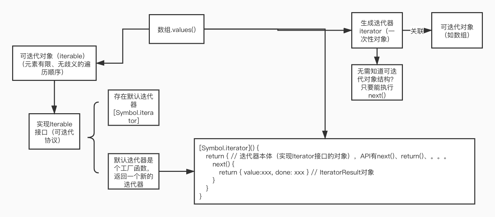
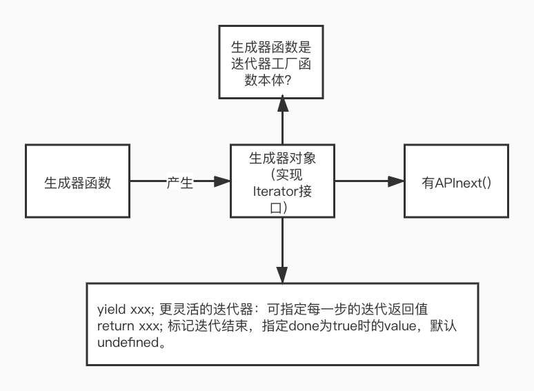

## c07-迭代器与生成器

### 1.迭代

反复多次执行一段程序，（有明确的终止条件）

迭代器、生成器 ES6

* 计数循环（for）：最简单的迭代

  迭代次数、迭代每次执行的操作      （顺序已知）

* 古早迭代（有序->数组）：①必须数组，需引用数组本身；②递增索引的方式

* 通用迭代（ES5）：forEach

  * 优点：不需引用数组自身；不需索引
  * 缺点：只限数组直接调用，不能手动终止


### 2. 迭代器模式



**内置可迭代类型：**

String、Array、Map、Set、arguments对象、NodeList等DOM集合类型

1. （迭代的自我识别）有默认迭代器属性，键为Symbol.iterator，值为迭代器工厂函数

2. （创建Iterator对象的能力）迭代器工厂函数返回【实现Iterator接口的对象】

   即包含键为next的属性、可能也包含键为return的属性

**自动调用默认迭代器工厂函数来生成迭代器的操作：**

for-of、数组解构、扩展操作符

Array.from(...)、new Set(...)、new Map(...)

Promise.all(...)、Promise.race(...)

yield* ...

Iterator维护一个指向可迭代对象的引用，会阻止垃圾回收。

每个内置可迭代对象的默认迭代器函数所产生的迭代器，也有自己的默认迭代器函数，返回指向自身（并未严格实现Iterable接口，默认迭代器函数不能创建新的迭代器）


### 3. 生成器 generator

函数加前缀*号（箭头函数不行）——>生成器函数



```javascript
/*
Function generator() {
  constructor() {
    this = {
      next() {
        // ...
      }
    }
    return this;
  }
  [Symbol.iterator]() {
    return this;
  }
}
*/
let g = generator();
g === g[Symbol.iterator]
```

使用场景（yield）：

1. 生成器对象作为可迭代对象（有默认[Symbol.iterator]为键的属性，无实现创建新迭代器的工厂函数）

2. yield实现输入输出

   给next方法传参，参数会被当作上一个yield操作的结果值

3. 产生可迭代对象 

   yield\* 可迭代对象

   yield\*操作的结果值为 Iterable对象遍历到done为true时的value属性的值

4. 实现递归 yield\*（function\* + yield\*）

   可将递归结果包装成一个生成器对象（实现Iterator接口）

其他：

* 生成器函数可以作为默认迭代器（工厂函数）

  产生->生成器对象（实现Iterator接口）

* 生成器对象有API throw()

  生成器函数内部处理，可继续——>跳过当下的yield操作（去到下一个yield）；没处理，就迭代终止。