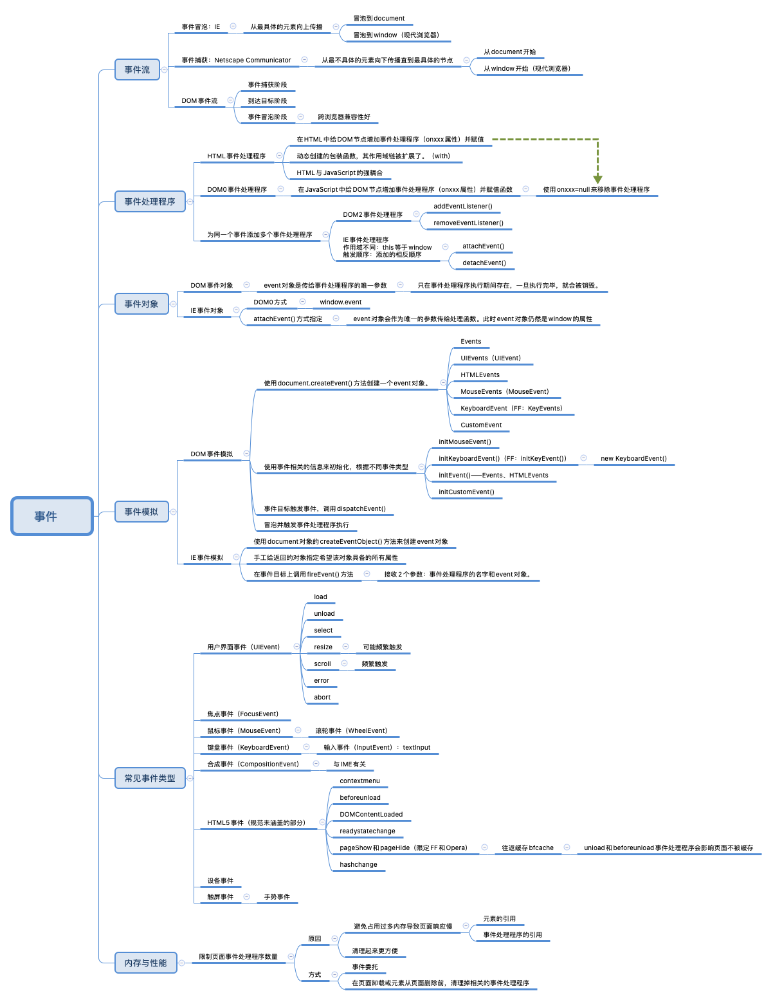

## c17-事件

JavaScript与HTML的交互是通过**事件**实现的，事件代表文档或浏览器窗口中某个有意义的时刻。

可以使用仅在事件发生时执行的**监听器**（即处理程序）订阅事件。=>观察者模式 => 页面行为（JavaScript中定义）与页面展示（HTML和CSS定义）的分离。

最早的事件是为了把某些表单处理工作从服务器转移到浏览器上来。DOM2开始尝试以符合逻辑的方式来标准化DOM事件。IE8是最后一个使用专有事件系统的主流浏览器。




### 事件流

页面哪个部分拥有特定的事件呢？当你点击一个按钮时，实际上不光点击了这个按钮，还点击了它的容器以及整个页面。

**事件流**描述了页面接收事件的顺序。

IE支持事件冒泡流，Netscape Communicator支持事件捕获流

#### 事件冒泡

从最具体的元素开始触发，然后向上传播至没有那么具体的元素（document）。

点击事件：被点击的元素最先触发click事件，然后click事件沿DOM树一路向上，在经过的每个节点上依次触发，直至到达document对象。

现代浏览器中的事件会一直冒泡到window对象。

#### 事件捕获

最不具体的节点（document）最先收到事件，而最具体的节点最后收到事件。=>**为了在事件到达最终目标前拦截事件**。

点击事件：最先由document元素捕获，然后沿DOM树依次向下传播，直至到达实际的目标元素。

现代浏览器都是从window对象开始捕获事件。DOM2 Events规范规定的是从document开始。

由于旧版本浏览器不支持，**通常建议使用事件冒泡**，特殊情况下可以使用事件捕获。

#### DOM事件流

DOM2 Events规范规定事件流分为3个阶段：事件捕获、到达目标和事件冒泡。

1. 事件捕获：最先发生，为提前拦截事件提供了可能；

2. 实际的目标元素接收到事件；
3. 冒泡：最迟要在这个阶段响应事件。

在DOM事件流中，实际的目标在捕获阶段不会接收到事件。下一阶段会在实际目标元素上触发事件的“到达目标”阶段，通常在事件处理时被认为是冒泡阶段的一部分；然后冒泡阶段开始，事件反向传播至文档。

虽然DOM2 Events规范明确捕获阶段**不命中**事件目标，但现代浏览器都会在捕获阶段在事件目标上触发事件。=> 在事件目标上有两个机会来处理事件。

所有现代浏览器都支持DOM事件流，只有IE8及更早版本不支持。

```
  capture phase  | |  / \ bubbling up
-----------------| |--| |-----------------
| element1       | |  | |                |
|   -------------| |--| |-----------     |
|   |element2    \ /  | |          |     |
|   --------------------------------     |
|        W3C event model                 |
------------------------------------------
```


### 事件处理程序

事件是用户或浏览器执行的某种动作。如click、load等。

为响应事件而调用的函数被称为**事件处理程序**（或**事件监听器**）。事件处理程序的名字以“on”开头。

有多种方式可以指定事件处理程序。

#### HTML事件处理程序

特定元素支持的每个事件都可以使用**事件处理程序的名字**（onxxx）以HTML属性的形式来指定。此时属性的值必须是能够执行的JavaScript代码。

因为属性的值是JavaScript代码，所以不能在未经转义的情况下使用HTML语法字符，如&、"、<和>。为避免使用HTML实体，可以使用单引号代替双引号，或者使用\&quot;。

在HTML中定义的事件处理程序可以包含精确的动作指令，也可以调用在页面其他地方定义的脚本。作为事件处理程序执行的代码可以访问全局作用域中的一切。

以这种方式指定的事件处理程序有**一些特殊的地方**：

1. 会创建一个函数来封装属性的值。这个函数有一个特殊的局部变量event，即event对象；

2. 在这个函数中，this值相当于事件的目标元素；

3. 这个动态创建的包装函数，其作用域链被扩展了。=> document和元素自身的成员都可以被当成局部变量来访问。这是通过使用with实现的。

   ```javascript
   // 实际上的包装函数是onclick属性的值
   function () {
     with(document) {
       with(this) {
         // ... HTML事件处理程序属性值
       }
     }
   }
   ```

   => 事件处理程序可以更方便地访问自己的属性（不用带this.）

   如果元素是一个表单输入框，则作用域链中还会包含表单元素 => 事件处理程序的代码可以不必引用表单元素，而直接访问同一表单中的其他成员了（通过name属性）。

在HTML中指定事件处理程序**存在的问题**：

1. 时机问题。有可能HTML元素已经显示在页面上，但事件处理程序的代码还无法执行。=> 大多数HTML事件处理程序会封装在try/catch块中，以便在这种情况下静默失败。

   ```html
   <input type="button" value="Click Me" onclick="try{doSomething();}catch(ex){}">
   ```

2. 对事件处理程序作用域链的扩展在不同浏览器中可能导致不同的结果。不同JavaScript引擎中标识符解析的规则存在差异 => 访问无限定的对象成员可能导致错误。

3. HTML与JavaScript的强耦合。（如果要修改，必须在HTML和JavaScript中都修改代码）

#### DOM0事件处理程序

把一个函数赋值给（DOM元素的）一个事件处理程序属性。=> 简单

**要使用JavaScript指定事件处理程序，必须先取得要操作对象的引用**。

每个元素（包括window和document）都有通常小写的事件处理程序属性。

赋值代码运行之后才会给事件处理程序赋值。

所赋函数被视为元素的方法。=> 事件处理程序会在元素的作用域中运行，即this等于元素。

```javascript
let btn = document.querySelector('#myBtn');
btn.onclick = function() {
  console.log(this.id); // "myBtn"
}
```

以这种方式添加事件处理程序是**注册在事件流的冒泡阶段**的。

通过将事件处理程序属性的值设置为null，可以移除通过DOM0方式添加的事件处理程序。（在HTML中指定的事件处理程序，也可以通过JavaScript将相应属性设置为null来移除）

```javascript
btn.onclick = null;
```

#### DOM2事件处理程序

DOM2 Events为事件处理程序的赋值和移除定义了两个方法：addEventListener()和removeEventListener()。暴露在所有DOM节点上。

接收3个参数：事件名、事件处理函数和一个表示是否在捕获阶段调用处理函数的布尔值（默认值为false，在冒泡阶段调用）。

这个事件处理程序同样在被附加到的元素的作用域中运行：this等于元素。

**主要优势**：可以为同一个事件添加多个事件处理程序。多个事件处理程序**以添加顺序**来触发。

通过addEventListener()添加的事件处理程序**只能**使用removeEventListener()并传入与添加时同样的参数来移除。（事件处理函数必须是同一个）

大多数情况下，事件处理程序会被**添加到事件流的冒泡阶段，主要原因**是跨浏览器兼容性好。（除非需要在事件到达其指定目标之前拦截事件）

#### IE事件处理程序

IE实现了与DOM类似的方法，attachEvent()和detachEvent()。

接收2个参数：**事件处理程序的名字**和事件处理函数。因为IE8及更早版本只支持事件冒泡，所以使用attachEvent()添加的事件处理程序会添加到冒泡阶段。

在IE中使用attachEvent()与使用DOM0方式的**主要区别**在于事件处理程序的作用域。**使用attachEvent()时，事件处理程序是在全局作用域中运行的，因此this等于window。**

attachEvent()方法也可以给一个元素添加多个事件处理程序。以添加它们的顺序**反向触发**。

使用attachEvent()添加的事件处理程序将使用detachEvent()来移除，只要提供相同的参数（处理函数是相同的函数引用）。

```javascript
let btn = document.querySelector('#myBtn');
var handler = function() {
  console.log("Clicked");
};
btn.attachEvent("onclick", handler);
btn.detachEvent("onclick", handler);
```

#### 跨浏览器事件处理程序

以跨浏览器兼容的方式处理事件。

自己编写跨浏览器事件处理代码**主要依赖能力检测**。要确保最大兼容性，只要让代码在冒泡阶段运行即可。

```javascript
var EventUtil = {
  addHandler: function(element, type, handler) {
    if(element.addEventListener) {
      element.addEventListener(type, handler, false);
    } else if(element.attachEvent) {
      element.attachEvent("on"+type, handler);
    } else { // 默认DOM0方式
      element["on"+type] = handler;
    }
  },
  removeHandler: function(element, type, handler) {
    if(element.removeEventListener) {
      element.removeEventListener(type, handler, false);
    } else if(element.detachEvent) {
      element.detachEvent("on"+type, handler);
    } else { // 默认DOM0方式
      element["on"+type] = null;
    }
  }
};

// 使用
let btn = document.querySelector('#myBtn');
let handler = function() {
  console.log("Clicked");
};
EventUtil.addHandler(btn, "click", handler);
EventUtil.removeHandler(btn, "click", handler);
```

没有解决的存在的问题：

1. IE的作用域问题。（attachEvent()中this等于window）
2. 多个事件处理程序执行顺序问题。DOM2以添加顺序，IE为添加顺序的反向
3. DOM0只支持给一个事件添加一个处理程序。（DOM0浏览器已经很少人使用，问题应该不大）


### 事件对象event

在DOM中发生事件时，所有相关信息（如事件目标元素、事件类型）都会被收集并存储在一个名为event的对象中。

#### DOM事件对象

在DOM合规的浏览器中，**event对象是传给事件处理程序的唯一参数**。不管以哪种方式（DOM0或DOM2）指定事件处理程序，都会传入这个event对象。在通过HTML属性指定的事件处理程序中，同样可以使用变量event引用事件对象。

所有事件对象包含的公共属性和方法：

* bubbles。布尔值。是否冒泡
* cancelable。布尔值。是否可以取消事件的默认行为
* currentTarget。元素。当前事件处理程序所在的元素
* defaultPrevented。布尔值。true表示已经调用preventDefault()方法。（DOM3 Events新增）
* detail。整数（？？）。事件相关的其他信息
* eventPhase。整数。表示调用事件处理程序的阶段：1-捕获阶段；2-到达目标；3-冒泡阶段
* target。元素。事件目标元素
* trusted。布尔值。true表示事件由浏览器生成；false表示事件由开发者通过JavaScript创建。（DOM3 Events新增）
* type。字符串。被触发的事件类型
* View。AbstractView。与事件相关的抽象视图；等于事件所发生的window对象
* preventDefault()。函数。用于取消事件的默认行为 => cancelable为true时才可调用
* stopImmediatePropagation()。函数。用于取消所有后续事件捕获或事件冒泡，并阻止调用任何后续事件处理程序。（DOM3 Events新增）
* stopPropagation()。函数。用于取消所有后续事件捕获或事件冒泡 => bubbles为true时才可调用

在事件处理程序内部，this始终等于currentTarget。`this === event.currentTarget`。

如果事件处理程序直接添加在意图的目标，则this、currentTarget和target三者相等。

type属性在一个处理程序处理多个事件时很有用：根据事件类型，做出不同的响应。

preventDefault()可阻止特定事件的默认动作，如链接的默认行为是被单击时导航到href属性指定的URL。任何可调用preventDefault()取消默认行为的事件，其event对象的cancelable属性都会设置为true。

stopPropagation()用于立即阻止事件流在DOM结构中传播，取消后续的事件捕获或冒泡。

eventPhase属性可用于确定事件流当前所处的阶段。如果事件处理程序在目标上被调用，则eventPhase等于2 => 虽然”到达目标“是在冒泡阶段发生的，但eventPhase等于2。=> 当eventPhase等于2，this、currentTarget和target三者相等。

**event对象只在事件处理程序执行期间存在，一旦执行完毕，就会被销毁。**

#### IE事件对象

IE事件对象可以**基于事件处理程序被指定的方式**以不同的方式来访问。

* 如果使用DOM0方式指定，则event对象是window的一个属性
* 如果使用attachEvent()指定，则event对象会作为唯一的参数传给处理函数。此时event对象仍然是window的属性，出于方便也将其作为参数传入
* 在通过HTML属性方式指定的事件处理程序中，同样可以使用变量event引用事件对象。

所有IE事件对象都会包含的公共属性和方法：

* cancelBubble。布尔值。读/写。true表示取消冒泡（默认false），与stopPropagation()方法效果相似
* returnValue。布尔值。读/写。false表示取消事件默认行为（默认true），与preventDefault()效果相同
* srcElement。元素。事件目标，即target
* type。字符串。触发的事件类型

事件处理程序的作用域取决于指定它的方式，所以更好的方式是使用事件对象的srcElement属性代替this。（DOM0方式下，this等于元素；attachEvent()方式下，this等于window）

与DOM不同，无法通过JavaScript确定事件是否可以被取消。

cancelBubble属性与stopPropagation()方法用途相似，但IE8及更早版本不支持捕获阶段，所以只会取消冒泡。

#### 跨浏览器事件对象

DOM事件对象中包含IE事件对象的所有信息和能力，只是形式不同。这些共性可让两种事件模型之间的映射成为可能。

```javascript
var EventUtil = {
  addHandler: function(element, type, handler) {
    // ...
  },
  removeHandler: function(element, type, handler) {
    // ...
  },
  getEvent: function(event) { // IE事件中以DOM0方式指定事件处理程序时，event对象是window的一个属性
    return event ? event || window.event;
  },
  getTarget: function(event) {
    return event.target || event.srcElement;
  },
  preventDefault: function(event) {
    if(event.preventDefault) {
      event.preventDefault();
    } else {
      event.returnValue = false;
    }
  },
  stopPropagation: function(event) { // 可能会停止事件冒泡，也可能既会停止事件冒泡也停止事件捕获
    if(event.stopPropagation) {
      event.stopPropagation();
    } else {
      event.cancelBubble = true;
    }
  }
};

// 使用
let btn = document.querySelector('#myBtn');
btn.onclick = function(event) {
  event = EventUtil.getEvent(event);
  let target = EventUtil.getTarget(event);
  EventUtil.preventDefault(event); // 阻止事件的默认行为
  EventUtil.stopPropagation(event); // 阻止事件冒泡
};
```


### 事件类型

所发生事件的类型决定了事件对象中会保存什么信息。DOM3 Events定义的事件类型：

* 用户界面事件（UIEvent）：与BOM交互的通用浏览器事件
* 焦点事件（FocusEvent）：元素获得和失去焦点时触发
* 鼠标事件（MouseEvent）：鼠标在页面上执行某些操作时触发
* 滚轮事件（WheelEvent）：使用鼠标滚轮（或类似设备）时触发
* 输入事件（InputEvent）：向文档中输入文本时触发
* 键盘事件（KeyboardEvent）：键盘在页面上执行某些操作时触发
* 合成事件（CompositionEvent）：使用某种IME（Input Method Editor，输入法编辑器）输入字符时触发
* HTML5还定义了另一组事件
* 浏览器通常在DOM和BOM上实现专有事件：根据开发者需求，不同浏览器的实现可能不同

DOM3 Events在DOM2 Events基础上重新定义了事件，并增加了新的事件类型。所有主流浏览器都支持DOM2 Events和DOM3Events。

#### 用户界面事件 UIEvent

不一定跟用户操作有关。保留它们是为了向后兼容。主要有以下几种：

* DOMActivate（DOM3 Events中已经废弃）。元素被用户通过鼠标或键盘操作激活时触发，浏览器实现之间存在差异
* load。window（页面加载完成后触发）；窗套frameset（所有窗格frame都加载完成后触发）；img（图片加载完成后触发）；object（相应对象加载完成后触发）
* unload。window（页面完全卸载后触发）；窗套（所有窗格都卸载完成后触发）；object（相应对象卸载完成后触发）
* abort。object（相应对象加载完成前被用户提前终止下载时触发）
* error。window（JavaScript报错时触发）；img（无法加载指定图片时触发）；object（无法加载相应对象时触发）；窗套（一个或多个窗格无法完成加载时触发）
* select。在文本框（input或textarea）上用户选择了一个或多个字符时触发
* resize。window或窗格（窗口或窗格被缩放时触发）
* scroll。当用户滚动**包含滚动条的元素**时在元素上触发。body元素包含已加载页面的滚动条

大多数HTML事件与window对象和表单控件有关。除了DOMActivate，其他在DOM2 Events中都被归为HTML Events。（DOMActivate是UI事件）

1. load

   **在window对象上**，load事件会在整个页面（包括所有外部资源如图片、JavaScript文件和CSS文件）**加载完成**后触发。可以通过两种方式指定load事件处理程序。

   一种是使用JavaScript方式：

   ```javascript
   // 在DOM合规的浏览器中，event.target会被设置为document，没有额外信息，在IE8之前的版本中，不会设置这个对象的srcElement属性
   window.addEventListener("load", event => {});
   ```

   第二种方式是向body元素添加onload属性：

   ```html
   <body onload="console.log('Loaded!')">
     <!-- -->
   </body>
   ```

   一般来说，任何在window上发生的事件，都可以通过给body元素上对应的属性赋值来指定。（HTML中没有window元素，向后兼容的一个策略）=> 实际开发中尽量使用JavaScript方式

   注：DOM2Events规范中，load事件应该在document而非window上触发，但为了向后兼容，所有浏览器都在window上实现了load事件（实际事件目标为document）。

   **图片上也会触发load事件**，包括DOM中的图片和非DOM中的图片。直接给img元素的onload属性指定事件处理程序，或通过JavaScript为图片指定事件处理程序。

   在通过JavaScript创建新img元素时`document.createElement('img')`，也可以给这个元素指定一个在加载完成后执行的事件处理程序。关键点：要在赋值src属性前指定事件处理程序。=> 下载图片并不一定要把img元素添加到文档，只要给它设置了src属性就会立即开始下载。

   这同样适用于DOM0的Image对象`new Image()`。（用于预先加载图片，可以像img元素一样使用，但不能添加到DOM树）。有些浏览器会把Image对象实现为img元素，但不是所有浏览器都如此。

   注：IE8以更早版本中，如果图片没有添加到DOM文档中，则load事件发生时不会生成event对象。

   **script元素（以非标准的方式）支持load事件**。在JavaScript文件加载完成后触发，从而可以动态检测。要下载JavaScript文件必须同时指定src属性并把script元素添加到文档中。

   此处event对象的target属性在大多数浏览器中是script节点。IE8及更早版本不支持script元素触发load事件。

   **link元素**（IE和Opera支持触发load事件）。支持动态检测样式表是否加载完成。在指定href属性并把link节点添加到文档之前不会下载样式表。

2. unload事件

   在文档**卸载完成后**触发。一般是在从一个页面导航到另一个页面时触发，最常用于清理引用，以避免内存泄漏。可以通过两种方式指定unload事件处理程序。

   一种是JavaScript方式：

   ```javascript
   window.addEventListener("unload", event => {});
   ```

   此处的event对象在DOM合规的浏览器中**只有**target属性（document）。IE8及更早版本在此事件上不提供srcElement属性。

   第二种方式是向body元素添加onunload属性：

   ```html
   <body onunload="console.log('Unloaded!')">
     <!-- -->
   </body>
   ```

   不能使用页面加载后才有的对象。此时访问DOM或修改页面外观都会导致错误。

   注：DOM2Events规范中，unload事件应该在body而非window上触发，但为了向后兼容，所有浏览器都在window上实现了unload事件。

3. resize事件

   当**浏览器窗口被缩放到新高度或宽度**时，会触发resize事件。在window上触发。

   可通过JavaScript在window上或者为body元素添加onresize属性来指定事件处理程序，优先使用JavaScript方式。

   此时event对象的target属性在DOM合规的浏览器中是document。IE8及更早版本中并没有提供可用的属性。

   不同浏览器在决定何时触发resize事件上存在重要差异。应避免在这个事件处理程序中执行过多计算 => **可能由于执行过于频繁而导致浏览器响应明显变慢**。

4. scroll事件

   发生在window上，但实际上反映的是页面中相应元素的变化。

   混杂模式下，可以通过body元素检测scrollLeft和scrollTop属性的变化；标准模式下，这些变化在除早期版本的Safari之外的所有浏览器中都发生在html元素上（document.documentElement）。

   ```javascript
   window.addEventListener("scroll", event => {
     if(document.compatMode === "CSS1Compat") { // 标准
       console.log(document.documentElement.scrollTop);
     } else { // 混杂
       console.log(document.body.scrollTop);
     }
   });
   ```

   scroll事件也**会随着文档滚动而重复触发**，因此最好保持事件处理程序的代码尽可能简单。

#### 焦点事件 FocusEvent

页面元素获得或失去焦点时触发。可以与document.hasFocus()和document.activeElement一起**为开发者提供**用户在页面中导航的信息。焦点事件有以下6种：

* blur。失去焦点时触发。不冒泡，所有浏览器都支持
* DOMFocusIn（DOM3 Events中已经废弃，推荐focusin）。获得焦点时触发。focus的冒泡版。Opera唯一支持
* DOMFocusOut（DOM3 Events中已经废弃，推荐focusout）。失去焦点时触发，blur的通用版。Opera唯一支持
* focus。获得焦点时触发。不冒泡，所有浏览器都支持
* focusin。获得焦点时触发。focus的冒泡版
* focusout。失去焦点时触发。blur的通用版

两个主要事件是focus和blur，它们最大的问题是不冒泡。

当焦点从页面中的一个元素A移到另一个元素B上，会依次发生如下事件（测试，与书中不一致）：

1）A：blur

2）A：focusout

3）B：focus

4）B：focusin

DOMFocusOut和DOMFocusIn未验证

#### 鼠标和滚轮事件MouseEvent

鼠标是用户的主要定位设备。DOM3 Events定义了9种鼠标事件：

* click。用户单击鼠标主键（通常是左键）或按键盘回车键时触发。
* dblclick。用户双击鼠标主键（通常是左键）时触发（DOM3 Events中标准化）
* mousedown。用户按下任意鼠标键时触发。不能通过键盘触发
* mouseenter。用户把鼠标光标从元素外部移到元素内部时触发。不冒泡，也不会在光标经过后代元素时触发。（DOM3 Events中新增）
* mouseleave。用户把鼠标光标从元素内部移到元素外部时触发。不冒泡，也不会在光标经过后代元素时触发。（DOM3 Events中新增）
* mousemove。鼠标光标在元素上移动时反复触发。不能通过键盘触发
* mouseout。用户把鼠标光标从一个元素移到另一个元素上（外部元素或子元素）时触发。不能通过键盘触发
* mouseover。用户把鼠标光标从元素外部移到元素内部时触发。不能通过键盘触发
* mouseup。用户释放鼠标键时触发。不能通过键盘触发

**页面中所有元素都支持鼠标事件。**除了mouseenter和mouseleave，其他鼠标事件都会冒泡，都可以被取消，这会影响浏览器的默认行为。由于事件之间存在关系，因此取消鼠标事件的默认行为也会影响其他事件。

**双击鼠标主键会按如下顺序触发事件：**

1）mousedown

2）mouseup

3）click

4）mousedown

5）mouseup

6）click

7）dblclick

click和dblclick在触发前都依赖其他事件触发，mousedown和mouseup则不会受其他事件影响。

IE8和更早的版本的实现中存在问题，会导致双击事件跳过第二次mousedown和click事件。

1）mousedown

2）mouseup

3）click

4）mouseup

5）dblclick

DOM3 Events中鼠标事件对应的类型是”MouseEvent“（单数形式）

鼠标事件还有一个名为滚轮事件的子类别。**滚轮事件只有一个事件mousewheel**，对应鼠标滚轮或带滚轮的类似设备上滚轮的交互。

**鼠标事件event对象的一些属性：**

1. 客户端坐标

   在浏览器视口中的某个位置。保存在event对象的clientX和clientY属性中。表示事件发生时鼠标光标在视口中的坐标，所有浏览器都支持

   注：客户端坐标不考虑页面滚动

2. 页面坐标

   在页面上的位置。表示事件发生时鼠标光标在页面上的坐标，通过event对象的pageX和pageY属性获取。

   反映的是光标到页面而非视口左边与上边的距离。

   在页面没有滚动时，pageX和pageY与clientX和clientY的值相同。

   IE8及更早版本没有在event对象上暴露页面坐标。不过可以通过客户端坐标和滚动信息计算出来。

   ```javascript
   document.querySelector('#container').addEventListener('click', event => {
   	console.log(`Client coordinates: ${event.clientX}, ${event.clientY}`);
   	if(event.pageX === undefined) {
   		console.log(`Page coordinates: ${event.clientX + (document.body.scrollLeft || document.documentElement.scrollLeft)}, ${event.clientY + (document.body.scrollTop || document.documentElement.scrollTop)}`);	
   	} else {
   		console.log(`Page coordinates: ${event.pageX}, ${event.pageY}`);
   	}
   	console.log(`Screen coordinates: ${event.screenX}, ${event.screenY}`);
   });
   ```

3. 屏幕坐标

   鼠标光标在屏幕上的坐标，通过event对象的screenX和screenY属性获取。

4. 修饰键

   有时要确定用户想实现的操作，还要**考虑键盘按键的状态**。

   键盘上的修饰键Shift、Ctrl、Alt和Meta（win的window键，mac的command键）经常用于修改鼠标事件的行为。

   4个属性来表示这几个修饰键的状态：shiftKey、ctrlKey、altKey、metaKey。（被按下为true，否则为false）

   现在浏览器支持所有4个修饰键，IE8及更早版本不支持metaKey属性。

5. 相关元素

   对mouseover和mouseout事件而言，还存在**与事件相关的其他元素**。

   对mouseover事件来说，事件的主要目标是获得光标的元素，相关元素是失去光标的元素；对mouseout事件来说，事件的主要目标是失去光标的元素，相关元素是获得光标的元素。

   DOM通过event对象的relatedTarget属性提供了相关元素的信息。IE8及更早版本不支持relatedTarget属性，但提供了其他的可以访问到相关元素的属性。在mouseover事件触发时，fromElement属性包含相关元素；mouseout事件触发时，toElement属性包含相关元素。

   在EventUtil中可增加一个通用的获取相关属性的方法：

   ```javascript
   var EventUtil = {
     addHandler: function(element, type, handler) {
       // ...
     },
     removeHandler: function(element, type, handler) {
       // ...
     },
     getEvent: function(event) { // IE事件中以DOM0方式指定事件处理程序时，event对象是window的一个属性
       // ...
     },
     getTarget: function(event) {
       // ...
     },
     preventDefault: function(event) {
       // ...
     },
     stopPropagation: function(event) { // 可能会停止事件冒泡，也可能既会停止事件冒泡也停止事件捕获
       // ...
     },
     getRelatedTarget: function(event) { // 使用特性检测来确定要返回哪个值
       if(event.relatedTarget) {
         return event.relatedTarget;
       } else if(event.toElement) {
         return event.toElement;
       } else if(event.fromElement) {
         return event.fromElement;
       } else {
         return null;
       }
     }
   };
   
   // 使用
   let btn = document.querySelector('#myBtn');
   btn.onmouseout = function(event) {
     event = EventUtil.getEvent(event);
     let target = EventUtil.getTarget(event);
     let relatedTarget = EventUtil.getRelatedTarget(event);
   };
   ```

6. 鼠标按键

   对mousedown和mouseup事件来说，**event对象上会有一个button属性**，表示按下或释放的是哪个按键。DOM为button属性定义了3个值：0-主键；1-中键（通常是滚轮键）；2-副键。

   IE8及更早版本也提供了button属性，考虑了同时按多个键的情况。

7. 额外事件信息

   DOM2 Events规范在event对象上提供了**detail属性**，以给出关于事件的更多信息。对鼠标事件来说，detail包含一个数值，表示在给定位置上发生了多少次单击（连续单击）。每次单击会加1。连续点击中断会重置为0。

   IE还为每个鼠标事件提供了以下额外信息：

   * altLeft，布尔值，是否按下了左Alt键（如果为true，则altKey也为true）
   * ctrlLeft，布尔值，是否按下左Ctrl键（如果为true，则ctrlKey也为true）
   * offsetX，光标相对于目标元素边界的x坐标
   * offsetY，光标相对于目标元素边界的y坐标
   * shiftLeft，布尔值，是否按下了左Shift键（如果为true，则shiftKey也为true）

**滚轮mousewheel事件**

在用户使用鼠标滚轮时触发，包括在垂直方向上任意滚动。会在任何元素上触发，并（在IE8中）冒泡到document和（所有现代浏览器中）window。

event对象包含鼠标事件的所有标准信息，此外还有一个名为wheelDelta的属性。

多数情况下只需知道滚轮滚动的方向，而这通过wheelDelta值的符号就可以知道。（向前滚动一次+120，向后滚动一次-120）

**触摸屏设备**

触摸屏通常不支持鼠标操作。

* 不支持dblclick事件。（测试一加三可以）
* 单指点触屏幕上的可点击元素会触发mousemove事件。（测试一加三不行）可点击元素是指点击时有默认动作的元素（如链接）或指定了onclick事件处理程序的元素
* mousemove事件也会触发mouseover和mouseout事件。（还未测试）
* 双指点触屏幕并滑动导致页面滚动时会触发mousewheel和scroll事件。（还未测试）

**无障碍问题**

如果Web应用或网站要考虑残障人士，特别是使用屏幕阅读器的用户，那么必须小心使用鼠标事件（除了回车键可以触发click事件，其他鼠标事件不能通过键盘触发）。建议不要使用click事件之外的其他鼠标事件向用户提示功能或触发代码执行。=> 会严格妨碍盲人或视障用户使用。

几条**使用鼠标事件时应该遵循的无障碍建议**：

* 使用click事件执行代码。当使用onmousedown执行代码时，应用程序会运行得更快，但屏幕阅读器无法触发mousedown事件
* 不要使用mouseover向用户显示新选项。无法触发。可以考虑键盘快捷键
* 不要使用dblclick执行重要的操作。无法触发

更多网站无障碍的信息，可以参考WebAIM网站。

#### 键盘与输入事件KeyboardEvent

用户操作键盘时触发。很大程度上是基于原始的DOM0实现的。

DOM3 Events为键盘事件提供了一个首先在IE9中完全实现的规范，其他浏览器也开始实现该规范，但仍存在很多遗留的实现。

包含3个事件：

* keydown，按下键盘上某个键时触发，持续按钮会重复触发
* keypress（DOM3 Events已经废弃，推荐textInput事件），按下键盘上某个键并产生字符时触发，持续按住会重复触发。Esc键也会触发（Chrome里测试不会触发？）。
* keyup，用户释放键盘上某个键时触发。

所有元素都支持这些事件。但在文本框中输入内容时最容易看到。

**输入事件只有一个：textInput。**是对keypress事件的扩展，用于在文本显示给用户之前更方便地截获文本输入。会在文本被插入到文本框之前触发。

1. **当用户按下某个字符键时，**会触发keydown事件，然后触发keypress事件，最后触发keyup事件。（keydown和keypress会在文本框出现变化之前触发，keyup会在文本框出现变化之后触发）；如果按住不放，keydown和keypress会重复触发，直到这个键被释放。

2. **当用户按下非字符键时，**会触发keydown事件，然后触发keyup事件。如果按住不放，keydown会重复触发，直到这个键被释放。

注：键盘事件支持与鼠标事件相同的修饰键。

**键盘事件event对象的一些属性：**

1. 键码keyCode

   keydown和keyup事件，event对象的keyCode属性会保存一个键码。

   对于字母和数字键，keyCode的值与大写字母和数字的ASCII编码一致。与是否按了Shift键无关。

   DOM和IE的event对象都支持keyCode属性

2. 字符编码charCode

   keypress事件，意味着按键会影响屏幕上显示的文本。对插入或移除字符的键，所有浏览器都会触发keypress事件，其他键则取决于浏览器。

   event对象上的charCode属性，只有发生keypress事件时这个属性才会被设置值（此时与keyCode属性相等）。包含的是按键字符对应的ASCII编码。

   IE8及更早版本和Opera使用keyCode传达字符的ASCII编码。要以跨浏览器方式获取字符编码，**首先要检测charCode属性是否有值，如果没有再使用keyCode。**

   ```javascript
   var EventUtil = {
     addHandler: function(element, type, handler) {
       // ...
     },
     removeHandler: function(element, type, handler) {
       // ...
     },
     getEvent: function(event) { // IE事件中以DOM0方式指定事件处理程序时，event对象是window的一个属性
       // ...
     },
     getTarget: function(event) {
       // ...
     },
     preventDefault: function(event) {
       // ...
     },
     stopPropagation: function(event) { // 可能会停止事件冒泡，也可能既会停止事件冒泡也停止事件捕获
       // ...
     },
     getRelatedTarget: function(event) { // 使用特性检测来确定要返回哪个值
       // ...
     },
     getCharCode: function(event) {
       if(typeof event.charCode == "number") {
         return event.charCode;
       } else {
         return event.keyCode;
       }
     }
   };
   
   // 使用
   let textbox = document.querySelector('#myText');
   textbox.addEventListener("keypress", function(event) {
     event = EventUtil.getEvent(event);
     console.log(EventUtil.getCharCode(event));
   });
   ```

   有了字母编码，就可以使用String.fromCharCode()方法将其转换为实际的字符了。

**DOM3的变化**

DOM3 Events规范并未规定charCode属性，而是**定义了key和char两个新属性。**

key属性用于替代keyCode，且包含字符串。按下字符键时，key等于文本字符；按下非字符键时，key的值是键名（如”Shift“或”ArrowDown“）

char属性在按下字符键时与key类似，在按下非字符键时为null。（测试Chrome中keypress和keydown的event对象此属性都无）

IE支持key属性但不支持char属性。

Safari和Chrome支持keyIdentifier属性（测试Chrome无此属性）。对于字符键，keyIdentifier返回以”U+0000“形式表示Unicode值的字符串形式的字符编码。

由于**缺乏跨浏览器支持，不建议使用key、keyIdentifier和char。**

DOM3 Events也支持**一个名为location的属性**，是一个数值，表示是在哪里按的键。可能的值为：0-默认键；1-左边；2-右边；3-数字键盘；4-移动设备（虚拟键盘）；5-游戏手柄。Safari和Chrome支持一个等价的keyLocation属性（实现有问题）

**没有得到广泛支持，不建议在跨浏览器开发时使用location属性。**

给event对象**增加了getModifierState()方法**，接收一个参数，一个等于Shift、Control、Alt、AltGraph或Meta的字符串，表示要检测的修饰键。如果给定 的修饰键被按钮，则返回true。（也可直接使用event对象的shiftKey、ctrlKey、altKey或metaKey属性获取）

**输入textInput事件**

DOM3 Events规范新增，在字符被输入到可编辑区域时触发。

与keypress比对：1. keypress会在任何可以获得焦点的元素上触发，textInput只在可编辑区域上触发；2. textInput只在有新字符被插入时才会触发，而keypress对任何可能影响文本的键都会触发（包括退格键（Chrome里测试不会触发？））。3. 使用输入法（搜狗）时，在触发合成事件时不会触发keypress，在compositionend触发之前会先触发textInput事件。4. 使用键盘输入先触发keypress，再触发textInput。

该事件主要关注字符，event对象上有data属性，为被插入的字符（非字符编码）；还有一个inputMethod的属性（Chrome中测试无此属性打印为undefined），表示向控件中输入文本的手段，可以辅助验证

**设备上的键盘事件**（非键盘）

任天堂Wii

#### 合成事件

DOM3 Events中新增，用于处理通常使用IME输入时的复杂输入序列。IME可以让用户输入物理键盘上没有的字符，通常需要按下多个键才能输入一个字符，合成事件用于检测和控制这种输入。

合成事件有以下3种：

* compositionstart，表示输入即将开始
* compositionupdate，在新字符插入输入字段时触发；
* compositionend，表示恢复正常键盘输入

唯一增加的事件属性是data：

* 在compositionstart中，为正在编辑的文本（默认是空串，或者是选中的文本）
* 在compositionupdate中，为要插入的新字符
* 在compositionend中，为本次合成过程中输入的全部内容

测试得到的触发顺序：

keydown -> ...start -> ...update -> ( **(keyup) -> keydown -> ...update -> (keyup)**)(循环触发) -> ...update(此时data与...end事件中的data一致) -> textInput -> ...end -> keyup 

#### 变化事件

DOM2的变化事件（Mutation Events），在DOM发生变化时提供通知。

（已废弃）

已经被Mutation Observers所取代（第14章）

#### HTML5事件

HTML5中得到浏览器较好支持的一些事件（规范未涵盖）

1. contextmenu事件

   单击鼠标右键（Ctrl+单击左键）。用于**允许开发者取消默认的上下文菜单并提供自定义菜单**。冒泡。

   事件目标是触发操作的元素，这个事件在所有浏览器中都可以取消（event.preventDefault()或event.returnValue设置为false）。

   通常通过onclick事件处理程序触发隐藏（自定义菜单）。

2. beforeunload事件

   在window上触发。用于**给开发者提供阻止页面被卸载的机会**。在页面即将从浏览器中卸载时触发。

   **不能取消**，否则就意味着可以把用户永久阻拦在一个页面上。

   该事件会向用户显示一个确认框。用户可以点击取消或者确认离开页面。需要将event.returnValue设置为要在确认框中显示的字符串（对于IE和FF来说）（测试FF显示的提示文字与returnValue属性值无关），并将其作为函数值返回（对于Safari和Chrome来说）（测试Chrome无返回值也无影响）

3. DOMContentLoaded事件

   会在DOM树构建完成后立即触发，而不用等待图片、JavaScript文件、CSS文件或其他资源加载完成。（可以在外部资源下载的同时指定事件处理程序，从而让用户能够更快地与页面交互）

   比对load事件：要等待很多外部资源加载完成。

   需要给document或window添加事件处理程序（实际的事件目标是document，会冒泡到window）。

   通常**用于添加事件处理程序或执行其他DOM操作**。这个事件始终在load事件之前触发。

   对于不支持DOMContentLoaded事件的浏览器，可以使用超时为0的setTimeout()函数，通过其回调来设置事件处理程序。本质上是在当前JavaScript进程执行完毕后立即执行这个回调。（与DOMContentLoaded触发时机一致无绝对把握，最好是页面上的第一个超时代码）

4. readystatechange事件

   IE首先定义。用于**提供文档或元素加载状态的信息**，但行为有时不稳定。

   event.target或其他支持readystatechange事件的对象都有一个readyState属性，该属性可能为以下5个值：

   * uninitialized：对象存在并尚未初始化
   * loading：对象正在加载数据
   * loaded：对象已经加载完数据
   * interactive √：对象可以交互，但尚未加载完成
   * complete √：对象加载完成

   并非所有对象都会经历所有readyState阶段（Chrome测试document只经历了两个阶段：interactive和complete）

   值为”interactive“的readyState阶段，时机类似于DOMContentLoaded。进入交互阶段，意味着DOM树已加载完成。（此时图片和其他外部资源不一定都加载完成了）。

   与load事件共同使用时，这个事件的触发顺序不能保证。interactive和complete的顺序也不是固定的，为了抢到较早的时机，需要同时检测交互阶段和完成阶段（可以保证尽可能接近使用DOMContentLoaded事件的效果）。

5. pageshow与pagehide事件

   FF和Opera开发的一个名为往返缓存（bfcache，back-forward cache）的功能，旨在**使用浏览器”前进“和”后退“按钮时加快页面之间的切换**。不仅存储页面数据，也存储DOM和JavaScript状态，实际上是把整个页面都保存在内存里。

   如果页面在缓存中，导航到这个页面时就不会触发load事件。

   * pageshow：在页面显示时触发，无论是否来自往返缓存。新加载的页面，会在load事件之后触发；来自往返缓存的页面，会在页面状态完全恢复后触发。事件目标是document，但事件处理程序必须添加到window上。（点击了浏览器的”刷新“按钮，页面会重新加载）。event对象中的persisted属性为布尔值，表示页面内容是否来自往返缓存。

   * pagehide：在页面从浏览器中卸载后，在unload事件之前触发。事件目标是document，但事件处理程序必须添加到window上。event对象中的persisted属性为布尔值，表示页面在卸载后是否保存在往返缓存中。

     **注册了onunload事件处理程序的页面会自动排除在往返缓存之外**（测试beforeunload也会影响），因为onunload的典型场景就是撤销onload事件发生时所做的事情，如果使用往返缓存，下一次页面显示时就不会触发onload事件，这可能导致页面无法使用。

6. hashchange事件

   用于在URL散列值（#后面的部分）发生变化时通知开发者。

   事件处理程序必须添加给window。event对象有两个新属性：oldURL和newURL，分别保存变化前后的URL，包含散列值的完整URL。如果想确定当前的散列值，最好使用location对象。

#### 设备事件

智能手机和平板计算机=>交互的新方式

用于确定用户使用设备的方式。

1. orientationchange事件

   苹果，移动Safari浏览器。判断用户的设备是处于垂直模式还是水平模式。window.orientation属性，有3种值：0-垂直模式，90-左转水平模式（Home键在右），-90-右转水平模式（Home键在左）。当属性值改变就会触发该事件。

   所有iOS设备都支持该事件和该属性。（测试锁定竖屏=>不会改变）

   被认为是window事件，也可给body元素添加onorientationchange属性来指定事件处理程序。

2. deviceorientation事件

   DeviceOrientationEvent规范定义的事件。

   如果可以获取设备的加速计信息，且数据发生了变化，就会在window上触发。只反应设备在空间中的朝向，与移动无关。

   设备本身处于3D空间，x轴方向为从设备左侧到右侧，y轴方向为从设备底部到上部，z轴方向为从设备背面到正面。

   event对象包含各个轴相对于设备静置时坐标值的变化，主要有5个属性：

   * alpha：0~360内的浮点值，表示**围绕z轴旋转**时y轴的度数（左右转）
   * beta：-180~180内的浮点值，表示**围绕x轴旋转**时z轴的度数（前后转）
   * gamma：-90~90内的浮点值，表示**围绕y轴旋转**时z轴的度数（扭转）。
   * absolute：布尔值，表示设备是否返回绝对值。
   * compassCalibrated：布尔值，表示设备的指南针是否正确校准。

   测试iPhone8（iOS11.4.1）平放在桌面上也一直监听到变动（？），测试Android（一加三）平放在桌面上后不会变动

3. devicemotion事件

   DeviceOrientationEvent规范定义的事件。

   用于提示设备实际上在移动，而不仅仅是改变了朝向。event对象包含的额外属性：

   * acceleration：对象，包含x、y和z属性，反映不考虑重力情况下各个维度的加速信息
   * accelerationIncludingGravity：对象，包含x、y和z属性，反映各个维度的加速信息，包含z轴自然重力加速度
   * interval：毫秒，距离下次触发事件的时间。此值在事件之间应为常量。
   * rotationRate：对象，包含alpha、beta和gamma属性，表示设备朝向。

   如果无法提供acceleration、accelerationIncludingGravity、rotationRate信息，则属性值为null。=> 使用之前必须先检测

   测试iPhone8（iOS11.4.1）平放在桌面上也一直监听到变动，测试Android（一加三）平放在桌面上也一直监听到变动

#### 触摸及手势事件

只适用于触屏设备。

Webkit为Android定制了很多专有事件，成为了事实标准，并被纳入W3C的Touch Events规范。

1. 触摸事件

   如下几种：

   * touchstart：手指放到屏幕上时触发
   * touchmove：手指在屏幕上滑动时连续触发。在此事件中调用preventDefault()可以阻止滚动（测试并不能）
   * touchend：手指从屏幕上移开时触发
   * touchcancel：系统停止跟踪触摸时触发。文档未明确什么情况下停止跟踪。

   都会冒泡，都可以被取消。不属于DOM规范，浏览器以兼容DOM的方式实现它们。每个触摸事件的event对象都提供了鼠标事件的公共属性，另外提供以下3个属性用于跟踪触点：

   * touches：Touch对象的数组，表示当前屏幕上的每个触点。
   * targetTouches：Touch对象的数组，表示特定于事件目标的触点。
   * changedTouches：Touch对象的数组，表示自上次用户动作之后变化的触点

   每个Touch对象包含一些属性，可用于追踪屏幕上的触摸轨迹。（针对一个触点）touchend事件触发时touches集合中什么也没有，这是因为没有滚动的触点了。

   当手指点触屏幕上的元素时，依次触发的事件（测试与书本不一致）：

   1）touchstart

   2）touchend

   3）mousemove

   4）mousedown

   5）mouseup

   6）click

2. 手势事件

   iOS2.0中的Safari中增加。在两个手指触碰屏幕且相对距离或旋转角度变化时触发。有如下3种：

   * gesturestart：一个手指在屏幕上，再把另一手指放到屏幕上时触发
   * gesturechange：任何一个手指在屏幕上的位置发生变化时触发
   * gestureend：其中一个手指离开屏幕时触发

   都会冒泡。

   只有在两个手指同时接触事件接收者时（目标元素边界以内），这些事件才会触发。

   触摸事件和手势事件存在一定的关系。

   每个手势事件的event对象都包含所有标准的鼠标事件属性，新增了两个属性是rotation和scale。

   rotation：表示手指变化旋转的度数，负值表示逆时针旋转，正值表示顺时针旋转（从0开始）；

   scale：表示两指之间距离变化（对捏）的程度，开始时为1，然后随着距离增大或缩小相应地增大或缩小。

   触摸事件也会返回rotation和scale属性，但只在两个手指触碰屏幕时才会变化。

#### 其他一些规范中定义的浏览器事件

参考书本


### 内存与性能

在JavaScript中，页面中事件处理程序的数量与页面整体性能直接相关。

首先，每个函数都是对象，都占用内存空间；其次，为指定事件处理程序所需访问DOM的次数会**先期**造成整个页面交互的延迟。

改善页面性能？

#### 事件委托

”过多事件处理程序“的解决方案是使用事件委托。

**利用事件冒泡**，可以只使用一个事件处理程序来管理一种类型的事件。只要给所有元素（需要处理某种事件的元素）共同的祖先节点添加一个事件处理程序，就可以解决问题（根据target判断进行不同的处理）。=> 只访问了一个DOM元素和添加了一个事件处理程序。 => 占用内存更少，所有使用按钮的事件（大多数鼠标事件和键盘事件）都适用于这个解决方案。

只要可行，就应该考虑只给document添加一个事件处理程序，通过它处理页面中所有某种类型的事件。优点如下：

* document对象随时可用。=> 只要页面渲染出可点击的元素，就可以无延迟地起作用。
* 既可以节省DOM引用，也可以节省时间（设置页面事件处理程序的事件）。
* 减少整个页面所需的内存，提升整体性能。

最适合使用事件委托的事件包括：click、mousedown、mouseup、keydown和keypress。

#### 删除事件处理程序

把事件处理程序指定给元素后，在浏览器代码和负责页面交互的JavaScript代码之间就建立了联系。这种联系建立得越多，页面性能就越差。除了使用事件委托减少这种联系外，还应及时删除不用的事件处理程序。

很多Web应用性能不佳都是由于**无用的事件处理程序长驻内存**导致的。原因如下：

* 删除带有事件处理程序的元素。如使用方法removeChild()或replaceChild()删除节点，或使用innerHTML整体替换页面的某一部分。=> 被删除的元素上若有事件处理程序，就不会被垃圾收集程序正常清理。（特别是IE8及更早版本，元素的引用和事件处理程序的引用）

  如果知道某个元素会被删除，那么最好在**删除它之前**手工删除它的事件处理程序（或者不直接给它添加事件处理程序，使用事件委托）。=>确保内存被回收，元素也可以安全地从DOM中删掉。

  注意：在事件处理程序中删除元素会阻止事件冒泡。只有事件目标仍然存在于文档中时，事件才会冒泡。

* 页面卸载导致内存中残留引用。事件处理程序没有被清理，会残留在内存中。

  最好在onunload事件处理程序中趁页面尚未卸载先删除所有事件处理程序。=> 使用事件委托的优势：事件处理程序很少。


### 模拟事件

通常事件都是由用户交互或浏览器功能触发。

可以通过JavaScript在任何时候触发任意事件 => 在测试Web应用时特别有用

DOM3规范指明了模拟特定类型事件的方式。

#### DOM事件模拟

步骤：

1. 使用document.createEvent()方法创建一个event对象。

   createEvent()方法接收一个参数，一个表示要创建事件类型的字符串。DOM2是英文复数形式，DOM3中是英文单数形式。可用值为以下之一：

   * ”UIEvents“（DOM3是”UIEvent“）：通用用户界面事件（鼠标事件和键盘事件都继承于此）
   * ”MouseEvents“（DOM3是”MouseEvent“）：通用鼠标事件
   * ”HTMLEvents“（DOM3中无）：通用HTML事件（已分散到其他事件大类中）
   * 键盘事件（DOM3 Events中增加）
   * “Events”：通用事件
   * “CustomEvent”（DOM3中增加）：自定义事件

2. 使用事件相关的信息来初始化

   每种类型的event对象都有特定的方法，取决于调用createEvent()时传入的参数

3. 触发事件

   事件目标调用dispatchEvent()方法。该方法存在于所有支持事件的DOM节点上。

   接收一个参数，即要触发事件的event对象

4. 冒泡并触发事件处理程序执行

不同事件类型的模拟：

1. 鼠标事件

   * 调用createEvent()并传入”MouseEvents“参数
   * 调用返回的event对象的initMouseEvent()方法，为新对象指定鼠标的特定信息。接收15个参数，分别对应鼠标事件会暴露的属性，如type、bubbles、cancelable、view等，这四个是正确模拟事件唯一重要的几个参数，因为浏览器要用到，其他参数则是事件处理程序要用的。
   * event对象的target属性会自动设置为调用dispatchEvent()方法的节点

   所有鼠标事件都可以在DOM合规的浏览器中模拟出来

2. 键盘事件

   * DOM3中创建键盘事件的方式是给createEvent()方法传入参数”KeyboardEvent“
   * 调用返回的event对象的initKeyboardEvent()方法。接收8个参数，包括type、bubbles、cancelable、view等。

   DOM3 Events中废弃了keypress事件，因此只能通过上述方式模拟keydown和keyup事件。

   在使用`document.createEvent("KeyboardEvent")`之前，最好检测一下浏览器对DOM3键盘事件的支持情况`document.implementation.hasFeature("KeyboardEvents", "3.0")`。

   测试Chrome，调用initKeyboardEvent()方法传入的key和modifier参数与在事件处理程序中打印出来的属性不一致，可以使用`new KeyboardEvent()`（参数与在事件处理程序中打印出的一致），另，两种模拟都不会使文本框中有内容

   FF限定：

   * 给createEvent()传入”KeyEvents“来创建键盘事件
   * 调用event对象的initKeyEvent()方法。接收10个参数，包括type、bubbles、cancelable、view等。

   测试：ff（88.0）显示不支持 Uncaught DOMException: Operation is not supported

   其他不支持键盘事件的浏览器：

   * 创建一个通用的事件，给createEvent()方法传入参数”Events“
   * 调用event对象的initEvent()方法
   * 通过event.xxx方式指定特定于键盘的信息

   必须使用通用事件而不是用户界面事件，因为用户界面事件不允许直接给event对象添加属性

3. 其他事件

   HTML事件：

   * 调用createEvent()方法并传入“HTMLEvents”
   * 调用返回的event对象的initEvent()方法来初始化信息

   测试：模拟focus，能监听到事件，但是没有光标

4. 自定义DOM事件

   DOM3新增自定义事件类型。不触发原生DOM事件。

   * 调用createEvent()并传入参数“CustomEvent”
   * 调用返回的event对象的initCustomEvent()方法，接收4个参数：type、bubbles、cancelable、detail
   * 调用dispatchEvent()

#### IE事件模拟

在IE8及更早版本中模拟事件。

步骤：

1. 使用document对象的createEventObject()方法来创建event对象。不接收参数，返回一个通用event对象
2. 手工给返回的对象指定希望该对象具备的所有属性。（无初始化方法）可指定任何属性，包括IE8及更早版本不支持的属性。这些属性值对于事件来说并不重要，只有事件处理程序才会使用它们。
3. 在事件目标上调用fireEvent()方法。接收2个参数：事件处理程序的名字和event对象。srcElement和type属性会自动指派到event对象。

IE支持的所有事件都可以通过相同的方式来模拟。


### 小结

最常见的事件是在DOM3 Events规范或HTML5中定义的。

需要考虑内存与性能问题：

* 限制页面中事件处理程序数量。=> 避免占用过多内存导致页面响应慢，清理起来更方便
  * 使用事件委托
  * 在页面卸载或元素从页面删除前，清理掉相关的事件处理程序