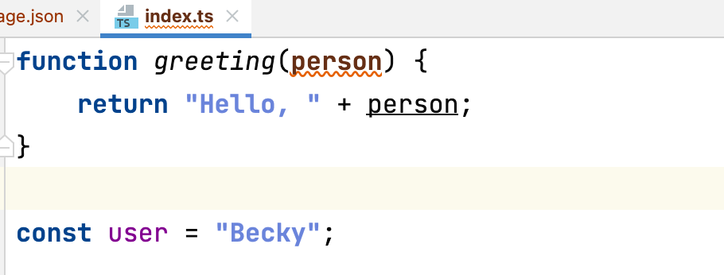

## 开始使用TypeScript

### 1. 安装TypeScript

全局安装：

```shell
yarn global add typescript

$ yarn global add typescript
yarn global v1.22.10
[1/4] 🔍  Resolving packages...
[2/4] 🚚  Fetching packages...
[3/4] 🔗  Linking dependencies...
[4/4] 🔨  Building fresh packages...
warning Your current version of Yarn is out of date. The latest version is "1.22.19", while you're on "1.22.10".
info To upgrade, run the following command:
$ curl --compressed -o- -L https://yarnpkg.com/install.sh | bash
success Installed "typescript@4.8.3" with binaries:
      - tsc
      - tsserver
✨  Done in 67.21s.
```

### 2. 搭建环境，初始化配置

```shell
## 创建项目目录
mkdir learn_TS && cd learn_TS
## 创建src目录
mkdir src && touch src/index.ts
## 使用npm初始化
npm init
## 使用tsc初始化ts配置
tsc --init // npx typescript --init
```

```shell
$ tsc --init

Created a new tsconfig.json with:                                               
                                                                             TS 
  target: es2016
  module: commonjs
  strict: true
  esModuleInterop: true
  skipLibCheck: true
  forceConsistentCasingInFileNames: true


You can learn more at https://aka.ms/tsconfig
$ ls
package.json  src           tsconfig.json
```

执行`tsc --init`后，目录下会新增一个`tsconfig.json`文件，这是TypeScript的配置文件，里面包含了官方初始化的一些配置以及注释：

```json
{
  "compilerOptions": {
    /* Visit https://aka.ms/tsconfig to read more about this file */

    /* Projects */
    // "incremental": true,                              /* Save .tsbuildinfo files to allow for incremental compilation of projects. */
    // "composite": true,                                /* Enable constraints that allow a TypeScript project to be used with project references. */
    // "tsBuildInfoFile": "./.tsbuildinfo",              /* Specify the path to .tsbuildinfo incremental compilation file. */
    // "disableSourceOfProjectReferenceRedirect": true,  /* Disable preferring source files instead of declaration files when referencing composite projects. */
    // "disableSolutionSearching": true,                 /* Opt a project out of multi-project reference checking when editing. */
    // "disableReferencedProjectLoad": true,             /* Reduce the number of projects loaded automatically by TypeScript. */

    /* Language and Environment */
    "target": "es2016",                                  /* Set the JavaScript language version for emitted JavaScript and include compatible library declarations. */
    // "lib": [],                                        /* Specify a set of bundled library declaration files that describe the target runtime environment. */
    // "jsx": "preserve",                                /* Specify what JSX code is generated. */
    // "experimentalDecorators": true,                   /* Enable experimental support for TC39 stage 2 draft decorators. */
    // "emitDecoratorMetadata": true,                    /* Emit design-type metadata for decorated declarations in source files. */
    // "jsxFactory": "",                                 /* Specify the JSX factory function used when targeting React JSX emit, e.g. 'React.createElement' or 'h'. */
    // "jsxFragmentFactory": "",                         /* Specify the JSX Fragment reference used for fragments when targeting React JSX emit e.g. 'React.Fragment' or 'Fragment'. */
    // "jsxImportSource": "",                            /* Specify module specifier used to import the JSX factory functions when using 'jsx: react-jsx*'. */
    // "reactNamespace": "",                             /* Specify the object invoked for 'createElement'. This only applies when targeting 'react' JSX emit. */
    // "noLib": true,                                    /* Disable including any library files, including the default lib.d.ts. */
    // "useDefineForClassFields": true,                  /* Emit ECMAScript-standard-compliant class fields. */
    // "moduleDetection": "auto",                        /* Control what method is used to detect module-format JS files. */

    /* Modules */
    "module": "commonjs",                                /* Specify what module code is generated. */
    // "rootDir": "./",                                  /* Specify the root folder within your source files. */
    // "moduleResolution": "node",                       /* Specify how TypeScript looks up a file from a given module specifier. */
    // "baseUrl": "./",                                  /* Specify the base directory to resolve non-relative module names. */
    // "paths": {},                                      /* Specify a set of entries that re-map imports to additional lookup locations. */
    // "rootDirs": [],                                   /* Allow multiple folders to be treated as one when resolving modules. */
    // "typeRoots": [],                                  /* Specify multiple folders that act like './node_modules/@types'. */
    // "types": [],                                      /* Specify type package names to be included without being referenced in a source file. */
    // "allowUmdGlobalAccess": true,                     /* Allow accessing UMD globals from modules. */
    // "moduleSuffixes": [],                             /* List of file name suffixes to search when resolving a module. */
    // "resolveJsonModule": true,                        /* Enable importing .json files. */
    // "noResolve": true,                                /* Disallow 'import's, 'require's or '<reference>'s from expanding the number of files TypeScript should add to a project. */

    /* JavaScript Support */
    // "allowJs": true,                                  /* Allow JavaScript files to be a part of your program. Use the 'checkJS' option to get errors from these files. */
    // "checkJs": true,                                  /* Enable error reporting in type-checked JavaScript files. */
    // "maxNodeModuleJsDepth": 1,                        /* Specify the maximum folder depth used for checking JavaScript files from 'node_modules'. Only applicable with 'allowJs'. */

    /* Emit */
    // "declaration": true,                              /* Generate .d.ts files from TypeScript and JavaScript files in your project. */
    // "declarationMap": true,                           /* Create sourcemaps for d.ts files. */
    // "emitDeclarationOnly": true,                      /* Only output d.ts files and not JavaScript files. */
    // "sourceMap": true,                                /* Create source map files for emitted JavaScript files. */
    // "outFile": "./",                                  /* Specify a file that bundles all outputs into one JavaScript file. If 'declaration' is true, also designates a file that bundles all .d.ts output. */
    // "outDir": "./",                                   /* Specify an output folder for all emitted files. */
    // "removeComments": true,                           /* Disable emitting comments. */
    // "noEmit": true,                                   /* Disable emitting files from a compilation. */
    // "importHelpers": true,                            /* Allow importing helper functions from tslib once per project, instead of including them per-file. */
    // "importsNotUsedAsValues": "remove",               /* Specify emit/checking behavior for imports that are only used for types. */
    // "downlevelIteration": true,                       /* Emit more compliant, but verbose and less performant JavaScript for iteration. */
    // "sourceRoot": "",                                 /* Specify the root path for debuggers to find the reference source code. */
    // "mapRoot": "",                                    /* Specify the location where debugger should locate map files instead of generated locations. */
    // "inlineSourceMap": true,                          /* Include sourcemap files inside the emitted JavaScript. */
    // "inlineSources": true,                            /* Include source code in the sourcemaps inside the emitted JavaScript. */
    // "emitBOM": true,                                  /* Emit a UTF-8 Byte Order Mark (BOM) in the beginning of output files. */
    // "newLine": "crlf",                                /* Set the newline character for emitting files. */
    // "stripInternal": true,                            /* Disable emitting declarations that have '@internal' in their JSDoc comments. */
    // "noEmitHelpers": true,                            /* Disable generating custom helper functions like '__extends' in compiled output. */
    // "noEmitOnError": true,                            /* Disable emitting files if any type checking errors are reported. */
    // "preserveConstEnums": true,                       /* Disable erasing 'const enum' declarations in generated code. */
    // "declarationDir": "./",                           /* Specify the output directory for generated declaration files. */
    // "preserveValueImports": true,                     /* Preserve unused imported values in the JavaScript output that would otherwise be removed. */

    /* Interop Constraints */
    // "isolatedModules": true,                          /* Ensure that each file can be safely transpiled without relying on other imports. */
    // "allowSyntheticDefaultImports": true,             /* Allow 'import x from y' when a module doesn't have a default export. */
    "esModuleInterop": true,                             /* Emit additional JavaScript to ease support for importing CommonJS modules. This enables 'allowSyntheticDefaultImports' for type compatibility. */
    // "preserveSymlinks": true,                         /* Disable resolving symlinks to their realpath. This correlates to the same flag in node. */
    "forceConsistentCasingInFileNames": true,            /* Ensure that casing is correct in imports. */

    /* Type Checking */
    "strict": true,                                      /* Enable all strict type-checking options. */
    // "noImplicitAny": true,                            /* Enable error reporting for expressions and declarations with an implied 'any' type. */
    // "strictNullChecks": true,                         /* When type checking, take into account 'null' and 'undefined'. */
    // "strictFunctionTypes": true,                      /* When assigning functions, check to ensure parameters and the return values are subtype-compatible. */
    // "strictBindCallApply": true,                      /* Check that the arguments for 'bind', 'call', and 'apply' methods match the original function. */
    // "strictPropertyInitialization": true,             /* Check for class properties that are declared but not set in the constructor. */
    // "noImplicitThis": true,                           /* Enable error reporting when 'this' is given the type 'any'. */
    // "useUnknownInCatchVariables": true,               /* Default catch clause variables as 'unknown' instead of 'any'. */
    // "alwaysStrict": true,                             /* Ensure 'use strict' is always emitted. */
    // "noUnusedLocals": true,                           /* Enable error reporting when local variables aren't read. */
    // "noUnusedParameters": true,                       /* Raise an error when a function parameter isn't read. */
    // "exactOptionalPropertyTypes": true,               /* Interpret optional property types as written, rather than adding 'undefined'. */
    // "noImplicitReturns": true,                        /* Enable error reporting for codepaths that do not explicitly return in a function. */
    // "noFallthroughCasesInSwitch": true,               /* Enable error reporting for fallthrough cases in switch statements. */
    // "noUncheckedIndexedAccess": true,                 /* Add 'undefined' to a type when accessed using an index. */
    // "noImplicitOverride": true,                       /* Ensure overriding members in derived classes are marked with an override modifier. */
    // "noPropertyAccessFromIndexSignature": true,       /* Enforces using indexed accessors for keys declared using an indexed type. */
    // "allowUnusedLabels": true,                        /* Disable error reporting for unused labels. */
    // "allowUnreachableCode": true,                     /* Disable error reporting for unreachable code. */

    /* Completeness */
    // "skipDefaultLibCheck": true,                      /* Skip type checking .d.ts files that are included with TypeScript. */
    "skipLibCheck": true                                 /* Skip type checking all .d.ts files. */
  }
}
```

我们可以进行自定义的配置：

```json
{
  "compilerOptions": {
    /* Visit https://aka.ms/tsconfig to read more about this file */

    /* Projects */

    /* Language and Environment */
    "target": "es2016",                                  /* 指定 ECMAScript 目标版本。 */
    "lib": ["es6", "dom"],                               /* 指定一组打包的库声明文件，描述目标运行时环境。 */
    "experimentalDecorators": true,                      /* 启用对TC39第2阶段草案装饰器的实验性支持。 */

    /* Modules */
    "module": "commonjs",                                /* 指定生成哪类模块代码。 */
    "rootDir": "./src",                                  /* 指定源文件的根目录。 */
    "moduleResolution": "node",                          /* 指定TypeScript如何从一个给定的模块指定器中查找一个文件（解析策略）。 */
    "typeRoots": ["node_modules/@types"],                /* 指定多个文件夹，这些文件夹的作用类似于 './node_modules/@types'. */

    /* JavaScript Support */

    /* Emit */
    "declaration": true,                                 /* 从项目中的TypeScript和JavaScript文件生成.d.ts文件. */
    "sourceMap": true,                                   /* 为生成的JavaScript文件创建source map文件. */
    "outDir": "./dist",                                  /* 为所有生成的文件指定一个输出文件夹. */
    "removeComments": true,                              /* 生成的文件中删除注释. */

    /* Interop Constraints */
    "allowSyntheticDefaultImports": true,                /* 当一个模块没有默认导出时，允许使用 "import x from y"。 */
    "esModuleInterop": true,                             /* Emit additional JavaScript to ease support for importing CommonJS modules. This enables 'allowSyntheticDefaultImports' for type compatibility. */
    "forceConsistentCasingInFileNames": true,            /* Ensure that casing is correct in imports. */

    /* Type Checking */
    "strict": true,                                      /* 启用所有严格的类型检查选项。 */
    "noImplicitAny": true,                               /* 对具有隐含 "any"类型的表达式和声明启用错误报告。 */
     "alwaysStrict": true,                               /* 确保 "use strict "总是被加到生成的代码中。 */
    "noImplicitReturns": true,                           /* 启用对函数中没有明确返回的代码路径的错误报告。 */

    /* Completeness */
    "skipLibCheck": true                                 /* Skip type checking all .d.ts files. */
  },
  "include": [                                           // 需要编译的ts文件一个*表示文件匹配**表示忽略文件的深度问题
    "./src/**/*.ts"
  ],
  "exclude": [
    "node_modules",
    "dist",
    "**/*.test.ts"
  ]
}
```

然后在`package.json`中加入script命令：

```json
{
  "name": "learn_ts",
  "version": "1.0.0",
  "description": "",
  "main": "src/index.ts",
  "scripts": {
    "build": "tsc", // 编译
    "build:w": "tsc -w", // 监听文件，有变动就编译
    "test": "echo \"Error: no test specified\" && exit 1"
  },
  "author": "",
  "license": "ISC"
}
```

### 3. 编写第一个TypeScript程序

```typescript
// src/index.ts
function greeting(person) {
    return "Hello, " + person;
}

const user = "Becky";
```



此时person会有个红色波浪线，这是由于在`tsconfig.json`中开启了`noImplicitAny`选项，对具有隐含 "any"类型的表达式和声明会提示警告。（为了避免TypeScript变成AnyScript，要用规范的TypeScript编码习惯。）

可做如下修改：

```typescript
function greeting(person: string) {
    return "Hello, " + person;
}

const user = "Becky";
```

TypeScript自带的类型推导，会自动判断返回值类型。