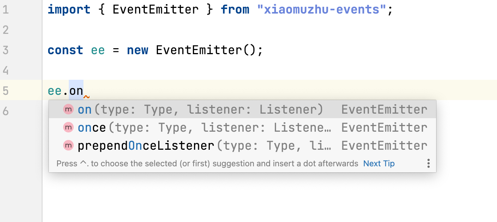

## 为纯JavaScript库编写声明文件

声明文件的编写实战。

一个没有`d.ts`声明的开源库，比较常用但却用纯js编写的库：`event`。这个库就是Node.js中`event`模块的浏览器和node通用版。具体API可见[EventEmitter](https://nodejs.org/api/events.html)。


### 搭建环节

克隆项目：

```shell
git clone https://github.com/Gozala/events.git && cd events && yarn
```

练习方便，可以先fork到自己的仓库。


### 入手

在根目录下新建一个文件`index.d.ts`，声明文件就在这里编写。

为js库编写`d.ts`需要从两方面入手，一个是官方的API文档，另一个是库的源码。

> `events` currently matches the **Node.js 11.13.0** API.

根据项目的Readme文件，可以看到`events`库的API与Node.js 11.13.0是一样的，所以可以结合Node 11.x的[文档](https://nodejs.org/docs/latest-v11.x/api/events.html)编码。

不管是API文档还是项目本身的源码，都表明主要使用的是`events`库暴露出来的一个类`EventEmitter`。

```javascript
var EventEmitter = require('events')

var ee = new EventEmitter()
ee.on('message', function (text) {
  console.log(text)
})
ee.emit('message', 'hello world')
```

因此要先声明一个类并导出：

```typescript
// index.d.ts
export class EventEmitter {}
```

然后继续查看文档，这个类暴露出了哪些方法或属性。


### 静态属性/方法

先从最简单的入手，通过文档可以看到这个类暴露出了一个`EventEmitter.defaultMaxListeners`静态属性，通常情况下一个事件最多注册10个监听器，但是我们可以通过改变`EventEmitter.defaultMaxListeners`来修改这个默认值，很显然这是个`number`类型的静态属性：

```typescript
// index.d.ts
export class EventEmitter {
    static defaultMaxListeners: number;
}
```

除此之外，该类还有一个**被废弃**的静态方法`EventEmitter.listenerCount(emitter, type)`（源码处是type，文档处是eventName），返回指定事件的监听器数量；虽然已经被废弃，但是官方没有删除此方法，因此也需要为他编写类型：

```typescript
// index.d.ts
export class EventEmitter {
    static defaultMaxListeners: number;
    static listenerCount(emitter: EventEmitter, type: string | symbol): number;
}
```


### 实例属性/方法

这个类暴露出来的实例方法多达15个，此时不要着急去编码，先观察这些方法是否有一些共同的部分，先定义出来，否则会重复写很多类型，这也是编写`d.ts`文件要注意的地方之一。

* 共同类型一：`type`，指事件的名称

  注意：`events`库中表示事件名称的参数名称与node文档中不一样，在node官方文档中是`eventName`，`events`库中的`type`就是官方文档中的`eventName`，指事件名称。

  这个`type`的类型既可以是`string`又可以是`symbol`。

* 共同类型二：`listener`，指事件回调函数，往往作为某事件触发的回调函数

可以先把这两个需要反复使用的类型声明出来：

```typescript
// index.d.ts
type Type = string | number;
type Listener = (...arg: any[]) => void;

export class EventEmitter {
    static defaultMaxListeners: number;
    static listenerCount(emitter: EventEmitter, type: Type): number;
}
```

接下来，根据文档把实例方法的类型定义出来即可：

```typescript
// index.d.ts
type Type = string | number;
type Listener = (...arg: any[]) => void;

export class EventEmitter {
    static defaultMaxListeners: number;
    static listenerCount(emitter: EventEmitter, type: Type): number;

    addListener(type: Type, listener: Listener): this;
    emit(type: Type, ...args: any[]): boolean;
    eventNames(): Array<Type>;
    getMaxListeners(): number;
    listenerCount(type: Type): number;
    listeners(type: Type): Array<Listener>;
    off(type: Type, listener: Listener): this;
    on(type: Type, listener: Listener): this;
    once(type: Type, listener: Listener): this;
    prependListener(type: Type, listener: Listener): this;
    prependOnceListener(type: Type, listener: Listener): this;
    removeAllListeners(type?: Type): this;
    removeListener(type: Type, listener: Listener): this;
    setMaxListeners(n: number): this;
    rawListeners(type:  Type): Array<Listener>;
}
```


### 使用体验

作者已经把定义好的`d.ts`连同`events`发布到了npm上，npm名称为`xiaomuzhu-events`。

可以下载`xiaomuzhu-events`包做测试：

```shell
yarn add xiaomuzhu-events
```

然后开始正常编码，可以看到有完整的类型提示和报错：



至此，声明文件就编写完毕了。


### 小结

`events`库相对比较简单。想进一步学习如何编写声明文件，可以移步[DefinitelyTyped](https://github.com/DefinitelyTyped/DefinitelyTyped)，有更多案例可以学习。