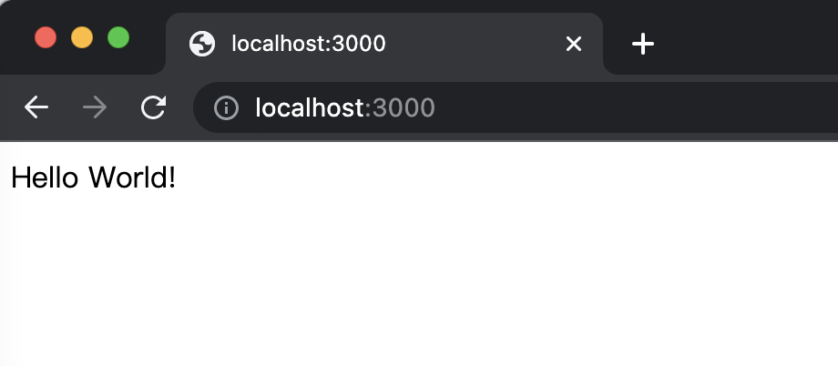
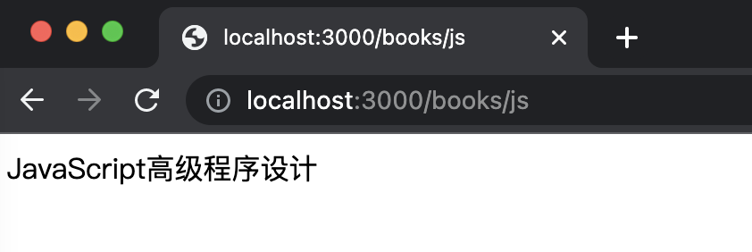
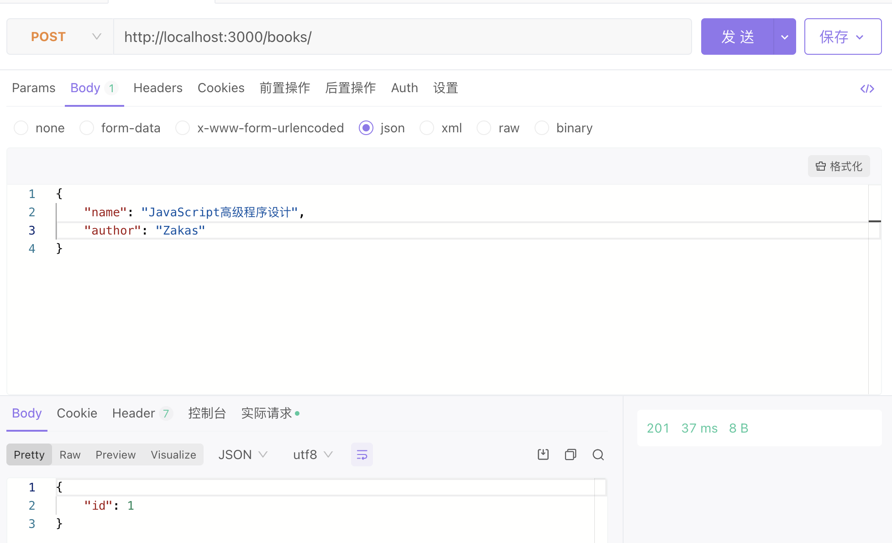
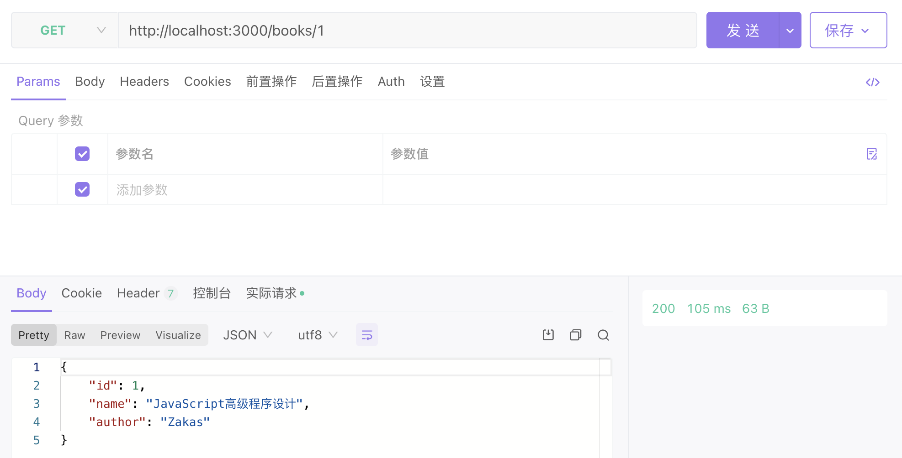

## TypeScript企业级服务器开发：实战

### Nest初始化

先在全局安装nest.js的cli，然后初始化项目：

```shell
$ yarn global add @nestjs/cli

$ nest new nest-app
⚡  We will scaffold your app in a few seconds..

CREATE nest-app/.eslintrc.js (665 bytes)
CREATE nest-app/.prettierrc (51 bytes)
CREATE nest-app/README.md (3340 bytes)
CREATE nest-app/nest-cli.json (118 bytes)
CREATE nest-app/package.json (1993 bytes)
CREATE nest-app/tsconfig.build.json (97 bytes)
CREATE nest-app/tsconfig.json (546 bytes)
CREATE nest-app/src/app.controller.spec.ts (617 bytes)
CREATE nest-app/src/app.controller.ts (274 bytes)
CREATE nest-app/src/app.module.ts (249 bytes)
CREATE nest-app/src/app.service.ts (142 bytes)
CREATE nest-app/src/main.ts (208 bytes)
CREATE nest-app/test/app.e2e-spec.ts (630 bytes)
CREATE nest-app/test/jest-e2e.json (183 bytes)

? Which package manager would you ❤️  to use? yarn
✔ Installation in progress... ☕

🚀  Successfully created project nest-app
👉  Get started with the following commands:

$ cd nest-app
$ yarn run start
```

安装完毕后，可以看到项目的初始目录结构：

```
nest-app
|-node_modules
|-src
  |-app.controller.spec.ts
  |-app.controller.ts
  |-app.module.ts
  |-app.service.ts
  |-main.ts
|-test
  |-app.e2e-spec.ts
  |-jest-e2e.json
|-.eslintrc.js
|-.gitignore
|-.prettierrc
|-nesj-cli.json
|-package.json
|-README.md
|-tsconfig.build.json
|-tsconfig.json
|-yarn.lock
```

运行`yarn start`，然后在浏览器访问`http://localhost:3000/`

```shell
$ yarn start                 
yarn run v1.22.10
$ nest start
[Nest] 78651  - 2022/10/27下午4:13:12     LOG [NestFactory] Starting Nest application...
[Nest] 78651  - 2022/10/27下午4:13:12     LOG [InstanceLoader] AppModule dependencies initialized +32ms
[Nest] 78651  - 2022/10/27下午4:13:12     LOG [RoutesResolver] AppController {/}: +4ms
[Nest] 78651  - 2022/10/27下午4:13:12     LOG [RouterExplorer] Mapped {/, GET} route +2ms
[Nest] 78651  - 2022/10/27下午4:13:12     LOG [NestApplication] Nest application successfully started +1ms
```



至此就完成一个Nest.js程序的启动了。


### Controller

Controller控制器，负责处理传入的请求，并调用对应的service完成业务处理，返回对客户端的响应。

创建一个新的controller

```shell
$ nest g co books
CREATE src/books/books.controller.spec.ts (485 bytes)
CREATE src/books/books.controller.ts (99 bytes)
UPDATE src/app.module.ts (326 bytes)
```

可以看到该条命令创建了两个文件，并修改了`app.module.ts`文件。

```typescript
// src/books/books.controller.ts
import { Controller } from '@nestjs/common';

@Controller('books')
export class BooksController {}

// src/app.module.ts
import { Module } from '@nestjs/common';
import { AppController } from './app.controller';
import { AppService } from './app.service';
import { BooksController } from './books/books.controller'; // #

@Module({
  imports: [],
  controllers: [AppController, BooksController], // 将新创建的controller注册到module中
  providers: [AppService],
})
export class AppModule {}
```

`@Controller('book')`指定了当前路由路径为`books`，可见Nest.js采用的是分散式路由。

对`books.controller.ts`文件进行改写：

```typescript
// src/books/books.controller.ts
import { Controller, Get } from '@nestjs/common';

@Controller('books')
export class BooksController {
    @Get('/js')
    findJavaScript() {
        return 'JavaScript高级程序设计'
    }
}
```

此处引入的`@Get('/js')`代表了get方法，针对`books/js`的路由进行处理。

把服务暂停，使用`yarn start:dev`再次启动项目

```shell
yarn start:dev
```

这样就不用反复重启了，每次更改都会触发项目重新编译。

访问`http://localhost:3000/books/js`路由，可以看到如下结果：



Controller可以控制处理路由，但在实际开发中这些返回的数据并不是写死的，必须在Controller中调用Service来获取数据。


### Service

用命令行生成Service

```shell
$ nest g s books 
CREATE src/books/books.service.spec.ts (453 bytes)
CREATE src/books/books.service.ts (89 bytes)
UPDATE src/app.module.ts (394 bytes)
```

依然是创建了两个文件，并修改了`app.module.ts`文件。

```typescript
// src/app.module.ts
import { Module } from '@nestjs/common';
import { AppController } from './app.controller';
import { AppService } from './app.service';
import { BooksController } from './books/books.controller';
import { BooksService } from './books/books.service'; // #

@Module({
  imports: [],
  controllers: [AppController, BooksController],
  providers: [AppService, BooksService], // #
})
export class AppModule {}

// src/books/books.service.ts
import { Injectable } from '@nestjs/common';

@Injectable()
export class BooksService {}
```

对`books.service.ts`进行改写

```typescript
// src/books/books.service.ts
import { Injectable } from '@nestjs/common';

@Injectable()
export class BooksService {
    getBooks() {
        return '本书找到了！';
    }
}
```

对`books.controller.ts`进行改写

```typescript
// src/books/books.controller.ts
import { Controller, Get } from '@nestjs/common';
import {BooksService} from "./books.service"; // #

@Controller('books')
export class BooksController {
    constructor(private readonly booksService: BooksService) {
    }

    @Get('/js')
    findJavaScript() {
        return 'JavaScript高级程序设计'
    }

    @Get('/find')
    findBook() { // #
        const res = this.booksService.getBooks();
        return res;
    }
}
```

访问`http://localhost:3000/books/find`就可以看到效果。

在`BooksController`中注入了`BooksService`，从而可以在`BooksController`调用相关的方法 `this.booksService.getBooks()`，这里就是依赖注入的运用。

但仅有Service、Controller也是不够的，我们需要一个持久化存储数据的数据库，通常情况下我们在Service与数据库之间需要加一层DAO，开发者不应该直接操纵数据库，一方面性能没有保证，另一方面不易维护，这就涉及到了TypeORM。


### TypeORM

TypeORM是一个ORM框架，在Nest.js架构中充当DAO层，我们通过操纵TypeORM来间接操纵数据库。

安装相关库，以便在Nest.js框架中使用：

```shell
$ yarn add @nestjs/typeorm typeorm mysql
```

在mysql中新建一个数据库nest-test

```mysql
mysql> create database nest_test;
Query OK, 1 row affected (0.01 sec)

mysql> use nest_test;
Database changed
mysql> show tables;
Empty set (0.00 sec)
```

添加`BooksEntity`：

```typescript
// src/entities/books.entity.ts
import { Entity, PrimaryGeneratedColumn, Column } from "typeorm";

@Entity('books')
export class BooksEntity {
    @PrimaryGeneratedColumn()
    id: number;

    @Column({ length: 20 })
    name: string;

    @Column({ length: 20 })
    author: string;
}

```

在`app.module.ts`配置`TypeOrmModule`:

```typescript
// src/app.module.ts
import { Module } from '@nestjs/common';
import {TypeOrmModule} from "@nestjs/typeorm"; // #
import { AppController } from './app.controller';
import { AppService } from './app.service';
import { BooksController } from './books/books.controller';
import { BooksService } from './books/books.service';
import {BooksEntity} from "./entities/books.entity"; // #

@Module({
  imports: [
      TypeOrmModule.forRoot({ // #
        keepConnectionAlive: true,
        type: "mysql",
        host: "localhost",
        port: 3306,
        username: "root",
        password: "yy123456",
        database: "nest_test",
        synchronize: true,
        entities: [BooksEntity]
      })
  ],
  controllers: [AppController, BooksController],
  providers: [AppService, BooksService],
})
export class AppModule {}
```

发现服务报错`ER_NOT_SUPPORTED_AUTH_MODE: Client does not support authentication protocol requested by server; consider upgrading MySQL client`，根据搜索到的[解决办法](https://blog.csdn.net/weixin_44425934/article/details/110640794)，执行以下语句：

```mysql
mysql> ALTER USER 'root'@'localhost' IDENTIFIED WITH mysql_native_password BY 'yy123456'
    -> ;
Query OK, 0 rows affected (0.16 sec)
```

成功运行后，可以看到`Entity`被映射到数据库中，新建了一张表：

```mysql
mysql> show tables;
+---------------------+
| Tables_in_nest_test |
+---------------------+
| books               |
+---------------------+
1 row in set (0.03 sec)

mysql> select * from books;
Empty set (0.03 sec)
```

**接下来就可以通过这层DAO进行数据库操作了**，修改`books.service.ts`如下：

```typescript
// src/books.service.ts
import { Injectable } from '@nestjs/common';
import { InjectRepository } from "@nestjs/typeorm"; // #
import { Repository } from "typeorm"; // #
import * as _ from 'lodash'; // #

import { BooksEntity } from "../entities/books.entity"; // #
import { CreateBooksDto } from '../dtos/books.dto"; // #

@Injectable()
export class BooksService {
    constructor( // #
        @InjectRepository(BooksEntity)
        private readonly booksRepository: Repository<BooksEntity>
    ) {
    }

    async getBooks(id: number) { // #
        return await this.booksRepository.findOneById(id);
    }

    async createBooks(books: CreateBooksDto) { // #
        const res = await this.booksRepository.save(books);

        return _.pick(res, 'id');
    }

    // getBooks() {
    //     return '本书找到了！';
    // }
}
```

需要安装几个依赖：

```shell
$ yarn add @nestjs/swagger class-validator
$ yarn add lodash 
```

需要添加`books.dto.ts`文件：

```typescript
// src/dtos/books.dto.ts
// import { ApiProperty } from '@nestjs/swagger';

import { IsString, MinLength, MaxLength } from "class-validator";

export class CreateBooksDto {
    // @ApiProperty()
    @IsString()
    @MinLength(10, { message: 'Name is too short' })
    @MaxLength(20, { message: 'Name is too long' })
    readonly name: string;

    // @ApiProperty()
    @IsString()
    readonly author: string;
}
```

这里用`@InjectRepository()`装饰器向`BooksService`注入`booksRepository`，这样就可以在`BooksService`中利用`this.booksRepository`进行DAO操作了，比如查找、删除、创建等等。

修改`books.controller.ts`内容，HTTP请求对象的内容，在大多数情况下，不必手动获取它们。可以使用专门的装饰器，比如`@Body()`或`@Param()`来自动获取。

```typescript
import { Controller, Get, Param, Post, Body } from '@nestjs/common'; // #
import {BooksService} from "./books.service";
import {CreateBooksDto} from "../dtos/books.dto"; // #

@Controller('books')
export class BooksController {
    constructor(private readonly booksService: BooksService) {
    }

    @Get('/js')
    findJavaScript() {
        return 'JavaScript高级程序设计'
    }

    // @Get('/find')
    // findBook() {
    //     const res = this.booksService.getBooks();
    //     return res;
    // }

    @Get(':id')
    findBook(@Param('id') id: number) { // #
        return this.booksService.getBooks(id);
    }

    @Post()
    async create(@Body() createBooksDto: CreateBooksDto): Promise<{ id: number }> { // #
        return await this.booksService.createBooks(createBooksDto);
    }
}
```

修改`app.module.ts`的内容：

```typescript
// src/app/module.ts
import { Module } from '@nestjs/common';
import {TypeOrmModule} from "@nestjs/typeorm";
import { AppController } from './app.controller';
import { AppService } from './app.service';
import { BooksController } from './books/books.controller';
import { BooksService } from './books/books.service';
import {BooksEntity} from "./entities/books.entity";

@Module({
  imports: [
      TypeOrmModule.forRoot({
        keepConnectionAlive: true,
        type: "mysql",
        host: "localhost",
        port: 3306,
        username: "root",
        password: "yy123456",
        database: "nest_test",
        synchronize: true,
        entities: [BooksEntity]
      }),
      TypeOrmModule.forFeature([BooksEntity]) // # 不配置会报错 Nest can't resolve dependencies of the BooksService (?). Please make sure that the argument BooksEntityRepository at index [0] is available in the AppModule context.
  ],
  controllers: [AppController, BooksController],
  providers: [AppService, BooksService],
})
export class AppModule {}
```

使用ApiFox进行测试：



传入一个json，包含书名和作者名字，用POST方法发送；返回了201创建成功的状态码，并收到了新创建的book的id，访问数据库查看：

```sql
mysql> select * from books;
+----+------------------------------+--------+
| id | name                         | author |
+----+------------------------------+--------+
|  1 | JavaScript高级程序设计         | Zakas  |
+----+------------------------------+--------+
1 row in set (0.00 sec)
```

通过接口查询id为1的书籍信息：



可以看到查询成功了。

至此简易的服务器搭建告一段落。


### 小结

基于Nest.js的服务器搭建，其分层的思想无处不在：

* 通过Controller处理路由请求
* 通过Service进行计算和数据操作
* 通过TypeORM生成DAO层，间接操作数据库

各层各司其职，通过依赖注入的方式充分解耦，这是企业级服务器开发的基本设计思想。
