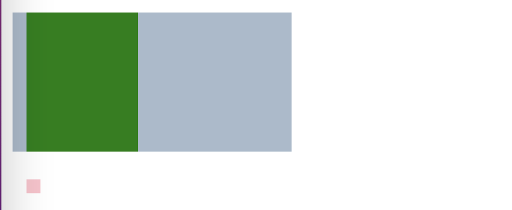
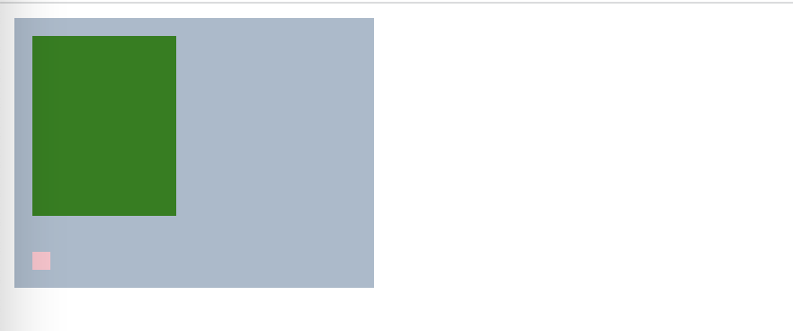
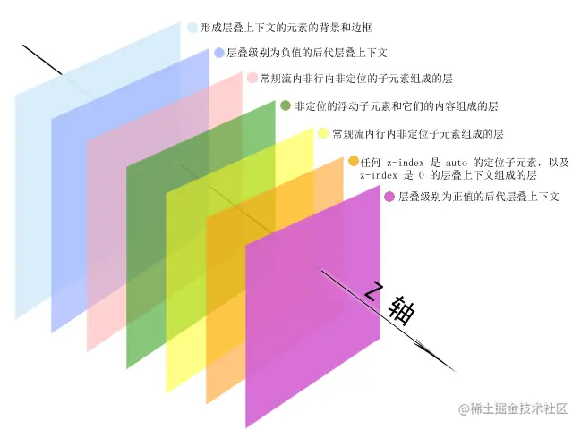

## 基础篇：盒模型

盒模型是`CSS`中最重要最核心的概念，整个概念基本上环绕整个`CSS知识体系`，所有样式与排版都围绕着它进行。

### 盒模型

又称**框模型**，指把文档节点看成一个盒子。是一种网页设计思维模型。

在`HTML文档`解析时，每个节点都会被描述为一个盒模型，然后一个盒子套进另一个盒子中，再根据各个节点相应`CSS规则`渲染为一个井井有条的网页。

#### 组成

盒模型由以下属性组成，由外到内使用公式表示：box = margin + border + padding + [content]。除了content，其余属性都包括top、right、left和bottom等扩展属性。

* margin：边距，外部透明区域，负责隔离相邻盒子
* border：边框，内部着色区域，负责隔离边距与填充，包括width、style、color三个扩展属性
* padding：填充，内部着色区域，负责扩展盒子内部尺寸
* [content]：内容，以文本或节点存在的占用位置

`padding`着色随着`background-color`而变，可用`background-clip`隔离。content不是属性，只是作为盒模型扩展理解使用。

> 理解
>
> 节点由外到内一层一层深入，通过上述公式组成一个完整的盒模型，所以在理解盒模型时记住这四个属性及其从外到内的顺序即可。

#### 类型

历史原因，盒模型分化出两种类型，分别是**标准盒模型**与**怪异盒模型**。

`CSS3`中提供一个属性用于声明盒模型的类型，即`box-sizing`。

* content-box：标准盒模型（默认）
* border-box：怪异盒模型

它不具备继承性，若全局统一盒模型，只能使用`*`声明`box-sizing`。建议使用reset.css中的声明方式。

1. 标准盒模型

   是`W3C标准`，由margin + border + padding + content 组成。与上述公式一样，节点的width/height只包括content，不包括padding/border。

   节点占据的尺寸：

   * 横向：margin-[left/right] + border-[left/right] + padding-[left/right] + width

   * 纵向：margin-[top/bottom] + border-[top/bottom] + padding-[top/bottom] + height

   节点的实际宽高：

   * 横向：width = content width
   * 纵向：height = content height

2. 怪异盒模型

   又称`IE盒子模型`，是`IE标准`，由margin + content 组成。与上述公式不一，节点的width/height包括border、padding和content。

   节点占据的尺寸：

   * 横向：margin-[left/right] + width（包含了border-[left/right] 与border-[left/right]）
   * 纵向：margin-[top/bottom] + height（包含了border-[top/bottom]与border-[top/bottom]）

   节点的实际宽高：

   * 横向：width = border + padding + content width
   * 纵向：height = border + padding + content height

   在`IE`中，若`HTML文档`缺失`<!doctype html>`声明则会触发怪异盒模型。

3. 两者区别

   两者区别在于`width/height`是否包括`border/padding`。


### 视觉格式化模型

若使用`display`对盒模型稍微加工则会进化为视觉格式化模型。

视觉格式化模型，指在视觉媒体中处理与显示文档而使用的计算规则。它是一种`CSS机制`，由大量`CSS规范`组成，规定节点在网页中的排版。

#### 块级元素

当节点的`display`声明为`block`、`list-item`、`table`、`flex`或`grid`时，该节点被标记为**块级元素**。

块级元素默认宽度为100%，在垂直方向上按顺序放置，同时参与`块格式化上下文`。

每个块级元素至少生成一个块级盒或一个块容器盒，`块级盒`描述它与兄弟节点间的表现方式，`块容器盒`描述它与子节点间的表现方式。

一个块容器盒只包含其他块级盒或行内盒。可能一段代码中存在某个块容器盒同时包含块级盒与行内盒的情况，但实质上会产生一种新的匿名块盒解决该问题。

#### 行内元素

当节点的`display`声明为`inline`、`inline-block`、`inline-table`、`inline-flex`或`inline-grid`时，该节点被标记为**行内元素**。

行内元素默认宽度为`auto`，在水平方向上按顺序放置，同时参与`行内格式化上下文`。

当块级盒参与`行内格式化上下文`后会变成`行内盒`。另外还有一个称为匿名行内盒的概念，匿名行内盒与匿名块级盒的原理类似，都是浏览器自动生成的补充性盒。

例子：使用一段代码理解匿名行内盒是如何产生的

```html
<p>
  我是<span>JowayYoung</span>，我的公众号是<span>IQ前端</span>
</p>
```

此时`我是`与`，我的公众号是`就会生成一个匿名行内盒，然后与两个`<span>`，一起处于`<p>`参与`行内格式化上下文`后的行内盒中，并保持水平排列。

#### 两者区别

* 互相转换
  * 块级元素 转换 行内元素：`display: inline`
  * 行内元素 转换 块级元素：`display: block`
* 占位表现
  * 块级元素默认独占一行，默认宽度为父节点的100%，可声明边距、填充和宽高
  * 行内元素默认不独占一行，默认宽度随内容自动撑开，可声明水平边距或填充，不可声明垂直边距（？）或宽高
* 包含关系
  * 块级元素可包含块级元素与行内元素
  * 行内元素可包含行内元素，不能包含块级元素


### 格式化上下文

指决定渲染区域内节点的排版、关系和互相作用的渲染规则。比如，网页中有一个ul及其多个子节点li，格式化上下文决定这些`li`如何排版，`li`与`li`间处于何种关系，以及`li`与`li`间如何互相影响。

**格式化上下文**有以下几种，其中**块格式化上下文**与**行内格式化上下文**最重要。

| 上下文           | 缩写 | 版本 | 声明         |
| ---------------- | ---- | ---- | ------------ |
| 块格式化上下文   | BFC  | 2    | 块级盒子容器 |
| 行内格式化上下文 | IFC  | 2    | 行内盒子容器 |
| 弹性格式化上下文 | FFC  | 3    | 弹性盒子容器 |
| 格栅格式化上下文 | GFC  | 3    | 格栅盒子容器 |

#### 块格式化上下文

`BFC`是网页中一个独立且隔离的渲染区域，容器中的子节点不会在布局中影响到外面的节点，反之亦然。

* 规则

  * 节点在垂直方向上按顺序排列
  * 节点的垂直方向距离由`margin`决定，相邻节点的`margin`会发生重叠，以最大`margin`为合并值
  * 节点的`margin-left/right`与父节点的`左边/右边`相接触，即使处于浮动也如此，除非自行形成BFC
  * `BFC`是一个隔离且不受外界影响的独立容器
  * `BFC`不会与同级浮动区域重叠
  * `BFC`在计算高度时其浮动子节点也参与计算

* 成因

  * 根节点：`html`
  * 非溢出可见节点：`overflow: !visible`
  * 浮动节点：`float: left/right`
  * 绝对定位节点：`position: absolute/fixed`
  * 被定义为块级的非块级节点：`display: inline-block/table-cell/table-caption/flex/inline-flex/grid/inline-grid`
  * 父节点与正常文档流的子节点（非浮动）自动形成`BFC`

* 应用场景

  * 清除浮动

    ```
    当父节点中存在浮动元素，且不满足其他触发BFC的条件，浮动元素就不能撑开高度，可能跑到父节点区域外部，还会影响外面的节点，为了使父节点形成BFC区域，可以设置`overflow: hidden`触发形成。
    ```

    ```html
    <!DOCTYPE html>
    <html lang="en">
    <head>
        <meta charset="UTF-8">
        <title>清除浮动</title>
        <style>
            .content {
                width: 200px;
                background-color: #aabbcc;
                overflow: hidden; /*触发BFC*/
            }
            .child1 {
                width: 80px;
                height: 100px;
                margin: 10px;
                background-color: green;
            }
            .child2 {
                float: left;
                width: 10px;
                height: 10px;
                margin: 10px;
                background-color: pink;
            }
        </style>
    </head>
    <body>
    <div class="content">
        <div class="child1"></div>
        <div class="child2"></div>
    </div>
    </body>
    </html>
    ```

    清除浮动前：

    

    清除浮动后：

    

  * 已知宽度水平居中

  * 防止浮动节点被覆盖

  * 防止垂直`margin`合并

    `margin塌陷`在排版时稍微不注意就会出现，可用`BFC`的概念回答了。所谓的塌陷其实是两个相邻盒或父子盒互相作用时产生的效果，两个盒子会取相邻边最大`margin`作为相邻边的共用`margin`。

    再补充一些`margin折叠`的计算问题：

    * 两个盒子相邻边的`margin`都为正值，取最大值
    * 两个盒子相邻边的`margin`都为负值，取最小值，两者会互相重合
    * 两个盒子相邻边的`margin`一正一负，取两者相加值，若结果为负，两者会互相重合

    ```
    为了防止两个盒子的`margin`互相作用，可将子节点或某个兄弟节点使用`BFC`区域包裹，两者的`margin`就不会叠加计算了。
    ```

#### 行内格式化上下文

`IFC`的高度由容器中最大高度的子节点的实际高度确定，不受垂直方向的`margin/padding`的影响。

另外，`IFC`中不能存在块元素，若加入块元素则会产生相应个数的匿名块并互相隔离，即产生相应个数的`IFC`，每个`IFC`对外表现为块级元素并垂直排列。

* 规则
  * 节点在水平方向上按顺序排列
  * 节点无法声明宽高，其`margin/padding`在水平方向有效在垂直方向无效
  * 节点在垂直方向上以不同形式对齐
  * 节点宽度由包括块与浮动决定，节点高度由行高决定
* 成因
  * 声明`display: inline[-x]`形成行内元素
  * 声明`line-height`
  * 声明`vertical-align`
  * 声明`font-size`

#### 弹性格式化上下文

声明`display`为`flex`或`inline-flex`时，节点会生成一个`FFC`的独立容器，主要用于响应式布局。

#### 格栅格式化上下文

声明`display`为`grid`或`inline-grid`时，节点会生成一个`GFC`的独立容器，主要用于响应式布局。

`GFC`有点像`<table>`，同为二维表格，但`GFC`有更丰富的属性来控制行列、对齐以及更为精细的渲染语义与控制。不过兼容性不是特别好。


### 文档流

指节点在排版布局时默认使用从左往右从上往下的流式排列方式。

窗体从上往下分成一行行且每行根据从左往右的顺序排列节点，其显著特性就是`从左往右从上往下`。

#### 类型

对于一个标准的文档流，可根据其特性对节点分类。

* HTML级别
  * 容器级元素：`<div>`、`<ul>`、`<li>`等
  * 文本级元素：`<a>`、`<p>`、`<span>`等
* CSS级别
  * 块级元素：div、ul、li等
  * 行内元素：a、p、span等

#### 微观现象

即使是标准的文档流，也不排除存在一些小小的缺陷，以下是三种常见缺陷：

* **空白折叠**：换行编写行内元素，排版会出现`5px`空隙
* **高矮不齐**：行内元素统一以底边垂直对齐
* **自动换行**：排版若一行无法完成则换行接着排版

解决方案：

空白折叠可能是最易出现的文档流微观现象。

例子：（Chrome好像没有？）

```html
<ul>
  <li></li>
  <li></li>
  <li></li>
</ul>
```

```css
ul {
  text-align: center;
}
li {
  display: inline-block;
}
```

此时很多浏览器就出现`5px`空隙，解决方案有多种：

1. 紧密连接节点

   ```html
   <ul>
     <li></li><li></li><li></li>
   </ul>
   ```

2. 子节点声明`margin-left: -5px;`

   ```css
   li {
     display: inline-block;
     margin-left: -5px;
   }
   ```

3. 父节点使用`flex布局`

   ```css
   ul {
     display: flex;
     justify-content: center;
   }
   ```

4. 将父节点字体大小设为0，再将子节点字体设为正常大小（？）

   ```css
   ul {
     /*...*/
     font-size: 0;
   }
   li {
     /*...*/
     font-size: 20px;
   }
   ```

#### 脱流文档流

指节点脱流正常文档流后，在正常文档流中的其他节点将忽略该节点并填补其原先空间。

节点一旦脱流，计算其父节点高度时不会将其高度纳入，脱流节点不占据空间，因此声明浮动或定位后会对周围节点布局产生或多或少的影响。

文档流的脱流有两种方式：

* 浮动布局：`float: left/right`
* 定位布局：`position: absolute/fixed`

Float方式：

节点声明`float`脱流时，会让其跳出正常文档流，其他节点会忽略该节点并填补其原先空间。

该节点的文本内容可不参与脱流效果，却会认同该节点所占据的空间并围绕它布局，这就是`文字环绕效果`的原理。

一句话概括：节点参与浮动布局后，自身脱流但其文本不脱流。

Position方式：

节点声明`position`脱流时（absolute/fixed），会让自身及其文本内容一起跳出正常文档流，其他节点会忽略该节点并填补其原先空间。

`absolute`绝对定位是相对往上遍历第一个声明position为非static的祖先节点定位，若无此节点则相对`body`定位；`fixed`固定定位是相对浏览器窗口定位，如果元素祖先的`transform`属性不是none时，则相对于该祖先。

一句话概括：节点参与定位布局后，自身及其文本一起脱流。

#### 显隐影响

在正常文档流排版时，经常会声明`display: none`与`visibility: hidden`控制节点的隐藏显示。

节点切入隐藏状态后，会存在何种差别：

* 占据空间，显隐时可过渡：`visibility: hidden`
* 占据空间，不可点击：`visibility: hidden`
* 占据空间，可点击：`opacity: 0`
* 占据空间，不可点击：`position: relative; z-index: -1;`（父节点需要设置背景？否则可以看见并选中）
* 不占据空间，可访问DOM：`display: none`
* 不占据空间，可点击：`position: absolute; opacity: 0;`
* 不占据空间，不可点击：`position: absolute; z-index: -1;`（父节点需要设置背景？否则可以看见但不能选中）


### 层叠上下文

指盒模型在三维空间`Z轴`中的表现行为。

每个盒模型存在于一个三维空间中，分别是平面画布的`X轴Y轴`与表示层叠的`Z轴`。

默认情况下，节点在网页中沿着`X轴`与`Y轴`平铺，很难察觉它们在`Z轴`中的层叠关系。节点一旦发生堆叠，最终表现就是节点间互相覆盖。

若一个节点包括层叠上下文，那它就拥有绝对的制高点，最终表现就是离屏幕观察者更近。

声明`position/z-index`可让节点生成层叠上下文。

* `z-index`只在声明定位的节点中起效
* 节点在`Z轴`的层叠顺序根据`z-index`、层叠上下文和层叠等级共同决定

#### 层叠等级

又称层叠级别，指节点在三维空间`Z轴`中的上下顺序。

在同一层叠上下文中，它描述层叠上下文节点在`Z轴`中的上下顺序；在普通节点中，它描述普通节点在`Z轴`中的上下顺序。

普通节点的层叠等级优先由其所在的层叠上下文决定，层叠等级的比较只有在当前层叠上下文中才有意义，脱离当前层叠上下文的比较就变得无意义了。

* 成因

  除了声明`position/z-index`能让节点生成层叠上下文，还有一些条件也能让节点生成层叠上下文。

  * `<html>`根节点
  * `Flex布局`中声明`z-index`不为`auto`的节点
  * `Grid布局`中声明`z-index`不为`auto`的节点
  * 声明`position: relative/absolute`与`z-index`不为`auto`的节点
  * 声明`position: fixed/sticky`的节点
  * 声明`mask/mask-image/mask-border`不为`none`的节点
  * 声明`filter`不为`none`的节点
  * 声明`mix-blend-mode`不为`normal`的节点
  * 声明`opacity`不为1的节点
  * 声明`clip-path`不为`none`的节点
  * 声明`will-change`不为`initial`的节点
  * 声明`perspective`不为`none`的节点
  * 声明`transform`不为`none`的节点
  * 声明`isolation`为`isolate`的节点
  * 声明`-webkit-overflow-scrolling`为`touch`的节点

#### 层叠顺序

指节点发生层叠时根据指定顺序规则在`Z轴`中垂直显示。

* 脱流节点的层叠顺序：

  在同一层叠上下文中，节点根据`z-index`的大小从上到下层叠，若`z-inex`一样则后面的节点层叠等级要大于前面的节点。

  脱流节点的层叠顺序看`z-inex`的大小。

* 标准流节点的层叠顺序：

  以下是层叠顺序从低到高的排列：

  * 层叠上下文的border/background
  * `z-index<0`的节点
  * 标准流内块级非定位的节点
  * 浮动非定位的节点
  * 标准流内行内非定位的节点
  * `z-index:auto/0`的节点
  * `z-index>0`的节点

  

