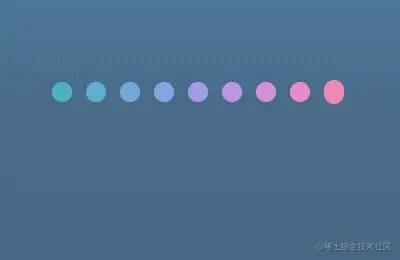
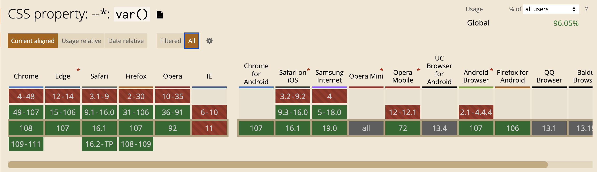

## 进阶篇：变量计算

### 变量

**CSS变量**又称**CSS自定义属性**，指可在整个文档中重复使用的值。

它由自定义属性`--var`与函数`var()`组成，`var()`用于引用自定义属性。

一个使用场景：换肤功能（主题色）

根据UI约定的规范，将需变换的颜色使用变量定义，通过`JS`批量操作这些定义好的变量即可，这也是**颜色主题切换**的一种解决方案，好处在于只需维护一套CSS代码。

```html
<button id="red-theme-btn">切换红色主题</button>
<button id="blue-theme-btn">切换蓝色主题</button>
<button id="green-theme-btn">切换绿色主题</button>
```

```javascript
["red", "blue", "green"].forEach(v => {
  const btn = document.getElementById(`${v}-theme-btn`);
  btn.addEventListener("click", () => document.body.style.setProperty("--bg-color", v));
})
```

`CSS`使用变量有如下好处：

* 减少样式代码的重复性
* 增加样式代码的扩展性
* 提高样式代码的灵活性
* 增加一种`CSS`与`JS`的通信方式
* 无需深层遍历`DOM`改变某个样式

对比`SCSS变量`与`LESS变量`的优势：

* 浏览器原生特性，无需经过任何转译可直接运行
* `DOM对象`一员，极大便利`CSS`与`JS`间的联系


### 认识

变量的规范与用法。[《CSS变量教程》](http://www.ruanyifeng.com/blog/2017/05/css-variables.html)

对变量细节的整理：

* 声明：`--变量名`
* 读取：`var(--变量名[, 默认值])`
* 类型
  * 普通：只能用作`属性值`不能用作`属性名`
  * 字符：与字符串拼接，`"Hello, "var(--name)`
  * 数值：使用`calc()`与数值单位连用，`var(--width) * 10px`
* 作用域
  * 范围：在`当前节点块作用域`及其`子节点块作用域`中有效
  * 优先级别：内联样式 > ID选择器 > 类选择器 = 伪类选择器 = 属性选择器 > 标签选择器 = 伪元素选择器 > 通配选择器 = 兄弟选择器 = 后代选择器

一样东西有使用的场景，自然有它的价值，用的人也会越来越多。


### 场景

变量有一个特别好用的场景，就是结合`List集合`使用。

#### 🌰：条形加载条

一个条形加载条通常由几根线条组成，每根线条对应一个存在不同时延的相同动画，通过时间差运行相同动画，以产生加载效果。可以把代码编写为以下形式：

```html
<ul class="strip-loading">
    <li></li>
    <li></li>
    <li></li>
    <li></li>
    <li></li>
    <li></li>
</ul>
```

```scss
.strip-loading {
  display: flex;
  justify-content: center;
  align-items: center;
  width: 200px;
  height: 200px;
  li {
    list-style-type: none;
    border-radius: 3px;
    width: 6px;
    height: 30px;
    background-color: #ff6666;
    animation: beat 1s ease-in-out infinite;
    & + li {
      margin-left: 5px;
    }
    &:nth-child(2) {
      animation-delay: 200ms;
    }
    &:nth-child(3) {
      animation-delay: 400ms;
    }
    &:nth-child(4) {
      animation-delay: 600ms;
    }
    &:nth-child(5) {
      animation-delay: 800ms;
    }
    &:nth-child(6) {
      animation-delay: 1s;
    }
  }
}
@keyframes beat {
  0%,
  100% {
    transform: scaleY(1);
  }
  50% {
    transform: scaleY(.5);
  }
}
```

分析可知，每个`li`只是`animation-delay`不同，其余代码完全相同。显然这种方式不灵活也不易于封装成组件，若能像`JS`那样封装为一个函数并根据参数输出不同样式效果，就很棒了；此时就可以用上变量。

`HTML部分`的修改，让每个`li`拥有一个自己作用域中的变量。对于`CSS部分`的修改，分析哪些属性是随着`index`递增而发生规律变化的，对规律变化的部分使用变量表达式代替。

```html
<ul class="strip-loading">
    <li style="--line-index: 0;"></li>
    <li style="--line-index: 1;"></li>
    <li style="--line-index: 2;"></li>
    <li style="--line-index: 3;"></li>
    <li style="--line-index: 4;"></li>
    <li style="--line-index: 5;"></li>
</ul>
```

```scss
.strip-loading {
  display: flex;
  justify-content: center;
  align-items: center;
  width: 200px;
  height: 200px;
  li {
    list-style-type: none;
    border-radius: 3px;
    width: 6px;
    height: 30px;
    background-color: #ff6666;
    --time: calc(var(--line-index) * 200ms);
    animation: beat 1s ease-in-out var(--time) infinite;
    & + li {
      margin-left: 5px;
    }
  }
}

@keyframes beat {
  0%,
  100% {
    transform: scaleY(1);
  }
  50% {
    transform: scaleY(.5);
  }
}
```

变量`--line-index`与`--time`使每个`li`拥有一个属于自己的作用域。

这就是变量的作用范围所致（在`当前节点块作用域`及其`子节点块作用域中`有效），因此在`.strip-loading`的块作用域中调用`--line-index`是无效的。

对于那些含有`List集合`越多的场景，效果就越明显。这样处理更美观更易维护，比如更方便调整线条的时间差。

#### 🌰：心形加载条

掘金的`陈大鱼头兄`的心形加载条。



通过动图分析，发现每条线条的背景颜色与动画时延不同，另外动画运行时的高度也不同。仔细看可以发现，第一条与第九条的高度一样，第二条与第八条的高度一样，依次类推，得到`高度变换相同类`的公式：对称index = 总数 + 1 - index。

背景颜色使用滤镜的色相旋转`hue-rotate()`，目的是为了使颜色过渡得更自然；动画时延与上述条形加载条一样。

以下是实现代码：

```html
<div class="heart-loading">
    <ul style="--line-count: 9;">
        <li class="line-1" style="--line-index: 1;"></li>
        <li class="line-2" style="--line-index: 2;"></li>
        <li class="line-3" style="--line-index: 3;"></li>
        <li class="line-4" style="--line-index: 4;"></li>
        <li class="line-5" style="--line-index: 5;"></li>
        <li class="line-6" style="--line-index: 6;"></li>
        <li class="line-7" style="--line-index: 7;"></li>
        <li class="line-8" style="--line-index: 8;"></li>
        <li class="line-9" style="--line-index: 9;"></li>
    </ul>
</div>
```

```scss
.heart-loading {
  display: flex;
  justify-content: center;
  align-items: center;
  width: 200px;
  height: 200px;

  ul {
    display: flex;
    justify-content: space-between;
    width: 150px;
    height: 10px;

    li {
      --angle: calc(var(--line-index) / var(--line-count) * .5turn);
      --time: calc((var(--line-index) - 1) * 40ms);
      list-style-type: none;
      border-radius: 5px;
      width: 10px;
      height: 10px;
      background-color: #3c9;
      filter: hue-rotate(var(--angle));
      animation-duration: 1s;
      animation-delay: var(--time);
      animation-iteration-count: infinite;
      &.line-1,
      &.line-9 {
        animation-name: beat-1;
      }
      &.line-2,
      &.line-8 {
        animation-name: beat-2;
      }
      &.line-3,
      &.line-7 {
        animation-name: beat-3;
      }
      &.line-4,
      &.line-6 {
        animation-name: beat-4;
      }
      &.line-5 {
        animation-name: beat-5;
      }
    }
  }
}

@keyframes beat-1 {
  0%,
 10%,
 90%,
100% {
    height: 10px;
  }
  45%,
  55% {
    height: 30px;
    transform: translate3d(0, -15px, 0);
  }
}
@keyframes beat-2 {
  0%,
 10%,
 90%,
100% {
    height: 10px;
  }
  45%,
  55% {
    height: 60px;
    transform: translate3d(0, -30px, 0);
  }
}
@keyframes beat-3 {
  0%,
 10%,
 90%,
100% {
    height: 10px;
  }
  45%,
  55% {
    height: 80px;
    transform: translate3d(0, -40px, 0);
  }
}
@keyframes beat-4 {
  0%,
 10%,
 90%,
100% {
    height: 10px;
  }
  45%,
  55% {
    height: 90px;
    transform: translate3d(0, -30px, 0);
  }
}
@keyframes beat-5 {
  0%,
 10%,
 90%,
100% {
    height: 10px;
  }
  45%,
  55% {
    height: 90px;
    transform: translate3d(0, -20px, 0);
  }
}
```

可以看到相似的效果，但颜色、波动曲线和跳动频率有点不同。

#### 🌰：标签导航

前两例演示了变量在`CSS`中的应用以及一些妙用技巧，现在演示变量在`JS`中的应用。

JS中有三个操作变量的API：

* 读取变量：elem.style.getPropertyValue()
* 设置变量：elem.style.setProperty()
* 删除变量：elem.style.removeProperty()

本例主要是使用变量标记`每个标签的背景颜色`与`切换标签的显示状态`。

```html
<div class="tab-navbar">
    <nav>
        <label class="active">标题1</label>
        <label>标题2</label>
        <label>标题3</label>
        <label>标题4</label>
    </nav>
    <main>
        <ul style="--tab-count: 4;">
            <li style="--bg-color: #f66;">内容1</li>
            <li style="--bg-color: #66f;">内容2</li>
            <li style="--bg-color: #f90;">内容3</li>
            <li style="--bg-color: #09f;">内容4</li>
        </ul>
    </main>
</div>
```

```scss
.tab-navbar {
  display: flex;
  overflow: hidden;
  flex-direction: column-reverse;
  border-radius: 10px;
  width: 300px;
  height: 400px;
  nav {
    display: flex;
    height: 40px;
    line-height: 40px;
    text-align: center;
    background-color: #f0f0f0;
    label {
      flex: 1;
      cursor: pointer;
      transition: all 300ms;
      &.active {
        background-color: #3c9;
        color: #fff;
      }
    }
  }
  main {
    flex: 1;
    ul {
      margin: 0;
      padding: 0;
      --tab-index: 0;
      --tab-width: calc(var(--tab-count) * 100%);
      --tab-move: calc(var(--tab-index) / var(--tab-count) * -100%);
      display: flex;
      flex-wrap: nowrap;
      width: var(--tab-width);
      height: 100%;
      transform: translate3d(var(--tab-move), 0, 0);
      transition: all 300ms;
    }
    li {
      display: flex;
      justify-content: center;
      align-items: center;
      flex: 1;
      background-color: var(--bg-color);
      font-weight: bold;
      font-size: 20px;
      color: #fff;
    }
  }
}
```

```html
<script>
    const navs = document.querySelectorAll('.tab-navbar nav label');
    const tabs = document.querySelector('.tab-navbar main ul');
    navs.forEach((n, i) => n.addEventListener("click", e => {
        navs.forEach(v => v.classList[v === e.target ? "add" : "remove"]("active"));
        tabs.style.setProperty("--tab-index", i);
    }))
</script>
```

在`<ul>`中定义`--tab-index`表示标签当前的索引，当点击按钮时重置`--tab-index`的值，可实现移动`<ul>`的位置显示指定标签；可移动`<ul>`是因为定义了`--tab-move`，通过`calc()`计算`--tab-index`与`--tab-move`的关系，以操控`transform: translate3d()`移动`<ul>`。

另外，在`<li>`中定义`--bg-color`表示标签的背景颜色，也是一种简洁的模板赋值方式，总比写`<li :stlye="backgroundColor: ${color}">`要好看。若多个属性依赖一个变量赋值，那使用变量赋值到`style`中就更方便了，那些属性可在`css文件`中计算与赋值，这样可帮助`JS`分担一些属性计算工作。

#### 🌰：悬浮跟踪按钮

思路很简单，先对按钮布局与着色，然后使用伪元素标记鼠标的位置，定义`--x`与`--y`表示伪元素在按钮中的坐标，通过`JS`获取鼠标在按钮中的`offsetX`与`offsetY`分别赋值给`--x`与`--y`，再对伪元素添加径向渐变的背景颜色，大功告成，一个酷炫的鼠标悬浮跟踪效果就这样诞生了。

```html
<a href="javascript: void(0);" class="track-btn">
    <span>妙用CSS变量，让你的CSS变得更心动</span>
</a>
```

```scss
.track-btn {
  overflow: hidden;
  display: inline-block; /* reset */
  text-decoration: none; /* reset */
  position: relative;
  border-radius: 25px;
  width: 400px;
  height: 50px;
  background-color: #66f;
  cursor: pointer;
  line-height: 50px;
  text-align: center;
  font-weight: bold;
  font-size: 18px;
  color: #fff;

  span {
    position: relative; // 形成层叠上下文
    pointer-events: none; // 不加会卡顿，好像没什么感觉
  }

  &::before {
    --size: 0;
    position: absolute;
    left: var(--x);
    top: var(--y);
    width: var(--size);
    height: var(--size);
    background-image: radial-gradient(circle closest-side, #09f, transparent);
    content: "";
    transform: translate3d(-50%, -50%, 0);
    transition: width ease 200ms, height ease 200ms;
  }

  &:hover::before {
    --size: 400px;
  }
}
```

```html
<script>
    const btn = document.querySelector('.track-btn');
    const btnStyle = btn.style;
    btn.addEventListener("mousemove", e => {
        btnStyle.setProperty("--x", `${e.offsetX}px`);
        btnStyle.setProperty("--y", `${e.offsetY}px`);
    })
</script>
```

可结合`鼠标事件`完成更多的酷炫效果，例如动画关联、事件响应等操作。发挥想象力！

#### 🌰：悬浮视差按钮

`CodePen`中的一个示例，[悬浮视差按钮](https://codepen.io/electerious/pen/MjZPVe)，具体代码涉及一些`3D变换`的知识。

```html
<div class="var-box">
    <a href="javascript: void(0);" class="parallel-btn" data-name="妙用CSS变量，让你的CSS变得更心动"></a>
</div>
```

```scss
.var-box {
  transform: perspective(800px);
  transform-style: preserve-3d;

  .parallel-btn {
    display: inline-block;
    position: relative;
    width: 400px;
    height: 50px;
    line-height: 50px;
    user-select: none;
    text-align: center;
    font-size: 18px;
    color: #fff;
    &::before {
      position: absolute;
      content: "";
      top: 0;
      right: 0;
      bottom: 0;
      left: 0;
      border-radius: 4px;
      background-image: linear-gradient(135deg, #6e8efb, #a777e3);
      box-shadow: 0 2px 5px rgba(#000, .2);
      will-change: transform;
      transform: /*translateY(var(--ty, 0))*/ rotateX(var(--rx, 0)) rotateY(var(--ry, 0)) translateZ(var(--tz, -12px));
      transition: box-shadow 500ms ease, transform 200ms ease;
    }
    &::after {
      position: relative;
      display: inline-block;
      font-weight: bold;
      content: attr(data-name);
      will-change: transform;
      transform: /*translateY(var(--ty, 0))*/ rotateX(var(--rx, 0)) rotateY(var(--ry, 0));
      transition: transform 200ms ease;
    }
    &:hover::before {
      box-shadow: 0 5px 15px rgba(#000, .3);
    }
  }
}
```

```html
<script>
    const pbtn = document.querySelector('.parallel-btn');
    const pbtnStyle = pbtn.style;
    const pbtnRect = pbtn.getBoundingClientRect();
    pbtn.addEventListener("mousemove", e => {
        const dx = e.offsetX - pbtnRect.width / 2; // offsetX:鼠标坐标到元素的左侧的距离
        const dy = e.offsetY - pbtnRect.height / 2; // offsetY:鼠标坐标到元素的顶侧的距离
        pbtnStyle.setProperty("--rx", `${dy / -1}deg`);
        pbtnStyle.setProperty("--ry", `${dx / 10}deg`);
    });
    pbtn.addEventListener("mouseup", e => {
        pbtnStyle.setProperty("--tz", "-12px");
    });
    pbtn.addEventListener("mousedown", e => {
        pbtnStyle.setProperty("--tz", "-25px");
    });
    pbtn.addEventListener("mouseleave", e => {
        pbtnStyle.setProperty("--rx", `0`);
        pbtnStyle.setProperty("--ry", `0`);
        pbtnStyle.setProperty("--ty", `0`);
    });
</script>
```


### 兼容

现代浏览器中，变量的兼容性还是挺好的。现在各大浏览器厂商快速迭代，产品对于用户体验来说占了很大比重，因此在条件允许的情况下还是大胆尝新，不要被一些过去的所谓的规范约束着。

若一个产品的用户体验受限于远古浏览器的压制，相信该产品也不会走得很远。

完成一个产品时，不仅是为了完成工作任务，若在保证进度的同时能花点心思点缀，可能会有意外的收获。

其实多多思考，就能把变量用在很多场景中。

#### 彩蛋：一个暖心彩虹色调搭配的爱心点赞按钮

```html
<button class="like-btn">
    <div class="like-wrapper">
        <div class="like-ripple"></div>
        <svg class="like-heart" width="24" height="24" viewBox="0 0 24 24">
            <path d="M12,21.35L10.55,20.03C5.4,15.36 2,12.27 2,8.5C2,5.41 4.42,3 7.5,3C9.24,3 10.91,3.81 12,5.08C13.09,3.81 14.76,3 16.5,3C19.58,3 22,5.41 22,8.5C22,12.27 18.6,15.36 13.45,20.03L12,21.35Z"></path>
        </svg>
        <div class="like-article" style="--line-count: 6;">
            <div class="like-article-item" style="--line-index: 1;"></div>
            <div class="like-article-item" style="--line-index: 2;"></div>
            <div class="like-article-item" style="--line-index: 3;"></div>
            <div class="like-article-item" style="--line-index: 4;"></div>
            <div class="like-article-item" style="--line-index: 5;"></div>
            <div class="like-article-item" style="--line-index: 6;"></div>
        </div>
    </div>
</button>
```

```scss
$heart-color: #f66;
$easing: cubic-bezier(.7, 0, .3, 1);
$duration: 500ms;
.like-btn {
  position: relative;
  z-index: 1;
  border: none;
  border-radius: 100%;
  width: 1em;
  height: 1em;
  appearance: none;
  background-color: #fff;
  cursor: pointer;
  font-size: 200px;
  transition: all $duration $easing;
  &::before {
    position: absolute;
    top: 0;
    left: 0;
    z-index: -1;
    border-radius: inherit;
    width: 100%;
    height: 100%;
    box-shadow: 0 .3em .6em rgba(#000, .3);
    content: "";
    transition: inherit;
  }
  &::after {
    position: absolute;
    top: 0;
    left: 0;
    z-index: -1;
    border-radius: inherit;
    width: 100%;
    height: 100%;
    background-color: #fff;
    content: "";
  }
  &:active::before {
    animation: depress-shadow $duration $easing both;
  }
  &:focus::after {
    animation: depress $duration $easing both;
  }
}
.like-wrapper {
  display: grid;
  justify-content: center;
  align-items: center;
  > *{
    grid-area: 1/1;
    margin: auto;
  }
}
.like-ripple {
  overflow: hidden;
  position: relative;
  border-radius: 100%;
  width: 1em;
  height: 1em;
  &::before {
    position: absolute;
    top: 0;
    left: 0;
    border: .4em solid $heart-color;
    border-radius: inherit;
    width: 100%;
    height: 100%;
    content: "";
    transform: scale(0);
  }
  .like-btn:focus & {
    &::before {
      animation: ripple-out $duration $easing;
    }
  }
}
.like-heart {
  display: block;
  width: .5em;
  height: .5em;
  transform-origin: center 80%;
  path {
    transition: all $duration $easing;
    stroke: $heart-color;
    stroke-width: 2;
    fill: transparent;
    .like-btn:focus & {
      fill: $heart-color;
    }
  }
  .like-btn:focus & {
    animation: heart-bounce $duration $easing;
  }
}
.like-article {
  position: relative;
  width: 1px;
  height: 1px;
}
.like-article-item {
  --angle: calc(var(--line-index) / var(--line-count) * 1turn);
  $color-list: #f66 #66f #f90 #09f #9c3 #3c9;
  position: absolute;
  top: 0;
  left: 0;
  border-radius: .05em;
  width: .1em;
  height: .1em;
  transform: translate(-50%, -50%) rotate(var(--angle)) translateY(0) scaleY(0);
  transition: all $duration $easing;
  @each $v in $color-list {
    $index: index($color-list, $v);
    &:nth-child(#{$index}) {
      background-color: $v;
    }
  }
  .like-btn:focus & {
    animation: particle-out calc(#{$duration} * 1.2) $easing forwards;
  }
}
.like-btn:focus {
  cursor: normal;
  pointer-events: none;
}
@keyframes depress {
  0%,
100% {
    transform: none;
  }
  50% {
    transform: translateY(5%) scale(.9);
  }
}
@keyframes depress-shadow {
  0%,
100% {
    transform: none;
  }
  50% {
    transform: scale(.5);
  }
}
@keyframes heart-bounce {
  0%,
 80%,
100% {
    transform: scale(1);
  }
  40% {
    transform: scale(.7);
  }
}
@keyframes particle-out {
  50% {
    height: .3em;
    transform: translate(-50%, -50%) rotate(var(--angle)) translateY(.8em) scale(1);
  }
  60% {
    height: .2em;
    transform: translate(-50%, -50%) rotate(var(--angle)) translateY(.8em) scale(1);
  }
  100% {
    transform: translate(-50%, -50%) rotate(var(--angle)) translateY(1em) scale(0);
  }
}
@keyframes ripple-out {
  from {
    transform: scale(0);
  }
  to {
    transform: scale(5);
  }
}
```
