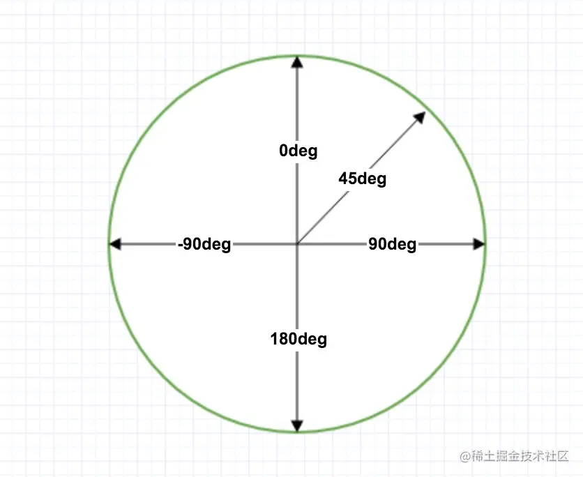
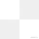
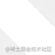

## 技巧篇：背景与遮罩

`background`是使用最多的属性之一，`mask`是使用最少的属性之一。

但它们的格式与用法很多都相似，作用效果也相似，是少有的兄弟属性。

另外，`margin`与`padding`也是一对兄弟属性。

### 属性连写

`background`包括着众多子属性，这些子属性可拆开声明也可合并声明。（个人编码习惯）

合并声明有一个标准称呼，**属性连写**。

`background`包括以下子属性，很多`mask`子属性也与`background`相似。

* background-color：背景颜色
* background-image：背景图像
* background-repeat：背景图像平铺方式
* background-attachment：背景图像依附方式
* background-position：背景图像起始位置
* background-size：背景图像尺寸模式
* background-origin：定位区域
* background-clip：绘制区域
* background-blend-mode：混合模式

除了`background`，以下属性也包括众多子属性，它们单独声明也能代替单个子属性声明。例如`padding-top: 10px`等价于`padding: 10px x x x`。

* margin
* padding
* border
* outline
* mask
* font
* transition
* animation

最常使用的`background`，建议只声明一个子属性时使用简写，声明两个或以上子属性时使用连写。这样是为了规范代码，增加代码的可读性。

```css
/* 简写 */
.elem {
  background-color: #f66;
  background-image: url("./img.png");
  background-repeat: no-repeat;
  background-position: center;
  background-size: 100px 100px;
}
/* 连写 */
.elem {
  background: #f66 url("./img.png") no-repeat center/100px 100px;
}
```

最早`background`只有`color`、`image`、`repeat`、`attachment`和`position`这五个子属性，CSS3发布后增加`size`、`origin`和`clip`三个子属性，而position和size都能使用长度单位作为值，连写时就无法区分两者的位置了，所以使用`/`将两者衔接起来，前面是position，后面是size。

通用格式是`position/size`。若声明`background: #f66 100px 100px`，此时则`100px 100px`是position。

属性连写的好处是比单个子属性声明要简洁得多，少写很多代码。`CSS2`推荐的一条子属性连写顺序规则。

```css
background: color image repeat attachment position/size;
```

`origin`与`clip`不能加入到属性连写中，因为其取值一样，有些浏览器无法区分它们的取值。

若某些值缺省则往前补充即可。连写顺序无强制标准。

`mask`子属性连写顺序与`background`子属性连写顺序一样。


### 背景background

`background`包括九个子属性，每个子属性可能的取值如下：

* background-color：背景颜色
  * transparent：透明（**默认**）
  * keyword：颜色关键字
  * hex：十六进制色彩模式
  * rgb/rgba：rgb/a色彩模式
  * hsl/hsla：hsl/a色彩模式
  * color1/color2：覆盖颜色，背景颜色可能是color1，若背景图像无效则使用color2代替color1
* background-image：图像
  * none：无图像（**默认**）
  * url()：图像路径
  * 渐变色：通过函数生成的图像
* background-repeat：图像平铺方式
  * repeat：图像在水平方向与垂直方向重复（**默认**）
  * repeat-x：图像在水平方向重复
  * repeat-y：图像在垂直方向重复
  * no-repeat：图像仅重复一次
  * space：图像以相同间距平铺且填充整个节点
  * round：图像自动缩放直到适应且填充整个节点（图像无裁切且重复的图像间无间距）
* background-attachment：图像依附方式
  * scroll：图像随网页滚动而移动（**默认**）
  * fixed：图像不会随网页滚动而移动
* background-position：图像起始位置
  * position：位置，可用任何长度单位，第二个位置（Y轴）不声明默认是`50%`（默认 `0% 0%`）
  * keyword：位置关键字`left/right/top/bottom/center`，可单双使用，第二个关键字不声明默认是center
* background-size：图像尺寸模式
  * auto：自动设置尺寸（**默认**）
  * cover：图像扩展至足够大（？），使其完全覆盖整个区域，图像某些部分可能无法显示在区域内
  * contain：图像扩展至最大尺寸，使其宽度与高度完全适应整个区域
  * size：尺寸，可用任何长度单位，第二个尺寸（高）不声明默认是auto
* background-origin：定位区域（与background-position结合使用）
  * padding-box：图像相对填充定位（**默认**）
  * border-box：图像相对边框定位
  * content-box：图像相对内容定位
* background-clip：绘制区域
  * border-box：图像被裁剪到边框与边距的交界处（**默认**）
  * padding-box：图像被裁剪到填充与边框的交界处
  * content-box：图像被裁剪到内容与填充的交界处
  * text*：webkit内核
* background-blend-mode：混合模式
  * normal：正常（**默认**）
  * color-burn：颜色加深
  * color-dodge：颜色减淡
  * color：颜色
  * darken：变暗
  * lighten：变亮
  * difference：差值
  * exclusion：排除
  * hard-light：强光
  * hue：色相
  * luminosity：亮度
  * multiply：正片叠底
  * overlay：叠加
  * saturation：饱和度
  * screen：滤色
  * soft-light：柔光

总体来说`background`简单易用，以下几点可能需要注意：

* repeat与position包括后缀`-x`与`-y`这两个子属性，若单独声明时使用相应`-x`或`-y`
* position的x与y允许负值，当x为正值向右负值向左，当y为正值向下负值向上
* background声明多个图像路径时，若不声明position，则首个图像定位在节点最顶部，剩余图像依次顺序显示
* 对于兼容性较低的浏览器，size不能在background中连写，需单独编写

#### 贴顶背景

背景图像贴着最顶部且水平居中显示，不管屏幕怎么拉伸都始终保持在最顶部最中间。

🌰：

```html
<div class="pasted-bg">Background</div>
```

```scss
$bg: "https://jowayyoung.github.io/static/img/icss/mountain.jpg";
.pasted-bg {
  display: flex;
  justify-content: center;
  align-items: center;
  width: 100%;
  height: 300px;
  background: #000 url($bg) no-repeat center top/auto 300px;
  text-shadow: 2px 2px 5px rgba(#000, .5);
  font-weight: bold;
  font-size: 50px;
  color: #fff;
}
```

该需求通常都会定死高度，声明`background-size: auto 300px`让背景图像高度跟节点高度一样但宽度自适应，千万别写死100%，这样在浏览器窗口变化时就会让背景图像变形了。

声明`background-position: center top`是为了让背景图像水平居中且贴着最顶部，无论浏览器窗口如何变化都始终保持该定位。

#### 多重背景

CSS3除了增加size、origin和clip三个子属性，还增加了多重背景的强大功能。

多重背景可从上到下从左到右拼接背景图像，也可叠加背景图像。

🌰：

```html
<div class="spliced-bg"></div>
<div class="overlying-bg"></div>
```

```scss
$bg-1: "https://jowayyoung.github.io/static/img/icss/ab-1.jpg";
$bg-2: "https://jowayyoung.github.io/static/img/icss/ab-2.jpg";
$bg-3: "https://jowayyoung.github.io/static/img/icss/mountain.jpg";
$bg-4: "https://jowayyoung.github.io/static/img/icss/logo.svg";
.spliced-bg {
  width: 300px;
  height: 200px;
  background-color: #3c9;
  background-image: url($bg-1), url($bg-2);
  background-repeat: no-repeat, no-repeat;
  background-position: left, right;
  background-size: auto 200px, auto 200px;
}
.overlying-bg {
  margin-top: 20px;
  width: 300px;
  height: 200px;
  background-color: #3c9;
  background-image: url($bg-4), url($bg-3);
  background-position: left, center;
  background-repeat: repeat, no-repeat;
  background-size: auto 80px, auto 200px;
}
```

声明顺序靠前的背景图像的层叠等级较高，叠加背景图像时，靠前的背景图像尽量使用`png`格式才能让靠后的背景图像显示，否则可能遮挡靠后的背景图像。

#### 镂空文本

`background-clip`是一个很巧妙的属性，除了专有的三个取值，在`webkit内核`中还可裁剪到文本与内容的交界处，也就是说背景只作用于文本中。

有了`background-clip: text`，再结合`text-shadow`绘制文本阴影，让文字变得更立体更动感。

🌰：

```html
<div class="hollow-text">Background</div>
```

```scss
$bg-clip: "https://jowayyoung.github.io/static/img/icss/mountain.jpg";
.hollow-text {
  display: flex;
  justify-content: center;
  align-items: center;
  height: 200px;
  background: #000 url($bg-clip) no-repeat center top/auto 300px;
  -webkit-background-clip: text;
  background-clip: text;
  text-shadow: 2px 2px 5px rgba(#000, .5);
  font-weight: bold;
  font-size: 80px;
  color: transparent;
}
```

#### 渐变

设计师都是通过`图形软件`设计这些渐变效果，然后以图像的形式被前端开发者应用到网页中。

**渐变**指两种或多种颜色在指定区域内平滑过渡的效果。曾经渲染带有渐变的背景只能使用图像实现，如今`CSS3`增加了以下渐变函数，让代码渲染渐变成为可能。

* linear-gradient()：线性渐变
* radial-gradient()：径向渐变
* conic-gradient()：锥形渐变
* repeating-linear-gradient()：重复线性渐变
* repeating-radial-gradient()：重复径向渐变
* repeating-conic-gradient()：重复锥形渐变

重点讲述前三种，`repeating-*`是在原有函数的基础上延伸

CSS渐变分为三种，每种都有自身的特性。

* 线性渐变：沿着指定方向从起点到终点逐渐改变颜色，渐变形状是一条`直线`
* 径向渐变：沿着任意方向从圆心往外面逐渐改变颜色，渐变形状是一个`圆形`或`椭圆形`
* 锥形渐变：沿着顺时针方向从圆心往外面逐渐改变颜色，渐变形状是一个`圆锥体`

每个**渐变函数**都必须在`background`或`background-image`中使用，可认为`gradient()`就是一个图像，只不过是通过函数生成的图像。

##### 1. 线性渐变

最简单的渐变，以`直线`的方式向指定方向扩散，使用频率很高，是渐变函数中最好用的函数。其使用语法如下：

```css
background-image: linear-gradient(direction, color-stop);
```

* direction：方向
  * keyword：方向关键字`to left/right/top/bottom/top left/top right/bottom left/bottom right`（默认` to bottom`）
  * angle：角度，以顺时针方向的垂直线与渐变线的夹角计算，超出n圈则计算剩余角度
* color-stop：色标
  * color：颜色，可参考background-color取值，在指定位置产生渐变效果所使用的颜色
  * position：位置，可参考background-position的position取值，在指定位置产生渐变效果

用例：

```css
.elem {
  width: 400px;
  height: 200px;
  background-image: linear-gradient(to bottom, #f66, #66f);
  /* 等价于 */
  background-image: linear-gradient(to bottom, #f66 0, #66f 100%);
}
```

`color-stop()`在指定位置使用指定颜色，可用多个色标，其连写方式如下。第一个值为`color`，第二个值为`position`，形式如`#f66 30%`，若第二个值不声明则浏览器会自动分配位置。

```css
.elem {
  background-image: linear-gradient(to bottom, #f66 0, #66f 20%, #f90 40%, #09f 60%, #9c3 80%, #3c9 100%);
}
```

线性渐变的方向，若`direction`缺省则默认从上到下，也就是参数默认值`to bottom`。

不要使用单独的方向关键字，如left、right、top、bottom等，因为Safari相对其他浏览器对这些单独的方向关键字的解释可能会不同。

以下是角度演示图。



* 0deg：to top
* 90deg：to right
* 180deg：to bottom
* 270deg（-90deg）：to left

其实CSS的方向顺序都是符合**上右下左**的规则，若跟方向有关的声明都可联想到该规则。

##### 2. 径向渐变

以圆形或椭圆形的方式向任意方向扩散。参数有点奇葩，但解构其参数后使用起来也很方便，其使用语法如下：

```css
background-image: radial-gradient(shape size at position, color-stop);
```

* shape：形状
  * ellipse：椭圆形（**默认**）
  * circle：圆形
* size：尺寸（渐变的半径？容器剩余空间使用最后的color填充？）
  * farthest-corner：从圆心到离圆心最远的角为半径（**默认**）
  * farthest-side：从圆心到离圆心最远的边为半径
  * closest-corner：从圆心到离圆心最近的角为半径
  * closest-side：从圆心到离圆心最近的边为半径
  * size：尺寸，可用任何长度单位，宽与高必须同时声明
* position：位置
  * keyword：位置关键字left/right/top/bottom/center（默认center）
  * position：位置，可用任何长度单位
* color-stop：色标
  * color：颜色，可参考background-color取值，在指定位置产生渐变效果所使用的颜色
  * position：位置，可参考background-position的position取值，在指定位置产生渐变效果

用例：

```css
.elem {
  width: 400px;
  height: 200px;
  background-image: radial-gradient(100px 100px, #f66, #66f);
  /* 等价于 */
  background-image: radial-gradient(ellipse 100px 100px at center, #f66, #66f);
  /* 等价于 */
  background-image: radial-gradient(circle 100px at center, #f66, #66f);
}
```

径向渐变的`color-stop()`与线性渐变的`color-stop()`完全一样。

##### 3. 锥形渐变

更新潮，以`圆锥体`的方式向顺时针方向扩散，产生的渐变效果就像**俯视**圆锥体的顶部。

兼容性较差。使用语法如下：

```css
background-image: conic-gradient(color-stop);
```

* color-stop：色标
  * color：颜色，可参考background-color取值，在指定位置产生渐变效果所使用的颜色
  * position：位置，可参考background-position的position取值，在指定位置产生渐变效果

锥形渐变确实无参数用于声明方向，其渐变的起始位置是垂直线与向上方向的夹角（可参照上述线性渐变的0deg），再沿着顺时针方向旋转产生渐变效果。

用例：

```css
.elem {
  width: 400px;
  height: 200px;
  background-image: conic-gradient(#f66, #66f);
  /* 等价于 */
  background-image: conic-gradient(#f66 0, #66f 100%);
}
```

锥形渐变的`color-stop()`与线性渐变的`color-stop()`完全一样。

##### 🌰：渐变背景

声明linear-gradient()产生从左上角往右下角的渐变效果，将背景定位在左边，通过animation控制背景定位左右徘徊产生动态的渐变背景。

一种障眼法，好比在电视机前看电视，电视机不动，但镜头却一直在移动。

```html
<div class="gradient-bg">iCSS</div>
```

```scss
.gradient-bg {
  display: flex;
  justify-content: center;
  align-items: center;
  height: 200px;
  background: linear-gradient(135deg, #f66, #f90, #3c9, #09f, #66f) left center/400% 100%; // right bottom
  font-size: 100px;
  font-weight: bold;
  color: #fff;
  animation: move 10s infinite;
}
@keyframes move {
  0%,
100% {
    background-position-x: left;
  }
  50% {
    background-position-x: right;
  }
}
```

##### 🌰：渐变文本

原理与上述`镂空文本`和`渐变背景`一样，在声明`background-image`时由图像路径改成`linear-gradient()`，再通过`filter: hue-rotate()`在指定时间内改变背景色相。

```html
<h1 class="gradient-text">Full Stack Developer</h1>
```

```scss
.gradient-text {
  background-image: linear-gradient(90deg, #f66, #f90);
  -webkit-background-clip: text;
  background-clip: text;
  line-height: 60px;
  font-size: 60px;
  color: transparent;
  animation: hue 5s linear infinite;
}
@keyframes hue {
  from {
    filter: hue-rotate(0);
  }
  to {
    filter: hue-rotate(-1turn);
  }
}
```

##### 🌰：闪烁文本

实现原理与上述`渐变文本`一样，额外声明`background-blend-mode`为`强光模式`是为了模拟闪烁效果。

```html
<p class="blink-text">🔥若对CSS技巧很感兴趣，请关注我喔</p>
```

```scss
.blink-text {
  width: 100%;
  background-image: linear-gradient(-45deg, #f66 30%, #fff 50%, #f66 70%); // top left
  background-size: 200%;
  -webkit-background-clip: text;
  background-clip: text;
  background-blend-mode: hard-light; // 肉眼好像看不出区别（😅）
  font-weight: bold;
  font-size: 20px;
  color: transparent;
  -webkit-text-fill-color: transparent; // 不知道啥用？
  animation: shine 2s infinite;
}
@keyframes shine {
  from {
    background-position: 100%;
  }
  to {
    background-position: 0;
  }
}
```

##### 🌰：方格背景

曾经渲染`方格背景`需在`图形软件`中切出重复主体的图层，再声明`background-repeat: repeat`让该图像重复平铺到整个背景区域。

现在可用`linear-gradient()`完成上述效果，减少图像渲染。

分析**方格背景**的特性可知，其主体部分由四个交错的正方形组成，两个白色两个灰色，声明`linear-gradient()`渲染出主体图像，再声明`background-repreat: repeat`让该主体图像重复平铺到整个背景区域。



首先声明`background-image: linear-gradient(45deg, #eee 25%, transparent 25% 75%, #eee 75%);`产生下图。再把该图像复制一份并向上位移20px向右位移20px就得到上图。



`background`可用多重背景，此时就可用上了。声明两个`linear-gradient()`产生两个图像，声明`background-position: 0 0, 20px 20px;`让两个图像错位排列，声明`background-size: 40px 40px;`固定两个图像的大小。因为`background-repeat`默认值是`repeat`，因此无需再声明。

```html
<div class="square-bg"></div>
```

```scss
.square-bg {
  width: 500px;
  height: 300px;
  background-image: linear-gradient(45deg, #eee 25%, transparent 25% 75%, #eee 75%),
    linear-gradient(45deg, #eee 25%, transparent 25% 75%, #eee 75%);
  background-position: 0 0, 20px 20px;
  background-size: 40px 40px;
}
```

##### 🌰：网格背景

实现原理与上述`方格背景`一样。

```html
<div class="grid-bg"></div>
```

```scss
.grid-bg {
  width: 500px;
  height: 300px;
  background-image: linear-gradient(0deg, #fff 0 5%, transparent 5% 100%),
    linear-gradient(90deg, #fff 5%, transparent 5%);
  background-position: 0 0, 20px 20px;
  background-size: 20px 20px;
  background-color: #3c9
}
```

##### 🌰：彩色饼图

平时绘制饼图需引入第三方图表库，如果只需一个饼图，CSS也能完成。

`conic-gradient()`能产生锥形渐变，若控制每个颜色的渐变范围就能产生以下效果。该渐变范围指颜色渲染的边界，具体到哪个百分比。以下代码分别声明`0~25%`、`25~30%`、`30~55%`、`55~70%`和`70~100%`这五个区间，每个区间渲染一种指定颜色。

整个饼图在`0deg`（可参照上述线性渐变的0deg）的位置沿着顺时针方向依次渲染颜色，先定义的颜色先渲染。声明`border-radius: 100%`让节点变成圆形，就能完成一个常规饼图了。

`background-image`按照上述设置会比较长，可用`color start end`代替`color start, color end`。

```html
<div class="pie-chart"></div>
```

```scss
.pie-chart {
  width: 300px;
  height: 300px;
  border-radius: 100%;
  background-image: conic-gradient(#f66 0 25%, #66f 25% 30%, #f90 30% 55%, #09f 55% 70%, #3c9 70%);
}
```


### 遮罩

`mask`包括八个子属性，每个子属性的可能取值如下。总体使用情况与`background`差不多。

* mask-mode：模式
  * match-source：根据图像类型采用适合的遮罩模式（**默认**）
  * alpha：根据图像透明度采用适合的遮罩模式
  * luminance：根据图像亮度采用适合的遮罩模式
* mask-image：图像
  * none：无图像（**默认**）
  * url()：图像路径
* mask-repeat：图像平铺方式
  * repeat：图像在水平方向与垂直方向重复（**默认**）
  * repeat-x：图像在水平方向重复
  * repeat-y：图像在垂直方向重复
  * no-repeat：图像仅重复一次
  * space：图像以相同间距平铺且填充整个节点
  * round：图像自动缩放直到适应且填充整个节点
* mask-position：图像起始位置
  * position：位置，可用任何长度单位，第二个位置（Y轴）不声明默认是`50%`（默认 `0% 0%`）
  * keyword：位置关键字`left/right/top/bottom/center`，可单双使用，第二个关键字不声明默认是`center`
* mask-size：图像尺寸模式
  * auto：自动设置尺寸（**默认**）
  * cover：图像扩展至足够大，使其完全覆盖整个区域，图像某些部分可能无法显示在区域内
  * contain：图像扩展至最大尺寸，使其宽度与高度完全适应整个区域
  * size：尺寸，可用任何长度单位，第二个尺寸（高）不声明默认是auto
* mask-origin：定位区域（与mask-position结合使用）
  * padding-box：图像相对填充定位（**默认**）
  * border-box：图像相对边框定位
  * content-box：图像相对内容定位
* mask-clip：绘制区域
  * border-box：图像被裁剪到边框与边距的交界处（**默认**）
  * padding-box：图像被裁剪到填充与边框的交界处
  * content-box：图像被裁剪到内容与填充的交界处
* mask-composite：混合模式
  * source-over：叠加，显示遮罩图像合并处
  * subtract：相减，不显示遮罩图像重合处
  * intersect：相交，显示遮罩图像重合处
  * exclude：排除，显示遮罩图像合并处但不显示重合处

总体来说`mask`与`background`的格式与用法有很多相似点，作用效果也相似。把`mask`当作`background`的另一种效果使用也行。

* `repeat`与`position`包括后缀为`-x`与`-y`这两个子属性，若单独声明时使用相应 `-x`或`-y`
* `position`的x与y允许负值，当赋值x时正值向右负值向左，当赋值y时正值向下负值向上
* mask声明多个图像路径时，若不声明`position`，那首个图像定位在节点最顶部，剩余图像依次顺序显示
* 若要声明mask生效，节点的`mask-image`必须使用透明格式的图像
* 目前多个浏览器还未统一`composite`的取值，上述取值为`ff标准`，极大可能被`W3C标准`收纳，`Chrome标准`请参照[globalCompositeOperation](https://www.canvasapi.cn/CanvasRenderingContext2D/globalCompositeOperation)

#### 🌰：镂空背景

实现原理与上述`镂空文本`一样，只不过是把`background-clip`换成`mask`。

* `background-clip: text`针对文本镂空
* `mask`针对图像镂空

实现镂空背景有两个要点。声明`background`时可选纯色、图像或渐变，声明`mask`时必须选择透明格式的图像才能用该图像的透明区域遮挡背景。

```html
<div class="mask-bg">
    <div></div>
</div>
```

```scss
$mask-bg: "https://jowayyoung.github.io/static/img/icss/mountain.jpg";
$mask-text: "https://jowayyoung.github.io/static/img/icss/snow.jpg";
$logo: "./netnease.svg"; // "https://jowayyoung.github.io/static/img/icss/logo-netease.svg";
.mask-bg {
  display: flex;
  justify-content: center;
  align-items: center;
  overflow: hidden;
  position: relative;
  height: 300px;
  &::after {
    content: "";
    position: absolute;
    top: -20px;
    right: -20px;
    bottom: -20px;
    left: -20px;
    background: url($mask-bg) no-repeat center/cover;
    filter: blur(10px);
  }
  div {
    position: relative;
    z-index: 9;
    width: 600px;
    height: 300px;
    background: url($mask-text) left center/150% auto;
    -webkit-mask-image: url($logo);
    -webkit-mask-size: cover;
    -webkit-mask-position: center; /* 运行在chrome浏览器需要加-webkit前缀 */
    mask: url($logo) center/cover;
    animation: mask-move 10s infinite;
  }
}
@keyframes mask-move {
  0% {
    background-position-x: 0;
  }
  50% {
    background-position-x: 100%;
  }
}
```

