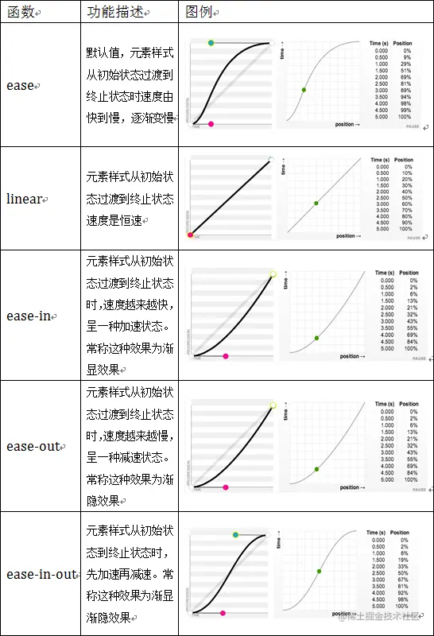

## 技巧篇：变换与动画

使用`原生JS`写交互很艰难，但使用`jQuery`封装好的交互函数就很简单了。

如今CSS3增加了`transform`、`transition`和`animation`三大交互属性，为CSS的单调性增加了很多趣味，也为交互开发提供更多可能。

### 变换transform

变换包括2D变换与3D变换。

2D变换在平面中操作，3D变换在空间中操作。

变换**可理解为**将节点复制一份并生成新图层，原节点隐藏，在新图层中使用新节点进行变换操作。

声明`transform-style`可实现2D变换与3D变换间的切换，`transform-style`在**父节点**中声明，即发生变换的节点的父节点。

* flat：所有变换效果在平面中呈现（**默认**）
* preserve-3d：所有变换效果在空间中呈现

#### 1. 六大函数

以下是整理的2D变换函数与3D变换函数，在不同变换空间使用相应变换函数即可。

transform包括六大函数，每个函数说明如下。

* translate：位移
  * 默认：XYZ轴不声明默认是0
  * 单位：length长度，可用任何长度单位，允许负值
  * 正值：沿X轴向右位移/沿Y轴向下位移/沿Z轴向外位移
  * 负值：沿X轴向左位移/沿Y轴向上位移/沿Z轴向内位移
  * 函数：
    * translate(x, y)：2D位移
    * translate3d(x, y, z)：3D位移
    * translateX(x)：X轴位移，等同于translate(x, 0)或translate3d(x, 0, 0)
    * translateY(y)：Y轴位移，等同于translate(0, y)或translate3d(0, y, 0)
    * translateZ(z)：Z轴位移，等同于translate3d(0, 0, z)
* scale：缩放
  * 默认：XYZ轴不声明默认是1或100%
  * 单位：number数值或percentage百分比，允许负值
  * 正值：0<(x,y,z)<1 沿X轴缩小/沿Y轴缩小/沿Z轴变厚，(x, y, z)>1 沿X轴放大/沿Y轴放大/沿Z轴变薄
  * 负值：-1<(x,y,z)<0 翻转沿X轴缩小/沿Y轴缩小/沿Z轴变厚，(x, y, z)<-1 翻转沿X轴放大/沿Y轴放大/沿Z轴变薄
  * 函数：
    * scale(x,y)：2D缩放
    * scale3d(x,y,z)：3D缩放
    * scaleX(x)：X轴缩放，等同于scale(x, 1)或scale3d(x, 1, 1)
    * scaleY(y)：Y轴缩放，等同于scale(1, y)或scale3d(1, y, 1)
    * scaleZ(z)：Z轴缩放，等同于scale3d(1, 1, z)
* skew：扭曲
  * 默认：XY轴不声明默认是0
  * 单位：angle角度或turn周
  * 正值：沿X轴向左扭曲/沿Y轴向下扭曲
  * 负值：沿X轴向右扭曲/沿Y轴向上扭曲
  * 函数：
    * skew(x,y)：2D扭曲
    * skewX(x)：X轴扭曲，等同于skew(x, 0)
    * skewY(y)：Y轴扭曲，等同于skew(0, y)
* rotate：旋转
  * 默认：XYZ轴不声明默认是0
  * 单位：angle角度或turn周
  * 正值：2D旋转时顺时针旋转
  * 负值：2D旋转时逆时针旋转
  * 函数：
    * rotate()：2D旋转
    * rotate3d(x,y,z,a)：3D旋转，[x, y, z]是一个向量，数值都是0~1
    * rotateX(a)：X轴旋转，等同于rotate3d(1, 0, 0, a)，正值时绕X轴向上逆时针旋转，负值时绕X轴向下顺时针旋转
    * rotateY(a)：3D Y轴旋转，等同于rotate3d(0, 1, 0, a)，正值时绕Y轴向右逆时针旋转，负值时绕Y轴向左顺时针旋转
    * rotateZ(a)：3DZ轴旋转，等同于rotate3d(0, 0, 1, a)，正值时绕Z轴顺时针旋转，负值时绕Z轴逆时针旋转
* matrix：矩阵（比较复杂）
* matrix(a, b, c, d, e, f）：2D矩阵（位移、缩放、扭曲和旋转的综合函数）
* matrix(a, b, c, d, e, f, g, h, i, j, k, l, m, n, o, p)：3D矩阵（位移、缩放、扭曲和旋转的综合函数）
* perspective：视距
  * 默认：0
  * 单位：length长度，可用任何长度单位

应用`transform`的场景很多，不局限于某种指定场景，若结合`transitiont`与`animation`使用还需注意性能问题。

#### 2. 多值执行顺序

与background/mask一样可声明多重效果。

准确来说并无执行中的先后顺序，而是由多个变换相应矩阵相乘，再拿该矩阵去乘以坐标，最终得出变换效果。

🌰：`transform: translate(150px, 0) rotate(45deg)`与`transform: rotate(45deg) translate(150px, 0)`，最终的变换效果就有所不同。

第一种：先向右位移150px，坐标轴不变；再顺时针旋转45deg，坐标轴顺时针旋转45deg

第二种：先顺时针旋转45deg，坐标轴顺时针旋转45deg；再向右位移150px，坐标轴不变

```html
<div class="transform-ex">
    <div class="demo1">0</div>
    <div class="demo1 transform-1">1</div>
    <div class="demo1 transform-2">2</div>
</div>
```

```scss
.transform-ex {
  .demo1 {
    display: flex;
    justify-content: center;
    align-items: center;
    //position: absolute;
    //top: 20px;
    //left: 20px;
    width: 100px;
    height: 100px;
    background-color: #f66;
    font-size: 20px;
    color: #fff;
    &.transform-1 {
      transform: translate(150px, 0) rotate(45deg);
    }
    &.transform-2 {
      transform: rotate(45deg) translate(150px, 0);
    }
  }
}
```

正确的理解是`从左到右`，还得注意坐标轴是否发生变化，若坐标轴发生变化，会影响到后续的变换效果，**缩放与旋转**都能让坐标轴发生变化。

优先考虑坐标轴的变化，先分析出前后`缩放旋转`的变化，再分析出前后`位移扭曲`的变化。

#### 3. 视距效果

可使用`transform: perspective()`代替`perspective`，在开启`3D变换`后最好声明视距，否则有些`3D变换效果`可能无法得到更好的展现。

* 值越小，用户与空间Z轴距离越近，视觉效果越强
* 值越大，用户与空间Z轴距离越远，视觉效果越弱

`perspective`与`transform: perspective()`的区别：

* 两者作用相同
* perspective在**舞台节点**（变换节点的父节点）中使用，transform: perspective()在**当前变换节点**中使用，也可与其他变换函数一起使用

#### 4. GPU硬件加速模式

即使再简单的动画，有时都能引起卡顿，特别是在移动端中尤其明显。有一种hack方式可解决该问题，就是为节点声明`transform: translate3d()`或`transform: translateZ()`，它们都能开启GPU硬件加速模式，以让游览器在渲染动画时从`CPU`转向`GPU`，实现硬件加速。

`transform: translate3d()`与`transform: translateZ()`其实是为了渲染3D样式，但声明为0后并无真正使用3D效果，但浏览器却因此开启了**GPU硬件加速模式**。在webkit内核中使用`transform: translate3d()`加速效果会更明显。

```css
.elem {
  transform: translate3d(0, 0, 0);
}
/* or */
.elem {
  tranform: translateZ(0);
}
```

使用该方案时可能会出现奇怪的缺陷。比如当多个绝对定位的节点声明`transform: translate3d()`开启GPU硬件加速模式后，会有几个节点凭空消失。这种现象不能完全解决，只能尽量避免。

* 尽量不要对节点及其父节点声明`position: absolute/fixed`，但这可能很难避免
* 减少声明`transform: translate3d()`的节点数量，减少至六个以下
* 使用`will-change`代替`tranform: translate3d()`

推荐第二种方式，节点的数量可通过`JS`动态控制，保持在六个以下。而`will-change`会存在另一些问题，大量使用还会引发更严重的性能问题。

#### 🌰：动感心形

`transform`有一个很实用的场景，就是通过`transform: translate()`补位。

**补位**是指实现效果的最终位置还差一点距离就能完成，通过`margin`或`transform: translate()`将该距离补充完整，将节点调整到最终位置。

比如居中布局，其中一种方式就是通过`transform: translate(-50%, -50%)`将节点拉回最中央，节点无需声明位移的距离是宽高的二分之一，使用`50%`自动计算其距离为宽高的二分之一。

使用单个`<div>`结合两个伪元素`::before`与`::after`通过错位叠加的方式合并出一个心形。

* 声明`<div>`的尺寸为一个正方形并以中心顺时针旋转`45deg`
* 声明两个伪元素继承`<div>`的尺寸并绝对定位
* 声明两个伪元素的圆角率为`100%`并平移到相应位置

巧妙利用`transform`将两个伪元素平移到相应位置产生叠加错觉。

```html
<div class="heart-shape"></div>
```

```scss
.heart-shape {
  position: relative;
  width: 200px;
  height: 200px;
  transform: rotate(45deg);
  background-color: #f66;

  &::before,
  &::after {
    content: "";
    position: absolute;
    top: 0;
    width: 100%;
    height: 100%;
    border-radius: 100%;
    background-color: #f66;
  }

  &::before {
    transform: translateX(-50%);
  }
  &::after {
    transform: translateY(-50%);
  }
}
```

div设置transform: rotate(45deg)改变了坐标轴，影响了伪元素后续的变换效果。

#### 🌰：像素边框

`1px`边框在桌面端网站看上去无大问题，但在移动端网站看上去却觉得很粗。

因为很多移动端设备都具备细腻的屏幕，像iPhone的`Retina屏幕`，一个逻辑像素可由四个点或九个点组成，在接近视网膜极限的情况下，1px边框看起来确实会有点粗。

可以声明`0.5px`边框吗？可行，但即使声明成功，有些浏览器还是根据1px的值去渲染，这样就导致不同设备的边框参差不齐了。

换个思路，使用一个伪元素的边框去当作节点边框，声明border为1px并将其宽高声明成200%，最终效果是该节点的2倍大小，再通过声明`transform: scale(.5)`将该伪元素缩小到原来的0.5倍，就与节点尺寸一样了，而`border`也通过浏览器自动计算成`0.5px`了，最终实现`0.5px边框`。

其实现原理就是将边框宽度计算交由浏览器处理。

```html
<div class="onepx-border normal">1px</div>
<div class="onepx-border thin">0.5px</div>
```

```scss
.onepx-border {
  width: 200px;
  height: 80px;
  line-height: 80px;
  text-align: center;
  font-weight: bold;
  font-size: 50px;
  color: #f66;
  box-sizing: border-box;
  & + .onepx-border {
    margin-top: 10px;
  }
  &.normal {
    border: 1px solid #f66;
  }
  &.thin {
    position: relative;
    &::after {
      content: "";
      position: absolute;
      top: 0;
      left: 0;
      border: 1px solid #f66;
      width: 200%;
      height: 200%;
      transform: scale(.5);
      transform-origin: left top; /*变换的基点（中心点）*/
    }
  }
}
```

#### 🌰：内容翻转

遇到一些内容翻转的场景，有些人可能会声明`transform: rotate3d()`将内容沿着Y轴旋转180deg水平翻转。其实可声明`transform: scale()`为负值将内容直接翻转。

* 水平翻转：`transform: scale(1, -1)` 绕X轴翻转
* 垂直翻转：`transform: scale(-1, 1)` 绕Y轴翻转
* 倒序翻转：`transform: scale(-1, -1)` 同时绕X轴和Y轴翻转

```html
<ul class="flip-content">
    <li>正常文本</li>
    <li class="x-axis">水平翻转</li>
    <li class="y-axis">垂直翻转</li>
    <li class="reverse">倒序翻转</li>
</ul>
```

```scss
.flip-content {
  li {
    list-style-type: none;
    position: relative;
    width: 121px;
    height: 51px;
    line-height: 51px;
    text-align: center;
    font-weight: bold;
    font-size: 30px;
    color: #f66;
    &::before,
    &::after {
      position: absolute;
      content: "";
      background-color: #66f;
    }
    & + li {
      margin-top: 10px;
    }
    &.x-axis {
      transform: scale(1, -1);/*沿x轴翻转*/
      &::after {
        top: 25px; // top：0在最底部
        left: 0;
        width: 100%;
        height: 1px;
      }
    }
    &.y-axis {
      transform: scale(-1, 1);/*沿y轴翻转*/
      &::after {
        top: 0;
        left: 60px; // left：0在最右边
        width: 1px;
        height: 100%;
      }
    }
    &.reverse {
      transform: scale(-1, -1);/*同时沿x轴和y轴翻转*/
      &::before {
        top: 25px;
        left: 0;
        width: 100%;
        height: 1px;
      }
      &::after {
        top: 0;
        left: 60px;
        width: 1px;
        height: 100%;
      }
    }
  }
}
```


### 过渡transition

有时在不同状态间切换属性会显得很生硬，此时`transition`就派上用场了，它能让状态间的切换变得更丝滑。`transition`包括四个子属性，每个子属性取值如下：

* transition-property：属性
  * all：全部属性过渡（默认）
  * none：无属性过渡
  * string：某个属性过渡
* transition-duration：持续时间
  * time：秒或毫秒（默认0）
* transition-timing-function：缓动函数
  * ease：逐渐变慢，等同于`cubic-bezier(.25, 1, .25, 1)`（默认）
  * linear：匀速，等同于`cubic-bezier(0, 0, 1, 1)`
  * ease-in：加速，等同于`cubic-bezier(.42, 0, 1, 1)`
  * ease-out：减速，等同于`cubic-bezier(0, 0, .58, 1)`
  * ease-in-out：先加速后减速，等同于`cubic-bezier(.42, 0, .58, 1)`
  * cubic-bezier：贝塞尔曲线，`(x1, y1, x2, y2)`四个值指定曲线中的点P1与P2，所有值需在`[0, 1]`区域内
* transition-delay：延迟时间
  * time：秒或毫秒（默认0）

总体来说`transition`可用到所有可能发生属性变更的节点中，但有一些情况是绝对不能使用的。`transition`延缓某些属性的变更过程，若通过`鼠标事件`给某个节点属性赋值，会导致属性在变更时发生卡顿。

比如，通过鼠标的`mousemove`事件将节点的top从10px变更为20px，如果声明了`transition: 300ms`，那从10px变更到11px时会将该过程延缓300ms，导致该过程的执行时长是300ms，但想要的效果是瞬间从10px变更到11px，再依次变更到20px。整个过程希望鼠标移动就立即赋值，这样才能实时显示top的变化，而声明了`transition`反而起到副作用导致看上去像发生卡顿。

duration与delay的取值都是时间，可能会有一些混淆。

* duration与delay作用于所有节点，包括自身的`::before`与`::after`
* transition中出现两个时间值时，第一个解析为duration，第二个解析为delay
* transition中出现一个时间值时，解析为duration

缓动函数其实就是贝塞尔曲线，推荐一个设置缓动函数形状的网站[CubicBezier](https://cubic-bezier.com/#.17,.67,.83,.67)，可根据需求设置想要的缓动函数。



（ease-out的图有误）

🌰：可看switch-btn的例子（选择器:checked）


### 动画animation

`transform`能让节点拥有更多形态，而`animation`能让节点拥有更多状态。

正是有了`animation`，所以才让交互效果更精彩。

**CSS动画**通过设置多个点精确控制一个或一组动画，用于实现复杂的动画效果。

动画由多个点组成，每个点拥有独立状态，这些状态通过浏览器处理为过渡效果，点与点间的过渡效果串联起来就是一个完整的动画。

`animation`可声明两种动画，每种动画各有自身特性。

* 关键帧动画：在时间轴的关键帧中绘制关键状态并使之有效过渡组成动画
* 逐帧动画：在时间轴的每帧中绘制不同内容并使之连续播放组成动画

`关键帧动画`可看作是一个连续的动画片段，`逐帧动画`可看作是一个断续的动画片段，两种动画都是通过时间流逝将多个动画片段串联在一起。

浏览器可将关键帧动画的关键帧自动过渡为片段，而将逐帧动画的每帧根据顺序播放为片段，可认为逐帧动画是一个**GIF**。

`animation`包括八个子属性，每个子属性说明如下：

* animation-name：名称
  * none：无动画（默认）
  * string：动画名称
* animation-duration：持续时间
  * time：秒或毫秒（默认0）
* animation-timing-function：缓动函数
  * ease：逐渐变慢，等同于`cubic-bezier(.25, 1, .25, 1)`（默认）
  * linear：匀速，等同于`cubic-bezier(0, 0, 1, 1)`
  * ease-in：加速，等同于`cubic-bezier(.42, 0, 1, 1)`
  * ease-out：减速，等同于`cubic-bezier(0, 0, .58, 1)`
  * ease-in-out：先加速后减速，等同于`cubic-bezier(.42, 0, .58, 1)`
  * cubic-bezier：贝塞尔曲线，`(x1, y1, x2, y2)`四个值指定曲线中的点P1与P2，所有值需在[0, 1]区间。
  * steps([, [start|end]]?)：把动画平均划分成n等分，直到平均走完该动画
  * step-start：等同于steps(1, start)，把动画分成一步，动画执行时以左侧端点0%为开始（舍弃第一帧）
  * step-end：等同于steps(1,end)，把动画分成一步，动画执行时以右侧端点100%为开始（舍弃最后一帧）
* animation-delay：等待时间
  * time：秒或毫秒（默认0）
* animation-iteration-count：播放次数
  * number：数值（默认1）
  * infinite：无限次
* animation-direction：轮流反向播放（播放次数为一次则该属性无效果
  * normal：正常播放（默认）
  * alternate：轮流反向播放，奇数次数正常播放，偶数次数反向播放
* animation-play-state：播放状态
  * running：正在播放（默认）
  * paused：暂停播放
* animation-fill-mode：播放前后其效果是否可见
  * none：不改变默认行为（默认）
  * backwards：在等待时间内或在动画开始前应用开始属性（在第一个关键帧中定义）
  * forwards：在动画结束后保持最后一个属性（在最后一个关键帧中定义）
  * both：向前与向后填充模式都被应用

关键帧动画必须通过`animation`与`@keyframes`声明，逐帧动画只能通过`animation-timing-funtion: steps()`声明。总体来说逐帧动画的声明较简单，可用一张`逐帧长图`完成整个动画效果，而关键帧动画需结合`@keyframes`为每个关键帧声明当前相应状态，若涉及的点较多，可能较繁琐。

#### 1. 关键帧动画声明步骤

* 在`@keyframes`中声明动画名称与动画每个关键帧的状态
* 动画名称不能重复否则会被覆盖，关键帧通过百分比分割出每个关键帧并声明相应状态
* 在指定节点中声明`animation`调用动画

#### 2. 逐帧动画声明步骤

* 准备一张`逐帧长图`，该图像包括动画效果的每帧且每帧宽高必须一样
* 在`steps()`中声明逐帧长图及其展示方式
* 在指定节点中声明`animation`调用动画

#### 3. @keyframes注意事项

关键帧动画的声明通过`@keyframes`完成，形式如下。

```css
@keyframes animation-name {
  from {}
  to {}
}
/* or */
@keyframes animation-name {
  p1 {}
  p2 {}
  p3 {}
}
```

关键帧的取值必须是`from`、`to`或`percentage`。

`from`可用`0%`代替，`to`可用`100%`代替，若开始或结束的关键帧无相应状态，则无需声明from或to。

`0%`的`%`不能省略，否则关键帧解析会失效。

后面声明的关键帧状态会覆盖前面声明的关键帧状态，动画结束后会回到`animation-fill-mode`声明的状态。

#### 🌰：自动打字器

很多在线编辑器网站都有一些自动打字的效果，例如CodePen。是CSS实现的效果。

观察自动打字器，可发现其存在以下规律：

* 字体都是等宽字体，等宽字体保证每次打字时光标的移动距离都一样
* 打字器的宽度由最初的`0px`在逐渐增加内容后变成最终固定字数的宽度，宽度以等宽字体的个数为准
* 光标随着每打一个字就闪烁一次，打字速度均匀，打字完毕再次重复打字
* 整个打字过程存在两个动画，一个是打字器自增宽度，一个是光标闪烁
* 整个打字过程一闪一闪地完成，根据其断断续续的特性可判断该动画为逐帧动画

有一个名为`ch`的长度单位，它是一个等宽字体的特有长度单位，准确宽度为数字`0`的宽度，因此一个等宽字体就是`1ch`，两个等宽字体就是`2ch`。通过等宽字体个数定制打字器长度最适合不过了，而浏览器自带的等宽字体有`Consolas`、`Monaco`和`Monospace`三种。

`打字器自增宽度`可用`0px`到等宽字体指定个数的宽度`nch`为一个自增周期，使用动画完成其自增过程。

`光标闪烁`可用`border-right`模拟，节点包括文本，在最右边声明`border-right`，那不就是一个具备静态光标的输入状态吗？文本右边就是光标，很符合常理，为`border-right`声明一个闪烁动画。

```html
<div class="auto-typing">Do You Want To Know More About CSS Development Skill</div>
```

```scss
@mixin typing($count: 0, $duration: 0, $delay: 0) {
  overflow: hidden;
  border-right: 1px solid transparent;
  width: #{$count + 1}ch;
  font-family: Consolas, Monaco, monospace;
  white-space: nowrap;
  animation: typing #{$duration}s steps($count + 1) #{$delay}s infinite backwards,
    caret 500ms steps(1) #{$delay}s infinite forwards;
}
.auto-typing {
  margin: auto;
  font-weight: bold;
  font-size: 30px;
  color: #09f;
  @include typing(52, 5);
}
@keyframes typing {
  from {
    width: 0;
  }
}
@keyframes caret {
  50% {
    border-right-color: currentColor; /*使用该关键字的元素的（或其最近父元素）color属性的颜色值*/
  }
}
```

#### 🌰：[steps分步动画](http://www.qiutianaimeili.com/html/page/2021/06/2028tl9nhl7wfij.html)

steps中的number，指的是走了number步，但是实际上呢，却是将整个动画分成了number+1份。

```html
<div class="step-anim"></div>
```

```scss
.step-anim {
  width: 76px;
  height: 125px;
  background: url("./step.jpeg") no-repeat left center;
  border: 1px solid #333;
  animation: step-move infinite 2s steps(6, start);
}
@keyframes step-move {
  0% {
    background-position-x: -22%;
  }
  100% {
    background-position-x: 100%;
  }
}
```
