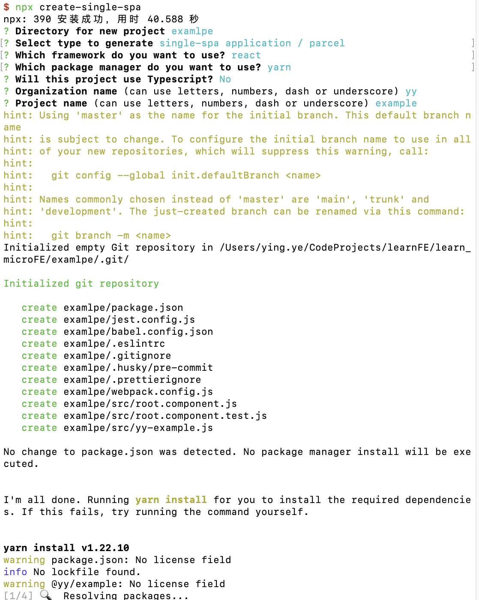
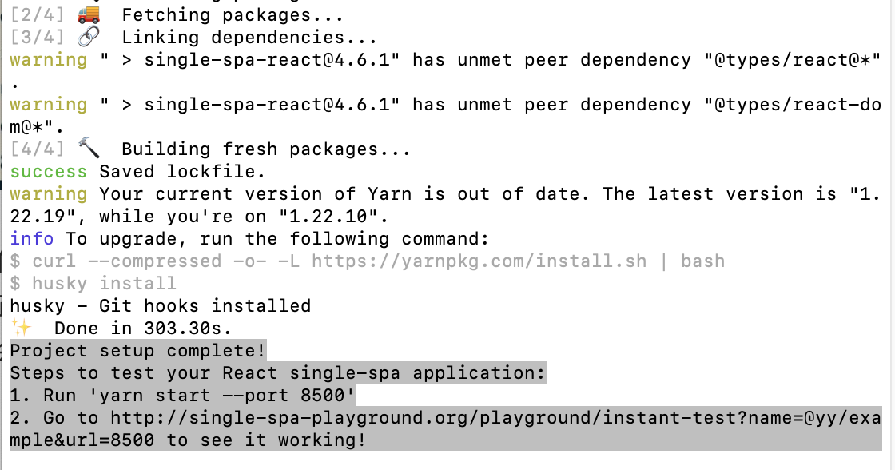
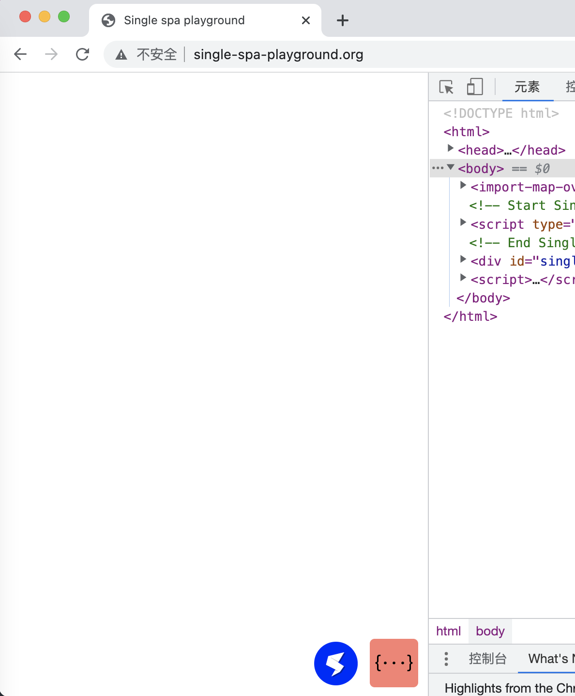
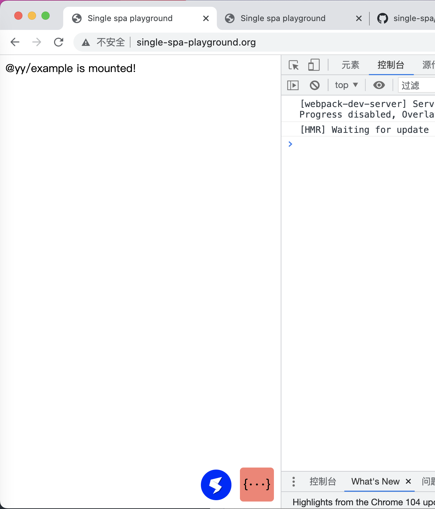
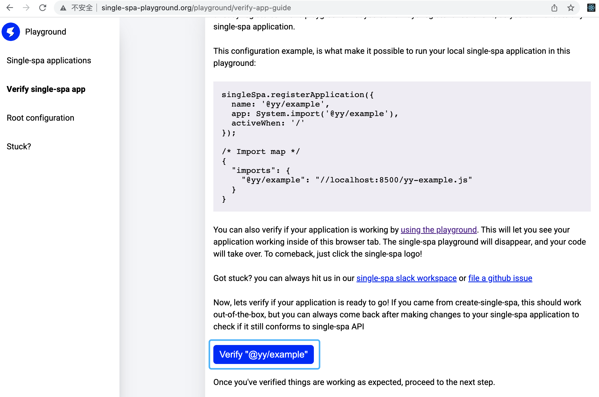
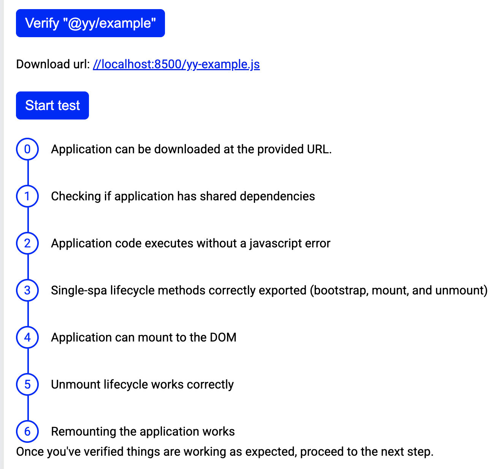
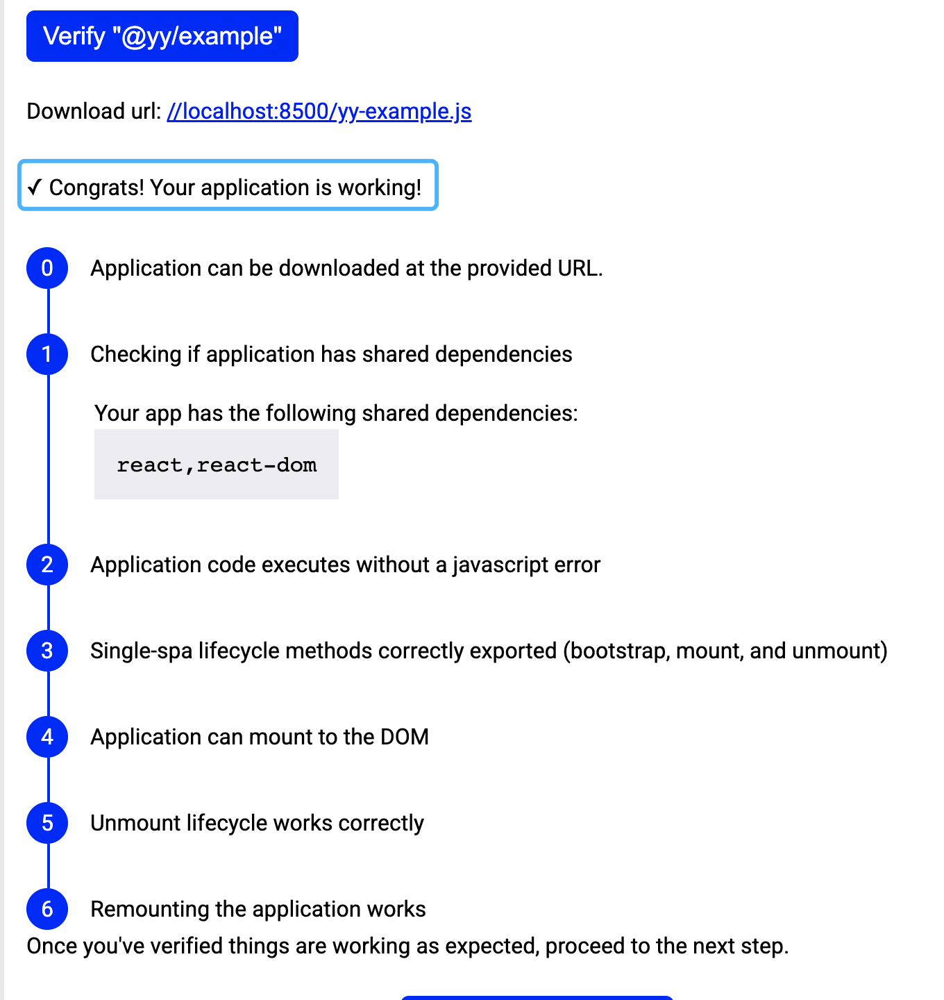
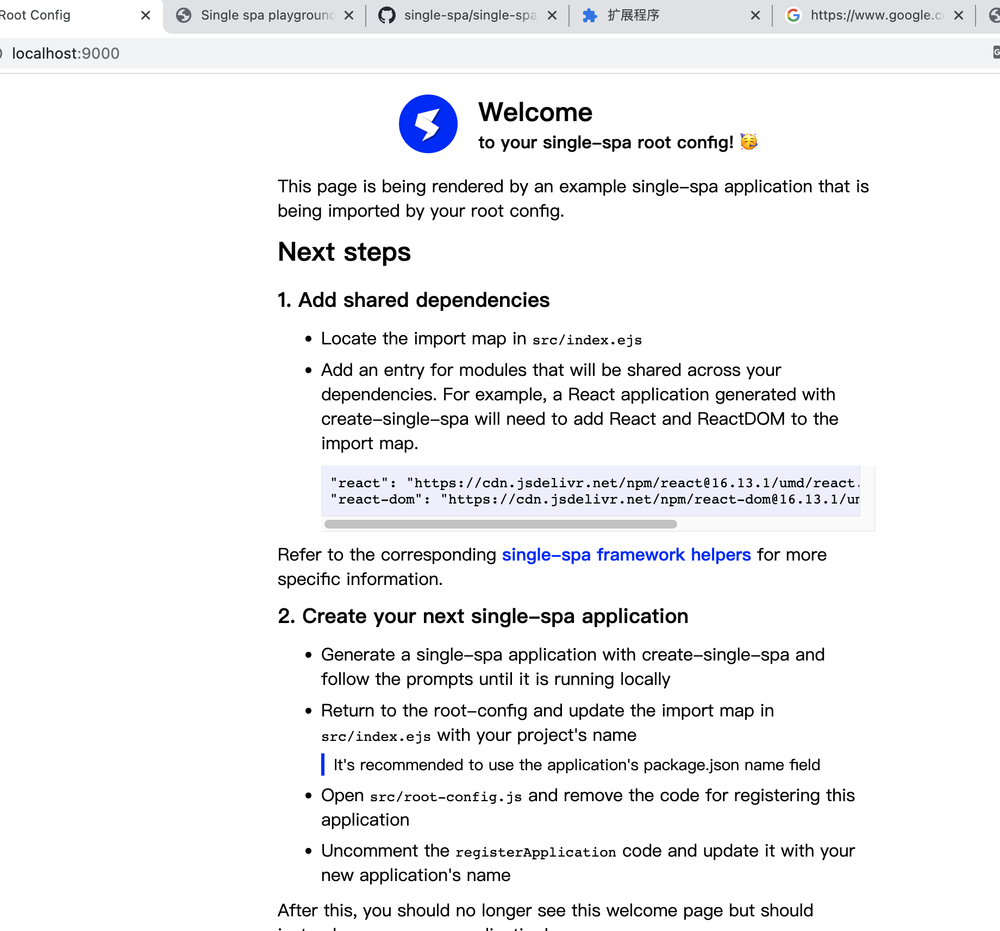
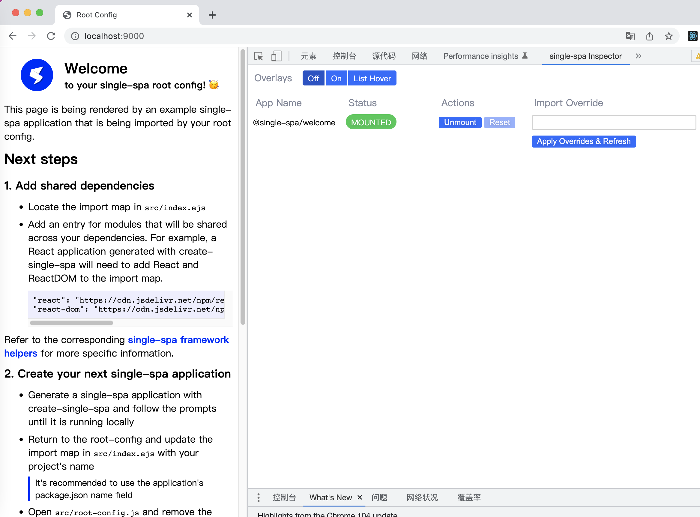
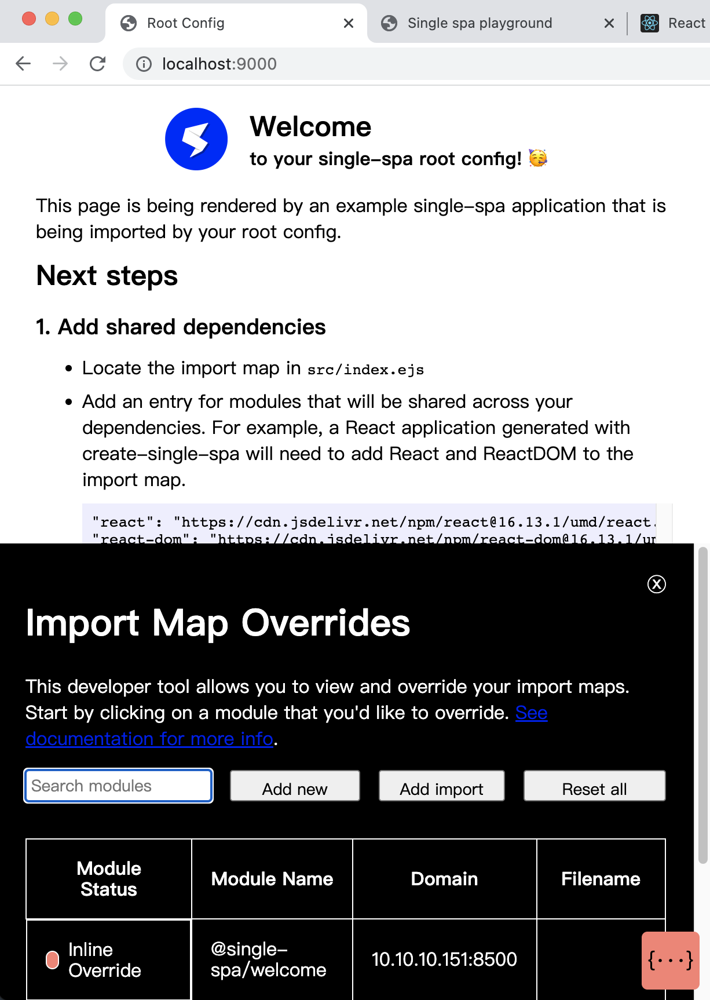

## 微前端的工具介绍

**基于`single-spa`框架做的浏览器插件**

### 脚手架项目自带的工具

#### 0. 应用运行前的验证环节

```shell
# 首先安装single-spa脚手架
npx create-single-spa
```





在脚手架安装完成之后，应用运行前，`single-spa`有一套独立的检测方案，保证我们在运行前的环境是没有问题的。

在我们通过`single-spa`对`微前端`项目在本地初始化后，命令行会显示以上信息（上图的灰色阴影部分）：第1点就是正常启动项目的操作；第2点是用来测试我们的微前端项目是否可以正常运行，当打开其中的链接，会重定向到http://single-spa-playground.org/，在该网址下展示脚手架安装好的子应用。



右下角的蓝色背景图标是`playground`的`icon`，点击可以看到`playground`的简介和四个菜单功能：

Single-spa应用、验证single-spa应用、`root configuration`、stuck（碰到的问题）

#### 1. playground简介

`single-spa playground`是一个协助你使用[`single-spa`](https://single-spa.js.org/)的网站，`single spa`还有一个浏览器扩展程序，两者可以协同帮助你调试single-spa应用程序。

#### 2. 如何构建微前端应用

一个single-spa应用在普通的spa应用基础上，还必须和其他应用共享一个HTML文件。

你可以手动去配置，但是强烈推荐使用[`create-single-spa`](https://single-spa.js.org/docs/create-single-spa/)这个CLI去创建项目。

由于`single-spa`应用没有自己的HTML文件，它们不能作为独立的应用去运行。但它们可以生成能够被动态注入HTML文件的JavaScript和css，playground允许你这么做以便测试应用程序，具体操作就是上面图中灰色阴影部分中的步骤。

* 启动服务

```shell
$ yarn start --port 8500
yarn run v1.22.10
warning package.json: No license field
$ webpack serve --port 8500
<i> [webpack-dev-server] Project is running at:
<i> [webpack-dev-server] Loopback: http://localhost:8500/
<i> [webpack-dev-server] On Your Network (IPv4): http://10.10.10.173:8500/
<i> [webpack-dev-server] On Your Network (IPv6): http://[fe80::1]:8500/
<i> [webpack-dev-server] Content not from webpack is served from '/Users/ying.ye/CodeProjects/learnFE/learn_microFE/examlpe/public' directory
<i> [webpack-dev-server] 404s will fallback to '/index.html'
asset yy-example.js 275 KiB [emitted] (name: main) 1 related asset
asset index.html 3.05 KiB [emitted]
runtime modules 26.3 KiB 12 modules
modules by path ./node_modules/ 211 KiB
  modules by path ./node_modules/webpack-dev-server/client/ 57.4 KiB 12 modules
  modules by path ./node_modules/webpack/hot/*.js 4.3 KiB 4 modules
  modules by path ./node_modules/html-entities/lib/*.js 81.3 KiB 4 modules
  modules by path ./node_modules/systemjs-webpack-interop/ 3.27 KiB 3 modules
  modules by path ./node_modules/react/ 37.7 KiB
    ./node_modules/react/jsx-runtime.js 214 bytes [built] [code generated]
    ./node_modules/react/cjs/react-jsx-runtime.development.js 37.5 KiB [built] [code generated]
  + 4 modules
modules by path ./src/*.js 714 bytes
  ./src/yy-example.js 534 bytes [built] [code generated]
  ./src/root.component.js 180 bytes [built] [code generated]
external "react" 42 bytes [built] [code generated]
external "react-dom" 42 bytes [built] [code generated]
webpack 5.74.0 compiled successfully in 1138 ms
```

* 查看效果

  访问链接http://single-spa-playground.org/playground/instant-test?name=@yy/example&url=8500，会重定向到http://single-spa-playground.org/，为你启动single-spa应用。

  这样实现了你在本地为single-spa应用开启一个服务，然后跑在一个已经部署的应用上。



#### 3. 验证微前端应用

验证当前构建的`single-spa`应用是否可以正常运行的操作。



点击按钮后会显示检测的7个点：



* 是否可以通过URL下载应用
* 检查是否有共享的依赖项
* 应用程序代码执行时无JavaScript错误
* single-spa的生命周期方法被正确导出
* 应用程序可以挂载到DOM
* 生命周期的卸载方法可以正常执行
* 可以重新挂载应用程序

点击`start test`按钮，得到检测结果：



#### 4. root configuration

在single-spa中，对于所有的应用只有一个html文件，我们把它称作`single-spa root config`。只有一个html文件这一点就是single-spa这个名字的实际由来。root config就是运行一个微应用的核心部分。

```shell
## 使用以下命令可以为你创建一个包含root-config的single-spa项目
npx create-single-spa --module-type root-config

$ npx create-single-spa --module-type root-config
npx: 390 安装成功，用时 41.666 秒
? Directory for new project example1
? Which package manager do you want to use? yarn
? Will this project use Typescript? No
? Would you like to use single-spa Layout Engine No
? Organization name (can use letters, numbers, dash or underscore) yy
hint: Using 'master' as the name for the initial branch. This default branch name
hint: is subject to change. To configure the initial branch name to use in all
hint: of your new repositories, which will suppress this warning, call:
hint: 
hint: 	git config --global init.defaultBranch <name>
hint: 
hint: Names commonly chosen instead of 'master' are 'main', 'trunk' and
hint: 'development'. The just-created branch can be renamed via this command:
hint: 
hint: 	git branch -m <name>
Initialized empty Git repository in /Users/ying.ye/CodeProjects/learnFE/learn_microFE/example1/.git/

Initialized git repository

   create example1/package.json
   create example1/babel.config.json
   create example1/.gitignore
   create example1/.husky/pre-commit
   create example1/.eslintrc
   create example1/.prettierignore
   create example1/webpack.config.js
   create example1/src/yy-root-config.js
   create example1/src/index.ejs

No change to package.json was detected. No package manager install will be executed.


I'm all done. Running yarn install for you to install the required dependencies. If this fails, try running the command yourself.


yarn install v1.22.10
warning package.json: No license field
info No lockfile found.
warning @yy/root-config: No license field
[1/4] 🔍  Resolving packages...
[2/4] 🚚  Fetching packages...
[3/4] 🔗  Linking dependencies...
[4/4] 🔨  Building fresh packages...
success Saved lockfile.
$ husky install
husky - Git hooks installed
✨  Done in 129.78s.
Project setup complete!
Run 'yarn start' to boot up your single-spa root config
```

这个创建出来的项目包含了基本的import map配置。

import maps是一份规范，用来控制哪些URL需要去哪儿加载JavaScript包。systemjs就是用于这个规范的一个npm库，用于兼容不支持import maps的浏览器。

我们可以通过`systemjs`设置每一个微应用的导入项。

```ejs
<!-- 在src/index.ejs中可以看到几段配置 -->
<script type="systemjs-importmap">
    {
      "imports": {
        "single-spa": "https://cdn.jsdelivr.net/npm/single-spa@5.9.0/lib/system/single-spa.min.js"
      }
    }
</script>

<% if (isLocal) { %>
  <script type="systemjs-importmap">
    {
      "imports": {
        "@yy/root-config": "//localhost:9000/yy-root-config.js"
      }
    }
  </script>
<% } %>

<!-- 我们还可以看到ejs文件中导入了入口文件 -->
<script>
  System.import('@yy/root-config');
</script>
```

仅仅配置了导入映射还不够，服务启动后我们只能看到空白页面，我们还需要通过`single-spa`注册每一个微应用，把下面的内容添加至root-config的入口文件

```js
// 在src/yy-root-config.js中可以看到默认的一些配置
import { registerApplication, start } from "single-spa";

registerApplication({
  name: "@single-spa/welcome",
  app: () =>
    System.import(
      "https://unpkg.com/single-spa-welcome/dist/single-spa-welcome.js"
    ),
  activeWhen: ["/"],
});

// 我们需要在start()方法调用之前继续调用registerApplication注册我们自己的微应用，比如
// registerApplication({
//   name: "@yy/navbar",
//   app: () => System.import("@yy/navbar"),
//   activeWhen: ["/"]
// });

start({
  urlRerouteOnly: true,
});
```

这样就可以串联每一个微应用，实现一个完整应用的效果，`yarn start`看一下效果：

```shell
yarn start

## 默认打开9000端口
$ yarn start            
yarn run v1.22.10
warning package.json: No license field
$ webpack serve --port 9000 --env isLocal
<i> [webpack-dev-server] Project is running at:
<i> [webpack-dev-server] Loopback: http://localhost:9000/
<i> [webpack-dev-server] On Your Network (IPv4): http://10.10.10.137:9000/
<i> [webpack-dev-server] On Your Network (IPv6): http://[fe80::1]:9000/
<i> [webpack-dev-server] Content not from webpack is served from '/Users/ying.ye/CodeProjects/learnFE/learn_microFE/example1/public' directory
<i> [webpack-dev-server] 404s will fallback to '/index.html'
asset yy-root-config.js 243 KiB [emitted] (name: main) 1 related asset
asset index.html 3.46 KiB [emitted]
runtime modules 26.3 KiB 12 modules
modules by path ./node_modules/ 181 KiB
  modules by path ./node_modules/webpack-dev-server/client/ 57.4 KiB 12 modules
  modules by path ./node_modules/webpack/hot/*.js 4.3 KiB 4 modules
  modules by path ./node_modules/html-entities/lib/*.js 81.3 KiB 4 modules
  modules by path ./node_modules/systemjs-webpack-interop/ 3.27 KiB
    ./node_modules/systemjs-webpack-interop/auto-public-path/1.js 89 bytes [built] [code generated]
    + 2 modules
  ./node_modules/single-spa-layout/dist/esm/single-spa-layout.min.js 15.7 KiB [built] [code generated]
  ./node_modules/ansi-html-community/index.js 4.16 KiB [built] [code generated]
  ./node_modules/events/events.js 14.5 KiB [built] [code generated]
modules by path ./src/ 1.13 KiB
  ./src/yy-root-config.js 606 bytes [built] [code generated]
  ./src/microfrontend-layout.html 546 bytes [built] [code generated]
external "single-spa" 42 bytes [built] [code generated]
webpack 5.74.0 compiled successfully in 1099 ms
```

访问`9000端口`，会打开一个默认欢迎界面：



默认打开的界面与`yy-root-config.js`中注册的微应用有关。

查看src目录下的内容和之前不一样，当不带参数创建single-spa 项目时，src目录下的三个文件是：`root.component.js`、`root.component.test.js`、`yy-example.js`。

使用参数创建项目后，src目录下的文件变成了：`index.ejs`、`yy-root-config.js`。并且两次创建的webpack.config.js中的内容也不同，多了`html-webpack-plugin`的配置。

新建的项目启动后打开的右下角也没有图标。

#### 5. Stuck？

使用中碰到问题时，可以参考的处理方式：[提交github issue](https://github.com/single-spa/single-spa-playground/issues/new?body=%0A%23%23%20Data%20dump%0A%0AApplications%3A%0A%60%60%60json%0A%7B%0A%20%20%22name%22%3A%20%22%40yy%2Fexample%22%2C%0A%20%20%22pathPrefix%22%3A%20%22%2F%22%2C%0A%20%20%22useNativeModules%22%3A%20false%0A%7D%0A%60%60%60%0A%0AImport%20map%3A%0A%60%60%60json%0A%7B%0A%20%20%22imports%22%3A%20%7B%0A%20%20%20%20%22%40yy%2Fexample%22%3A%20%22%2F%2Flocalhost%3A8500%2Fyy-example.js%22%0A%20%20%7D%2C%0A%20%20%22scopes%22%3A%20%7B%7D%0A%7D%0A%60%60%60%0A%0A%23%23%20Description%0A)或者[加入single-spa工作区讨论](https://join.slack.com/t/single-spa/shared_invite/enQtODAwNTIyMzc4OTE1LWUxMTUwY2M1MTY0ZGMzOTUzMGNkMzI1NzRiYzYwOWM1MTEzZDM1NDAyNWM3ZmViOTAzZThkMDcwMWZmNTFmMWQ)

在提交问题前，可以先在issue中进行查询


### 浏览器插件

Chrome商店打不开，随便下载一个https://www.chajianxw.com/developer/36424.html

功能：

* 列出所有注册的应用（按照挂载顺序）
* 展示所有应用的状态
* 强制挂载、卸载某个应用
* 展示应用覆盖的记录。查看如何配置覆盖记录，启用该功能
* 提供了一个添加重写导入映射（import-maps）的接口



#### 应用列表

应用列表展示了应用的名称、挂载状态等信息，可以看到默认情况下只注册了一个欢迎的微应用，鼠标悬停在一个应用上时，会在页面上显示这个应用的位置，类似于审查元素。可以对应用列表中的微应用做一些操作，比如卸载、重置和覆盖

#### 配置应用覆盖

为了添加应用覆盖，需要找到导出生命周期函数（如bootstrap、mount、unmount）的文件，并在文件中添加一个导出对象格式如下：

```js
// 常量的名字必须是devtools
export const devtools = {
  overlays: {
    // selectors是必选配置
    // 该配置是css选择器构成的数组，在每个应用的最外层，以该选择器作为标识
    // 你可以设置多个标识，类似多个parcel或’不同容器应对不同视图‘的用法
    selectors: [
      '#my-app',
      '.some-container .app'
    ],
    // 可选配置，
    // 这些选项用来配置’覆盖‘的样式和一些操作
    options: {
      width: '100%',
      height: '100%',
      zIndex: 40,
      position: 'absolute',
      top: 0,
      left: 0,
      color: '#000',
      background: '#000',
      textBlocks: [
        // 你可以给’覆盖‘添加额外的文本，例如，你可以添加这个配置的开发人员的名字
        // 这个数组中的每个字符串都会在一个新的div中
        // 例如：’blue squad‘，’is awesome‘会被解析成
        // <div>blue squad</div><div>is awesome</div>
      ]
    }
  }
};
```

#### import-map-override

如果你使用了import-maps，当你使用了[import-map-override](https://github.com/joeldenning/import-map-overrides)这个库，single-spa插件提供一个接口允许你添加import-map override。

#### 操作

当下载并安装插件以后，通过`localStorage.setItem('devtools', true)`激活控制台，并刷新页面后，此时，屏幕右下角会出现一个橘色背景的图标，点击可以打开一个标题为'import map overrides'的面板。

```ejs
<!-- 与src/index.ejs中的这段内容有关，如果devtools开启，就会展示这个组件 -->
<import-map-overrides-full show-when-local-storage="devtools" dev-libs></import-map-overrides-full>
```



点击`add new module`按钮可以添加新的微应用。

当微应用配置正确的时候，就可以正常访问我们的微应用了。
