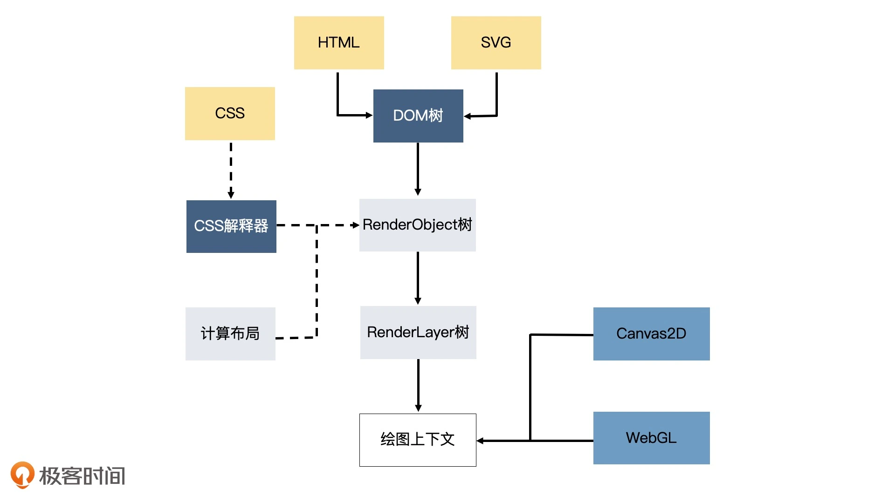
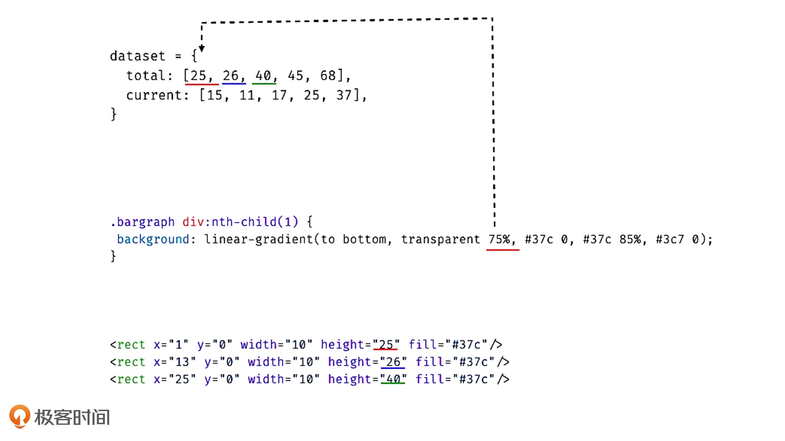
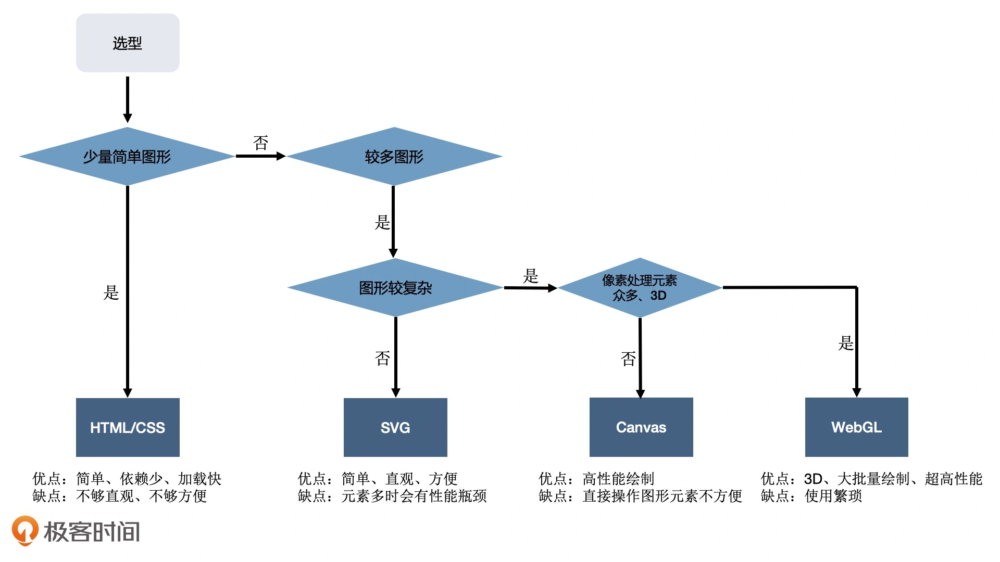

## 01 | 浏览器中实现可视化的四种方式

可视化用一句话来说，本质上就是将数据信息组织起来后，以图形的方式呈现出来。

在Web上，图形通常是通过浏览器绘制的。现代浏览器中负责绘制图形的部分是**渲染引擎**。

### 概述

渲染引擎绘制图形的方式，大体上有4种。

* 第1种是**传统的HTML+CSS**。

  通常用来呈现普通的Web网页。

* 第2种是使用**SVG**。

  弥补HTML/CSS在*绘制矢量图形*方面能力不足的问题。

* 第3种是使用**Canvas2D**。

  这是浏览器提供的Canvas API中的其中一种上下文

  可以非常方便地绘制出基础的几何图形。

* 第4种是使用**WebGL**。

  这是浏览器提供的Canvas API中的另一种上下文，是OpenGL ES规范在Web端的实现

  可以通过它，用GPU渲染各种复杂的2D和3D图形。

  值得一提的是，WebGL利用了**GPU并行处理**的特性，这让它在处理大量数据展现的时候，性能大大优于前3中绘图方式。

以下从宏观层面来了解这些图形系统。

### HTML+CSS

现代浏览器的HTML/CSS表现能力很强大，完全可以实现常规的图表展现，比如常见的柱状图、饼图和折线图。

**使用CSS的好处**有两个：

* 既能**简化开发**，又不需要引入额外的库，可以**节省资源**，提高网页打开的速度。
* 理解**CSS的绘图思想**对于可视化也是很有帮助的

#### HTML与CSS是如何实现可视化的？

用CSS实现**柱状图**其实很简单，原理就是使用网格布局（Grid Layout）加上线性渐变（Linear-gradient）。示例代码如下：

```html
<div class="bargraph">
  <div></div>
  <div></div>
  <div></div>
  <div></div>
  <div></div>
</div>
```

```css
/**
   dataset = {
     current: [15, 11, 17, 25, 37],
     total: [25, 26, 40, 45, 68],
   }
 */
.bargraph {
  display: grid;
  width: 150px;
  height: 100px;
  padding: 10px;
  transform: scaleY(3);
  grid-template-columns: repeat(5, 20%);
}
.bargraph div {
  margin: 0 2px;
}
.bargraph div:nth-child(1) {
  background: linear-gradient(to bottom, transparent 75%, #37c 0, #37c 85%, #3c7 0);
}
.bargraph div:nth-child(2) {
  background: linear-gradient(to bottom, transparent 74%, #37c 0, #37c 89%, #3c7 0);
}
.bargraph div:nth-child(3) {
  background: linear-gradient(to bottom, transparent 60%, #37c 0, #37c 83%, #3c7 0);
}
.bargraph div:nth-child(4) {
  background: linear-gradient(to bottom, transparent 55%, #37c 0, #37c 75%, #3c7 0);
}
.bargraph div:nth-child(5) {
  background: linear-gradient(to bottom, transparent 32%, #37c 0, #37c 63%, #3c7 0);
}
```

要实现**饼图**，可以使用圆锥渐变。示例代码如下：

```html
<div class="piegraph"></div>
```

```css
.piegraph {
  display: inline-block;
  width: 250px;
  height: 250px;
  border-radius: 50%;
  background-image: conic-gradient(#37c 30deg, #3c7 30deg, #3c7 65deg, orange 65deg, orange 110deg, #f73 110deg, #f73 200deg, #ccc 200deg);
}
```

用HTML+CSS也可以实现折线图。用高度很小的div元素来模拟线段，然后用transform改变角度和位置，这样就能拼成折线图了。

使用clip-path这样的高级属性，还能实现更复杂的图表，比如，用不同的颜色表示两个不同折线的面积。

实际上，很多常见的可视化图表都可以用HTML+CSS来实现，不需要用其他的绘图方式。

#### 使用HTML+CSS实现可视化的缺点

* 首先，**HTML和CSS主要还是为网页布局而创造的**

  使用它们虽然能绘制可视化图表，但是**绘制的方式并不简洁**。

  从CSS代码里，我们很难看出数据与图形的对应关系，有很多换算也需要开发人员自己来做。一旦图表或数据发生改动，就需要重新计算，维护起来麻烦。

* 其次，作为浏览器渲染引擎的一部分，为了完成页面渲染的工作，HTML和CSS除了绘制图形外，还要做很多额外的工作

  当图形发生变化时，我们很可能要重新执行全部的工作（解析HTML、SVG、CSS，构建DOM树、RenderObject树和RenderLayer树，然后用HTML或SVG绘图），这样的性能开销是非常大的。

  而且传统的Web开发，因为涉及UI构建和内容组织，所以这些额外的解析和构建工作都是必须做的。

  而**可视化与传统网页不同，它不太需要复杂的布局，更多的工作是在绘图和数据计算。**所以对于可视化而言，这些额外的工作相当于白白消耗了性能。

相比于HTML和CSS，Canvas2D和WebGL更适合去做可视化这一领域的绘图工作。它们的绘图API能够直接操作绘图上下文，一般不涉及引擎的其他部分，在重绘图像时，也不会发生重新解析文档和构建结构的过程，开销要小很多。




### SVG

全称Scalable Vector Graphics，可缩放矢量图

是一种基于XML语法的图像格式，**可以用图片（img元素）的src属性加载**；浏览器更强大的是，**还可以内嵌SVG标签**，并且像操作普通的HTML元素一样，利用DOM API操作SVG元素，甚至CSS也可以作用于内嵌的SVG元素。

上述的柱状图也可以用SVG实现，示例代码如下：

```html
 <!--
      dataset = {
        total: [25, 26, 40, 45, 68],
        current: [15, 11, 17, 25, 37],
      }
  -->
  <svg xmlns="http://www.w3.org/2000/svg" width="120px" height="240px" viewBox="0 0 60 100">
    <g transform="translate(0, 100) scale(1, -1)">
      <g>
        <rect x="1" y="0" width="10" height="25" fill="#37c"/>
        <rect x="13" y="0" width="10" height="26" fill="#37c"/>
        <rect x="25" y="0" width="10" height="40" fill="#37c"/>
        <rect x="37" y="0" width="10" height="45" fill="#37c"/>
        <rect x="49" y="0" width="10" height="68" fill="#37c"/>
      </g>
      <g>
        <rect x="1" y="0" width="10" height="15" fill="#3c7"/>
        <rect x="13" y="0" width="10" height="11" fill="#3c7"/>
        <rect x="25" y="0" width="10" height="17" fill="#3c7"/>
        <rect x="37" y="0" width="10" height="25" fill="#3c7"/>
        <rect x="49" y="0" width="10" height="37" fill="#3c7"/>
      </g>
    </g>
  </svg>
```

这段SVG代码中，可以一目了然地看出，数据total和current分别对应SVG中两个g元素下的rect元素的高度。即，元素的属性和数值可以直接对应起来。

**SVG可以直观展现数据与图形的对应关系**；而CSS代码并不能直观体现出数据的数值，需要进行CSS规则转换。关系如下图所示：



在上述SVG代码中，**g表示分组**，rect表示绘制一个矩形元素。除了rect之外，SVG还提供了丰富的图形元素，可以绘制矩形、圆弧、椭圆、多边形和贝塞尔曲线等等。

SVG绘制图表与HTML+CSS绘制图表的方式差别不大，只不过是将HTML标签替换成SVG标签，运用了一些SVG支持的特殊属性。

HTML的不足之处在于HTML元素的形状一般是矩形，虽然有CSS辅助，也能够绘制出各种其他形状的图形，甚至不规则图形，但总体而言还是非常麻烦。**SVG则弥补了这一点，让绘制不规则图形变得更简单了**。

**SVG图表也有缺点**：

* 在渲染引擎中，SVG元素和HTML元素一样，在输出图形前都需要经过引擎的解析、布局计算和渲染树生成

* 一个SVG元素只表示一种基本图形，如果展示的数据很复杂，生成图形的SVG元素就会很多

  大量的SVG元素不仅会占用很多内存空间，还会增加引擎解析、布局计算和渲染树生成的开销，降低性能，减慢渲染速度

这些注定了SVG只适合应用于元素较少的简单可视化场景


### Canvas2D

无论是HTML/CSS还是SVG，都属于**声明式**绘图系统，即，我们根据数据创建各种不同的图形元素（或CSS规则），然后利用浏览器渲染引擎解析它们并渲染出来；

而Canvas2D是浏览器提供的一种可以直接用代码在一块平面的“画布”上绘制图形的API，使用它来绘图更像是传统的“编写代码”，简单来说就是调用绘图指令，然后引擎直接在页面上绘制图形，这是一种**指令式**的绘图系统。

**Canvas到底是怎么绘制可视化图表的呢？**

首先，Canvas元素在浏览器上创造一个空白的画布，通过提供渲染上下文，赋予我们绘制内容的能力；

然后，我们只需要调用渲染上下文，设置各种属性，然后调用绘图指令完成输出。

就能在画布上呈现各种各样的图形了。

Canvas还提供了非常丰富的设置和绘图API，我们可以通过操作上下文，来改变填充和描边颜色，对画布进行几何变换，调用各种绘图指令，然后将绘制的图形输出到画布上。

总结来说，Canvas能够直接操作绘图上下文，不需要经过HTML/CSS解析、构建渲染树、布局等一系列操作，因此单纯绘图的话，Canvas比HTML/CSS和SVG要快得多。

**Canvas的缺点**：

比如，对于Canvas来说，绘制整个柱状图的过程就是一系列指令的执行过程，其中并没有区分“A柱子“、”B柱子“，这让我们**很难单独对Canvas绘图的局部进行控制**。

但，通过数学计算我们可以通过定位的方式来获取局部图形

**注意**，Canvas和SVG的使用也不是非此即彼的，它们可以结合使用。因为SVG作为一种图形格式，也可以作为image元素绘制到Canvas中。


### WebGL

WebGL是基于OpenGL ES规范的浏览器实现的，API相对更底层，使用起来不如前三种那么简单直接。

一般情况下，Canvas2D绘制图形的性能已经足够高了，但在以下三种情况中，我们有必要直接操作更强大的GPU来实现绘图。

1. 第一种情况，要绘制的**图形数量非常多**

   比如有多达数万个几何图形需要绘制，而且它们的位置和方向都在不停地变化。

   这时候，就需要使用GPU能力，直接用WebGL来绘制。

2. 第二种情况，要对较大图像的细节做像素处理

   比如，实现物体的光影、流体效果和一些复杂的像素滤镜。

   这些效果往往要精准地改变一个图像全局或局部区域的所有像素点，要计算的**像素点数量非常多**（一般是数十万甚至上百万数量级）。

3. 第三种情况，绘制3D物体

   WebGL内置了对3D物体的投影、深度检测等特性，所以用它来渲染3D物体就不需要我们自己对坐标做底层的处理了。


### 要点总结

【HTML+CSS】

优点：方便，不需要第三方依赖，甚至不需要JavaScript代码

缺点：CSS属性不能直观体现数据，绘制起来也相对麻烦，图形复杂会导致HTML元素多，而消耗性能

【SVG】

优点：是对HTML/CSS的增强，弥补了HTML绘制不规则图形的能力；通过属性设置图形，可以直观地体现数据，使用起来非常方便；灵活的使用方式（作为img元素的src元素，或直接内嵌标签）

缺点：图形复杂时需要的SVG元素太多，也非常消耗性能

【Canvas2D】

浏览器提供的简便快捷的指令式图形系统，通过一些简单的指令就能快速绘制出复杂的图形。

优点：直接操作绘图上下文，因此没有HTML/CSS和SVG绘图因为元素多导致消耗性能的问题，性能要比前两者快得多

缺点：如果要绘制的图形太多，或处理大量的像素计算，依然会遇到性能瓶颈

【WebGL】

优点：功能强大，能够充分利用GPU并行计算的能力，来快速、精准地操作图像的像素，在同一时间完成数十万或数百万次计算；还内置了对3D物体的投影、深度检测等处理，这让它更适合绘制3D场景

缺点：使用比较复杂

在实际面对可视化需求的时候，可以根据具体项目的特点来选择合适的方案实现可视化。那具体来说应该怎么选择呢？以下是一张技术方案的选择图：




### 小试牛刀

尝试用SVG实现同HTML/CSS一样的饼图、折线图和面积图，体会一下使用SVG实现和HTML/CSS实现的不同点。


### 扩展（评论区）

Canvas是不是有5M的大小限制？

> Canvas画布大小有限制，不同的浏览器不同，Chrome下应该是不超过16384 x 16384，单个宽高不超过32767 像素。检测设备的Canvas大小可以用这个项目：https://github.com/jhildenbiddle/canvas-size

Canvas2D与WebGL的区别？

> Canvas2D渲染只能由浏览器底层控制，并不能自己控制GPU，很多优化浏览器并不能代替开发者去做；WebGL能够自己控制GPU渲染。
>
> 有很多图形计算，WebGL可以放在shader里面去计算，比用JS计算快。