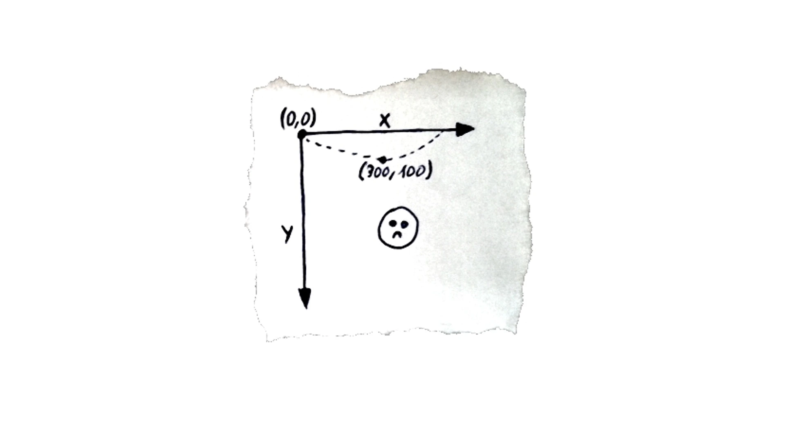
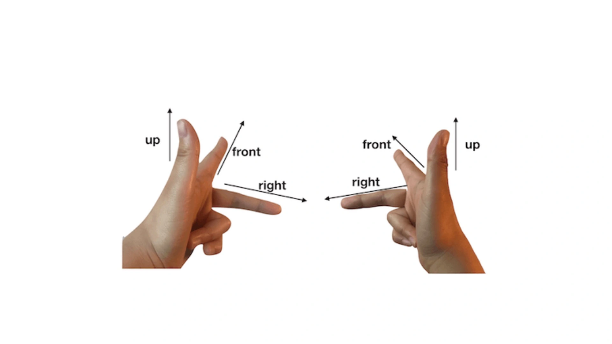

## 02 | 指令式绘图系统：如何用Canvas绘制层次关系图？

在可视化项目中，Canvas能够帮助我们将数据内容以几何图形的形式，非常方便地呈现出来。

Canvas绘制基本几何图形的方法

如何用它的2D上下文来完成绘图；通过调用一些常用的API来讲清楚，Canvas2D能做什么、要怎么使用，以及它的局限性是什么。

### 如何用Canvas绘制几何图形？

例子：绘制一个红色正方形

#### 1. Canvas元素和2D上下文

对浏览器来说，Canvas也是HTML元素，可以用Canvas标签将它插入到HTML内容中。如：插入一个宽、高分别为512的Canvas元素

```html
<canvas width="512" height="512"></canvas>
```

注意：CSS属性中的宽高影响Canvas在页面上呈现的大小，而HTML属性中的宽高则决定了Canvas的坐标系。为了区分它们，下文称Canvas的HTML属性宽高为**画布宽高**，CSS属性宽高为**样式宽高**。

如果不设置Canvas元素的样式，那么Canvas元素的画布宽高就会等于它的样式宽高的像素值，即512px。

如果此时通过CSS设置其他的值指定了Canvas的样式宽高；比如，将样式宽高设置成256px，那么它实际的画布宽高就是样式宽高的两倍了。

```css
canvas {
  background: #eee;
  width: 256px;
  height: 256px;
}
```

**画布宽高决定了可视区域的坐标范围**，所以Canvas将画布宽高和样式宽高分开的做法，能更方便地适配不同的显式设备。

如果Canvas的坐标范围（画布宽高）跟着样式宽高变化，那么当屏幕尺寸改变的时候，就要重新计算需要绘制的所有图形的坐标。

#### 2. Canvas的坐标系

**默认左上角为坐标原点，X轴水平向右，Y轴垂直向下。**

在设置好的画布宽高为512 x 512的Canvas画布中，它的左上角坐标值为`(0, 0)`，右下角坐标值为`(512, 512)`。这意味着，坐标`(0, 0)`到`(512, 512)`之间的所有图形，都会被浏览器渲染到画布上。

注意：这个坐标系的Y轴向下，意味着这个坐标系和笛卡尔坐标系不同，它们的Y轴是相反的。

如果我们想绘制一个向右上平抛小球的动画，它的抛物线轨迹，在Canvas上绘制出来的方向就是向下凹的。



如果再考虑旋转或者三维运动，这个坐标系就会变成”左手系“。左手系的平面法向量的方向和旋转方向，和我们熟悉的右手系相反。



#### 3. 利用Canvas绘制几何图形

具体的步骤可以分为两步，分别是获取Canvas上下文和利用Canvas上下文绘制图形。

* **第一步，获取Canvas上下文**

  首先是获取Canvas元素；

  然后通过getContext方法拿到它的上下文对象。具体操作是，调用canvas.getContext传入参数'2d'

  ```javascript
  // 获取canvas元素
  const canvas = document.querySelector('canvas');
  // 获取2D绘图上下文对象
  const context = canvas.getContext('2d');
  ```

* **第二步，用Canvas上下文绘制图形**

  context对象上有许多API，大体可以分为两类：

  * 一类是**设置状态的API**

    可以设置或改变当前的绘图状态；比如：绘制图形的颜色、线宽、坐标变换等

  * 另一类是**绘制指令API**

    用于绘制不同形状的几何图形

  **那如何使用这些API呢？**例子：在画布的中心位置绘制一个100 x 100的红色正方形。

  * 首先，通过计算得到Canvas画布的中心点。

    画布的中心点坐标是`(0.5*canvas.width, 0.5*canvas.height)`。

  * 要绘制一个100 x 100的正方形，其对应的Canvas指令是：

    ```javascript
    context.rect(0.5*canvas.width, 0.5*canvas.height, 100, 100);
    ```

    `context.rect`是绘制矩形的Canvas指令，它的四个参数分别表示要绘制的矩形的x、y坐标和宽高。

  * 在实际绘制之前，还需要做一些工作

    将正方形填充成红色，通过调用`context.fillStyle`指令来完成；

    调用`beginPath`指令，告诉Canvas现在绘制的路径；

    然后才是调用`rect`指令完成绘图；

    最后，调用`fill`指令，将绘制的内容真正输出到画布中。至此就完成了绘制一个红色的正方形。

    ```javascript
    const rectSize = [100, 100];
    context.fillStyle = 'red'; // 设置填充颜色
    context.beginPath(); // 告诉Canvas现在绘制的路径。准备绘制一个新的形状路径开始
    context.rect(0.5*canvas.width, 0.5*canvas.height, ...rectSize); // 完成绘图
    context.fill(); // 输出到画布中
    ```

    此时，正方形并没有居于画布的正中心，这是为什么呢？

    这是因为`rect`指令的x、y的值表示的是，要绘制的矩形的左上角坐标而不是中心点坐标。

    **那该如何将正方形的中心点放在画布的中心呢？**这需要移动一下图形中心的坐标，具体的实现方法有两种：

    * 第一种做法，让`rect`指令的x、y参数，等于画布宽高的一半分别减去矩形自身宽高的一半。

      ```javascript
      context.rect(0.5*(canvas.width - rectSize[0]), 0.5*(canvas.height - rectSize[1]), ...rectSize);
      ```

    * 第二种做法，先给画布设置一个平移变换（translate），然后再进行绘制。

      ```javascript
      context.translate(-0.5 * rectSize[0], -0.5 * rectSize[1]); 
      context.rect(0.5*canvas.width, 0.5*canvas.height, ...rectSize);
      ```

      上述代码给画布设置了一个平移，平移距离为矩形宽高的一半，这样它的中心点就是画布的中心了。

    **这两种方法都能将图形绘制到画布的中心，那该怎么选择呢？以下是两种方式各自的优缺点**：

    * 第一种方式

      【优点】很简单。

      【缺点】因为改变的是顶点的坐标位置，如果绘制的不是矩形，而是很多顶点的多边形，就需要在绘图前重新计算出每个顶点的位置，这会非常麻烦。

    * 第二种方式

      是对Canvas画布的整体做一个平移操作

      【优点】只需要获取中心点与左上角的偏移，然后对画布设置translate变换就可以了。

      【缺点】改变了画布的状态；如果后续还有其他的图形需要绘制，一定要记得把画布状态恢复回来

    **那怎么把画布状态恢复回来呢？**

    有两种方式：

    * 第一种：反向平移

      ```javascript
      // 平移
      context.translate(-0.5 * rectSize[0], -0.5 * rectSize[1]);
      // 绘制操作，比如：
      context.rect(0.5*canvas.width, 0.5*canvas.height, ...rectSize);
       // 反向平移
      context.translate(0.5 * rectSize[0], 0.5 * rectSize[1]);
      // 绘制操作，比如：
      context.rect(0.5*canvas.width, 0.5*canvas.height, ...rectSize);
      ```

    * 第二种：使用Canvas上下文提供的save和restore方法

      暂存和恢复画布某个时刻的状态。

      restore指令可以将状态恢复成save指令前的设置。比如：

      ```javascript
      // 暂存后续设置的画布状态
      context.save();
      context.translate(-0.5 * rectSize[0], -0.5 * rectSize[1]);
      context.rect(0.5*canvas.width, 0.5*canvas.height, ...rectSize);
      // 将画布状态恢复成save指令前的设置
      context.restore();
      context.rect(0.5*canvas.width, 0.5*canvas.height, ...rectSize);
      ```

  至此，就完成了将一个红色正方形绘制到画布中心的操作。

回顾一下利用Canvas绘制矩形的过程，总结为5个步骤：

1. 获取Canvas对象，通过`getContext('2d')`得到2D上下文
2. 设置绘图状态，比如填充颜色、平移变换等
3. 调用`beginPath`指令开始绘制图形
4. 调用绘制指令；比如rect、表示绘制矩形
5. 调用fill指令，将绘制内容输出到画布上

除此之外，Canvas上下文还提供了更多丰富的API，可以用来绘制直线、多边形、弧线、圆、椭圆、扇形和贝塞尔曲线等等。


### 如何用Canvas绘制层次关系图？

例子：**利用Canvas给一组城市数据绘制一个层次关系图**

即，在一组给出的层次结构数据中，体现出同属于一个省的城市。

#### 一个概念

层次结构数据（Hierarchy Data），用来表示能够体现层次结构的信息。

一般来说，层次结构数据用层次关系图来呈现。

以下城市数据是一组JSON格式的数据：

```json
{
  "name":"中国",
  "children":
  [
    { 
      "name":"浙江" , 
        "children":
        [
            {"name":"杭州" },
            {"name":"宁波" },
            {"name":"温州" },
            {"name":"绍兴" }
        ] 
      },
    { 
      "name":"广西" , 
      "children":
      [
        {"name":"桂林"},
        {"name":"南宁"},
        ...
    }
  ]
}
```

#### 如何做

* 首先，要**从数据源获取JSON数据**

  ```javascript
  const dataSource = 'https://s5.ssl.qhres2.com/static/b0695e2dd30daa64.json';
  (async function() {
    const data = await (await fetch(dataSource)).json();
    // ...
  }());
  ```

  这份JSON数据中只有”城市 > 省份 > 中国“这样的层级数据，我们要将它与绘图指令建立联系。

  建立联系指的是，要把数据的层级、位置和要绘制的圆的半径、圆心坐标一一对应起来。

* **把数据转换成图形信息**

  可以直接使用[d3-hierarchy](https://github.com/d3/d3-hierarchy)这个工具库转换数据。

  ```javascript
  (async function() {
    const data = await (await fetch(dataSource)).json();
    const regions = d3.hierarchy(data)
     .sum(d => 1)
     .sort((a, b) => b.value - a.value);
    
    const pack = d3.pack()
      .size([1600, 1600])
      .padding(3);
    
    const root = pack(regions);
    // ...
  }());
  ```

  具体转换实现暂时不管，只需知道，我们可以用`d3.hierarchy(data).sum(...).sort(...)`将省份数据按照包含城市的数量，从多到少排序就可以了。

  此时假设，要将它们展现在一个画布宽高为1600 x 1600的Canvas中，我们可以通过`d3.pack()`将数据映射为一组1600宽高范围内的圆形；为了展示得美观一些，代码中在每个相邻的圆之间还保留3个像素的padding。

  至此，就获得了包含几何图形信息的数据对象，内部结构如下所示：

  ```json
  {
    data: {name: '中国', children: [...]},
    children: [
      {
        data: {name: '江苏', children: [...]},
        value: 7,
        r: 186.00172579386546,
        x: 586.5048250548921,
        y: 748.2441892254667,
      }
      ...
    ],
    value: 69,
    x: 800,
    y: 800,
    r: 800,
  }
  ```

  数据中的x、y、r，是前面调用`d3.hierarchy`帮我们算出来的。接下来只需要用Canvas将它们绘制出来就可以了。

* **绘制**

  只需要遍历数据并且根据数据内容绘制圆弧

  * 第一步：在当前数据节点绘制一个圆，圆可以使用arc指令来绘制。

    arc方法接收5个参数，分别是圆心的x、y坐标、半径r、起始角度和结束角度。前三个参数就是数据中的x、y和r，因为绘制的是整圆，所以后两个参数中起始角是0，结束角是2*PI。

  * 第二步：绘制圆之后，判断该数据节点是否有下一级数据

    如果有，就遍历它的下一级数据，并递归对这些数据调用绘图过程；

    否则，说明当前数据为城市数据，那么就直接给出城市的名字，可以通过`fillText`指令来完成。

  具体代码如下所示：

  ```javascript
  const canvas = document.querySelector('canvas');
  const context = canvas.getContext('2d');
  
  const dataSource = 'https://s5.ssl.qhres2.com/static/b0695e2dd30daa64.json';
  (async function() {
    // ...
    const root = pack(regions);
    
    const TAU = 2 * Math.PI;
    function draw(ctx, node, {fillStyle = 'rgba(0, 0, 0, 0.2)', textColor = 'white'} = {}) {
      const children  = node.children;
      const {x, y, r} = node;
      ctx.fillStyle = fillStyle;
      ctx.beginPath();
      ctx.arc(x, y, r, 0, TAU);
      ctx.fill();
      if(children) {
        for (let i = 0; i < children.length; i ++) {
          draw(ctx, children[i]);
        }
      } else {
        const name = node.data.name;
        ctx.fillStyle = textColor;
        ctx.font = '1.5rem Arial';
        ctx.textAlign = 'center';
        ctx.fillText(name, x, y);
      }
    }
  
    draw(context, root);
  }());
  ```

至此，就用Canvas绘图简单地实现了一个层次关系图。

[demo](https://codepen.io/yeying0827/pen/KKbNRgv)


### Canvas有哪些优缺点？

要想灵活使用Canvas，还需要从宏观层面了解，它能做什么，不能做什么。

【优点】

首先，Canvas是一个**非常简单易用**的图形系统。通过一组简单的绘图指令，就能够方便快捷地绘制出各种复杂的几何图形。

另外，Canvas**渲染起来相当高效**。即使是绘制大量轮廓非常复杂的几何图形，Canvas也只需要调用一组简单的绘图指令就能高性能地完成渲染。这与Canvas更偏向于渲染层，能够提供底层的图形渲染API有关。

【缺点】

Canvas在HTML层面上是一个独立的画布元素，所以所有的绘制内容都是在Canvas内部通过绘图指令来完成的，绘制出的图形对于浏览器来说，只是Canvas中的一个个像素点，我们很难直接抽取其中的图形对象进行操作（比如绑定用户事件）。


### 要点总结

要掌握的重点内容：

* 利用Canvas绘制几何图形，这个过程很简单，但有3点需要注意

  * 在HTML中建立画布时，要分别设置画布宽高和样式宽高

  * 注意Canvas的坐标系和笛卡尔坐标系在Y轴上是相反的

  * 如果要把矩形绘制在画布中心，不能直接让x、y的坐标等于画布中心坐标，而是要让图形中心和画布中心的位置重叠。

    可以通过计算顶点坐标或者平移变换来实现

* 利用Canvas展示数据的层级关系

  应当先处理数据，将数据内容与绘图指令建立映射关系；

  然后遍历数据，通过映射关系将代表数据内容的参数传给绘图指令；

  最后将图形绘制到Canvas上。

* Canvas的优缺点

  * 【优点】简单易操作和高效的渲染能力
  * 【缺点】不能方便地控制它内部的图形元素

* 补充

  如果要使用Canvas绘制动态的图形也很简单，可以通过clearRect指令，将之前的图形擦除，再把新的图形绘制上去即可。


### 小试牛刀

* 在画布的中心位置显示一个三角形、椭圆或五角星

  ```javascript
  // 椭圆
  const canvas = document.querySelector('canvas');
  const ctx = canvas.getContext('2d');
  
  ctx.fillStyle = "orange";
  ctx.beginPath();
  ctx.ellipse(0.5 * canvas.width, 0.5 * canvas.height, 200, 150, 0, 0, 2 * Math.PI);
  ctx.fill();
  
  // 三角形
  const canvas = document.querySelector('canvas');
  const ctx = canvas.getContext('2d');
  
  const edge = 200;
  ctx.fillStyle = "red";
  ctx.beginPath();
  ctx.save();
  ctx.translate(0.5*canvas.width, 0.5*canvas.height); // 更改原点
  ctx.moveTo(0, edge * Math.cos(60) / 2); // 最高顶点（不懂为啥Y轴值不是负数）
  ctx.lineTo(100, -edge * Math.cos(60) / 2);
  ctx.lineTo(-100, -edge * Math.cos(60) / 2);
  ctx.fill();
  // ctx.stroke();
  ctx.restore();
  
  // 五角星
  // 思路：两个圆取五个点
  const canvas = document.querySelector('canvas');
  const ctx = canvas.getContext('2d');
  
  const R = 250;
  const r = 130;
  const convertAngle = (deg) => deg * Math.PI / 180;
  const outPoints = [
    [0, - R],
    [R * Math.cos(convertAngle(18)), - R * Math.sin(convertAngle(18))],
    [R * Math.sin(convertAngle(36)), R * Math.cos(convertAngle(36))],
    [- R * Math.sin(convertAngle(36)), R * Math.cos(convertAngle(36))],
    [- R * Math.cos(convertAngle(18)), - R * Math.sin(convertAngle(18))]
  ];
  const innerPoints = [
    [r * Math.sin(convertAngle(36)), -r * Math.cos(convertAngle(36))],
    [r * Math.cos(convertAngle(18)), r * Math.sin(convertAngle(18))],
    [0, r],
    [- r * Math.cos(convertAngle(18)), r * Math.sin(convertAngle(18))],
    [- r * Math.sin(convertAngle(36)), -r * Math.cos(convertAngle(36))]
  ];
  ctx.fillStyle = 'red';
  ctx.beginPath();
  ctx.translate(0.5 * canvas.width, 0.5 * canvas.height);
  ctx.moveTo(...outPoints[0]);
  ctx.lineTo(...innerPoints[0]);
  for (let i = 1; i < 5; i ++) {
    ctx.lineTo(...outPoints[i]);
    if (innerPoints[i].length > 0) ctx.lineTo(...innerPoints[i]);
  }
  ctx.closePath();
  ctx.stroke();
  ```

* 尝试给前面绘制的层次关系图增加鼠标的交互，让鼠标指针在移动到某个城市所属的圆的时候，这个圆显示不同的颜色（提示：可以获取鼠标坐标，然后用这个坐标到圆心的距离来判断。

  [codepen](https://codepen.io/yeying0827/pen/KKbNRgv?editors=0110)