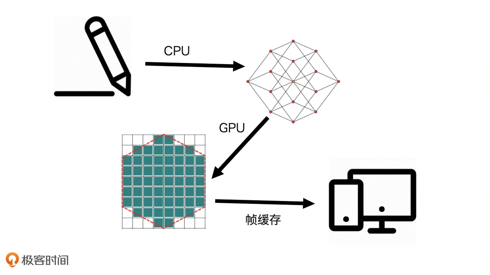

## 04 | GPU与渲染管线：如何用WebGL绘制最简单的几何图形？

WebGL难学的两个原因：

第一，WebGL技术本身就是用来解决最复杂的视觉呈现的；

第二，WebGL相对于其他图形系统来说，是一个更“开放“的系统

要使用WebGL绘图，必须深入细节里。即，必须要和内存、GPU打交道，真正控制图形输出的每一个细节。


### 图形系统是如何绘图的？

计算机图形系统的主要组成部分，以及它们在绘图过程中的作用

一个通用计算机图形系统主要包括6个部分，分别是输入设备、中央处理单元、图形处理单元、存储器、帧缓存和输出设备。

这些设备在可视化中的作用：

* 光栅（Raster）

  几乎所有的现代图形系统都是基于光栅来绘制图形的；光栅就是指**构成图像的像素阵列**。

* 像素（Pixel）

  一个像素对应图像上的一个点；通常**保存图像上的某个具体位置的颜色等信息**

* 帧缓存（Frame Buffer）

  在绘图过程中，像素信息被存放于帧缓存中；帧缓存是**一块内存地址**。

* CPU（Central Processing Unit）

  中央处理单元，**负责逻辑计算**

* GPU（Graphics Processing Unit）

  图形处理单元，**负责图形计算**


一个典型的绘图过程：

* 首先，数据经过CPU处理，**成为具有特定结构的几何信息**
* 然后，这些信息会被送到GPU中进行处理；在GPU中要经过两个步骤**生成光栅信息**
* 光栅信息输出到帧缓存中
* 渲染到屏幕上



这个绘图过程是现代计算机中任意一种图形系统**处理图形的通用过程**。

它主要做了两件事：

一，对给定的数据结合绘图的场景要素（如相机、光源、遮挡物体等）进行计算，最终将图形变为屏幕空间的2D坐标；

二，为屏幕空间的每个像素点进行着色，把最终完成的图形输出到显示设备上。

前一步的输出就是后一步的输入，所以这个过程也叫做**渲染管线**（RenderPipelines）。

在这个过程中，CPU与GPU是最核心的两个处理单元，它们参与了计算的过程。


### GPU是什么？

CPU和GPU都属于处理单元，但是结构不同。

CPU像个大的工业管道，等待处理的任务就像是依次通过这个管道的货物。

实际上，一个计算机系统会有很多条CPU流水线，而且任何一个任务都可以随机地通过任意一个流水线，这样计算机就能够并行处理多个任务了。这样的一条流水线就是我们常说的线程（Thread）。

**处理图像应用，实际上就是在处理图片上的每一个像素点的颜色和其他信息**；每处理一个像素点就相当于完成了一个简单的任务，而一个图片应用又是由成千上万个像素点组成的，所以，我们需要在同一时间处理成千上万个小任务。

要处理这么多的小任务，比起使用若干个强大的CPU，使用更小、更多的处理单元，是一种更好的处理方式；而GPU就是这样的处理单元。

GPU是**由大量的小型处理单元构成**的，它可能远远没有CPU那么强大，但胜在数量众多，可以保证每个单元处理一个简单的任务。这样就可以**同时**对每个像素点进行计算了。

那GPU究竟是怎么完成像素点计算的呢？


### 如何用WebGL绘制三角形？

浏览器提供的WebGL API是OpenGL ES的JavaScript绑定版本，它赋予了开发者操作GPU的能力。

WebGL的绘图方式和其他图形系统的”开箱即用“的绘图方式完全不同，可以总结为以下5个步骤：

1. 创建WebGL上下文
2. 创建WebGL程序（WebGL Program）
3. 将数据存入缓冲区
4. 将缓冲区数据读取到GPU
5. GPU执行WebGL程序，输出结果

例子：绘制一个三角形

#### 步骤一：创建WebGL上下文

只要调用canvas元素的getContext即可，参数传入webgl。

```javascript
const canvas = document.querySelector('canvas');
const gl = canvas.getContext('webgl');
```

#### 步骤二：创建WebGL程序

这里的WebGL程序是一个WebGL Program对象，它是给GPU最终运行着色器的程序。

* **首先，要创建这个WebGL程序，需要编写两个着色器（Shader）**

  着色器是用GLSL这种编程语言编写的代码片段

  ```javascript
  // 1. 编写着色器
  const vertex = `
    attribute vec2 position;
    
    void main() {
      gl_PointSize = 1.0;
      gl_Position = vec4(position, 1.0, 1.0);
    }
  `;
  const fragment = `
    precision mediump float;
    
    void main() {
      gl_FragColor = vec4(0.0, 0.0, 1.0, 1.0);
    }
  `;
  ```

  **绘图的时候，WebGL是以顶点和图元来描述几何图形的信息的**。顶点就是几何图形的顶点；图元是WebGL可直接处理的图形单元，由WebGL的绘图模式决定，有**点、线、三角形**等等。

  WebGL绘制一个图形的过程，一般需要用到两段着色器，一段叫顶点着色器（Vertex Shader）负责处理图形的顶点信息；另一段叫片元着色器（Fragment Shader）负责处理图形的像素信息。

  可以把**顶点着色器理解为处理顶点的GPU程序代码**；它可以改变顶点的信息（如顶点的坐标、法线方向、材质等等），从而改变我们绘制出来的图形的形状或者大小等等。

  顶点处理完成之后，**WebGL就会根据顶点和绘图模式指定的图元，计算出需要着色的像素点**，然后对它们执行片元着色器程序；简单来说，就是对指定图元中的像素点着色。

  WebGL从顶点着色器和图元提取像素点的过程，就是生成光栅信息的过程，也叫做光栅化过程。所以，**片元着色器的作用，就是处理光栅化后的像素信息**。

  假设，将图元设为线段，那么片元着色器就会处理顶点之间的线段上的像素点信息；如果把图元设为三角形，那么片元着色器就会处理三角形内部的所有像素点。

  **注意：**因为图元是WebGL可以直接处理的图形单元，所以其他非图元的图形最终必须要转换为图元才可以被WebGL处理。

  **片元着色器对像素点着色的过程，是并行的**；即，无论有多少个像素点，片元着色器都可以同时处理。这也是片元着色器一大特点。

  创建着色器的目的是为了创建WebGL程序，那要如何用顶点着色器和片元着色器代码，来创建WebGL程序呢？

* **创建Shader对象**

  因为在JavaScript中，顶点着色器和片元着色器只是一段代码片段，所以要将它们分别创建成Shader对象。

  ```javascript
  // 2. 创建shader对象
  const vertexShader = gl.createShader(gl.VERTEX_SHADER); // 创建shader对象
  gl.shaderSource(vertexShader, vertex); // 把着色器代码传给shader对象
  gl.compileShader(vertexShader); // 编译shader对象
  
  const fragmentShader = gl.createShader(gl.FRAGMENT_SHADER);
  gl.shaderSource(fragmentShader, fragment);
  gl.compileShader(fragmentShader);
  ```

* **创建WebGL Program对象**

  并将两个Shader关联到这个WebGL Program对象上。

  WebGL Program对象的创建过程，主要是添加vertexShader和fragmentShader，然后将这个WebGL Program对象链接到WebGL上下文对象上。

  ```javascript
  // 3. 创建program对象并链接到WebGL上下文对象上
  const program = gl.createProgram();
  gl.attachShader(program, vertexShader); // 将shader关联到WebGL program对象上
  gl.attachShader(program, fragmentShader);
  gl.linkProgram(program);
  ```

* **启用WebGL Program对象**

  通过useProgram选择启用这个WebGL Program对象。

  ```javascript
  // 4. 启用program对象
  // 启用之后，当绘制图形时，GPU就会执行设定的两个shader程序了
  gl.useProgram(program);
  ```

  启用之后，绘制图形时，GPU就会通过WebGL Program执行两个Shader程序了。

至此，创建并完成了WebGL程序的配置。

接下来，只要将三角形的数据存入缓冲区，就能将这些数据送入GPU了。

#### 步骤三：将数据存入缓冲区

WebGL的坐标系是一个三维空间坐标系，坐标原点是`(0, 0, 0)`；其中，X轴朝右，Y轴朝上，Z轴朝外。是一个右手坐标系。

假设，要在这个坐标系上显示一个顶点坐标分别是`(-1, -1)`，`(1, -1)`，`(0, 1)`的三角形。因为是二维的，可以直接忽略Z轴。

* **首先，定义三角形的三个顶点**

  WebGL使用的数据需要用TypedArray定义，默认格式是Float32Array。

  JavaScript通常用TypedArray来处理二进制缓冲区。

  ```javascript
  // 1. 定义三角形的三个顶点
  // 定义三角形顶点的过程，就是使用三角形顶点数据数组new一个Float32Array对象
  const points  = new Float32Array([
    -1, -1,
    0, 1,
    1, -1,
  ]);
  ```

* 接着，将定义好的数据写入WebGL的缓冲区

  * 创建一个缓存对象
  * 将其绑定为当前操作对象
  * 把当前的数据写入缓存对象

  ```javascript
  // 2. 将定义好的数据写入WebGL缓冲区
  const bufferId = gl.createBuffer(); // 创建buffer对象
  gl.bindBuffer(gl.ARRAY_BUFFER, bufferId); // 将buffer对象绑定为当前操作对象
  gl.bufferData(gl.ARRAY_BUFFER, points, gl.STATIC_DRAW); // 把当前数据写入缓存对象
  ```

#### 步骤四：将缓冲区数据读取到GPU

Shader此时还不能读取数据，还需要把数据绑定给顶点着色器中的position变量。

```glsl
attribute vec2 position;
  
void main() {
  gl_PointSize = 1.0;
  gl_Position = vec4(position, 1.0, 1.0);
}
```

在GLSL中，attribute表示声明变量，vec2是变量的类型，它表示一个二维向量，position是变量名。

以下，将buffer的数据绑定给顶点着色器的position变量

```javascript
const vPosition = gl.getAttribLocation(program, 'position'); // 获取顶点着色器中position变量的地址
// 创建一个指向调用gl.bindBuffer()指定的缓冲区的指针，并把它保存在vPosition中，在后面由顶点着色器使用
gl.vertexAttribPointer(vPosition, 2, gl.FLOAT, false, 0, 0); // 给变量设置长度和类型
gl.enableVertexAttribArray(vPosition); // 激活变量
```

经过上述处理，在顶点着色器中，就能通过变量position读取到points类型数组中对应的值。

#### 步骤五：执行着色器程序完成绘制

把数据传入缓冲区之后，GPU就可以读取数据到着色器变量了。

接下来，只需**调用绘图指令，就可以执行着色器程序来完成绘制了**。

先调用`gl.clear`将当前画布的内容清除，然后调用`gl.drawArrays`传入绘制模式。

此处选择`gl.TRIANGLES`表示以三角形为图元绘制，再传入绘制的顶点偏移量和顶点数量；WebGL会将对应的buffer数组传给顶点着色器，并且开始绘制。

```javascript
gl.clear(gl.COLOR_BUFFER_BIT); // 将当前画布的内容清除
gl.drawArrays(gl.TRIANGLES, 0, points.length / 2); // 以三角形为图元绘制，顶点偏移量和顶点数量
```

**至此，就在canvas画布上绘制了一个红色三角形。**

显示红色，是因为在**片元着色器**中定义了像素点的颜色。

```glsl
precision mediump float;
  
void main() {
  gl_FragColor = vec4(1.0, 0.0, 0.0, 1.0);
}
```

在片元着色器里，可以通过设置`gl_FragColor`的值来定义和改变图形的颜色。

`gl_FragColor`是WebGL片元着色器的内置变量，表示当前像素点颜色，它是一个用RGBA色值表示的四维向量数据。

`vec4(1.0, 0.0, 0.0, 1.0)`是红色，改成`vec4(0.0, 0.0, 1.0, 1.0)`就变成蓝色

这里只更改一个值，就把整个图片的所有像素点颜色都改变了；所以必须认识到一点，WebGL可以并行地对整个三角形的所有像素点同时运行片元着色器。**并行处理**是WebGL程序非常重要的概念。

不论三角形是大是小，有几十个像素点还是上百万个像素点，GPU都是**同时处理**每个像素点的。


### 顶点着色器的作用

顶点着色器大体上可以总结为两个作用：

一是，通过`gl_Position`设置顶点；

二是，通过定义varying变量，向片元着色器传递数据。

#### 1. 通过gl_Position设置顶点

假设，要把三角形的周长缩小为原始大小的一半，有两种处理方法：

一种是，修改points数组的值；

另一种做法是，直接对顶点着色器数据进行处理。

第二种做法具体操作：不需要修改points数据，只需在顶点着色器中，将`gl_Position = vec4(position, 1.0, 1.0)`修改为`gl_Position = vec4(position * 0.5, 1.0, 1.0)`。

```glsl
attribute vec2 position;
  
void main() {
  gl_PointSize = 1.0;
  gl_Position = vec4(position * 0.5, 1.0, 1.0);
}
```

在这个过程中，我们不需要遍历三角形的每一个顶点，只需**利用GPU的并行特性**，在顶点着色器中同时计算所有的顶点就可以了。

#### 2. 向片元着色器传递数据

顶点着色器还可以将数据通过varying变量传给片元着色器。

这些值会根据片元着色器的像素坐标与顶点像素坐标的相对位置做**线性插值**。

🌰：

```glsl
attribute vec2 position;
varying vec3 color;
  
void main() {
  gl_PointSize = 1.0;
  color = vec3(0.5 + position * 0.5, 0.0);
  gl_Position = vec4(position, 1.0, 1.0);
}
```

这段代码中，定义了一个color变量，它是一个三维向量；通过数学技巧将顶点的值映射为一个RGB颜色值，映射公式是`vec3(0.5 + position * 0.5, 0.0)`。

这样，顶点[-1, -1]被映射为[0, 0, 0]也就是黑色；顶点[0, 1]被映射为[0.5, 1, 0]即浅绿色；顶点[1,-1]被映射为[1, 0, 0]也就是红色。三个顶点会有三个不用的颜色。

再将color通过varying变量传给片元着色器。代码如下：

```glsl
precision mediump float;
varying vec3 color;
  
void main() {
  // gl_FragColor = vec4(0.0, 0.0, 1.0, 1.0);
  gl_FragColor = vec4(color, 1.0); 
}
```

此时，就变成了一个颜色均匀（线性）渐变的三角形；中间像素点的颜色是均匀过渡的。这就是因为**WebGL在执行片元着色器程序的时候，顶点着色器传给片元着色器的变量，会根据片元着色器的像素坐标对变量进行线性插值**。

利用线性插值可以让像素点的颜色均匀渐变


想要利用WebGL绘制更有趣、更复杂的图形，就必须学会绘制三角形这个图元。（要在WebGL中绘制非图元的其他图形时，必须要把它们划分成三角形才行。）


### 要点总结

WebGL图形系统与其他图形系统不同，它的API非常底层，使用起来比较复杂。必须从**基础概念和原理**学起

一般来说，在WebGL中要完成图形的绘制，需要创建WebGL程序，然后将图形的几何数据存入数据缓冲区，在绘制过程中让WebGL从缓冲区读取数据，并且执行着色器程序。

**WebGL程序有一个非常重要的特点就是能够并行处理**；无论图形中有多少个像素点，都可以通过着色器程序在GPU中被同时执行。

以下是一个[流程图](https://juejin.cn/post/6844904112157360136)：


### 小试牛刀

1. 绘制空心三角形，应该怎么做？

   `gl.LINES`（线段）、`gl.LINE_STRIP`（线条），`gl.LINE_LOOP`（回路）

   1. LINE_STRIP

   ```javascript
   const points  = new Float32Array([
     -1, -1,
     0, 1,
     1, -1,
     -1, -1,
   ]); // 四个顶点
   // ...
   gl.drawArrays(gl.LINE_STRIP, 0, points.length / 2);
   ```

   2. LINES

    ```javascript
    const points  = new Float32Array([
      -1, -1,
      0, 1, // 第一条线段
      0, 1,
      1, -1, // 第二条线段
      1, -1,
      -1, -1, // 第三条线段
    ]);
    // ...
    gl.drawArrays(gl.LINES, 0, points.length / 2);
    ```

   3. LINE_LOOP

   ```javascript
   gl.drawArrays(gl.LINE_LOOP, 0, points.length / 2);
   ```

2. 试着用WebGL绘制正四边形、正五边形和正六角星

   https://codepen.io/yeying0827/pen/gOZRPXq

   


