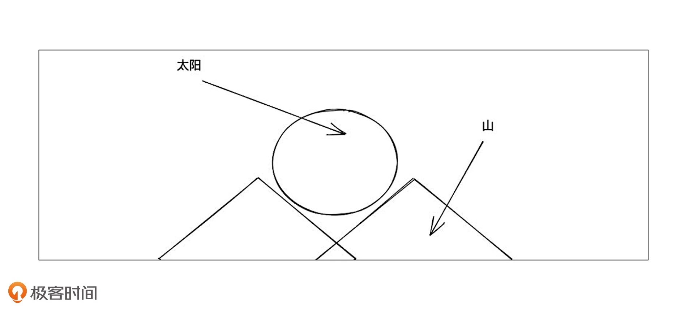
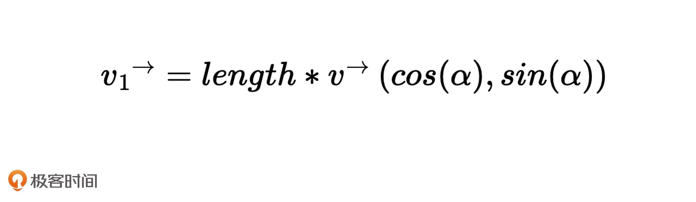
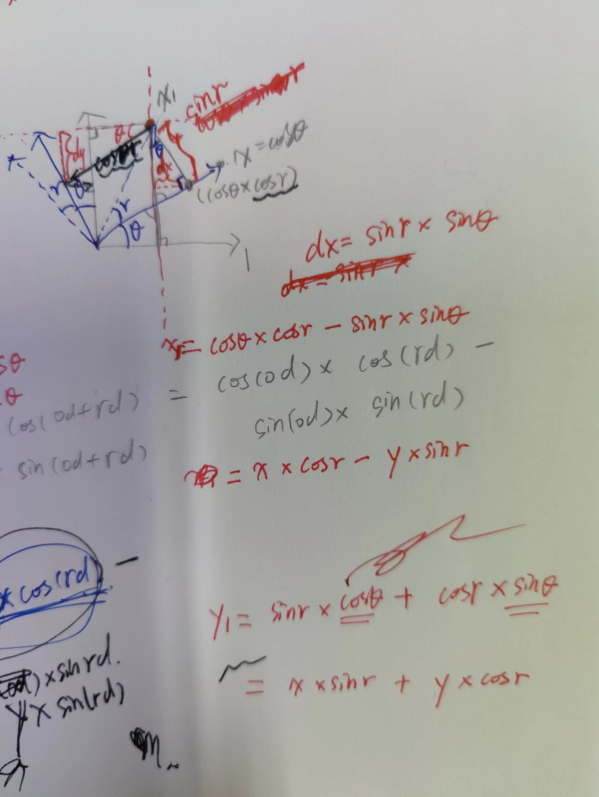
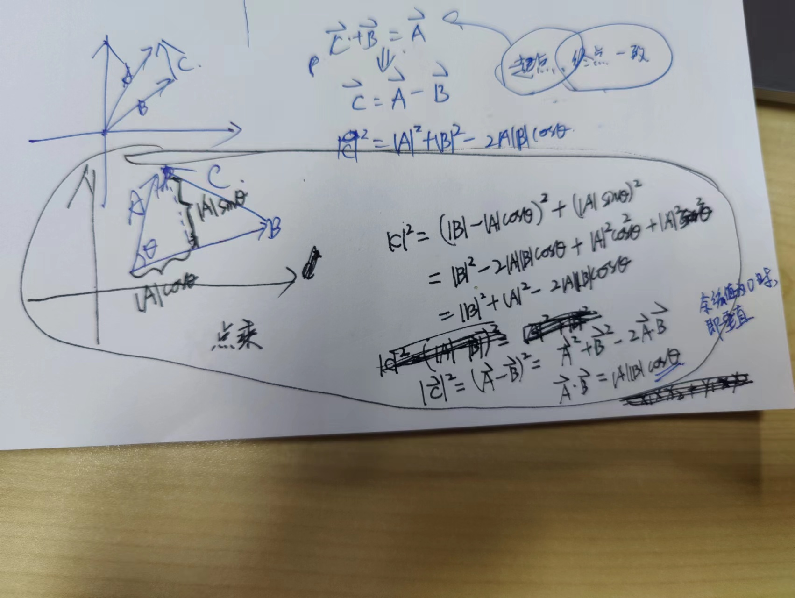
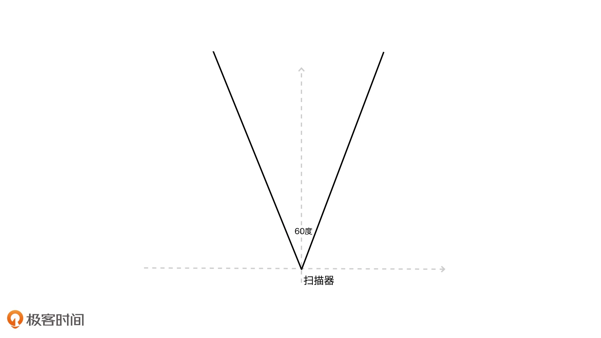

## 05 | 如何用向量和坐标系描述点和线段？

如果我们使用不同的绘图系统，每个绘图系统可能有独特的方式或者特定的API，去解决某个或某类具体的问题。

**如果我们手中只有解决具体问题的工具，没有统一的方法论，那我们也无法一劳永逸地解决问题的根本**。

因此，我们要**建立一套与各个图形系统无关联的、简单的基于向量和矩阵运算的数学体系，用它来描述所有的几何图形信息**。即，建立一套描述几何图形信息的数学体系，以及用这个体系来解决我们的可视化图形呈现的问题。

本节内容：如何定义和变换图形的直角坐标系，如何运用向量表示点和线段

### 坐标系与坐标映射

浏览器的四个图形系统通用的坐标系：

* HTML

  窗口坐标系。

  以参考对象（通常是最接近图形元素的position非static的元素）的盒子左上角为坐标原点，X轴向右，Y轴向下，坐标值对应像素值。

* SVG

  视区盒子（viewBox）坐标系。

  默认情况下：以svg根元素左上角为坐标原点，X轴向右，Y轴向下，svg根元素右下角坐标为它的像素宽高值。

  设置了viewBox属性：svg根元素左上角为viewBox的前两个值，右下角为viewBox的后两个值。

* Canvas

  默认：以画布左上角为坐标原点，右下角坐标值为Canvas的画布宽高值。

* WebGL

  一个三维坐标系。

  默认：以画布正中间为坐标原点，X轴朝右，Y轴朝上，Z轴朝外。X轴、Y轴在画布中范围是-1到1。

尽管这四个坐标系在原点位置、坐标轴方向、坐标范围上有所区别，但都是**直角坐标系**，所以都满足直角坐标系的特性：**不管原点和轴的方向怎么变，用同样的方法绘制几何图形，它们的形状和相对位置都不变**。

为了方便处理图形，我们经常需要对坐标系进行转换；转换坐标系可以说是一个非常基础且重要的操作；正因为这四个坐标系都是直角坐标系，所以它们可以很方便地互相转化。

HTML/CSS、SVG和Canvas都提供了transform的API可以很方便地转换坐标系；WebGL本身不提供transform的API，但可以在shader里做矩阵运算来实现坐标转换。


### 如何用Canvas实现坐标系转换？

例子：在宽512 * 高256的一个Canvas画布上实现如下效果。其中，山的高度是100，底边200，两座山的中心位置到中线的距离都是80，太阳的圆心高度是150。



在不转换坐标系的情况下，也能够绘制，但需要经过顶点换算。

```javascript
// 山的高度100，底边200
// 两座山的中心位置到中线的距离都是80
const bottomCenter = [ 
  canvas.width / 2, 
  canvas.height 
];
const hillHeight = 100, hillWidth = 200;
const hill = [
  [
    [bottomCenter[0] - 80 - hillWidth / 2, bottomCenter[1]],
    [bottomCenter[0] - 80, canvas.height - hillHeight],
    [bottomCenter[0] + 20, bottomCenter[1]]
  ],
  [
    [bottomCenter[0] - 20, bottomCenter[1]],
    [bottomCenter[0] + 80, canvas.height - hillHeight],
    [bottomCenter[0] + 80 + hillWidth / 2, bottomCenter[1]]
  ]
];
// 太阳的圆心高度是150
const sunHeight = 150
const sun = [
  [bottomCenter[0], canvas.height - sunHeight]
];
```

计算出这些坐标之后，就可以将这个图画出来了。[大山和太阳1](https://codepen.io/yeying0827/pen/XWogjap)

如果每次绘制都要花费时间在坐标换算上，会非常不方便。为了解决这个问题，可以采用坐标系变换来代替坐标换算。

此处，可以给Canvas的2D上下文设置transform变换；**常用到的两个变换是：translate和scale**。

* 首先，通过translate变换将Canvas画布的坐标原点，从左上角`(0, 0)`移动到`(256, 256)`位置；即画布底边的中点位置。
* 接着，以移动原点后的新坐标为参照，通过scale(1, -1)将Y轴向下的部分，沿X轴翻转180度。

这样，坐标系就变成以画布底边中点为原点，X轴向右，Y轴向上的坐标系了。

```javascript
ctx.translate(256, 256);
ctx.scale(1, -1);
```

让坐标系原点在中间之后，就可以更方便、更直观地计算出几个图形元素的坐标了。

```javascript
// 山的高度100，底边200
// 两座山的中心位置到中线的距离都是80
const hillHeight = 100, hillWidth = 200;
const hill = [
  [
    [-180, 0],
    [-80, hillHeight],
    [20, 0]
  ],
  [
    [-20, 0],
    [80, hillHeight],
    [180, 0]
  ]
];
// 太阳的圆心高度是150
const sunHeight = 150
const sun = [
  [0, sunHeight]
];
```

现在就完成了坐标变换。[大山和太阳2](https://codepen.io/yeying0827/pen/dywRQGo)

在可视化的许多应用场景中，都要处理成百上千的图形；如果在原始坐标下通过计算顶点来绘制图形，计算量会非常大，很麻烦。采用坐标变换的方式就是一个很好的优化思路，**能够简化计算量，这不仅让代码更容易理解，也可以节省CPU运算的时间**。

直角坐标系里绘制图形的方法：**不管我们用什么绘图系统绘制图形，一般的几何图形都是由点、线段和面构成**；点和线段是基础的图元信息，因此，如何描述它们是绘图的关键。


### 如何用向量来描述点和线段？

在直角坐标系下，一般是用向量来表示一个点或者一个线段。

可以用二维向量来表示平面上的点和线段；二维向量就是一个包含了两个数值的数组，一个是X坐标值，一个是Y坐标值。

假设平面直角坐标系上有一个向量v；向量v有两个含义：

* 一是可以表示该坐标系下位于`(x, y)`处的一个点
* 二是可以表示从原点`(0, 0)`到坐标`(x, y)`的一根线段

关于向量的数学知识：

* **首先，向量和标量一样可以进行数学运算**

  🌰：两个向量v1和v2，如果让它们相加，结果相当于将v1向量的终点(x1, y1)，沿着v2向量的方向移动一段距离，这段距离等于v2向量的长度。

  这样就得到一个新的点(x1+x2, y1+y2)，一条新的线段[(0, 0), (x1+x2, y1+y2)]，以及一段折线[(0, 0), (x1, y1), (x1+x2, y1+y2)]

* **其次，一个向量包含有长度和方向信息**

  **它的长度**可以用向量的x、y的平方和的平方根来表示；即

  `v.length = function() { return Math.hypot(this.x, this.y) };`

  **它的方向**可以用与X轴的夹角来表示，即：

  `v.dir = function() { return Math.atan2(this.y, this.x) };`

  Math.atan2的取值范围是-π到π，负数表示在X轴下方，正数表示在X轴上方。

  **根据长度和方向的定义，还能推导出一组关系式**：

  `v.x = v.length * Math.cos(v.dir);`

  `v.y = v.length * Math.sin(v.dir);`

  如果我们希望以点`(x0, y0)`为起点，沿着**某个方向**画一段长度为length的线段，只需要构造出如下向量即可：

  

  此处α是与X轴的夹角，v是一个单位向量，它的长度为1。我们把向量`(x0, y0)`与这个向量v1相加，得到的就是这条线段的终点。


### 实战演练：用向量绘制一棵树

用前面的向量知识来绘制一棵随机生成的树。

用Canvas2D来绘制。

```html
<canvas width="512" height="512"></canvas>
```

```javascript
const canvas = document.querySelector('canvas');
const ctx = canvas.getContext('2d');
```

* 首先是坐标变换

  将坐标原点从左上角移动到左下角，并且让Y轴翻转向上

  ```javascript
  ctx.translate(0, canvas.height);
  ctx.scale(1, -1);
  ```

* 然后，定义一个画树枝的函数drawBranch

  ```javascript
  /**
   ** @param context Canvas2D上下文
   ** @param v0 树枝的起点坐标
   ** @param length 当前树枝的长度
   ** @param thickness 当前树枝的粗细
   ** @param dir 当前树枝的方向（与X轴的夹角，单位为弧度）
   ** @param bias 一个随机偏向因子
   */
  function drawBranch(context, v0, length, thickness, dir, bias) {
    // ...
  }
  ```

  该函数有六个参数：

  * context：是Canvas2D上下文
  * v0：是起始向量
  * length：是当前树枝的长度
  * thickness：是当前树枝的粗细
  * dir：是当前树枝的方向；用与X轴的夹角表示，单位是弧度
  * bias：是一个随机偏向因子，来让树枝的朝向有一定的随机性

  由于v0是树枝的起点坐标，根据前面向量计算的原理，我们**创建一个单位向量`(1, 0)`，它是一个朝向X轴，长度为1的向量；然后旋转dir弧度；再乘以树枝长度length；这样就能计算出树枝的终点坐标了**。代码如下：

  ```javascript
  /**
   ** @param context Canvas2D上下文
   ** @param v0 树枝的起点坐标
   ** @param length 当前树枝的长度
   ** @param thickness 当前树枝的粗细
   ** @param dir 当前树枝的方向（与X轴的夹角，单位为弧度）
   ** @param bias 一个随机偏向因子
   */
  function drawBranch(context, v0, length, thickness, dir, bias) {
    const v = new Vector2D(1, 0).rotate(dir).scale(length);
    const v1 = v0.copy().add(v);
    // ...
  }
  ```

  向量的旋转是向量的一种常见操作，对于二维空间来说，向量的旋转可以定义成如下方法：

  ```javascript
  class Vector2D extends Array {
    // ...
    rotate(rad) {
      const c = Math.cos(rad),
            s = Math.sin(rad);
      const [x, y] = this;
      
      this.x = x * c - y * s;
      this.y = x * s + y * c;
      
      return this;
    }
    // ...
  }
  ```

  

  我们可以从一个起始角度开始递归地旋转树枝，每次将树枝分叉成左右两个分枝：

  ```javascript
  function drawBranch(context, v0, length, thickness, dir, bias) {
    // ...
    if (thickness > 2) {
      const left = dir + 0.2;
      drawBranch(context, v1, length * 0.9, thickness * 0.8, left, bias * 0.9);
      const right = dir - 0.2;
      drawBranch(context, v1, length * 0.9, thickness * 0.8, right, bias * 0.9);
    }
    // ...
  }
  ```

  这样就可以得到一棵形状规则的树。

* 接着，加入随机因子，让迭代生成的新树枝有一个随机的偏转角度

  ```javascript
  function drawBranch(context, v0, length, thickness, dir, bias) {
    // ...
    if (thickness > 2) {
      const left = Math.PI / 4 + 0.5 * (dir + 0.2) + bias * (Math.random() - 0.5);
      drawBranch(context, v1, length * 0.9, thickness * 0.8, left, bias * 0.9);
      const right = Math.PI / 4 + 0.5 * (dir - 0.2) + bias * (Math.random() - 0.5);
      drawBranch(context, v1, length * 0.9, thickness * 0.8, right, bias * 0.9);
    }
    // ...
  }
  ```

  这样就可以得到一棵随机的树。

  ```javascript
  const v0 = new Vector2D(256, 0);
  drawBranch(ctx, v0, 50, 10, Math.PI / 2, 3);
  ```

* 最后，考虑美观，再随机绘制一些花瓣

  ```javascript
  function drawBranch(context, v0, length, thickness, dir, bias) {
    // ...
    
    // 随机绘制一些花瓣
    if (thickness < 5 && Math.random() < 0.3) {
      context.save();
      context.strokeStyle = "#c72c35";
      const th = Math.random() * 6 + 3;
      context.lineWidth = th;
      context.beginPath();
      context.moveTo(...v1);
      context.lineTo(v1.x, v1.y - 2);
      context.stroke();
      context.restore();
    }
  }
  ```

这里面最关键的一步就是向量的操作，实现向量的rotate、scale、add等方法。


### 向量运算的意义

实际上，在可视化项目里，直接使用向量的加法、旋转和乘法来构造线段绘制图形的情形并不多；在一般情况下，数据在传给前端的时候就已经计算好了。

但：**可视化呈现依赖于计算机图形学，而向量运算是整个计算机图形学的数学基础**。

在向量运算中，除了加法表示移动点和绘制线段外，向量的点乘、叉乘运算也有特殊的意义。


### 要点总结

一般来说，采用平面直角坐标系绘图的时候，对坐标进行平移等线性变换，并不会改变坐标系中图形的基本形状和相对位置，因此我们可以利用坐标变换让我们的绘图变得更加容易。

Canvas坐标变换经常会用到translate和scale这两个变换。

向量可以表示绘图空间中的一个点，或者连接原点的一条线段。

两个向量相加，结果相当于：将被加向量的终点沿着加数向量的方向移动一段距离，移动的距离等于加数向量的长度。利用向量的这个特性，我们就能以某个点为起点，朝任意方向绘制线段，从而绘制各种较复杂的几何图形了。


### 小试牛刀

1. 如何判断两个线段的位置关系？

   假设有两个线段l1和l2，已知它们的起点和终点分别是`[(x10, y10), (x11, y11)]`，`[(x20, y20), (x21, y21)]`，如何判断它们的关系。（提示：两个线段之间的关系有平行、垂直或既不平行也不垂直）

   **如果两个向量点乘结果为0，说明a和b两个向量夹角的余弦值为0，则两者垂直**；

   

   **如果两个向量叉乘结果为0，说明a和b夹角的正弦值为0，则两者可能平行也可能重合**（需要排除重合的情况）；

   * 叉乘就是产生和这两个向量90度垂直的第三个方向的向量，会产生一个向量 [知乎](https://www.zhihu.com/question/21080171)
   * 叉乘结果的向量垂直于“面”（两个向量形成的面），方向或内或外，表示“朝向”；叉乘结果的向量长度代表“面”的大小。（两个向量形成的平行四边形的面积）

   a x b = |a||b|sinθ。含义：θ为a和b的夹角，|b|为底边，|a|sinθ为平行四边形的高

   sinθ为0，说明两个向量平行或重合

   **其他情况既不平行也不垂直**。

2. 已知线段`[(x0, y0), (x1, y1)]`，以及一个点`(x2, y2)`，怎么求点到线段的距离

   线段AB，点P

   AP · AB = |AP|cosθ|AB|

   **AP · AB <0**，角PAB为钝角，点P到线段AB的距离即向量AP的长度|AP|

   **AP · AB > |AB|²** => |AP|cosθ > |AB|，AP在AB上的投影大于AB的长度，角PBA为钝角，点P到线段AB的距离即向量BP的长度|BP|

   **否则**，点P到线段AB的投影在线段AB上，距离为|AP x AB|/|AB|

3. 一个平面上放置了一个扫描器，方向延Y轴方向（该坐标系Y轴向上），扫描器的视角是60度。假设它可以扫描到无限远的地方，那对于平面上给定的任意一个点`(x, y)`，该如何判断这个点是否处于扫描范围内呢？

   

   **Math.atan2(y, x)**。

   < 0，在X轴下方，不在扫描范围内；

   120/180 x Math.PI <= Math.atan(y, x) <= 60/180 x Math.PI

   **向量角度**：A左边缘上一个点，B右边缘上一个点，P为待检测的点

   P的Y坐标为负数，在X轴下方，不在扫描范围内；

   |A x P|=0或|B x P|=0，说明点P在扫描边缘

   A x P > 0 或 P x B > 0，说明点P不在扫描范围内
