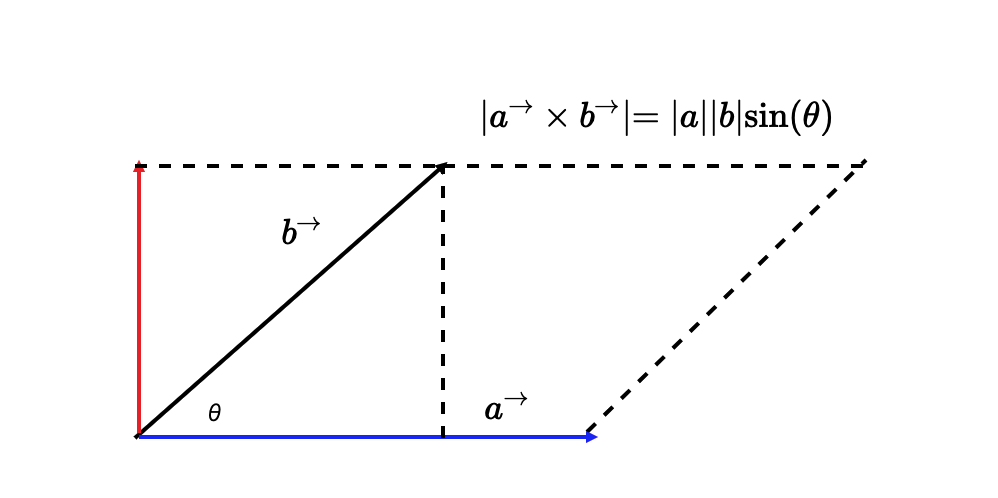

## 06 | 可视化中必须要掌握的向量乘法知识

虽然它们和如何描述曲线并没有直接的关系，但使用它们可以**计算曲线的控制点、判断曲线的方向以及对曲线进行变换**。

上节的思考题3，可以使用向量的方向来解。

```javascript
v.dir = function() { return Math.atan2(this.y, this.x); }

const isInRange = v0.dir > Math.PI / 3 && v0.dir < 2 * Math.PI / 3;
```

这是一个很简单、直观的解法，但不够完美，因为这个判断和扫描器的方向有关。

因此可以使用**一个更通用的解法，也就是利用向量的乘法来解**。

向量乘法有两种，一种是点乘，一种是叉乘，它们有着不同的几何和物理含义。

### 向量的点乘

假设现在有两个N维向量a和b，a = [a1, a2, ...an]，b = [b1, b2, ...bn]，则**求向量点积的公式代码**如下：

```javascript
a · b = a1*b1 + a2*b2 + ... + an*bn;
```

在N维线性空间中，a、b向量点积的**几何含义**，是a向量乘以b向量在a向量上的投影分量；**物理含义**，是a力作用于物体，产生b位移所做的功。

两个向量不能直接相乘，没有意义，把一个向量投影到另一个向量，使它们指向同一个方向，投影得到的向量的长度乘以被投影的向量的长度，即是点积。[向量点乘的直观理解](https://www.bilibili.com/video/av73528043/?p=17&vd_source=dc21529f29394e19497e3d50a9d3a418)

有两个比较特殊的情况需要注意：

第一种，当a、b两个向量平行时，它们的夹角是0°，那么a·b=|a|*|b|，即

```javascript
a.x * b.x + a.y * b.y === a.length * b.length;
```

第二种，当a、b两个向量垂直时，它们的夹角是90°，那么a·b=0，即

```javascript
a.x * b.x + a.y * b.y === 0;
```


### 向量的叉乘

叉乘与点乘不同，首先，**向量叉乘运算的结果不是标量，而是一个向量**；其次，**两个向量的叉积与两个向量组成的坐标平面垂直**。

以二维空间为例，向量a和b的叉积，相当于向量a（蓝色）与向量b沿垂直方向的投影（红色）的乘积。



二维向量叉积的**几何意义**，就是向量a、b组成的平行四边形的面积。

那叉乘在数学上该怎么计算呢？

假设现在有两个三维向量a(x1, y1, z1)和b(x2, y2, z2)，则a与b的叉积可以表示为如下行列式：


其中i、j、k分别是x、y、z轴的单位向量。把这个行列式展开，就能得到**求向量叉积的公式代码**如下：

```javascript
a x b = [y1*z2 - y2*z1, -(x1*z2 - x2*z1), x1*y2 - x2*y1]
```

计算这个公式，**得到的值还是一个三维向量，它的方向垂直于a、b所在平面**。

上面所说的二维空间中，向量a、b的叉积方向就是垂直纸面朝向我们的。那有什么办法可以很容易，就确定**a、b的叉积方向**呢？

举个例子：X轴向右、Y轴向下的坐标系是右手系。在右手系中求向量a、b叉积的方向时，可以把右手食指的方向朝向a，把右手中指的方向朝向b，那么大拇指所指的方向就是a、b叉积的方向，这个方向是垂直纸面向外（即朝向我们）。

**右手系中向量叉乘的方向就是右手拇指的方向，那左手系中向量叉乘的方向自然就是左手拇指的方向**。

在二维空间里，由于z的值为0，因此向量a x b的数值，就等于x1 * y2 - x2*y1。

二维空间中向量叉乘的**物理意义**是：a和b的力矩（力矩可以理解为，一个物体在力的作用下，绕着一个轴转动的趋向。它是一个向量，等于力臂L和力F的叉乘。）


### 上节的思考题

上节的思考题2，求点到线段的距离。就能通过向量叉积得到平行四边形面积，再除以底边长，得到点到向量所在直线的距离了。

关于思考题3：

* 首先，对于任意一点v0来说，先将它归一化。即，让向量v0除以它的长度（模）。

  归一化后，向量的方向不变，长度为1。

  在向量乘法里，如果a、b都是长度为1的归一化向量，那么|a x b|的结果就是a、b夹角的正弦值，|a · b|的结果就是a、b夹角的余弦值。

* 把归一化的向量a叉乘扫描器中线上的v(0, 1)

  由于扫描器关于Y轴对称，所以扫描器边缘与Y轴的夹角是正负30度

* 根据结果判断

  如果点在扫描范围内，就一定满足a · v >= |a||v|cos30° = cos30°

  如果点不在扫描范围内，就一定满足a· v < |a||v|cos30°=cos30°
  
  只要任意一点所在的向量与单位向量的点积结果不小于cos30°，就说明这个点在扫描范围内。
  
  ```javascript
  const isInRange = new Vector(0, 1).dot(v0.normalize()) >= Math.cos(Math.PI / 6);
  ```

**对于图形学来说，向量运算是基础中的基础，非常重要**。


### 要点总结

点乘的物理意义是，力向量产生的位移向量所做的功。

叉乘的物理意义是，力产生的力矩。

还要记住：把向量归一化后，就可以通过向量的点乘与叉乘快速求出向量夹角的正弦值和余弦值。


### 小试牛刀

已知平面上有一个点P，坐标是(x0, y0)，还有一条直线，直线上有两个点Q(x1, y1)和R(x2, y2)。

求：点P到直线的距离，点P到线段QR的距离。最好还能把直线、点和距离在Canvas上直观地绘制出来。

[codepen](https://codepen.io/yeying0827/pen/vYvWMNL)

```html
<canvas width="512" height="512"></canvas>
```

```css
body {
  margin: 0;
}

canvas {
  margin: 0;
	width: 512px;
	height: 512px;
	border: 1px solid #eee;
}
```

```javascript
class Vector2D extends Array {
	constructor(x = 1, y = 0) {
		super(x, y);
	}
	get x() {
		return this[0];
	}
	set x(value) {
		this[0] = value;
	}
	get y() {
		return this[1];
	}
	set y(value) {
		this[1] = value;
	}
	get len() {
		// x、y的平方和的平方根
		return Math.hypot(this.x, this.y);
	}
	get dir() {
		// 向量与X轴的夹角
		return Math.atans(this.y, this.x);
	}
	copy() {
		return new Vector2D(this.x, this.y);
	}
	add(v) {
		this.x += v.x;
		this.y += v.y;
		return this;
	}
	rotate(rad) {
		const c = Math.cos(rad),
			s = Math.sin(rad);
		const [x, y] = this;

		this.x = x * c - y * s;
		this.y = x * s + y * c;

		return this;
	}
	scale(length) {
		this.x *= length;
		this.y *= length;

		return this;
	}
	dot(v) {
		return this.x * v.x + this.y * v.y;
	}
	cross(v) {
		return this.x * v.y - v.x * this.y;
	}
  reverse() {
    return this.copy().scale(-1);
  }
  minus(v) {
    return this.copy().add(v.reverse());
  }
  normalize() {
    return this.copy().scale(1 / this.len);
  }
}

let v0, v1, v2;
let map = new Map();
let canvas = document.querySelector('canvas'),
	ctx = canvas.getContext('2d');
translateCoordinate(); // 变换坐标系
initPoints(); // 初始化三个点
draw(); // 绘图
initEvents(); // 事件初始化


function translateCoordinate() {
  ctx.translate(canvas.width / 2, canvas.height / 2);
	ctx.scale(1, -1);
}

function initPoints() {
	v0 = new Vector2D(0, 0);
	v1 = new Vector2D(100, 0);
  v2 = new Vector2D(-100, 0);
  map.set('P', v0);
  map.set('Q', v1);
  map.set('R', v2);
}

function draw() {
	drawAxis();

  for(const p of map) {
    drawPoint(p[1], p[0]);
  }
  
  drawBaseline();
  drawLines();
}

function drawAxis() {
  drawLine([-canvas.width / 2, 0], [canvas.width / 2, 0], "#333");
  drawLine([0, canvas.height / 2], [0, -canvas.height / 2], "#333");
}

function drawBaseline() {
  drawLine(map.get('Q'), map.get('R'), "blue");
}

// 绘制坐标点
function drawPoint(v, name, color='#333') {
  ctx.beginPath();
  ctx.save();
	ctx.fillStyle = color;
	ctx.arc(v.x, v.y, 2, 0, Math.PI * 2);
  ctx.scale(1, -1);
  ctx.fillText(`${name}`, v.x, 16 - v.y);
  ctx.restore();
	ctx.fill();
}

// 绘制线段
function drawLines() {
  let QP = map.get('P').minus(map.get('Q'));
  let QR = map.get('R').minus(map.get('Q'));
  let RP = map.get('P').minus(map.get('R'));
  let result = QP.dot(QR);
  let d, dLine; // distance
  
  let crossProduct = QP.cross(QR);
  dLine = Math.abs(crossProduct) / QR.len; 
  let n = getN2(); // getN(dLine);
  map.set('N', n);
  if (result < 0) {
    // 角PQR为钝角
    drawLine(map.get('Q'), map.get('P'), 'red');
    drawLine(map.get('P'), n, 'green');
    d = QP.len;
  } else if (result > Math.pow(QR.len, 2)) {
    // 角PRQ为钝角
    drawLine(map.get('R'), map.get('P'), 'red');
    drawLine(map.get('P'), n, 'green');
    d = RP.len;
  } else {
    d = dLine;
    drawLine(map.get('P'), n, 'red');
  }
  
  let text = `点P到线段QR的距离：${Math.floor(d)}, 点P到QR所在直线的距离为${Math.floor(dLine)}`;
  drawText(text);
}

function drawLine(start, end, color) {
  ctx.beginPath();
  ctx.save();
  ctx.lineWidth = '4px';
  ctx.strokeStyle = color;
  ctx.moveTo(...start);
  ctx.lineTo(...end);
  ctx.stroke();
  ctx.restore();
  ctx.closePath();
}

function getN2() {
  let QP = map.get('P').minus(map.get('Q'));
  let QR = map.get('R').minus(map.get('Q'));
  let Q = map.get('Q');
  // 已知：QN为QP在QR上的投影
  // QN = (QR / |QR|) * (QP·QR / |QR|)
  //    = QR * (QP·QR / |QR|²) 
  // N.x - Q.x = QN.x, N.y - Q.y = QN.y
  let QN = QR.scale(QP.dot(QR) / QR.len**2);
  let N = new Vector2D(
    QN.x + Q.x,
    QN.y + Q.y
  );
  return N;
}

function drawText(distance) {
  ctx.beginPath();
  ctx.save();
  ctx.font = "16px serif";
  ctx.scale(1, -1);
  ctx.fillText(`${distance}`, -250, 240);
  ctx.restore();
}

function initEvents() {
	canvas.addEventListener('mousemove', e => {
    const rect = canvas.getBoundingClientRect();
    ctx.clearRect(-canvas.width / 2, -canvas.height / 2, canvas.width, canvas.height);
    let x = e.pageX - canvas.width / 2;
    let y = -(e.pageY - canvas.height / 2);
    v0 = new Vector2D(x, y);
    map.set('P', v0);
    draw();
	});
}

function getN(d) {
  let P = map.get('P'), Q = map.get('Q'), R = map.get('R');
  let QR = R.minus(Q);
  let x, y;
  
  // y = f(x) = kx + m
  let k = QR.y / QR.x;
  let m = R.y - k * R.x;
  let flag;
  if(P.y > k * P.x + m) { // P在QR直线上方
    // Q在R的右边，则PN旋转到QR为顺时针，sin为正值
    // 否则，PN旋转到QR为逆时针，sin为负值
    flag = QR.x > 0 ? 1 : -1;
  } else { // P在QR直线下方
    // Q在R的右边，PN旋转到QR为逆时针，sin为负值
    // 否则，PN旋转到QR为顺时针，sin为正值
    flag = QR.x > 0 ? -1 : 1;
  }
  
  // 利用叉乘和点乘：PN与QR互相垂直
  // - 叉乘
  // PN x QR = |PN||QR| * ±1（即sin90°或sin-90°）
  // 此处|PN|的模为distance的值
  // (x - P.x) * QR.y - QR.x * (y - P.y) = ±1 * |PN|*|QR|
  // - 点乘
  // PN · QR = 0
  // (x - P.x) * QR.x + QR.y * (y - P.y) = 0;
  
  if(QR.x === 0) { // QR与Y轴平行或重合
    y = P.y;
    x = Q.x;
  } else if (QR.y === 0) { // QR与X轴平行或重合
    x = P.x;
    y = Q.y;
  } else {
    y = flag * (d * QR.len) / QR.y / (- QR.x / QR.y - QR.y / QR.x) + P.y;
    x = - (QR.y * (y - P.y) / QR.x) + P.x;
  }
  
  return new Vector2D(x, y);
}
```

