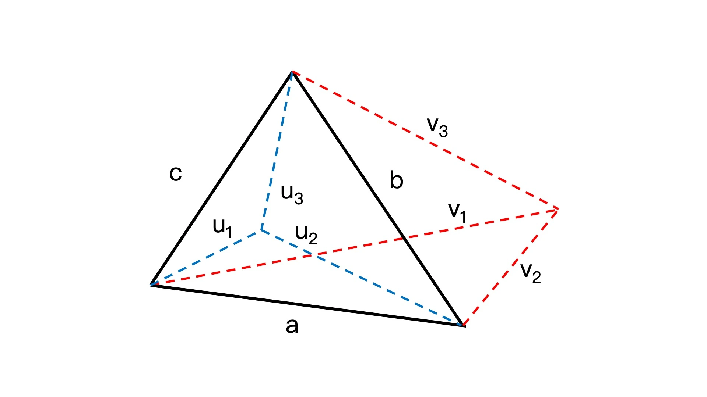

## 08 | 如何利用三角剖分和向量操作描述并处理多边形？

在图形系统中，我们最终看到的丰富多彩的图像，都是由多边形构成的。

不同的图形系统是如何用数学语言描述并处理多边形？

### 图形学中的多边形是什么？

多边形可以定义为由三条或三条以上的**线段**首尾连接构成的平面图形。

每条线段的端点就是多边形的顶点，线段就是多边形的边。

多边形又可以分为**简单多边形**和**复杂多边形**。如果一个多边形的每条边除了相邻的边以外，不和其他边相交，那它就是简单多边形，否则就是复杂多边形。

一般来说，我们在绘图时，要尽量构建简单多边形

简单多边形又分为**凸多边形**和**凹多边形**。如果一个多边形中的每个内角都不超过180°，那它就是凸多边形，否则就是凹多边形。

在图形系统中绘制多边形的时候，最常用的功能是***填充多边形***；除此之外，在可视化中用户经常要用鼠标与多边形进行交互，这就要涉及***多边形的边界判定***。


### 不同的图形系统如何填充多边形？

在SVG和Canvas2D中，都内置了填充多边形的API。

**在SVG中**，可以直接给元素设置fill属性来填充；**在Canvas2D中**，可以在绘图指令结束时调用fill()方法进行填充。

**在WebGL中**，我们用三角形图元来快速填充。

#### 1. Canvas2D如何填充多边形？

Canvas2D填充多边形的具体方法，可以总结为5步。[CodePen：Canvas2D填充多边形](https://codepen.io/yeying0827/pen/mdvBxgK)

* 第一步，构建多边形的顶点。

  ```javascript
  const canvas = document.querySelector('canvas');
  const ctx = canvas.getContext('2d');
  ctx.translate(canvas.width / 2, canvas.height / 2);
  ctx.scale(1, -1);
  
  const points = [new Vector2D(0, 100)];
  for(let i = 1; i <= 4; i ++) {
    const p = points[0].copy().rotate(i * Math.PI * 0.4);
    points.push(p);
  }
  ```

* 第二步，绘制多边形。

  ```javascript
  const polygon = [
    ...points
  ];
  // 绘制正五边形（简单多边形）
  ctx.save();
  ctx.translate(-128, 0);
  draw(ctx, polygon);
  ctx.restore();
  
  const stars = [
    points[0],
    points[2],
    points[4],
    points[1],
    points[3]
  ];
  // 绘制五角星（复杂多边形）
  ctx.save();
  ctx.translate(128, 0);
  draw(ctx, stars);
  ctx.restore();
  ```

  在Canvas中，只要将顶点构造出来，就可以通过API绘制出多边形。

* 然后，将这些点传给draw函数

* 在draw函数中完成具体的绘制

* draw函数内部调用context.fill完成填充

  ```javascript
  function draw(context, points, {
    fillStyle = "black",
    close = false,
    rule = "nonzero"
  } = {}) {
    console.log(points);
    context.beginPath();
    context.moveTo(...points[0]);
    for (let i = 1; i < points.length; i ++) {
      context.lineTo(...points[i]);
    }
    if (close) context.closePath();
    context.fillStyle = fillStyle;
    context.fill(rule);  // 设置填充规则
  }
  ```

不管是简单多边形还是复杂多边形，Canvas2D的fill都能正常填充。

另外，Canvas2D的fill还支持两种填充规则；默认的规则是”nonzero“，即”不管有没有相交的边，只要是由边围起来的区域都一律填充“。另一种规则叫做“evenodd”，是根据重叠区域是奇数还是偶数来判断是否填充的。

```javascript
draw(ctx, stars, {rule: "evenodd"});
```

复杂多边形（五角星）由于绘制区域存在重叠，就导致图形中心有了空洞的特殊效果。

Canvas2D的fill非常实用，可以自动填充多边形内部的区域，并且对于任何多边形都能判定和填充。

#### 2. WebGL如何填充多边形？

在WebGL中，没有提供自动填充多边形的方法，但可以用三角形这种基本图元来快速地填充多边形。

所以，在WebGL中填充多边形的第一步，就是将多边形分割成多个三角形。

这种将多边形分割成若干个三角形的操作，在图形学中叫做**三角剖分**（Trianglation）。

三角剖分是图形学和代数拓扑学中一个非常重要的基本操作，也有很多不同的实现算法。这些算法讲解起来比较复杂，还涉及很多图形学的底层数学知识。[参考资料](http://www.ae.metu.edu.tr/tuncer/ae546/prj/delaunay/)

我们可以直接**利用GitHub上一些成熟的库**（比如[Earcut](https://github.com/mapbox/earcut)、[Tess2.js](https://github.com/memononen/tess2.js)以及[cdt2d](https://github.com/mikolalysenko/cdt2d)），来对多边形进行三角剖分就可以了。

以下**以Earcut库为例，讲解WebGL填充多边形的过程**。[Codepen: WebGL实现多边形填充](https://codepen.io/yeying0827/pen/rNPmdgJ)

假设要填充一个不规则多边形，它的顶点数据如下：

```javascript
const vertices = [ // 多边形顶点
  [-0.7, 0.5],
  [-0.4, 0.3],
  [-0.25, 0.71],
  [-0.1, 0.56],
  [-0.1, 0.13],
  [0.4, 0.21],
  [0, -0.6],
  [-0.3, -0.3],
  [-0.6, -0.3],
  [-0.45, 0.0],
];
```

* 首先，我们要对它进行三角剖分。具体就是调用Earcut的API来完成对多边形的三角剖分。

```html
<script src="https://unpkg.com/earcut@2.2.4/dist/earcut.dev.js"></script>
```

```javascript
const points = vertices.flat();
const triangles = earcut(points);
console.log(triangles);
```

因为Earcut库只接受扁平化的顶点数据，所以这里先用数组的flat方法将顶点扁平化，然后将它传给Earcut进行三角剖分。

调用Earcut后返回的结果是一个数组，这个数组的元素是顶点数据在vertices数组中的下标index。

```
[1,0,9,9,8,7,7,6,5,4,3,2,2,1,9,9,7,5,4,2,9,9,5,4]
```

元素值为1表示vertices数组中index为1的顶点，即[-0.4, 0.3]。这个数组中每三个元素可以构成一个三角形，比如1,0,9表示由[-0.4, 0.3]，[-0.7, 0.5]，[-0.45, 0.0]构成的三角形。

* 接着创建WebGL着色器程序

  ```javascript
  // 1. 编程着色器
  const vertex = `
    attribute vec2 position;
    
    void main() {
      gl_Position = vec4(position, 1.0, 1.0);
    }
  `;
  const fragment = `
    precision mediump float;
    
    void main() {
      gl_FragColor = vec4(1.0, 0.0, 0.0, 1.0);
    }
  `;
  // ...
  ```

* 然后使用着色器程序：将顶点和index下标数据都输入到缓冲区

  ```javascript
  // 使用着色器程序
  // 1.定义顶点
  const position = new Float32Array(points);
  const cells = new Uint16Array(triangles);
  // 2.将顶点数据写入WebGL缓冲区（ARRAY_BUFFER）
  const pointBuffer = gl.createBuffer(); // 创建buffer对象
  gl.bindBuffer(gl.ARRAY_BUFFER, pointBuffer); // 将buffer对象绑定为当前操作对象
  gl.bufferData(gl.ARRAY_BUFFER, position, gl.STATIC_DRAW); // 把当前数据写入缓存对象
  
  // 将缓冲区数据读取到GPU
  // 将buffer数据绑定给顶点着色器的position变量
  const vPosition = gl.getAttribLocation(program, 'position');
  // 创建一个指向WebGL缓冲区的指针，并保存在vPosition中，在后面由顶点着色器使用
  gl.vertexAttribPointer(vPosition, 2, gl.FLOAT, false, 0, 0);
  gl.enableVertexAttribArray(vPosition); // 激活变量
  
  // 将下标数据写入WebGL缓冲区（ELEMENT_ARRAY_BUFFER）
  const cellsBuffer = gl.createBuffer();
  gl.bindBuffer(gl.ELEMENT_ARRAY_BUFFER, cellsBuffer);
  gl.bufferData(gl.ELEMENT_ARRAY_BUFFER, cells, gl.STATIC_DRAW);
  ```

* 最后通过gl.drawElements方法就可以把图形显示出来。

  ```javascript
  // 执行着色器程序完成绘制
  gl.clear(gl.COLOR_BUFFER_BIT);
  gl.drawElements(gl.TRIANGLES, cells.length, gl.UNSIGNED_SHORT, 0);
  ```

通过上面的步骤，整个多边形都被WebGL渲染并填充为了红色。实际上，WebGL是对这个多边形三角剖分后的每个三角形分别进行填充的。

为了看得更清楚，可以用描边代替填充，具体操作是，修改gl.drawElements的渲染模式，将gl.TRIANGLES改为gl.LINE_LOOP；这样就可以清晰地看出，经过Earcut处理的这个多边形被分割成了8个三角形。

到这里就讲完了2D图形的三角剖分。针对3D模型，WebGL在绘制的时候，也需要使用三角剖分，3D的三角剖分又被称为**网格化**（Meshing）。

因为3D模型比2D模型更加复杂，顶点的数量更多，所以针对复杂的3D模型，我们一般不在运行的时候进行三角剖分，而是通过设计工具把图形的三角剖分结果直接导出进行使用。也就是说，在3D渲染的时候，一般使用的模型数据都是已经经过三角剖分以后的顶点数据。

总的来说，无论是绘制2D还是3D图形，WebGL都需要先把它们进行三角剖分，然后才能绘制。因此，三角剖分是WebGL绘图的基础。


### 如何判断点在多边形内部？

多边形的交互。[Codepen: Canvas2D填充多边形和判断图形边界](https://codepen.io/yeying0827/pen/ZEwyBqz)

例子：要实现一个效果，当用户的鼠标移动到某一个图形上时，要让这个图形变色。

这里要解决的核心问题是：判定鼠标所在位置是否在多边形的内部。

**在SVG中**，由于多边形本身就是一个元素节点，因此直接通过DOM API就可以判定鼠标是否在该元素上。

**对于Canvas2D**，要通过Canvas2D提供的isPointInPath方法来判定。

#### 1. Canvas2D如何判断点在多边形内部？

例子：

* 首先改用Canvas2D绘制并填充前面的多边形。

```javascript
const canvas = document.querySelector('canvas');
const ctx = canvas.getContext('2d');

ctx.translate(canvas.width / 2, canvas.height / 2);
ctx.scale(1, -1);

const vertices = [
  [-0.7, 0.5],
  [-0.4, 0.3],
  [-0.25, 0.71],
  [-0.1, 0.56],
  [-0.1, 0.13],
  [0.4, 0.21],
  [0, -0.6],
  [-0.3, -0.3],
  [-0.6, -0.3],
  [-0.45, 0.0],
];
const points = vertices.flat();
const triangles = earcut(points);

draw(ctx, vertices);

function draw(ctx, arr, {fillStyle = "red"} = {}) {
  ctx.beginPath();
  ctx.fillStyle = fillStyle;
  ctx.moveTo(arr[0][0] * 200, arr[0][1] * 200);
  for (let i = 1; i < arr.length; i ++) {
    ctx.lineTo(arr[i][0] * 200, arr[i][1] * 200);
  }
  ctx.closePath();
  ctx.fill();
}
```

* 在Canvas上添加mousemove事件

  在事件中计算鼠标相对于Canvas的位置，再将这个位置传给isPointInPath方法，isPointInPath方法会自动判断这个位置是否位于图形内部。

  ```javascript
  const {left, top: topNum} = canvas.getBoundingClientRect();
  canvas.addEventListener('mousemove', e => {
    const {x, y} = e;
    // 坐标转化
    const offsetX = x - left;
    const offsetY = y - topNum;
    ctx.clearRect(-256, -256, 256, 256);
    if (ctx.isPointInPath(offsetX, offsetY)) {
      draw(ctx, vertices, {fillStyle: "green"});
    } else {
      draw(ctx, vertices);
    }
  });
  ```

运行结果没问题，移动到多边形内部时，多边形的填充色变为绿色。但是Canvas2D的isPointInPath方法并不好用，因为**这个方法只能对当前绘制的图形生效**。

比如，假设Canvas2D的画布上，除了这个多边形，还绘制了一个小三角形。

```javascript
draw(ctx, vertices);
draw(ctx, [[0.5, 0.5], [0.5, 1], [0.75, 1]], {fillStyle: "blue"});
```

```javascript
const {left, top: topNum} = canvas.getBoundingClientRect();
canvas.addEventListener('mousemove', e => {
  const {x, y} = e;
  // 坐标转化
  const offsetX = x - left;
  const offsetY = y - topNum;
  ctx.clearRect(-256, -256, 256, 256);
  if (ctx.isPointInPath(offsetX, offsetY)) { // 判断offsetX、offsetY的坐标是否在多边形内部
    draw(ctx, vertices, {fillStyle: "green"});
    draw(ctx, [[0.5, 0.5], [0.5, 1], [0.75, 1]], {fillStyle: "orange"});
  } else {
    draw(ctx, vertices);
    draw(ctx, [[0.5, 0.5], [0.5, 1], [0.75, 1]], {fillStyle: "blue"});
  }
});
```

此时，当我们将鼠标移动到多边形内部时，它的颜色并没有发生变化，只有移动到小三角形时，这两个图形才会同时变色。这就是因为，isPointInPath仅能判断鼠标是否在最后一次绘制的小三角形内。

解决这个问题**最简单的办法就是：自己实现一个isPointInPath方法**。这个方法的核心，就是重新创建一个Canvas对象，并且再绘制一遍多边形和小三角形，在绘制的过程中获取每个图形的isPointInPath结果。

```javascript
function isPointInPath(ctx, x, y) {
  // 根据ctx重新clone一个新的Canvas对象
  const cloned =  ctx.canvas.cloneNode().getContext('2d');
  cloned.translate(canvas.width / 2, canvas.height / 2);
  cloned.scale(1, -1);
  let ret = false;
  // 绘制多边形，判断点是否在图形内部
  draw(cloned, vertices, {fillStyle: "red"});
  ret |= cloned.isPointInPath(x, y);
  if (!ret) {
    // 如果不在，继续绘制小三角形，判断点是否在图形内部
    draw(cloned, [[0.5, 0.5], [0.5, 1], [0.75, 1]], {fillStyle: "blue"});
    ret |= cloned.isPointInPath(x, y);
  }
  return ret;
}
```

但这个方法并不通用。一旦修改了绘图过程，我们自己的isPointInPath方法也要跟着改变；而且有很多无谓的Canvas绘图操作，性能会很差。

#### 2. 实现通用的isPointInPath方法

一个更好的办法是，不使用Canvas的isPointInPath方法，而是**直接通过点与几何图形的数学关系来判断点是否在图形内**。

但直接判断点是否在一个几何图形内，还是比较困难的。因为可以对多边形进行三角剖分，所以可以把视线放在最简单的多边形，也就是三角形上。

一个非常简单的，判断点是否在三角形内的方法：

已知一个三角形的三条边分别是向量a、b、c，平面上一个点u连接三角形三个顶点的向量分别为u1、u2、u3，那么**点u在三角形内部的充分必要条件是**：u1xa、u2xb、u3xc的符号相同。

可以参考以下示意图。

* 点u在三角形内，因为u1到a、u2到b、u3到c的旋转方向是相同的；所以u1xa、u2xb、u3xc要么同正，要么同负。
* 点v在三角形外，v1到a是顺时针，v2到b方向是逆时针，v3到c又是顺时针，所以它们叉乘的结果符号并不相同。



根据这个原理，就可以写一个简单的判定函数了。

```javascript
// 判断点是否在三角形内部
function inTriangle(p1, p2, p3, point) {
  const a = p2.copy().minus(p1); // p1->p2
  const b = p3.copy().minus(p2); // p2->p3
  const c = p1.copy().minus(p3); // p3->p1
  
  const u1 = point.copy().minus(p1); // p1->point
  const u2 = point.copy().minus(p2); // p2->point
  const u3 = point.copy().minus(p3); // p3->point
  
  const s1 = Math.sign(a.cross(u1));
  const s2 = Math.sign(b.cross(u2));
  const s3 = Math.sign(c.cross(u3)); 
  
  return s1 === s2 && s2 === s3;
}
```

但上述代码存在一个bug，就是不能判定**点恰好在三角形某条边上**的情况。

如果一个点u在三角形的一条边a上，需要满足以下2个条件：

1. a.cross(u1) === 0
2. 0 <= a.dot(u1) / a.length² <= 1

关于第一个条件：叉乘结果为0，即表示a和u1两个向量的夹角θ为0或180度

关于第二个条件：

当满足第一个条件后，则cosθ=±1，所以a和u1的点积即±|a|*|u1|；但同时，u和a向量要有重合，这样cosθ的值只能为1，a.dot(u1) / a.length²就等于|u1|/|a|，即u1和a长度的比值，只有这个比值在0到1之间，才能说明点在三角形的边上。

根据上述分析，修改代码：

```javascript
// 判断点是否在三角形内部
function inTriangle(p1, p2, p3, point) {
  const a = p2.copy().minus(p1); // p1->p2
  const b = p3.copy().minus(p2); // p2->p3
  const c = p1.copy().minus(p3); // p3->p1
  
  const u1 = point.copy().minus(p1); // p1->point
  const u2 = point.copy().minus(p2); // p2->point
  const u3 = point.copy().minus(p3); // p3->point
  
  const s1 = Math.sign(a.cross(u1));
  let p = a.dot(u1) / a.length ** 2;
  if (s1 === 0 && p >= 0 && p <= 1) return true;
  const s2 = Math.sign(b.cross(u2));
  p = b.dot(u2) / b.length ** 2;
  if (s2 === 0 && p >= 0 && p <= 1) return true;
  const s3 = Math.sign(c.cross(u3));  
  p = c.dot(u3) / c.length ** 2;
  if(s3 === 0 && p >= 0 && p <= 1) return true;
  
  return s1 === s2 && s2 === s3;
}
```

这样，就完成了判断一个点是否在某个三角形内部。

如果要判断一个点是否在任意多边形的内部，只需要在判断之前将它进行三角剖分，并对每个三角形进行判断就可以了。

```javascript
// 判断点是否在多边形内部
// 将多边形进行三角剖分，然后判断点是否在其中某个三角形内部
function isPointInPath2({vertices, cells}, point) {
  let ret = false;
  for(let i = 0; i < cells.length; i += 3) {
    const p1 = new Vector2D(...vertices[cells[i]]);
    const p2 = new Vector2D(...vertices[cells[i + 1]]);
    const p3 = new Vector2D(...vertices[cells[i + 2]]);
    if (inTriangle(p1, p2, p3, point)) {
      ret = true;
      break;
    }
  }
  return ret;
}
```


### 要点总结

学习了 使用三角剖分来填充多边形以及判断点是否在多边形内部。

Canvas2D的处理很简单，可以使用原生的fill来填充任意多边形，使用isPointInPath来判断点是否在多边形内部。但三角剖分是更加通用的方式。

在使用三角剖分处理多边形时，直接调用一些成熟库的API就可以完成。


### 小试牛刀

1. 把Earcut换成tess2.js，从而实现evenodd填充规则

   看不明白官方文档😓网上搜到的资料也看不太明白[GeoGebra课程](https://beta.geogebra.org/u/bjolley9)

   以后再看。。

2. 试着利用三角剖分的原理，通过WebGL画出椭圆图案、菱形的星星图案，以及正五角星


【补充】

判定点是否在三角形内部：

* [Ray-Tracing: Rendering a Triangle](https://www.scratchapixel.com/lessons/3d-basic-rendering/ray-tracing-rendering-a-triangle/barycentric-coordinates.html)

