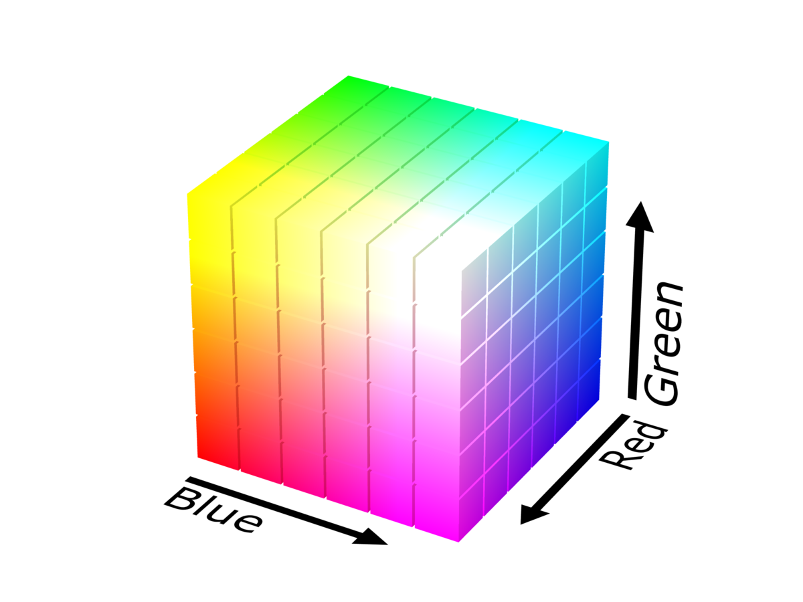
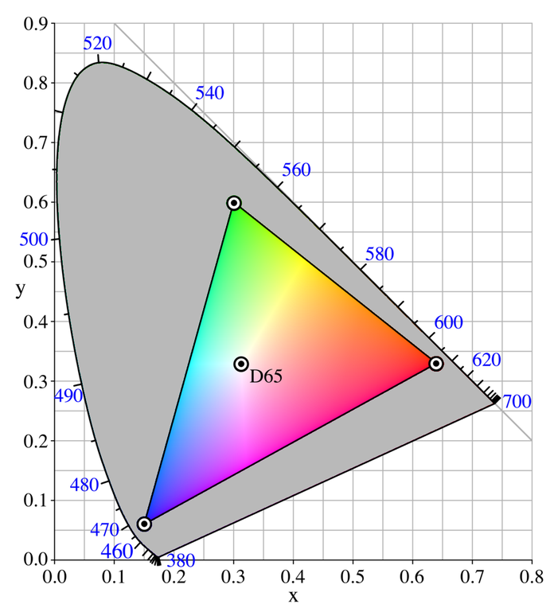
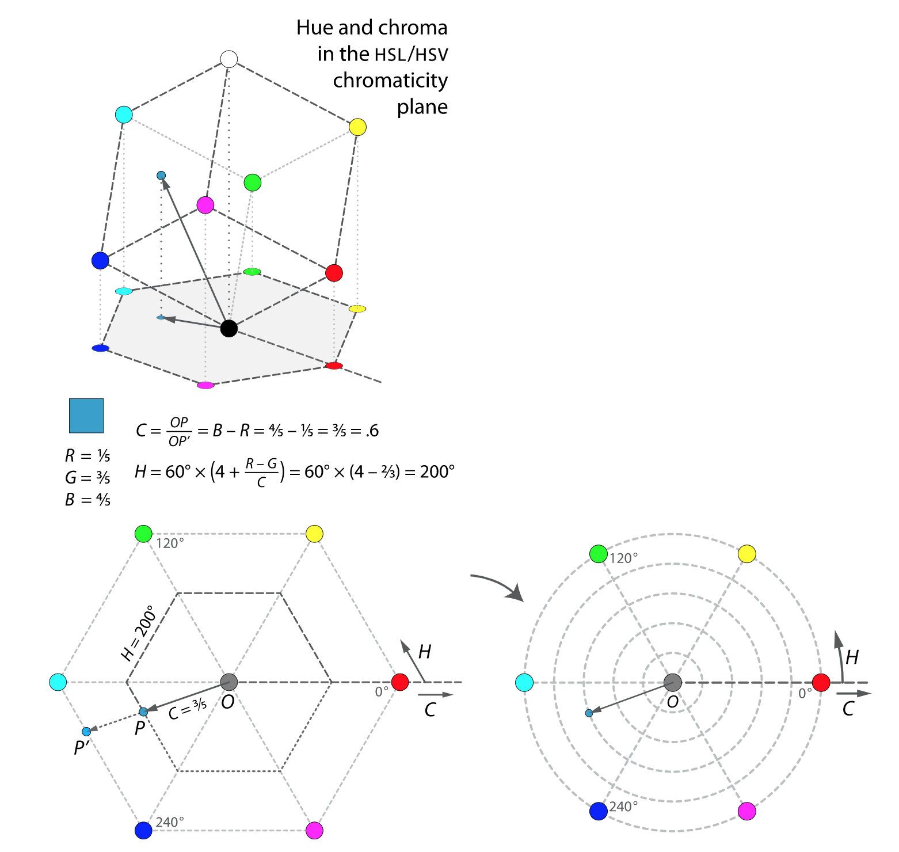
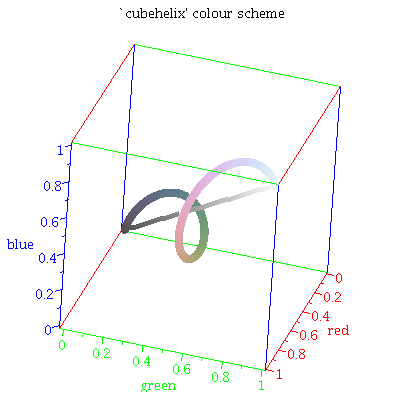

## 10 | 图形系统如何表示颜色？

在可视化领域中，图形的形状和颜色信息非常重要，它们都可以用来表达数据。

Web图形系统对颜色的支持是非常强大的。

下面是Web图形系统中表示颜色的基本方法，四种基本的颜色表示法。

颜色表示实际上是一门非常复杂的学问，与我们自己的视觉感知以及心理学都有很大的关系


### RGB和RGBA颜色

在Web开发中，我们首选的颜色表示法就是RGB和RGBA。

#### 1. RGB和RGBA的颜色表示法

在CSS样式中看到的形式如`#RRGGBB`的颜色代码，就是RGB颜色的十六进制表示法，其实RR、GG、BB分别是两位十六进制数字，表示红、绿、蓝三色通道的色阶。

**色阶**可以表示某个通道的强弱。

因为RGB(A)颜色用两位十六进制数来表示每一个通道的色阶，所以每个通道一共有256阶，取值是0到255。

RGB颜色是将人眼可见的颜色表示为红、绿、蓝三原色不同色阶的混合。可以用一个三维立方体，把RGB能表示的所有颜色形象地描述出来。效果如下图：



**那RGB能表示人眼所能见到的所有颜色吗？事实上，RGB色值只能表示这其中的一个区域。**如下图所示，灰色区域是人眼所能见到的全部颜色。



尽管RGB色值不能表示人眼可见的全部颜色，但它可以表示的颜色也已经足够丰富了。一般的显示器、彩色打印机、扫描仪等都支持它。

在浏览器中，CSS一般有两种表示RGB颜色值的方式：一种是前面所说的`#RRGGBB`表示方式，另一种是直接用`rgb(red, green, blue)`表示颜色，这里的“red、green、blue”是十进制数值。

RGBA就是在RGB的基础上增加了一个Alpha通道，也就是透明度。一些新版本的浏览器，可以用`#RRGGBBAA`的形式来表示RGBA色值，但是较早期的浏览器，只支持`rgba(red, green, blue, alpha)`这种形式来表示色值（注意：alpha是一个从0到1的数）。

WebGL的shader默认支持RGBA。在WebGL的shader中，使用一个四维向量来表示颜色，向量的r、g、b、a分量分别表示红色、绿色、蓝色和alpha通道。不过和CSS的颜色表示稍有不同，WebGL采用归一化的浮点数值，也就是说，WebGL的颜色分量r、g、g、a的数值都是0到1之间的浮点数。

#### 2. RGB颜色表示法的局限性

RGB和RGBA的颜色表示法非常简单，但使用起来也有局限性。

对一个RGB颜色来说，我们只能大致直观地判断出它偏向于红色、绿色或蓝色，或者在颜色立方体的大致位置。

在对比两个RGB颜色的时候，我们只能通过**对比它们在RGB立方体中的相对距离**，来判断它们的颜色差异。除此之外，我们几乎得不到其他任何有用的信息。

**当要选择一组颜色给图表使用时，我们并不知道要以什么样的规则来配置颜色，才能让不同数据对应的图形之间的对比尽可能鲜明。**RGB颜色对用户其实并不友好。

以下是一个简单的例子：

在画布上显示3组颜色不同的圆，每组各5个，用来表示重要程度不同的信息。

现在给这些圆以随机的RGB颜色，代码如下：

```javascript
import {Vec3} from 'ogl';
// ...
const canvas = document.querySelector('canvas');
const ctx = canvas.getContext('2d');
const canvas2d = new Canvas2D(ctx);

for (let i = 0; i <  3; i ++) {
  const colorVector = randomRGB();
  for (let j = 0; j < 5; j ++) {
    const c = colorVector.clone().scale(0.5 + 0.25 * j);
    ctx.fillStyle = `rgb(${Math.floor(c[0] * 256)}, ${Math.floor(c[1] * 256)}, ${Math.floor(c[2] * 256)})`;
    ctx.beginPath();
    ctx.arc((j - 2) * 60, (i - 1) * 60, 20, 0, Math.PI * 2);
    ctx.fill();
  }
}

function randomRGB() {
  return new Vec3(
      0.5 * Math.random(),
      0.5 * Math.random(),
      0.5 * Math.random(),
  )
}
```

通过执行上面的代码，可以生成随机的三维向量，然后将它转为RGB颜色。对了保证对比，我们在每一组的5个圆中，依次用0.5、0.75、1.0、1.25和1.5的比率乘上我们随机生成的RGB数值。这样，一组圆就能呈现不同的亮度了；总体上颜色是越左边的越暗，越右边的越亮。

但这样做有两个缺点：

* 首先，这个例子里的RGB颜色是随机产生的，所以**行与行之间的颜色差别**可能很大，也可能很小
* 其次，因为无法控制**随机生成的颜色本身的亮度**，所以生成的一组圆的颜色有可能都很亮或者都很暗（区分度差）

因此，在需要**动态构建视觉颜色效果**的时候，很少直接选用RGB色值，而是使用其他的颜色表示形式；其中比较常用的就是HSL和HSV颜色表示形式。


### HSL和HSV颜色

HSL和HSV用色相（Hue）、饱和度（Saturation）和亮度（Lightness）或明度（Value）来表示颜色。

其中，Hue是角度，取值范围是0到360度，饱和度和亮度/明度的值都是从0到100%。

虽然HSL和HSV在[表示方法](https://zh.wikipedia.org/wiki/HSL%E5%92%8CHSV%E8%89%B2%E5%BD%A9%E7%A9%BA%E9%97%B4#/media/File:Hsl-hsv_models.svg)上有一些区别，但达到的效果比较接近。

#### 1. HSL和HSV的颜色表示方法

HSL和HSV是怎么表示颜色的呢？

可以把HSL和HSV颜色理解为，是将RGB颜色的立方体从直角坐标系投影到极坐标的圆柱上，所以它的色值和RGB色值是一一对应的。



它们之间色值的互转算法比较复杂。CSS和Canvas2D都可以直接支持HSL颜色，只有WebGL需要做转换。

如果要使用的话，只需要记住下面给出的一段RGB和HSV的转换代码就可以了。

```glsl
// rgb -> hsv
vec3 rgb2hsv(vec3 c) {
  vec4 K = vec4(0.0, -1.0 / 3.0, 2.0 / 3.0, -1.0);
  vec4 p = mix(vec4(c.bg, K.wz), vec4(c.gb, K.xy), step(c.b, c.g));
  vec4 q = mix(vec4(p.xyw, c.r), vec4(c.r, p.yzx), step(p.x, c.r));
  float d = q.x - min(q.w, q.y);
  float e = 1.0e-10;
  return vec3(abs(q.z + (q.w - q.y) / (6.0 * d + e)), d / (q.x + e), q.x);
}

// hsv -> rgb
vec3 hsv2rgb(vec3 c) {
  vec3 rgb = clamp(abs(mod(c.x * 6.0 + vec3(0.0, 4.0, 2.0), 6.0) - 3.0) - 1.0, 0.0, 1.0);
  rgb = rgb * rgb * (3.0 - 2.0 * rgb);
  return c.z * mix(vec3(1.0), rgb, c.y);
}
```

下面用HSL颜色改写前面绘制三排圆的例子：

```javascript
import {Vec3} from 'ogl';
// ...
const canvas = document.querySelector('canvas');
const ctx = canvas.getContext('2d');
const canvas2d = new Canvas2D(ctx);

const [h, s, l] = randomColor();
for (let i = 0; i <  3; i ++) {
  // i=0, [0 0.5)
  // i=1, [0.25 0.75)
  // i=2, [0.5 1)
  const p = (i * 0.25 + h) % 1;
  for (let j = 0; j < 5; j ++) {
    const d = j - 2;
    // h
    // s: 0.4  0.55 0.7  0.85 1.0
    // l: 0.21 0.33 0.45 0.57 0.69
    ctx.fillStyle = `hsl(${Math.floor(p * 360)}, ${Math.floor((0.15 * d + s) * 100)}%, ${Math.floor((0.12 * d + l) * 100)}%)`;
    ctx.beginPath();
    ctx.arc((j - 2) * 60, (i - 1) * 60, 20, 0, Math.PI * 2);
    ctx.fill();
  }
}

function randomColor() {
  return new Vec3(
      0.5 * Math.random(), // 色相：0~0.5之间的值
      0.7, // 初始饱和度 0.7
      0.45, // 初始亮度 0.45
  )
}
```

以上代码运行，将生成随机的HSL颜色，主要是随机色相H，然后我们将H值的角度拉开，就能保证三组圆彼此之间的颜色差异比较大。

接着，增大每一列圆的饱和度和亮度，这样每一行圆的亮度和饱和度就都不同了。要注意，我们需要同时增大亮度和饱和度；因为根据HSL的规则，亮度越高，颜色越接近白色，只有同时提升饱和度，才能确保圆的颜色不会太浅。

#### 2. HSL和HSV的局限性

从上面的例子中可以看出，即使均匀地修改每组颜色的亮度和饱和度，但修改之后，有的颜色看起来和其他的颜色差距明显，有的颜色差距还是没那么明显。

以下做一个简单的实验：

```javascript
for (let i = 0; i < 20; i ++) {
  ctx.fillStyle = `hsl(${Math.floor(i * 15)}, 50%, 50%)`;
  ctx.beginPath();
  ctx.arc((i - 10) * 20, 200, 10, 0, Math.PI * 2);
  ctx.fill();
}
for (let i = 0; i < 20; i ++) {
  ctx.fillStyle = `hsl(${Math.floor((i % 2 ? 60 : 210) + 3 * i)}, 50%, 50%`;
  ctx.beginPath();
  ctx.arc((i - 10) * 20, 140, 10, 0, Math.PI * 2);
  ctx.fill();
}
```

绘制两排不同的圆，让第一排每个圆的色相间隔都是15，再让第二排圆的颜色在色相60和120附近两两交错，然后让这两排圆的饱和度和亮度都是50%。接着运行查看效果。

看第一排圆会发现，虽然它们的色相相差都是15，但相互之间颜色过渡并不是均匀地，尤其是中间几个绿色圆的颜色比较接近；然后看第二排圆又会发现，蓝色和紫色的圆看起来就是不如偏绿偏黄的圆亮。这都是由于人眼对不同频率的光的敏感度不同造成的。

因此，HSL依然不是最完美的颜色方法，我们需要建立**一套针对人类知觉的标准**，这个标准在描述颜色的时候要尽可能地满足以下2个原则：

1. 人眼看到的色差 = 颜色向量间的欧氏距离
2. 相同的亮度，能让人感觉亮度相同

于是，一个针对人类感觉的颜色描述方式就产生了，它就是CIE Lab。


### CIE Lab和CIE Lch颜色

CIE Lab颜色空间简称Lab，是一种符合人类感觉的色彩空间，用L表示亮度，a和b表示颜色对立度。

RGB值也可以和Lab转换，但是转换规则比较复杂，可以通过[WIKI](https://en.wikipedia.org/wiki/CIELAB_color_space)去了解它的基本原理。

目前还没有能支持CIE Lab的图形系统，但[css-color-level4](https://www.w3.org/TR/css-color-4/#funcdef-lab)规范已经给出了Lab颜色值的定义。

```mathematica
lab() = lab( [<percentage> | <number> | none]
      [ <percentage> | <number> | none]
      [ <percentage> | <number> | none]
      [ / [<alpha-value> | none] ]? )
```

一些JavaScript库也已经可以直接处理Lab颜色空间了，比如[d3-color](https://github.com/d3/d3-color)

现在通过一个例子，来讲解d3.lab是怎么处理Lab颜色的：

```javascript
import * as d3 from 'd3-color';
// ...
for (let i = 0; i < 20; i ++) {
  const c = d3.lab(30, i * 15 - 150, i * 15 - 150).rgb();
  ctx.fillStyle = `rgb(${c.r}, ${c.g}, ${c.b})`;
  ctx.beginPath();
  ctx.arc((i - 10) * 20, 60, 10, 0, Math.PI * 2);
  ctx.fill();
}

for (let i = 0; i < 20; i ++) {
  const c = d3.lab(i * 5, 80, 80).rgb();
  ctx.fillStyle = `rgb(${c.r}, ${c.g}, ${c.b})`;
  ctx.beginPath();
  ctx.arc((i - 10) * 20, -60, 10, 0, Math.PI * 2);
  ctx.fill();
```

上述代码中，用d3.lab来定义Lab色彩。

第一排相邻圆形之间的**lab色值的欧氏空间距离相同**；第二排相邻圆形之间的**亮度按5阶的方式递增**。

根据运行效果可以发现，以CIE Lab方式呈现的色彩变化中，我们设置的数值和人眼感知的一致性比较强。

CIE Lch和CIE Lab的对应方式，也是类似于将坐标从立方体的直角坐标系变换为圆柱体的极坐标系。

CIE Lch和CIE Lab表示颜色的技术还比较新，目前也不会接触很多，但因为它能呈现的色彩更贴近人眼的感知，估计会发展得很快。


### Cubehelix色盘（立方螺旋色盘）

原理：在RGB的立方体中，构建一段螺旋线，让色相随着亮度增加螺旋变换。如下图所示：



以下使用NPM上的[cubehelix](https://www.npmjs.com/package/cubehelix)模块写一个颜色随着长度变化的柱状图：

```javascript
import {cubehelix} from 'cubehelix';
// ...
const canvas = document.querySelector('canvas');
const ctx = canvas.getContext('2d');
const canvas2d = new Canvas2D(ctx);

const color = cubehelix(); // 色盘颜色映射函数
const T = 2000;

function update(t) {
  const p = 0.5 + 0.5 * Math.sin(t / T);
  console.log(p);
  ctx.clearRect(-256, -256, 512, 512);
  const {r, g, b} = color(p);
  ctx.fillStyle = `rgb(${255 * r}, ${255 * g}, ${255 * b})`;
  ctx.beginPath();
  ctx.rect(-236, -20, 480 * p, 40);
  ctx.fill();
  requestAnimationFrame(update);
}

update(0);
```

* 首先，直接使用cubehelix函数创建一个color映射；cubehelix函数是一个高阶函数，它的返回值是一个色盘映射函数。

  这个色盘映射函数，接收的参数的值的范围是0到1，当它从小到大依次改变的时候，不仅颜色会依次改变，亮度也会依次增强。

* 然后，用正弦函数来模拟数据的周期性变化

  通过`color(p)`获取当前的颜色值，再把颜色值赋给`ctx.fillStyle`，颜色就能显示出来了。

* 最后，用rect将柱状图画出来，并用requestAnimationFrame实现动画


### 使用场景

在可视化应用里，一般有两种使用颜色的方式：

* 第一种，整个项目的UI配色全部由UI设计师设计好，提供给可视化工程师使用

* 第二种，是根据数据情况由前端动态地生成颜色值

  当然并不是由开发者完全自由选择，而一般是由设计师定下视觉基调和一些主色，开发者根据主色和数据来生成对应的颜色。

在一般的图表呈现项目中，第一种方式使用较多；而在一些数据比较复杂的项目中，经常会使用第二种方式，尤其是希望连续变化的数据能够呈现连续的颜色变换时，需要结合数据变量来动态生成颜色值。


### 要点总结

Web图形系统表示颜色的方法，可以分为2大类，分别是颜色空间的表示方法，以及色盘的表示方法。

* RGB用三原色的色阶来表示颜色，是最基础的颜色表示法，但对用户不够友好；

* HSL和HSV用色相、饱和度、亮度（明度）来表示颜色，对开发者比较友好，但它的数值变换与人眼感知并不完全相符
* CIE Lab和CIE Lch是与人眼感知相符的色彩空间表示法，已经被纳入css-color-level4规范中，已经有一些JavaScript库可以直接处理Lab颜色空间，如d3-color
* 如果要呈现颜色随数据动态改变的效果，那Cubehelix色盘是一种非常合适的选择

在可视化中，我们会使用图形的大小、高低、宽窄、颜色和形状这些常见信息来反映数据。一般来说，会使用一种叫做二维强化的技巧，来叠加两个维度的信息，从而加强可视化的视觉呈现效果。

**颜色的使用在可视化呈现中非常重要**


### 小试牛刀

利用hsv和rgb互转的GLSL代码；尝试用WebGL画两个圆，让它们的角度对应具体的Hue色相值，让其中一个圆的半径对应饱和度S，另一个圆的半径对应明度V，将HSV色盘绘制出来。


### 扩展阅读

[RGB color model](https://www.wikiwand.com/en/RGB_color_model)

[HSL和HSV色彩空间](https://zh.wikipedia.org/wiki/HSL%E5%92%8CHSV%E8%89%B2%E5%BD%A9%E7%A9%BA%E9%97%B4)

[色彩空间中的HSL、HSV、HSB的区别](https://www.zhihu.com/question/22077462)

[用JavaScript实现RGB-HSL-HSB相互转换的方法](https://syean.cn/2017/03/17/JS%E5%AE%9E%E7%8E%B0RGB-HSL-HSB%E7%9B%B8%E4%BA%92%E8%BD%AC%E6%8D%A2/)

[WIKI: Lab色彩空间](https://zh.wikipedia.org/wiki/CIELAB%E8%89%B2%E5%BD%A9%E7%A9%BA%E9%97%B4)

[Cubehelix颜色表算法](https://zhuanlan.zhihu.com/p/121055691)

[Dave Green's ‘cubehelix’ colour scheme](https://people.phy.cam.ac.uk/dag9/CUBEHELIX/)

