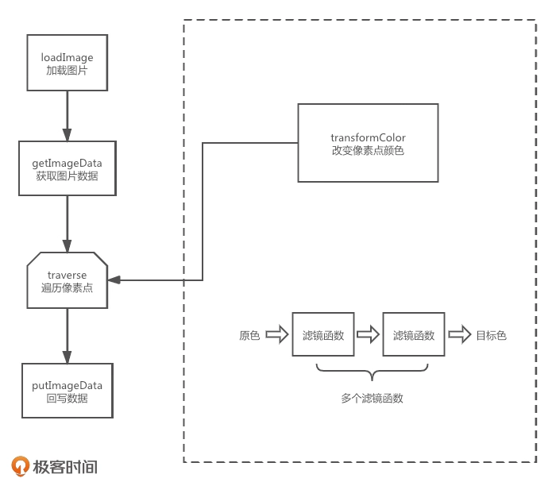

## 12 | 如何使用滤镜函数实现美颜效果？

在可视化领域里，我们常常需要处理大规模的数据，

如果我们用几何绘制的方式将这些信息一一绘制出来，性能可能就会很差。

可以将这些数据简化为像素点进行处理。这种处理图像的新思路就叫做**像素化**。

图片像素化处理，能够在我们将原始数据信息转换成图形后，进一步处理图形的细节，突出我们想要表达的信息，还能让视觉呈现更有冲击力。


**图片像素化的基本思路和方法**：如何用像素化来处理照片

### 如何理解像素化？

所谓像素化，就是把一个图像看成是由一组像素点组合而成的。每个像素点负责描述图像上的一个点，带有这个点的基本绘图信息。

像素点是怎么存储的呢？Canvas2D 以 4 个通道来存放每个像素点的颜色信息，每个通道是 8 个比特位，也就是0~255的十进制数值，4 个通道对应RGBA颜色的四个值。

像素处理实际上就是我们为了达到特定的视觉效果，用程序来处理图像上每个像素点。


**几个常用的效果**

### 应用一：实现灰度化图片

灰度化图片，简单来说就是将一张彩色图片变为灰白色图片。

具体的实现思路：先将该图片的每个像素点的R、G、B通道的值进行加权平均，然后将这个值作为每个像素点新的R、G、B通道值。具体公式如下：
$$
\begin{cases}
 V = aR + bG + cB\\
 R' = G' = B' = V\\
 \end{cases}
$$
注：R、G、B是原图片中的R、G、B通道的色值，V是加权平均色值，a、b、c是加权系数，满足**`(a + b + c) = 1`**。

一个具体的例子：

`pages/Filter/Gray.vue`

1. 首先加载一张图片并绘制到Canvas画布上：

   ```html
   <canvas ref="canvasRef" width="0" height="0"></canvas>
   ```

   ```javascript
   const localLoadImage = src => {
     const img = new Image();
     img.crossOrigin = 'anonymous';
     return new Promise(resolve => {
       img.onload = () => {
         resolve(img);
       };
       img.src = src;
     });
   };
   // ...
   context = canvasRef.value.getContext('2d');
   (async function() {
     // 异步加载图片
     const img = await localLoadImage(girl1);
   
     const {width, height} = img;
     // 将图片绘制到canvas
     canvasRef.value.width = width;
     canvasRef.value.height = height;
     context.drawImage(img, 0, 0);
   }());
   ```

   通过image元素的src属性异步加载图片，加载完成后，通过Canvas的2d上下文对象的drawImage方法，将图片元素绘制到Canvas上。

2. 接下来，获取每个像素点的R、G、B值。

   具体的操作：通过Canvas的2d上下文，获取图片剪裁区的数据imageData。

   ```javascript
   // 获取imageData
   const imageData = context.getImageData(0, 0, width, height);
   ```

   imageData是我们在像素处理中经常用到的对象，它是一个ImageData对象，有3个属性，分别是width、height和data；data用来存储图片的全部像素信息。

   data是怎么保存图片全部像素信息的？首先，图片的全部像素信息会以**类型数组**（Uint8ClampedArray）的形式保存在ImageData对象的data属性里；该类型数组的每4个元素组成一个像素的信息，这四个元素依次表示该像素的RGBA四通道的值。

   data属性指向的类型数组的总长度是`width * height * 4`，这是因为图片一共是`width * height`个像素点，每个像素点有4个通道，所以总长度是像素点数量的4倍。

3. 遍历处理像素点。

   因此我们可以遍历data数组，读取每个像素的RGBA四通道的值，将原本的RGB值都用一个加权平均值`0.2126 * r + 0.7152 * g + 0.0722 * b`替代了。

   ```javascript
   const data = imageData.data;
   // 遍历处理像素点
   for (let i = 0; i < width * height * 4; i += 4) {
     const r = data[i],
         g = data[i + 1],
         b = data[i + 2],
         a = data[i + 3];
     // 对RGB通道进行加权平均
     const v = 0.2126 * r + 0.7152 * g + 0.0722 * b;
     data[i] = v;
     data[i + 1] = v;
     data[i + 2] = v;
     data[i + 3] = a;
   }
   ```

   为什么用这三个权重，而不是用算术平均值1/3呢？这是因为人的视觉对R、G、B三色通道的敏感度不一样，对绿色敏感度最高，所以加权值最高，对蓝色敏感度最低，所以加权值最低。

4. 最后，将处理好的数据写回到Canvas中。

   ```javascript
   // 将处理好的数据写回到 Canvas 中去
   context.putImageData(imageData, 0, 0);
   ```

   这样我们就得到了一张经过灰度化后的图片。

   

### 重构代码以便于扩展

我们还可以对像素颜色做其他变换，比如增强或减弱某个通道的色值，改变颜色的亮度、对比度、饱和度、色相等等。为了更好地复用，我们可以重构以上代码。

重构：将**循环处理每个像素的颜色信息**这一步单独剥离出来，再把其他步骤**分解并抽象成通用的模块**

* 加载图片的函数loadImage
* 获取imageData对象的函数getImageData
* 遍历imageData中的类型数组的函数traverse

```javascript
// src/utils/ImageHandler.js
// ...
export function traverse(imageData, pass) {
    const {width, height, data} = imageData;
    for (let i = 0; i < width * height * 4; i += 4) {
        const [r, g, b, a] = pass({
            // rgba归一化处理
            r: data[i] / 255,
            g: data[i + 1] / 255,
            b: data[i + 2] / 255,
            a: data[i + 3] / 255,
            index: i,
            width,
            height,
            // 像素点对应的横纵坐标（百分比）：`i / 4`可以得出当前是像素点数组中的第几个
            x: ((i / 4) % width) / width, // 每一列像素点`%width`求模得到的结果一样，相当于每一行的第几个，再`/ width`得到x坐标
            y: Math.floor(i / 4 / width) / height // `i / 4 / width`得出像素点在第几行，再`/ height`得到y坐标
        });
        data.set([r, g, b, a].map(v => Math.round(v * 255)), i);
    }
    return imageData;
}
```

这样之前的应用代码就可以得到简化。

```javascript
(async function() {
  // 异步加载图片
  const img = await loadImage(girl1);
  // 获取图片的`imageData`数据对象
  const imageData = getImageData(img);
  // 遍历`imageData`数据对象
  traverse(imageData, ({r, g, b, a}) => {
    // 对每个像素点进行灰度化处理（线性方程）
    const v = 0.2126 * r + 0.7152 * g + 0.0722 * b;
    return [v, v, v, a];
  });
  // 更新canvas内容
  canvasRef.value.width = imageData.width;
  canvasRef.value.height = imageData.height;
  context.putImageData(imageData, 0, 0);
}());
```

好处：traverse函数会遍历图片的每个像素点，把获得的像素信息通过参数传递给回调函数处理，我们只需要关注像素的处理过程就可以了。


### 应用二：使用像素矩阵通用地改变像素颜色

灰度化例子中，加权平均的计算公式，本质上是利用线性方程组改变了图片中每一个像素的RGB通道的原色值，将原色值映射为一个新色值。

除了加权平均，还可以用其他的线性方程组来实现各种不同的像素变换效果。

比如：改变图片的亮度 => 将R、G、B通道的值都乘以一个常量p
$$
\begin{cases}
 R' = p · R\\
 G' = p · G\\
 B' = p · B\\
 \end{cases}
$$
注：p如果小于1，R、G、B值就会变小，图片就会变暗，也就更接近于黑色；相反，如果大于1，图片就会变亮，更接近白色。

**有没有一种方式，可以更通用地实现更多的颜色变换效果？**可以引入一个颜色矩阵；它能够处理几乎所有的颜色变换类滤镜。

创建一个`4 * 5`颜色矩阵，第一行决定红色通道，第二行决定绿色通道，第三行决定蓝色通道，第四行决定alpha通道。
$$
M = 
\begin{bmatrix}
a & b & c & d & e \\
f & g & h & i & j \\
k & l & o & m & n \\
o & p & q & r & s
\end{bmatrix}
$$
如果要改变一个像素的颜色效果，只需要将该矩阵与像素的颜色向量相乘就可以了。
$$
C' = M · C = \begin{bmatrix}
a & b & c & d & e \\
f & g & h & i & j \\
k & l & o & m & n \\
o & p & q & r & s
\end{bmatrix} · \begin{bmatrix}
R \\
G \\
B \\
A \\
1
\end{bmatrix}
= 
\begin{bmatrix}
aR + bG + cB + dA + e \\
fR + gG + hB + iA + j \\
kR + lG + oB + mA + n \\
oR + pB + qB + rA + s
\end{bmatrix}
=
\begin{bmatrix}
R' \\
G' \\
B' \\
A' \\
\end{bmatrix}
$$
这样，灰度化图片的处理过程，就可以描述成如下的颜色矩阵：

```javascript
// src/utils/color-matrix.js
/**
 * 灰度化处理
 * @param p 灰度化的程度 [0,1]
 * @returns {number[]}
 */
export function grayscale(p = 1) {
    const r = 0.2126 * p;
    const g = 0.7152 * p;
    const b = 0.0722 * p;

    // r + g + b = p;
    return [
        r + 1 - p, g,         b,         0, 0, // 1 - 0.7874p [1(p=0), 0.2126(p=1)]
        r,         g + 1 - p, b,         0, 0, // 1 - 0.2848p [1,      0.7152]
        r,         g,         b + 1 - p, 0, 0, // 1 - 0.9278p [1,      0.0722]
        0,         0,         0,         1, 0
    ];
}
```

此处引入一个参数p，是一个0~1的值，表示灰度化的程度；1是完全灰度，0是完全不灰度，也就是保持原色。这样就可以通过调节p的值来改变图片灰度化的程度。

这个灰度化矩阵，比前面直接用灰度化公式更加通用。

p的取值可以分成三种情况：

* 第一种，p等于0（返回的矩阵为单位矩阵）

  新色值和原色值完全相同

* 第二种，p等于1（返回的矩阵为完全灰度矩阵）

  矩阵正好对应前面的灰度化公式

* 第三种，p处于0~1之间

  颜色矩阵的值在完全灰度的矩阵和单位矩阵之间线性变化。

这样就实现了可调节的灰度化颜色矩阵。

要想实现不同的颜色变化，还得让旧的色值与颜色矩阵相乘，计算出新的色值。

为了方便处理，增加处理颜色矩阵的模块。一个是处理颜色矩阵的矩阵乘法运算**multiply**函数，另一个是将RGBA颜色通道组成的向量与颜色矩阵相乘，得到新色值的**transformColor**函数。

```javascript
// src/utils/color-matrix.js
/**
 * 将`color`通过颜色矩阵映射成新的色值返回
 * @param color {Array} 原色值（各分量的归一化值）
 * @param matrix 颜色矩阵（多个）
 * @returns {Array}
 */
export function transformColor(color, ...matrix) {
    const [r, g, b, a] = color;
    matrix = matrix.reduce((prev, current) => multiply(prev, current));
    color[0] = matrix[0]  * r + matrix[1] *  g + matrix[2]  * b + matrix[3]  * a + matrix[4];
    color[1] = matrix[5]  * r + matrix[6] *  g + matrix[7]  * b + matrix[8]  * a + matrix[9];
    color[2] = matrix[10] * r + matrix[11] * g + matrix[12] * b + matrix[13] * a + matrix[14];
    color[3] = matrix[15] * r + matrix[16] * g + matrix[17] * b + matrix[18] * a + matrix[19];
    return color;
}

/**
 * 将颜色矩阵相乘：b x a
 * @param a
 * @param b
 * @returns {*[]}
 */
export function multiply(a, b) {
    const out = [];
    // ...
    return out;
}
```

根据矩阵运算的性质，我们可以将多次颜色变换的过程，简化为将相应的颜色矩阵相乘，然后用最终的那个矩阵对颜色值进行映射。

这样，灰度化图片的代码可以改为如下写法：

```javascript
// ...
// 使用color-matrix优化
traverse(imageData, ({r, g, b, a}) => {
  return transformColor([r, g, b, a], grayscale(1));
});
```

要实现其他颜色变换效果，我们可以定义其他函数返回其他的颜色矩阵；这种返回颜色矩阵的函数，一般称为**颜色滤镜函数**。

抽象出颜色滤镜函数后，处理颜色代码的过程可以规范成如下图所示的过程：



我们还能增加其他的颜色滤镜函数，如：

```javascript
/**
 * 滤镜函数：过滤或增强某个颜色通道
 * @param r
 * @param g
 * @param b
 * @returns {(number|number)[]}
 */
export function channel({r = 1, g = 1, b = 1}) {
    return [
        r, 0, 0, 0, 0,
        0, g, 0, 0, 0,
        0, 0, b, 0, 0,
        0, 0, 0, 1, 0
    ];
}
```

以上**channel**滤镜函数可以过滤或增强某个颜色通道。

如以下使用：

```javascript
// 遍历`imageData`数据对象
// 增强红色通道，减弱绿色通道
traverse(imageData, ({r, g, b, a}) => {
  return transformColor([r, g, b, a], channel({r: 1.5, g: 0.75}));
});
```

红色通道的值被映射为原来的1.5倍，绿色通道的值被映射为0.75倍。这样得到的图片就显得比原来要红。

处理图片还有一些常用的颜色滤镜，比如可以修改图片的亮度（Brightness）、饱和度（Saturate）、对比度（Contrast）、透明度（Opacity），还有对图片反色（Invert）和旋转色相（HueRotate）。

实际应用中，经常需要**叠加使用多种滤镜函数**。只要将这些滤镜函数返回的滤镜矩阵先相乘，然后把得到的矩阵与输入的RGBA颜色向量相乘就可以了。例子：`src/pages/Filter/Filter.vue`中**叠加使用**


### 应用三：使用高斯模糊对照片美颜

在实际的可视化项目中，我们通常会使用颜色滤镜来增强视觉呈现的细节，而用一种相对复杂的滤镜来模糊背景，从而突出我们要呈现给用户的内容。这个复杂滤镜就叫做**高斯模糊（Gaussian Blur）**。

**高斯模糊的原理**：

按照高斯分布的权重，对当前像素点及其周围像素点的颜色按照高斯分布的权重加权平均。

这样能让图片各像素色值与周围色值的差异减小，从而达到平滑，或者说是模糊的效果。因此高斯模糊是一个非常重要的**平滑效果滤镜**（Blur Filters）。


**高斯模糊的算法**：

* 第一步，生成高斯分布矩阵。

  这个矩阵的作用，是按照高斯函数**提供**平滑过程中参与计算的像素点的加权平均权重。

  ```javascript
  /**
   * 生成高斯分布矩阵
   * @param radius {number} (周围)几格以内(的像素)
   * @param sigma {number}
   * @returns {{sum: number, matrix: number[]}}
   */
  function gaussianMatrix(radius, sigma = radius / 3) {
      const a = 1 / (Math.sqrt(2 * Math.PI) * sigma);
      const b = -1 / (2 * sigma ** 2);
      let sum = 0;
      const matrix = [];
      // 按照一维高斯函数加权
      for (let x = -radius; x <= radius; x ++) {
          const g = a * Math.exp(b * x ** 2);
          matrix.push(g);
          sum += g;
      }
  
      // 求平均
      for (let i = 0, len = matrix.length; i < len; i ++) {
          matrix[i] /= sum;
      }
  
      return {matrix, sum};
  }
  ```

  **高斯分布的原理**：

  其实就是正态分布，简单来说，就是将当前像素点的颜色值设置为附近像素点颜色值的加权平均，而距离当前像素越近的点的权重越高，权重分布满足正态分布。

  

  以下是二维高斯函数公式：
  $$
  G(x, y) = 
  \frac{1}{2πσ^2}
  e^{-\frac{x^2+y^2}{2σ^2}}
  $$
  以下是一维高斯函数：
  $$
  G(x) = 
  \frac{1}{\sqrt{2π}σ}
  e^{-\frac{x^2}{2σ^2}}
  $$

* 第二步，对图片在X轴、Y轴两个方向上分别进行高斯运算。

  即，沿着图片的宽、高方向对当前像素和它附近的像素，应用上面得出的权重矩阵中的值进行加权平均。

  

  具体实现代码如下：

  ```javascript
  /**
   * 平滑效果滤镜：高斯模糊
   * @param pixels {Uint8ClampedArray} ImageData.data
   * @param width {number}
   * @param height {number}
   * @param radius {number}
   * @param sigma {number}
   * @returns {Uint8ClampedArray}
   */
  export function gaussianBlur(pixels, width, height, radius = 3, sigma = radius / 3) {
      const {matrix, sum} = gaussianMatrix(radius, sigma);
      // x方向一维高斯运算
      for (let y = 0; y < height; y ++) {
          for (let x = 0; x < width; x ++) {
              let r = 0,
                  g = 0,
                  b = 0;
              for (let j = -radius; j <= radius; j ++) {
                  const k = x + j; // 当前像素点x坐标
                  if (k >= 0 && k < width) {
                      const i = (y * width + k) * 4; // 对应像素点在ImageData.data数组中的下标
                      r += pixels[i]     * matrix[j + radius];
                      g += pixels[i + 1] * matrix[j + radius];
                      b += pixels[i + 2] * matrix[j + radius];
                  }
              }
              const i = (y * width + x) * 4;
              // 除以`sum`是为了消除处于边缘的像素，高斯运算不足的问题
              pixels[i]     = r / sum;
              pixels[i + 1] = g / sum;
              pixels[i + 2] = b / sum;
          }
      }
  
      // y方向一维高斯运算
      // ...
  
      return pixels;
  }
  ```

现在可以对图片进行高斯模糊处理了，代码如下：

```javascript
// src/pages/Filter/GaussianBlur.vue
// ...
// 获取图片的`imageData`数据对象
const imageData = getImageData(img);
const {width, height, data} = imageData;
// 高斯模糊
gaussianBlur(data, width, height);
```

由于高斯模糊不是处理单一像素，而是处理一个范围内的所有像素，因此不能采用前面的traverse遍历方法。

处理之后，图片整体会变得“模糊”，这种模糊效果就完全可以用来给图片“磨皮”。


### 像素化与CSS滤镜

上述例子中，都是通过Canvas的getImageData方法拿到像素数据，然后遍历读取或修改像素信息。

如果只是按照某些特定规则改变一个图像上的所有像素，浏览器提供了更简便的方法：CSS滤镜。

比如，灰度化图片可以用如下代码实现：

```html

```

叠加美颜也可以用CSS滤镜来实现：

```html

```

另外，比较新的浏览器上还实现了原生的Canvas滤镜。使用方式如下：

```javascript
// ...
context.filter = "grayscale(100%)";
context.drawImage(img, 0, 0);
// ...
```

CSS滤镜和Canvas滤镜在处理视觉呈现上很有用。但在实现效果上都有局限性，一般只能实现比较固定的视觉效果。对于可视化而言，并不够用。

**用像素处理图片更灵活**，因为它除了可以实现滤镜功能，还可以实现更加丰富的效果。


### 要点总结

* 图片像素处理的基本原理。

  核心概念：滤镜函数、高斯模糊滤镜以及内置滤镜。

  利用Canvas的getImageData API来获取图片的像素数据，然后遍历图片的每个像素点，最后用线性方程或者矩阵变换来改变图片的像素颜色。生成矩阵变换的函数就是滤镜函数。

  高斯模糊滤镜经常会用来做背景模糊，以突出主题内容。

* 像素化的优势

  虽然浏览器提供了内置的Canvas滤镜和CSS滤镜可以实现大部分滤镜函数的功能，但是内置滤镜实现不了一些更加复杂的视觉效果，而像素化可以。


### 小试牛刀

利用鼠标事件和本节内容，做出一个图片局部“放大器”的效果。

具体效果：鼠标移动在图片上时，将图片以鼠标坐标为圆心，指定半径内的内容局部放大。


### 推荐阅读

[《高斯模糊的算法》](http://www.ruanyifeng.com/blog/2012/11/gaussian_blur.html)


颜色矩阵为什么是`4 * 5`？

实际上`4 * 5`是一个简化了最后一行的`5 * 5`的矩阵。