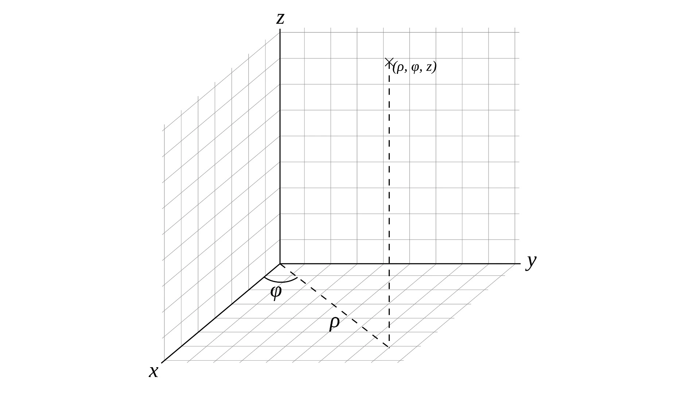
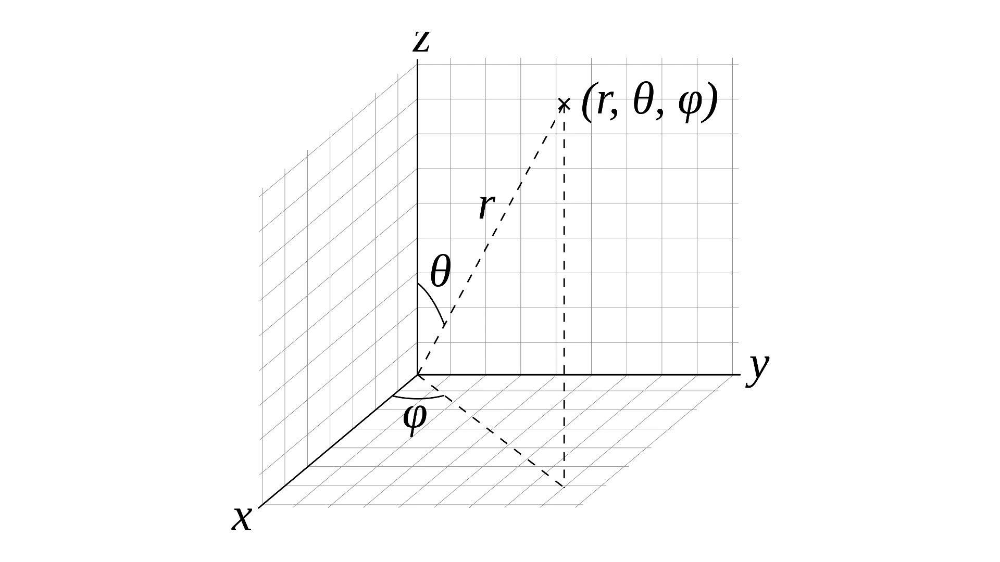

## 15 | 如何用极坐标系绘制有趣图案？

极坐标系使用**相对极点的距离**，以及**与X轴正向的夹角**来表示点的坐标。

虽然用极坐标可以简化许多曲线方程，但最终渲染的时候，我们还是需要转换成图形系统默认支持的直角坐标才可以进行绘制。

直角坐标和极坐标是怎么相互转换的？可以用两个简单的函数，toPolar和fromPolar来实现。

```javascript
// 直角坐标映射为极坐标
function toPolar(x, y) {
  const r = Math.hypot(x, y);
  const θ = Math.atan2(y, x);
  return [r, θ];
}
// 极坐标映射为直角坐标
function fromPolar(r, θ) {
  const x = r * cos(θ);
  const y = r * sin(θ);
  return [x, y];
}
```

可以通过**参数方程**结合**极坐标**，来绘制一些不太好用直角坐标系绘制的曲线。


### 如何用极坐标方程绘制曲线

扩展参数方程的绘图模块parametric.js：让它支持坐标映射

**写出对应的坐标映射函数，将极坐标映射为绘图需要的直角坐标。**

具体操作：给parametric函数增加一个参数`rFunc`。

```javascript
// src/utils/parametric.js
export default function parametric(xFunc, yFunc, rFunc) {
    return function(start, end, seg = 100, ...args) {
        const points = [];
        for (let i = 0; i <= seg; i ++) {
            const p = i / seg;
            // const t = start * (1 - p) + end * p;
            const t = start + (end - start) * i / seg;
            // console.log(t);
            const x = xFunc(t, ...args);
            const y = yFunc(t, ...args);
            if (rFunc) points.push(rFunc(x, y)); // +++++++++
            else points.push([x, y]);
        }
        return {
            draw: draw.bind(null, points),
            points
        }
    }
}
```

为什么拓展一个`rFunc`参数？

先使用rFunc来抽象坐标映射；再把其他函数作为rFunc参数传给parametric。是一种更通用的坐标映射方法，它属于函数式编程思想。

e.g.用极坐标参数方程**画一个半径为200的半圆**。

把fromPolar作为rFunc参数传给parametric，就可以使用极坐标的参数方程来绘制图形了。

```javascript
const fromPolar = (r, θ) => {
  return [r * Math.cos(θ), r * Math.sin(θ)];
}

const arc = parametric(
    t => 200, // 半径
    t => t, // 单位旋转角度
    fromPolar,
);

// ...
arc(0, Math.PI).draw(ctx); // 半径为200的半圆
```

e.g.可以添加其他的极坐标参数方程来绘制更多曲线，比如**玫瑰线、心形线或者双纽线**。

```javascript
// 玫瑰线
const rose = parametric(
    (t, a, k) => a * Math.cos(k * t), // r
    t => t, // t:单位旋转角度
    fromPolar,
);
// 心形线
const heart = parametric(
    (t, a) => a * (1 - Math.sin(t)),
    t => t, // t:单位旋转角度
    fromPolar
);
// 双纽线
const foliumRight = parametric(
    // √(2 x a² x cos(2t))
    (t, a) => a * Math.sqrt(2 * Math.cos(2 * t)),
    t => t, // t:单位旋转角度
    fromPolar
);
const foliumLeft = parametric(
    (t, a) => -Math.sqrt(2 * a ** 2 * Math.cos(2 * t)),
    t => t, // t:单位旋转角度
    fromPolar
);

// ...
// args: 200, 5
// a-200  k-5
rose(0, Math.PI, 100, 200, 5).draw(ctx, {strokeStyle: 'blue'}); // 玫瑰线
// a-100
heart(0, 2 * Math.PI, 100, 100).draw(ctx, {strokeStyle: 'red'}); // 心形线
// a-100
foliumRight(-Math.PI / 4, Math.PI / 4, 100, 100).draw(ctx, {strokeStyle: 'green'});
foliumLeft(-Math.PI / 4, Math.PI / 4, 100, 100).draw(ctx, {strokeStyle: 'green'});
```

极坐标系参数方程与直角坐标系参数方程的唯一区别：在具体实现的时候，需要额外增加一个坐标映射函数，将极坐标转为直角坐标才能完成最终的绘制。


### 如何使用片元着色器与极坐标系绘制图案？

如果使用Shader来渲染，该怎么使用极坐标系绘图呢？

**e.g.使用极坐标画圆**

```glsl
// fragment
vec2 polar(vec2 st) {
  return vec2(length(st), atan(st.y, st.x));
}

void main() {
  vec2 st = vUv - vec2(0.5);
  st = polar(st);
  gl_FragColor.rgb = smoothstep(st.x, st.x + 0.01, 0.2) * vec3(1.0);

  gl_FragColor.a = 1.0;
}
```

polar函数：将直角坐标转换为极坐标

注意：GLSL内置的`float atan(float, float)`方法，对应的方法是`Math.atan`，而在JavaScript版本的`toPolar`函数中，对应的方法是`Math.atan2`。

转换后的st.x实际上是极坐标的r分量，而st.y是极坐标的θ分量。

在直角坐标系下，点到圆心的距离 d 需要用 x、y 平方和的开方来计算，而在极坐标下，点的极坐标 r 值正好表示了点到圆心的距离d。

**无论是用直角坐标还是极坐标来画图，方法都差不多。但是，一些其他的曲线用极坐标绘制会很方便。**

**e.g.绘制玫瑰线**

```glsl
void main() {
  vec2 st = vUv - vec2(0.5);
  st = polar(st);
  float d = 0.5 * cos(st.y * 3.0) - st.x; // 三瓣玫瑰线

  gl_FragColor.rgb = smoothstep(-0.01, 0.01, d) * vec3(1.0);
  gl_FragColor.a = 1.0;
}
```

为什么`d = 0.5 * cos(st.y * 3.0) - st.x` 绘制出的图形就是三瓣玫瑰线的图案呢？

因为玫瑰线的极坐标方程`r = a * cos(k * θ)`，所以玫瑰线上的所有点都满足 `0 = a * cos(k * θ) - r` 这个方程式。所以有三种情况：

* 玫瑰线上点的d等于0
* 玫瑰线围出的图形外的点的d小于0
* 玫瑰线围出的图形内的点的d大于0

`smoothstep(-0.01, 0.01, d)` 能够将d >= 0，也就是玫瑰线内的点选出来，绘制出三瓣图形。

玫瑰线有什么用呢？它是一种很有趣的图案，只要修改u_k的值，并且保证它是正整数，就可以绘制出不同瓣数的玫瑰线图案。

```glsl
// ...
uniform float u_k;

void main() {
  vec2 st = vUv - vec2(0.5);
  st = polar(st);
  float d = 0.5 * cos(st.y * u_k) - st.x;
  gl_FragColor.rgb = smoothstep(-0.01, 0.01, d) * vec3(1.0);
  gl_FragColor.a = 1.0;
}
```

```javascript
renderer.uniforms.u_k = 3;
timer = setInterval(() => {
  renderer.uniforms.u_k += 2;
}, 200);
```

**e.g. 花瓣线**

```glsl
void main() {
  float u_k = 3.0; // 三片花瓣

  vec2 st = vUv - vec2(0.5);
  st = polar(st);
  float d = 0.5 * abs(cos(st.y * u_k * 0.5)) - st.x;
  gl_FragColor.rgb = smoothstep(-0.01, 0.01, d) * vec3(1.0);
  gl_FragColor.a = 1.0;
}
```

它和玫瑰线不一样，u_k的取值不一定要是整数。这让它能绘制出来的图形更加丰富。**e.g.横放的苹果**

```glsl
void main() {
  // float u_k = 3.0; // 三片花瓣
  float u_k = 1.3; // 横放的苹果

  vec2 st = vUv - vec2(0.5);
  st = polar(st);
  float d = 0.5 * abs(cos(st.y * u_k * 0.5)) - st.x;
  gl_FragColor.rgb = smoothstep(-0.01, 0.01, d) * vec3(1.0);
  gl_FragColor.a = 1.0;
}
```

还可以再添加几个uniform变量，如u_scale、u_offset作为参数，来绘制出更多图形。**e.g.横放的葫芦**

```glsl
varying vec2 vUv;
uniform float u_k;
uniform float u_scale;
uniform float u_offset;

${toPolar}

void main() {
  vec2 st = vUv - vec2(0.5);
  st = polar(st);
  float d = u_scale * 0.5 * abs(cos(st.y * u_k * 0.5)) - st.x + u_offset;
  gl_FragColor.rgb = smoothstep(-0.01, 0.01, d) * vec3(1.0);
  gl_FragColor.a = 1.0;
}
```

```javascript
renderer.uniforms.u_k = 1.7;
renderer.uniforms.u_scale = 0.5;
renderer.uniforms.u_offset = 0.2;
```

当取u_k = 1.7，u_scale = 0.5，u_offset = 0.2时，就能得到一个横置的葫芦图案。

继续修改 d 的计算方程，还能绘制出其他有趣的图形。**e.g.花苞图案**

```glsl
uniform float u_k;
uniform float u_scale;
uniform float u_offset;

void main() {
  vec2 st = vUv - vec2(0.5);
  st = polar(st);
  float d = smoothstep(-0.3, 1.0, u_scale * 0.5 * cos(st.y * u_k) + u_offset) - st.x;
  gl_FragColor.rgb = smoothstep(-0.01, 0.01, d) * vec3(1.0);
  gl_FragColor.a = 1.0;
}
```

我们可以结合三角函数、abs、smoothstep，来尝试绘制一些更有趣的图案。


### 极坐标系如何<span style="background-color: orange;">实现角向渐变</span>？

极坐标的另一个应用是角向渐变（conic gradients）。

角向渐变：就是以图形中心为轴，顺时针地实现渐变效果。

**e.g.CSS创建一个基于极坐标的颜色渐变**

[CSS Image Values and Replaced Content](https://www.w3.org/TR/css-images-4/#conic-gradients)标准level4

```html
<div class="conic"></div>
```

```css
.conic {
  margin: auto;
  width: 150px;
  height: 150px;
  border-radius: 50%;
  background: conic-gradient(red 0%, green 45%, blue);
}
```

通过角向渐变创建了一个颜色由角度过渡的元素。

**e.g. 在WebGL中通过极坐标用片元着色器实现类似的角向渐变效果。**

```glsl
void main() {
  vec2 st = vUv - vec2(0.5);
  st = polar(st);
  float d = smoothstep(st.x, st.x + 0.01, 0.2); // st.x：半径；st.x > 0.2时，d为0
  // 将角度范围转换到0到2PI之间
  if(st.y < 0.0) st.y += 2.0 * 3.14;
  // 计算p，角度归一化后的值
  float p = st.y / (2.0 * 3.14);
  if (p < 0.45) {
    // 0-0.45时，从红色线性过渡到绿色
    gl_FragColor.rgb = d * mix(vec3(1.0, 0, 0), vec3(0, 0.5, 0), p / 0.45);
  } else {
    // >0.45，从绿色过渡到蓝色
    gl_FragColor.rgb = d * mix(vec3(0, 0.5, 0), vec3(0, 0, 1.0), (p - 0.45) / (1.0 - 0.45));
  }
  gl_FragColor.a = smoothstep(st.x, st.x + 0.01, 0.2); // 0-透明 1-不透明；st.x > 0.2时，a为0
}
```

将像素坐标转变为极坐标之后，`st.y`就是与X轴的夹角。

因为polar函数里计算的`atan(y, x)`的取值范围是 -π 到 π，所以在`st.y`小于0的时候，将它加上2π，就能把取值范围转换到0到2π了。

然后**根据角度**换算出对应的比例**对颜色进行线性插值**。

除了CSS角向渐变的起始角度是与Y轴的夹角，而Shader是与X轴的夹角以外，没有其他的不同。


### 极坐标如何绘制HSV色轮？

**什么是色轮呢？**色轮可以帮助我们，把某种颜色表示法所能表示的所有颜色方便、直观地显示出来。

**在WebGL中该怎么绘制HSV色轮呢？**可以用极坐标结合HSV颜色来绘制它。

* 将像素坐标转换为极坐标，再除以2π，就能得到HSV的H值
* 然后用鼠标位置的x、y坐标来决定S和V的值

```glsl
void main() {
  vec2 st = vUv - vec2(0.5);
  st = polar(st);
  float d = smoothstep(st.x, st.x + 0.01, 0.2); // 半径为0.2的圆
  if(st.y < 0.0) st.y += 2.0 * 3.14;
  float p = st.y / (2.0 * 3.14);
  gl_FragColor.rgb = d * hsv2rgb(vec3(p, uMouse.x, uMouse.y));
  // gl_FragColor.rgb = d * hsv2rgb(vec3(p, 1.0, 1.0));
  gl_FragColor.a = 1.0;
}
```

```javascript
glRef.value.addEventListener('mousemove', e => {
  const {offsetX: x, offsetY: y} = e;
  const {width, height} = glRef.value.getBoundingClientRect();
  renderer.uniforms.uMouse = [
      x / width,
      (height - y) / height
  ];
});
```


### 圆柱坐标与球坐标

极坐标和圆柱坐标系以及球坐标系之间的关系。

**将极坐标系延Z轴扩展，可以得到圆柱坐标系。**

圆柱坐标系是一种三维坐标系，可以用来绘制一些三维曲线，比如螺旋线、圆内螺旋线、费马曲线等。



因为极坐标系可以和直角坐标系相互转换，所以**直角坐标系和圆柱坐标系也可以相互转换**，公式如下：

* 直角坐标系 -> 圆柱坐标系
  $$
  \begin{cases}
   ρ = \sqrt{x^2 + y^2} \\
   φ = arctan(\frac{y}{x}) \\
   z = z \\
   \end{cases}
  $$

* 圆柱坐标系 -> 直角坐标系
  $$
  \begin{cases}
   x = ρ cosφ \\
   y = ρ sinφ \\
   z = z \\
   \end{cases}
  $$
  

只转换了x、y的坐标，因为它们是极坐标，而z的坐标因为本身就是直角坐标不用转换。因此圆柱坐标系又被称为**半极坐标系**。

可以进一步将圆柱坐标系转为球坐标系。



圆柱坐标系也可以和球坐标系相互转换，公式如下：

* 圆柱坐标系 -> 球坐标系
  $$
  \begin{cases}
   r = \sqrt{ρ^2 + z^2} \\
   θ = arctan\frac{ρ}{z} \\
   φ = φ
   \end{cases}
  $$

* 球坐标系 -> 圆柱坐标系
  $$
  \begin{cases}
  ρ = r sinθ \\
  φ = φ \\
  z = r cosθ \\
  \end{cases}
  $$
  球坐标系在三维图形绘制、球面定位、碰撞检测等等可视化实现时都很有用


### 要点总结

直角坐标系与极坐标系的相互转换。

极坐标：使用相对极点的距离，以及与X轴正向的夹角来表示点的坐标。


具体使用极坐标来绘制曲线的时候，有两种渲染方式。

* 第一种是用Canvas渲染

  用之前的parametric高阶函数，将极坐标参数方程和坐标映射函数fromPolar传入，得到绘制曲线的函数，再用它来执行绘制。

  能实现直角坐标系不太好描述的曲线，比如玫瑰线、心形线等。

* 第二种是使用Shader渲染

  先将像素坐标转换为极坐标；再使用极坐标构建距离场并着色。

  能实现更多复杂的图案。


使用极坐标还可以实现角向渐变和HSV色轮。

**使用场景**

角向渐变：构建饼图

HSV色轮：颜色可视化和择色交互等


了解圆柱坐标、球坐标与直角坐标系的相互转换。

使用：处理三维图形


### 小试牛刀

1. 苹果和葫芦的图案。试着修改，让它们变成正立的

   ```glsl
   void main() {
     // 苹果
     // ...
     st.y += 3.14 / 2.0;
     // atan 的返回值是：从第一到第二象限为 0~PI，从第三到第四象限为 -PI~0
     // 旋转极坐标后要保证函数定义域的一致性
     if (st.y > 3.14) st.y -= 3.14 * 2.0;
     // ...
   }
   ```

   ```glsl
   void main() { // 葫芦
     // ...
     st.y += 3.14 / 2.0;
     if (st.y > 3.14) st.y -= 3.14 * 2.0;
     // ...
   }
   ```

   主要将角度旋转90度，作用类似于将坐标轴顺时针旋转了90度。

2. 角向渐变的例子，让着色器绘制版本的效果与CSS角向渐变效果完全一致

   ```glsl
   void main() {
     vec2 st = vUv;
     // 直角坐标系下操作
     st.x = 1.0 - st.x; // 将X坐标沿x=0.5翻转
     st = st - vec2(0.5);
     // 极坐标系下操作
     st = polar(st);
     st.y -= 3.14 / 2.0; // 将角度旋转90度
     // 以上操作完成后，直角坐标系的X轴变为Y轴，Y轴变为X轴
     // ...
   }
   ```

   对极坐标值进行处理，作用等于将直角坐标系原来的X轴变成Y轴，Y轴变成X轴。

3. 结合随机数、距离场以及极坐标，绘制一个画布并且呈现随机的剪纸图案

   