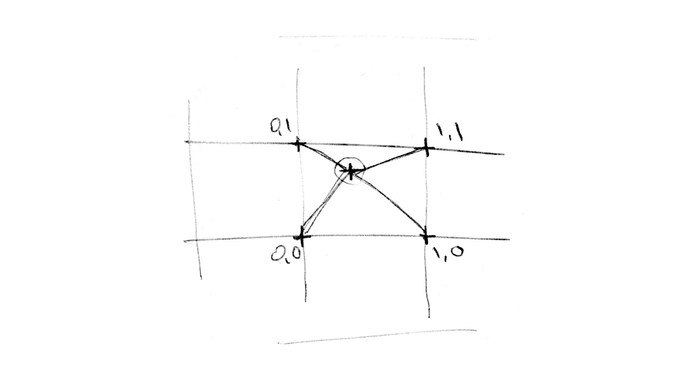

## 16 | 如何使用噪声生成复杂的纹理？

使用<span style="background-color: orange;">随机技巧</span>生成噪点、迷宫等复杂图案（第11节）。它们的作用都是**表达数据**和**增强视觉效果**。

要想在可视化视觉呈现中实现更加酷炫的视觉效果，我们经常需要生成能够**模拟大自然的、丰富而复杂的**纹理图案。

如何使用**随机技巧**来生成更加复杂的纹理图案？


### 什么是噪声？

（第11节）离散的二维伪随机函数

在真实的自然界中，这种离散的随机是存在的，比如鸟雀随机地鸣叫，蝉鸣随机地响起再停止，雨滴随机地落在某个位置等等。但<span style="background-color: orange;">随机和连续并存</span>是更常见的情况，比如山脉的走向是随机的，山峰之间的高度又是连续，类似的还有天上的云朵、水流的波纹、被侵蚀的土地等等。

要模拟这些真实自然的图形，我们就需要<span style="background-color: orange;">把随机和连续结合</span>起来，这样就形成了**噪声**（Noise）。

#### 如何实现噪声函数？

噪声函数是怎么实现的呢？

随机数是离散的，那如果我们对离散的随机点进行插值，可以<span style="background-color: orange;">让每个点之间的值连续过渡</span>。

用smoothstep或者用平滑的三次多项式来插值，就可以形成一条连续平滑的随机曲线。

**e.g. 生成折线的小例子**

```glsl
// 随机函数
float random (float x) {
  return fract(sin(x * 1243758.5453123));
}

void main() {
  vec2 st = vUv - vec2(0.5);
  st *= 10.0;
  float i = floor(st.x);
  float f = fract(st.x);

  // d直接等于随机函数返回值，这样d不连续
  float d = random(i); // 取出10个不同的'd'值(0~1)

  // st.y: -5 ~ +5
  // 1. d < st.y - 0.1 或 d > st.y + 0.1，值为0，为黑色（st.y > d+0.1 或 st.y < d-0.1）
  // 2. st.y - 0.1 < d < st.y + 0.1 时, 值为0->1->0，为黑到白再到黑的过渡色
  gl_FragColor.rgb = (smoothstep(st.y - 0.10, st.y, d) - smoothstep(st.y, st.y + 0.10, d)) * vec3(1.0);
  gl_FragColor.a = 1.0;
}
```

对`floor(st.x)`取随机数，取出10个不同的 d 值，然后把它们绘制出来，就能在画布上呈现出**10段不连续的线段**。

用`mix(random(i), random(i+1.0), f)`替换`random(i)`，那么这些线段的首尾就会连起来，也就是我们将得到**一段连续的折线**。

```glsl
// mix(a,  b,  c)：线性插值函数。a和b是两个输入的颜色或值，c是一个介于0和1之间的浮点数，表示插值的权重
// 当c接近0时，返回a；当c接近1时，mix函数返回b；当c在0和1之间时，返回a和b的插值结果。
float d = mix(random(i), random(i + 1.0), f);
```

因为这个函数*在端点处不可导*，所以它不平滑。因此，可以改用`mix(random(i), random(i+1.0), smoothstep(0.0, 1.0, f));`替换，或者直接采用三次多项式`mix(random(i), random(i+1.0), f*f*(3.0 - 2.0*f));`，就得到**一条连续且平滑的曲线**了。

```glsl
// mix(a,  b,  c)：线性插值函数。a和b是两个输入的颜色或值，c是一个介于0和1之间的浮点数，表示插值的权重
// 当c接近0时，返回a；当c接近1时，mix函数返回b；当c在0和1之间时，返回a和b的插值结果。
float d = mix(random(i), random(i + 1.0), smoothstep(0.0, 1.0, f));
// float d = mix(random(i), random(i + 1.0), f * f * (3.0 - 2.0 * f));
```

这就是噪声函数了。

这个函数是一维的，如果要使用二维的，还可以把它扩展到二维。

**二维噪声和一维噪声之间的区别**：

* 一维噪声是对两点进行插值的

* 二维噪声需要对平面画布上‘方形区域’的四个顶点，分别从x、y方向进行两次插值

  

**具体怎么做呢？**

把st与方形区域的四个顶点（对应四个向量）做插值，这样就能得到二维噪声。

```glsl
float random(vec2 st) {
  return fract(
    sin(
      dot(st.xy, vec2(12.9898, 78.233))
    )
    *
    43758.5453123
  );
}

// 二维噪声，对st与方形区域的四个顶点插值
highp float noise(vec2 st) {
  vec2 i = floor(st);
  vec2 f = fract(st);
  vec2 u = f * f * (3.0 - 2.0 * f); // 0~1
  return mix(
    mix(random(i + vec2(0.0, 0.0)), random(i + vec2(1.0, 0.0)), u.x),
    mix(random(i + vec2(0.0, 1.0)), random(i + vec2(1.0, 1.0)), u.x),
    u.y
  );
}

void main() {
  vec2 st = vUv * 20.0;
  gl_FragColor.rgb = vec3(noise(st));
  gl_FragColor.a = 1.0;
}
```

通过上面的代码，可以得到看起来**比较模糊的噪声图案**。

#### 噪声的应用

上面实现的一维*噪声波形*和二维的*模糊噪声图案*都比较简单，那它们到底是怎么模拟自然界中的现象，又该怎么实现有趣的视觉效果呢？

**结合上面得到的噪声函数，来讲2个简单的噪声应用。**

* 结合噪声和距离场，实现**类似于水滴滚过物体表面的效果**。

  ```glsl
  void main() {
    // vec2 st = (vUv - vec2(0.5)) * 20.0;
    vec2 st = mix(vec2(-10, -10), vec2(10, 10), vUv);
    float d = distance(st, vec2(0)); // 与点(0,0)的距离
    d *= noise(uTime + st); // 乘以噪声（0~1），得到新的距离值
    d = smoothstep(0.0, 1.0, d) - step(1.0, d); // d大于1的为0，黑色
    gl_FragColor.rgb = vec3(d);
    gl_FragColor.a = 1.0;
  }
  ```

* 使用不同的距离场构造方式，加上旋转噪声，可以构造出**类似于木头的条纹**

  ```glsl
  float lines(in vec2 pos, float b) {
    float scale = 10.0;
    pos *= scale;
    return smoothstep(
      0.0,
      0.5 + b * 0.5,
      abs(sin(pos.x * 3.1415) + b * 2.0) * 0.5
    );
  }
  
  vec2 rotate(vec2 v0, float ang) {
    float sinA = sin(ang);
    float cosA = cos(ang);
    mat3 m = mat3(
      cosA,  -sinA, 0,
      sinA,  cosA,  0,
      0,     0,     1
    );
    return (m * vec3(v0, 1.0)).xy;
  }
  
  void main() {
    vec2 st = vUv.yx * vec2(10.0, 3.0); // xy互换并缩放
    st = rotate(st, noise(st)); // 旋转一个角度
  
    float d = lines(st, 0.5); // 0-1 平滑过渡
  
    gl_FragColor.rgb = 1.0 - vec3(d);
    gl_FragColor.a = 1.0;
  }
  ```

理解**噪声结合距离场**的实现思路。


### 梯度噪声

前面说的噪声算法，原理是对离散的随机值进行插值，因此又被称为**插值噪声**（Value Noise）。**它有一个缺点**：就是它的值的梯度不均匀。最直观的表现就是，二维噪声图像有明显的“块状”特点，不够平滑。

可以使用另一种噪声算法，也就是**梯度噪声**（Gradient Noise）。梯度噪声是对*随机的二维向量*来插值，而不是一维的随机数。=> 能获得**更加平滑的噪声效果**。

e.g.

```glsl
vec2 random2(vec2 st) {
  st = vec2(
    dot(st, vec2(127.1, 311.7)),
    dot(st, vec2(269.5, 183.3))
  );
  return -1.0 + 2.0 * fract(sin(st) * 43758.5453123); // x和y：-1~1
}

// Gradient Noise by Inigo Quilez - iq/2013
// https://www.shadertoy.com/view/XdXGW8
float noise(vec2 st) {
  vec2 i = floor(st);
  vec2 f = fract(st);
  vec2 u = f * f * (3.0 - 2.0 * f); // 0~1

  return mix(
    mix(
      dot(random2(i + vec2(0.0, 0.0)), f - vec2(0.0, 0.0)),
      dot(random2(i + vec2(1.0, 0.0)), f - vec2(1.0, 0.0)),
      u.x
    ),
    mix(
      dot(random2(i + vec2(0.0, 1.0)), f - vec2(0.0, 1.0)),
      dot(random2(i + vec2(1.0, 1.0)), f - vec2(1.0, 1.0)),
      u.x
    ),
    u.y
  );
}

void main() {
  vec2 st = vUv * 20.0;
  gl_FragColor.rgb = vec3(0.5 * noise(st) + 0.5);
  gl_FragColor.a = 1.0;
}
```

对比：

* 插值噪声的效果：黑白色之间过渡不够平滑，还有明显的色块感；
* 梯度噪声的效果：黑白的过渡明显平滑多了，不再呈现块状。

梯度噪声在二维空间中的应用更广泛，许多有趣的模拟自然界特效的视觉实现都采用了梯度噪声。

参考：[Shadertoy.com](https://www.shadertoy.com/)平台上的例子

#### 用噪声实现云雾效果

使用噪声来模拟云雾效果

**改变噪声范围 + 按照不同权重来叠加**

e.g.模拟飞机航拍效果（云雾）

将噪声叠加6次，然后让它每次叠加的时候范围扩大一倍，但是权重减半。让噪声配合色相变化

```glsl
#define OCTAVES 6
float mist(vec2 st) {
  // Initial values
  float value = 0.0;
  float amplitude = 0.5;

  // 叠加6次
  for(int i = 0; i < OCTAVES; i ++) {
    // 每次范围扩大一倍，权重减半
    value += amplitude * noise(st);
    st *= 2.0;
    amplitude *= 0.5;
  }
  return value;
}

// 配合色相的变化

void main() {
  vec2 st = vUv;
  st.x += 0.1 * uTime;
  gl_FragColor.rgb = hsb2rgb(vec3(mist(st), 1.0, 1.0));
  gl_FragColor.a = 1.0;
}
```


### Simplex Noise

一种更新的噪声算法：Ken Perlin在2001年的Siggraph会议上展示的Simplex Noise算法

**优点**：

更低的计算复杂度和更少的乘法运算，并且可以用更少的计算量达到更高的维度，而且它制造出的噪声非常自然。

**与插值噪声以及梯度噪声的不同之处**：

不是对四边形进行插值，而是对三角网格进行插值。与四边形插值相比，三角网格插值需要计算的点更少了。=> 大大降低了计算量，从而提升了渲染性能。

具体的实现思路非常精巧和复杂，其中包含的数学技巧比较高深，可以参考[Book of Shaders](https://thebookofshaders.com/11/?lan=ch)的文章来学习。

在Shader中实现Simplex Noise代码并不算太复杂，你可以记住下面的代码，在需要的时候直接拿来使用。

```glsl
vec3 mod289(vec3 x) { return x - floor(x * (1.0 / 289.0)) * 289.0; }
vec2 mod289(vec2 x) { return x - floor(x * (1.0 / 289.0)) * 289.0; }
vec3 permute(vec3 x) { return mod289((x * 34.0 + 1.0) * x); }

//
// Description : GLSL 2D simplex noise function
//      Author : Ian McEwan, Ashima Arts
//  Maintainer : ijm
//     Lastmod : 20110822 (ijm)
//     License :
//  Copyright (C) 2011 Ashima Arts. All rights reserved.
//  Distributed under the MIT License. See LICENSE file.
//  https://github.com/ashima/webgl-noise
//
float noise(vec2 v) {
  // Precompute values for skewed triangular grid
  const vec4 C = vec4(0.211324865405187,
                      // (3.0 - sqrt(3.0))/6.0
                      0.366025403784439,
                      // 0.5 * (sqrt(3.0) - 1.0)
                      -0.577350269189626,
                      // -1.0 + 2.0 * C.x
                      0.024390243902439);
                      // 1.0 / 41.0
   // First corner (x0)
   vec2 i = floor(v + dot(v, C.yy));
   vec2 x0 = v - i + dot(i, C.xx);

   // Other two corners(x1, x2)
   vec2 i1 = vec2(0, 0);
   i1 = (x0.x > x0.y)? vec2(1.0, 0.0) : vec2(0.0, 1.0);
   vec2 x1 = x0.xy + C.xx - i1;
   vec2 x2 = x0.xy + C.zz;

   // Do some permutations to avoid
   // truncation effects in permutation
   i = mod289(i);
   vec3 p = permute(
    permute(i.y + vec3(0.0, i1.y, 1.0))
    + i.x + vec3(0.0, i1.x, 1.0)
   );

   vec3 m = max(0.5 - vec3(dot(x0, x0), dot(x1, x1), dot(x2, x2)), 0.0);

   m = m * m;
   m = m * m;

   // Gradients:
   //  41 pts uniformly over a line, mapped onto a diamond
   //  (在一条线上均匀分布 41 个点，映射到一个菱形上。)
   //  The ring size 17*17 = 289 is close to a multiple
   //      of 41(41 * 7 = 287)
   //  (环的大小17 * 17等于289，接近41的倍数（41 * 7等于287）。)
   vec3 x = 2.0 * fract(p * C.www) - 1.0;
   vec3 h = abs(x) - 0.5;
   vec3 ox = floor(x + 0.5);
   vec3 a0 = x - ox;

   // Normalise gradients implicitly by scaling m
   // Approximation of: m *= inversesqrt(a0 * a0 + h * h)
   m *= 1.79284291400159 - 0.85373472095314 * (a0 * a0 + h * h);

   // Compute final noise value at P
   vec3 g = vec3(0.0);
   g.x = a0.x * x0.x + h.x * x0.y;
   g.yz = a0.yz * vec2(x1.x, x2.x) + h.yz * vec2(x1.y, x2.y);
   return 130.0 * dot(m, g);
}

void main() {
  vec2 st = vUv * 20.0;
  gl_FragColor.rgb = vec3(0.5 * noise(st) + 0.5);
  gl_FragColor.a = 1.0;
}
```

Simplex Noise可以实现出令人惊叹的效果。

e.g.[某种溶洞的岩壁效果](https://www.shadertoy.com/view/MdSXzz)

[海水波动的效果](https://www.shadertoy.com/view/Ms2SD1)


### 网格噪声

将噪声与网格结合使用的一种纹理生成技术。

**e.g.生成动态生物细胞**

1. 用网格技术将画布分为10x10的网格

2. 构建距离场

   这个距离场是在每个网格中随机一个特征点，然后计算网格内到该点的距离

3. 根据距离来着色

```glsl
vec2 random2(vec2 st) {
  st = vec2(
    dot(st, vec2(127.1, 311.7)),
    dot(st, vec2(269.5, 183.3))
  );
  return fract(sin(st) * 43758.5453123); // x和y：0~1
}

void main() {
  vec2 st = vUv * 10.0;

  float d = 1.0;
  vec2 i_st = floor(st);
  vec2 f_st = fract(st);

  vec2 p = random2(i_st); // 特征点
  d = distance(f_st, p);

  gl_FragColor.rgb = vec3(d);
  gl_FragColor.a = 1.0;
}
```

这里的每个网格是独立的，并且界限分明。

**如果我们想让它们的边界过渡更圆滑该怎么办呢？**

不仅计算片元到当前网格特征点的距离，还要计算它到周围相邻的8个网格特征点的距离，然后取最小值。

可以用for循环来实现：

```glsl
void main() {
  vec2 st = vUv * 10.0;

  float d = 1.0;
  vec2 i_st = floor(st);
  vec2 f_st = fract(st);

  for (int i = -1; i <= 1; i ++) {
    for (int j = -1; j <= 1; j ++) {
      vec2 neighbor = vec2(float(i), float(j)); // 坐标x和y：-1~1
      vec2 p = random2(i_st + neighbor); // 9个随机特征点在自身网格内的坐标（坐标x和y：0~1）
      // 当前点和9个随机特征点 最近的距离
      d = min(d, distance(f_st, neighbor + p)); // f_st（当前片元在自身网格内的坐标），neighbor+p（特征点相对片元所在网格的坐标，坐标X和Y：-1~2）
    }
  }

  gl_FragColor.rgb = vec3(d);
  gl_FragColor.a = 1.0;
}
```

注意：GLSL语言的for循环限制比较多。

* 检查循环是否继续的次数必须是常量。GLSL中没有动态循环
* 迭代的次数必须是确定的


加上uTime，让网格动起来，另外把特征点也给显示出来。就得到**类似动态的生物细胞**。

```glsl
void main() {
  vec2 st = vUv * 10.0;

  float d = 1.0;
  vec2 i_st = floor(st);
  vec2 f_st = fract(st);

  for (int i = -1; i <= 1; i ++) {
    for (int j = -1; j <= 1; j ++) {
      vec2 neighbor = vec2(float(i), float(j)); // 坐标x和y：-1~1
      vec2 p = random2(i_st + neighbor); // 9个随机特征点在自身网格内的坐标（坐标x和y：0~1）
      p = 0.5 + 0.5 * sin(uTime + 6.2831 * p); // 随时间动态变化（0~1）
      // 当前点和9个特征点 最近的距离
      d = min(d, distance(f_st, neighbor + p)); // neighbor+p（坐标X和Y：-1~2）
    }
  }

  gl_FragColor.rgb = vec3(d) + step(d, 0.03); // 显示特征点
  gl_FragColor.a = 1.0;
}
```

网格噪声是一种目前被广泛应用的**程序化纹理技术**。可以用来模拟物体表面的晶格、晶体生长、细胞、微生物等等有趣的效果。


### 要点总结

这节中的技术，实际上是**一种复杂的程序化纹理生成技术**。

用程序来生成物体表面的图案。在这些图案中引入类似于自然界中的随机性，就可以模拟出自然的、丰富多彩的以及包含真实细节的纹理图案。

其中**最有代表性的就是噪声**。噪声就是随机性与连续性结合而成的。

模拟噪声的基本思路是**对离散的随机数进行平滑处理**，对随机数进行平滑处理有不同的数学技巧，所以有插值噪声、梯度噪声、Simplex noise等等不同的噪声算法。可以根据不同的情况来选择怎么使用。

偏向于技巧性，要想掌握好，需要多动手实践。

一个非常优秀的创作和分享着色器效果的平台：[Shadertoy.com](https://www.shadertoy.com/)


### 小试牛刀

实现如下网格噪声效果。

