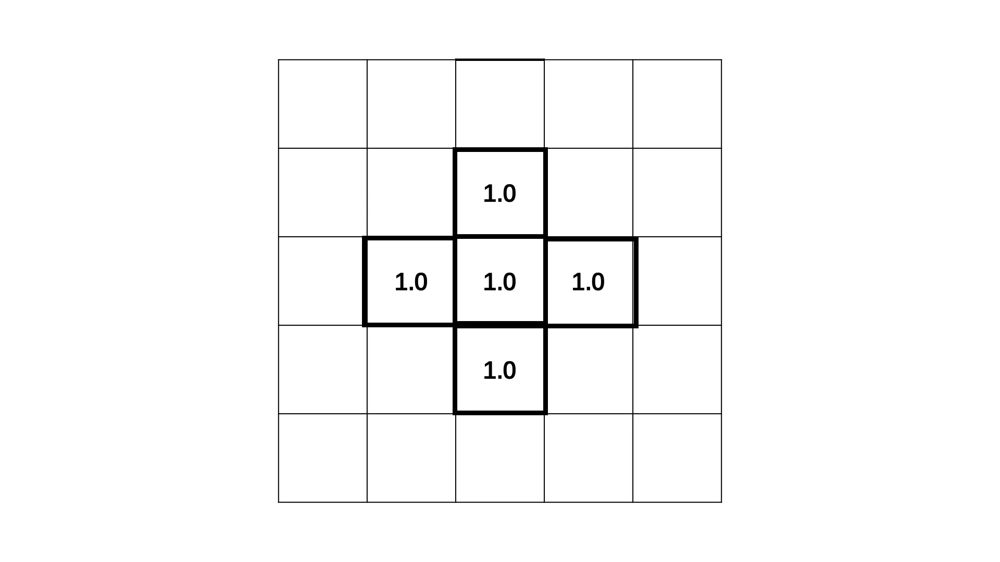

## 17 | 如何使用后期处理通道增强图像效果？

利用向量和矩阵公式，来处理像素和生成纹理的技巧，都有一定的局限性：每个像素是彼此独立的，不能共享信息。

因为GPU是并行渲染的，所以在着色器的执行中，每个像素的着色都是同时进行的。这样一来，我们就不能获得某一个像素周围坐标点的颜色信息，也不能获得要渲染图像的全局信息。

如果要实现**与周围像素点联动的效果**，比如给生成的纹理添加平滑效果滤镜，就不能直接通过着色器的运算来实现了。

像这样不能直接通过着色器运算来实现的效果，我们需要使用其他的办法来实现，其中一种办法就是使用**后期处理通道**。后期处理通道，是指**将渲染出来的图像作为纹理输入给新着色器处理**，是一种二次加工的手段。

可以在二次加工时，从纹理中获取任意uv坐标下的像素信息，也就相当于可以获取任意位置的像素信息了。

**使用后期处理通道的一般过程**：

* 先正常地将数据送入缓冲区，然后执行WebGLProgram

* 将输出的结果再作为纹理，送入另一个WebGLProgram进行处理

  这个过程可以进行一次，也可以循环多次

* 经过两次WebGLProgram处理之后，再输出结果到画布


### 如何用后期处理通道<span style="background-color: #fae4b3;">实现Blur滤镜</span>？

在12节中，在Canvas2D中实现了Blur滤镜（高斯模糊的平滑效果滤镜），但Canvas2D实现滤镜的性能不佳，尤其是在图片较大，需要大量计算的时候。

在WebGL中，可以**通过后期处理来实现高性能的Blur滤镜**。

**e.g.给随机三角形图案加Blur滤镜**

* 首先，实现一个绘制随机三角形图案的着色器。

  ```javascript
  const fragment = `
    #ifdef GL_ES
    precision highp float;
    #endif
  
    varying vec2 vUv;
  
    ${distance.base}
  
    ${noise.random2d}
  
    ${color.hsb}
  
    void main() {
      vec2 st = vUv;
      st *= 10.0;
      vec2 i_st = floor(st);
      vec2 f_st = 2.0 * fract(st) - vec2(1);
      float r = random(i_st);
      float sign = 2.0 * step(0.5, r) - 1.0;
  
      float d = triangle_distance(
        f_st,
        vec2(-1),
        vec2(1),
        sign * vec2(1, -1)
      );
      gl_FragColor.rgb = (smoothstep(-0.85, -0.6, d) - smoothstep(0.0, 0.05, d)) * hsb2rgb(vec3(r + 1.2, 0.5, r));
      gl_FragColor.a = 1.0;
    }
  `;
  ```

* 使用后期处理通道对它进行高斯模糊。

  * 准备另一个着色器：blurFragment。通过它，我们能将第一次渲染后生成的纹理tMap内容给显示出来。

    ```javascript
    const blurFragment = `
      #ifdef GL_ES
      precision highp float;
      #endif
    
      varying vec2 vUv;
      uniform sampler2D tMap;
    
      void main() {
        vec4 color = texture2D(tMap, vUv);
    
        gl_FragColor.rgb = color.rgb;
        gl_FragColor.a = color.a;
      }
    `;
    ```

  * 修改JavaScript代码，把渲染分为两次。

    * 第一次渲染时，启用program程序，但不直接把图形输出到画布上，而是输出到一个帧缓冲对象（Frame Buffer Object）上。
    * 第二次渲染时，再启用blurProgram程序，将第一次渲染完成的纹理（fbo.texture）作为blurFragment的tMap变量，这次的输出绘制到画布上。

    ```javascript
    const fbo = renderer.createFBO(); // 创建帧缓冲对象
    renderer.bindFBO(fbo); // 绑定帧缓冲对象
    renderer.render(); // 输出到帧缓冲对象
    renderer.bindFBO(null); // 解除绑定
    
    const blurProgram = renderer.compileSync(blurFragment, vertex);
    renderer.useProgram(blurProgram);
    renderer.setMeshData(program.meshData);
    renderer.uniforms.tMap = fbo.texture; // 将前一个着色器程序生成的纹理作为新着色器的 tMap 变量
    renderer.render();
    ```

    `renderer.createFBO`是创建帧缓冲对象，`bindFBO`是绑定帧缓冲对象。

    这里通过`gl-renderer`做了一层简单的封装。

    上面的代码，是将第一次渲染到帧缓冲的结果原封不动地输出到画布上了。

  * 修改blurFragment代码，在其中添加高斯模糊的代码。

    ```javascript
    const blurFragment1 = `
      #ifdef GL_ES
      precision highp float;
      #endif
    
      varying vec2 vUv; // 当前片元映射的纹理坐标
      uniform sampler2D tMap;
      uniform int axis; // 标记对哪个坐标轴进行高斯模糊的处理
    
      void main() {
        vec4 color = texture2D(tMap, vUv);
    
        // 高斯矩阵的权重值
        float weight[5];
        weight[0] = 0.227027;
        weight[1] = 0.1945946;
        weight[2] = 0.1216216;
        weight[3] = 0.054054;
        weight[4] = 0.016216;
    
        // 每一个相邻像素的坐标间隔，这里的512可以用实际的Canvas像素宽代替
        float tex_offset = 1.0 / 512.0;
        vec3 result = color.rgb;
        result *= weight[0];
        for (int i = 1; i < 5; ++ i) {
          float f = float(i);
          if (axis == 0) { // X轴的高斯模糊
            result += texture2D(tMap, vUv + vec2(tex_offset * f, 0.0)).rgb * weight[i];
            result += texture2D(tMap, vUv - vec2(tex_offset * f, 0.0)).rgb * weight[i];
          } else { // Y轴的高斯模糊
            result += texture2D(tMap, vUv + vec2(0.0, tex_offset * f)).rgb * weight[i];
            result += texture2D(tMap, vUv - vec2(0.0, tex_offset * f)).rgb * weight[i];
          }
        }
    
        gl_FragColor.rgb = result.rgb;
        gl_FragColor.a = color.a;
      }
    `;
    ```

    因为高斯模糊有两个方向，x和y方向，所以至少要执行两次渲染，一次对X轴，另一次对Y轴。

    想要达到更好的效果，可以执行多次渲染。

  * 继续修改JavaScript代码。（分别对X轴和Y轴执行2次渲染）

    ```javascript
    // 创建两个FBO对象交替使用
      const fbo1 = renderer.createFBO();
      const fbo2 = renderer.createFBO();
      // 第一次，渲染原始图形
      renderer.bindFBO(fbo1);
      renderer.render();
      const blurProgram1 = renderer.compileSync(blurFragment1, vertex);
      // 第二次，对X轴高斯模糊
      renderer.useProgram(blurProgram1);
      renderer.setMeshData(program.meshData);
      renderer.bindFBO(fbo2);  // 绑定帧缓冲对象
      renderer.uniforms.tMap = fbo1.texture;
      renderer.uniforms.axis = 0;
      renderer.render(); // 将第二次的绘制结果输出到帧缓冲对象
      // 第三次，对Y轴高斯模糊
      renderer.useProgram(blurProgram1);
      renderer.bindFBO(fbo1);
      renderer.uniforms.tMap = fbo2.texture;
      renderer.uniforms.axis = 1;
      renderer.render(); // 将第三次的绘制结果输出到帧缓冲对象
      // 第四次，对X轴高斯模糊
      renderer.useProgram(blurProgram1);
      renderer.bindFBO(fbo2);
      renderer.uniforms.tMap = fbo1.texture;
      renderer.uniforms.axis = 0;
      renderer.render(); // 将第四次的绘制结果输出到帧缓冲对象
      // 第五次，对Y轴高斯模糊
      renderer.useProgram(blurProgram1);
      renderer.bindFBO(null); // 解除FBO绑定
      renderer.uniforms.tMap = fbo2.texture;
      renderer.uniforms.axis = 1;
      renderer.render(); // 将第五次的绘制结果输出到画布上
    ```

    一共进行5次绘制，先对原始图片执行1次渲染，再进行4次后期处理。

    **一个小技巧**：在执行的5次绘制中，前四次都是输出到帧缓冲对象，所以理论上需要4个FBO对象。但是，由于可以交替使用FBO对象，也就是可以把用过的对象重复使用。因此，无论需要绘制多少次，都只要创建两个对象就可以，也就节约了内存。

  * 最终通过后期处理通道实现Blur滤镜，给三角形图案加上模糊的效果了。

  

### 如何用后期处理通道<span style="background-color: #fae4b3;">实现辉光效果</span>？

**对特定元素进行高斯模糊**。

在可视化和游戏开发中，常用这种技巧来实现元素的“辉光”效果。

* 给blurFragment 添加一个关于亮度的滤镜，将颜色亮度大于 filter值的三角形过滤出来添加高斯模糊。

  ```javascript
  const blurFragment1 = `
    #ifdef GL_ES
    precision highp float;
    #endif
  
    varying vec2 vUv; // 当前片元映射的纹理坐标
    uniform sampler2D tMap;
    uniform int axis; // 标记对哪个坐标轴进行高斯模糊的处理
    uniform float filter; // 将颜色亮度大于 filter 值的片元过滤出来添加高斯模糊
  
    void main() {
      vec4 color = texture2D(tMap, vUv);
  
      float brightness = dot(
        color.rgb,
        vec3(0.2126, 0.7152, 0.0722)
      );
      brightness = step(filter, brightness);
  
      // 高斯矩阵的权重值
      float weight[5];
      weight[0] = 0.227027;
      weight[1] = 0.1945946;
      weight[2] = 0.1216216;
      weight[3] = 0.054054;
      weight[4] = 0.016216;
  
      // 每一个相邻像素的坐标间隔，这里的512可以用实际的Canvas像素宽代替
      float tex_offset = 1.0 / 512.0;
  
      vec3 result = color.rgb;
      result *= weight[0];
      for (int i = 1; i < 5; ++ i) {
        float f = float(i);
        if (axis == 0) { // X轴的高斯模糊
          result += texture2D(tMap, vUv + vec2(tex_offset * f, 0.0)).rgb * weight[i];
          result += texture2D(tMap, vUv - vec2(tex_offset * f, 0.0)).rgb * weight[i];
        } else { // Y轴的高斯模糊
          result += texture2D(tMap, vUv + vec2(0.0, tex_offset * f)).rgb * weight[i];
          result += texture2D(tMap, vUv - vec2(0.0, tex_offset * f)).rgb * weight[i];
        }
      }
  
      gl_FragColor.rgb = brightness * result.rgb;
      gl_FragColor.a = color.a;
    }
  `;
  ```

* 增加一个bloomFragment着色器，用来做最后的效果混合。

  这里使用一个叫做[Tone Mapping](https://zh.wikipedia.org/wiki/%E8%89%B2%E8%B0%83%E6%98%A0%E5%B0%84)（色调映射）的方法（比较复杂）。可以将**对比度过大的**图像色调映射到合理的范围内。

  ```javascript
  // 用于做最后的效果混合。
  // 使用Tone Mapping（色调映射）的方法：
  // 将对比度过大的图像色调映射到合理的范围。
  const bloomFragment = `
    #ifdef GL_ES
    precision highp float;
    #endif
  
    uniform sampler2D tMap;
    uniform sampler2D tSource;
  
    varying vec2 vUv;
  
    void main() {
      vec3 color = texture2D(tSource, vUv).rgb;
      vec3 bloomColor = texture2D(tMap, vUv).rgb;
      color += bloomColor;
      // tone mapping 色调映射
      float exposure = 2.0;
      float gamma = 1.3;
      vec3 result = vec3(1.0) - exp(-color * exposure);
      // also gamma correct while we're at it
      if (length(bloomColor) > 0.0) {
        result = pow(result, vec3(1.0 / gamma));
      }
      gl_FragColor.rgb = result;
      gl_FragColor.a = 1.0;
    }
  `;
  ```

* 修改JavaScript渲染的逻辑：添加新的后期处理规则。

  使用三个FBO对象，第一个FBO对象在渲染原始图形之后，还要在混合效果时使用，后两个对象用来交替使用完成高斯模糊。

  最后，将原始图形和高斯模糊的结果进行效果混合就可以了。

  ```javascript
  // 创建三个FBO对象，fbo1和fbo2交替使用
  const fbo0 = renderer.createFBO();
  const fbo1 = renderer.createFBO();
  const fbo2 = renderer.createFBO();
  // 第一次，渲染原始图形
  renderer.bindFBO(fbo0);
  renderer.render();
  const blurProgram1 = renderer.compileSync(blurFragment1, vertex);
  const bloomProgram = renderer.compileSync(bloomFragment, vertex);
  // 第二次，对X轴高斯模糊
  renderer.useProgram(blurProgram1);
  renderer.setMeshData(program.meshData);
  renderer.bindFBO(fbo2);  // 绑定帧缓冲对象
  renderer.uniforms.tMap = fbo0.texture;
  renderer.uniforms.axis = 0;
  renderer.uniforms.filter = 0.7; // 颜色亮度>0.7添加高斯模糊
  renderer.render(); // 将第二次的绘制结果输出到帧缓冲对象
  // 第三次，对Y轴高斯模糊
  renderer.useProgram(blurProgram1);
  renderer.bindFBO(fbo1);
  renderer.uniforms.tMap = fbo2.texture;
  renderer.uniforms.axis = 1;
  renderer.uniforms.filter = 0; // 颜色亮度>0添加高斯模糊
  renderer.render(); // 将第三次的绘制结果输出到帧缓冲对象
  // 第四次，对X轴高斯模糊
  renderer.useProgram(blurProgram1);
  renderer.bindFBO(fbo2);
  renderer.uniforms.tMap = fbo1.texture;
  renderer.uniforms.axis = 0;
  renderer.uniforms.filter = 0; // 颜色亮度>0添加高斯模糊
  renderer.render(); // 将第四次的绘制结果输出到帧缓冲对象
  // 第五次，对Y轴高斯模糊
  renderer.useProgram(blurProgram1);
  renderer.bindFBO(fbo1);
  renderer.uniforms.tMap = fbo2.texture;
  renderer.uniforms.axis = 1;
  renderer.uniforms.filter = 0; // 颜色亮度>0添加高斯模糊
  renderer.render(); // 将第五次的绘制结果输出到帧缓冲对象
  // 第六次，叠加辉光
  renderer.useProgram(bloomProgram);
  renderer.setMeshData(program.meshData);
  renderer.bindFBO(null);
  renderer.uniforms.tSource = fbo0.texture;
  renderer.uniforms.tMap = fbo1.texture;
  renderer.render();
  ```

* 最终渲染后，能让三角形图案中几个比较亮的三角形，产生一种微微发光的效果。

实现了最终的**局部辉光效果**。

实现关键：在高斯模糊原理的基础上，将局部高斯模糊的图像与原始图像叠加。


### 如何用后期处理通道<span style="background-color: #fae4b3;">实现烟雾效果</span>？

e.g.一个小圆的烟雾效果

具体实现过程：

* 通过创建一个Shader，画出一个简单的圆
* 对这个圆进行后期处理

#### 使用距离场在画布上画一个圆

```glsl
varying vec2 vUv;

void main() {
  vec2 st = vUv - vec2(0.5);
  float d = length(st);
  gl_FragColor.rgb = vec3(1.0 - smoothstep(0.05, 0.055, d));
  gl_FragColor.a = 1.0;
}
```

#### 修改Shader代码

增加uTime、tMap两个变量。

uTime用于控制图像随时间变化；tMap是用来做后期处理的变量。

```glsl
varying vec2 vUv;
uniform sampler2D tMap; // 用于后期处理
uniform float uTime; // 控制图像随时间变化

void main() {
  vec3 smoke = vec3(0);
  if (uTime <= 0.0) { // 判断是第一次还是后续的叠加过程
    vec2 st = vUv - vec2(0.5);
    float d = length(st);
    smoke = vec3(1.0 - smoothstep(0.05, 0.055, d));
  }
  
  vec3 diffuse = texture2D(tMap, st).rgb;
  gl_FragColor.rgb = diffuse + smoke;
  gl_FragColor.a = 1.0;
}
```

使用一个 if 语句，判断是初始绘制还是后续的叠加过程，就能把着色器合并成一个。

#### 修改JavaScript代码

创建两个FBO，交替进行绘制；最后把绘制的内容输出到画布上。

```javascript
const fbo = {
  readFBO: renderer.createFBO(), // 读取的缓冲
  writeFBO: renderer.createFBO(), // 写入的缓冲
  get texture() {
    return this.readFBO.texture;
  },
  swap() {
    const tmp = this.writeFBO;
    this.writeFBO = this.readFBO;
    this.readFBO = tmp;
  }
};
function update(t) {
  // 输出到画布
  renderer.bindFBO(null);
  renderer.uniforms.uTime = t / 1000;
  renderer.uniforms.tMap = fbo.texture; // 从readFBO读取纹理
  renderer.render();
  // 输出到FBO
  renderer.bindFBO(fbo.writeFBO); // 向writeFBO写入纹理
  renderer.uniforms.tMap = fbo.texture;
  fbo.swap(); // 交换读写缓冲以便下次写入
  renderer.render();
  requestAnimationFrame(update);
}
update(0);
```

此时输出的画面并没有什么变化。

第一次渲染时，也就是uTime为0，直接画了一个圆。当我们从上一次绘制的纹理中获取信息，重新渲染时，因为每次获取的纹理图案都是不变的，所以现在的画面依然是静止的圆。

#### 继续修改Shader代码（上升的圆）

如果想让这个图动起来，比如说让它向上升，那么只要在每次绘制的时候，改变一下采样的y坐标，就是每次从tMap取样时**取当前纹理坐标稍微下方一点的像素点**就可以了。

```glsl
varying vec2 vUv;
uniform sampler2D tMap; // 用于后期处理
uniform float uTime; // 控制图像随时间变化

void main() {
  vec3 smoke = vec3(0);
  if (uTime <= 0.0) { // 判断是第一次还是后续的叠加过程
    vec2 st = vUv - vec2(0.5);
    float d = length(st);
    smoke = vec3(1.0 - smoothstep(0.05, 0.055, d));
  }
  
  vec2 st = vUv;
  st.y -= 0.001;
  vec3 diffuse = texture2D(tMap, st).rgb;
  gl_FragColor.rgb = diffuse + smoke;
  gl_FragColor.a = 1.0;
}
```

由于纹理采样精度的问题，我们得到的上升圆还会有一个扩散的效果。

#### 烟雾效果

**构建一个烟雾的扩散模型。**以某个像素以及周边像素的纹理颜色来计算新的颜色值。

e.g.一个5x5的画布。

假设画布只有中心五个位置的颜色是纯白（1.0），周围都是黑色。



在这个扩散模型中，每个格子到下一时刻的**颜色变化量**，等于它周围四个格子的颜色值之和 减去 它自身颜色值的4倍，再乘以扩散系数。

假设扩散系数是常量0.1，那么第一轮每一个的颜色值如以下表格所示。


* 红色格子：颜色变化量 = 0.1 * ((1.0+1.0+1.0+1.0) - 4 * 1.0) = 0，下一帧颜色值还是1.0
* 蓝色格子：颜色变化量 = 0.1 * ((1.0+0+0+0) - 4 * 1.0) = -0.3，下一帧的颜色值要减去0.3就是0.7
* 绿色格子，两种情况
  * 和两个蓝色格子相邻：颜色变化量 = 0.1 * ((1.0+1.0+0+0) - 4 * 0) = 0.2，下一帧的颜色值变为0.2
  * 和一个蓝色格子相邻：颜色变化量 = 0.1 * ((1.0+0+0+0) - 4 * 0) = 0.1，下一帧的颜色值变为0.1

把每一帧颜色按照这个规则不断迭代下去，就能得到一个烟雾扩散效果了。

在fragment Shader中添加扩散模型的时候，**为了让这个烟雾效果，能上升得更明显，在Shader中修改一下扩散公式的权重，让它向上的幅度比较大。**

```glsl
void main() {
  vec3 smoke = vec3(0);
  if (uTime <= 0.0) { // 判断是第一次还是后续的叠加过程
    vec2 st = vUv - vec2(0.5);
    float d = length(st);
    smoke = vec3(step(d, 0.05));
    // smoke = vec3(1.0 - smoothstep(0.05, 0.055, d));
  }

  vec2 st = vUv;
  // st.y -= 0.001; // 取当前纹理坐标稍微下方一点的像素点

  vec3 diffuse = texture2D(tMap, st).rgb;
  float offset = 1.0 / 256.0;

  vec4 left  = texture2D(tMap, st + vec2(-offset, 0.0));
  vec4 right = texture2D(tMap, st + vec2(offset, 0.0));
  vec4 up    = texture2D(tMap, st + vec2(0.0, -offset));
  vec4 down  = texture2D(tMap, st + vec2(0.0, offset));

  float diff = 8.0 * 0.016 * (
    left.r +
    right.r +
    down.r +
    2.0 * up.r -
    5.0 * diffuse.r
  );

  gl_FragColor.rgb = (diffuse + diff) + smoke;
  gl_FragColor.a = 1.0;
}
```

为了达到更真实的烟雾效果，我们还可以在扩散函数上**增加一些噪声**。

```glsl
void main() {
  vec3 smoke = vec3(0);
  if (uTime <= 0.0) { // 判断是第一次还是后续的叠加过程
    vec2 st = vUv - vec2(0.5);
    float d = length(st);
    smoke = vec3(step(d, 0.05));
    // smoke = vec3(1.0 - smoothstep(0.05, 0.055, d));
  }

  vec2 st = vUv;
  // st.y -= 0.001; // 取当前纹理坐标稍微下方一点的像素点

  vec3 diffuse = texture2D(tMap, st).rgb;
  float offset = 1.0 / 256.0;

  vec4 left  = texture2D(tMap, st + vec2(-offset, 0.0));
  vec4 right = texture2D(tMap, st + vec2(offset, 0.0));
  vec4 up    = texture2D(tMap, st + vec2(0.0, -offset));
  vec4 down  = texture2D(tMap, st + vec2(0.0, offset));

  float rand = noise(st + 5.0 * uTime); // 添加噪声
  float diff = 8.0 * 0.016 * (
    (1.0 + rand) * left.r +
    (1.0 - rand) * right.r +
    down.r +
    2.0 * up.r -
    5.0 * diffuse.r
  );

  gl_FragColor.rgb = (diffuse + diff) + smoke;
  gl_FragColor.a = 1.0;
}
```

这样，最终实现的效果看起来就会更真实一些。


### 要点总结

怎么在WebGL中，使用后期处理通道来增强图像的视觉效果。

**核心原理**：把第一次渲染后的内容输出到帧缓冲对象FBO中；然后把这个对象的内容作为纹理图片，再进行下一次渲染，这个渲染的过程可以重复若干次；最后把结果输出到屏幕上。


### 小试牛刀

1. 试着改进烟雾扩散效果。两个参考建议：

   1. 给定一个向量，表示风向和风速，让烟雾随着这个风扩散，这个风可以随着时间慢慢变化（可以使用噪声来实现风的变化），看看能够做出什么效果。
   2. 尝试让烟雾跟随鼠标移动轨迹扩散。

   [参考文章](https://code.tutsplus.com/how-to-write-a-smoke-shader--cms-25587t)

2. spritejs官网上类似于探照灯的效果。

   链接已失效


[帧缓冲对象](https://blog.csdn.net/xufeng0991/article/details/76736971)-CSDN