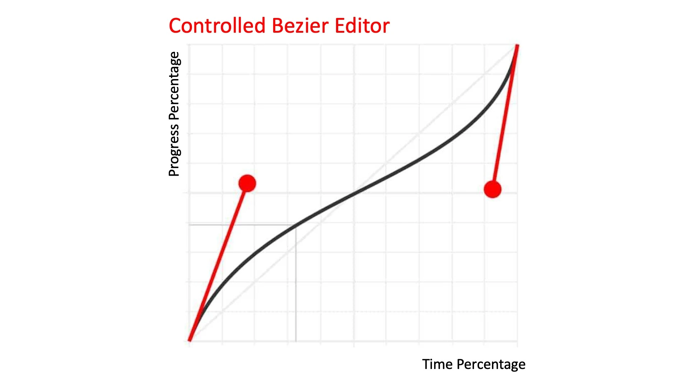

## 18 | 如何生成简单动画让图形动起来？

对于可视化展现来说，动画和3D都是用来**强化数据表达，吸引用户**的重要技术手段。

比二维平面图形能够表达更复杂的数据，实现更吸引人的视觉效果。

**动画实现的标准方法**。

### 动画的三种形式

简单来说，动画就是**将许多帧静止的画面**以**固定的速率**连续播放出来。

一般来说，动画有三种形式，分别是固定帧动画、增量动画和时序动画。

* 固定帧动画

  预先准备好要播放的静态图像，然后将这些图依次播放

* 增量动画

  在动态绘制图像的过程中，修改每一帧中某个或某几个属性的值，给它们一定的增量

* 时序动画

  在动态绘制图像的过程中，根据时间和动画函数计算每一帧中的关键属性值，然后更新这些属性

以HTML/CSS为例，实现这三种动画的基本形式。

HTML/CSS、SVG和Canvas2D实现动画的方式大同小异。

#### 1. 实现固定帧动画

第一步，为每一帧准备一张静态图像。

第二步，依次播放这些图像。（在CSS里实现的时候，使用图片作为背景，就可以让它们逐帧切换了。）

**e.g.动态的小鸟**

```html
<!-- 固定帧动画 -->
<div v-show="checkedTab === 0" style="position: relative;">
  <div class="fixed-frame"></div>
</div>
```

```css
/*固定帧动画*/
.fixed-frame {
  position: absolute;
  left: 100px;
  top: 100px;
  width: 86px;
  height: 60px;
  zoom: 0.5;
  background-repeat: no-repeat;
  background-image: url("@/assets/bird.png");
  background-position: -178px -2px;
  animation: flappy .5s step-end infinite;
}
@keyframes flappy {
  0%  {background-position: -178px -2px;}
  33% {background-position: -90px -2px;}
  66% {background-position: -2px -2px;}
}
```

优点：实现起来非常简单

缺点：不适合生成需要动态绘制的图像

应用：更适合在游戏等应用场景中，生成由美术提供现成图片的动画帧图像。

动态绘制的图像，也就是非固定帧动画，通常会使用另外两种方式。

#### 2. 实现增量动画

每帧给属性一个增量。

**e.g.实现蓝色方块旋转的动画**

具体做法：创建一个蓝色的方块；给这个方块的每一帧增加一个rotate角度。

```html
<!-- 增量动画 -->
<div v-show="checkedTab === 1" style="position: relative;">
  <div class="increase-frame" ref="increaseRef"></div>
</div>
```

```css
/*增量动画*/
.increase-frame {
  position: absolute;
  left: 100px;
  top: 100px;
  width: 100px;
  height: 100px;
  background-color: blue;
  transform-origin: 50% 50%;
}
```

```javascript
let rotation = 0;
requestAnimationFrame(function update() {
  increaseRef.value.style.transform = `rotate(${rotation ++}deg)`;
  requestAnimationFrame(update);
});
```

关键逻辑在于我们修改rotation值，每次绘制的时候将它加1。

优点：实现简单

缺点：

* 使用增量来控制动画（从数学角度来说，也就是直接使用了一阶导数来定义的动画），这样的绘图方式不太好控制动画的细节，比如动画周期、变化率、轨迹等等。

  只能用来实现简单动画。

  [**一阶导数**](https://baike.baidu.com/item/%E4%B8%80%E9%98%B6%E5%AF%BC%E6%95%B0/4026914?fr=ge_ala)表示的是函数的变化率

* 增量动画定义的是状态变化。

  如果要在Shader中使用动画，就只能采用后期处理通道来实现。（要进行多次渲染，实现起来比较繁琐，性能开销也比较大。

更加复杂的轨迹动画，一般通过定义时间和动画函数来实现。

#### 3. 实现时序动画

**e.g.旋转的蓝色方块**

```javascript
const startAngle = 0;
const T = 2000; // 周期。旋转这一周的时间
let startTime = null;
function update() {
  startTime = startTime === null ? Date.now() : startTime;
  const p = (Date.now() - startTime) / T;
  const angle = startAngle + p * 360;
  timeOrderRef.value.style.transform = `rotate(${angle}deg)`;
  requestAnimationFrame(update);
}
update();
```

* 定义两个变量，startAngle和T。
  * startAngle是起始旋转角度
  * T是旋转周期
* 每次调用update的时候，当前经过的时间就是`Date.now() - startTime`，除以周期T，就能得到旋转进度p
  * 当前角度就等于`startAngle + p * 360`。
* 将当前角度设置为元素的rotate值，就实现了旋转动画。

时序动画的实现可以总结为三步：

* 定义初始时间和周期
* 在update中计算当前经过时间和进度p
* 通过 p 来更新动画元素的属性

优点：可以更直观、精确地控制旋转动画的周期（速度）、起始角度等参数

缺点：写法复杂

应用：在动画实现中最为常用。


### 定义标准动画模型

把实现时序动画的三个步骤抽象成标准的动画模型。

* 首先，定义一个类Timing用于处理时间

  ```javascript
  /**
   * 用于处理动画的时间
   */
  export class Timing {
      constructor({duration, iterations = 1} = {}) {
          this.startTime = Date.now();
          this.duration = duration; // 周期
          this.iterations = iterations; // 重复次数
      }
  
      /**
       * 动画经过的时间
       * @returns {number}
       */
      get time() {
          return Date.now() - this.startTime;
      }
  
      /**
       * 动画进度
       * @returns {number|number}
       */
      get p() {
          // 动画持续了几个周期
          const progress = Math.min(this.time / this.duration, this.iterations);
          // 动画已结束：进度1
          // 动画未结束：0~1
          return this.isFinished ? 1 : progress % 1;
      }
  
      /**
       * 动画是否已结束
       * @returns {boolean}
       */
      get isFinished() {
          // 动画持续了几个周期是否已达到指定次数
          return this.time / this.duration >= this.iterations;
      }
  }
  ```

* 然后，实现一个Animator类，用于真正控制动画过程。

  ```javascript
  export class Animator {
      constructor({duration, iterations}) {
          this.timingParam = {duration, iterations};
      }
  
      /**
       * 执行动画
       * @param target
       * @param update
       * @returns {Promise<unknown>}
       */
      animate(target, update) {
          let frameIndex = 0; // 帧序号
          const timing = new Timing(this.timingParam);
  
          return new Promise(resolve => {
              function next() {
                  // 通过执行update更新动画
                  if(update({target, frameIndex, timing}) !== false
                      && !timing.isFinished) {
                      requestAnimationFrame(next);
                  } else {
                      resolve(timing);
                  }
                  frameIndex ++;
              }
              next();
          })
      }
  }
  ```

  `animate`方法，会在执行时创建一个timing对象，返回一个promise对象。通过执行update更新动画，在动画结束时，resolve这个promise。

  能够很方便地实现连续动画。

使用一个动画效果，来试验这个模型的效果。

**e.g.用Animator实现四个方块的轮换转动**

让每个方块转动的周期是1秒，一共旋转1.5个周期（即540度）。

```html
<div class="container">
  <div class="block"></div>
  <div class="block"></div>
  <div class="block"></div>
  <div class="block"></div>
</div>
```

```javascript
const blocks = document.querySelectorAll('.block');
const animator = new Animator({duration: 1000, iterations: 1.5});
(async function() {
  let i = 0;
  while(true) {
    await animator.animate(blocks[i++ % 4], ({target, timing}) => {
      target.style.transform = `rotate(${timing.p * 360}deg)`;
    });
  }
}());
```

```less
.container {
  display: flex;
  flex-wrap: wrap;
  justify-content: space-between;
  width: 300px;
}
.block {
  width: 100px;
  height: 100px;
  margin: 20px;
  flex-shrink: 0;
  transform-origin: 50% 50%;
  &:nth-child(1) {background-color: red;}
  &:nth-child(2) {background-color: blue;}
  &:nth-child(3) {background-color: green;}
  &:nth-child(4) {background-color: orange;}
}
```


### 插值与缓动函数

时序动画的好处在于，能更容易地控制动画的细节。

**这个标准的动画模型，如何控制动画细节？**

假设已知元素的起始状态、结束状态和运动周期。如果想要让它进行**不规则运动**，可以使用**插值的方式**来控制每一帧的展现。

**e.g.先实现一个匀速运动的方块，再通过插值与缓动函数来实现变速运动。**

* 首先，用Animator实现一个方块，让它从100px处匀速运动到400px处。

  使用一个线性插值方法：`left = start * (1 - p) + end * p`。线性插值可以很方便地实现属性的均匀变化，所以用它来让方块做匀速运动是非常简单的。

  ```javascript
  const block = document.querySelector('.block');
  const animator = new Animator({duration: 3000});
  document.addEventListener('click', () => {
    animator.animate({el: block, start: 100, end: 400}, ({target: {el, start, end}, timing: {p}}) => {
        const left = start * (1 - p) + end * p;
        el.style.left = `${left}px`;
      });
  });
  ```

* **如果要让方块非匀速运动，比如匀加速运动，要怎么办呢？**

  很简单，仍然可以使用线性插值，只不过要对插值参数 p 做一个函数映射。

  e.g.如果要让方块做初速度为0的匀加速运动，可以将 p 映射为 p^2。

  ```javascript
  p = p ** 2;
  const left = start * (1 - p) + end * p;
  ```

  e.g.如果要让它做末速度为0的匀减速运动，可以将 p 映射为 p * (2 - p)。

  ```javascript
  p = p * (2 - p);
  const left = start * (1 - p) + end * p;
  ```

  **为什么匀加速、匀减速的时候，p要这样映射呢？**

  回忆一下匀加速和匀减速运动的物理计算公式。

  假设，某个物体在做初速度为0的匀加速运动，运动的总时间为T，总位移为S。那么，它在 t 时刻的位移和加速度的计算公式如下：
  $$
  a = \frac{2S}{T^2} \\
  S_t = \frac{1}{2}at^2 = S(\frac{t}{T})^2 = Sp^2
  $$
  所以把 p 映射为 p 的平方。

  同样的情况下，如果物体在做匀减速运动，那么，它在 t 时刻的位移和加速度的计算公式如下：
  $$
  a = -\frac{2S}{T^2} \\
  S_t = \frac{2S}{T}t - S(\frac{t}{T})^2 = Sp(2 - p)
  $$
  所以把 p 映射为 p(2 - p)。

  除此之外，还可以将 p 映射为三次曲线 `p * p * (3.0 - 2.0 * p)`，来实现smoothstep的插值效果等等。

为了方便使用以及实现更多的效果，我们可以抽象出**一个映射函数专门处理 p 的映射**，这个函数叫做**缓动函数**（Easing Function）。

在Timing类中，直接增加一个缓动函数easing；在获取 p 值的时候，直接用 `this.easing(progress % 1)`取代之前的`progress`，就可以让动画变速运动了。

```javascript
/**
 * 用于处理动画的时间
 */
export class Timing {
    constructor({duration, iterations = 1, easing = p => p} = {}) {
        // ...
        this.easing = easing; // 缓动函数 // Modified
    }

    // ...

    /**
     * 动画进度
     * @returns {number|number}
     */
    get p() {
        // 动画持续了几个周期
        const progress = Math.min(this.time / this.duration, this.iterations);
        // 动画已结束：进度1
        // 动画未结束：0~1
        return this.isFinished ? 1 : this.easing(progress % 1); // Modified
    }

    // ... 
}

export class Animator {
    constructor({duration, iterations, easing}) {
        this.timingParam = {duration, iterations, easing}; // Modified
    }

    // ...
}
```

带入到具体的例子中，只要多给Animator传一个easing参数，就可以让一开始匀速运动的小方块变成匀加速运动了。

```javascript
const animator2 = new Animator({duration: 3000, easing: p => p ** 2});
document.addEventListener('click', () => {
  animator2.animate({el: block, start: 100, end: 400}, ({target: {el, start, end}, timing: {p}}) => {
    const left = start * (1 - p) + end * p;
    el.style.left = `${left}px`;
  });
});
```

#### 贝塞尔曲线缓动

缓动函数有很多种，其中比较常用的是贝塞尔曲线缓动（Bezier-easing），准确地说，是三次贝塞尔曲线缓动函数。

三次贝塞尔曲线的参数方程：
$$
B_t = (1 - t)^3 P_0 + 3(1 - t)^2tP_1 + 3(1-t)t^2P_2 + t^3P_3(0\leq t\leq 1)
$$
对于贝塞尔曲线图形来说，t是参数，P是坐标。

贝塞尔曲线缓动函数，则是把Px作为时间参数p，把Py作为p的映射。

参数方程和缓动函数之间映射关系。



要想把**三次贝塞尔曲线参数方程**变换成**贝塞尔曲线缓动函数**，可以使用一种数学方法，叫做[牛顿迭代法](https://baike.baidu.com/item/%E7%89%9B%E9%A1%BF%E8%BF%AD%E4%BB%A3%E6%B3%95/10887580?fr=aladdin)（Newton's method）。（比较复杂）

可以使用现成的JavaScript库[bezier-easing](https://github.com/gre/bezier-easing)来生成贝塞尔缓动函数，比如：

```javascript
const animator3 = new Animator({duration: 3000, easing: BesizerEasing(0.5, -1.5, 0.5, 2.5)});
document.addEventListener('click', () => {
  animator3.animate({el: block, start: 100, end: 400}, ({target: {el, start, end}, timing: {p}}) => {
    const left = start * (1 - p) + end * p;
    el.style.left = `${left}px`;
  });
});
```

CSS3动画原生支持bezier-easing。所以以上效果也可以使用CSS3动画来实现。

```html
<div style="position: relative;">
  <div class="block" :class="{'animate': checkedTab === 5}"></div>
</div>
```

```css
.block {
  position: relative;
  left: 100px;
  width: 100px;
  height: 100px;
  margin: 20px;
  flex-shrink: 0;
  background-color: red;
}

.animate {
  /*animation: mymove 3s cubic-bezier(0.5, -1.5, 0.5, 2.5) forwards;*/
  animation: mymove 3s cubic-bezier(0.83, 0, 0.17, 1) forwards;
}
@keyframes mymove {
  from {left: 100px;}
  to {left: 400px;}
}
```

贝塞尔缓动函数有很多种，可以参考[easing.net](https://easings.net/)这个网站，尝试利用里面提供的缓动函数。


### 要点总结

动画的三种形式和实现它们的基本方法。

重点讨论了由时序动画衍生的标准动画模型，在此基础上，利用线性插值（实现动画的匀速运动）和缓动函数（改变动画的运动速度）来控制更多动画细节。

三种形式的实现方法和各自的特点：

* 固定帧动画。

  实现起来最简单：是需要为每一帧准备一张图片，然后循环播放就可以了。

* 增量动画。

  在每帧给元素的相关属性增加一定的量。

  很好操作，但不好精确控制动画细节。

* 时序动画。（使用时间和动画函数来描述）

  能够非常精确地控制动画的细节，所以它能实现的动画效果更丰富，应用最广泛。

在动画的实现中，比较常用贝塞尔曲线缓动函数。它是通过对贝塞尔曲线方程进行牛顿迭代求出，可以使用bezier-easing库来创建贝塞尔缓动函数。CSS3动画原生支持bezier-easing，如果使用HTML/CSS方式绘制元素，可以尽量使用CSS3动画。


### 小试牛刀

利用时序动画，实现一个简单的动画效果。

假设，有一个半径为10px的弹性小球，让它以自由落体的方式下落200px高度。在这个过程中，小球每次落地后弹起的高度会是之前的一半，然后它会不断重复自由下落的过程，直到静止在地面上。


[牛顿迭代法-WIKI](https://zh.wikipedia.org/wiki/%E7%89%9B%E9%A1%BF%E6%B3%95)
