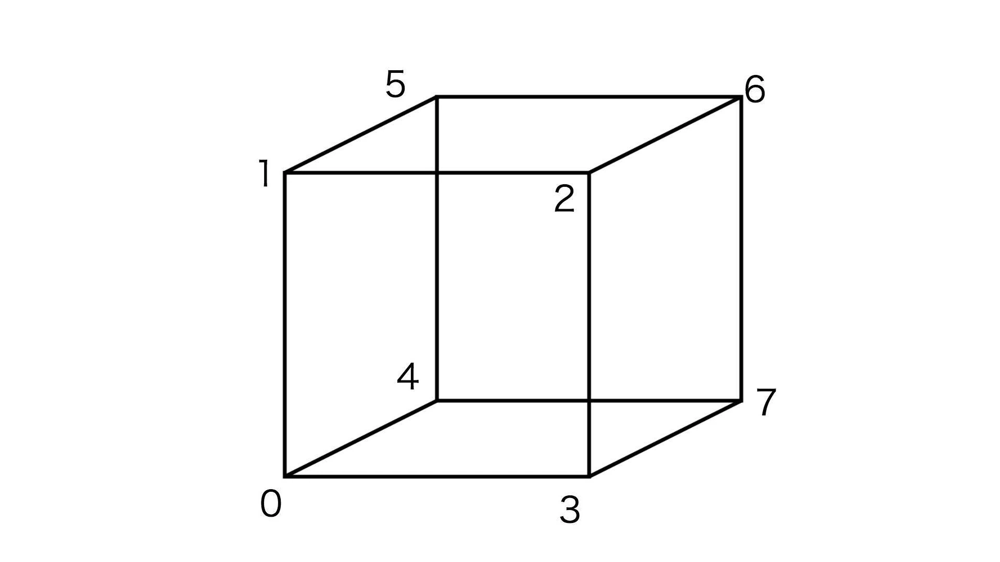
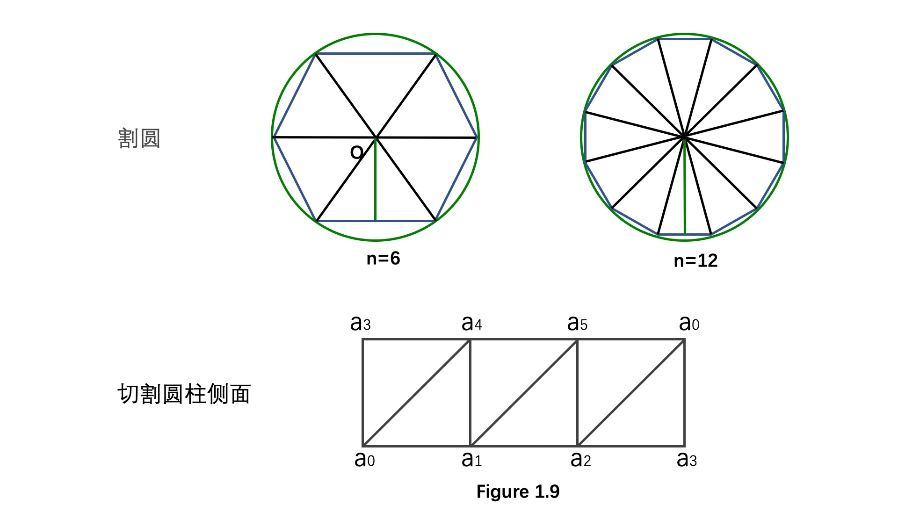
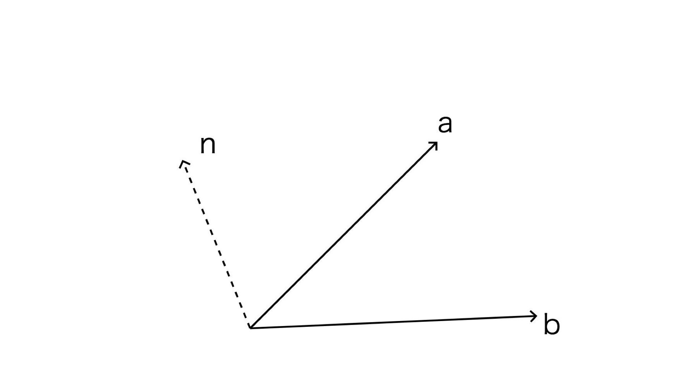
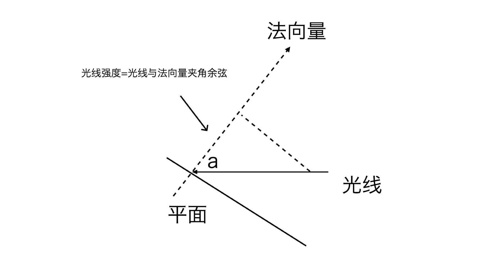

## 20 | 如何用WebGL绘制3D物体？

WebGL真正强大之处在于，它可以绘制各种3D图形，而3D图形能够极大地增强可视化的表现能力。

用WebGL绘制3D图形，在基本原理上和绘制2D图形并没有什么区别，只不过是把绘图空间从二维扩展到三维，所以计算起来会更加复杂一些。

本节：从绘制最简单的三维立方体，讲到矩阵、法向量在三维空间中的使用

### 如何用WebGL绘制三维立方体

#### 从二维到三维

**e.g.绘制熟悉的2D图形、矩形，再把它拓展到三维空间变成立方体。**

```glsl
// vertex
attribute vec2 a_vertexPosition;
attribute vec4 color;

varying vec4 vColor;

void main() {
  gl_PointSize = 1.0;
  vColor = color;
  gl_Position = vec4(a_vertexPosition, 1, 1);
}

// fragment
#ifdef GL_ES
precision highp float;
#endif

varying vec4 vColor;

void main() {
  gl_FragColor = vColor;
}
```

```javascript
// ...
renderer.setMeshData([{
  positions: [
    [-0.5, -0.5],
    [-0.5, 0.5],
    [0.5, 0.5],
    [0.5, -0.5]
  ],
  attributes: {
    color: [
      [1, 0, 0, 1],
      [1, 0, 0, 1],
      [1, 0, 0, 1],
      [1, 0, 0, 1],
    ]
  },
  cells: [[0, 1, 2], [2, 0, 3]]
}]);
// ...
```

上面3段代码，分别对应顶点着色器、片元着色器和基本的顶点信息。能在画布上绘制出一个红色的矩形。

1. 要想把2维矩形拓展到3维，第一步就是要**把顶点扩展到3维**。这一步比较简单，只需要把顶点从vec2扩展到vec3就可以了。

   ```glsl
   // vertex
   attribute vec3 a_vertexPosition;
   attribute vec4 color;
   
   varying vec4 vColor;
   
   void main() {
     gl_PointSize = 1.0;
     vColor = color;
     gl_Position = vec4(a_vertexPosition, 1);
   }
   ```

2. 然后，需要**计算立方体的顶点数据**。

   一个立方体有8个顶点，这8个顶点能组成6个面。在WebGL中需要用12个三角形来绘制它。

   如果每个面的属性相同，可以复用8个顶点来绘制；

   如果属性不同，比如每个面要绘制成不同的颜色，或者添加不同的纹理图片，就得把每个面的顶点分开。这样的话，一共需要24个顶点。

   

   为了方便使用，可以写一个JavaScript函数，用来生成立方体6个面的24个顶点，以及12个三角形的索引，并且定义每个面的颜色。

   ```javascript
   /**
    * 生成立方体6个面的24个顶点，12个三角形的索引，定义每个面的颜色信息
    * @param size
    * @param colors
    * @returns {{cells: *[], color: *[], positions: *[]}}
    */
   export function cube(size = 1.0, colors = [[1, 0, 0, 1]]) {
       const h = 0.5 * size;
       const vertices = [
           [-h, -h, -h],
           [-h, h, -h],
           [h, h, -h],
           [h, -h, -h],
           [-h, -h, h],
           [-h, h, h],
           [h, h, h],
           [h, -h, h]
       ];
   
       const positions = [];
       const color = [];
       const cells = [];
   
       let colorIdx = 0;
       let cellsIdx = 0;
       const colorLen = colors.length;
   
       function quad(a, b, c, d) {
           [a, b, c, d].forEach(item => {
               positions.push(vertices[item]);
               color.push(colors[colorIdx % colorLen]);
           });
           cells.push(
               [0, 1, 2].map(i => i + cellsIdx),
               [0, 2, 3].map(i => i + cellsIdx)
           );
           colorIdx ++;
           cellsIdx += 4;
       }
   
       quad(1, 0, 3, 2); // 内
       quad(4, 5, 6, 7); // 外
       quad(2, 3, 7, 6); // 右
       quad(5, 4, 0, 1); // 左
       quad(3, 0, 4, 7); // 下
       quad(6, 5, 1, 2); // 上
   
       return {positions, color, cells};
   }
   ```

   这样就可以构建出立方体的顶点信息。比如：

   ```javascript
   const geometry = cube(1.0, [
       [1, 0, 0, 1],   // 红
       [0, 0.5, 0, 1], // 绿
       [0, 0, 1, 1]    // 蓝
   ]);
   ```

   通过这段代码，就能创建出一个棱长为1的立方体，并且六个面的颜色分别是“红、绿、蓝、红、绿、蓝”。

   > 注：
   >
   > 绘制3D图形与绘制2D图形有一点不一样，那就是必须要**开启深度检测**和**启用深度缓冲区**。
   >
   > 在WebGL中，可以通过`gl.enable(gl.DEPTH_TEST);`来开启深度检测。
   >
   > 在清空画布的时候，也要用`gl.clear(gl.COLOR_BUFFER_BIT | gl.DEPTH_BUFFER_BIT);`来同时清空颜色缓冲区和深度缓冲区。
   >
   > **启动和清空深度检测和深度缓冲区这两个步骤，是这个过程中非常重要的一环。**

   一般情况下，我们几乎不会用原生的方式来写代码；为了方便使用，这里还是直接使用gl-renderer库，它封装了深度检测，在使用的时候，只要在创建renderer的时候设置一个参数`depth: true`即可。

3. 现在，把这个三维立方体用gl-renderer渲染出来。

   ```javascript
   // ...
   renderer = new GlRenderer(glRef.value, {
     depth: true // 开启深度检测
   });
   const program = renderer.compileSync(fragment, vertex);
   renderer.useProgram(program);
   renderer.setMeshData([{
     positions: geometry.positions,
     attributes: {
       color: geometry.color
     },
     cells: geometry.cells
   }]);
   renderer.render();
   ```

   此时，在画布上只呈现了一个红色正方形，因为其他面被遮挡住了。

#### 投影矩阵：变换WebGL坐标系

上述代码中，立方体的顶点是这么定义的：

```javascript
const vertices = [
    [-h, -h, -h],
    [-h, h, -h],
    [h, h, -h],
    [h, -h, -h],
    [-h, -h, h],
    [-h, h, h],
    [h, h, h],
    [h, -h, h]
];
```

而立方体的六个面的颜色，是这么定义的：

    quad(1, 0, 3, 2); // 内
    quad(4, 5, 6, 7); // 外
    quad(2, 3, 7, 6); // 右
    quad(5, 4, 0, 1); // 左
    quad(3, 0, 4, 7); // 下
    quad(6, 5, 1, 2); // 上

红色是朝内的一面，绿色是朝外的一面。但我们现在看到的是红色的一面？

之前说过，WebGL的坐标系是Z轴向外为正，Z轴向内为负，所以根据调用的代码，赋给向外那一面的颜色应该是绿色。但**这个立方体朝外的一面却是红色，为什么呢？**

实际上，WebGL默认的剪裁坐标的Z轴方向，的确是朝内的；也就是说，WebGL坐标系是左手系而不是右手系。

**为什么基本上所有的WebGL教程，都在说WebGL坐标系是右手系呢？**

这是因为，规范的直角坐标系是右手坐标系，符合我们的使用习惯。因此，一般来说，不管什么图形库或图形框架，在绘图的时候，都会默认将坐标系从左手系转换为右手系。

因此，这里也**要将WebGL的坐标系从左手系转换为右手系**。

关于坐标转换，可以通过齐次矩阵来完成。将Z轴坐标方向反转，对应的齐次矩阵如下：

```mathematica
[
	1, 0, 0, 0,
	0, 1, 0, 0,
	0, 0, -1, 0,
	0, 0, 0, 1
]
```

这种转换坐标的齐次矩阵，又被称为**投影矩阵**（ProjectionMatrix）。

修改一下顶点着色器，将投影矩阵加入进去。这样，画布上显示的就是绿色的正方形了。

```glsl
// vertex
attribute vec3 a_vertexPosition; // 1:把顶点从vec2扩展到vec3
attribute vec4 color; // 四维向量

varying vec4 vColor;
uniform mat4 projectionMatrix; // 2:投影矩阵-变换坐标系

void main() {
  gl_PointSize = 1.0;
  vColor = color;
  gl_Position = projectionMatrix * vec4(a_vertexPosition, 1.0);
}
```

投影矩阵不仅可以用来改变Z轴坐标，还可以用来实现正交投影、透视投影以及其他的投影变换。

#### 模型矩阵：让立方体旋转起来

现在，只能看到立方体的一个面，因为我们的视线正好是垂直于Z轴的，所以其他的面被完全挡住了。

我们可以通过旋转立方体，将其他的面露出来。

旋转立方体，同样可以*通过矩阵运算*来实现。这次要用到另一个齐次矩阵，它定义了被绘制的物体变换，这个矩阵叫做**模型矩阵**（ModelMatrix）。

**把模型矩阵加入到顶点着色器中**，然后将它与投影矩阵相乘，最后再乘上齐次坐标，就得到最终的顶点坐标了。

```glsl
attribute vec3 a_vertexPosition; // 1:把顶点从vec2扩展到vec3
attribute vec4 color; // 四维向量

varying vec4 vColor;
uniform mat4 projectionMatrix; // 2:投影矩阵-变换坐标系
uniform mat4 modelMatrix; // 3:模型矩阵-使几何体旋转

void main() {
  gl_PointSize = 1.0;
  vColor = color;
  gl_Position = projectionMatrix * modelMatrix * vec4(a_vertexPosition, 1.0);
}
```

接着，定义一个JavaScript函数，用立方体沿x、y、z轴的旋转来**生成模型矩阵**。

以x、y、z三个方向的旋转得到三个齐次矩阵，然后将它们相乘，就能得到最终的模型矩阵。

```javascript
import { multiply } from 'ogl/src/math/functions/Mat4Func.js';
// ...
export function fromRotation(rotationX, rotationY, rotationZ) {
    let c = Math.cos(rotationX);
    let s = Math.sin(rotationX);
    const rx = [
        1,  0, 0, 0, // 绕X轴旋转
        0,  c, s, 0,
        0, -s, c, 0,
        0,  0, 0, 1
    ];

    c = Math.cos(rotationY);
    s = Math.sin(rotationY);
    const ry = [
        c,  0, s, 0,
        0,  1, 0, 0, // 绕Y轴旋转
        -s, 0, c, 0,
        0,  0, 0, 1
    ];

    c = Math.cos(rotationZ);
    s = Math.sin(rotationZ);
    const rz = [
        c,  s, 0, 0,
        -s, c, 0, 0,
        0,  0, 1, 0, // 绕Z轴旋转
        0,  0, 0, 1
    ];

    const ret = [];
    multiply(ret, rx, ry);
    multiply(ret, ret, rz);
    // const ret = [rx, ry, rz].reduce((a, b) => {
    //     return a.multiply(b); // a x b 结果输出到a
    // });
    return ret;
}
```

最后，**把这个模型矩阵传给顶点着色器，不断更新三个旋转角度，就能实现立方体旋转的效果**，也就可以看到立方体其他各个面了。

```javascript
// ...
let rotationX = 0;
let rotationY = 0;
let rotationZ = 0;
function update() {
  rotationX += 0.003;
  rotationY += 0.005;
  rotationZ += 0.007;
  renderer.uniforms.modelMatrix = fromRotation(rotationX, rotationY, rotationZ);
  requestAnimationFrame(update);
}
update();
// ...
```

至此，就完成了一个旋转的立方体。


### 如何用WebGL绘制圆柱体

圆柱体的两个底面都是圆，可以用割圆的方式对圆进行简单的三角剖分，然后把圆柱的侧面用上下两个圆上的顶点进行三角剖分。



具体算法如下：

```javascript
/**
 * 生成圆柱体的顶点，三角形索引，定义顶和底和侧面的颜色信息
 * @param radius 顶和底的圆半径
 * @param height 圆柱体高度
 * @param segments 圆弧分多少段
 * @param colorCap 顶和底的颜色
 * @param colorSide 侧面的颜色
 * @returns {{cells: *[], color: *[], positions: *[]}}
 */
export function cylinder(radius = 1.0, height = 1.0, segments = 30, colorCap = [0, 0, 1, 1], colorSide = [1, 0, 0, 1]) {
    const positions = [];
    const cells = [];
    const color = [];
    const cap = [[0, 0]];
    const h = 0.5 * height;

    // 顶和底的圆
    for (let i = 0; i <= segments; i ++) {
        const theta = Math.PI * 2 * i / segments;
        const p = [radius * Math.cos(theta), radius * Math.sin(theta)];
        cap.push(p);
    }
  
    positions.push(...cap.map(([x, y]) => [x, y, -h])); // 内面的点
    for (let i = 1; i < cap.length - 1; i ++) { // 内面三角剖分
        cells.push([0, i, i + 1]);
    }
    cells.push([0, cap.length - 1, 1]);

    let offset = positions.length;
    positions.push(...cap.map(([x, y]) => [x, y, h])); // 外面的点
    for (let i = 1; i < cap.length - 1; i ++) { // 外面三角剖分
        cells.push([offset, offset + i, offset + i + 1]);
    }
    cells.push([offset, offset + cap.length - 1, offset + 1]);

    color.push(...positions.map(() => colorCap)); // 每个顶点色值

    // 侧面
    offset = positions.length;
    for (let i = 1; i < cap.length; i ++) {
        const a = [...cap[i], h];
        const b = [...cap[i], -h];
        const nextIdx = i < cap.length - 1 ? i + 1 : 1;
        const c = [...cap[nextIdx], -h];
        const d = [...cap[nextIdx], h];

        positions.push(a, b, c, d);

        color.push(colorSide, colorSide, colorSide, colorSide);
        cells.push([offset, offset + 1, offset + 2], [offset, offset + 2, offset + 3]);
        offset += 4;
    }

    return {positions, cells, color};
}
```

这样就可以绘制出圆柱体了，把调用cube的地方改为cylinder，就能看到一个旋转的圆柱体。

用WebGL绘制三维物体，实际上和绘制二维物体没有什么本质不同，都是将图形（对于三维来说，也就是几何体）的顶点数据构造出来，然后将它们送到缓冲区中，再执行绘制。

只不过三维图形的绘制需要构造三维的顶点和网格，在绘制前还需要启用深度缓冲区。


### 构造和使用法向量

在前面两个例子中，构造出了几何体的顶点信息，包括顶点的位置和颜色信息，除此之外，我们还可以构造几何体的其他信息，其中一种比较有用的信息是**顶点的法向量信息**。

**什么是法向量呢？**

法向量表示每个顶点所在的面的法线方向。在3D渲染中，我们可以通过法向量来**计算光照、阴影、进行边缘检测**等等。

#### 1. 构造法向量

* 对于立方体来说

  只要找到垂直于立方体6个面上的线段，再得到这些线段所在向量上的单位向量就行了。

  标准立方体中6个面的法向量如下：

  ```mathematica
  [0, 0, -1]
  [0, 0, 1]
  [0, -1, 0]
  [0, 1, 0]
  [-1, 0, 0]
  [1, 0, 0]
  ```

* 对于圆柱体来说

  底面和顶面的法线分别是[0, 0, -1]和[0, 0, 1]。

  侧面的计算稍微复杂一些，需要通过三角网格来计算。具体怎么做呢？

  因为几何体是由三角网格构成的，而法线是垂直于三角网格的线，如果要计算法线，可以借助三角形的顶点，使用向量的叉积定理来求。

  假设在一个平面内，有向量a和b，n是它们的法向量，那么可以得到公式：n = a x b。

  

  根据这个公式，可以通过以下方法求出侧面的法向量：

  ```javascript
  // ...
  
  const tmp1 = [];
  const tmp2 = [];
  // 侧面
  offset = positions.length;
  for (let i = 1; i < cap.length; i ++) {
      const a = [...cap[i], h];
      const b = [...cap[i], -h];
      const nextIdx = i < cap.length - 1 ? i + 1 : 1;
      const c = [...cap[nextIdx], -h];
      const d = [...cap[nextIdx], h];
  
      positions.push(a, b, c, d);
  
      // 存储法向量
      const norm = [];
      cross(norm, subtract(tmp1, b, a), subtract(tmp2, c, a)); // 叉乘：向量ab x 向量ac
      normalize(norm, norm);
      normal.push(norm, norm, norm, norm); // abcd四个点共面，它们的法向量相同
  
      color.push(colorSide, colorSide, colorSide, colorSide);
      cells.push([offset, offset + 1, offset + 2], [offset, offset + 2, offset + 3]);
      offset += 4;
  }
  
  // ...
  ```

**求出法向量，就可以使用法向量来实现丰富的效果，比如点光源。**

#### 2. 法向量矩阵

在Shader中，会使用模型矩阵对顶点进行变换，所以**在片元着色器中，我们拿到的是变换后的顶点坐标**，这时候，如果要应用法向量，需要对法向量也进行变换。

可以通过一个矩阵来实现，这个矩阵叫做法向量矩阵（NormalMatrix）。它是模型矩阵的逆转置矩阵，不过它非常特殊，是一个3 x 3的矩阵（mat3）。

[用简单几何解释为何使用逆转置来处理法线变换](https://zhuanlan.zhihu.com/p/392711096)

[法向量变换矩阵](https://zhuanlan.zhihu.com/p/479809019)

得到了法向量和法向量矩阵，就可以使用法向量和法向量矩阵来实现点光源光照效果。

首先，更新顶点着色器：

```glsl
// vertex
attribute vec3 a_vertexPosition; // 1:把顶点从vec2扩展到vec3
attribute vec4 color; // 四维向量
attribute vec3 normal; // 4:法向量

varying vec4 vColor;
varying float vCos; // 点光源与法线的夹角余弦
uniform mat4 projectionMatrix; // 2:投影矩阵-变换坐标系
uniform mat4 modelMatrix; // 3:模型矩阵-使几何体旋转等变换
uniform mat3 normalMatrix; // 4:法向量矩阵（模型矩阵的逆转置矩阵）

const vec3 lightPosition = vec3(1, 0, 0); // 点光源坐标

void main() {
  gl_PointSize = 1.0;
  vColor = color;
  vec4 pos = modelMatrix * vec4(a_vertexPosition, 1.0);
  vec3 invLight = lightPosition - pos.xyz;
  vec3 norm = normalize(normalMatrix * normal); // 法向量矩阵 乘以 法向量 => 变换后的法向量
  vCos = max(dot(normalize(invLight), norm), 0.0); // （归一化后的）光源向量与法向量的点积
  gl_Position = projectionMatrix * pos;
}
```

以上代码中，计算了位于[1, 0, 0]坐标处的点光源与几何体法线的夹角余弦。

根据物体漫反射模型，光照强度等于**光线与法向量夹角的余弦**。



求出这个余弦值，就能在片元着色器叠加光照了。

```glsl
// fragment
#ifdef GL_ES
precision highp float;
#endif

uniform vec4 lightColor;

varying vec4 vColor;
varying float vCos;

void main() {
  gl_FragColor.rgb = vColor.rgb + vCos * lightColor.a * lightColor.rgb; // 叠加光照
  gl_FragColor.a = vColor.a;
}
```


### 要点总结

3D绘图在原理上和2D绘图几乎是完全一样的，就是构建顶点数据，然后将数据送入缓冲区执行绘制。只是，2D绘图用二维顶点数据，而3D绘图用三维顶点数据。

3D绘图时，除了构造顶点数据之外，还可以构造其他的数据，比较有用的是法向量。**法向量是垂直于物体表面三角网格的向量，使用它可以来计算光照。**在片元着色器中，拿到的是经过模型矩阵变换后的顶点，所以要使用法向量，还需要用一个法向量矩阵对它进行变换。

将法向量经过法向量矩阵变换后，就可以和片元着色器中的顶点进行运算了。


### 小试牛刀

1. 修改例子中的cube函数，构造出非正立方体。新的cube函数签名如下：

   ```javascript
   function cube(width = 1.0, height = 1.0, depth = 1.0, colors = [[1, 0, 0, 1]])
   ```

2. 绘制一个正四面体，并给不同的面设置不同的颜色，然后在正四面体上实现点光源关照效果。

   评论区提示：正四面体，就是取正立方体的四个非共棱顶点组成。