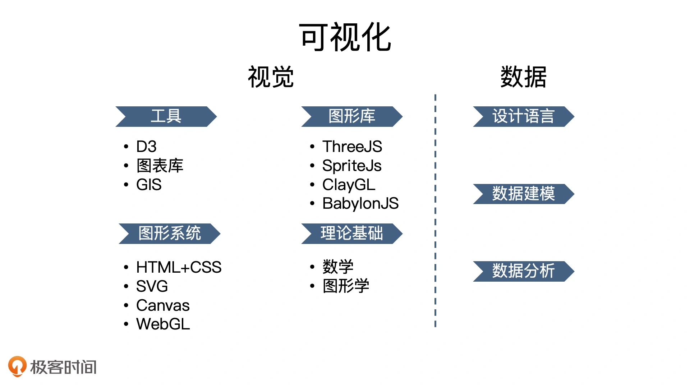
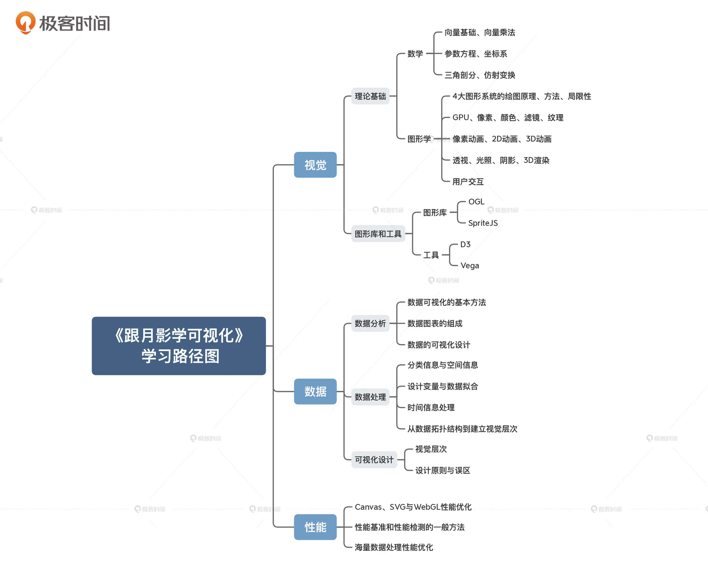

## 开篇词 | 不写网页的前端工程师，还能干什么？

突破前端职业发展的天花板？

可视化是前端领域中，一个几乎不用写网页的特殊分支。

### 为什么要学可视化

#### 可视化的两个重要优势

* 第一，现在很多C端或者B端的互联网产品都离不开可视化。

  C端：淘宝“双十一”购物节的可视化大屏

  B端：许多中后台的管理系统，使用统计图表来显示系统运行的各种状态

  企业级应用：态势感知和指挥调度大屏

  国家项目：智慧城市、智慧社区、智慧生活等等

* 第二，可视化能实现很多传统Web网页无法实现的效果

#### 可视化的本质

🌰：写一个抽奖程序

一般的抽奖程序，如果用JavaScript代码来实现，其核心无非就是产生一个随机数，然后用它来判断究竟谁该获奖。这个程序最终要通过CPU来执行。

本例中使用[GPU](https://github.com/akira-cn/FE_You_dont_know/issues/27)来抽奖：

在这里用了GPU的能力，通过渲染图形来完成抽奖，这实际上就用到了可视化相关的核心技术。

**可视化更重要的是利用WebGL这样的图形系统，来更高效地实现更多有趣的图形。**

总的来说，通过研究可视化，你能够比较深入地掌握图形学和WebGL技术。这些技术的应用并不局限于可视化领域，在游戏、AI等其他技术领域也有广泛的应用场景。

### 如何成为一名可视化工程师？

一名优秀的可视化工程师，最应当具备的能力就是要**根据产品经理和设计师的想法，实现真正贴合用户需求的、灵活多变的、具有视觉震撼力，并且充满创意的优秀可视化作品**。

想要成为一名可视化工程师，就**不能停留在可视化现有的库、框架和工具的使用层面上，必须深入技术栈的底层，充分理解数据，掌握视觉呈现相关的技术和基本原理**。打好基础之后，再系统地学习可视化领域的方法论，才能提高解决问题的能力。

可视化知识体系

### 如何快速掌握可视化？

应该把重点放在理论基础上，因为随着技术的发展，工具会改变，而基础不会。

视觉部分的理论基础就是数学和图形学。

数据部分，我们只要理解解决问题的整体构思和方法论，知道如何从一个可视化工程师的角度去理解和运用数据，就已经足够为我们未来的深入研究，打开一扇大门了。

谈可视化离不开性能，性能往往决定了可视化项目最终所能呈现的整体感官效果。在性能方面，我们应该学习的，是如何快速找到合理的性能优化点。

### 本课程是如何设计的？

* **第一部分，图形基础**

  HTML/CSS、SVG、Canvas2D和WebGL这四种图形系统

  它们的基本用法、原则、优点和局限性。

* **第二部分，数学基础**

  对向量和矩阵运算、参数方程、三角剖分和仿射变换等内容，深入讲解以及综合运用

  建立一套通用的数学知识体系，能适用于所有图形系统

* **第三部分，视觉呈现**

  **视觉呈现效果**是衡量可视化效果的重要指标

  * 基础阶段

    主要讨论如何以像素化的方式处理图案，来实现各种细节效果

  * 高级阶段

    讨论动画、3D和交互等更深入的话题

* **第四部分，性能优化**

  可视化高性能渲染的技术思路

  找到可视化应用中的性能瓶颈并着手优化

  解决大规模数据批量渲染的性能瓶颈问题

* **最后一部分，重点讨论数据驱动**

  通常来说，数据的格式和量级决定了图形系统的选择和渲染方式。

  一个成熟的可视化系统，应该包括数据引擎和渲染引擎两部分。将数据和视觉呈现结合起来

系统地掌握可视化开发的原理和方法，理解如何处理数据，学会各种视觉呈现方式，最终创建出自己的可视化工具集，并用它来高效地解决可视化开发中的问题。

### 推荐阅读

[Canvas Docs](https://developer.mozilla.org/zh-CN/docs/Web/API/Canvas_API)

[SVG Docs](https://developer.mozilla.org/zh-CN/docs/Web/SVG)

[WebGL Docs](https://developer.mozilla.org/zh-CN/docs/Web/API/WebGL_API)

数学：3blue1brown的视频

图形学：https://github.com/akira-cn/ICG-WebGL

shader：The book of shaders（入门）

demo：github.com/akira-cn/graphics