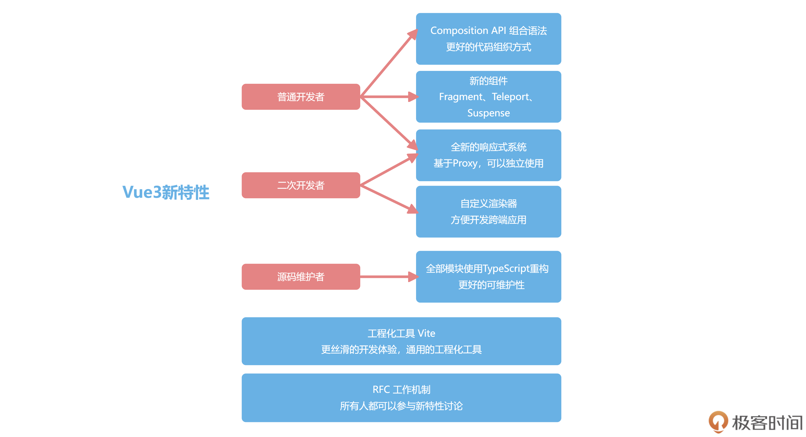

## Vue3新特性

### Vue2的核心模块和历史遗留问题

Vue2是一个响应式驱动的、内置虚拟DOM、组件化、用在浏览器开发，并且有一个运行时把这些模块很好地管理起来的框架。

一些Vue2常见的缺陷：

* 从开发维护的角度看，Vue2是使用Flow.js来做类型校验。但现在Flow.js已经停止维护了，前端社区都在全面使用TypeScript来构建基础库
* 社区的二次开发难度来说，Vue 2内部运行时，是直接执行浏览器API的。但这样会在Vue 2的跨端方案中带来问题：
  * 要么直接进入Vue源码中，和Vue一起维护，比如Weex
  * 要么直接复制一份全部Vue的代码，把浏览器API换成客户端或小程序的，比如mpvue，Vue后续的更新就很难享受到
* Vue 2响应式并不是真正意义上的代理，而是基于`Object.defineProperty()`实现的。
  * 这个API并不是代理，而是对某个属性进行拦截，所以有很多缺陷，比如：删除数据就无法监听，需要`$delete`等API辅助才能监听到。
* Option API在组织代码较多组件的时候不易维护。所有的methods、computed都在一个对象里配置

### 从七个方面了解Vue3新特性

Vue3是继承了Vue2具有的响应式、虚拟DOM、组件化等所有优秀的特点，并重新全部设计，解决了这些历史包袱的新框架，是一个拥抱未来的前端框架。

#### 1. RFC机制

Vue团队开发的工作方式。

关于Vue的新语法或者新功能的讨论，都会先在GitHub上公开征求意见，邀请社区所有的人一起讨论。

[Vue RFCs](https://github.com/vuejs/rfcs)

Vue很长一段时间都是尤雨溪一个人维护，后来尤雨溪吸纳了社区的人，并成立了Core Team。

RFC的引入，让Vue生态更加开放，让所有人都可以参与Vue新语法的讨论。

#### 2. 响应式系统

Object.defineProperty()与Proxy，两者看起来都像是对数据的读写进行拦截，但是defineProperty是拦截具体某个属性，Proxy才是真正的”代理“。

defineProperty对不存在的属性无法拦截，所以Vue 2中所有数据必须要在data里声明。

假设obj存在一个属性title，如果title是一个数组，对数组的操作并不会改变obj.title的指向，虽然可以通过拦截`.push`等操作实现部分功能，但对数组的长度的修改等操作还是无法实现拦截，所以还需要额外的$set等API。

Proxy存在一些兼容性问题，所以Vue3不兼容IE11以下的浏览器。

Proxy代表一种方向，就是框架会越来越多地拥抱浏览器的新特性。

另外，Vue2内部所有的模块都是揉在一起的，这样做会导致不好扩展的问题，Vue3选择了拆包，使用最近流行的monorepo管理方式，响应式、编译和运行时全部独立了。

Vue2的响应式只服务于Vue，Vue3的响应式就和Vue解耦了，你甚至可以在Node.js和React中使用响应式。

在任何时候，如果你希望数据被修改了之后能通知你，你都可以单独依赖Vue3的响应式。

#### 3. 自定义渲染器

使得开发跨端应用时更加得心应手。

渲染的逻辑拆成了**平台无关渲染逻辑**和**浏览器渲染API**两部分。

响应式、编译和运行时几部分组合在一起就是运行在浏览器端的Vue3，每个模块又都可以独立扩展出新的功能。

#### 4. 全部模块使用TypeScript重构

类型系统带来了更方便的提示，并且让我们的代码能够更健壮。

这在多人协同和长期维护的项目里带来的收益是巨大的，因为这样可以使错误的代码在编译阶段就被发现，从而避免程序上线运行后，可能会发生更大的异常错误。

大部分开源的框架都会引入类型系统，来对JavaScript进行限制。第一是，类型系统带来了更方便的提示；第二是，类型系统让代码更健壮（更少出错）。

这使得Vue的源码有更好的可维护性。

#### 5. Composition API组合语法

更好的组织代码的形式。

[代码](https://codepen.io/yeying0827/pen/abjwPGr)

Options API的写法有几个很严重的问题：

* 所有数据都挂载在this上，因为Options API的写法对TypeScript的类型推导很不友好，并且这样也不好做Tree-shaking清理代码
* 新增功能基本都得修改data、methods等配置，代码多了之后（比如300行），会经常要上下反复横跳，开发体验痛苦
* 代码不好复用，Vue2的组件很难抽离通用逻辑，只能使用mixin，还会带来命名冲突的问题。

Composition API虽然看起来繁琐了一些，但是带来了诸多好处：

* 所有API都是import引入的，对Tree-shaking很友好（代码中没用到的功能，打包时会被清理掉，减少包的体积）
* 可以把一个功能模块的methods、data都放在一起书写，维护更轻松
* 可以把一个功能所有的methods、data封装在一个独立的函数里，复用代码非常容易
  * 每个数据来源都清晰可见，而且每个功能函数都可以在各个地方复用
* 可以使用`<script setup>`特性减少代码

#### 6. 新的组件

Vue3内置了Fragment、Teleport和Suspense三个新组件。

* Fragment：Vue3组件不再要求有一个唯一的根节点，清除了很多无用的占位div
* Teleport：允许组件渲染在别的元素内，主要开发弹窗组件的时候特别有用
* Suspense：异步组件，更方便开发有异步请求的组件

#### 7. 新一代工程化工具Vite

更丝滑的调试体验。

Vite和Vue不是强绑定。

Vite主要提升的是开发的体验，Webpack等工程化工具的原理，就是根据你的import依赖逻辑，形成一个依赖图，然后调用对应的处理工具，把整个项目打包后，放在内存里再启动调试。

由于要预打包，所以复杂项目的开发，启动调试环境需要3分钟都很常见。

现代浏览器已经默认支持了ES6的import语法，Vite就是基于这个原理实现的。在调试环境下，我们不需要全部预打包，只是把你首页依赖的文件，依次通过网络请求去获取，整个开发体验得到巨大提升，做到了复杂项目的秒级调试和热更新。

Vite的工作原理，一开始就可以准备联调，然后根据首页的依赖模块，再去按需加载，这样启动调试所需要的资源会大大减少。

### 总结

更快、更强且更易于扩展的开发体验

