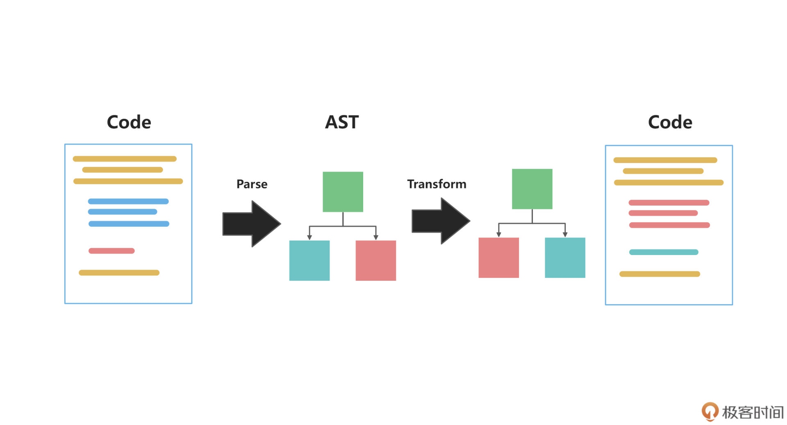

## Vue2项目升级Vue3

并不是所有项目都适合升级。毕竟升级总是需要成本的。

### 应不应该从Vue2升级到Vue3

使用Vue2开发应用的时候，无法避免在data、template、methods中上下反复横跳，这种弊端在项目规模上来之后会更加明显。并且vue-cli是基于Webpack开发的，每执行一下，调试环境就要1分钟时间，这是大部分复杂项目的痛点之一。

Vue3的Composition API带来的代码组织方式更利于封装代码，维护起来也不会上下横跳。

Vue3的正式版已经发布有一年了（截止2021年），无论是辅助工具，还是周边库都已经非常完善了，足以胜任大型的项目开发。

Vue2官方还会再维护两年，但两年后的问题和需求，官方就不承诺修复和提供解答了，现在继续用Vue2其实是有这个隐患的。

Vue3由于新的响应式系统用了Proxy，会存在兼容性问题。如果你的应用被要求兼容IE11，就应该选择Vue2。Vue团队已经放弃Vue3对IE11浏览器的支持。

Vue2.7会移植Vue3的一些新特性，Vue2.7项目中可以基于`@vue/composition-api`插件，使用Composition API语法，Vue2会直接内置这个插件，在Vue2中默认也可以用Composition来组合代码。`<script setup>`语法也会在Vue2.7中得到支持。

要不要使用Vue3，还是要”因地制宜“，在不同的场景下，选择合适的方式即可。


### Vue 3不兼容的语法

了解一下，避免写的代码无法使用，还会让你更好地适应Vue3。[官方迁移指南](https://v3-migration.vuejs.org/)

不必完整阅读官方的指南，因为Vue3的大部分API都是对Vue2兼容的。

* 首先，看Vue2和Vue3在项目启动上的不同之处。

  在Vue2中，我们使用`new Vue()`来新建应用，有一些全局的配置我们会直接挂在Vue上，比如通过`Vue.use`来使用插件、通过`Vue.component`来注册全局组件

  但由于全局的Vue只有一个，所以当我们**在一个页面的多个应用中独立使用Vue**就会非常困难。

  Vue3引入一个新的API，`createApp`，来解决这个问题，也就是**新增了App的概念**。全局的组件、插件都独立地注册在这个App内部，很好地解决了上面提到的两个实例容易造成混淆的问题。

  ```javascript
  const { createApp } = Vue;
  const app = createApp({});
  app.component(/*...*/);
  app.use(/*...*/);
  app.mount('#app1');
  
  const app2 = createApp({});
  app2.mount('#app2');
  ```

  createApp还移除了很多我们常见的写法，比如在createApp中，不再支持filter、$on、$off、$set、$delete等API。

* 在Vue3中，v-model的用法也有更改
* 还有很多小细节的更新，比如slot和slot-scope、directive注册指令的API等


### Vue3生态现状介绍

有一些周边的生态库可能还存在不稳定的情况

vue-router是复杂项目必不可少的路由库，有一些写法上的变化，比如`new Router`变成`createRouter`，使用方式上，也全面拥抱Composition API风格，提供useRouter和useRoute等方法

Vue官方成员发布了一个Pinia，其API非常接近Vuex5的设计，且对Composition API特别友好，更优雅一些

其他生态如Nuxt、组件库Ant-design-vue、Element等，都有Vue3的版本发布


### 使用自动化升级工具进行Vue的升级

复杂项目

* 首先有一个`@vue/compat`的库，这是一个Vue3的构建版本，提供了兼容Vue2的行为。

  这个版本默认运行在Vue2下，大部分API和Vue2保持一致。当使用在Vue3中发生变化或者废弃的特性时，这个版本会提出警告，通过升级的提示信息，可以很好地学习版本之间的差异

* 实践：

  * 修改package.json文件：

    -依赖项：vue2.x

    +依赖项：vue3.x和@vue/compat

    -依赖项：vue-template-compiler

    +依赖项：@vue/compiler-sfc

  * 修改vue.config.js文件

    给vue设置别名@vue/compat，也就是以compat作为入口

    `config.resolve.alias.set('vue', '@vue/compat')`

    此时就可以在控制台看到很多警告，以及很多优化的建议，我们可以就参照这些信息做修改

* 社区有能够做自动化替换的工具，比较好用的就是“阿里妈妈”出品的[gogocode](https://gogocode.io/zh/docs/vue/vue2-to-vue3)

  * 原理

    利用babel分析Vue2项目的源码，解析成AST，然后根据Vue3的写法对AST进行转换，最后生成新的Vue3代码。

    

    替换过程中间的AST可以理解为，用JavaScript对象去描述这段代码，与虚拟DOM的理念有些相似，基于这个对象去做优化，最终映射生成新的vue3代码。


### 总结

* 什么时候用vue3，什么时候用vue2
* vue3的官方生态整体比较稳定
* 升级工具：@vue/compat，gogocode