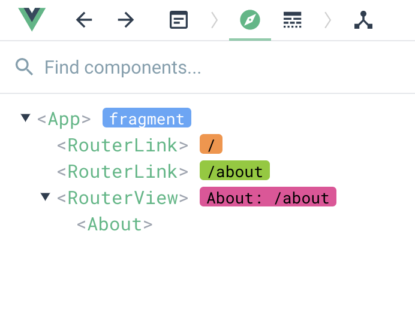

## 搭建Vue3工程化项目第一步

### 环境准备

在实际的项目中，会使用专门的调试工具，项目上线前，代码也需要打包压缩，同时还要考虑研发效率和代码可维护性。所以需要建立一个工程化的项目。

建议使用Vite创建项目，因为vite能够提供更好更快的调试体验

VS Code的官方扩展插件Volar，给Vue3提供了全面的开发支持。[Volar的地址](https://marketplace.visualstudio.com/items?itemName=vue.volar)

Chrome的Vue3调试插件，可以帮助我们在浏览器里高效地调试页面。[地址](https://chrome.google.com/webstore/detail/vuejs-devtools/ljjemllljcmogpfapbkkighbhhppjdbg?hl=en)


### 项目初始化

```shell
$ npm init @vitejs/app
npx: 3 安装成功，用时 2.252 秒

@vitejs/create-app is deprecated, use npm init vite instead
...

$ npm init vite       
npx: 1 安装成功，用时 1.792 秒
✔ Project name: … geek-admin
✔ Select a framework: › Vue
✔ Select a variant: › Customize with create-vue ↗
npx: 1 安装成功，用时 2.144 秒

Vue.js - The Progressive JavaScript Framework

✔ Add TypeScript? … No / Yes
✔ Add JSX Support? … No / Yes
✔ Add Vue Router for Single Page Application development? … No / Yes
✔ Add Pinia for state management? … No / Yes
✔ Add Vitest for Unit Testing? … No / Yes
✔ Add an End-to-End Testing Solution? › No
✔ Add ESLint for code quality? … No / Yes

Scaffolding project in /Users/ying.ye/CodeProjects/learnFE/learn_vue3/vuejs/geek-admin...

Done. Now run:

  cd geek-admin
  npm install
  npm run dev
  
...

$ nvm use 16.17.0
```

项目目录：

```
# ying.ye @ xieyingdeMacBook-Pro in ~/CodeProjects/learnFE/learn_vue3/vuejs/geek-admin [23:35:16] 
$ tree                     
.
├── README.md
├── index.html（项目入口）
├── node_modules
│   ├─...
├── package.json（管理项目依赖和配置的文件）
├── public（放置静态资源）
│   └── favicon.ico
├── src（源码）
│   ├── App.vue（单文件组件）
│   ├── assets
│   │   ├── base.css
│   │   ├── logo.svg
│   │   └── main.css
│   ├── components
│   │   ├── HelloWorld.vue
│   │   ├── TheWelcome.vue
│   │   ├── WelcomeItem.vue
│   │   └── icons
│   │       ├── IconCommunity.vue
│   │       ├── IconDocumentation.vue
│   │       ├── IconEcosystem.vue
│   │       ├── IconSupport.vue
│   │       └── IconTooling.vue
│   ├── main.js（入口）
│   ├── pages
│   │   ├── About.vue
│   │   └── Home.vue
│   └── router
│       └── index.js
├── vite.config.js（Vite工程化配置文件）
└── yarn.lock
```

项目运行：

```shell
$ yarn dev
  VITE v4.0.4  ready in 650 ms

  ➜  Local:   http://localhost:5173/
```

**我们所有工程化体系都是基于Node.js生态**

Vue负责核心，Vuex负责管理数据，Vue-router负责管理路由

安装Vuex和Vue-router：

```shell
$ yarn add vue-router@next vuex@next
```

如何在项目的src目录下面组织路由和其他代码？需要制定一些基本的规范，最常见的规范就是使用文件夹来做区分。


### 规范

无规矩不成方圆，团队项目中的规范尤其重要。以下是src目录的组织结构：

```
├── src
│   ├── api 数据请求
│   ├── assets 静态资源
│   ├── components 组件
│   ├── pages 页面
│   ├── router 路由配置
│   ├── store vuex数据
│   ├── utils 工具函数
```

引入路由系统，我们进入到router文件夹中，新建index.js

```javascript
// index.js
import {createRouter, createWebHashHistory} from 'vue-router';

import Home from '../pages/Home.vue';
import About from '../pages/About.vue';

const routes = [
    {
        path: '/',
        name: 'Home',
        component: Home
    },
    {
        path: '/about',
        name: 'About',
        component: About
    }
];

const router = createRouter({
    history: createWebHashHistory(),
    routes
});

export default router;
```

`createRouter`用于新建路由实例，`createWebHashHistory`用于配置我们内部使用hash模式的路由，也就是url上会通过`#`来区分

在main.js中，加载router的配置：

```javascript
// main.js
import { createApp } from 'vue'
import App from './App.vue'
import router from './router'; // 引入路由配置

import './assets/main.css'

createApp(App).use(router)/*注册路由数据*/.mount('#app')
```

修改App.vue：

```vue
<template>
  <div>
    <router-link to="/">首页</router-link> |
    <router-link to="/about">关于</router-link>
  </div>
  <router-view></router-view>
</template>
```

router-link和router-view是由vue-router注册的全局组件；router-link负责跳转不同的页面，相当于a标签，router-view负责渲染路由匹配的组件，可以通过把router-view放在不同的地方，实现复杂项目的页面布局。

在Chrome控制台的vue tab中调试，可以看到组件的层级关系。



在实际项目开发中还会有各种工具的集成，比如CSS预处理工具sass等，组件库Element3等，异步请求处理Axios等。

对于团队维护的项目，使用Eslint和Prettier可以规范项目中JavaScript代码的可读性和一致性。

还可以使用commitzen来规范Git的日志信息。

提供单元测试来确保代码质量和可维护性。

配置Github Action来实现自动化的部署。

项目雏形搭建完毕后，后面用到哪一块就会把哪一块加上，也就是用一个循序渐进的方式学习。


后续新增组件就要去src/components目录，新增数据请求就去src/api目录。