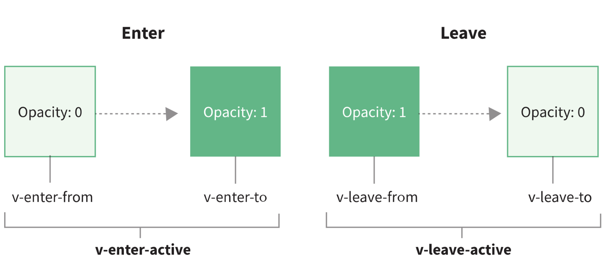

## 动画：vue中如何实现动画效果

### 前端过渡和动效

通过transition来控制一个元素的属性的值，缓慢地变成另外一个值，这种操作就称之为过渡。

动画在视觉和心理的体验上更加友好，比如等待时间的loading加载提示，弹窗出现的显示动画等。


### Vue3动画入门

动画和过渡可以增加用户体验的舒适度，让变化更加自然，并且可以吸引用户的注意力，突出重点。

Vue3中提供了一些动画的封装，使用内置的transition组件来控制组件的动画。

🌰：

```vue
<!-- src/components/HelloTransition.vue -->
<template>
  <button @click="toggle">click</button>
  <transition name="fade">
    <h1 v-if="showTitle">{{title}}</h1>
  </transition>
</template>

<script setup>
import {ref} from "vue";

const showTitle = ref(false);
const title = '你好 Vue3';

function toggle () {
  showTitle.value = !showTitle.value;
}
</script>

<style>
.fade-enter-active,
.fade-leave-active {
  transition: opacity 0.5s linear;
}

.fade-enter-from,
.fade-leave-to {
  opacity: 0;
}
</style>
```

在Vue中，如果我们想要在显示和隐藏标题文字的时候，加入动效进行过渡，那么直接使用transition组件包裹住需要动画的元素就可以了。

上述代码中，使用transition包裹h1标签，并且设置了name为fade，Vue会在h1标签显示和隐藏的过程中去设置标签的class，我们可以根据这些class去实现想要的动效。

class的名字，Vue的官网有一个图给出了很好的解释，图里的v-enter-from中的v，就是我们设置的name属性。



本例中，显示和隐藏的时候，会有fade-enter-active和fade-leave-active的class，显示的开始和结束会有fade-enter-from和fade-enter-to两个class，隐藏的开始和结束同理。

在元素进入前和离开后设置opacity为0。


### 清单应用优化

当输入框为空的时候，敲击回车需要弹出一个错误的提示。

想进一步提高弹窗的交互效果，也就是弹窗的显示需要新增动画。

* 首先使用transition包裹弹窗，设置name为modal

  ```vue
  <!-- src/components/Todolist.vue -->
  <template>
    <div>
      <!-- ... -->
    </div>
    <transition name="modal">
      <div class="info-wrapper" v-if="showModal">
        <div class="info">你啥也没输入！</div>
      </div>
    </transition>
  </template>
  ```

* 在style中对modal对应的CSS设置过渡效果

  ```vue
  <!-- src/components/Todolist.vue -->
  <style>
  .info-wrapper {
    /*...*/
  }
  
  .info {
    /*...*/
  }
  
  .modal-enter-active,
  .modal-leave-active {
    transition: all 0.3s ease;
  }
  
  .modal-enter-from,
  .modal-leave-to {
    opacity: 0;
    transform: translateY(-60px);
  }
  </style>
  ```

优化后，可以看到弹窗有一个明显的滑入和滑出的过渡效果。


### 列表动画

列表过渡。

列表项依次动画出现

在v-for渲染列表的场景之下，我们使用`transition-group`组件去包裹元素，通过`tag`属性去指定渲染一个元素。（与transition不同，transition-group会渲染成真实标签）

`transition-group`组件还有一个特殊之处，就是不仅可以进入和离开动画，还可以改变定位；就和之前的类名一样，这个功能新增了v-move类。

```vue
<!-- src/components/Todolist.vue -->
<transition-group name="flip-list" tag="ul">
  <li v-for="todo in todos" :key="todo.title">
    <input type="checkbox" v-model="todo.done">
    <span :class="{done: todo.done}">{{todo.title}}</span>
  </li>
</transition-group>
```

上述代码中，使用`transition-group`包裹渲染的li元素，并且设置name为flip-list。然后根据`v-move`的命名规范，设置`.flip-list-move`类，设置过渡，就实现了列表依次出现的效果了。

```css
.flip-list-move {
  transition: transform .8s ease;
}
.flip-list-enter-active,
.flip-list-leave-active {
  transition: all 1s ease;
}
.flip-list-enter-from,
.flip-list-leave-to {
  opacity: 0;
  transform: translateX(30px);
}
```

**注**：li如果不设置key属性，新增todo就不会有动画效果，并且删除的时候动画只会作用在最后一个li上


### 页面切换动画

页面切换这个场景

这个动画切换场景的核心原理和弹窗动画是一样的，都是通过transition标签控制页面进入和离开的class。

如果要在路由组件上使用转场，并且对导航进行动画处理，就需要使用v-slot API。

`router-view`通过v-slot获取渲染的组件并赋值给Component。

```vue
<!-- src/App.vue -->
<router-view v-slot="{ Component, route }">
  <transition name="route" mode="out-in">
    <div :key="route.path" class="container">
      <component :is="Component"/><!-- 外面需要包裹一层div，否则会报错 -->
    </div>
  </transition>
</router-view>
```

然后使用transition包裹需要渲染的组件（路由组件必须要有个根元素包裹 https://stackoverflow.com/questions/65553121/vue-3-transition-renders-non-element-root-node-that-cannot-be-animated），并且通过内置组件component的is属性动态渲染组件。

**注**：div需要设置key，否则动画不生效

```css
.route-enter-from {
  opacity: 0;
  transform: translateX(100px);
}
.route-enter-active {
  transition: all .3s ease-out;
}
.route-leave-to {
  opacity: 0;
  transform: translateX(-100px);
}
.route-leave-active {
  transition: all .3s ease-out;
}
```


### JavaScript动画

动画的主要目的是提高交互体验，CSS 动画足以应对大部分场景。

但如果碰见比较复杂的动画场景，就需要用JavaScript来实现，比如购物车、地图等场景。

🌰：在清单应用中加上一个删除事项的功能，但点击删除图标来删除清单项的时候，可以直接删除一行。

```vue
<li v-for="(todo, i) in todos" :key="todo.title">
  <input type="checkbox" v-model="todo.done">
  <span :class="{done: todo.done}">{{todo.title}}</span>
  <span class="remove-btn" @click="removeTodo($event, i)">❎</span>
</li>
```

```javascript
function removeTodo(e, i) {
  todos.value.splice(i, 1);
}
```

如果我们想在删除的时候，实现一个图标飞到废纸篓的动画，那么在这个场景下，使用单纯的CSS动画就不好实现了，需要引入JavaScript来实现动画。

**实现思路**：放一个单独存在的动画元素并且隐藏起来，但点击删除图标的时候，把这个动画元素先移动到鼠标的位置，再飞到废纸篓里藏起来。

**具体实现**：在Vue的transition组件里，分别设置before-enter、enter和after-enter三个函数来更精确地控制动画。

实现步骤：

1. 首先定义animate响应式对象来控制动画元素的显示和隐藏，用transition标签包裹动画元素
2. 在beforeEnter函数中，通过getBoundingClientRect函数获取鼠标的点击位置，让动画元素通过translate属性移动到鼠标所在位置
3. 在enter钩子中把动画元素移动到初始位置
4. 在afterEnter中，也就是动画结束后，把动画元素再隐藏起来

这样就实现了飞入效果。

```vue
<template>
  <!-- ... -->
  <span class="dustbin">🗑</span>
  <div class="animate-wrapper">
    <transition @before-enter="beforeEnter" @enter="enter" @after-enter="afterEnter">
      <div class="animate" v-show="animate.show">📋</div>
    </transition>
  </div>
</template>

<script setup>
import {ref, computed, reactive} from "vue";
import {useStorage} from "../utils/storage";


const animate = reactive({
  show: false,
  el: null
});

function beforeEnter(el) {
  let dom = animate.el;
  let rect = dom.getBoundingClientRect();
  let x = window.innerWidth - rect.x - 60;
  let y = rect.y - 10;
  el.style.transform = `translate(${-x}px, ${y}px)`;
}

function enter(el, done) {
  document.body.offsetHeight // 手动触发一次重绘，换成其他可以触发重绘的操作也可以；看起来没有副作用也不占内存空间
  el.style.transform = `translate(0,0)`;
  el.addEventListener('transitionend', done); // 必须监听transitionend事件，否则不会触发after-enter事件
}

function afterEnter(el) {
  animate.show = false;
  el.style.display = 'none';
}

function useTodos() {
  // ...

  function removeTodo(e, i) {
    animate.el = e.target;
    animate.show= true;
    // todos.value.splice(i, 1);
    setTimeout(()=>{ // 删除最后一个li元素的之后，li已经不在dom上了，不在dom上的元素的坐标就是（0，0）,用定时器执行是为了异步执行删除li，主线程先不删除li以便于图标可以正确定位，等主线程任务（给图标定位）执行完了，再回来删除li
      todos.value.splice(i, 1)
    },100)
  }
  return {title, todos, addTodo, all, active, clear, allDone, showModal, removeTodo};
}

let {title, todos, addTodo, all, active, clear, allDone, showModal, removeTodo} = useTodos();

</script>

<style>
/*...*/

.animate-wrapper .animate {
  position: fixed;
  top: 10px;
  right: 10px;
  z-index: 100;
  transition: all .5s linear;
}

.dustbin {
  position: fixed;
  top: 10px;
  right: 10px;
}
</style>
```

实现完成后，除了列表本身的动画移出效果，还多了一个飞入废纸篓的效果。可以看到，在引入JavaScript后，可以实现更多定制的动画效果。


### 总结

* 通过Vue3提供的transition组件，可以控制在Vue中动画元素进入和离开页面时候的class
* 通过制定的命名规范，在CSS中设置过渡和动画效果，可以很方便地实现过渡效果
* 列表过渡
* 路由转场动画
* 实际开发中动画也不是越多越好，动画的设计也需要设计师去系统地设计效果，不要用动画做出眼花缭乱的网页
* 更复杂的动画，需要借助JavaScript和第三方库的支持，在before-enter、enter、after-enter等事件回调中实现动画

思考：

怎么给弹窗做振动效果？
