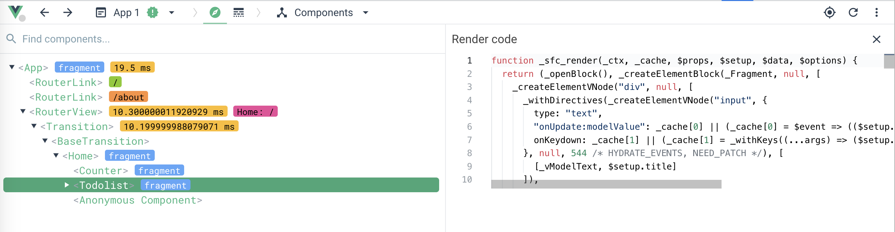

## JSX：利用JSX应对更灵活的开发场景

### h函数

template是Vue3默认的写法。虽然template长得很像HTML，但Vue其实会把template解析为render函数，之后组件运行的时候通过render函数去返回虚拟DOM，你可以在Vue Devtools中看到组件编译之后的结果。（show render code）



以上截图中，调试窗口右侧代码中的`_sfc_render`函数就是todolist的template解析成JavaScript之后的结果。

所以除了template之外，在有些场景中，我们可以直接写render函数来实现组件。

🌰：组件根据传入的数字（1~6），使用h1~h6标签来渲染标题

如果使用template语法，可能会写一堆的`v-if`。

[h函数 doc](https://cn.vuejs.org/api/render-function.html#h)

因为render函数可以直接返回虚拟DOM，因此不再需要template。

1. 在src/components下新建一个文件Heading.jsx

   ```javascript
   // src/components/Heading.jsx
   import {defineComponent, h} from "vue";
   
   export default defineComponent({
       props: {
           level: {
               type: Number,
               required: true
           }
       },
       setup(props, { slots }) {
           return () => h(
               'h' + props.level, // 标签名
               {}, // props或attribute
               slots.default() // 子节点
           );
       }
   });
   ```

   代码中，使用`defineComponent`函数定义一个组件，组件内部配置了props和setup。

   * setup函数返回值是一个函数，即上述所说的render函数，render函数返回h函数的执行结果
   * h函数的第一个参数是标签名，此处可以很方便地使用字符串拼接的方式得到标签名

2. 使用：在src/pages/About.vue中，使用import语法引入Heading

   ```vue
   <!-- src/pages/About.vue -->
   <template>
     <h1>这是关于</h1>
     <Heading :level="2">This is About Page.</Heading>
     <!-- ... -->
   </template>
   
   <script setup>
   // ...
   import Heading from "../components/Heading";
   // ...
   </script>
   ```

   使用level字段传递标签的级别。

手写的h函数，可以处理动态性更高的场景。但如果是复杂的场景，h函数写起来就显得非常繁琐，需要自己把所有的属性都转变成对象，并且组件嵌套的时候，对象也会变得非常复杂。

h函数是返回虚拟DOM的，更方便的方式去写h函数就是用JSX。


### JSX是什么

在JavaScript里写HTML的语法，就是JSX，是对JavaScript语法的一个扩展。

JSX的本质就是语法糖，h函数内部也是调用createVNode来返回虚拟DOM。

后续创建虚拟DOM的函数会统一称为h函数。

使用：

1. 安装一个JSX插件。用于JSX转化为createVNode函数的过程

   ```shell
   yarn add @vitejs/plugin-vue-jsx -D
   ```

2. 打开根目录下的vite.config.js文件去修改vite配置

   ```javascript
   // vite.config.js
   import { fileURLToPath, URL } from 'node:url'
   
   import { defineConfig } from 'vite'
   import vue from '@vitejs/plugin-vue'
   import vueJsx from '@vitejs/plugin-vue-jsx'; // 引入插件
   
   // https://vitejs.dev/config/
   export default defineConfig({
     plugins: [vue(), vueJsx()], // 使用jsx插件
     resolve: {
       alias: {
         '@': fileURLToPath(new URL('./src', import.meta.url))
       }
     }
   })
   ```

3. 至此组件代码中就支持JSX语法了。

4. 🌰：修改`src/components/Heading.jsx`中setup函数内部的代码

   ```jsx
   // src/components/Heading.jsx
   import {defineComponent, h} from "vue";
   
   export default defineComponent({
       props: {
           level: {
               type: Number,
               required: true
           }
       },
       setup(props, { slots }) {
           // return () => h(
           //     'h' + props.level,
           //     {},
           //     slots.default()
           // );
           const tag = 'h' + props.level;
           return () => <tag>{slots.default()}</tag>
       }
   });
   ```

   使用变量tag存储计算出的标签类型；然后直接使用渲染，再使用一个大括号把默认插槽包起来就可以了。

   [vue3 jsx github doc](https://github.com/vuejs/babel-plugin-jsx/blob/dev/packages/babel-plugin-jsx/README-zh_CN.md)

5. 🌰2：在src/components下新建文件`Todo.jsx`

   ```jsx
   import {defineComponent, ref} from "vue";
   
   export default defineComponent({
       setup(props) {
           const title = ref('');
           const todos = ref([]);
           function addTodo() {
               todos.value.push({ title: title.value });
               title.value = '';
           }
           return () => <div>
               <input type="text" vModel={title.value}/>
               <button onClick={addTodo}>Click</button>
               <ul>
                   {
                       todos.value.length ? todos.value.map(todo => <li>{todo.title}</li>) : <li>no data</li>
                   }
               </ul>
           </div>
       }
   })
   
   ```

   在setup返回的JSX中：

   * 使用vModel取代v-model，并且使用单个大括号包裹的形式传入变量`title.value`（而不是title）；

   * 然后使用onClick取代@click；
   * 循环渲染清单的时候，使用`.map`取代v-for，使用三元表达式取代v-if。

**使用JSX的本质，还是在写JavaScript。**

动态性要求很高的场景中，template是较难实现的。


### JSX和template

一个朴实无华的道理：我们接受一些操作上的限制，但同时也会获得一些系统优化的收益。

按照固定格式的语法书写，Vue在编译层面就可以很方便地去做静态标记的优化。

JSX只是h函数的一个语法糖。JSX可以支持更动态地需求；而template因为语法限制的原因，不能够像JSX那样可以支持更动态的需求。这是JSX相比于template的一个优势。

JSX相比于template还有一个优势，是可以在一个文件内部返回多个组件。

[Vue官方的template解析的一个demo](https://vue-next-template-explorer.netlify.app/#eyJzcmMiOiI8ZGl2IGlkPVwiYXBwXCI+XG4gICAgPGRpdiBAY2xpY2s9XCIoKT0+Y29uc29sZS5sb2coeHgpXCIgIG5hbWU9XCJoZWxsb1wiPnt7bmFtZX19PC9kaXY+XG4gICAgPGgxID7mioDmnK/mkbjpsbw8L2gxPlxuICAgIDxwIDppZD1cIm5hbWVcIiBjbGFzcz1cImFwcFwiPuaegeWuouaXtumXtDwvcD5cbjwvZGl2PlxuIiwic3NyIjpmYWxzZSwib3B0aW9ucyI6eyJob2lzdFN0YXRpYyI6dHJ1ZSwiY2FjaGVIYW5kbGVycyI6dHJ1ZSwib3B0aW1pemVCaW5kaW5ncyI6ZmFsc2V9fQ==)

```jsx
<div id="app">
    <div @click="()=>console.log(xx)"  name="hello">{{name}}</div>
    <h1 >技术摸鱼</h1>
    <p :id="name" class="app">极客时间</p>
</div>
```

```javascript
import { toDisplayString as _toDisplayString, createElementVNode as _createElementVNode, openBlock as _openBlock, createElementBlock as _createElementBlock } from "vue"

const _hoisted_1 = { id: "app" }
const _hoisted_2 = /*#__PURE__*/_createElementVNode("h1", null, "技术摸鱼", -1 /* HOISTED */)
const _hoisted_3 = ["id"]

export function render(_ctx, _cache, $props, $setup, $data, $options) {
  return (_openBlock(), _createElementBlock("div", _hoisted_1, [
    _createElementVNode("div", {
      onClick: _cache[0] || (_cache[0] = ()=>_ctx.console.log(_ctx.xx)),
      name: "hello"
    }, _toDisplayString(_ctx.name), 1 /* TEXT */),
    _hoisted_2,
    _createElementVNode("p", {
      id: _ctx.name,
      class: "app"
    }, "极客时间", 8 /* PROPS */, _hoisted_3)
  ]))
}

// Check the console for the AST
```

相比于我们自己去写h函数，在template解析的结果中，有以下几个性能优化的点：

* 首先，静态的标签和属性会放在_hoisted变量中，并且放在render函数之外

  * 重复执行render时，h1这个纯静态的标签不需要额外计算
  * 并且静态标签在虚拟DOM计算时，会直接越过Diff过程

* @click函数增加了一个cache缓存层，实现出来的效果和静态提升类似，尽可能高效地利用缓存

* 带冒号的属性是动态属性，因而存在使用一个数字去标记标签的动态情况。例如截图中，使用8这个数字标记，只有props是动态的；在虚拟DOM计算Diff的过程中，可以忽略掉class和文本的计算。

  是Vue3的虚拟DOM能够比Vue2快的一个重要原因。

所以实现业务需求时，优先使用template，动态性要求较高的组件使用JSX实现，尽可能地利用Vue本身的性能优化。


### 总结

学习了h函数，简单来说，h函数内部执行createVNode，并返回虚拟DOM，而JSX最终也是解析为createVNode执行。

setup函数返回render函数，render函数返回h函数的执行结果（h函数内部会调用createVNode函数）

在一些动态性要求很高的场景下，很难用template优雅地实现，所以需要使用JSX。（jsx会被解析成h函数来执行）

render函数相比于template会更加灵活，但h函数手写起来非常痛苦，有太多的配置，所以就需要JSX去方便快捷地书写render函数。

**对比**：template由于语法固定，可以在编译层面做的优化比较多，比如静态标记就真正做到了按需更新；而JSX由于动态性太强，只能在有限的场景下做优化，虽然性能不如template好，但在某些动态性要求较高的场景下，JSX成了标配，这也是诸多组件库会使用JSX的主要原因。

