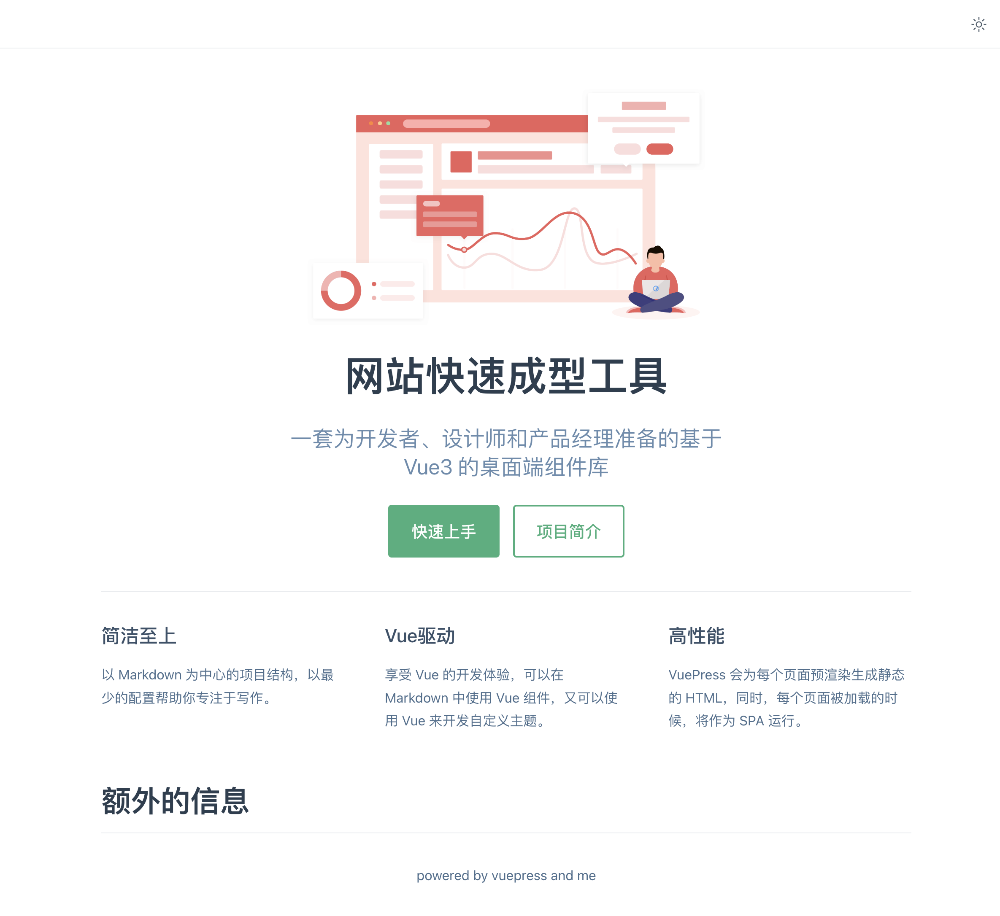

## 文档：如何给你的组件库设计一个可交互式文档

文档页面主要包含组件的描述，组件Demo示例的展示、描述和代码，以及详细的参数文档。

把一个示例的Demo+源码+描述 放到一个文件里，尽量多地去复用，这样可以减少需要维护的代码。

Markdown -> HTML，转译的规则需要拓展一下

[practice commit](https://github.com/yeying0827/vue3-lib-learning/commit/3200699a01922bddf85d57d05ffaf7bbc4d06320)

### Vuepress

基于Markdown构建文档

Vue官网团队维护的在线技术文档工具

可以直接在Markdown里面使用Vue组件（可以写上组件库的使用代码，直接展示运行效果）

* 安装依赖：

```shell
$ yarn add vuepress@next -D ## 安装VuePress的最新版本
```

* 新建docs目录
* 配置脚本命令

```json
{
  "scripts": {
    "docs": "vuepress dev docs"
  }
}
```

* 新建docs/README.md文件作为文档的首页

```markdown
---
home: true
heroImage: /theme.png
title: 网站快速成型工具
tagline: 一套为开发者、设计师和产品经理准备的基于 Vue3 的桌面端组件库
heroText: 网站快速成型工具
actions:
  - text: 快速上手
    link: /install
    type: primary
  - text: 项目简介
    link: /button
    type: secondary
features:
  - title: 简洁至上
    details: 以 Markdown 为中心的项目结构，以最少的配置帮助你专注于写作。
  - title: Vue驱动
    details: 享受 Vue 的开发体验，可以在 Markdown 中使用 Vue 组件，又可以使用 Vue 来开发自定义主题。
  - title: 高性能
    details: VuePress 会为每个页面预渲染生成静态的 HTML，同时，每个页面被加载的时候，将作为 SPA 运行。
footer: powered by vuepress and me
---
# 额外的信息
```

图片：在`docs/.vuepress`下新建public目录，项目中使用到的图片存放在此目录下

Markdown扩展：可以直接使用VuePress的语法扩展对组件进行渲染

**配置项说明**

title：网站标题

actions：快捷链接

features：详情介绍



* 新建docs/.vuepress/config.js文件（配置信息）[vuepress配置文档](http://www.fenovice.com/doc/vuepress-next/guide/theme.html)

```javascript
import { defaultTheme } from 'vuepress';

module.exports = {
    theme: defaultTheme({
        title: 'Element3',
        description: 'vuepress 搭建的Element3文档',
        logo: '/favicon.ico',
        navbar: [
            {
                link: '/',
                text: '首页'
            },
            {
                link: '/install',
                text: '安装'
            }
        ]
    })
};
```

此时顶部右侧会有首页和安装两个导航。

* 创建docs/install.md文件

~~~markdown
## 安装
### npm 安装
推荐使用 npm 的方式安装，它能更好地和 [webpack](https://webpack.js.org/) 打包工具配合使用。
```shell
npm i element3 -S
```
### CDN
目前可以通过 [unpkg.com/element3](https://unpkg.com/element3) 获取到最新版本的资源，在页面上引入 js 和 css 文件即可开始使用。
```html
<!-- 引入样式 -->
<link
  rel="stylesheet"
  href="https://unpkg.com/element3/lib/theme-chalk/index.css"
/>
<!-- 引入组件库 -->
<script src="https://unpkg.com/element3"></script>
```
:::tip
我们建议使用 CDN 引入 Element3 的用户在链接地址上锁定版本，以免将来 Element3 升级时受到非兼容性更新的影响。锁定版本的方法请查看 [unpkg.com](https://unpkg.com)。
:::
### Hello world

通过 CDN 的方式我们可以很容易地使用 Element3 写出一个 Hello world 页面。[在线演示](https://codepen.io/imjustaman/pen/abZajYg)

<iframe height="265" style="width: 100%;" scrolling="no" title="Element3 Demo" src="https://codepen.io/imjustaman/embed/abZajYg?height=265&theme-id=light&default-tab=html,result" frameborder="no" loading="lazy" allowtransparency="true" allowfullscreen="true">
  See the Pen <a href='https://codepen.io/imjustaman/pen/abZajYg'>Element3 Demo</a> by ImJustAMan
  (<a href='https://codepen.io/imjustaman'>@imjustaman</a>) on <a href='https://codepen.io'>CodePen</a>.
</iframe>
如果是通过 npm 安装，并希望配合 webpack 使用，请阅读下一节：[快速上手](/#/zh-CN/component/quickstart)。
~~~

此时点击顶部的“安装”导航，就可以看到install.md已经渲染为在线文档了。代码自带了高亮显示


### 添加Element3支持

* 添加Element3依赖：

```shell
$ yarn add element3 -D
```

* 新建docs/.vuepress/client.js文件（VuePress的客户端扩展文件）[vuepress客户端扩展](http://www.fenovice.com/doc/vuepress-next/guide/configuration.html#%E5%AE%A2%E6%88%B7%E7%AB%AF%E9%85%8D%E7%BD%AE%E6%96%87%E4%BB%B6)

导入defineClientConfig来返回客户端的扩展配置

```javascript
import {defineClientConfig} from '@vuepress/client';

import element3 from 'element3';
import "element3/lib/theme-chalk/index.css";

export default defineClientConfig({
    enhance({app, router, siteData}) {
        app.use(element3);
    },
    setup() {},
    rootComponents: []
})
```

enhance函数会传递Vue的实例app以及路由配置router，使用app.use来全局注册Element3组件，就可以直接在Markdown中使用Element3的组件了。

* 使用：创建docs/button.md文件（首页有`/button`链接）

~~~markdown
## Button 按钮

常用的操作按钮
### 基础用法
基础的按钮用法

<el-button type="primary">
按钮
</el-button>

```html
<el-button type="primary">
    按钮
</el-button>
```
~~~

使用`el-button`组件的演示效果


### 新增侧边栏配置

在docs/.vuepress/config.js文件中新增sidebar配置。

```javascript
import { defaultTheme } from 'vuepress';

module.exports = {
    theme: defaultTheme({
        // ...
        sidebar: [
            {
                link: '/install',
                text: '安装'
            },
            {
                link: '/button',
                text: '按钮'
            }
        ]
    })
};
```

侧边栏内容变固定（原来是根据每个Markdown文件内容根据不同级别标题自动生成）


### 不足

1. el-button的源码写了两次

在内部支持Vue组件的效果显示和源码展示，相当于定制一个自己的VuePress => 自己解析Markdown文件

直接使用`:::demo`语法，在标记内部代码的同时，显示渲染效果和源码。

#### 解析Markdown

实现一个markdown-loader，对Markdown的语法进行扩展。

Element3使用markdown-it进行Markdown语法的解析和扩展。[源码](https://github.com/hug-sun/element3/tree/master/packages/md-loader/src)

此处的需求：解析出Markdown中的`:::demo`语法，渲染其中的Vue组件，同时能把源码也显示在组件下方

```javascript
// element3/packages/md-loader/src/index.js
const { stripScript, stripTemplate, genInlineComponentText } = require('./util')
const md = require('./config')

module.exports = function (source) {
  const content = md.render(source)

  const startTag = '<!--element-demo:'
  const startTagLen = startTag.length
  const endTag = ':element-demo-->'
  const endTagLen = endTag.length

  let componenetsString = ''
  let id = 0 // demo 的 id
  const output = [] // 输出的内容
  let start = 0 // 字符串开始位置

  let commentStart = content.indexOf(startTag)
  let commentEnd = content.indexOf(endTag, commentStart + startTagLen)
  while (commentStart !== -1 && commentEnd !== -1) {
    output.push(content.slice(start, commentStart))

    const commentContent = content.slice(commentStart + startTagLen, commentEnd)
    const html = stripTemplate(commentContent)
    const script = stripScript(commentContent)

    const demoComponentContent = genInlineComponentText(html, script)

    const demoComponentName = `element-demo${id}`
    output.push(`<template #source><${demoComponentName} /></template>`)
    componenetsString += `${JSON.stringify(
      demoComponentName
    )}: ${demoComponentContent},`

    // 重新计算下一次的位置
    id++
    start = commentEnd + endTagLen
    commentStart = content.indexOf(startTag, start)
    commentEnd = content.indexOf(endTag, commentStart + startTagLen)
  }

  // 仅允许在 demo 不存在时，才可以在 Markdown 中写 script 标签
  // todo: 优化这段逻辑
  let pageScript = ''
  if (componenetsString) {
    pageScript = `<script>
      import hljs from 'highlight.js'
      import * as Vue from "vue"
      export default {
        name: 'component-doc',
        components: {
          ${componenetsString}
        }
      }
    </script>`
  } else if (content.indexOf('<script>') === 0) {
    // 硬编码，有待改善
    start = content.indexOf('</script>') + '</script>'.length
    pageScript = content.slice(0, start)
  }

  output.push(content.slice(start))
  return `
    <template>
      <section class="content element-doc">
        ${output.join('')}
      </section>
    </template>
    ${pageScript}
  `
}
```

>  首先使用`md.render`把Markdown渲染成为HTML，并获取内部demo子组件；
>
> 获取demo组件内部的代码之后，调用genInlineComponentText，把组件通过Vue的compiler解析成待执行的代码，这一步模拟了Vue组件解析的过程；
>
> 然后使用script标签包裹编译之后的Vue组件；
>
> 最后把组件的源码放在后面，demo组件的解析就完成了。

接下去还需要把渲染出来的Vue组件整体封装成为demo-block组件。

```javascript
// element3/packages/md-loader/src/containers.js
const mdContainer = require('markdown-it-container')

module.exports = (md) => {
  md.use(mdContainer, 'demo', {
    validate(params) {
      return params.trim().match(/^demo\s*(.*)$/)
    },
    render(tokens, idx) {
      const m = tokens[idx].info.trim().match(/^demo\s*(.*)$/)
      if (tokens[idx].nesting === 1) {
        const description = m && m.length > 1 ? m[1] : ''
        const content =
          tokens[idx + 1].type === 'fence' ? tokens[idx + 1].content : ''
        return `<demo-block>
        ${description ? `<div>${md.render(description)}</div>` : ''}
        <!--element-demo: ${content}:element-demo-->
        ` // md.render：Markdown的render函数
      }
      return '</demo-block>'
    }
  })

  md.use(mdContainer, 'tip')
  md.use(mdContainer, 'warning')
}
```

新建DemoBlock.vue：

通过slot实现组件的渲染结果和源码高亮的效果，至此就成功实现了Markdown中源码演示的效果

```vue
<!-- element3/packages/website/src/components/demo-block.vue -->
<template>
  <div
    class="demo-block"
    :class="[blockClass, { hover: hovering }]"
    @mouseenter="hovering = true"
    @mouseleave="hovering = false"
  >
    <div class="source">
      <slot name="source"></slot>
    </div>
    <div class="meta" ref="meta">
      <div class="description" v-if="$slots.default">
        <slot></slot>
      </div>
      <div class="highlight">
        <slot name="highlight"></slot>
      </div>
    </div>
    <div
      class="demo-block-control"
      ref="control"
      :class="{ 'is-fixed': fixedControl }"
      @click="isExpanded = !isExpanded"
    >
      <!-- <transition name="arrow-slide"> -->
      <i :class="[iconClass, { hovering: hovering }]"></i>
      <!-- </transition> -->
      <!-- <transition name="text-slide"> -->
      <span v-show="hovering">{{ controlText }}</span>
      <!-- </transition> -->
      <!-- <el-tooltip effect="dark" :content="langConfig['tooltip-text']" placement="right"> -->
      <!-- <transition name="text-slide"> -->
      <el-button
        v-show="hovering || isExpanded"
        size="small"
        type="text"
        class="control-button"
        @click.stop="goCodepen"
      >
        {{ langConfig['button-text'] }}
      </el-button>
      <!-- </transition> -->
      <!-- </el-tooltip> -->
    </div>
  </div>
</template>

<style lang="scss">
/*...*/
</style>

<script type="text/babel">
import { nextTick } from 'vue'
import compoLang from '../i18n/component.json'
// import Element from 'main/index.js'
import { stripScript, stripStyle, stripTemplate } from '../util'
// const { version } = Element

export default {
  data() {
    return {
      codepen: {
        script: '',
        html: '',
        style: ''
      },
      hovering: false,
      isExpanded: false,
      fixedControl: false,
      scrollParent: null
    }
  },

  methods: {
    generateDemoCode() {
      // since 2.6.2 use code rather than jsfiddle https://blog.codepen.io/documentation/api/prefill/
      const { script, html, style } = this.codepen
      const resourcesTpl =
        '<scr' +
        'ipt src="https://unpkg.com/vue@next"></scr' +
        'ipt>' +
        '\n<scr' +
        `ipt src="https://unpkg.com/element3"></scr` +
        'ipt>'
      let htmlTpl = `${resourcesTpl}\n<div id="app">\n${html.trim()}\n</div>`
      let cssTpl = `@import url("https://unpkg.com/element3/lib/theme-chalk/index.css");\n${(
        style || ''
      ).trim()}\n`

      console.log(jsTpl)

      // 1. 需要解析把之前的 import 方式改为全局获取的方式
      // 2. 需要在原有的组件内部添加 template 字段，把 html 的内容嵌入进去
      // todo - 尝试用 ast 来实现
      let jsTpl = (script || '').replace(/export default/, 'var Main =').trim()
      jsTpl = jsTpl
        ? jsTpl + "\nvar Ctor = Vue.extend(Main)\nnew Ctor().$mount('#app')"
        : "new Vue().$mount('#app');"
      // const { script = '', html = '', style = '' } = this.codepen
      // console.log(script)

      // let cssTpl = `@import url("https://unpkg.com/element3/lib/theme-chalk/index.css");\n${style}\n`

      // const jsTpl = `
      //   const {createApp} = Vue
      //   const App = {
      //     template:\`\n${html}\n\`
      //   }
      //   createApp(App).use(Element3).mount("#app")
      // `

      // const resourcesTpl =
      //   '<scr' +
      //   'ipt src="https://unpkg.com/vue@next"></scr' +
      //   'ipt>' +
      //   '\n<scr' +
      //   `ipt src="https://unpkg.com/element3"></scr` +
      //   'ipt>'
      // let htmlTpl = `${resourcesTpl}\n<div id="app"></div>`

      return {
        js: jsTpl.trim(),
        css: cssTpl.trim(),
        html: htmlTpl.trim()
      }
    },
    sendToCodepen(code) {
      const form =
        document.getElementById('fiddle-form') || document.createElement('form')
      while (form.firstChild) {
        form.removeChild(form.firstChild)
      }
      form.method = 'POST'
      form.action = 'https://codepen.io/pen/define/'
      form.target = '_blank'
      form.style.display = 'none'

      const input = document.createElement('input')
      input.setAttribute('name', 'data')
      input.setAttribute('type', 'hidden')
      input.setAttribute('value', JSON.stringify(code))

      form.appendChild(input)
      document.body.appendChild(form)

      form.submit()
    },

    goCodepen() {
      alert('敬请期待')
      // this.sendToCodepen(this.generateDemoCode())
    },

    scrollHandler() {
      const { top, bottom, left } = this.$refs.meta.getBoundingClientRect()
      this.fixedControl =
        bottom > document.documentElement.clientHeight &&
        top + 44 <= document.documentElement.clientHeight
      this.$refs.control.style.left = this.fixedControl ? `${left}px` : '0'
    },

    removeScrollHandler() {
      this.scrollParent &&
        this.scrollParent.removeEventListener('scroll', this.scrollHandler)
    }
  },

  computed: {
    lang() {
      return this.$route.path.split('/')[1]
    },

    langConfig() {
      return compoLang['demo-block']
    },

    blockClass() {
      return `demo-${
        this.lang
      } demo-${this.$router.currentRoute.value.path.split('/').pop()}`
    },

    iconClass() {
      return this.isExpanded ? 'el-icon-caret-top' : 'el-icon-caret-bottom'
    },

    controlText() {
      return this.isExpanded
        ? this.langConfig['hide-text']
        : this.langConfig['show-text']
    },

    codeArea() {
      return this.$el.getElementsByClassName('meta')[0]
    },

    codeAreaHeight() {
      if (this.$el.getElementsByClassName('description').length > 0) {
        return (
          this.$el.getElementsByClassName('description')[0].clientHeight +
          this.$el.getElementsByClassName('highlight')[0].clientHeight +
          20
        )
      }
      return this.$el.getElementsByClassName('highlight')[0].clientHeight
    }
  },

  watch: {
    isExpanded(val) {
      this.codeArea.style.height = val ? `${this.codeAreaHeight + 1}px` : '0'
      if (!val) {
        this.fixedControl = false
        this.$refs.control.style.left = '0'
        this.removeScrollHandler()
        return
      }
      setTimeout(() => {
        this.scrollParent = document.querySelector(
          '.page-component__scroll > .el-scrollbar__wrap'
        )
        this.scrollParent &&
          this.scrollParent.addEventListener('scroll', this.scrollHandler)
        this.scrollHandler()
      }, 200)
    }
  },

  created() {
    // eslint-disable-next-line vue/require-slots-as-functions
    const highlight = this.$slots.highlight()
    if (highlight && highlight[0]) {
      let code = ''
      let cur = highlight[0]
      if (cur.type === 'pre' && cur.children && cur.children[0]) {
        cur = cur.children[0]
        if (cur.type === 'code') {
          code = Array.isArray(cur.children) ? cur.children[0] : cur.children
        }
      }
      if (code) {
        this.codepen.html = stripTemplate(code)
        this.codepen.script = stripScript(code)
        this.codepen.style = stripStyle(code)
      }
    }
  },

  mounted() {
    nextTick(() => {
      let highlight = this.$el.getElementsByClassName('highlight')[0]
      if (this.$el.getElementsByClassName('description').length === 0) {
        highlight.style.width = '100%'
        highlight.borderRight = 'none'
      }
    })
  },

  beforeUnmount() {
    this.removeScrollHandler()
  }
}
</script>
```


### 总结

使用了Vue官网文档的构建工具VuePress来搭建组件库文档，Markdown中可以直接注册使用Vue组件，在.vuepress中可以扩展对Element3的支持。

定制需求多，就需要自己解析Markdown，可以使用Markdown-it插件解析，支持Vue组件和代码高亮。

#### 扩展

Storybook
