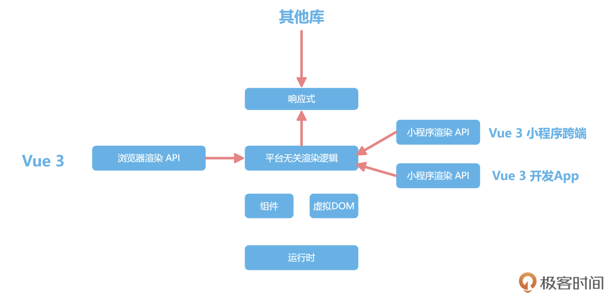

## 响应式：手写响应式系统

项目：[weiyouyi](https://github.com/shengxinjing/weiyouyi)

### 响应式

下图所示Vue的核心模块。Vue3的组件之间是通过响应式机制来通知的，响应式机制可以自动收集系统中数据的依赖，并且在修改数据之后自动执行更新，极大提高开发的效率。



根据响应式组件通知效果可知，响应式机制的主要功能就是：**把普通的JavaScript对象封装成为响应式对象，拦截数据的获取和修改操作，实现依赖数据的自动化更新。**

一个最简单的响应式模型，可以通过reactive或ref函数，把数据包裹成响应式对象，并且通过effect函数注册回调函数，然后在数据修改之后，响应式地通知去执行对应的回调函数。

🌰：Vue的响应式是可以独立在其他平台使用的。

新建test.js，输入以下内容：

```javascript
// weiyouyi/test.js
const {effect, reactive} = require('@vue/reactivity');

let dummy
const counter = reactive({ num1: 1, num2: 2 });
effect(() => {
    dummy = counter.num1 + counter.num2;
    console.log(dummy); // num1修改就会打印日志
});
setInterval(() => {
    counter.num1 ++;
}, 1000);
```

在node环境中使用Vue的响应式。

使用reactive包裹JavaScript对象之后，每次对响应式对象counter的修改，都会触发执行effect内部注册的函数。

执行`node test.js`后，可以看到控制台一直在打印，即每次counter.num1修改后触发了effect回调函数的执行。

```shell
/Users/ying.ye/.nvm/versions/node/v10.24.1/bin/node /Users/ying.ye/CodeProjects/learnFE/learn_vue3/vuejs/weiyouyi/test.js
3
4
5
6
```


在effect中获取counter.num1和counter.num2时，就会触发counter的get拦截函数；get函数内部，会把当前的effect回调函数注册到一个全局的依赖地图中去；这样counter.num1在修改时，就会触发set拦截函数，去依赖地图中找到注册的回调函数，然后执行。

#### 编写测试代码

在`src/reactivity/__test__`目录下，新建`reactive.spec.js`文件，输入以下内容，用于测试reactive的功能：能够在响应式数据ret更新后，执行effect中注册的函数。

```javascript
// src/reactivity/__test__/reactive.spec.js
import { effect } from '../effect';
import { reactive } from '../reactive';

describe('测试响应式', () => {
    test('reactive基本使用', () => {
        const ret = reactive({ num: 0 });
        let val
        effect(() => {
            val = ret.num;
        });
        expect(val).toBe(0);
        ret.num ++;
        expect(val).toBe(1);
        ret.num = 10;
        expect(val).toBe(10);
    })
})
```

#### reactive

在Vue3中，reactive是通过ES6中的Proxy特性实现对对象的拦截，所以在reactive函数中直接返回`new Proxy`即可：

```javascript
// src/reactivity/reactive.js
import { mutableHandlers } from "./baseHandlers.js";

export const reactive = target => {
    if (typeof target !== 'object') {
        console.warn(`reactive ${target} 必须是一个对象`);
        return target;
    }
    return new Proxy(target, mutableHandlers);
}
```

#### 实现Proxy中的处理方法mutableHandlers

把Proxy的代理配置抽离出来单独维护，是因为Vue3中除了reactive还有很多别的函数需要实现，比如只读的响应式数据、浅层代理的响应式数据等，并且reactive中针对ES6的代理也需要单独处理。

此处只处理js中对象的代理设置。

mutableHandlers做的事就是配置Proxy的拦截函数，这里只拦截get和set操作，新建baseHandlers.js文件，输入以下内容：

```javascript
// src/reactivity/baseHandlers.js
import {track, trigger} from "./effect.js";
import {isObject} from "../shared/index.js";
import {reactive} from "./reactive.js";

const get = createGetter();
const set = createSetter();

function createGetter(shallow = false) {
    return function get(target, key, receiver) {
        const res = Reflect.get(target, key, receiver);
        track(target, 'get', key);
        if (isObject(res)) {
            // 值也是对象的话，需要嵌套调用reactive
            // res就是target[key]
            // 如果是浅层代理，不需要嵌套
            return shallow? res: reactive(res);
        }
        return res;
    }
}

function createSetter() {
    return function set(target, key, value, receiver) {
        const result = Reflect.set(target, key, value, receiver);
        // 在触发set 的时候进行触发依赖
        trigger(target, 'set', key);
        return result;
    }
}

export const mutableHandlers = {
    get,
    set
}
```

使用`createGetter`和`createSetter`来创建get和set函数，mutableHandlers就是配置了get和set的对象返回。

* get函数：首先是直接返回读取的数据，此处Reflect.get和target[key]的结果是一致的，并且调用track函数收集依赖；如果读取的值是对象的话，还会嵌套执行reactive
* set函数：首先执行赋值操作，然后调用trigger函数，执行track收集到的依赖函数

#### track：依赖收集

依赖收集和执行的原理

在track函数中，可以使用一个巨大的targetMap去存储依赖关系。

targetMap的key是要代理的target对象，value还是一个map（`depsMap`），存储着每一个依赖对象属性的函数，每一个属性都可以被多个effect依赖。`test.js`文件中的代码执行后，depsMap中就有了num1和num2两个key。

依赖地图的格式：

```javascript
targetMap = {
	target1: {
		key1: [cb1, cb2],
		key2: [cb3, cb4]
	},
	target2: {
	  // ...
	}
	// ...
};
```

具体代码如下：

```javascript
// src/reactivity/effect.js
const targetMap = new WeakMap();
let activeEffect;

/*
* 收集依赖
* */
export function track(target, type, key) {
    console.log(`触发 track -> target: ${target} type: ${type} key: ${key}`);

    let depsMap = targetMap.get(target); // 获取target对象的依赖地图
    if (!depsMap) {
        // 初始化depsMap
        targetMap.set(target, depsMap = new Map());
    }
    let deps = depsMap.get(key); // 获取target对象上key属性的依赖地图
    if (!deps) {
        deps = new Set();
    }
    if (!deps.has(activeEffect) && activeEffect) {
        // 防止重复注册
        deps.add(activeEffect);
    }
    depsMap.set(key, deps);
}
```

由于target是对象，所以必须使用map才可以把target作为key来管理数据，每次操作之前需要做非空的判断，最终把activeEffect存储在集合之中。

#### trigger：触发依赖函数执行

trigger函数实现的思路，就是从targetMap中，根据target和key找到对应的依赖函数集合deps，然后遍历deps执行依赖函数。

以下是具体实现：

```javascript
// src/reactivity/effect.js
/*
* 执行所有依赖函数
* */
export function trigger(target, type, key) {
    console.log(`触发 trigger -> target: ${target} type: ${type} key: ${key}`);

    const depsMap = targetMap.get(target);
    if (!depsMap) {
        return;
    }
    const deps = depsMap.get(key);
    if (!deps) {
        return;
    }
    deps.forEach((effectFn) => {
        if (effectFn.scheduler) {
            effectFn.scheduler();
        } else {
            effectFn();
        }
    });
}
```

可以看到执行的是effectFn的scheduler或者run函数，因为这里需要在effect函数中把依赖函数进行包装，并对依赖函数的执行时机进行控制，这是一个小的设计点。

#### effect函数

把传递进来的fn函数通过effectFn函数包裹执行，在effectFn函数内部，把函数赋值给全局变量activeEffect；

同时执行fn的时候，会触发响应式对象的get函数，get函数内部就会把activeEffect存储到依赖地图中，完成依赖的收集。

```javascript
// src/reactivity/effect.js
export function effect(fn, options = {}) {
    const effectFn = () => {
        try {
            activeEffect = effectFn;
            // fn执行时，内部读取响应式数据的时候，就能在对应get函数里读取到activeEffect
            return fn();
        } finally {
            activeEffect = null;
        }
    }
    if (!options.lazy) {
        // 没有配置lazy就直接执行
        effectFn();
    }
    effectFn.scheduler = options.scheduler;

    return effectFn;
}
```

effect传递的options，可以通过传递比如lazy和scheduler来控制函数执行的时机，默认是同步执行。

scheduler存在的意义，就是我们可以手动控制函数执行的时机，方便应对一些性能优化的场景，比如数据在一次交互中可能会被修改很多次，我们不想每次修改都重新执行一次effect函数，而是合并最终的状态之后，最后统一修改一次。

scheduler🌰：使用数组管理传递的执行任务，最后使用Promise.resolve只执行最后一次，这也是Vue中watchEffect函数的大致原理。

```javascript
const obj = reactive({ count: 1 });
effect(() => {
  console.log(obj.count);
}, {
  scheduler: queueJob
});
// 调度器实现
const queue: Function[] = []
let isFlushing = false
function queueJob(job: () => void) {
  if (!isFlushing) {
    isFlushing = true
    Promise.resolve().then(() => {
      let fn
      while (fn = queue.shift()) {
        fn()
      }
    })
  }
}
```

至此，就可以执行上面`src/reactivity/__test__/reactive.spec.js`文件中的代码并通过测试。

这里**之所以多层封装**，是因为Vue的响应式本身有很多的横向扩展，除了响应式的封装，还有只读的拦截、浅层数据的拦截等等，这样做使得响应式系统本身也变得更加灵活和易于扩展，平时设计公用函数的时候也可以借鉴类似的思路。

#### 另一个选择——ref函数

ref的执行逻辑要比reactive简单一些，不需要使用Proxy代理语法，直接使用对象语法的getter和setter配置，监听value属性即可。

在ref函数返回的对象中，对象的get value方法调用track函数去收集依赖，set value方法调用trigger函数去触发函数的执行。

```javascript
// src/reactivity/ref.js
import {track, trigger} from "./effect.js";
import {isObject} from "../shared/index.js";
import {reactive} from "./reactive.js";

export function ref(val) {
    if (isRef(val)) {
        return val;
    }
    return new RefImpl(val);
}

function isRef(val) {
    return !!(val && val.__isRef);
}

// ref就是利用面向对象的getter和setter进行track和trigger
class RefImpl {
    constructor(val) {
        this._val = convert(val);
        this.__isRef = true;
    }

    get value() {
        track(this, 'value');
        return this._val;
    }

    set value(val) {
        if (val !== this._val) {
            this._val = convert(val);
            trigger(this, 'value');
        }
    }
}

// ref也可以支持复杂数据结构
function convert(val) {
    return isObject(val) ? reactive(val) : val;
}
```

可以看到，ref函数的实现相对简单很多，只是利用面向对象的getter和setter拦截了value属性的读写，这也是为什么需要操作ref对象的value属性的原因。

**ref也可以包裹复杂的数据结构，内部通过直接调用reactive来实现。**现在我们可以全部都用ref函数，ref内部会帮忙调用reactive。

#### computed

computed计算属性也是一种特殊的effect函数，先新建`computed.spec.js`文件来测试computed函数的功能，computed可以接收一个函数或者对象，实现计算属性的读取和修改。

```javascript
// src/reactivity/__test__/computed.spec.js
import {ref} from "../ref.js";
import {reactive} from "../reactive.js";
import {computed} from '../computed.js';

describe('computed测试', () => {
    it('computed基础使用', () => {
        const ret = reactive({ count: 1 });
        const num = ref(2);
        const sum = computed(() => num.value + ret.count);
        expect(sum.value).toBe(3);

        ret.count ++;
        expect(sum.value).toBe(4);
        num.value = 10;
        expect(sum.value).toBe(12);
    })

    it('computed属性修改', () => {
        const author = ref('大圣');
        const course = ref('玩转Vue3');
        const title = computed({
            get() {
                return `${author.value}:${course.value}`;
            },
            set(val) {
                [author.value, course.value] = val.split(':');
            }
        });
        expect(title.value).toBe('大圣:玩转Vue3');

        author.value = 'winter'
        course.value = '重学前端'
        expect(title.value).toBe('winter:重学前端');

        title.value = '王争:数据结构与算法之美';
        expect(author.value).toBe('王争');
        expect(course.value).toBe('数据结构与算法之美');
    })
});
```

新建computed函数，下面的代码中，拦截computed的value属性，并且设置了effect的lazy和scheduler配置，computed注册的函数就不会直接执行，而是要通过scheduler函数中对_dirty属性决定是否执行。

```javascript
// src/reactivity/computed.js
import {trigger, effect, track} from "./effect.js";

export function computed(getterOrOptions) {
    let getter, setter;
    if (typeof getterOrOptions === 'function') {
        getter = getterOrOptions;
        setter = () => {
            console.warn('计算属性不能修改');
        }
    } else {
        getter = getterOrOptions.get;
        setter = getterOrOptions.set;
    }
    return new ComputedRefImpl(getter, setter);
}

class ComputedRefImpl {
    constructor(getter, setter) {
        this._setter = setter;
        this._val = undefined;
        this._dirty = true;
        this.effect = effect(getter, {
            lazy: true,
            scheduler: () => {
                if (!this._dirty) {
                    this._dirty = true;
                    trigger(this, 'value');
                }
            }
        })
    }
    get value() {
        track(this, 'value');
        if (this._dirty) {
            this._dirty = false;
            this._val = this.effect();
        }
        return this._val;
    }
    set value(val) {
        this._setter(val);
    }
}
```


### 总结

**响应式的主要功能就是，可以把普通的JavaScript对象封装成为响应式对象。**在读取数据的时候，通过track收集依赖关系，把整个对象和effect注册函数的依赖关系全部存储在一个依赖图中。

定义的depsMap是一个巨大的Map数据，effect注册的函数会被内部读取的数据存储在对应的depsMap中，当数据被修改的时候，通过查询depsMap，获得需要执行的函数，再去执行即可。

depsMap中存储的不是直接传递给effect的函数，而是包装了一层对象对这个函数的执行实际进行管理，内部可以通过activeEffect管理执行状态，也可以通过全局变量shouldTrack控制监听状态，并且执行的方式也是判断调用scheduler或者run方法，实现了对性能的提升。

在日常项目开发中我们也可以借鉴**响应式的处理思路：使用通知的机制，来调用具体数据的操作和更新逻辑**。灵活使用effect、ref、reactive等函数把常见的操作全部变成响应式数据处理，可以极大地提高开发的体验和效率。
