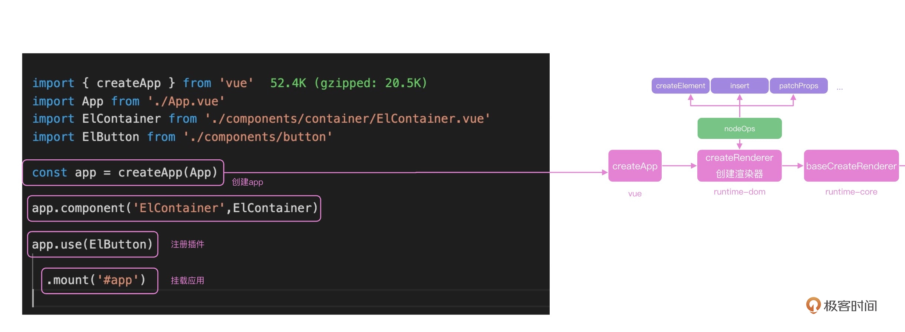

## 运行时：Vue在浏览器里是怎么跑起来的

对着Vue3的源码来学习，把源码简化再演示

前端框架需要处理的最核心的两个流程，就是首次渲染和数据更新后的渲染。

先来看首次渲染的源码。演示代码使用Vue3的实际代码，也可以在[weiyouyi](https://github.com/shengxinjing/weiyouyi/blob/main/src/runtime-core/apiCreateApp.js#L4)项目中查看课程的mini版本代码。

### 首次渲染

想要启动一个Vue项目，只需要从Vue中引入createApp并调用，传入App组件，调用createApp方法会返回一个app实例，调用这个实例的mount方法，就实现了项目的启动。此时Vue也完成了首次渲染。

```javascript
// src/main.js
import { createApp } from 'vue'
import './style.css'
import App from './App.vue'

createApp(App).mount('#app')
```

所以createApp就是项目的初始化渲染入口。

关于这段代码是怎么完成初始化渲染的，可以在Vue中的**runtime-dom**中查看createApp的定义，[createApp](https://github.com/vuejs/core/blob/main/packages/runtime-dom/src/index.ts#L66)

**一个看源码的小技巧**：首次查看源码的时候，可以先把一些无用的信息删除，方便自己梳理主体的逻辑。

看Vue源码，和今天主题无关的无用信息有哪些，`__COMPAT__`代码是用来兼容Vue2的，`__DEV__`代码是用来调试的，把这些代码删除之后，就可以得到下面的简化版**createApp源码**。

#### createApp

```javascript
export const createApp = ((...args) => {
  const app = ensureRenderer().createApp(...args)
  const { mount } = app
  // 重写mount
  app.mount = (containerOrSelector: Element | ShadowRoot | string): any => {
    const container = normalizeContainer(containerOrSelector)
    if (!container) return

    const component = app._component
    if (!isFunction(component) && !component.render && !component.template) {
      component.template = container.innerHTML
    }
    container.innerHTML = ''
    const proxy = mount(container, false, container instanceof SVGElement)
    if (container instanceof Element) {
      container.removeAttribute('v-cloak')
      container.setAttribute('data-v-app', '')
    }
    return proxy
  }
  return app
}) 
function normalizeContainer(container){
  if (isString(container)) {
    const res = document.querySelector(container)
  }
  return container
}
```

从简化代码中可以看出，在createApp函数内部，调用`ensureRenderer()`函数返回的对象上，也有一个createApp方法，调用这个createApp方法并将返回对象赋值给变量app，然后取出app上自带的mount方法，并重写app.mount方法。

在重写的mount方法内部，会查找传递的DOM容器元素，并调用自带的mount方法，进行初始化渲染。



利用TS的背景知识，即使我们不知道app.mount是什么逻辑，也能知道这个函数的参数只能是Element、ShadowRoot或者string三者之一，也就很好理解内部的normalizeContainer就是把传递的参数统一变为浏览器的DOM元素。

#### ensureRenderer

继续了解ensureRenderer方法，以及ensureRenderer方法返回对象上的createApp方法。

**ensureRenderer函数，内部通过调用createRenderer函数，创建了一个浏览器的渲染器，并且缓存了渲染器renderer。**这种使用闭包做缓存的方式，在日常开发中也可以借鉴。

```javascript
// 浏览器dom操作
import { nodeOps } from './nodeOps'
// 浏览器dom属性更新
import { patchProp } from './patchProp'
import { createRenderer } from '@vue/runtime-core'
const rendererOptions = extend({ patchProp }, nodeOps)

let renderer: Renderer<Element | ShadowRoot> | HydrationRenderer

function ensureRenderer() {
  return (
    renderer ||
    (renderer = createRenderer<Node, Element | ShadowRoot>(rendererOptions))
  )
}  
```

createRenderer函数，根据自定义渲染器那一讲，接收的`renderOptions`就是浏览器里面标签的增删改查API；可以看到，createRenderer函数接收的参数是nodeOps和patchProps的合并对象。

继续进入nodeOps和patchProps可以看到以下代码，写了很多方法。

```javascript
export const nodeOps: Omit<RendererOptions<Node, Element>, 'patchProp'> = {
  insert: (child, parent, anchor) => {
    parent.insertBefore(child, anchor || null)
  },
  remove: child => {
    const parent = child.parentNode
    if (parent) {
      parent.removeChild(child)
    }
  },
  createElement: (tag, isSVG, is, props): Element => {
    const el = isSVG
      ? doc.createElementNS(svgNS, tag)
      : doc.createElement(tag, is ? { is } : undefined)

    if (tag === 'select' && props && props.multiple != null) {
      ;(el as HTMLSelectElement).setAttribute('multiple', props.multiple)
    }
    return el
  },

  createText: text => doc.createTextNode(text),

  createComment: text => doc.createComment(text),

  setText: (node, text) => {
    node.nodeValue = text
  },

  setElementText: (el, text) => {
    el.textContent = text
  },
  parentNode: node => node.parentNode as Element | null,
  nextSibling: node => node.nextSibling,
  querySelector: selector => doc.querySelector(selector),
  // ... 
}
```

通过ensureRenderer存储这些操作方法后，createApp内部就可以脱离具体的渲染平台了，这也是**Vue3实现跨端的核心逻辑**。

#### createRenderer

进入**runtime-core**模块查看createRenderer是如何工作的。[createRenderer源码](https://github.com/vuejs/core/blob/main/packages/runtime-core/src/renderer.ts#L290)

createRenderer是基于baseCreateRenderer创建的，baseCreateRenderer函数内部有十几个函数，代码行数合计2000行左右，这也是学习Vue源码最复杂的一个函数。

按简化源码的思路，先把工具函数的实现折叠起来，精简之后的代码主要逻辑其实很简单。

```javascript
export function createRenderer<
  HostNode = RendererNode,
  HostElement = RendererElement
>(options: RendererOptions<HostNode, HostElement>) {
  return baseCreateRenderer<HostNode, HostElement>(options)
}

function baseCreateRenderer(){
    const {
    insert: hostInsert,
    remove: hostRemove,
    patchProp: hostPatchProp,
    createElement: hostCreateElement,
    createText: hostCreateText,
    createComment: hostCreateComment,
    setText: hostSetText,
    setElementText: hostSetElementText,
    parentNode: hostParentNode,
    nextSibling: hostNextSibling,
    setScopeId: hostSetScopeId = NOOP,
    cloneNode: hostCloneNode,
    insertStaticContent: hostInsertStaticContent
  } = options
  const patch = ()=>... //一个函数
  const processText = ()=>...
  const processCommentNode = ()=>...
  const processElement = ()=>...
  const mountElement = ()=>...
  const mountChildren = ()=>...
  const patchElement = ()=>...
  const patchBlockChildren = ()=>...
  const patchProps = ()=>...
  const processComponent = ()=>...
  const mountComponent = ()=>...
  const updateComponent = ()=>...
  const setupRenderEffect = ()=>...
  const patchChildren = ()=>...
  const patchKeyedChildren = ()=>...
  const unmount = ()=>...
  const unmountComponent = ()=>...
  const unmountComponent = ()=>...
  const unmountComponent = ()=>...
  const unmountComponent = ()=>...
  const render: RootRenderFunction = (vnode, container, isSVG) => {
    if (vnode == null) {
      if (container._vnode) {
        unmount(container._vnode, null, null, true)
      }
    } else {
      patch(container._vnode || null, vnode, container, null, null, null, isSVG)
    }
    flushPostFlushCbs()
    container._vnode = vnode
  }
  return {
    render,
    hydrate,
    createApp: createAppAPI(render, hydrate)
  }
}
```

首先获取了平台上所有的insert、remove函数，这些函数都是nodeOps传递进来的，

然后定义了一系列patch、mount、unmount函数，通过名字可知，这些是Vue 中更新、渲染组件的工具函数。

比如`mountElement`就是渲染DOM元素、`mountComponent`就是渲染组件、`updateComponent`就是更新组件。这部分简化代码，也可以在[weiyouyi]项目中查看。

整个createApp函数的执行逻辑如下图所示：


**createApp的返回，实际上是createAppAPI的返回值**，并且把render方法传递给了createAppAPI。

render方法内部很简单，就是判断新节点vnode是否为null并且container容器上是否有`_vnode`属性，是的话就执行unmount方法，否则执行patch方法，最后把vnode信息存储在container._vnode上。

#### createAppAPI

createAppAPI又做了什么？继续进入createAppAPI源码。

```javascript
export function createAppAPI<HostElement>(
  render: RootRenderFunction,
  hydrate?: RootHydrateFunction
): CreateAppFunction<HostElement> {
  return function createApp(rootComponent, rootProps = null) {
    const context = createAppContext()
    let isMounted = false

    const app: App = (context.app = {
      _context: context,
      _instance: null,
      use(plugin: Plugin, ...options: any[]) ,
      component(name: string, component?: Component): any {
        if (!component) {
          return context.components[name]
        }
        context.components[name] = component
        return app
      },
      directive(name: string, directive?: Directive)
      mount(
        rootContainer: HostElement,
        isHydrate?: boolean,
        isSVG?: boolean
      ): any {
        if (!isMounted) {
          const vnode = createVNode(
            rootComponent as ConcreteComponent,
            rootProps
          )
          vnode.appContext = context
          // 核心的逻辑
          if (isHydrate && hydrate) {
            hydrate(vnode as VNode<Node, Element>, rootContainer as any)
          } else {
            render(vnode, rootContainer, isSVG)
          }
          return getExposeProxy(vnode.component!) || vnode.component!.proxy
        } 
      },

      provide(key, value) {
        context.provides[key as string] = value
        return app
      }
    })

    return app
  }
}
```

createAppAPI返回值为内部createApp函数的返回值，此createApp函数内部，创建了一个app对象，app上注册了use、component和mount等方法。

可以看到，mount内部执行了传递进来的render方法；container就是从app.mount中传递的DOM元素，对DOM元素进行处理之后，render内部执行patch函数实现整个应用的加载。

#### patch函数

patch函数的执行逻辑。

patch接收的是container._vnode（即上一次渲染缓存的vnode）、本次渲染组件的vnode、以及容器container。

以下是patch函数的代码。

其中n1是上次渲染的虚拟DOM，n2是将要渲染的虚拟DOM。

```javascript
  const patch: PatchFn = (
    n1,
    n2,
    container,
    anchor = null,
    parentComponent = null,
    parentSuspense = null,
    isSVG = false,
    slotScopeIds = null,
    optimized = __DEV__ && isHmrUpdating ? false : !!n2.dynamicChildren
  ) => {
    // 两次虚拟dom完全一样 啥也不用干
    if (n1 === n2) {
      return
    }
    // 虚拟dom节点类型不一样， unmount老的虚拟dom，并且n1赋值null
    if (n1 && !isSameVNodeType(n1, n2)) {
      anchor = getNextHostNode(n1)
      unmount(n1, parentComponent, parentSuspense, true)
      n1 = null
    }
    // n2是要渲染的虚拟dom，我们获取type，ref和shapeFlag
    const { type, ref, shapeFlag } = n2
    switch (type) {
      case Text:
        // 文本
        processText(n1, n2, container, anchor)
        break
      case Comment:
        // 注释
        processCommentNode(n1, n2, container, anchor)
        break
      case Static:
        // 静态节点
        if (n1 == null) {
          mountStaticNode(n2, container, anchor, isSVG)
        } else if (__DEV__) {
          patchStaticNode(n1, n2, container, isSVG)
        }
        break
      case Fragment:
        processFragment(
          n1,
          n2,
          container,
          anchor,
          parentComponent,
          parentSuspense,
          isSVG,
          slotScopeIds,
          optimized
        )
        break
      default:
        // 运运算判断操作类型
        if (shapeFlag & ShapeFlags.ELEMENT) {
          // html标签
          processElement(
            n1,
            n2,
            container,
            anchor,
            parentComponent,
            parentSuspense,
            isSVG,
            slotScopeIds,
            optimized
          )
        } else if (shapeFlag & ShapeFlags.COMPONENT) {
          // 组件
          processComponent(
            n1,
            n2,
            container,
            anchor,
            parentComponent,
            parentSuspense,
            isSVG,
            slotScopeIds,
            optimized
          )
        } else if (shapeFlag & ShapeFlags.TELEPORT) {
          ;(type as typeof TeleportImpl).process(
            n1 as TeleportVNode,
            n2 as TeleportVNode,
            container,
            anchor,
            parentComponent,
            parentSuspense,
            isSVG,
            slotScopeIds,
            optimized,
            internals
          )
        } else if (__FEATURE_SUSPENSE__ && shapeFlag & ShapeFlags.SUSPENSE) {
          ;(type as typeof SuspenseImpl).process(
            n1,
            n2,
            container,
            anchor,
            parentComponent,
            parentSuspense,
            isSVG,
            slotScopeIds,
            optimized,
            internals
          )
        } else if (__DEV__) {
          warn('Invalid VNode type:', type, `(${typeof type})`)
        }
    }

    // set ref
    if (ref != null && parentComponent) {
      setRef(ref, n1 && n1.ref, parentSuspense, n2 || n1, !n2)
    }
  }
```

首先把n1和n2做一次对比，如果两个虚拟DOM的节点类型不同，就直接unmount老节点，没有计算diff的必要。

如果n1和n2类型相同，就需要判断具体的类型再去执行不同的函数，比如`processText`、`processFragment`、`processElement`以及`processComponent`等函数。

第55行（default语句后面），这里的ShapeFlags用到了位运算，后面会通过算法题介绍，ShapeFlags可以帮助我们快速判断需要操作的类型就可以了。

代码的整体执行逻辑如下图所示：


首次渲染的App是一个组件，所以执行的是processComponent函数。

#### processComponent函数

继续进入到processComponent函数内部，看以下代码。

```javascript
  const processComponent = (
    n1: VNode | null,
    n2: VNode,
    container: RendererElement,
    anchor: RendererNode | null,
    parentComponent: ComponentInternalInstance | null,
    parentSuspense: SuspenseBoundary | null,
    isSVG: boolean,
    slotScopeIds: string[] | null,
    optimized: boolean
  ) => {
    n2.slotScopeIds = slotScopeIds
    if (n1 == null) {
      if (n2.shapeFlag & ShapeFlags.COMPONENT_KEPT_ALIVE) {
        ;(parentComponent!.ctx as KeepAliveContext).activate(
          n2,
          container,
          anchor,
          isSVG,
          optimized
        )
      } else {
        mountComponent(
          n2,
          container,
          anchor,
          parentComponent,
          parentSuspense,
          isSVG,
          optimized
        )
      }
    } else {
      updateComponent(n1, n2, optimized)
    }
  }
```

首次渲染时，n1是null，所以执行mountComponent；如果是更新组件，n1就是上次渲染的vdom，需要执行updateComponent。

updateComponent是更新DOM的逻辑，在下一讲剖析。

进入**mounComponent**函数中，可以看到mountComponent函数内部会对组件进行一系列的判断，还有一些对Vue2的兼容代码，核心的渲染逻辑就是setupComponent函数和setupRenderEffect函数。

```javascript
import {setupComponent} from './component'
  const mountComponent: MountComponentFn = (
  ) => {
    // 2.x compat may pre-creaate the component instance before actually
    // mounting
    const compatMountInstance =
      __COMPAT__ && initialVNode.isCompatRoot && initialVNode.component
    const instance: ComponentInternalInstance =
      compatMountInstance ||
      (initialVNode.component = createComponentInstance(
        initialVNode,
        parentComponent,
        parentSuspense
      ))

    // resolve props and slots for setup context
    if (!(__COMPAT__ && compatMountInstance)) {

      setupComponent(instance)

    }
     (
      instance,
      initialVNode,
      container,
      anchor,
      parentSuspense,
      isSVG,
      optimized
    )

    if (__DEV__) {
      popWarningContext()
      endMeasure(instance, `mount`)
    }
  }
```

setupComponent和setupRenderEffect，做了什么呢？可以参考下图。

这两个实现组件首次渲染的函数。


#### setupComponent

setupComponent，要完成的就是执行我们写的setup函数。

```javascript
export function setupComponent(
  instance: ComponentInternalInstance,
  isSSR = false
) {
  isInSSRComponentSetup = isSSR

  const { props, children } = instance.vnode
  const isStateful = isStatefulComponent(instance)
  initProps(instance, props, isStateful, isSSR)
  initSlots(instance, children)

  const setupResult = isStateful
    ? setupStatefulComponent(instance, isSSR)
    : undefined
  isInSSRComponentSetup = false
  return setupResult
}

function setupStatefulComponent(
  instance: ComponentInternalInstance,
  isSSR: boolean
) {
  const Component = instance.type as ComponentOptions
  // 执行setup
  const { setup } = Component
  if (setup) {
    const setupContext = (instance.setupContext =
      setup.length > 1 ? createSetupContext(instance) : null)

    setCurrentInstance(instance)
    pauseTracking()
    const setupResult = callWithErrorHandling(
      setup,
      instance,
      ErrorCodes.SETUP_FUNCTION,
      [instance.props, setupContext]
    )
    if (isPromise(setupResult)) {
      setupResult.then(unsetCurrentInstance, unsetCurrentInstance)
    } else {
      handleSetupResult(instance, setupResult, isSSR)
    }
  } else {
    finishComponentSetup(instance, isSSR)
  }
}

export function callWithErrorHandling(
  fn: Function,
  instance: ComponentInternalInstance | null,
  type: ErrorTypes,
  args?: unknown[]
) {
  let res
  try {
    res = args ? fn(...args) : fn()
  } catch (err) {
    handleError(err, instance, type)
  }
  return res
}
```

可以看到，内部先初始化了props和slots，并且执行`setupStatefulComponent`创建组件，这个函数内部，获取component的setup属性，也就是script setup里的内容，就进入到我们组件内部的reactive、ref等函数实现的逻辑了。

#### setupRenderEffect

setupRenderEffect函数，就是**为了后续数据修改注册的函数**，此处先梳理核心的实现逻辑。

组件首次加载会调用patch函数去初始化子组件，注意setupRenderEffect本身就是在patch函数内部执行的，所以这里就会递归整个虚拟DOM树，然后触发生命周期mounted，完成这个组件的初始化。

页面首次更新结束后，setupRenderEffect不仅实现了组件的递归渲染，还注册了组件的更新机制。

```javascript
    if (!instance.isMounted) {
         patch(
            null,
            subTree,
            container,
            anchor,
            instance,
            parentSuspense,
            isSVG
          )
    }else{
      // updateComponent
    }
    // create reactive effect for rendering
    const effect = new ReactiveEffect(
      componentUpdateFn,
      () => queueJob(instance.update),
      instance.scope // track it in component's effect scope
    )

    const update = (instance.update = effect.run.bind(effect) as SchedulerJob)
    update.id = instance.uid

    update()
```

以上的核心代码中，通过ReactiveEffect创建了effect函数，然后将effect.run方法赋值给instance.update，这样结合setup内部的ref和reactive绑定的数据，数据修改之后，就会触发update方法的执行，内部就会执行componentUpdateFn，内部进行递归调用的patch去调用执行每个组件内部的update方法去实现组件的更新。

至此就实现了整个Vue的渲染和更新流程。


### 总结

本文分析了Vue3在浏览器中执行的全流程，可以配合Vue在浏览器中执行的流程图来复习。


Vue通过`createApp`创建应用，并且执行返回的mount方法实现在浏览器中的挂载，在createApp中，通过传递浏览器平台的操作方法nodeOps创建了浏览器的渲染器renderer。

**首次加载Vue项目的时候，通过patch实现组件的渲染**，patch函数内部根据节点的不同类型，去分别执行processElement、processComponent、processText等方法去递归处理不同类型的节点，最终通过setupComponent执行组件的setup函数，setupRenderEffect中使用响应式的effect函数监听数据的变化。

可以先看这里的mini版本项目weiyouyi，然后再去看Vue3中实际的代码，可以学习代码中很多优秀的设计思路，比如createRenderer中使用闭包作为缓存、使用位运算来提高组件类型的判断效率等。学习优秀框架中的代码设计，这对我们日常开发项目的代码质量也有很好的提高作用。