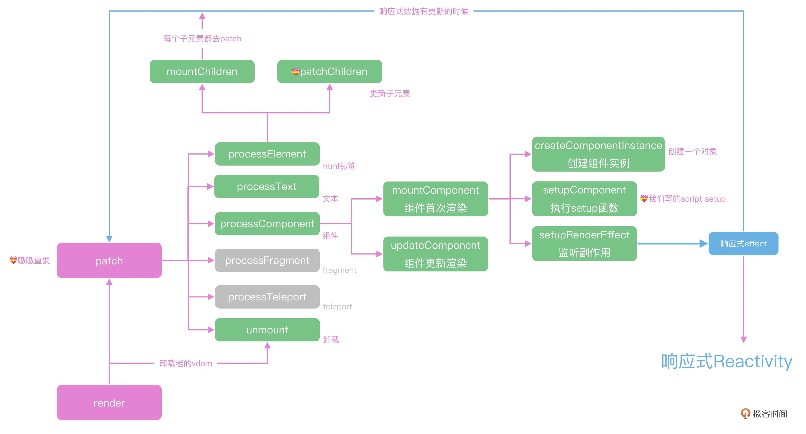
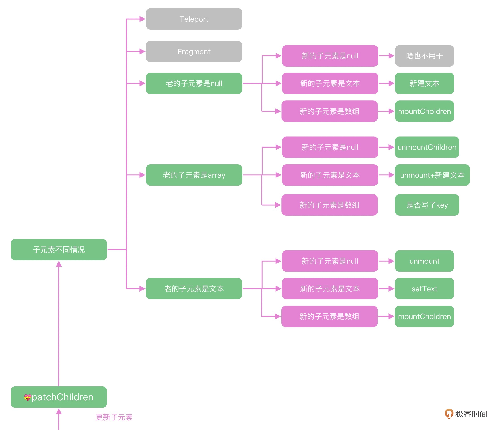

## 虚拟DOM（上）-如何通过虚拟DOM更新页面

上一讲主要介绍了Vue项目的首次渲染流程，在mountComponent中注册了effect函数，这样在组件数据有更新的时候，就会通知到组件的update方法进行更新。

Vue中组件更新的方式也是使用了响应式 + 虚拟DOM的方式。

下面就来详细剖析Vue组件内部如何通过虚拟DOM更新页面的代码细节。

### Vue虚拟DOM执行流程

在Vue中，我们使用虚拟DOM来描述页面的组件，比如下面的template，虽然格式和HTML很像，但是在Vue内部会被解析成JavaScript函数，这个函数会返回虚拟DOM。

```vue
<div id="app">
  <p>hello world</p>
  <Rate :value="4"></Rate>
</div>
```

上面的template会被解析成下面的函数，其返回的JavaScript对象能够描述这段HTML。

```javascript
function render(){
  return h('div',{id:"app"},children:[
    h('p',{},'hello world'),
    h(Rate,{value:4}),
  ])
}
```

#### 虚拟DOM的创建

上一讲的mount函数中，使用createVNode函数创建虚拟DOM，可以看到**Vue内部的虚拟DOM，即vnode，就是一个对象，通过type、props、children等属性描述整个节点**。

```javascript
const vnode = createVNode(    
  rootComponent as ConcreteComponent,
  rootProps
)
function _createVNode() {

  // 处理属性和class
  if (props) {
    // ...
  }

  // 标记vnode信息
  const shapeFlag = isString(type)
    ? ShapeFlags.ELEMENT
    : __FEATURE_SUSPENSE__ && isSuspense(type)
    ? ShapeFlags.SUSPENSE
    : isTeleport(type)
    ? ShapeFlags.TELEPORT
    : isObject(type)
    ? ShapeFlags.STATEFUL_COMPONENT
    : isFunction(type)
    ? ShapeFlags.FUNCTIONAL_COMPONENT
    : 0

  return createBaseVNode(
    type,
    props,
    children,
    patchFlag,
    dynamicProps,
    shapeFlag,
    isBlockNode,
    true
  )
}

function createBaseVNode(type,props,children,...){
    const vnode = {
    type,
    props,
    key: props && normalizeKey(props),
    ref: props && normalizeRef(props),
    children,
    shapeFlag,
    patchFlag,
    dynamicProps,
     ...
  } as VNode
  // 标准化子节点
  if (needFullChildrenNormalization) {
    normalizeChildren(vnode, children)
  } else if (children) {
    vnode.shapeFlag |= isString(children)
      ? ShapeFlags.TEXT_CHILDREN
      : ShapeFlags.ARRAY_CHILDREN
  }
  return vnode
}
```

createVNode负责创建Vue中的虚拟DOM，mount函数的核心逻辑就是使用setupComponent执行`<script setup>`，使用setupRenderEffect监听组件的数据变化。

因此可以到setupRenderEffect函数中，去完整地剖析Vue中虚拟DOM的更新逻辑。

在setupRenderEffect内部，给组件注册了update方法，这个方法被赋值为effect后，当组件内的ref、reactive响应式数据发生变化时就会执行update方法，触发组件内部的更新机制。

在setupRenderEffect内部的**`componentUpdateFn`**中，`updateComponentPreRender`更新了props和slots，并调用renderComponentRoot函数创建新的子树对象nextTree，然后继续调用patch函数。

```javascript
const componentUpdateFn = ()=>{
  if (!instance.isMounted) {
      //首次渲染
      instance,
        parentSuspense,
        isSVG
      )
      // ...
  }else{
    let { next, bu, u, parent, vnode } = instance
    if (next) {
      next.el = vnode.el
      updateComponentPreRender(instance, next, optimized)
    } else {
      next = vnode
    }
    const nextTree = renderComponentRoot(instance)
    patch(
      prevTree,
      nextTree,
      // parent may have changed if it's in a teleport
      hostParentNode(prevTree.el!)!,
      // anchor may have changed if it's in a fragment
      getNextHostNode(prevTree),
      instance,
      parentSuspense,
      isSVG
    )
   }
}

// 注册effect函数
const effect = new ReactiveEffect(
  componentUpdateFn,
  () => queueJob(instance.update),
  instance.scope // track it in component's effect scope
)
const update = (instance.update = effect.run.bind(effect) as S      chedulerJob)
update()

  const updateComponentPreRender = (
    instance: ComponentInternalInstance,
    nextVNode: VNode,
    optimized: boolean
  ) => {
    nextVNode.component = instance
    const prevProps = instance.vnode.props
    instance.vnode = nextVNode
    instance.next = null
    updateProps(instance, nextVNode.props, prevProps, optimized)
    updateSlots(instance, nextVNode.children, optimized)

    pauseTracking()
    // props update may have triggered pre-flush watchers.
    // flush them before the render update.
    flushPreFlushCbs(undefined, instance.update)
    resetTracking()
  }
```

可以看到，**Vue源码中首次渲染和更新的逻辑都写在一起，我们在递归的时候如果对一个标签实现更新和渲染，就可以用一个函数实现**。

比较关键的就是上面代码中的**effect函数，负责注册组件，这个函数也是Vue组件更新的入口函数**。


#### patch函数

数据更新之后，就会执行patch函数，下图就是patch函数执行的逻辑图。



在patch函数中，会针对不同的组件类型执行不同的函数，如组件会执行`processComponent`，HTML标签会执行`processElement`。

```javascript
  function patch(n1, n2, container){
    const { type, shapeFlag } = n2
    switch (type) {
      case Text:
        processText(n1, n2, container)
        break
      // 还有注释，fragment之类的可以处理，这里忽略
      default:
        // 通过shapeFlag判断类型
        if (shapeFlag & ShapeFlags.ELEMENT) {
          processElement(n1, n2, container, anchor)
        } else if (shapeFlag & ShapeFlags.STATEFUL_COMPONENT) {
          processComponent(n1, n2, container)
        }
    }
    
  }

  function processComponent(n1, n2, container) {
    // 老规矩，么有n1就是mount
    if (!n1) {
      // 初始化 component
      mountComponent(n2, container)
    } else {
      updateComponent(n1, n2, container)
    }
  }
```

由于是更新不是首次渲染，patch函数内部会执行updateComponent。

在updateomponent函数内部，shouldUpdateComponent会判断组件是否需要更新，实际执行的是`instance.update`。

```javascript
const instance = (n2.component = n1.component)!
if (shouldUpdateComponent(n1, n2, optimized)) {

  // normal update
  instance.next = n2
  // in case the child component is also queued, remove it to avoid
  // double updating the same child component in the same flush.
  invalidateJob(instance.update)
  // instance.update is the reactive effect.
  instance.update()
  
} else {
  // no update needed. just copy over properties
  n2.component = n1.component
  n2.el = n1.el
  instance.vnode = n2
}
```

组件的子元素是由HTML标签和组件构成的，组件内部的递归处理最终也是对HTML标签的处理，所以，最后组件的更新都会进入到`processElement`内部的`patchElement`函数中。


#### patchElement函数

在函数patchElement中主要就做两件事：更新节点自己的属性和更新子元素。

##### 节点自身属性的更新

先看自身属性的更新，这里就能体现出**Vue3中性能优化的思想，通过patchFlag可以做到按需更新**。

* 如果标记了`FULL_PROPS`，就直接调用patchProps
* 如果标记了`CLASS`，说明节点只有class属性是动态的，其他的style等属性都不需要进行判断和DOM操作

这就极大地优化了属性操作的性能

内部执行`hostPatchProps`进行实际的DOM操作，`hostPatchProps`是从nodeOps中定义的，其他动态属性`STYLE`、`TEXT`等也都是一样的逻辑。Vue3的虚拟DOM真正做到了按需更新，这也是相比于React的一个优势。

```javascript
  const patchElement = (
    n1: VNode,
    n2: VNode,
    parentComponent: ComponentInternalInstance | null,
    parentSuspense: SuspenseBoundary | null,
    isSVG: boolean,
    slotScopeIds: string[] | null,
    optimized: boolean
  ) => {
    const el = (n2.el = n1.el!)
    let { patchFlag, dynamicChildren, dirs } = n2
    patchFlag |= n1.patchFlag & PatchFlags.FULL_PROPS

    const oldProps = n1.props || EMPTY_OBJ
    const newProps = n2.props || EMPTY_OBJ

    // full diff
    patchChildren(
      n1,
      n2,
      el,
      null,
      parentComponent,
      parentSuspense,
      areChildrenSVG,
      slotScopeIds,
      false
    )

    if (patchFlag > 0) {

      if (patchFlag & PatchFlags.FULL_PROPS) {
        patchProps(
          el,
          n2,
          oldProps,
          newProps,
          parentComponent,
          parentSuspense,
          isSVG
        )
      } else {
        // class是动态的
        if (patchFlag & PatchFlags.CLASS) {
          if (oldProps.class !== newProps.class) {
            hostPatchProp(el, 'class', null, newProps.class, isSVG)
          }
        }

        // style样式是动态的
        if (patchFlag & PatchFlags.STYLE) {
          hostPatchProp(el, 'style', oldProps.style, newProps.style, isSVG)
        }

        // 属性需要diff
        if (patchFlag & PatchFlags.PROPS) {
          // 
          const propsToUpdate = n2.dynamicProps!
          for (let i = 0; i < propsToUpdate.length; i++) {
            const key = propsToUpdate[i]
            const prev = oldProps[key]
            const next = newProps[key]
            // #1471 force patch value
            if (next !== prev || key === 'value') {
              hostPatchProp(
                el,
                key,
                prev,
                next,
                isSVG,
                n1.children as VNode[],
                parentComponent,
                parentSuspense,
                unmountChildren
              )
            }
          }
        }
      }
      //文本是动态的
      if (patchFlag & PatchFlags.TEXT) {
        if (n1.children !== n2.children) {
          hostSetElementText(el, n2.children as string)
        }
      }
    } 
  }
```

##### 子元素的更新

子元素的更新是patchChildren函数负责的，这个函数也是虚拟DOM中难度最高的一个函数，这里先理解它主要的实现思路。

**首先把子元素分为文本、数组和空三个状态，新老子元素分别是这三种状态之一，构成了不同的执行逻辑。**这样patchChildren内部大致有五种情况需要处理：

* 新的子元素为空，老的子元素不为空，直接卸载即可。

* 新的子元素不为空，老的子元素为空，直接创建加载即可。

* 新的子元素是文本，老的子元素如果是数组就需要全部卸载，如果是文本就要执行hostSetElementText

* 新的子元素是数组，老的子元素如果是空或者文本，直接卸载后，渲染新的数组即可。

* **最复杂的情况**就是新的子元素和老的子元素都是数组

  最朴实无华的思路，就是把老的子元素全部unmount，新的子元素全部mount，但这样无法复用已经存在的DOM元素。

  所以，我们需要**判断出可以复用的DOM元素，如果一个虚拟DOM没有改动或者只是属性变了，不需要完全销毁重建，而是更新一下属性，最大化减少DOM的操作**，这个任务就是`patchKeyedChildren`函数去完成的。

  patchKeyedChildren函数做的事情，就是尽可能高效地把老的子元素更新成新的子元素，如何高效复用老的子元素中的DOM元素是patchKeyedChildren函数的难点。

##### patchChildren

```javascript
  const patchChildren: PatchChildrenFn = (
    n1,
    n2,
    container,
    anchor,
    parentComponent,
    parentSuspense,
    isSVG,
    slotScopeIds,
    optimized = false
  ) => {
    const c1 = n1 && n1.children
    const prevShapeFlag = n1 ? n1.shapeFlag : 0
    const c2 = n2.children

    const { patchFlag, shapeFlag } = n2
    // fast path
    if (patchFlag > 0) {
      if (patchFlag & PatchFlags.KEYED_FRAGMENT) {
        // this could be either fully-keyed or mixed (some keyed some not)
        // presence of patchFlag means children are guaranteed to be arrays
        patchKeyedChildren(
          c1 as VNode[],
          c2 as VNodeArrayChildren,
          container,
          anchor,
          parentComponent,
          parentSuspense,
          isSVG,
          slotScopeIds,
          optimized
        )
        return
      } else if (patchFlag & PatchFlags.UNKEYED_FRAGMENT) {
        // unkeyed
        patchUnkeyedChildren(
          c1 as VNode[],
          c2 as VNodeArrayChildren,
          container,
          anchor,
          parentComponent,
          parentSuspense,
          isSVG,
          slotScopeIds,
          optimized
        )
        return
      }
    }

    // children has 3 possibilities: text, array or no children.
    if (shapeFlag & ShapeFlags.TEXT_CHILDREN) {
      // text children fast path
      if (prevShapeFlag & ShapeFlags.ARRAY_CHILDREN) {
        unmountChildren(c1 as VNode[], parentComponent, parentSuspense)
      }
      if (c2 !== c1) {
        hostSetElementText(container, c2 as string)
      }
    } else {
      if (prevShapeFlag & ShapeFlags.ARRAY_CHILDREN) {
        // prev children was array
        if (shapeFlag & ShapeFlags.ARRAY_CHILDREN) {
          // two arrays, cannot assume anything, do full diff
          patchKeyedChildren(
            c1 as VNode[],
            c2 as VNodeArrayChildren,
            container,
            anchor,
            parentComponent,
            parentSuspense,
            isSVG,
            slotScopeIds,
            optimized
          )
        } else {
          // no new children, just unmount old
          unmountChildren(c1 as VNode[], parentComponent, parentSuspense, true)
        }
      } else {
        // prev children was text OR null
        // new children is array OR null
        if (prevShapeFlag & ShapeFlags.TEXT_CHILDREN) {
          hostSetElementText(container, '')
        }
        // mount new if array
        if (shapeFlag & ShapeFlags.ARRAY_CHILDREN) {
          mountChildren(
            c2 as VNodeArrayChildren,
            container,
            anchor,
            parentComponent,
            parentSuspense,
            isSVG,
            slotScopeIds,
            optimized
          )
        }
      }
    }
  }
```

上面代码的执行逻辑如下图所示，根据flags判断子元素的类型后，执行不同的操作函数。



patchChildren的实现，是各类虚拟DOM框架中最难实现的函数，我们需要实现**一个高效的更新算法，能够使用尽可能少的更新次数，来实现从老的子元素到新的子元素的更新**。

举个例子，类似体育课站队的时候，大家一开始站一排，但是顺序是乱的，需要尽快把队伍按照个头左低右高排列。

在React中，这种场景的处理逻辑是先进行循环，使用的是单侧插入的算法，我们在排队的时候挨个对比，如果你站我右边，并且个头比我高一点，说明咱俩的相对位置和最终队伍的位置是一致的，暂时不需要变化，如果你比我个头矮，就需要去我左边找到一个正确的位置插队进去。

由于都只向单侧插入，最后我们就会把所有的节点移动到正确的位置之上，这就是React15框架内虚拟节点diff的逻辑，初步实现了DOM的复用；而Vue2借鉴了snabbdom的算法，在此基础上做了**第一层双端对比**的优化。

首先Web场景之下对一个数组的操作，很少有直接全部替换的。所以我们可以从纯算法的场景之中加入实际应用的场景。

如果我们只是在表格里新增一行，那么可以不要一开始就循环，而是可以先进行节点的预判。

比如，在下面的🌰中，新的节点就是在老的节点中新增和删除了几个元素，我们在循环之前，**先进行头部元素的判断**。这个例子里，可以预判出头部元素的a、b、c、d是一样的节点，说明节点不需要重新创建，只需要进行属性的更新，**然后进行队尾元素的预判**，可以判断出g和h元素也是一样的。

```
a b c d e f g h
a b c d i f j g h 
```

这样，虚拟DOM diff的逻辑就变成了下面的结构，现在只需要比较ef和ifg的区别。

```
(a b c d) e f (g h)
(a b c d) i f j (g h) 
```

相比于之前的对比场景，需要遍历的运算量就大大减小了。

有很多场景比如新增一行或者删除一行的简单场景，预判完毕之后，新老元素有一个处于没有元素的状态，就可以直接执行mount或者unmount完成对比的全过程，不需要再进行复杂的遍历。

```
(a b c d)
(a b c d) e

(a b c) d
(a b c
```

双端对比的原理大致就是这样。


想让一个队伍尽快按照个头排好序，如果能够计算出，在队伍中，个头从低到高依次递增的最多的队列，让这些人站在原地不动，其余人穿插到他们中间，就可以最大化减少人员的移动，这就是一个**最长递增子序列**的算法问题。


### 总结

本节学习了Vue中的更新逻辑。现在Vue执行逻辑的全景图中新增了组件更新的逻辑：


Vue响应式驱动了组件之间的数据通信机制，数据更新之后，组件会执行instance.update方法，update方法内部调用的componentUpdateFn函数执行patch方法进行新老子树的diff计算。

在更新函数patchElement中，主要做了两件事：patchProps更新节点自身的属性，这里使用patchFlag做到了按需更新；patchChildren执行子元素的更新。

**patch函数内部只对节点内部的动态属性做更新，这种按需更新的机制是Vue性能优秀的一个原因**。

函数内部针对新老子元素不同的状态，执行不同的逻辑。根据子元素是否为空或者数组，以及新元素是否为空或者数组，分别执行对应的删除或者mount逻辑，其中最复杂的就是新的子元素和老的子元素都是数组。

为了最大化减少DOM操作，patchKeyedChildren使用了最长递增子序列来实现，并且**相比于React的虚拟DOM diff，增加了双端的预判 + 最长递增子序列算法来实现，这是Vue性能比较优秀的另外一个原因**。
