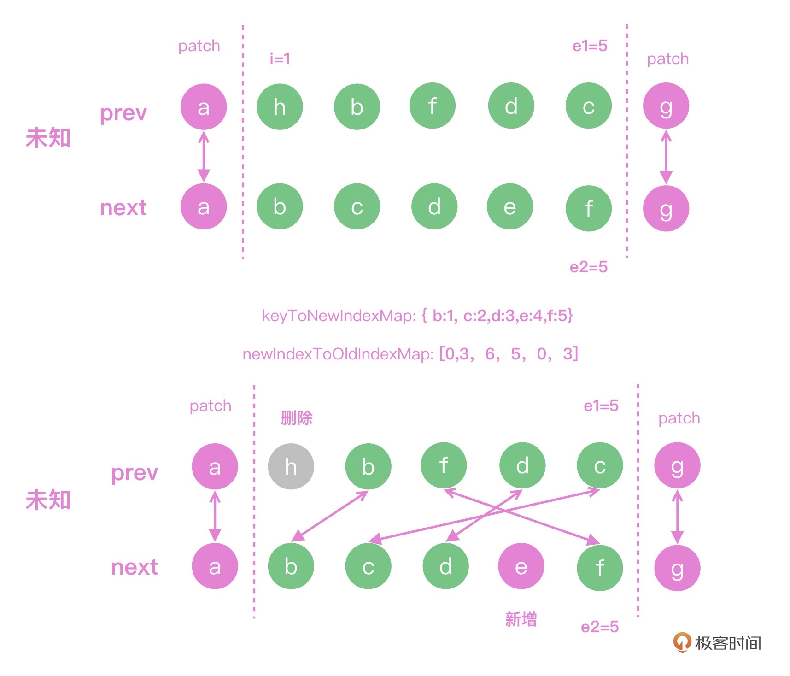

## 虚拟DOM（下）：想看懂虚拟DOM算法，先刷个算法题

上一讲：Vue中虚拟DOM是如何执行的，整体流程就是树形结构的diff计算。

在diff的计算过程中，如何高效计算虚拟DOM属性的变化，以及如何更新数组的子元素，需要一些算法知识的补充。

重点：

* 如何使用位运算来实现Vue中的按需更新，让静态的节点可以越过虚拟DOM的计算逻辑；
* 使用计算最长递增子序列的方式，来实现队伍的高效排序。

### 位运算

在执行diff前，需要判断每个虚拟DOM节点有哪些属性需要进行计算，因为无论响应式数据怎么变化，静态的属性和节点都不会发生变化。

每个节点diff的时候会做什么，在`renderer.ts`代码文件中可以看到代码，主要就是通过虚拟DOM节点的patchFlag属性判断是否需要更新节点。

**方法是：使用`&`操作符来判断操作的类型。**比如`patchFlag & PatchFlags.CLASS`来判断当前元素的class是否需要计算diff；`shapeFlag & ShapeFlags.ELEMENT`来判断当前虚拟DOM是HTML元素还是Component组件。这个`&`就是位运算的按位与。

```javascript
// class
// this flag is matched when the element has dynamic class bindings.
if (patchFlag & PatchFlags.CLASS) {
  if (oldProps.class !== newProps.class) {
    hostPatchProp(el, 'class', null, newProps.class, isSVG)
  }
}

// style
// this flag is matched when the element has dynamic style bindings
if (patchFlag & PatchFlags.STYLE) {
  hostPatchProp(el, 'style', oldProps.style, newProps.style, isSVG)
}
if (shapeFlag & ShapeFlags.ELEMENT) {
  processElement(
    n1,
    n2,
    container,
    anchor,
    parentComponent,
    parentSuspense,
    isSVG,
    slotScopeIds,
    optimized
  )
} else if (shapeFlag & ShapeFlags.COMPONENT) {
  processComponent(
    n1,
    n2,
    container,
    anchor,
    parentComponent,
    parentSuspense,
    isSVG,
    slotScopeIds,
    optimized
  )
}
```

在JavaScript中我们可以很方便地使用`toString(2)`的方式，把十进制数字转换成二进制。

二进制中，每个位置只能是0或者1这两个值。二进制的`&`就是只有两个二进制位置都是1的时候，结果是1，否则是0；`|`是按位进行“或”运算，只有两个二进制位置都是0的时候，结果是0，否则是1；并且还可以通过左移`<<`和右移`>>`操作符，实现乘以2和除以2的效果。

**在二进制上的计算，运算的性能通常会比字符串和数字的计算性能要好**，这也是很多框架内部使用位运算的原因。

#### 为什么位运算性能更好

LeetCode231题：判断数字n是不是2的幂次方。

我们可以很轻松地写出JavaScript的解答，n一直除以2，如果有余数就是false，否则就是true：

```javascript
var isPowerOfTwo = function(n) {
    if(n === 1) return true
    while( n > 2 ){
        n = n / 2
        if(n % 2 !== 0) return false
    }
    return n===2

};
```

我们可以用位运算来优化。

2的幂次方的特点：

2的幂次方就是数字1往左移动若干次，其余位置全部是0，所以n-1就是最高位变成0，其余位置都变成1，类似于十进制里的10000-1=9999。这样，n和n-1每个二进制位的数字都不一样，我们可以很轻松地用按位“与”来判断这个题的答案，如果`n & n-1`是0的话，数字n就符合2的整次幂的特点：

```javascript
16
10000
16-1 = 15
01111
16&15 == 0

var isPowerOfTwo = function(n) {
  return n > 0 && (n & (n-1)) === 0
}
```

这样我们使用位运算提高了代码的整体性能。

#### 如何运用位运算

看看diff判断，如何根据位运算的特点，设计出权限的组合认证方案。

比如Vue中的动态属性，有文本、class、style、props几个属性，我们可以使用二进制中的一个位置来表示权限，下面的代码中，我们**使用左移的方式分别在四个二进制上标记了1，代表四种不同的权限，使用按位或的方法去实现权限授予。**

比如，一个节点如果TEXT和STYLE都需要修改，我们只需要使用`|`运算符就可以得到flag1的权限表示，这就是为什么Vue3中针对虚拟DOM的类型以及虚拟DOM需要动态计算diff的属性都做了标记，你可以在Vue3源码中看到以下配置：

```javascript
const PatchFlags = {
  TEXT: 1, // 0001
  CLASS: 1 << 1, // 0010
  STYLE: 1 << 2, // 0100
  PROPS: 1 << 3 // 1000
};

const flag1 = PatchFlags.TEXT | PatchFlags.STYLE // 0101

// 权限校验

flag1 & PatchFlags.TEXT // 有权限，结果大于1
flag1 & PatchFlags.CLASS // 没有权限，结果为0
```


### 最长递增子序列

虚拟DOM计算中diff的算法。

上一讲提到，如果新老子元素都是数组的时候，需要先做首尾的预判，如果新的子元素和老的子元素在预判完毕后，未处理的元素依然是数组，那么就需要对两个数组计算diff，最终找到最短的操作路径，能够让老的子元素通过尽可能少的操作，更新成为新的子元素。

Vue3借鉴了infero的算法逻辑，就像操场上需要按照个头从低到高站好一样，我们采用的思路是**先寻找一个现有队列中由低到高的队列，让这个队列尽可能的长**，它们的相对位置不需要变化，而其他元素进行插入和移动位置，这样就可以做到尽可能少地操作DOM。

如何寻找这个最长递增的序列呢？？

LeetCode第300题，需要在数组中找到最长递增的子序列长度：

```
给你一个整数数组nums，找到其中最长严格递增子序列的长度。

子序列是由数组派生而来的序列，删除（或不删除）数组中的元素而不改变其余元素的顺序。
例如，[3,6,2,7]是数组[0,3,1,6,2,2,7]的子序列。

=====
输入：nums = [10,9,2,5,3,7,101,18]
输出：4
解释：最长递增子序列是[2,3,7,101]，因此长度是4。
```

首先我们可以使用动态规划的思路，通过每一步的递推，使用dp数组，记录出每一步操作的最优解，最后得到全局最优解。

在本例中，可以把`dp[i]`定义成`nums[0]`到`nums[i]`这个区间内，数组的最长递增子序列的长度，并且dp数组的初始值设为1。

从左向右递推，如果`nums[i+1]>nums[i]`，`dp[i+1]`就等于`dp[i] + 1`；如果`nums[i+1]<nums[i]`，就什么都不需要干，这样我们在遍历的过程中，就能根据数组当前位置之前的最长递增子序列长度推导出`i+1`位置的最长递增子序列长度。

所以可得到如下解法：

```javascript
/*
 * @param {number[]} nums
 * @return {number}
*/
const lengthOfLIS = function(nums) {
  let n = nums.length;
  if(n === 0) return 0;
  let dp = new Array(n).fill(1);
  for (let i = 0; i < n; i ++) {
    for (let j = 0; j < i; j ++) {
      if (nums[j] < nums[i]) {
        dp[i] = Math.max(dp[i], dp[j] + 1);
      }
    }
  }
  return Math.max(...dp);
}
```

这里需要两层循环，所以这个解法的时间复杂度是n的平方，这个解法是不错，但还有更优秀的解法，也就是Vue3中用到的算法：贪心 + 二分。

#### 贪心 + 二分

贪心的思路就是在寻找最长递增的序列，所以`[1,3]`比`[1,5]`好，也就是说，在这个上升的序列中，我们要让上升速度尽可能变得慢，这样才有可能让后面的元素尽可能也递增。

可以创建一个arr数组，用来保存这种策略下的最长递增子序列。

如果当前遍历的`nums[i]`大于arr的最后一个元素，也就是大于arr的最大值时，我们把`nums[i]`追加到后面即可，否则，我们就在arr中寻找第一个大于`nums[i]`的数字并替换它。因为arr是递增的数列，所以在寻找插入位置的时候，我们可以使用二分查找的方式，把整个算法的复杂度变成`O(nlgn)`。

以下代码就是贪心 + 二分的解法，可以得到正确的最长递增子序列的长度：

```javascript
const lengthOfLIS = function(nums) {
  let len = nums.length;
  if(len <= 1) return len;
  let arr = [nums[0]];
  for (let i = 0; i < len; i ++) {
    // nums[i]大于arr尾元素时，直接追加到后面，递增序列长度+1
    if (nums[i] > arr[arr.length - 1]) {
      arr.push(nums[i]);
    } else {
      // 否则，查找递增子序列中第一个大于nums[i]的元素 替换它
      // 递增序列，可以使用二分查找
      let left = 0;
      let right = arr.length - 1;
      while(left < right) {
        let mid = (left + right) >> 1
        if(arr[mid] < nums[i]) {
          left = mid + 1;
        } else {
          right = mid
        }
      }
      arr[left] = nums[i];
    }
  }
  return arr.length;
}
```

贪心 + 二分的解法，只能得到最长递增子序列的长度，但最后得到的arr并不一定是最长递增子序列，因为我们移动的`nums[i]`位置可能会不正确，只是得到的数组长度是正确的，所以我们需要对这个算法改造一下，把整个数组复制一份之后，最后也能得到正确的最长递增子序列。

具体代码怎么写呢？可以看Vue3的renderer.ts文件，其中的函数[getSequence](https://github.com/vuejs/core/blob/main/packages/runtime-core/src/renderer.ts#L2409)就是用来生成最长递增子序列。

```javascript
// https://en.wikipedia.org/wiki/Longest_increasing_subsequence
function getSequence(arr: number[]): number[] {
  const p = arr.slice() // 复制一份arr
  const result = [0]
  let i, j, u, v, c
  const len = arr.length
  for (i = 0; i < len; i++) {
    const arrI = arr[i]
    if (arrI !== 0) {
      j = result[result.length - 1] // 取出存储在result中的最后一个索引
      if (arr[j] < arrI) { // 如果j位置的元素小于i位置的元素
        p[i] = j // p的第i个位置内容赋值为索引j，即p[i]中保存i的前一个值小于他的索引
        result.push(i) // 存储在result最后一个位置，向result中追加索引i
        continue
      }
      u = 0
      v = result.length - 1
      // 二分查找，查找比arrI小的节点，更新result的值
      while (u < v) {
        c = (u + v) >> 1
        if (arr[result[c]] < arrI) {
          u = c + 1
        } else {
          v = c
        }
      }
      if (arrI < arr[result[u]]) { // 如果i位置的元素小于result[u]位置的元素
        if (u > 0) { // 如果u不是result的第一个元素
          p[i] = result[u - 1] // p的第i个位置内容赋值为result[u - 1]中存储的索引值
        }
        result[u] = i // result[u]的值更新为索引i
      }
    }
  }
  u = result.length // 获取result数组的长度
  v = result[u - 1] // 获取result数组最后一个元素
  // 查找数组p 找到最终的索引
  while (u-- > 0) { // 从后往前遍历result数组
    result[u] = v // v赋值给result的第u个元素
    v = p[v] // 找到v的前一个值小于他的索引
  }
  return result
}
```

这段代码就是Vue3里的实现，result存储的就是长度为i的递增子序列最小末位置的索引，最后计算出最长递增子序列。

得到`increasingNewIndexSequence`队列后，再去遍历数组进行patch操作就可以实现完整的diff流程了。

```javascript
for (i = toBePatched - 1; i >= 0; i --) {
  const nextIndex = s2 + i
  const nextChild = c2[nextIndex] as VNode
  const anchor = 
        nextIndex + 1 < l2 ? (c2[nextIndex + 1] as VNode).el : parentAnchor
  if (newIndexToOldIndexMap[i] === 0) {
    // mount new
    patch(
      null,
      nextChild,
      container,
      anchor,
      parentComponent,
      parentSuspense,
      isSVG,
      slotScopeIds,
      optimized
    )
  } else if (moved) {
    // move if
    // There is no stable subsequence (e.g. a reverse)
    // OR current node is not among the stable sequence
    if (j < 0 || i !== increasingNewIndexSequence[j]) {
      move(nextChild, container, anchor, MoveType.REORDER)
    } else {
      j--
    }
  }
}
```

上面代码的思路，我们用下图演示。做完双端对比之后，a和g已经计算出可以直接复用的DOM，剩下的队列中我们需要把`hbfdc`更新成`abdef`。

首先，我们需要使用`keyToNewIndexMap`存储新节点中每个key对应的索引，比如下图中key是c的元素的索引就是2；然后计算出`newIndexToOldIndexMap`存储这个key在老的数组中的位置，根据c这个key，在`newIndexToOldIndexMap`查询到在老的数组中的位置是5，关于`newIndexToOldIndexMap`的具体逻辑可以在上面的代码中看到。




### 总结

对照着Vue执行全景图，回顾一下讲到的知识点。


首先我们分析了Vue3中虚拟DOM diff中的静态标记功能，标记后通过**位运算**，可以快速判断出一个节点的类型是HTML标签还是Vue组件（`shapeFlag`），然后去执行不同的操作方法；在节点更新的流程中，也可以通过位运算的方式确定需要更新的范围（`patchFlag`）。

位运算就是通过二进制上的‘与’和‘或’运算，能够高效地进行权限的判断，我们在工作中如果涉及权限的判断，也可以借鉴类似的思路，Linux中的读写权限也是通过位运算的方式来实现的。

然后剖析了Vue的虚拟DOM中最为复杂的**最长递增子序列算法**，通过对Leetcode第300题的分析掌握了动态规划和贪心+二分的解法。

掌握算法思想后，我们再回到Vue3的源码中分析代码的实现逻辑，patchKeyedChildren的核心逻辑就是在进行双端对比后，对无法预判的序列计算出最长递增子序列之后，我们通过编译数组，对其余的元素进行patch或者move的操作，完整实现了虚拟DOM的diff。

搞懂了虚拟DOM的执行，以及关键的diff操作思路，可以体会到Vue中极致的优化理念，使用位运算对Vue中的动态属性和节点进行标记，实现高效判断；对于两个数组的diff计算使用了最长递增子序列算法实现，优化了diff的时间复杂度。
