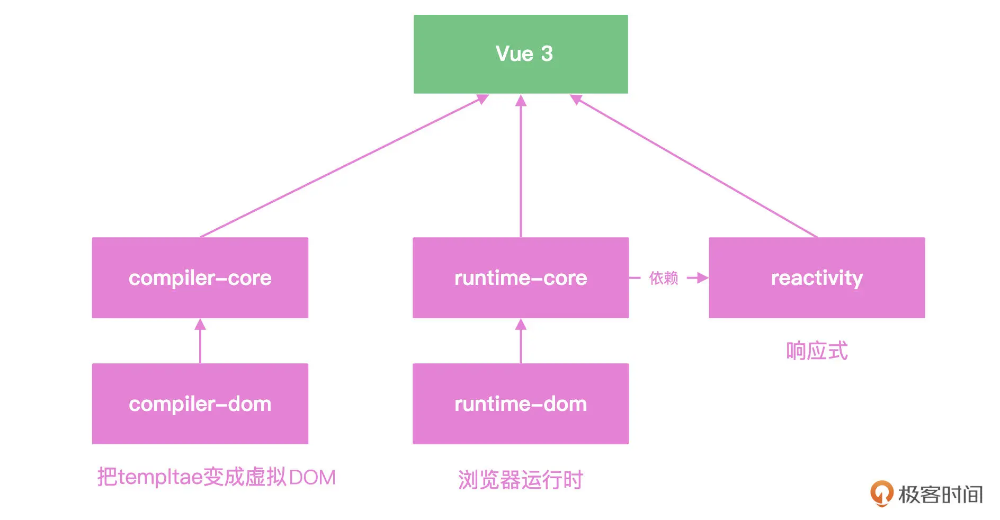
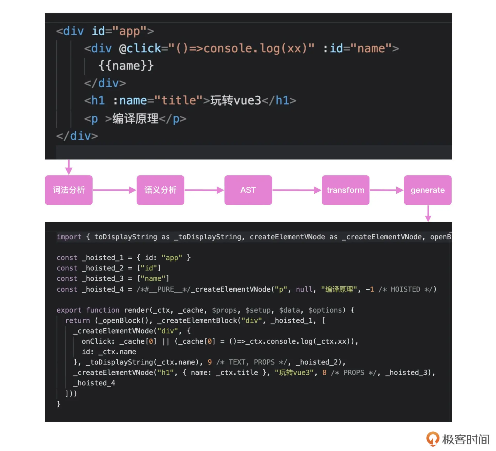
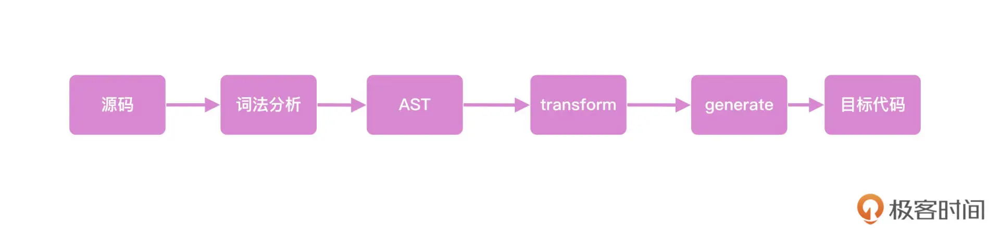

## 编译原理（上）-手写一个迷你Vue3 Compiler的入门原理

在Vue中，组件都是以虚拟DOM的形式存在，加载完毕之后注册effect函数。这样组件内部的数据变化之后，用Vue的响应式机制做到了通知组件更新，内部则使用patch函数实现了虚拟DOM的更新；使用了位运算、最长递增子序列等算法。

虚拟DOM是从哪来的？我们明明写的是template和JSX，这也是吃透Vue源码最后一个难点：Vue中的Compiler。

下图是Vue核心模块依赖关系图，reactivity和runtime已经剖析完毕，迷你版本的代码可以在[weiyouyi](https://github.com/shengxinjing/weiyouyi)中看到。



编译原理也属于计算机中的一个重要学科，Vue的compiler是在Vue场景下的实现，目的就是实现template到render函数的转变。

第一步，我们需要先掌握编译原理的基本概念。Vue官方提供了模板编译的[在线演示](https://template-explorer.vuejs.org/#eyJzcmMiOiI8ZGl2IGlkPVwiYXBwXCI+XG4gICAgPGRpdiBAY2xpY2s9XCIoKT0+Y29uc29sZS5sb2coeHgpXCIgOmlkPVwibmFtZVwiPnt7bmFtZX19PC9kaXY+XG4gICAgPGgxIDpuYW1lPVwidGl0bGVcIj7njqnovax2dWUzPC9oMT5cbiAgICA8cCA+57yW6K+R5Y6f55CGPC9wPlxuPC9kaXY+XG4iLCJzc3IiOmZhbHNlLCJvcHRpb25zIjp7ImhvaXN0U3RhdGljIjp0cnVlLCJjYWNoZUhhbmRsZXJzIjp0cnVlLCJvcHRpbWl6ZUJpbmRpbmdzIjpmYWxzZX19)。可以看到左侧代码是我们写的template，右侧代码是通过compiler解析生成的render函数。


### 整体流程

上述转化的过程可以分为下面的示意图几步来实现。

首先，代码会被解析成一个对象，这个对象有点像虚拟DOM的概念，用来描述template的代码关系，这个对象就是抽象语法树（简称AST）。

然后通过transform模块对代码进行优化，比如识别Vue中的语法，静态标记。

最后通过generate模块生成最终的render函数。



理清了流程，就可以动手完成具体代码实现。

用下面的代码就能实现上述流程图里的内容。

其中parse函数负责生成抽象语法树AST，transform函数负责语义转换，generate函数负责最终的代码生成。

```javascript
function compiler(template) {
  const ast = parse(template);
  transform(ast);
  const code = generate(ast);
  return code
}

let template = `<div id="app">
	<div @click="()=>console.log(xx)" :id="name">{{name}}</div>
	<h1 :name="title">玩转Vue3</h1>
	<p>编译原理</p>
</div>
`;

const renderFunction = compiler(template)
console.log(renderFunction);
```


### parse

首先先来看parse函数如何实现。template转成render函数是两种语法的转换，这种代码转换的需求其实在计算机的世界中非常常见。比如常用的Babel，就是把ES6的语法转成低版本浏览器可以执行的代码。

#### tokenizer的迷你实现

首先，我们要对template进行词法分析，把模板中的`<div>`，`@click`，`{{}}`等语法识别出来，转换成一个个的token。可以理解为把template的语法进行了分类，这一步我们叫tokenizer。

以下代码是tokenizer的迷你实现。使用tokens数组存储解析的结果，然后对模板字符串进行循环，在template中，`< > /`和空格都是关键的分隔符。如果碰见`<`字符，我们需要判断下一个字符的状态：如果是字符串就标记tagstart；如果是`/`，就知道是结束标签，标记为tagend。最终通过push方法把分割之后的token存储在数组tokens中返回。

```javascript
// weiyouyi/src/compiler-core/index.js
function tokenizer(input) {
    let tokens = [];
    let type = '';
    let val = '';
    // 粗暴循环
    for (let i = 0; i < input.length; i ++) {
        let ch = input[i];
        if (ch === '<') {
            push();
            if (input [i + 1] === '/') {
                type = 'tagend';
            } else {
                type = 'tagstart';
            }
        } else if (ch === '>') {
            if (input[i - 1] === '=') {
                // 箭头函数
            } else {
                push();
                type = 'text'
                continue
            }
        } else if (/[\s]/.test(ch)) { // 碰见空格截断一下
            push();
            type = 'props'
            continue
        }
        val += ch;
    }
    console.log(tokens)
    return tokens;

    function push() {
        if (val) {
            if (type === 'tagstart') val = val.slice(1) // <div => div
            if (type === 'tagend') val = val.slice(2) // </div => div
            tokens.push({
                type,
                val
            });
            val = '';
        }
    }
}
```

实现了上面的代码，就得到了解析之后的tokens数组。

#### 生成抽象语法树

在tokens数组中，我们分别用tagstart、props、tagend和text标记，标记了全部内容。

下一步，我们需要把这个数组按照标签的嵌套关系转换成树形结构，这样才能完整地描述template标签的关系。

```javascript
[ { type: 'tagstart', val: 'div' },
  { type: 'props', val: 'id="app"' },
  { type: 'tagstart', val: 'div' },
  { type: 'props', val: '@click="()=>console.log(xx)"' },
  { type: 'props', val: ':id="name"' },
  { type: 'text', val: '{{name}}' },
  { type: 'tagend', val: 'div' },
  { type: 'tagstart', val: 'h1' },
  { type: 'props', val: ':name="title"' },
  { type: 'text', val: '玩转Vue3' },
  { type: 'tagend', val: 'h1' },
  { type: 'tagstart', val: 'p' },
  { type: 'text', val: '编译原理' },
  { type: 'tagend', val: 'p' },
  { type: 'tagend', val: 'div' } ]
```

接下来分析tokens数组，看它是如何转化成一个体现语法规则的树形结构的。

就像我们用虚拟DOM描述页面DOM结构一样，我们使用树形结构描述template的语法，这个树我们称之为抽象语法树，简称AST。

下面的代码中，我们用parse函数实现AST的解析。过程是这样的：首先使用一个AST对象作为根节点；然后通过walk函数遍历整个tokens数组，根据token的类型不同，生成不同的node对象；最后根据tagend的状态来决定walk的递归逻辑，最终实现整棵树的构建。

```javascript
// weiyouyi/src/compiler-core/index.js
function parse(template) {
    const tokens = tokenizer(template);
    let cur = 0;
    let ast = {
        type: 'root',
        props: [],
        children: []
    };
    while(cur < tokens.length) {
        ast.children.push(walk());
    }
    return ast;

    function walk() {
        let token = tokens[cur]; // 当前元素
        if (token.type === 'tagstart') {
            let node = {
                type: 'element',
                tag: token.val,
                props: [],
                children: []
            };
            // ++cur 先加1再赋值给表达式；   cur++ 先赋值给表达式再加1
            token = tokens[++cur]; // 获取下一个元素
            while (token.type !== 'tagend') {
                if (token.type === 'props') {
                    node.props.push(walk());
                } else {
                    node.children.push(walk());
                }
                token = tokens[cur];
            }
            cur ++
            return node;
        }
        if (token.type === 'tagend') {
            cur ++;
        }
        if (token.type === 'text') {
            cur ++;
            return token;
        }
        if (token.type === 'props') {
            cur ++;
            const [key, val] = token.val.replace('=', '~').split('~');
            return {
                key,
                val
            }
        }
    }
}
```

上面的代码会生成抽象语法树AST，这个树的结构如下面代码所示，通过type和children描述整个template的结构。

```json
{
  type: 'root',
  props: [],
  children: [
    {
      type: 'element',
      tag: 'div',
      props: [
        {
          key: 'id',
          val: '"app"'
        }
      ],
      children: [
        {
          type: 'element',
          tag: 'div',
          props: [
            {
              key: '@click',
              val: '"()=>console.log(xx)"'
            },
            {
              key: ':id',
              val: '"name"'
            }
          ],
          children: [
            {
              type: 'text',
              val: '{{name}}'
            }
          ]
        },
        {
      		type: 'element',
      		tag: 'h1',
      		props: [
        		{
          		key: ':name',
          		val: '"title"'
        		}
      		],
      		children: [
        		{
          		type: 'text',
          		val: '玩转Vue3'
        		}
      		]
    		},
    		{
      		type: 'element',
     		  tag: 'p',
     		  props: [],
     		  children: [
      		  {
     		     type: 'text',
     		     val: '编译原理'
       		  }
      		]
    		}
      ]
    }  
  ]
}
```


### 语义分析和优化

有了抽象语法树之后，我们还要进行语义的分析和优化，也就是说，我们要在这个阶段理解语句要做的事。下面结合例子来理解。

在template场景下，两个大括号包裹的字符串就是变量，@click就是事件监听。

以下代码中使用transform函数实现这个功能。这一步主要是理解template中Vue的语法，并且为最后生成代码做准备。

我们使用context对象存储AST所需要的上下文，如果我们用到了变量{{}}，就需要引入`toDisplayString`函数，上下文中的helpers存储的就是我们用到的工具函数。

```javascript
// weiyouyi/src/compiler-core/index.js
function transform(ast) {
    // 优化一下ast
    let context = {
        helpers: new Set(['openBlock', 'createVnode']), // 用到的工具函数
    }
    traverse(ast, context);
    ast.helpers = context.helpers;
}
```

使用traverse函数递归整个AST，去优化AST的结构，并在这一步实现简单的静态标记。

当节点标记为element的时候，递归整个AST，内部挨个遍历AST所有的属性，我们默认使用ast.flag标记节点的动态状态：

* 如果属性是@开头的，就认为它是Vue中的事件绑定，使用`arg.flg |= PatchFlags.EVENT`标记当前节点的事件是动态的，需要计算diff；
* 冒号开头的就是动态的属性传递，并且把class和style标记了不同的flag
* 如果都没有命中的话，就使用`static:true`，标记当前节点位是静态节点

```javascript
// weiyouyi/src/compiler-core/index.js
function traverse(ast, context) {
    switch (ast.type) {
        case "root":
            context.helpers.add('createBlock');
        case "element":
            ast.children.forEach(node => {
                traverse(node, context);
            });
            ast.flag = 0;
            ast.props = ast.props.map(prop => {
                const {key, val} = prop;
                if (key[0] === '@') {
                    ast.flag |= PatchFlags.EVENT; // 标记event需要更新
                    return {
                        key: 'on' + key[1].toUpperCase() + key.slice(2),
                        val
                    }
                }
                if (key[0] === ':') {
                    const k = key.slice(1);
                    if (k === 'class') {
                        ast.flag |= PatchFlags.CLASS; // 标记class需要更新
                    } else if (k === 'style') {
                        ast.flag |= PatchFlags.STYLE; // 标记style需要更新
                    } else {
                        ast.flag |= PatchFlags.PROPS; // 标记props需要更新
                    }
                    return {
                        key: key.slice(1),
                        val
                    }
                }
                if (key.startsWith('v-')) {
                    // pass such as v-model
                }
                // 标记static是true 静态节点
                return { ...prop, static: true }
            })
            break;
        case "text":
            // transformText
            let re = /\{\{(.*)\}\}/g;
            if (re.test(ast.val)) {
                // 有{{
                ast.flag |= PatchFlags.TEXT; // 标记text需要更新
                context.helpers.add('toDisplayString');
                ast.val = ast.val.replace(/\{\{(.*)\}\}/g, function (s0,s1) {
                    return s1
                });
            } else {
                ast.static = true;
            }
    }
}
```

经过上面的代码标记优化之后，项目在数据更新之后，浏览器计算虚拟DOM diff运算的时候，就会执行类似下面的代码逻辑。

我们**通过在compiler阶段的标记，让template产出的虚拟DOM有了更精确的状态，可以越过大部分的虚拟DOM的diff计算，极大提高Vue的运行时效率**，这个思想我们日常开发中也可以借鉴学习。

```javascript
if (vnode.static) {
  return
}
if (vnode.flag & PatchFlags.CLASS) {
  // 遍历class计算diff
} else if (vnode.flag & PatchFlags.STYLE) {
  // 计算style的diff
} else if (vnode.flag & PatchFlags.TEXT) {
  // 计算文本的diff
}
```


接下来，我们基于优化之后的AST生成目标代码，也就是generate函数要做的事：遍历整个AST，拼接成最后要执行的函数字符串。

### 生成目标代码

下面的代码中，我们首先把helpers拼接成import语句，并且使用walk函数遍历整个AST，在遍历的过程中收集helpers集合的依赖。最后，在createVnode的最后一个参数带上ast.flag进行状态的标记。

```javascript
// weiyouyi/src/compiler-core/index.js
function generate(ast) {
    const {helpers} = ast;
    let code = `
    import {${[...helpers].map(v => v +' as _'+ v).join(',')}} from 'vue'\n
    export function render(_ctx, _cache, $props) {
        return (_openBlock(), ${ast.children.map(node => walk(node))})
    } 
    `;
    function walk(node) {
        switch(node.type) {
            case 'element':
                let {flag} = node // 编译的标记
                let props = '{' + node.props.reduce((ret, p) => {
                    if (flag.props) {
                        // 动态属性
                        ret.push(p.key + ':_ctx.' + p.val.replace(/['"]/g, ''));
                    } else {
                        ret.push(p.key + ':' + p.val)
                    }
                    return ret;
                }, []).join(',') + '}'
                return `_createVnode("${node.tag}", ${props}, [
                    ${node.children.map(n => walk(n))}
                ], ${JSON.stringify(flag)})`
            case 'text':
                if (node.static) {
                    return '"' + node.val + '"'
                } else {
                    return `_toDisplayString(_ctx.${node.val})`
                }
        }
    }
    return code;
}
```


### 最终实现效果

最后执行以下代码，看下输出的结果。可以看到，它已经和Vue输出的代码很接近了，到此为止，我们实现了一个非常迷你的Vue compiler，这个产出的render函数最终会和组件的setup函数一起组成运行时的组件对象。

```javascript
// weiyouyi/src/compiler-core/index.js
function compiler(template) {
    const ast = parse(template);
    transform(ast);

    const code = generate(ast);
    return code;
}

let template = `<div id="app">
   <div @click="()=>console.log(xx)" :id="name">{{name}}</div>
   <h1 :name="title">玩转Vue3</h1>
   <p >编译原理</p>
</div>
`;

// parse(template);
const renderFunction = compiler(template);
console.log(renderFunction);
```

下面是输出结果

```javascript
import {openBlock as _openBlock,createVnode as _createVnode,createBlock as _createBlock,toDisplayString as _toDisplayString} from 'vue'

    export function render(_ctx, _cache, $props) {
        return (_openBlock(), _createVnode("div", {id:"app"}, [
                    _createVnode("div", {onClick:"()=>console.log(xx)",id:"name"}, [
                    _toDisplayString(_ctx.name)
                ], 24),_createVnode("h1", {name:"title"}, [
                    "玩转Vue3"
                ], 8),_createVnode("p", {}, [
                    "编译原理"
                ], 0)
                ], 0))
    }
```


### 总结

手写一个非常迷你的Vue compiler，这也是我们学习框架源码的时候一个比较常见的思路：在去看实际的源码之前，先通过迷你版本的实现，熟悉整个Vue compiler工作的主体流程。



通过这个迷你的compiler，我们学习了编译原理的入门知识，包括：parser的实现、AST是什么、AST的语义化优化和代码生成generate模块，这给弄清楚Vue compiler的核心逻辑打下了良好的理论基础。

这里提醒你注意一个优化方法，此处实现的迷你compiler也实现了属性的静态标记，通过在编译期间的标记方式，让虚拟DOM在运行时有更多的状态，从而能够精确地控制更新。这种编译时的优化也能够对我们项目开发有很多指引作用。
