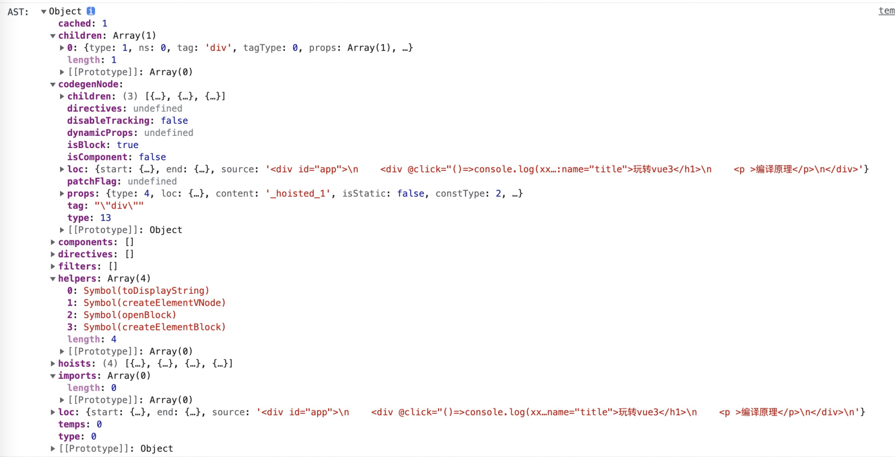
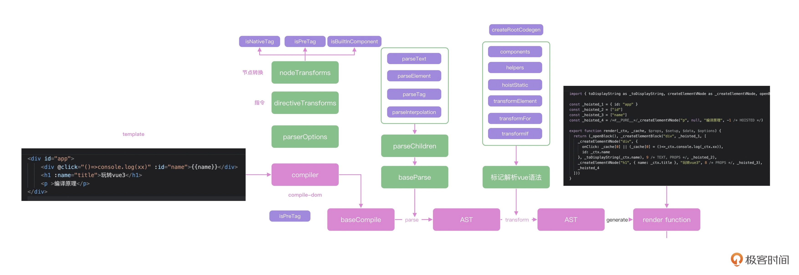

## 编译原理（中）：Vue Compiler模板全解析

有了编译原理的入门基础，你会对Compiler执行全流程有更深的理解。

### Vue compiler入口分析

Vue3内部有4个与compiler相关的包：

* compiler-dom和compiler-core负责实现浏览器端的编译，需要深入研究
* compiler-ssr负责服务器端渲染
* compiler-sfc是编译.vue单文件组件的

首先进入[`vuejs/core/packages/compiler-dom/src/index.ts`](https://github.com/vuejs/core/blob/main/packages/compiler-dom/src/index.ts#L40)文件，可以找到以下这段代码。

```javascript
// core/packages/compiler-dom/src/index.ts
export function compile(
  template: string,
  options: CompilerOptions = {}
): CodegenResult {
  return baseCompile(
    template,
    extend({}, parserOptions, options, {
      nodeTransforms: [
        // ignore <script> and <tag>
        // this is not put inside DOMNodeTransforms because that list is used
        // by compiler-ssr to generate vnode fallback branches
        ignoreSideEffectTags,
        ...DOMNodeTransforms,
        ...(options.nodeTransforms || [])
      ],
      directiveTransforms: extend(
        {},
        DOMDirectiveTransforms,
        options.directiveTransforms || {}
      ),
      transformHoist: __BROWSER__ ? null : stringifyStatic
    })
  )
}
```

compile函数有两个参数：第一个参数template，是项目中的模板字符串；第二个参数options是编译的配置。函数内部调用了baseCompile函数。可以看到，这里的调用关系和runtime-dom、runtime-core的关系类似，compiler-dom负责传入浏览器DOM相关的API，实际编译的baseCompile是由compiler-core提供的。

**先来看compiler-dom做了哪些额外的配置。**

首先，parserOptions传入了parse的配置，通过parserOptions传递的`isNativeTag`来区分element和component。这里的实现也非常简单：把所有html的标签名存储在一个对象中，然后就可以很轻松地判断出div是浏览器自带的element。

```javascript
// core/packages/compiler-dom/src/parserOptions.ts
export const parserOptions: ParserOptions = {
  isVoidTag,
  isNativeTag: tag => isHTMLTag(tag) || isSVGTag(tag),
  isPreTag: tag => tag === 'pre',
  decodeEntities: __BROWSER__ ? decodeHtmlBrowser : decodeHtml,

  isBuiltInComponent: (tag: string): symbol | undefined => {
    if (isBuiltInType(tag, `Transition`)) {
      return TRANSITION
    } else if (isBuiltInType(tag, `TransitionGroup`)) {
      return TRANSITION_GROUP
    }
  },

  // ...
}

// core/packages/shared/src/domTagConfig.ts
// https://developer.mozilla.org/en-US/docs/Web/HTML/Element
const HTML_TAGS =
  'html,body,base,head,link,meta,style,title,address,article,aside,footer,' +
  'header,hgroup,h1,h2,h3,h4,h5,h6,nav,section,div,dd,dl,dt,figcaption,' +
  'figure,picture,hr,img,li,main,ol,p,pre,ul,a,b,abbr,bdi,bdo,br,cite,code,' +
  'data,dfn,em,i,kbd,mark,q,rp,rt,ruby,s,samp,small,span,strong,sub,sup,' +
  'time,u,var,wbr,area,audio,map,track,video,embed,object,param,source,' +
  'canvas,script,noscript,del,ins,caption,col,colgroup,table,thead,tbody,td,' +
  'th,tr,button,datalist,fieldset,form,input,label,legend,meter,optgroup,' +
  'option,output,progress,select,textarea,details,dialog,menu,' +
  'summary,template,blockquote,iframe,tfoot'
// ...
/**
 * Compiler only.
 * Do NOT use in runtime code paths unless behind `__DEV__` flag.
 */
export const isHTMLTag = /*#__PURE__*/ makeMap(HTML_TAGS)
```

baseCompile传递的其他参数`nodeTransforms`和`directiveTransforms`，它们做的也是和上面代码类似的事。


### Vue浏览器端编译的核心流程

#### baseCompile

然后，进入baseCompile函数，这就是Vue浏览器端编译的核心流程。

从以下代码中可以很清楚地看到，我们先通过baseParse把传递的template解析成AST，然后通过transform函数对AST进行语义化分析，最后通过generate函数生成代码。

```javascript
// core/packages/compiler-core/src/compile.ts
// we name it `baseCompile` so that higher order compilers like
// @vue/compiler-dom can export `compile` while re-exporting everything else.
export function baseCompile(
  template: string | RootNode,
  options: CompilerOptions = {}
): CodegenResult {
  const onError = options.onError || defaultOnError
  const isModuleMode = options.mode === 'module'
  /* istanbul ignore if */
  if (__BROWSER__) {
    if (options.prefixIdentifiers === true) {
      onError(createCompilerError(ErrorCodes.X_PREFIX_ID_NOT_SUPPORTED))
    } else if (isModuleMode) {
      onError(createCompilerError(ErrorCodes.X_MODULE_MODE_NOT_SUPPORTED))
    }
  }

  const prefixIdentifiers =
    !__BROWSER__ && (options.prefixIdentifiers === true || isModuleMode)
  if (!prefixIdentifiers && options.cacheHandlers) {
    onError(createCompilerError(ErrorCodes.X_CACHE_HANDLER_NOT_SUPPORTED))
  }
  if (options.scopeId && !isModuleMode) {
    onError(createCompilerError(ErrorCodes.X_SCOPE_ID_NOT_SUPPORTED))
  }

  const ast = isString(template) ? baseParse(template, options) : template
  const [nodeTransforms, directiveTransforms] =
    getBaseTransformPreset(prefixIdentifiers)

  if (!__BROWSER__ && options.isTS) {
    const { expressionPlugins } = options
    if (!expressionPlugins || !expressionPlugins.includes('typescript')) {
      options.expressionPlugins = [...(expressionPlugins || []), 'typescript']
    }
  }

  transform(
    ast,
    extend({}, options, {
      prefixIdentifiers,
      nodeTransforms: [
        ...nodeTransforms,
        ...(options.nodeTransforms || []) // user transforms
      ],
      directiveTransforms: extend(
        {},
        directiveTransforms,
        options.directiveTransforms || {} // user transforms
      )
    })
  )

  return generate(
    ast,
    extend({}, options, {
      prefixIdentifiers
    })
  )
}
```

主要逻辑和之前写的迷你compiler基本一致。至此可以体会到，手写一个迷你版本对阅读源码很有帮助。

接下来，就进入到这几个函数中，看一下跟迷你compiler相比，做了哪些优化。

在之前提到的Vue的在线模板编译环境，可以在console中看到Vue解析得到的AST。如下图所示，这个AST比迷你版多了很多额外的属性：loc用来描述节点对应代码的信息，component和directive用来记录代码中出现的组件和指令等等。



#### baseParse

在`baseParse`函数中，createParserContext和createRoot用来生成上下文，其实就是创建了一个对象，保存当前parse函数中需要共享的数据和变量，最后调用parseChildren。

```javascript
// core/packages/compiler-core/src/parse.ts
export function baseParse(
  content: string,
  options: ParserOptions = {}
): RootNode {
  const context = createParserContext(content, options)
  const start = getCursor(context)
  return createRoot(
    parseChildren(context, TextModes.DATA, []),
    getSelection(context, start)
  )
}
```

#### parseChildren

parseChildren内部开始判断`<`开头的标识符，判断是开始还是闭合标签后，接着会生成一个nodes数组。其中advanceBy函数负责更新context中的source用来向前遍历代码，最终对不同的场景执行不同的函数。

```javascript
// core/packages/compiler-core/src/parse.ts
function parseChildren(
  context: ParserContext,
  mode: TextModes,
  ancestors: ElementNode[]
): TemplateChildNode[] {
  const parent = last(ancestors)
  const ns = parent ? parent.ns : Namespaces.HTML
  // 依次生成node
  const nodes: TemplateChildNode[] = []
  // 判断context是否已遍历完
  while (!isEnd(context, mode, ancestors)) {
    __TEST__ && assert(context.source.length > 0)
    const s = context.source
    let node: TemplateChildNode | TemplateChildNode[] | undefined = undefined

    if (mode === TextModes.DATA || mode === TextModes.RCDATA) {
      if (!context.inVPre && startsWith(s, context.options.delimiters[0])) {
        // 处理Vue的变量标识符，两个花括号'{{'
        node = parseInterpolation(context, mode)
      } else if (mode === TextModes.DATA && s[0] === '<') {
        // 处理<开头的代码：可能是<div>也有可能是</div>或者<!的注释
        // https://html.spec.whatwg.org/multipage/parsing.html#tag-open-state
        if (s.length === 1) {
          // 长度是1，只有一个<，有问题 ==>报错
          emitError(context, ErrorCodes.EOF_BEFORE_TAG_NAME, 1)
        } else if (s[1] === '!') {
          // html注释
          // https://html.spec.whatwg.org/multipage/parsing.html#markup-declaration-open-state
          if (startsWith(s, '<!--')) {
            node = parseComment(context)
          } else if (startsWith(s, '<!DOCTYPE')) {
            // Ignore DOCTYPE by a limitation.
            node = parseBogusComment(context)
          } else if (startsWith(s, '<![CDATA[')) {
            if (ns !== Namespaces.HTML) {
              node = parseCDATA(context, ancestors)
            } else {
              emitError(context, ErrorCodes.CDATA_IN_HTML_CONTENT)
              node = parseBogusComment(context)
            }
          } else {
            emitError(context, ErrorCodes.INCORRECTLY_OPENED_COMMENT)
            node = parseBogusComment(context)
          }
        } else if (s[1] === '/') {
          // </开头 ==>结束标签
          // https://html.spec.whatwg.org/multipage/parsing.html#end-tag-open-state
          if (s.length === 2) {
            // 长度是2，只有一个</，有问题 ==>报错
            emitError(context, ErrorCodes.EOF_BEFORE_TAG_NAME, 2)
          } else if (s[2] === '>') {
            // </> ==> 报错
            emitError(context, ErrorCodes.MISSING_END_TAG_NAME, 2)
            advanceBy(context, 3)
            continue
          } else if (/[a-z]/i.test(s[2])) {
            emitError(context, ErrorCodes.X_INVALID_END_TAG)
            parseTag(context, TagType.End, parent) // 结束标签：解析tag
            continue
          } else {
            emitError(
              context,
              ErrorCodes.INVALID_FIRST_CHARACTER_OF_TAG_NAME,
              2
            )
            node = parseBogusComment(context)
          }
        } else if (/[a-z]/i.test(s[1])) {
          // 解析节点
          node = parseElement(context, ancestors) // 开始标签：解析元素

          // 2.x <template> with no directive compat
          if (
            __COMPAT__ &&
            isCompatEnabled(
              CompilerDeprecationTypes.COMPILER_NATIVE_TEMPLATE,
              context
            ) &&
            node &&
            node.tag === 'template' &&
            !node.props.some(
              p =>
                p.type === NodeTypes.DIRECTIVE &&
                isSpecialTemplateDirective(p.name)
            )
          ) {
            __DEV__ &&
              warnDeprecation(
                CompilerDeprecationTypes.COMPILER_NATIVE_TEMPLATE,
                context,
                node.loc
              )
            node = node.children
          }
        } else if (s[1] === '?') {
          emitError(
            context,
            ErrorCodes.UNEXPECTED_QUESTION_MARK_INSTEAD_OF_TAG_NAME,
            1
          )
          node = parseBogusComment(context)
        } else {
          emitError(context, ErrorCodes.INVALID_FIRST_CHARACTER_OF_TAG_NAME, 1)
        }
      }
    }
    if (!node) {
      // 文本
      node = parseText(context, mode)
    }

    // node数组，遍历push
    if (isArray(node)) {
      for (let i = 0; i < node.length; i++) {
        pushNode(nodes, node[i])
      }
    } else {
      pushNode(nodes, node)
    }
  }

  // Whitespace handling strategy like v2
  let removedWhitespace = false
  // ...

  return removedWhitespace ? nodes.filter(Boolean) : nodes
}
```

##### parseInterpolation, parseText

parseInterpolation和parseText函数的逻辑比较简单。

* parseInterpolation负责识别变量的分隔符`{{`和`}}`，然后通过`parseTextData`获取变量的值，并且通过innerStart和innerEnd去记录插值的位置

  ```javascript
  // core/packages/compiler-core/src/parse.ts
  function parseInterpolation(
    context: ParserContext,
    mode: TextModes
  ): InterpolationNode | undefined {
    const [open, close] = context.options.delimiters
    __TEST__ && assert(startsWith(context.source, open))
  
    const closeIndex = context.source.indexOf(close, open.length)
    if (closeIndex === -1) {
      emitError(context, ErrorCodes.X_MISSING_INTERPOLATION_END)
      return undefined
    }
  
    const start = getCursor(context)
    advanceBy(context, open.length)
    const innerStart = getCursor(context)
    const innerEnd = getCursor(context)
    const rawContentLength = closeIndex - open.length
    const rawContent = context.source.slice(0, rawContentLength)
    const preTrimContent = parseTextData(context, rawContentLength, mode)
    const content = preTrimContent.trim()
    const startOffset = preTrimContent.indexOf(content)
    if (startOffset > 0) {
      advancePositionWithMutation(innerStart, rawContent, startOffset)
    }
    const endOffset =
      rawContentLength - (preTrimContent.length - content.length - startOffset)
    advancePositionWithMutation(innerEnd, rawContent, endOffset)
    advanceBy(context, close.length)
  
    return {
      type: NodeTypes.INTERPOLATION,
      content: {
        type: NodeTypes.SIMPLE_EXPRESSION,
        isStatic: false,
        // Set `isConstant` to false by default and will decide in transformExpression
        constType: ConstantTypes.NOT_CONSTANT,
        content,
        loc: getSelection(context, innerStart, innerEnd)
      },
      loc: getSelection(context, start)
    }
  }
  ```

* parseText负责处理模板中的普通文本，主要把文本包裹成AST对象。

  ```javascript
  // core/packages/compiler-core/src/parse.ts
  function parseText(context: ParserContext, mode: TextModes): TextNode {
    __TEST__ && assert(context.source.length > 0)
  
    const endTokens =
      mode === TextModes.CDATA ? [']]>'] : ['<', context.options.delimiters[0]]
  
    let endIndex = context.source.length
    for (let i = 0; i < endTokens.length; i++) {
      const index = context.source.indexOf(endTokens[i], 1)
      if (index !== -1 && endIndex > index) {
        endIndex = index
      }
    }
  
    __TEST__ && assert(endIndex > 0)
  
    const start = getCursor(context)
    const content = parseTextData(context, endIndex, mode)
  
    return {
      type: NodeTypes.TEXT,
      content,
      loc: getSelection(context, start)
    }
  }
  ```

##### parseElement

接着看**处理节点的parseElement函数**都做了什么。

首先判断pre和v-pre标签，然后通过isVoidTag判断标签是否是自闭合标签，这个函数是从compiler-dom中传来的，之后会递归调用parseChildren，接着再解析开始标签、解析子节点，最后解析结束标签。

```javascript
// core/packages/shared/src/domTagConfig.ts
const VOID_TAGS =
  'area,base,br,col,embed,hr,img,input,link,meta,param,source,track,wbr'
/**
 * Compiler only.
 * Do NOT use in runtime code paths unless behind `__DEV__` flag.
 */
export const isVoidTag = /*#__PURE__*/ makeMap(VOID_TAGS)

// core/packages/compiler-core/src/parse.ts
function parseElement(
  context: ParserContext,
  ancestors: ElementNode[]
): ElementNode | undefined {
  __TEST__ && assert(/^<[a-z]/i.test(context.source))

  // Start tag.
  // 是不是pre标签和v-pre标签
  const wasInPre = context.inPre
  const wasInVPre = context.inVPre
  const parent = last(ancestors)
  // 解析标签节点
  const element = parseTag(context, TagType.Start, parent)
  const isPreBoundary = context.inPre && !wasInPre
  const isVPreBoundary = context.inVPre && !wasInVPre

  if (element.isSelfClosing || context.options.isVoidTag(element.tag)) {
    // #4030 self-closing <pre> tag
    if (isPreBoundary) {
      context.inPre = false
    }
    if (isVPreBoundary) {
      context.inVPre = false
    }
    return element
  }

  // Children.
  ancestors.push(element)
  const mode = context.options.getTextMode(element, parent)
  const children = parseChildren(context, mode, ancestors)
  ancestors.pop()

  // 2.x inline-template compat
  if (__COMPAT__) {
    const inlineTemplateProp = element.props.find(
      p => p.type === NodeTypes.ATTRIBUTE && p.name === 'inline-template'
    ) as AttributeNode
    if (
      inlineTemplateProp &&
      checkCompatEnabled(
        CompilerDeprecationTypes.COMPILER_INLINE_TEMPLATE,
        context,
        inlineTemplateProp.loc
      )
    ) {
      const loc = getSelection(context, element.loc.end)
      inlineTemplateProp.value = {
        type: NodeTypes.TEXT,
        content: loc.source,
        loc
      }
    }
  }

  element.children = children

  // End tag.
  if (startsWithEndTagOpen(context.source, element.tag)) {
    parseTag(context, TagType.End, parent)
  } else {
    emitError(context, ErrorCodes.X_MISSING_END_TAG, 0, element.loc.start)
    if (context.source.length === 0 && element.tag.toLowerCase() === 'script') {
      const first = children[0]
      if (first && startsWith(first.loc.source, '<!--')) {
        emitError(context, ErrorCodes.EOF_IN_SCRIPT_HTML_COMMENT_LIKE_TEXT)
      }
    }
  }

  element.loc = getSelection(context, element.loc.start)

  if (isPreBoundary) {
    context.inPre = false
  }
  if (isVPreBoundary) {
    context.inVPre = false
  }
  return element
}
```

##### parseTag

最后来看**解析节点的parseTag函数**的逻辑，匹配文本标签结束的位置后，先通过parseAttributes函数处理属性，然后对pre和v-pre标签进行检查，最后通过isComponent函数判断是否为组件。

```javascript
// core/packages/compiler-core/src/parse.ts
/**
 * Parse a tag (E.g. `<div id=a>`) with that type (start tag or end tag).
 */
function parseTag(
  context: ParserContext,
  type: TagType.Start,
  parent: ElementNode | undefined
): ElementNode
function parseTag(
  context: ParserContext,
  type: TagType.End,
  parent: ElementNode | undefined
): void
function parseTag(
  context: ParserContext,
  type: TagType,
  parent: ElementNode | undefined
): ElementNode | undefined {
  __TEST__ && assert(/^<\/?[a-z]/i.test(context.source))
  __TEST__ &&
    assert(
      type === (startsWith(context.source, '</') ? TagType.End : TagType.Start)
    )

  // Tag open.
  const start = getCursor(context)
  // 匹配标签结束的位置
  const match = /^<\/?([a-z][^\t\r\n\f />]*)/i.exec(context.source)!
  const tag = match[1]
  const ns = context.options.getNamespace(tag, parent)

  advanceBy(context, match[0].length)
  advanceSpaces(context)

  // save current state in case we need to re-parse attributes with v-pre
  const cursor = getCursor(context)
  const currentSource = context.source

  // check <pre> tag
  if (context.options.isPreTag(tag)) {
    context.inPre = true
  }

  // Attributes.
  let props = parseAttributes(context, type)

  // check v-pre
  if (
    type === TagType.Start &&
    !context.inVPre &&
    props.some(p => p.type === NodeTypes.DIRECTIVE && p.name === 'pre')
  ) {
    context.inVPre = true
    // reset context
    extend(context, cursor)
    context.source = currentSource
    // re-parse attrs and filter out v-pre itself
    props = parseAttributes(context, type).filter(p => p.name !== 'v-pre')
  }

  // Tag close.
  let isSelfClosing = false
  if (context.source.length === 0) {
    emitError(context, ErrorCodes.EOF_IN_TAG)
  } else {
    isSelfClosing = startsWith(context.source, '/>')
    if (type === TagType.End && isSelfClosing) {
      emitError(context, ErrorCodes.END_TAG_WITH_TRAILING_SOLIDUS)
    }
    advanceBy(context, isSelfClosing ? 2 : 1)
  }

  if (type === TagType.End) {
    return
  }

  // 2.x deprecation checks
  // ...

  let tagType = ElementTypes.ELEMENT
  if (!context.inVPre) {
    if (tag === 'slot') {
      tagType = ElementTypes.SLOT
    } else if (tag === 'template') {
      if (
        props.some(
          p =>
            p.type === NodeTypes.DIRECTIVE && isSpecialTemplateDirective(p.name)
        )
      ) {
        tagType = ElementTypes.TEMPLATE
      }
    } else if (isComponent(tag, props, context)) {
      tagType = ElementTypes.COMPONENT
    }
  }

  return {
    type: NodeTypes.ELEMENT,
    ns,
    tag,
    tagType,
    props,
    isSelfClosing,
    children: [],
    loc: getSelection(context, start),
    codegenNode: undefined // to be created during transform phase
  }
}
```

`isComponent`内部会通过compiler-dom传递的isNativeTag来辅助判断结果。

函数最终返回一个描述节点的对象，包含当前节点所有解析之后的信息，tag表示标签名，children表示子节点的数组。

parse函数生成AST之后，我们就有了一个完整描述template的对象，它包含了template中所有的信息。


### AST的语义化分析

下一步对AST进行语义化的分析。transform函数的执行流程分支很多，核心的逻辑就是识别一个个的Vue语法，并且进行编译器的优化，我们经常提到的静态标记就是这一步完成的。

#### transform

进入到transform函数中可以看到，其内部通过createTransformContext创建上下文对象`TransformContext`，这个对象包含当前分析的属性配置，包括是否ssr，是否静态提升，还有工具函数等等，这个对象的属性可以在[github](https://github.com/vuejs/core/blob/main/packages/compiler-core/src/transform.ts#L85)上看到。

```javascript
// core/packages/compiler-core/src/transform.ts
export function transform(root: RootNode, options: TransformOptions) {
  const context = createTransformContext(root, options)
  traverseNode(root, context)
  if (options.hoistStatic) {
    hoistStatic(root, context)
  }
  if (!options.ssr) {
    createRootCodegen(root, context)
  }
  // finalize meta information
  root.helpers = new Set([...context.helpers.keys()])
  root.components = [...context.components]
  root.directives = [...context.directives]
  root.imports = context.imports
  root.hoists = context.hoists
  root.temps = context.temps
  root.cached = context.cached

  if (__COMPAT__) {
    root.filters = [...context.filters!]
  }
}
```

#### traverseNode

通过traverseNode即可编译AST所有的节点。核心的转换流程是在遍历中实现，内部使用switch判断node.type执行不同的处理逻辑：比如如果是Interpolation，就需要在helper中导入toDisplayString工具函数，这个迷你版本中也实现过。

```javascript
// core/packages/compiler-core/src/transform.ts
export function traverseNode(
  node: RootNode | TemplateChildNode,
  context: TransformContext
) {
  context.currentNode = node
  // apply transform plugins
  const { nodeTransforms } = context
  const exitFns = []
  for (let i = 0; i < nodeTransforms.length; i++) {
    const onExit = nodeTransforms[i](node, context)
    if (onExit) {
      if (isArray(onExit)) {
        exitFns.push(...onExit)
      } else {
        exitFns.push(onExit)
      }
    }
    if (!context.currentNode) {
      // node was removed
      return
    } else {
      // node may have been replaced
      node = context.currentNode
    }
  }

  switch (node.type) {
    case NodeTypes.COMMENT:
      if (!context.ssr) {
        // inject import for the Comment symbol, which is needed for creating
        // comment nodes with `createVNode`
        context.helper(CREATE_COMMENT)
      }
      break
    case NodeTypes.INTERPOLATION:
      // no need to traverse, but we need to inject toString helper
      if (!context.ssr) {
        context.helper(TO_DISPLAY_STRING)
      }
      break

    // for container types, further traverse downwards
    case NodeTypes.IF:
      for (let i = 0; i < node.branches.length; i++) {
        traverseNode(node.branches[i], context)
      }
      break
    case NodeTypes.IF_BRANCH:
    case NodeTypes.FOR:
    case NodeTypes.ELEMENT:
    case NodeTypes.ROOT:
      traverseChildren(node, context)
      break
  }

  // exit transforms
  context.currentNode = node
  let i = exitFns.length
  while (i--) {
    exitFns[i]()
  }
}
```

transform中还会调用transformElement来转换节点，用来处理props和children的静态标记，transformText用来转换文本，这里的代码比较简单，可以直接在[github]上查阅：[transformText](https://github.com/vuejs/core/blob/main/packages/compiler-core/src/transforms/transformText.ts)，[transformElement](https://github.com/vuejs/core/blob/main/packages/compiler-core/src/transforms/transformElement.ts)。

transform函数参数中options的nodeTransforms和directiveTransforms传递了Vue中template语法的配置，这两个函数由getBaseTransformPreset返回（baseCompile中调用）。

#### getBaseTransformPreset

```javascript
// core/packages/compiler-core/src/compile.ts
export function getBaseTransformPreset(
  prefixIdentifiers?: boolean
): TransformPreset {
  return [
    [
      transformOnce,
      transformIf,
      transformMemo,
      transformFor,
      ...(__COMPAT__ ? [transformFilter] : []),
      ...(!__BROWSER__ && prefixIdentifiers
        ? [
            // order is important
            trackVForSlotScopes,
            transformExpression
          ]
        : __BROWSER__ && __DEV__
        ? [transformExpression]
        : []),
      transformSlotOutlet,
      transformElement,
      trackSlotScopes,
      transformText
    ],
    {
      on: transformOn,
      bind: transformBind,
      model: transformModel
    }
  ]
}
```

上面的代码中，`transformIf`和`transformFor`函数解析Vue中v-if和v-for的语法转换，`transformOn`和`transformModel`是解析v-on和v-model的语法，这里我们只关注v-开头的语法。

#### transformIf

来看`transformIf`函数的实现。首先判断v-if、v-else和v-else-if属性，内部通过`createCodegenNodeForBranch`来创建条件分支，在AST中标记当前v-if的处理逻辑。这段逻辑标记结束后，在generate中就会把v-if标签和后面的v-else标签解析成三元表达式。

```javascript
// core/packages/compiler-core/src/transforms/vIf.ts
export const transformIf = createStructuralDirectiveTransform(
  /^(if|else|else-if)$/,
  (node, dir, context) => {
    return processIf(node, dir, context, (ifNode, branch, isRoot) => {
      // #1587: We need to dynamically increment the key based on the current
      // node's sibling nodes, since chained v-if/else branches are
      // rendered at the same depth
      const siblings = context.parent!.children
      let i = siblings.indexOf(ifNode)
      let key = 0
      while (i-- >= 0) {
        const sibling = siblings[i]
        if (sibling && sibling.type === NodeTypes.IF) {
          key += sibling.branches.length
        }
      }

      // Exit callback. Complete the codegenNode when all children have been
      // transformed.
      return () => {
        if (isRoot) {
          ifNode.codegenNode = createCodegenNodeForBranch(
            branch,
            key,
            context
          ) as IfConditionalExpression
        } else {
          // attach this branch's codegen node to the v-if root.
          const parentCondition = getParentCondition(ifNode.codegenNode!)
          parentCondition.alternate = createCodegenNodeForBranch(
            branch,
            key + ifNode.branches.length - 1,
            context
          )
        }
      }
    })
  }
)
```

transform对AST分析结束之后，我们就得到了一个优化后的AST对象，最后我们需要调用generate函数最终生成render函数。


### template到render函数的转化

结合下面的代码我们可以看到，generate首先通过`createCodegenContext`创建上下文对象，然后通过`genModulePreamble`生成预先定义好的代码模板，然后生成render函数，最后生成创建虚拟DOM的表达式。

#### generate

```javascript
// core/packages.compiler-core/src/codegen.ts
export function generate(
  ast: RootNode,
  options: CodegenOptions & {
    onContextCreated?: (context: CodegenContext) => void
  } = {}
): CodegenResult {
  const context = createCodegenContext(ast, options)
  if (options.onContextCreated) options.onContextCreated(context)
  const {
    mode,
    push,
    prefixIdentifiers,
    indent,
    deindent,
    newline,
    scopeId,
    ssr
  } = context

  const helpers = Array.from(ast.helpers)
  const hasHelpers = helpers.length > 0
  const useWithBlock = !prefixIdentifiers && mode !== 'module'
  const genScopeId = !__BROWSER__ && scopeId != null && mode === 'module'
  const isSetupInlined = !__BROWSER__ && !!options.inline

  // preambles
  // in setup() inline mode, the preamble is generated in a sub context
  // and returned separately.
  const preambleContext = isSetupInlined
    ? createCodegenContext(ast, options)
    : context
  if (!__BROWSER__ && mode === 'module') {
    // 预设代码，module风格，就是import语句
    genModulePreamble(ast, preambleContext, genScopeId, isSetupInlined)
  } else {
    // 预设代码，函数风格
    genFunctionPreamble(ast, preambleContext)
  }
  // render或是sseRender
  // enter render function
  const functionName = ssr ? `ssrRender` : `render`
  const args = ssr ? ['_ctx', '_push', '_parent', '_attrs'] : ['_ctx', '_cache']
  if (!__BROWSER__ && options.bindingMetadata && !options.inline) {
    // binding optimization args
    args.push('$props', '$setup', '$data', '$options')
  }
  const signature =
    !__BROWSER__ && options.isTS
      ? args.map(arg => `${arg}: any`).join(',')
      : args.join(', ')

  if (isSetupInlined) {
    push(`(${signature}) => {`)
  } else {
    push(`function ${functionName}(${signature}) {`) // functionName是render，即生成render函数字符串
  }
  indent()

  if (useWithBlock) {
    push(`with (_ctx) {`)
    indent()
    // function mode const declarations should be inside with block
    // also they should be renamed to avoid collision with user properties
    if (hasHelpers) {
      push(`const { ${helpers.map(aliasHelper).join(', ')} } = _Vue`)
      push(`\n`)
      newline()
    }
  }

  // 组件和指令 声明代码
  // generate asset resolution statements
  if (ast.components.length) {
    genAssets(ast.components, 'component', context)
    if (ast.directives.length || ast.temps > 0) {
      newline()
    }
  }
  if (ast.directives.length) {
    genAssets(ast.directives, 'directive', context)
    if (ast.temps > 0) {
      newline()
    }
  }
  if (__COMPAT__ && ast.filters && ast.filters.length) {
    newline()
    genAssets(ast.filters, 'filter', context)
    newline()
  }

  if (ast.temps > 0) {
    push(`let `)
    for (let i = 0; i < ast.temps; i++) {
      push(`${i > 0 ? `, ` : ``}_temp${i}`)
    }
  }
  if (ast.components.length || ast.directives.length || ast.temps) {
    push(`\n`)
    newline()
  }

  // generate the VNode tree expression
  if (!ssr) {
    push(`return `)
  }
  if (ast.codegenNode) {
    genNode(ast.codegenNode, context)
  } else {
    push(`null`)
  }

  if (useWithBlock) {
    deindent()
    push(`}`)
  }

  deindent()
  push(`}`)

  return {
    ast,
    code: context.code,
    preamble: isSetupInlined ? preambleContext.code : ``,
    // SourceMapGenerator does have toJSON() method but it's not in the types
    map: context.map ? (context.map as any).toJSON() : undefined
  }
}
```

##### genModulePreamble

来看关键的步骤，genModulePreamble函数生成import风格的代码，这也是我们迷你版本中的功能：通过遍历helpers，生成import字符串，这对应了代码的第二行。

```javascript
// 生成这个 // import { toDisplayString as _toDisplayString, createElementVNode as _createElementVNode, openBlock as _openBlock, createElementBlock as _createElementBlock } from "vue"

// core/packages/compiler-core/src/codegen.ts
function genModulePreamble(
  ast: RootNode,
  context: CodegenContext,
  genScopeId: boolean,
  inline?: boolean
) {
  const {
    push,
    newline,
    optimizeImports,
    runtimeModuleName,
    ssrRuntimeModuleName
  } = context

  if (genScopeId && ast.hoists.length) {
    ast.helpers.add(PUSH_SCOPE_ID)
    ast.helpers.add(POP_SCOPE_ID)
  }

  // generate import statements for helpers
  if (ast.helpers.size) {
    const helpers = Array.from(ast.helpers)
    if (optimizeImports) {
      // when bundled with webpack with code-split, calling an import binding
      // as a function leads to it being wrapped with `Object(a.b)` or `(0,a.b)`,
      // incurring both payload size increase and potential perf overhead.
      // therefore we assign the imports to variables (which is a constant ~50b
      // cost per-component instead of scaling with template size)
      push(
        `import { ${helpers
          .map(s => helperNameMap[s])
          .join(', ')} } from ${JSON.stringify(runtimeModuleName)}\n`
      )
      push(
        `\n// Binding optimization for webpack code-split\nconst ${helpers
          .map(s => `_${helperNameMap[s]} = ${helperNameMap[s]}`)
          .join(', ')}\n`
      )
    } else {
      push(
        `import { ${helpers
          .map(s => `${helperNameMap[s]} as _${helperNameMap[s]}`)
          .join(', ')} } from ${JSON.stringify(runtimeModuleName)}\n`
      )
    }
  }

  if (ast.ssrHelpers && ast.ssrHelpers.length) {
    push(
      `import { ${ast.ssrHelpers
        .map(s => `${helperNameMap[s]} as _${helperNameMap[s]}`)
        .join(', ')} } from "${ssrRuntimeModuleName}"\n`
    )
  }

  if (ast.imports.length) {
    genImports(ast.imports, context)
    newline()
  }

  genHoists(ast.hoists, context)
  newline()

  if (!inline) {
    push(`export `)
  }
}
```

##### genAsset

接下来的步骤就是生成渲染函数render和component、directive、filter等的代码。

##### genNode

最后通过genNode生成创建虚拟DOM的代码，执行switch语句生成不同的代码，一共有十几种情况，这里就不一一赘述了。可以回顾上一讲中迷你代码的逻辑，总之针对变量、标签、v-if和v-for都有不同的代码生成逻辑，最终才实现了template到render函数的转化。

```javascript
// core/packages/compiler-core/src/codegen.ts
function genNode(node: CodegenNode | symbol | string, context: CodegenContext) {
  if (isString(node)) {
    context.push(node)
    return
  }
  if (isSymbol(node)) {
    context.push(context.helper(node))
    return
  }
  switch (node.type) {
    case NodeTypes.ELEMENT:
    case NodeTypes.IF:
    case NodeTypes.FOR:
      __DEV__ &&
        assert(
          node.codegenNode != null,
          `Codegen node is missing for element/if/for node. ` +
            `Apply appropriate transforms first.`
        )
      genNode(node.codegenNode!, context)
      break
    case NodeTypes.TEXT:
      genText(node, context)
      break
    case NodeTypes.SIMPLE_EXPRESSION:
      genExpression(node, context)
      break
    case NodeTypes.INTERPOLATION:
      genInterpolation(node, context)
      break
    case NodeTypes.TEXT_CALL:
      genNode(node.codegenNode, context)
      break
    case NodeTypes.COMPOUND_EXPRESSION:
      genCompoundExpression(node, context)
      break
    case NodeTypes.COMMENT:
      genComment(node, context)
      break
    case NodeTypes.VNODE_CALL:
      genVNodeCall(node, context)
      break

    case NodeTypes.JS_CALL_EXPRESSION:
      genCallExpression(node, context)
      break
    case NodeTypes.JS_OBJECT_EXPRESSION:
      genObjectExpression(node, context)
      break
    case NodeTypes.JS_ARRAY_EXPRESSION:
      genArrayExpression(node, context)
      break
    case NodeTypes.JS_FUNCTION_EXPRESSION:
      genFunctionExpression(node, context)
      break
    case NodeTypes.JS_CONDITIONAL_EXPRESSION:
      genConditionalExpression(node, context)
      break
    case NodeTypes.JS_CACHE_EXPRESSION:
      genCacheExpression(node, context)
      break
    case NodeTypes.JS_BLOCK_STATEMENT:
      genNodeList(node.body, context, true, false)
      break

    // SSR only types
    case NodeTypes.JS_TEMPLATE_LITERAL:
      !__BROWSER__ && genTemplateLiteral(node, context)
      break
    case NodeTypes.JS_IF_STATEMENT:
      !__BROWSER__ && genIfStatement(node, context)
      break
    case NodeTypes.JS_ASSIGNMENT_EXPRESSION:
      !__BROWSER__ && genAssignmentExpression(node, context)
      break
    case NodeTypes.JS_SEQUENCE_EXPRESSION:
      !__BROWSER__ && genSequenceExpression(node, context)
      break
    case NodeTypes.JS_RETURN_STATEMENT:
      !__BROWSER__ && genReturnStatement(node, context)
      break

    /* istanbul ignore next */
    case NodeTypes.IF_BRANCH:
      // noop
      break
    default:
      if (__DEV__) {
        assert(false, `unhandled codegen node type: ${(node as any).type}`)
        // make sure we exhaust all possible types
        const exhaustiveCheck: never = node
        return exhaustiveCheck
      }
  }
}
```


### 总结

本讲分析了Vue中的compiler执行全流程，有了上一讲编译入门知识的基础之后，这讲的parse、transform和generate模块就是在上一讲的基础之上，更加全面地实现代码的编译和转化。



上面的流程图中，代码中的template是通过compiler函数进行编译转换，compiler内部调用了compiler-core中的baseCompile函数，并且传递了浏览器平台的转换逻辑（ParserOptions），如`isNativeTag`等函数。

baseCompile函数中首先通过`baseParse`函数把template处理成为AST，并且由transform函数进行标记优化，transform内部的transformIf、transformOn等函数会对Vue中的语法进行标记，这样在generate函数中就可以使用优化后的AST去生成最终的render函数。

最终，render函数会和我们写的setup函数一起组成组件对象，交给页面进行渲染。下面是一幅Vue全流程的架构图


Vue源码中的编译优化也是Vue框架的亮点之一，我们自己也要思考编译器优化的机制，可以提高浏览器运行时的性能，我们项目中该如何借鉴这种思路呢？下一讲将详细剖析编译原理在实战里的应用


### 思考题

transform函数中针对Vue中的语法有很多的函数处理

如transformIf会把v-if指令编译成为一个三元表达式，请你从其余的函数选一个分享transform处理的结果


